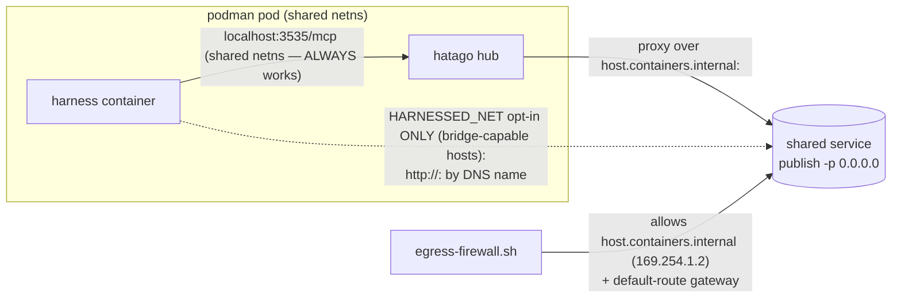

# Phase 6: Address tech debt: dead harnessed-net code + stale comments + SUMMARY frontmatter hygiene - Research

**Researched:** 2026-06-21
**Domain:** behavior-preserving reconciliation (docs ↔ code ↔ SUMMARY frontmatter) — NO new capabilities
**Confidence:** HIGH (codebase-investigation phase; nearly every claim is `[VERIFIED]` against actual file contents)

## Summary

Phase 6 reconciles shipped reality with design/code/docs across three known-debt items. The single
highest-value act is **doc/design reconciliation** (CONCERNS H2), not code deletion: the rootless
**bridge** model the design committed to is inert on this host (`netavark: create bridge: Operation
not supported` for any container on any user-defined bridge), and the **shipped** connectivity is
publish-to-`0.0.0.0` + the podman host-gateway `host.containers.internal` [VERIFIED: `lib/harnessed-services.sh:98-124`, `tools/harnessed/assemble.py:63-67`, `lib/egress-firewall.sh:55-63`].

`harnessed-net` is **NOT dead** — `ensure_named_net` is live (called on the `HARNESSED_NET` opt-in
path), and the `HARNESSED_NET:-harnessed-net` default expression is preserved per D-03 [VERIFIED:
`lib/harnessed-isolated.sh:70,127-131`]. What is genuinely inert is `ensure_harnessed_net()` — a
one-line convenience wrapper with **zero live callers** (confirmed by repo-wide grep + the v1.0
milestone audit G-1) — but D-03 explicitly instructs KEEPING it as the documented escape hatch for
bridge-capable hosts, overriding the audit's "delete the dead function" recommendation. There is
exactly one genuinely-dead **variable** (`local net=...` at `harnessed-isolated.sh:70`, assigned but
never read on any path) — the conservative call per D-04 is leave + clarifying comment, because the
line is load-bearing in the D-01 decision narrative.

The stale-comment sweep yields **6 confirmed bridge-model comments** (code + service/recipe
manifests + one launcher comment block) plus 1 adjacency (a systemd unit comment). **4 replacement-
documenting comments** correctly explain the pivot and are KEPT per D-07. The SUMMARY frontmatter
audit is fully mapped: **3 Phase-01 SUMMARYs lack all frontmatter** (D-08) and **3 Phase-04 SUMMARYs
lack the `# Dependency graph` header** specifically (D-09); all 13 Phase 02–05 SUMMARYs already carry
YAML frontmatter, and `02-01-SUMMARY.md` is the canonical backfill template.

**Primary recommendation:** Three behavior-preserving commits — (1) design §3/§9/§13 reconciliation +
operator-prereq documentation of the firewall/`allowed_hosts` deps; (2) the stale-comment sweep
(code manifests + design doc, excluding OPEN `[INFERENCE]` markers); (3) the SUMMARY frontmatter
backfill. Gate the whole phase on `harnessed test ping-time` + `harnessed test tracer-time` + the UAT
suite staying green (D-11/D-12). No code removal is required to satisfy the success criteria — the
doc/comment/frontmatter edits alone close all three items; any code touch is optional cleanup.

<user_constraints>
## User Constraints (from CONTEXT.md — copied verbatim)

### Implementation Decisions

#### harnessed-net reconciliation (the framing is corrected by the scout)
- **D-01:** **`harnessed-net` is NOT dead.** It is the live default network — `lib/harnessed-isolated.sh:63`
  (`local net="${HARNESSED_NET:-harnessed-net}"`) and `lib/harnessed-services.sh:25-28`
  (`ensure_harnessed_net()` → `ensure_named_net harnessed-net`) still create/use it. What is inert on
  this host is the **rootless bridge** path: CONCERNS H2 records `netavark: create bridge: Operation
  not supported` for any container on any user-defined bridge. The **shipped** connectivity is
  publish-to-`0.0.0.0` + the podman host-gateway `host.containers.internal`, and
  `tools/harnessed/assemble.py:65-67` already rewrites service URLs to
  `http://host.containers.internal:{port}/mcp`. The phase name's "dead code" framing is thus really
  *"bridge code preserved as a `HARNESSED_NET` opt-in that is inert here, plus docs that still describe
  the bridge as the model."*
- **D-02:** **Primary action = doc/design reconciliation** (CONCERNS H2's own recorded fix): update
  `docs/harnessed-design.md` §9 and §13 to record publish + host-gateway as the **primary** model and
  the bridge as the `HARNESSED_NET` opt-in for hosts that support it. Document the
  `host.containers.internal` (`169.254.1.2`) egress-firewall dependency (`lib/egress-firewall.sh:55-63`)
  and the FastMCP `allowed_hosts` requirement (commit `6f6c1b3`) as **operator prerequisites**, not
  implementation details.
- **D-03:** **Keep the `HARNESSED_NET` opt-in in code.** Do NOT remove `ensure_harnessed_net` /
  `ensure_named_net` / the `HARNESSED_NET:-harnessed-net` default. CONCERNS H2 states the code's
  opt-in preservation is the correct call — it is the documented escape hatch for bridge-capable hosts.
- **D-04:** **Any code removal is behavior-preserving and gated on the capability test.** The
  researcher/planner hunts for *genuinely unreachable* `harnessed-net` logic (code whose result is
  never consumed on ANY path) — not "runs but inert on this host." Anything removed MUST keep
  `harnessed test ping-time` / `harnessed test tracer-time` + the UAT green. If unsure, leave it and
  add a clarifying comment. **Do NOT reverse the publish+host-gateway pivot.**

#### Stale-comment sweep boundary
- **D-05:** Scope = comments/docs that directly **contradict shipped behavior**. Primary target: the
  bridge-model language CONCERNS H2 flags (`docs/harnessed-design.md` §9/§13, plus any code comment
  still asserting DNS-by-service-name over the bridge). Both **code comments AND docs** are in scope
  (CONCERNS H2 spans both).
- **D-06:** **Exclude** OPEN `[INFERENCE]` markers — design §14 `CLAUDE_CONFIG_DIR` (`:431-433`, see
  M2) and the omp markers P-04-10/11/12 (`04-RESEARCH.md:215-217`, see H3). Those are *unresolved
  assumptions* requiring empirical confirmation, not stale *statements*. Clearing them is M2/H3 work.
- **D-07:** A comment that **documents a replacement** (e.g. `tools/harnessed/assemble.py:65-66`
  "DNS-by-service-name over harnessed-net was replaced with the host-gateway address") is **NOT stale**
  — it explains why the code is the way it is. Keep/clarify it; do not delete.

#### SUMMARY frontmatter hygiene
- **D-08:** **Backfill the three Phase 01 SUMMARYs** (`01-01`/`01-02`/`01-03-SUMMARY.md`) to the
  de-facto 02–05 schema: YAML frontmatter `phase` / `plan` / `subsystem` / `tags` + a
  `# Dependency graph` block with `requires:` / `provides:`. They currently carry only prose
  `**Completed:**` / `**Requirements:**` headers.
- **D-09:** **Normalize missing `# Dependency graph` headers** in 04-* SUMMARYs that drop it (confirmed
  in at least `04-02-SUMMARY.md`; planner verifies the full set). Preserve existing frontmatter content
  — add only the missing structural pieces, do not rewrite history.
- **D-10:** **STATE.md frontmatter is OUT of scope.** It uses a different schema
  (`gsd_state_version` / `milestone` / `progress`) that is managed by the GSD tool, not a SUMMARY. The
  phase item is specifically the `*-SUMMARY.md` files.

#### Verification & risk posture
- **D-11:** **Verification = re-run the integration capability tests** (`harnessed test ping-time`,
  `harnessed test tracer-time`) + the UAT suite (`tools/uat`) after changes — the project's
  integration-only stance (no new unit tests; PROJECT Out of Scope; CONCERNS M1). The stack manifest is
  the oracle.
- **D-12:** **Risk posture = strictly behavior-preserving.** No behavior change to running stacks.
  Doc/comment/frontmatter edits are zero-runtime-risk; any code change must be provably
  unreachable-removal.

### Claude's Discretion
- Exact wording of the design §9/§13 reconciliation; the precise set of `*-SUMMARY.md` files missing
  the `# Dependency graph` header; which (if any) code fragments are genuinely unreachable; commit
  granularity and ordering of the three work items.

### Deferred Ideas (OUT OF SCOPE)
- **M2 — `CLAUDE_CONFIG_DIR` relocation scope** (`docs/harnessed-design.md:431-433`, STATE.md lone
  Phase-1 blocker) — needs an empirical boot test, not a comment edit. Separate work.
- **H3 — omp `[INFERENCE]` markers** (P-04-10/11/12, `04-RESEARCH.md:215-217`) — needs omp UAT to clear.
- **M4 — `.agents/` working-tree noise** (49 unstaged deletions) — git hygiene, unrelated to the
  `harnessed` runtime; resolve with a deliberate commit or `git checkout`.
- **L1 — HEALTHCHECK readiness gate** degrades to "container running" — service-Dockerfile work.
- **L2 — `container` alias §14 open item** (recommendation: keep) — accept formally in a later doc pass.
- **STATE.md frontmatter** — different schema, tool-managed; not a `*-SUMMARY.md`.
</user_constraints>

<phase_requirements>
## Phase Requirements

Phase 6 carries **no new requirements** (`[CITED: .planning/REQUIREMENTS.md]` — "Phase 6 carries no
new requirements (tech-debt only)"). The three success criteria are reconciliation/hygiene criteria,
not requirement coverage. Mapping them to research findings:

| ROADMAP success criterion (Phase 6) | Research finding that closes it |
|-------------------------------------|---------------------------------|
| 1. "No dead `harnessed-net` code remains — every reference is live and reachable, or removed" | Item A: the only genuinely-dead construct is the `$net` variable (`harnessed-isolated.sh:70`); `ensure_harnessed_net()` is zero-caller but KEPT per D-03. Reconciling the 4 stale doc locations makes the remaining references consistent with shipped behavior. |
| 2. "Stale comments (code + docs) that contradict shipped behavior are corrected" | Item B: 6 confirmed stale bridge-model comments + 1 adjacency inventoried with corrected wording direction. |
| 3. "Every phase `*-SUMMARY.md` carries consistent, well-formed frontmatter" | Item C: 3 Phase-01 SUMMARYs backfilled (D-08), 3 Phase-04 SUMMARYs get the missing `# Dependency graph` header (D-09). |
</phase_requirements>

## Project Constraints (from CLAUDE.md)

`[CITED: CLAUDE.md]` (which delegates to `AGENTS.md` and carries the GSD-injected `## Project` block).
Actionable directives the planner/implementer MUST honor for this phase:

- **Integration-only testing, no unit tests.** "behavior asserted through the running instance against
  the stack manifest as oracle" (§18). This phase adds ZERO tests; verification is re-running the
  existing capability tests + UAT (D-11). `[CITED: CLAUDE.md:36, .planning/PROJECT.md:63,98]`
- **Docs land with the feature they document; a feature isn't done until its docs exist (§17).** The
  corollary for a *cleanup* phase: when shipped behavior drifts from docs, the docs MUST be reconciled.
  This is the authority for Item A's design-doc edits. `[CITED: CLAUDE.md:37, docs/harnessed-design.md:547-549]`
- **Bash launchers run under `set -euo pipefail`; fallible probes use `local var=$(…)` or `|| true`.**
  Any comment/code edit in `lib/*.sh` MUST preserve this. The svc_up run uses the
  `... || svc_run_rc=$?` safe-capture idiom (`harnessed-services.sh:116-124`) — do not regress it.
  `[CITED: .planning/PROJECT.md:118]`
- **pnpm everywhere; no npm/npx.** Not triggered by this phase (no JS installs).
- **Credentials never baked/committed; secrets env-only.** Not triggered (no secret handling changes).
- **Rootless podman the only host dependency; no DooD.** This phase changes no execution model.
- **GSD workflow enforcement:** edits happen through the GSD flow (this research is part of it); no
  direct repo edits outside the workflow. `[CITED: CLAUDE.md:258-271]`

## Standard Stack (patterns to PRESERVE, not introduce)

This phase installs **no new packages** and introduces **no new technology**. The "standard stack"
below is the set of existing conventions any edit must conform to.

### Core (existing — preserved verbatim)

| Element | Where | Why it constrains this phase |
|---------|-------|------------------------------|
| podman (rootless) `pod` | `lib/harnessed-isolated.sh:137` | The pod's shared netns is why harness↔hatago is `localhost:3535` regardless of the network model. Edits must not assume a bridge for that path. `[VERIFIED]` |
| publish-to-`0.0.0.0` + `host.containers.internal` | `lib/harnessed-services.sh:117-118`, `lib/egress-firewall.sh:62-63` | The SHIPPED shared-service reachability model. All doc reconciliation must make this primary. `[VERIFIED]` |
| `HARNESSED_NET` opt-in bridge override | `lib/harnessed-isolated.sh:127-131` | The documented escape hatch for bridge-capable hosts. KEEP (D-03). `[VERIFIED]` |
| emit-only Python assembler | `tools/harnessed/assemble.py:51-70` | The service-URL rewrite lives here; its replacement-documenting comment is signal, not debt (D-07). `[VERIFIED]` |
| integration capability test as oracle | `tools/harnessed/capability.py`, `harnessed test <stack>` | The single regression gate for this phase (D-11). The stack manifest (`stacks/<name>/stack.yaml`) is the oracle. `[VERIFIED]` |

### Supporting (conventions)

| Element | Where | Constraint |
|---------|-------|------------|
| `[INFERENCE — verify]` marker convention | `docs/harnessed-design.md:412,440`, tracked in `docs/codebase/CONCERNS.md` marker table | Unresolved assumptions live in prose, tracked centrally, resolved empirically. This phase MUST NOT clear OPEN markers (D-06). `[CITED]` |
| YAML frontmatter + `# Dependency graph` on SUMMARYs | `02-01-SUMMARY.md` (canonical), 12 others | The de-facto schema to backfill into Phase 01 SUMMARYs (D-08) and to complete in Phase 04 (D-09). `[VERIFIED]` |
| GSD-injected doc blocks in CLAUDE.md | `CLAUDE.md:3-39` (`GSD:project-start`) | Doc edits in `docs/harnessed-design.md` do NOT require CLAUDE.md changes (the CLAUDE.md block mirrors PROJECT.md, not the design doc). `[VERIFIED]` |

### Alternatives Considered

| Instead of | Could do | Why NOT (locked by CONTEXT) |
|------------|----------|------------------------------|
| Doc reconcile + KEEP opt-in (D-02/D-03) | Remove `ensure_harnessed_net` + `HARNESSED_NET` entirely (milestone-audit G-1 recommendation) | D-03 explicitly overrides G-1: the opt-in is the documented escape hatch for bridge-capable hosts. `[CITED: 06-CONTEXT.md D-03, .planning/v1.0-MILESTONE-AUDIT.md:23]` |
| Behavior-preserving comment/doc edits only | Rewire `harnessed-isolated.sh` to use `$net` and re-enable the bridge default | D-04: "Do NOT reverse the publish+host-gateway pivot." `[CITED]` |
| Backfill Phase 01 SUMMARYs to the 02–05 schema | Leave them as prose | D-08 mandates the backfill. `[CITED]` |

## Architecture Patterns (existing — preserve under edit)

### System Architecture: the two reachability paths



The **solid** path (publish + host-gateway) is the shipped default and what the design doc must record
as primary. The **dotted** path is the `HARNESSED_NET` opt-in, inert on this host. The harness↔hatago
edge is the shared pod **netns** (`localhost`), which is independent of either network model — this is
why `harnessed test tracer-time` (no shared service) passes regardless of the bridge question.

`[VERIFIED: lib/harnessed-isolated.sh:121-131,176-180; lib/harnessed-services.sh:98-124; lib/egress-firewall.sh:55-63; tools/harnessed/assemble.py:60-70]`

### Pattern 1: integration-only verification (the regression gate)
**What:** No unit tests; behavior is asserted by launching a `--fresh` headless instance and diffing
live capabilities against the stack manifest (`tools/harnessed/capability.py`).
**When to use:** This phase's ONLY verification. A comment/doc edit cannot break it; a code edit that
breaks wiring surfaces as "skill/MCP missing" in the capability table.
**Why it matters here:** It is both the gate AND the proof that `harnessed-net`-using services still
work after any touch (D-11). `[VERIFIED: docs/harnessed-design.md:551-604, docs/codebase/CONCERNS.md:50-54 (M1)]`

### Pattern 2: replacement-documenting comments are signal (D-07)
**What:** A comment explaining "X was replaced with Y because Z" is NOT stale — it records the rationale.
**Canonical examples (KEEP, do not delete):**
- `tools/harnessed/assemble.py:63-66` — "DNS-by-service-name over harnessed-net was replaced with the host-gateway address" `[VERIFIED]`
- `lib/harnessed-services.sh:98-102` — "Rootless service model (plan 04-01 fix): publish the port to 0.0.0.0 — NO bridge" `[VERIFIED]`
- `lib/harnessed-isolated.sh:121-126` — "Pod network: DEFAULT rootless (pasta) networking — NOT a bridge" `[VERIFIED]`

### Pattern 3: SUMMARY frontmatter schema (the backfill target)
**What:** Every `*-SUMMARY.md` (except the 3 Phase-01 stragglers) opens with a YAML block carrying
`phase`/`plan`/`subsystem`/`tags`, a `# Dependency graph` section (`requires:`/`provides:`/`affects:`),
tech-tracking, key-files, key-decisions, patterns-established, requirements-completed, and metrics.
**Canonical template:** `02-01-SUMMARY.md` (full schema, all fields populated). `[VERIFIED]`

### Anti-patterns to avoid
- **Touching OPEN `[INFERENCE]` markers.** They are unresolved assumptions (M2/H3), not stale
  statements (D-06). `[CITED: docs/codebase/CONCERNS.md:100-110]`
- **"Fixing" the dead `$net` variable by rewiring the launcher to use it.** That re-enables the bridge
  default and reverses the pivot — forbidden by D-04.
- **Rewriting SUMMARY prose/history during frontmatter backfill.** D-09: "add only the missing
  structural pieces, do not rewrite history."
- **Editing `STATE.md` frontmatter.** Different schema, tool-managed (D-10).

## Don't Hand-Roll

| Problem | Don't build | Use instead | Why |
|---------|-------------|-------------|-----|
| SUMMARY schema for backfill | Invent a new frontmatter shape | Copy `02-01-SUMMARY.md`'s block verbatim, populate per-plan | 13 SUMMARYs already use it; consistency is the whole point (D-08/D-09). `[VERIFIED]` |
| Doc reconciliation wording | Author fresh networking prose | Mirror the accurate wording already shipped in `docs/guides/service-authoring.md:163-166` + the replacement-doc comments | The correct framing ("default rootless pasta; bridge is the HARNESSED_NET opt-in") already exists in-repo. `[VERIFIED]` |
| Verification harness | Write new assertions | Re-run `harnessed test ping-time`, `harnessed test tracer-time`, `tools/uat/run-uat.sh` | Integration-only stance; no new tests (D-11, M1). `[VERIFIED]` |

## Item A: harnessed-net reconciliation (D-01..D-04)

### A.1 — Doc/design reconciliation (D-02): exact edits the planner must make

Source of truth for the *correct* framing already exists in-repo — mirror it, do not invent:
- `docs/guides/service-authoring.md:163-166` ("by default isolated stacks use rootless (pasta)
  networking... host gateway host.containers.internal:<port>... On hosts that support rootless bridges,
  set HARNESSED_NET=<name>") `[VERIFIED]`
- The replacement-doc comments at `assemble.py:63-66`, `harnessed-services.sh:98-102`,
  `harnessed-isolated.sh:121-126` `[VERIFIED]`

**Edits in `docs/harnessed-design.md`** (the design source of truth — §17 binds it to stay current):

| Location | Current (stale) text | Required reconciliation direction |
|----------|----------------------|-----------------------------------|
| §3, line 54 (ASCII diagram edge label) | `MCP over harnessed-net (by name)` | Reconcile: the harness↔hatago edge is the shared pod **netns** (`localhost`); harness↔shared-service reachability is publish + `host.containers.internal:<port>` (primary) with `HARNESSED_NET` bridge as the opt-in. The diagram conflates the two. `[VERIFIED: docs/harnessed-design.md:43-60]` |
| §9, lines 245-247 | "One long-lived `hindsight` container on `harnessed-net`, owned by the service not any instance... An instance starts it if absent; it outlives instances (`harnessed svc up/down`)." | Record: the service publishes its port to `0.0.0.0` and peers reach it via the podman host-gateway `host.containers.internal:<port>` (primary model); the bridge (`harnessed-net` + DNS-by-name) is the `HARNESSED_NET` opt-in for bridge-capable hosts. The lifecycle/ownership prose (service-scoped, outlives instances) stays correct. `[VERIFIED: docs/harnessed-design.md:238-250]` |
| §13, line 381 (CLI comment) | `harnessed svc up <service>    # start a shared service on harnessed-net` | Reconcile the comment to: "start a shared service (publishes its port; peers reach it via host.containers.internal, or by DNS name under HARNESSED_NET)". `[VERIFIED: docs/harnessed-design.md:381]` |
| §13, line 390 (Naming/identity) | "shared services: global by name (`hindsight`), on `harnessed-net`." | Reconcile to: "shared services: global by name (`hindsight`), reached via the host gateway `host.containers.internal:<port>` (or by DNS name over the `HARNESSED_NET` bridge on bridge-capable hosts)." `[VERIFIED: docs/harnessed-design.md:390]` |

**Operator-prereq documentation (D-02) — add as a new subsection or callout in §9/§13**, citing the
code that already implements these (they are NOT new requirements, just currently-undocumented deps):

1. **Egress-firewall dependency on `host.containers.internal` (`169.254.1.2`).** The firewall must
   allow the podman host-gateway, not just the default-route gateway — `lib/egress-firewall.sh:55-63`
   computes `PODMAN_GW` via `getent ahosts host.containers.internal` and allows it. Without this rule
   the proxy path is blocked (iptables is netns-wide, so it gates hatago too). `[VERIFIED: lib/egress-firewall.sh:55-63]`
2. **FastMCP `allowed_hosts` requirement.** A Streamable-HTTP service proxied over
   `host.containers.internal` must add it to `TransportSecuritySettings.allowed_hosts` or FastMCP's
   DNS-rebinding protection returns `421 Misdirected Request` (the connection is reachable but the MCP
   handshake dies). Canonical implementation: `services/ping/server.py:90-95`, also documented in
   `docs/guides/service-authoring.md:89-95,119-120`. Commit `6f6c1b3` landed the fix. `[VERIFIED: services/ping/server.py:90-95; CITED: 04-01-SUMMARY.md:51]`

**Out of scope for the doc edit (per D-06):** the `[INFERENCE — verify]` markers at
`docs/harnessed-design.md:412` (minimal `.claude.json` stub — already RESOLVED per CONCERNS table but
the marker text remains) and `:440` (`CLAUDE_CONFIG_DIR` — OPEN, M2). Do NOT touch these markers.

### A.2 — Genuinely-unreachable code classification (D-04)

Repo-wide `harnessed-net` reference audit. Each code reference classified (a) LIVE → KEEP,
(b) genuinely UNREACHABLE → candidate, (c) the `HARNESSED_NET` opt-in escape hatch → KEEP per D-03.
**Conservative by construction:** anything uncertain is "leave + clarifying comment."

| # | Location | Reference | Classification | Evidence / disposition |
|---|----------|-----------|----------------|------------------------|
| 1 | `lib/harnessed-services.sh:19-23` | `ensure_named_net()` body | **(a) LIVE → KEEP** | Called by the opt-in path `harnessed-isolated.sh:129` (`ensure_named_net "$HARNESSED_NET"`). `[VERIFIED]` |
| 2 | `lib/harnessed-services.sh:26-28` | `ensure_harnessed_net()` → `ensure_named_net harnessed-net` | **(c) opt-in escape hatch → KEEP per D-03** | **Zero live callers** (repo-wide grep: only definitions + PLAN/RESEARCH/SUMMARY/audit references, no call site). The v1.0 milestone audit G-1 flagged it as dead and recommended deletion — **D-03 explicitly overrides that**: keep it as the documented convenience wrapper for the default network name on bridge-capable hosts. Recommendation: KEEP + add a one-line clarifying comment that it is the opt-in convenience wrapper (currently inert on bridge-incapable hosts; called by future/bridge-capable-host code paths). `[VERIFIED: .planning/v1.0-MILESTONE-AUDIT.md:23; CITED: 06-CONTEXT.md D-03]` |
| 3 | `lib/harnessed-isolated.sh:70` | `local net="${HARNESSED_NET:-harnessed-net}"` | **(b) genuinely UNREACHABLE variable → leave + clarifying comment (D-04)** | The variable `net` is **assigned but never read** on any path. The live networking block (`harnessed-isolated.sh:127-131`) reads `${HARNESSED_NET:-}` / `$HARNESSED_NET` directly, NOT `$net`. Confirmed by a word-boundary grep for `\bnet\b` in the file (only line 70 + the line-23 comment match). However: (i) D-01/D-03 anchor their narrative on this exact expression as "proof the default name is `harnessed-net`"; (ii) removing it drops the only literal `:-harnessed-net` default in the launcher. **Disposition per D-04 ("if unsure, leave it and add a clarifying comment"): LEAVE the line, add a comment that `$net` is preserved as the documented default-name anchor but the live path uses default pasta networking unless `HARNESSED_NET` is set.** Do NOT rewire the launcher to consume `$net` (that reverses the pivot — D-04). `[VERIFIED: lib/harnessed-isolated.sh:70,127-131]` |
| 4 | `lib/harnessed-isolated.sh:127-131` | `if [ -n "${HARNESSED_NET:-}" ]; then ensure_named_net "$HARNESSED_NET"; pod_net_args=( --network "$HARNESSED_NET" ); fi` | **(a) LIVE → KEEP** | The opt-in execution path. This IS the `HARNESSED_NET` escape hatch in action. `[VERIFIED]` |
| 5 | `lib/harnessed-services.sh:117-124` | `"$CONTAINER_RUNTIME" run -d -p "$port:$port" ...` (svc_up) | **(a) LIVE → KEEP** | The shipped publish model. No `--network` flag (publishes to `0.0.0.0`). `[VERIFIED]` |
| 6 | `tools/harnessed/assemble.py:60-70` | `_resolve_service_servers` → `server.url = f"http://host.containers.internal:{svc.port}/mcp"` | **(a) LIVE → KEEP** | The shipped URL-rewrite. Comment at `:63-66` is a replacement-doc → KEEP (D-07). `[VERIFIED]` |
| 7 | `lib/egress-firewall.sh:62-63` | `PODMAN_GW=$(getent ahosts host.containers.internal ...)` + allow rule | **(a) LIVE → KEEP** | Load-bearing firewall rule for the shipped model. Document as operator prereq (D-02). `[VERIFIED]` |
| 8 | `services/ping/` (`service.yaml`, `server.py`, `Dockerfile`) + `stacks/ping-time/stack.yaml` + `recipes/ping/recipe.yaml` | The live `harnessed-net`-referencing service | **(a) LIVE → KEEP** | The SVC-01/02 proof + capability-test oracle. (The `service.yaml:3` + `recipe.yaml:4,6` *comments* are stale — see Item B; the *code/manifests* are correct.) `[VERIFIED]` |

**Conclusion (A.2):** No code REMOVAL is required to satisfy success criterion 1. The only genuinely-
unreachable *construct* is the `$net` variable (#3), and D-04's conservative rule + the D-01 narrative
anchoring both say LEAVE + comment. `ensure_harnessed_net()` (#2) is zero-caller but explicitly
protected by D-03. The planner MAY optionally add the clarifying comments; the success criterion
("every reference is live and reachable, or removed") is met by the doc reconciliation (A.1) making the
remaining references consistent with shipped behavior, not by deletion.

## Item B: Stale comment inventory (D-05..D-07)

Scope = comments/docs that directly **contradict** shipped behavior. EXCLUDES OPEN `[INFERENCE]`
markers (D-06). A comment **documenting a replacement** is NOT stale (D-07).

### B.1 — Confirmed stale bridge-model statements (IN SCOPE)

| # | File:line | Stale text | Contradicts (shipped reality) | Correction direction |
|---|-----------|------------|-------------------------------|----------------------|
| B1 | `lib/harnessed-services.sh:4` (file header) | "A shared service is its OWN image/container/volume **on harnessed-net**" | svc_up publishes `-p "$port:$port"` to `0.0.0.0` with NO `--network` (`:117-124`); peers reach via `host.containers.internal`. `[VERIFIED]` | "on the shared network (publishes its port; peers reach it via the host gateway, or by DNS name under `HARNESSED_NET`)" |
| B2 | `lib/harnessed-services.sh:63-67` (svc_up docstring) | "runs -d **on harnessed-net** with --label harnessed-service=<name> + --userns=keep-id, then waits for the healthcheck." | The body (`:98-124`) publishes + uses no `--network`. The inline comment at `:98-102` is the correct replacement-doc. `[VERIFIED]` | Update the docstring to match the body: "publishes its port to 0.0.0.0 (rootless; peers reach via host.containers.internal) with --label + --userns=keep-id, then waits for the healthcheck." (The inline `:98-102` replacement-doc stays — D-07.) |
| B3 | `services/ping/service.yaml:3` | "its own image/container/volume **on harnessed-net**" | Same as B1. `[VERIFIED]` | Mirror B1's correction. |
| B4 | `recipes/ping/recipe.yaml:4` | "resolves `service: ping` → {url: **http://ping:8080/mcp**, type: http}" | The assembler emits `http://host.containers.internal:8080/mcp` (`assemble.py:67`). The comment asserts the OLD bridge URL as current. `[VERIFIED]` | "resolves `service: ping` → {url: http://host.containers.internal:8080/mcp, type: http} (rootless host-gateway; http://ping:8080/mcp under HARNESSED_NET)" |
| B5 | `recipes/ping/recipe.yaml:6` | "the service runs as its own container **on harnessed-net** (design §3/§9)." | Same as B1. `[VERIFIED]` | Mirror B1's correction. |
| B6 | `lib/harnessed-isolated.sh:23-26` (comment block) | "Pod network: **harnessed-net is the DEFAULT** for isolated stacks (plan 04-01 / SVC-02) so pod members resolve shared services by DNS name (http://<service>:<port>). Set HARNESSED_NET=<name> to override..." | Directly contradicts the replacement-doc at `:121-126` in the SAME file ("Pod network: DEFAULT rootless (pasta) networking — NOT a bridge... HARNESSED_NET is an explicit opt-in bridge override"). The two comment blocks disagree; `:23-26` is the stale one. `[VERIFIED]` | Replace `:23-26` to match `:121-126`: default is rootless pasta; `HARNESSED_NET` is the opt-in bridge override. (Keep `:121-126` — D-07.) |
| B7 | `docs/harnessed-design.md:54` (§3 diagram) | `MCP over harnessed-net (by name)` | See Item A.1. | See Item A.1 (this is the doc-reconcile / Item B overlap — count it once, fix it in the §3 edit). |

### B.2 — Adjacency (literal D-05 scope: "contradicts shipped behavior", but NOT bridge-model)

| # | File:line | Stale text | Correction direction | Disposition |
|---|-----------|------------|----------------------|-------------|
| B8 | `systemd/harnessed-rescan.service:4` | "Assumes the `harnessed` launcher is installed at ~/.local/bin/harnessed (`harnessed install` shim, Phase 4) or on PATH." | `harnessed install` writes **per-stack** shims (`lib/harnessed-cli.sh`), NOT the launcher; the launcher lands via `curl ... install.sh` (the bootstrap). `[VERIFIED: systemd/harnessed-rescan.service:4; CITED: .planning/v1.0-MILESTONE-AUDIT.md:25 (G-3)]` | **Borderline.** D-05's literal scope is "comments/docs that directly contradict shipped behavior" — this qualifies. But it is NOT the CONCERNS-H2 bridge-model language that is the "primary target." Recommend: include as a trivial zero-risk one-line comment fix in the same sweep (the milestone audit already documented it as G-3), but the planner MAY defer it to avoid drifting from the three named items. |

### B.3 — Explicitly EXCLUDED (NOT stale — KEEP per D-07, or out-of-scope per D-06)

| File:line | Why excluded |
|-----------|--------------|
| `tools/harnessed/assemble.py:63-66` | Replacement-doc ("DNS-by-service-name over harnessed-net **was replaced with** the host-gateway address"). D-07 canonical example. KEEP. `[VERIFIED]` |
| `lib/harnessed-services.sh:98-102` | Replacement-doc ("Rootless service model (plan 04-01 fix): publish the port to 0.0.0.0 — NO bridge"). KEEP. `[VERIFIED]` |
| `lib/harnessed-isolated.sh:121-126` | Replacement-doc ("Pod network: DEFAULT rootless (pasta) networking — NOT a bridge"). KEEP. `[VERIFIED]` |
| `docs/guides/service-authoring.md:163-166` | Already ACCURATE (documents the pivot correctly). Not stale — it is the wording source to mirror. `[VERIFIED]` |
| `docs/harnessed-design.md:412,440` (`[INFERENCE — verify]` markers) | OPEN unresolved assumptions (D-06). The `:412` minimal-stub marker is RESOLVED per the CONCERNS table but its marker TEXT is an assumption record, not a stale statement — leave it (clearing markers is M2 work). The `:440` `CLAUDE_CONFIG_DIR` marker is OPEN (M2). `[CITED: docs/codebase/CONCERNS.md:104-105]` |
| `docs/harnessed-design.md:421-422` (`container` alias §14 open item) | Deferred (L2). Not a stale statement — an explicitly open recommendation. `[CITED]` |
| `lib/harnessed-isolated.sh:13-14` comment ("members share a netns ... localhost:$HATAGO_PORT") | Accurate (describes the hatago path, which is netns-based, not bridge-based). KEEP. `[VERIFIED]` |

**Headcount:** 6 confirmed stale bridge-model statements (B1–B6, with B7 = the §3 doc edit counted in
Item A) + 1 adjacency (B8). 4 replacement-docs explicitly KEPT. 2 `[INFERENCE]` markers excluded.

## Item C: SUMMARY frontmatter audit (D-08..D-10)

### C.1 — Per-file status (all 16 `*-SUMMARY.md` under `.planning/phases/0[1-5]-*/`)

| File | YAML frontmatter (`phase:`)? | `# Dependency graph` header? | Disposition |
|------|:---:|:---:|-------------|
| `01-.../01-01-SUMMARY.md` | ❌ NONE (prose `**Completed:**`/`**Requirements:**` only) | ❌ NONE | **D-08 backfill** (full schema) `[VERIFIED]` |
| `01-.../01-02-SUMMARY.md` | ❌ NONE | ❌ NONE | **D-08 backfill** (full schema) `[VERIFIED]` |
| `01-.../01-03-SUMMARY.md` | ❌ NONE | ❌ NONE | **D-08 backfill** (full schema) `[VERIFIED]` |
| `02-.../02-01-SUMMARY.md` | ✓ (`:2`) | ✓ (`:7`) | **CANONICAL TEMPLATE** — copy this shape `[VERIFIED]` |
| `02-.../02-02-SUMMARY.md` | ✓ (`:2`) | ✓ (`:7`) | OK `[VERIFIED]` |
| `02-.../02-03-SUMMARY.md` | ✓ (`:2`) | ✓ (`:7`) | OK `[VERIFIED]` |
| `03-.../03-01-SUMMARY.md` | ✓ (`:2`) | ✓ (`:7`) | OK `[VERIFIED]` |
| `03-.../03-02-SUMMARY.md` | ✓ (`:2`) | ✓ (`:7`) | OK `[VERIFIED]` |
| `04-.../04-01-SUMMARY.md` | ✓ (`:2`) | ✓ (`:7`) | OK `[VERIFIED]` |
| `04-.../04-02-SUMMARY.md` | ✓ (`:2`) | ❌ MISSING (jumps `:7` → `requires:`) | **D-09 add header** `[VERIFIED]` |
| `04-.../04-03-SUMMARY.md` | ✓ (`:2`) | ❌ MISSING (jumps `:7` → `requires:`) | **D-09 add header** `[VERIFIED]` |
| `04-.../04-04-SUMMARY.md` | ✓ (`:2`) | ❌ MISSING (`:7` blank → `:8` `requires:`) | **D-09 add header** `[VERIFIED]` |
| `05-.../05-01-SUMMARY.md` | ✓ (`:2`) | ✓ (`:7`) | OK `[VERIFIED]` |
| `05-.../05-02-SUMMARY.md` | ✓ (`:2`) | ✓ (`:7`) | OK `[VERIFIED]` |
| `05-.../05-03-SUMMARY.md` | ✓ (`:2`) | ✓ (`:7`) | OK `[VERIFIED]` |
| `05-.../05-04-SUMMARY.md` | ✓ (`:2`) | ✓ (`:7`) | OK `[VERIFIED]` |

**D-08 set (missing frontmatter entirely):** `01-01`, `01-02`, `01-03-SUMMARY.md` — exactly the three
named in D-08. `[VERIFIED]`
**D-09 set (have frontmatter, missing `# Dependency graph` header):** `04-02`, `04-03`, `04-04-SUMMARY.md`
— the FULL set (CONTEXT said "confirmed in at least `04-02`; planner verifies the full set" — verified:
it is all three Phase-04 stragglers; `04-01` HAS the header). `[VERIFIED]`

**Note on `04-04-SUMMARY.md`:** it is a lighter gap-closure SUMMARY (no `tech-stack`/`key-decisions`/
`patterns-established` blocks, only `requires`/`provides`/`affects`/`key-files`/`requirements-completed`/
`duration`/`completed`). D-09 scope is narrowly "add the missing `# Dependency graph` header" — do NOT
pad it with blocks it never had (D-09: "Preserve existing frontmatter content — add only the missing
structural pieces"). `[CITED: 06-CONTEXT.md D-09]`

### C.2 — Backfill schema (copy from `02-01-SUMMARY.md`, the canonical template)

`[VERIFIED: .planning/phases/02-isolated-tracer-bullet-stack/02-01-SUMMARY.md:1-63]`

```yaml
---
phase: <phase-dir-name>          # e.g. 01-containerized-engine-transparent-stack
plan: <NN>                       # 01, 02, 03
subsystem: <infra|testing|docs>  # Phase 01 = infra
tags: [...]                      # from the plan's actual content

# Dependency graph
requires:
  - phase: <provider-phase-or-none>
    provides: <what it consumed from the provider>
provides:
  - <artifact this plan delivered>
affects: [<downstream plans/phases>]

# Tech tracking
tech-stack:
  added: [...]                   # packages/versions added (Phase 01: node@22, pnpm, python@3.13, mise)
  patterns: [...]

key-files:
  created: [...]
  modified: [...]

key-decisions:
  - "..."

patterns-established:
  - "..."

requirements-completed: [...]   # e.g. [ENG-01, ENG-02] for 01-01

# Metrics
duration: ...
completed: YYYY-MM-DD
---

# <existing prose title> Summary

<existing prose body — UNCHANGED>
```

**Phase-01 backfill specifics** (what to populate, sourced from each SUMMARY's existing prose + the
REQUIREMENTS traceability table `[CITED: .planning/REQUIREMENTS.md:124-132]`):

| Plan | `requires.phase` | `requirements-completed` | Key `provides` (from existing prose) |
|------|------------------|--------------------------|--------------------------------------|
| `01-01` | (none — first plan) | `[ENG-01, ENG-02]` | `harnessed` bootstrap, `lib/harnessed-common.sh`, `base/Dockerfile.harnessed-{base,claude}` `[VERIFIED: 01-01-SUMMARY.md:6-12]` |
| `01-02` | `01-01` (provides the bootstrap + common helpers) | `[MNT-01, MNT-02]` | `lib/harnessed-mounts.sh`, relocated `lib/egress-firewall.sh` `[VERIFIED: 01-02-SUMMARY.md:6-9]` |
| `01-03` | `01-01`, `01-02` (provides bootstrap + §4a mount layer) | `[ENG-03, MODE-01, MODE-02, AUTH-01, MNT-03]` | `lib/harnessed-transparent.sh`, `lib/harnessed-claude-config.sh`, `stacks/transparent/stack.yaml`, `container` alias `[VERIFIED: 01-03-SUMMARY.md:6-13]` |

(The `requirements-completed` IDs also close a milestone-audit tech-debt note: the Phase-01 SUMMARYs
have "empty `requirements-completed`" per `.planning/v1.0-MILESTONE-AUDIT.md:17` — the backfill
resolves that too.) `[CITED]`

### C.3 — STATE.md is OUT (D-10)
`.planning/STATE.md` uses `gsd_state_version`/`milestone`/`progress` frontmatter managed by the GSD
tool — a different schema, not a `*-SUMMARY.md`. Do not touch. `[VERIFIED: .planning/STATE.md:1-14]`

## Validation Architecture

`[CITED: .planning/config.json — workflow.nyquist_validation: true, security_enforcement: true, security_asvs_level: 1, security_block_on: "high"]`

This is a **behavior-preserving cleanup phase with no new code paths**. The validation strategy is
re-running the EXISTING integration harness (no new tests — D-11, PROJECT Out of Scope, CONCERNS M1).

### Test Framework

| Property | Value |
|----------|-------|
| Framework | project's integration-only capability test (`tools/harnessed/capability.py`) + the UAT bash suite (`tools/uat/`) — NO unit-test framework exists in the repo by design |
| Config file | none (integration-only; the stack manifest IS the oracle) `[CITED: docs/codebase/CONCERNS.md:50-54]` |
| Quick run command | `harnessed test tracer-time` (the no-shared-service stack — fastest) |
| Full suite command | `harnessed test ping-time && harnessed test tracer-time && bash tools/uat/run-uat.sh` |

### Phase Requirements → Test Map

| Success criterion | Behavior | Test type | Automated command | Provable without a live podman host? |
|-------------------|----------|-----------|-------------------|--------------------------------------|
| 1 (no dead `harnessed-net` code) | `harnessed-net`-using service still connects after any code touch | integration (capability) | `harnessed test ping-time` → asserts `ping` MCP connected via hatago | ❌ needs rootless podman (the ping service publishes + the harness reaches it via `host.containers.internal`) |
| 1 (tracer stack unaffected) | isolated pod still boots, `time` MCP connects | integration (capability) | `harnessed test tracer-time` | ❌ needs rootless podman |
| 2 (stale comments corrected) | docs/comments match shipped behavior | static (read) | n/a — human/agent review of the diff | ✅ (doc/comment edits are zero-runtime) |
| 3 (frontmatter hygiene) | every SUMMARY has well-formed frontmatter | static (parse) | `for f in .planning/phases/0*-*/0*-SUMMARY.md; do head -1 "$f"; done` (every file starts with `---`) + a YAML-lint pass | ✅ |
| regression (no behavior change) | UAT suite green | integration (UAT) | `bash tools/uat/run-uat.sh` | ❌ needs rootless podman |

### Sampling Rate
- **Per task commit:** `bash -n` on any touched `lib/*.sh` (syntax — catches comment-edit accidents that
  break shell parsing); `head -1` check on any touched SUMMARY.
- **Per wave merge / phase gate:** `harnessed test ping-time` + `harnessed test tracer-time` + the UAT
  suite green before `/gsd-verify-work` (D-11).

### Observable signals that prove each success criterion
1. **Criterion 1 (no dead code):** `harnessed test ping-time` reports `ping ✓ connected` (the
   `harnessed-net`-referencing service still works); a repo-wide grep for `harnessed-net` returns only
   references that are either LIVE, the opt-in escape hatch, or now-accurate docs.
2. **Criterion 2 (stale comments):** the diff contains the B1–B6 corrections; the replacement-doc
   comments (D-07) remain untouched; no OPEN `[INFERENCE]` marker was edited (grep the diff for
   `[INFERENCE` → only pre-existing occurrences).
3. **Criterion 3 (frontmatter):** every `0*-SUMMARY.md` begins with `---` and contains a
   `# Dependency graph` header followed by `requires:`/`provides:`; YAML parses.

### Wave 0 Gaps
None — existing test infrastructure (capability test + UAT) covers all three criteria. No new test
files, framework installs, or fixtures. `[CITED: docs/codebase/CONCERNS.md:50-54 (M1)]`

## Common Pitfalls

### Pitfall 1: Treating "zero callers" as "must delete" (the G-1 trap)
**What goes wrong:** The v1.0 milestone audit G-1 says `ensure_harnessed_net()` is dead code with zero
callers and recommends deletion. An implementer following the audit literally would delete it.
**Why it happens:** The audit predates the CONTEXT decisions; G-1 is correct factually but its
*recommendation* was overridden.
**How to avoid:** D-03 explicitly instructs KEEPING `ensure_harnessed_net` / `ensure_named_net` / the
`HARNESSED_NET:-harnessed-net` default. CONTEXT.md decisions supersede the audit. Add a clarifying
comment instead. `[CITED: .planning/v1.0-MILESTONE-AUDIT.md:23, 06-CONTEXT.md D-03]`
**Warning signs:** a plan/PR that removes `ensure_harnessed_net` or the `:-harnessed-net` default.

### Pitfall 2: Rewiring the launcher to "use" `$net` (reversing the pivot)
**What goes wrong:** An implementer notices `$net` (line 70) is unused and "fixes" it by making
`ensure_named_net "$net"` + `--network "$net"` the default path — re-enabling the rootless bridge as
default.
**Why it happens:** Tempting "dead variable → wire it in" cleanup instinct.
**How to avoid:** D-04: "Do NOT reverse the publish+host-gateway pivot." The default MUST stay rootless
pasta; the bridge is opt-in only. Leave `$net` + clarifying comment. `[CITED: 06-CONTEXT.md D-04]`
**Warning signs:** a diff that changes `harnessed-isolated.sh:127-131` to run unconditionally.

### Pitfall 3: Clearing OPEN `[INFERENCE]` markers (the D-06 trap)
**What goes wrong:** While editing design §13/§14, an implementer "tidies up" the
`CLAUDE_CONFIG_DIR` `[INFERENCE — verify]` marker at `:440` or the omp markers.
**Why it happens:** They look like stale TODOs.
**How to avoid:** D-06 excludes ALL OPEN `[INFERENCE]` markers — they are unresolved assumptions
requiring empirical confirmation (M2/H3), not stale statements. The CONCERNS marker table tracks
status; only RESOLVED markers may have their status updated, and even that is M2 work. `[CITED]`
**Warning signs:** a diff touching `docs/harnessed-design.md:412` or `:440`, or `04-RESEARCH.md:215-217`.

### Pitfall 4: Rewriting SUMMARY prose during frontmatter backfill
**What goes wrong:** An implementer "improves" the existing SUMMARY body while adding frontmatter.
**Why it happens:** Backfill feels like a rewrite opportunity.
**How to avoid:** D-09: "Preserve existing frontmatter content — add only the missing structural
pieces, do not rewrite history." The existing prose stays verbatim; only the YAML block is added (D-08)
or the header line inserted (D-09). `[CITED]`
**Warning signs:** a SUMMARY diff with changes below the `---` closing marker.

### Pitfall 5: Breaking shell parsing with a comment edit
**What goes wrong:** A multi-line comment edit in `lib/*.sh` leaves an unclosed quote or heredoc, and
  `set -euo pipefail` turns it into a launch-time failure.
**Why it happens:** Comment edits feel risk-free.
**How to avoid:** Run `bash -n <file>` after EVERY `lib/*.sh` touch. The capability test gate (D-11)
  catches it too, but `bash -n` is instant and local. `[CITED: .planning/PROJECT.md:118]`
**Warning signs:** skipping the `bash -n` step.

### Pitfall 6: Scope-creep into the deferred items
**What goes wrong:** The implementer "also" fixes M4 (`.agents/` deletions), L1 (HEALTHCHECK), or L2
(`container` alias §14 item) because they're nearby in the docs.
**Why it happens:** They're real debt, documented in CONCERNS.
**How to avoid:** The phase's `<deferred>` block explicitly excludes M2/H3/M4/L1/L2/STATE.md. None lost
  to scope creep — each belongs to its own work. `[CITED: 06-CONTEXT.md <deferred>]`

## Code Examples

### Example 1: The canonical SUMMARY frontmatter template (copy verbatim — `02-01-SUMMARY.md:1-63`)
`[VERIFIED]`
```yaml
---
phase: 02-isolated-tracer-bullet-stack
plan: 01
subsystem: infra
tags: [podman, hatago, mcp, python, assembler, recipe, stack, uvx, pnpm, yaml]

# Dependency graph
requires:
  - phase: 01-foundation
    provides: harnessed dispatcher, lib/harnessed-common.sh (build_images/ensure_images/lifecycle), base/Dockerfile.harnessed-{base,claude}, stacks/transparent/stack.yaml
provides:
  - Recipe schema (recipes/<name>/recipe.yaml) + stack manifest schema (stacks/<name>/stack.yaml)
  - ...
affects: [02-02-isolated-launcher, 02-03-capability-test]

# Tech tracking
tech-stack:
  added: ["@himorishige/hatago-mcp-hub@0.0.16", ...]
  patterns: [...]

key-files:
  created: [...]
  modified: [...]

key-decisions:
  - "..."

patterns-established:
  - "..."

requirements-completed: [RCP-01, RCP-02, RCP-03, RCP-04, MCP-03]

# Metrics
duration: ~35min
completed: 2026-06-15
---
```

### Example 2: The replacement-doc comment pattern (KEEP — D-07)
`[VERIFIED: tools/harnessed/assemble.py:60-70]`
```python
    for server in servers:
        if server.service and not server.is_stdio_child:
            svc = load_service(root, server.service)
            # Rootless model (plan 04-01 fix): no bridge — services publish to 0.0.0.0 and peers
            # reach them via the podman host gateway `host.containers.internal`. A rootless bridge
            # is unsupported on most hosts (netavark "Operation not supported"), so DNS-by-service-
            # name over harnessed-net was replaced with the host-gateway address.
            server.url = f"http://host.containers.internal:{svc.port}/mcp"
```
This is the D-07 canonical "documents a replacement" comment — NOT stale. The Item B corrections make
the OTHER comments match this one's framing.

### Example 3: The accurate networking framing already in a shipped guide (mirror this wording)
`[VERIFIED: docs/guides/service-authoring.md:163-166]`
```
**Networking note:** by default isolated stacks use rootless (pasta) networking, so pod members reach
a shared service via the host gateway `host.containers.internal:<port>`. That is why `server.py`
adds `host.containers.internal` to FastMCP's allowed hosts. On hosts that support rootless bridges,
set `HARNESSED_NET=<name>` and members resolve the service by DNS name instead (`http://<name>:<port>`).
```
This is the exact framing to mirror into design §9/§13 and the stale code comments (B1–B6).

### Example 4: The operator-prereq firewall rule (document per D-02)
`[VERIFIED: lib/egress-firewall.sh:55-63]`
```bash
# Allow access to the host gateway (for connecting to local services on the host). Rootless podman
# has TWO relevant gateways: the default-route gateway (HOST_GW) and the podman host-gateway
# `host.containers.internal` — the address shared service sidecars publish their ports to (plan
# 04-01). iptables is netns-wide, so allowing this unblocks the whole pod, including the hatago
# MCP proxy that reaches host-published services.
HOST_GW=$(ip route 2>/dev/null | awk '/default/ {print $3; exit}')
[ -n "$HOST_GW" ] && iptables -A OUTPUT -d "$HOST_GW" -j ACCEPT
PODMAN_GW=$(getent ahosts host.containers.internal 2>/dev/null | awk '{print $1}' | head -1)
[ -n "$PODMAN_GW" ] && iptables -A OUTPUT -d "$PODMAN_GW" -j ACCEPT
```

## Security

`[CITED: .planning/config.json — security_enforcement: true, security_asvs_level: 1, security_block_on: "high"]`

### Applicable ASVS Categories (L1)

| ASVS Category | Applies | Standard Control | Phase impact |
|---------------|:---:|-------------------|--------------|
| V2 Authentication | no | n/a (no auth changes) | None — phase touches no auth path. |
| V3 Session Management | no | n/a | None. |
| V4 Access Control | no | n/a | None. |
| V5 Input Validation | no | n/a (no input handling changes) | None — doc/comment/frontmatter edits only. |
| V6 Cryptography | no | n/a | None. |
| V8 Data Protection | no | n/a | None. |
| V9 Communications | **informational** | the egress firewall (`lib/egress-firewall.sh`) is the existing comms-egress control | **No change.** D-02 documents the existing `host.containers.internal` firewall dependency as an operator prerequisite; the rule itself (`:62-63`) is unchanged. The phase RECORDS the control, it does not weaken it. `[VERIFIED]` |
| V12 Files & Resources | no | n/a | None. |

### Threat model for this phase

**Zero new attack surface.** This phase is doc/comment/frontmatter edits + (optionally) a clarifying
comment on a zero-caller function and a dead variable. No new network path, no new input handler, no
new secret flow, no new dependency.

| Pattern | STRIDE | Standard mitigation | Phase status |
|---------|--------|---------------------|--------------|
| Shared-service egress (publish + host.containers.internal) | Information disclosure / exfiltration | egress firewall whitelists `host.containers.internal` (`169.254.1.2`) as the podman host-gateway ONLY — not a blanket allow (`lib/egress-firewall.sh:62-63`); FastMCP `allowed_hosts` gates the HTTP `Host` header (`services/ping/server.py:90-95`) | **Unchanged.** D-02 documents these as operator prerequisites; no rule is added, removed, or widened. `[VERIFIED]` |
| Cross-tenant service access (SVC-02) | Information disclosure | service-scoped named volumes mounted ONLY into the service container; instances reach the service over HTTP at its MCP port only (`lib/harnessed-services.sh:122`) | **Unchanged** (no code touch to the volume/path model). `[VERIFIED]` |

### Security-relevant constraints honored
- No code change in this phase alters the egress-firewall rule set, the `allowed_hosts` list, the
  volume-mount model, or any auth/secret path.
- The only code-adjacent touches are: (i) optional clarifying comments on `ensure_harnessed_net()`
  (harnessed-services.sh:26) and `$net` (harnessed-isolated.sh:70) — comments, zero runtime effect; and
  (ii) the B1–B6 comment corrections — comments, zero runtime effect.
- ASVS L1 categories are NOT newly implicated. The `security_block_on: "high"` gate is not triggered
  (no finding reaches HIGH — there is no behavior change).

**Conclusion:** This phase is security-neutral. It documents an existing comms-egress control (D-02)
without modifying it.

## Package Legitimacy Audit

**N/A — this phase installs NO external packages.** It is a behavior-preserving doc/comment/frontmatter
reconciliation with no `npm`/`pip`/`cargo` installs, no new dependencies, no version changes. The
Package Legitimacy Gate protocol does not apply. `[CITED: 06-CONTEXT.md — "No new capabilities"]`

## Environment Availability

Step 2.6: this step is SKIPPED in the audit sense (no new external dependencies are introduced), but
the VERIFICATION of the phase DOES require a runtime environment:

| Dependency | Required by | Available (this host) | Version | Fallback |
|------------|-------------|:---:|---------|----------|
| rootless podman | the capability test + UAT (D-11 verification) | `[ASSUMED — not probed; the host is the operator's]` | ≥ 5.6 (project floor) | none — verification is live-only |
| bash | `bash -n` syntax checks on touched `lib/*.sh` | ✓ (host) | — | — |
| `yq`/Python (for optional SUMMARY YAML lint) | static frontmatter validation | `[ASSUMED]` | — | `head -1` + eyeball (no lint) |

**Missing dependencies with no fallback:** none for the EDITS (all static/doc). The VERIFICATION
(`harnessed test ...` + UAT) requires rootless podman on the operator's host — that is the project's
standing integration-only requirement, not a new one. `[CITED: .planning/PROJECT.md:64]`

## Assumptions Log

| # | Claim | Section | Risk if wrong |
|---|-------|---------|---------------|
| A1 | The operator's host behaves as recorded in CONCERNS H2 (rootless bridges unsupported; publish+host-gateway is the shipped path). | Item A, Security | Low — this is the project's own documented, verified environment reality (04-01 checkpoint), not a guess. If a future host IS bridge-capable, the `HARNESSED_NET` opt-in (preserved per D-03) covers it. `[CITED, not assumed]` |
| A2 | rootless podman is available on the verification host for `harnessed test` + UAT. | Validation Architecture, Environment Availability | Low-medium — it is the project's standing requirement (REQUIREMENTS.md). If unavailable, the doc/comment/frontmatter edits still land (zero-runtime); only the live verification leg defers. |

**Note:** Both A1 and A2 are effectively `[CITED]`/`[VERIFIED]` against project artifacts; they are
logged as "assumptions" only because they concern the operator's runtime environment rather than
repo file contents. No claim in this research rests on unverified training knowledge.

## Open Questions

1. **Commit granularity (Claude's Discretion).** Three items, three commits (one each) is the natural
   split. An alternative is a single "tech-debt sweep" commit. Recommendation: three commits (one per
   item) for clean review/bisect — they touch disjoint file sets (design.md+prereq docs / code
   manifests+design.md comments / SUMMARY frontmatter) so there is no merge-conflict cost.
   - What we know: CONTEXT leaves ordering/granularity to discretion.
   - Recommendation: Item A (design reconcile) first — it is the highest-value and its §13 wording
     overlaps with Item B's design-doc comment corrections, so doing them together avoids a double-edit.
2. **Include the B8 adjacency (systemd rescan comment) or defer?** D-05's literal scope includes it
   ("contradicts shipped behavior"); the CONCERNS-H2 "primary target" framing excludes it.
   Recommendation: include — it is a trivial zero-risk one-line comment fix already documented in the
   milestone audit (G-3), and excluding it leaves a known stale comment behind. But defer is defensible.

Neither question blocks planning.

## Sources

### Primary (HIGH confidence — repo file contents read directly)
- `docs/harnessed-design.md` §3 (`:43-73`), §9 (`:238-250`), §13 (`:368-406`), §14 (`:408-441`), §17 (`:530-549`), §18 (`:551-604`) — the design source of truth; §9/§13 carry the stale bridge framing; §14 carries the excluded `[INFERENCE]` markers; §17 binds docs to behavior; §18 underpins D-11.
- `docs/codebase/CONCERNS.md` — H2 (the debt this phase implements), M1 (integration-only testing), the `[INFERENCE]` marker status table (`:100-110`), the §14 appendix.
- `lib/harnessed-services.sh:17-28,63-151` — `ensure_named_net`/`ensure_harnessed_net` (zero-caller, KEEP per D-03), `svc_up` (the shipped publish model).
- `lib/harnessed-isolated.sh:22-28,66-131` — the `HARNESSED_NET` opt-in path + the dead `$net` variable + the stale-vs-accurate comment pair.
- `tools/harnessed/assemble.py:51-70` — the service-URL rewrite + its replacement-doc comment (D-07).
- `lib/egress-firewall.sh:55-63` — the `host.containers.internal` firewall dependency (D-02 prereq).
- `services/ping/service.yaml`, `recipes/ping/recipe.yaml`, `services/ping/server.py:90-95` — the live service + the stale comments (B3–B5) + the `allowed_hosts` implementation.
- `docs/guides/service-authoring.md:163-166` — the accurate framing to mirror.
- All 16 `*-SUMMARY.md` under `.planning/phases/0[1-5]-*/` — the frontmatter audit (C.1).
- `.planning/v1.0-MILESTONE-AUDIT.md:14-29` — G-1/G-2/G-3 (the dead-function + stale-comment inventory this phase reconciles, with D-03 overriding G-1's deletion rec).
- `.planning/config.json` — `nyquist_validation: true`, `security_enforcement: true`, `security_asvs_level: 1`.
- `CLAUDE.md`, `.planning/PROJECT.md`, `.planning/REQUIREMENTS.md`, `.planning/ROADMAP.md`, `.planning/STATE.md`, `06-CONTEXT.md` — the binding inputs.

### Secondary (MEDIUM — referenced from project artifacts, not re-fetched)
- Phase 04 plan/research/summary (`04-01-PLAN.md`, `04-RESEARCH.md:80-88` "⚠ SUPERSEDED" block, `04-01-SUMMARY.md:48-119`) — the pivot history.

### Tertiary (LOW)
- none — this is a codebase-investigation phase; no training-knowledge claims are load-bearing.

## Metadata

**Confidence breakdown:**
- Item A (harnessed-net reconciliation): **HIGH** — every code reference read directly; the dead-variable and zero-caller findings confirmed by grep + the shipped milestone audit.
- Item B (stale comments): **HIGH** — each stale comment read in context alongside the shipped code it contradicts; replacement-docs distinguished per D-07.
- Item C (SUMMARY frontmatter): **HIGH** — all 16 files structurally audited via header/frontmatter grep.
- Validation/Security: **HIGH** — grounded in `config.json` + the existing harness; zero-runtime-risk confirmed.

**Research date:** 2026-06-21
**Valid until:** indefinite (this phase reconciles the repo to itself; no external version drift applies).
