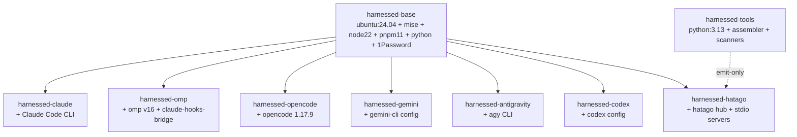

# Technology Stack

> Reference for the `harnessed` codebase. Covers languages, runtimes, frameworks,
> package managers, key dependencies, and configuration approach.
>
> **Principle:** the host needs exactly one dependency — **Podman** (or Docker). Every
> image is built and run on the host (`podman build` / `podman run`); there is no
> daemon-in-container, no API socket mounted, no Docker-out-of-Docker (design §15, `harnessed` header lines 1–7).

---

## 1. Languages

### Bash — the primary host CLI

The entire host-side control plane is Bash (`#!/usr/bin/env bash`, `set -euo pipefail`).
Use Bash for: argument parsing, image lifecycle, pod composition, instance naming,
firewall application, and just-in-time sourcing of per-feature library modules.

| File | Role |
|---|---|
| `harnessed` | Root entrypoint (~412 lines). Parses argv, dispatches subcommands, resolves the project path → instance, and launches `transparent` or `isolated` stacks. |
| `container` | Back-compat alias — `exec "$SCRIPT_DIR/harnessed" transparent "$@"`. |
| `lib/harnessed-common.sh` | Shared helpers: runtime detection, image build (`build_images`, `build_stack`, `ensure_*_image`), logging, instance lifecycle. |
| `lib/harnessed-runtime.sh` | Provider abstraction (`rt_*` helpers) hiding podman-pod vs docker-shared-netns differences. |
| `lib/harnessed-isolated.sh` | Isolated stack launcher (harness pod + hatago). |
| `lib/harnessed-transparent.sh` | Transparent stack launcher (host-mirror sandbox). |
| `lib/harnessed-isolated-config.sh` | Isolated auth seeding (ro credential + generated `.claude.json` stub). |
| `lib/harnessed-secrets.sh` | Opt-in secrets (varlock + 1Password) + scanner-token auth. |
| `lib/harnessed-services.sh` | Shared service sidecar lifecycle (`svc up|down|list`). |
| `lib/harnessed-mounts.sh` | Host-integration mount assembly (agents, signing, project). |
| `lib/harnessed-rescan.sh` | Nightly online image re-scan. |
| `lib/harnessed-claude-config.sh` | Transparent copy-on-start Claude config. |
| `lib/harnessed-cli.sh` | `list` / `stop` / `rm` / `new` / `install` subcommand handlers. |
| `lib/egress-firewall.sh` | iptables egress whitelist (block-by-default). |
| `install.sh` | One-liner installer: clones repo → `~/.local/share/code-container` + PATH symlinks. |

**Idioms enforced across the bash modules:**
- Just-in-time sourcing: feature libraries are `. "$HARNESSED_DIR/lib/..."`'d only in the
  dispatch arm that needs them (e.g. `lib/harnessed-secrets.sh` is sourced only in the
  `auth)` and isolated paths), keeping the launch path lean.
- `rt_*` helpers (`lib/harnessed-runtime.sh`) are the ONLY abstraction over the container
  runtime — call `rt_uses_pods`, `rt_userns_args`, `rt_group_create`, `rt_hatago_placement`,
  `rt_harness_placement`, never raw `--pod` / `--network container:` conditionals.
- Safe subprocess capture under `set -euo pipefail`: `cmd … || rc=$?` swallows a non-zero
  exit so the launcher doesn't abort (see `lib/harnessed-rescan.sh:51-58`).

### Python — the build-time assembler (emit-only)

Python is the **build-time assembler** and the **scanner/capability-test** engine. It runs
inside the `harnessed-tools` image (`FROM python:3.13-slim`, `tools/Dockerfile`) and, for
the host-side capability test, via `uv run` or a host `python3`. It **never** invokes
podman/docker from inside the image and never mounts a daemon socket (`tools/Dockerfile` header).

Use Python for: parsing/validating manifests, fanning skills/commands into the profile,
merging the hatago config, emitting the harness `.mcp.json`, and all supply-chain scanning.

| Module | Role |
|---|---|
| `tools/harnessed/cli.py` | `harnessed-tools` argparse entrypoint (`assemble` / `test` / `scan` / `scan-image` / `scan-image-online`). |
| `tools/harnessed/schema.py` | Parse + validate `recipe.yaml` / `stack.yaml` into typed dataclasses. Tolerant of unknown fields (design D-14). |
| `tools/harnessed/assemble.py` | Orchestrate: load stack + recipes → merge → hand to `emit`. |
| `tools/harnessed/emit.py` | Write `profiles/<stack>/.claude/**`, `hatago.config.json`, the harness `.mcp.json`, and the baked-server manifest. |
| `tools/harnessed/scan.py` | Supply-chain scan gate (osv-scanner + pip-audit + snyk + socket), CVSS ≥ 7.0 abort. |
| `tools/harnessed/capability.py` | Per-stack capability test: manifest oracle vs live `--fresh` introspection. |
| `tools/harnessed/report.py` | Render the capability test result (markdown / JSON). |
| `tools/harnessed/synclinks.py` | Fan a plugin's skills/commands into harness-native paths; fail-fast on collision. |

Requires **Python ≥ 3.12** (`tools/pyproject.toml`: `requires-python = ">=3.12"`); the image
pins **3.13**.

### JavaScript / TypeScript — harness CLIs, hatago, and the web site

Node is present in two places: inside the container images (mise-managed, for the harness
CLIs and the hatago hub) and for the marketing/docs site (`web/`).

---

## 2. Runtimes & runtime managers

### Podman — the container runtime (host-only dependency)

Podman is **preferred**; Docker is a fallback. Detection happens once at startup:

```bash
# lib/harnessed-common.sh
detect_runtime() {
    if command -v podman >/dev/null 2>&1; then
        CONTAINER_RUNTIME="podman"
    elif command -v docker >/dev/null 2>&1; then
        CONTAINER_RUNTIME="docker"
    else
        print_error "Neither podman nor docker found …"; exit 1
    fi
    export CONTAINER_RUNTIME
}
```

All `$CONTAINER_RUNTIME` calls execute on the **host**. The provider differences
(pod = group on podman; `--network container:<peer>` = shared-netns on docker; `--userns=keep-id`
podman-only) are hidden behind `lib/harnessed-runtime.sh`. Apple `container` (one VM + IP per
container) has no shared-netns equivalent and is a tracked follow-up, not yet supported.

### mise — the runtime manager (in-image)

[mise](https://mise.jdx.dev) manages Node, pnpm, Python, and CLI tools inside every image
that needs them (`base/Dockerfile.harnessed-base:50-80`, `tools/Dockerfile:109-114`). Use
`mise use -g <tool>` to pin a tool version; `mise settings set npm.package_manager pnpm`
routes `npm:`-backend tools through pnpm so the supply-chain policy governs them.

Key pins in `base/Dockerfile.harnessed-base`:

```dockerfile
RUN mise settings set experimental true && \
    mise settings set npm.package_manager pnpm && \
    mise use -g \
        node@22 \
        pnpm@11 \
        python@latest \
        fd \
        ripgrep \
        npm:opencode-ai \
        npm:@openai/codex \
        npm:@google/gemini-cli
```

### uv / uvx — Python tool runner (Astral)

[uv](https://astral.sh/uv) is used two ways:
1. **Hatago image** (`base/Dockerfile.hatago:16-17,39`): `uv tool install` bakes the light
   stdio MCP server (`mcp-server-time`) so it resolves offline at run time.
2. **Host capability test** (`harnessed:368-370`): `uv run --no-project --quiet --with ruamel.yaml --with rich`
   is the preferred path to run the test with zero host-Python pollution.

Pin: `UV_VERSION=0.11.8` (`base/Dockerfile.hatago`).

---

## 3. Frameworks

| Framework | Where | Version |
|---|---|---|
| **Astro** | `web/` marketing/docs site (static, GitHub Pages) | `^6.4.8` (`web/package.json`) |
| **FastMCP / `mcp[cli]`** | `services/ping/server.py` — streamable-HTTP MCP tracer | latest via `pip install "mcp[cli]"` (`services/ping/Dockerfile`) |
| **hatago MCP hub** | In-pod MCP aggregator (`@himorishige/hatago-mcp-hub`) | `0.0.16` (`base/Dockerfile.hatago`) |

The `web/` site is a minimal Astro project (no UI framework / SSR adapter). Its only
runtime deps are two `@fontsource` packages + Astro itself. Build: `pnpm build` → static
output served at `base: "/harnessed/"` (`web/astro.config.mjs`).

---

## 4. Package managers

There is a **strict separation**: no package manager runs on the host. The host only needs
Podman. Every package install happens inside an image build.

### uv — Python dependencies (tools image)

`tools/pyproject.toml` declares the project; `tools/uv.lock` (78 KB) is the lockfile.
The image installs via `pip install --no-cache-dir .` (`tools/Dockerfile:23`) from the
copied `pyproject.toml` + `harnessed/` package.

### pnpm 11 — all JavaScript, everywhere

**Use pnpm for every JS install — global, per-recipe, and hatago's bundled servers. Never
raw `npm`/`npx`.** (`npx <pkg>` → `pnpm dlx <pkg>`; `npm install` → `pnpm install`.) Recipe
validation in `schema.py` lints raw `npm`/`npx` and points at the pnpm equivalent (`RecipeLintError`).

The managed supply-chain policy ships from a single source of truth:

| Config file | Scope | Key keys |
|---|---|---|
| `lib/pnpm/config.yaml` | **Global** (COPY'd into every image's `~/.config/pnpm/config.yaml`) | `minimumReleaseAge: 1440`, `minimumReleaseAgeStrict: true`, `blockExoticSubdeps: true`, `verifyStoreIntegrity: true`, `strictDepBuilds: true` |
| `tools/pnpm-workspace.yaml` | **Project-scoped** (pnpm v11 rejects `allowBuilds` from global config) | `allowBuilds: { snyk: true }` — the deliberate exception to lifecycle default-deny |

> **Pitfall (documented in `lib/pnpm/config.yaml:18-23`):** pnpm v11 silently ignores
> `allowBuilds` in the *global* config and warns on every run. Put lifecycle exceptions in
> the project's `pnpm-workspace.yaml` instead. `minimumReleaseAgeExclude` is the escape
> hatch for first-party / just-published deps (e.g. `socket@1.1.122`).

### mise — tool CLIs

`extra-tools.txt` lists extra mise-managed CLIs (`bat`, `eza`, `sd`, `jq`, `lazygit`,
`ast-grep`, `ruff`, …) installed into `harnessed-base`. One tool per line; rebuild with
`harnessed build`.

---

## 5. Key dependencies

### Python (`tools/pyproject.toml`, locked in `tools/uv.lock`)

| Package | Version | Purpose |
|---|---|---|
| `ruamel.yaml` | `0.18.17` (`>=0.18,<0.19`) | YAML parsing of `recipe.yaml` / `stack.yaml` (`schema.py`, `YAML(typ="safe", pure=True)`) |
| `rich` | `14.3.4` (`>=14,<15`) | Terminal rendering for the CLI + capability reports |
| `pip-audit` | `2.10.1` (exact pin) | Python dependency vulnerability scan (warnings only; no CVSS in its JSON) |

`pip-audit` is pinned **exactly** (`==2.10.1`) rather than a range — it is a security tool,
so reproducibility matters.

### JavaScript — pnpm-global CLIs in the tools image (`tools/Dockerfile:122`)

```dockerfile
pnpm add -g varlock@1.7.1 @varlock/1password-plugin@1.2.0 snyk@1.1305.1 socket@1.1.122
```

All four are **inert** in the image: varlock/`op` activate only when a `.env.schema` exists;
snyk/socket only when their token is in the launcher env (`scan.py` env-gates them).

### JavaScript — hatago image (`base/Dockerfile.hatago`)

```dockerfile
ARG HATAGO_VERSION=0.0.16
RUN pnpm add -g "@himorishige/hatago-mcp-hub@${HATAGO_VERSION}"
ARG MCP_SERVER_TIME_VERSION=2026.6.4
RUN uv tool install "mcp-server-time==${MCP_SERVER_TIME_VERSION}"
```

### JavaScript — web site (`web/package.json`)

| Package | Version |
|---|---|
| `astro` | `^6.4.8` |
| `@fontsource/dm-sans` | `^5.2.8` |
| `@fontsource/inter` | `^5.2.8` |

`packageManager: "pnpm@11.8.0"` is pinned in `web/package.json`.

---

## 6. Image tier

Images are **built on the host** and compose a stack **at runtime**, not at build time.
`FROM` is lineage only (design §6) — there is no "union two images" operator.



| Image | Base | Dockerfile | Built when |
|---|---|---|---|
| `harnessed-base:latest` | `ubuntu:24.04` | `base/Dockerfile.harnessed-base` | First launch / `harnessed build` |
| `harnessed-claude:latest` | `harnessed-base` | `base/Dockerfile.harnessed-claude` | `ensure_images` |
| `harnessed-omp:latest` | `harnessed-base` | `base/Dockerfile.harnessed-omp` | **Lazy** — omp stacks only (HRN-01) |
| `harnessed-opencode:latest` | `harnessed-base` | `base/Dockerfile.harnessed-opencode` | **Lazy** — opencode stacks only (HRN-02) |
| `harnessed-gemini:latest` | `harnessed-base` | `base/Dockerfile.harnessed-gemini` | **Lazy** — gemini stacks only (HRN-03) |
| `harnessed-antigravity:latest` | `harnessed-base` | `base/Dockerfile.harnessed-antigravity` | **Lazy** — antigravity stacks only (HRN-04) |
| `harnessed-codex:latest` | `harnessed-base` | `base/Dockerfile.harnessed-codex` | **Lazy** — codex stacks only (HRN-05) |
| `harnessed-hatago:latest` | `harnessed-base` | `base/Dockerfile.hatago` | `ensure_images` / `build_stack` |
| `harnessed-tools:latest` | `python:3.13-slim` | `tools/Dockerfile` | First `build` / `auth` / `rescan` |
| `harnessed-ping:latest` | `python:3.12-slim` | `services/ping/Dockerfile` | `harnessed svc up ping` |

**Lazy build rule:** non-claude harness images are built *only* when that harness's stack
first launches (`ensure_omp_image`, `ensure_opencode_image`, … in `lib/harnessed-common.sh`).
Claude-only users are never forced to build omp/opencode/gemini/antigravity/codex.

**Curl-installer exception:** claude, opencode, and antigravity use vendor curl installers
(not mise/pnpm) because their npm wrappers are non-functional or squat packages
(`base/Dockerfile.harnessed-opencode:9-15`, `base/Dockerfile.harnessed-antigravity:9-14`).
These images are still covered by the build-time + nightly image scans.

---

## 7. Configuration approach

### Manifests (YAML, hand-authored)

| Manifest | Location | Parsed by |
|---|---|---|
| Stack | `stacks/<name>/stack.yaml` | `schema.load_stack` |
| Recipe | `recipes/<name>/recipe.yaml` | `schema.load_recipe` |
| Service | `services/<name>/service.yaml` | `schema.load_service` |

A stack picks **one harness** and a set of recipes/services. The assembler merges recipes
into a committed profile + hatago config. Parsing is tolerant of unknown fields (design D-14).

### Generated artifacts (emitted, never hand-edited)

`harnessed build <stack>` runs the emit-only assembler, which writes to `profiles/<stack>/`:

- `profiles/<stack>/.claude/skills|commands|agents|hooks|rules/` — the fanned file-extension tree
- `profiles/<stack>/.claude/.mcp.json` — **one** entry pointing at `http://localhost:3535/mcp`
- `profiles/<stack>/.claude/settings.json` — pre-approved hatago MCP tools
- `profiles/<stack>/hatago.config.json` — the hub's child/proxy server declarations
- `profiles/<stack>/hatago-baked.json` — manifest of stdio servers the hatago image must bake

### Environment / secrets (opt-in, varlock DSL)

`.env.schema` (`@plugin(@varlock/1password-plugin@1.2.0)` DSL) is the opt-in secrets surface.
Absent ⇒ the whole subsystem is inert (a single `[ -f ]` test in `lib/harnessed-secrets.sh:53`).
See `.env.schema.example` and `docs/codebase/INTEGRATIONS.md`.

### Supply-chain policy (pnpm)

`lib/pnpm/config.yaml` is the single source of truth, COPY'd into every image. The project-
scoped lifecycle allowlist lives in `tools/pnpm-workspace.yaml` (pnpm v11 requirement).

### Egress firewall (iptables)

`lib/egress-firewall.sh` is a block-by-default iptables OUTPUT whitelist, applied inside each
instance via `apply_firewall`. Whitelisted domains: `api.anthropic.com`, `statsig.anthropic.com`,
`github.com` (+ subdomains), `registry.npmjs.org`, `pypi.org`, `files.pythonhosted.org`,
`mise.jdx.dev`. Extra domains (e.g. a Z.AI endpoint) append as arguments.

### Systemd (nightly re-scan)

`systemd/harnessed-rescan.{service,timer}` — a daily user timer whose `ExecStart` is
`harnessed rescan`. Requires `loginctl enable-linger $USER` or the timer does not fire while
logged out (`systemd/harnessed-rescan.timer` header).

---

## 8. Quick-reference: what runs where

| Concern | Runs on host | Runs in image |
|---|---|---|
| CLI parsing / dispatch | `harnessed` + `lib/*.sh` | — |
| Image builds | `podman build` | — |
| Stack assembly (emit) | `podman run harnessed-tools assemble` | Python assembler |
| Supply-chain scan (source) | `podman run harnessed-tools scan` | osv-scanner + pip-audit + snyk + socket |
| Supply-chain scan (image) | `podman save` + `harnessed-tools scan-image` | osv-scanner offline |
| Nightly re-scan | `harnessed rescan` (host loop) | `harnessed-tools scan-image-online` (online DB) |
| Capability test | `uv run` / host python3 + `podman exec` | — |
| Harness + hatago | `podman run` (host) | the harness CLI + hatago hub |
| Secrets resolution | `varlock load` (host) OR tools container | varlock (headless fallback) |

---

*Last verified against source: 2026-06-22.*
