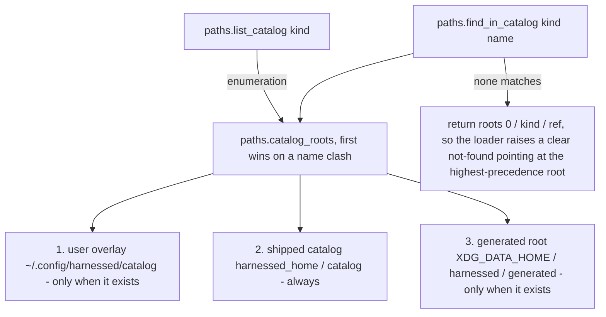
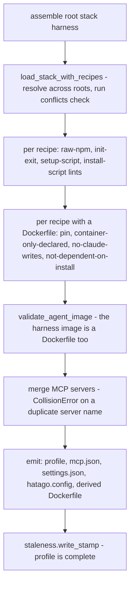
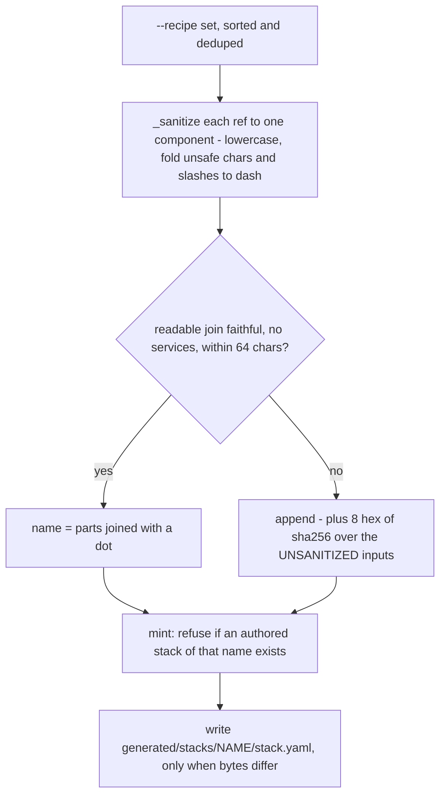

# Catalog: schema, roots, resolution, and packaging

`catalog/` is **authored content, not code** — the four kinds a contributor writes (agents, recipes,
services, stacks) plus `catalog/base/` (the shared base and per-agent Dockerfiles, the egress
firewall script, the pnpm policy, the extra-tools template). Everything in this page is about the
*contract* between that content and the build: who parses it, who validates it, where it is looked
up, and how it travels into an installed wheel. It does not document individual recipes — a recipe
is data, and this page documents the shape the data must have.

Two modules own that contract and nothing else:

- **`src/harnessed/paths.py`** — where catalogs *live*. The three search roots, the ref grammar,
  per-kind enumeration, and the generated root.
- **`src/harnessed/schema.py`** — what a manifest *means*. Parsing into typed dataclasses, the
  `extends:` merge, and every authoring gate. It is an **emit-only** module: it reads files and
  builds in-memory objects, never invoking podman and never writing anything.

`src/harnessed/assemble.py` is the consumer that sequences them: resolve → validate → emit.

Related: [build pipeline](/openwiki/workflows/build.md) (where these gates sit in the build),
[precedence](/openwiki/concepts/precedence.md) (the winner table this page expands),
[state, staleness, and GC](/openwiki/architecture/state.md) (what the generated root and the GCs
key on), [harnesses](/openwiki/integrations/harnesses.md),
[dynamic stacks](/openwiki/workflows/dynamic-stacks.md).

## The four kinds and their manifests

| kind | dir | manifest | required | marker for `list_catalog` |
| --- | --- | --- | --- | --- |
| agent | `catalog/agents/<name>/` | `agent.yaml` | `harness`, `image` | `agent.yaml` |
| recipe | `catalog/recipes/<name>/` (or `<family>/<variety>/`) | `recipe.yaml` | `name` | `recipe.yaml` |
| service | `catalog/services/<name>/` | `service.yaml` | `name`, `image`, plus `port` **or** `socket` | `service.yaml` |
| stack | `catalog/stacks/<name>/` | `stack.yaml` | `name` | `stack.yaml` |

`schemas/{agent,recipe,service,stack}.schema.json` exist for **editors**, not for the runtime: every
manifest carries a `# yaml-language-server: $schema=https://raw.githubusercontent.com/drmikecrowe/harnessed/main/schemas/<kind>.schema.json`
modeline comment. `src/harnessed/` never imports `jsonschema` for this — the parse-time validator in
`schema.py` is the enforcement point. The two agree today but are maintained by hand, so a field
added to one is a change to the other, not an automatic consequence.

Three parse-level details are load-bearing and easy to break:

- **One ruamel `YAML` instance per load.** `schema._load_yaml` constructs `YAML(typ="safe",
  pure=True)` *inside* the function. A ruamel instance carries scanner/parser/constructor state
  across `load()` calls and is not thread-safe; `harnessed build -j` assembles stacks on several
  threads at once. Hoisting it to a module global yields marks from one file reported against
  another, or half-built mappings that "load" with fields missing.
- **`MarkedYAMLError` is wrapped into `SchemaError` at parse time.** ruamel raises before any
  validation in the module runs, and every caller catches `SchemaError`; left unwrapped, a duplicate
  `install.refs:` key or a tab indent reached the user as a launcher traceback instead of the
  one-line rejection those callers are written to print.
- **Recipes keep D-14 forward fields.** `plugins`, `deps`, `scripts` are *not* typed yet but are
  legal, carried on `Recipe.raw`, and scanned for raw-string content. This is why recipe strict mode
  is an **allowlist** (`KNOWN_RECIPE_FIELDS`) rather than strict-everything. Stacks have no such
  forward-field case and reject unknown keys unconditionally.

### Refs and families

A catalog ref may name a **variety of a recipe family**: `beads/stealth` is the `stealth` variety of
the `beads` family, living at `catalog/recipes/beads/stealth/`. `paths.catalog_relpath` validates the
ref rather than blindly joining it — more than one slash, or an empty/`.`/`..` component, is a
`ValueError`, because an unvalidated component would escape the catalog root. The ref *is* the
relative path; a family is exactly one dir deep and every variety is a complete, self-contained
recipe (its own `recipe.yaml` + Dockerfile + `tests/`).

`paths.list_catalog` treats a dir *without* its kind marker as a family and lists its marker-bearing
children as variety refs — the family itself is never a usable ref. `Recipe.ref` carries the family
part, which is what makes sibling varieties implicitly mutually exclusive (below).

## The three roots, and the precedence that holds them together

*Resolution and enumeration share one root list. The generated root is last so a machine-minted
stack can never shadow one you authored.*

The ordering encodes three deliberate decisions:

1. **The user overlay wins on a name clash.** `~/.config/harnessed/catalog` overrides the shipped
   catalog for any same-named agent/recipe/service/stack and adds names the repo does not have.
2. **The shipped catalog is the baseline.** It resolves to `harnessed_home() / "catalog"`, which in
   a source checkout is the repo-root `catalog/` (the authoring surface) and in an installed wheel
   is the catalog materialized inside `site-packages/harnessed/catalog`.
3. **The generated root is last, and only present when it exists.** `$XDG_DATA_HOME/harnessed/generated`
   holds the `--recipe` stacks `dynstack.mint` writes. A user who never ran a dynamic launch sees
   exactly two roots. It is deliberately *not* under `~/.config/harnessed/catalog`: that is where
   the user authors, and mixing generated manifests into it means `harnessed list` cannot tell them
   apart and a regenerated file silently clobbers a hand edit.

`find_in_catalog` returns the first root where `catalog/<kind>/<ref>` exists; when no root matches it
returns the highest-precedence root's candidate path anyway, so the loader raises a not-found that
names a concrete directory rather than a bare absence.

### All enumeration goes through `paths.list_catalog`

Every consumer that needs "all X" routes through `paths.list_catalog(kind)` / `list_catalog_stacks()`
— `harnessed list`, and `harnessed build`'s no-arg reconciliation sweep (`_declared_pairs`). The
function is origin-blind: an entry present in both the overlay and the repo catalog is a single name
in the unified list, deduped with the overlay first. A new lister that walks
`harnessed_home()/catalog/<kind>` directly sees only the repo catalog and silently misses overlay
content — which is why `layout._stacks_dir` (used by `harnessed new` to scaffold into the repo
catalog) is documented as *not* an enumerator.

`harnessed update` is the one deliberate exception: `_update_recipe_dirs` / `_update_agent_dirs`
walk for `recipe.yaml` / `agent.yaml` by glob because `update` wants every manifest, family member
or not — but they iterate the same `paths.catalog_roots()` list with the same overlay-wins dedup.

### Overlay shadowing is warned, not silent

Because the overlay wins, a shadowed repo copy is never read — sessions have quietly assembled
stale overlay recipes while the newer repo copy sat unused. `schema._warn_overlay_shadowed_recipes`
— called from `load_stack_with_recipes` on the production path only, where `root is None` (an
explicit `root` is a test/fixture tree, never an overlay) — prints one warning per shadowed recipe
name per process, naming both paths. `default` is exempt: overriding the shipped
baseline is a documented, blessed pattern (the first run even *seeds* a copy into your overlay), so
warning there is pure noise. Stacks, agents and services stay silent.

### `harnessed_home()` never keys off the CWD

`paths.harnessed_home()` is the single anchor for both catalog lookup and the podman build context.
Resolution: `$HARNESSED_DIR` (explicit override, still wins) → `Path(__file__).resolve().parent /
"catalog"`. `.resolve()` collapses the source-checkout symlink to the repo root, so home is the repo
root in a checkout and `site-packages/harnessed` in a wheel — the build context never contains a
symlink that escapes it, which podman rejects. When no catalog can be found it raises
`HomeNotFoundError` rather than returning a plausible directory that has none; that used to surface
as a baffling `unknown stack '<x>'` for every stack.

`paths.source_checkout()` answers "is home a checkout" (both `pyproject.toml` and `src/harnessed`
present) and gates the dev-only conveniences so they cannot fire against whatever directory the
user happened to `cd` into, or write into `site-packages` in a wheel install.

## Stack `extends:` — precise semantics

`_load_stack_raw` reads one manifest, requires `name`, validates its fields, then folds in whatever
it `extends:`. The merge happens **on the raw dict, before any field parsing**, so inheritance needs
no per-field knowledge and every validator downstream sees one fully-resolved flat manifest.

| field class | behaviour |
| --- | --- |
| `recipes`, `services`, `harnesses`, `ssh_keys` | **UNION** — parent's entries first, then the child's, de-duped (`_STACK_UNION_FIELDS`) |
| every other field | **override** — the child's value wins if it declares the key, else the parent's is inherited. `state` included: a declared value *replaces*, it does not deep-merge |
| `name` | never inherited — a stack is identified by its own directory |
| `extends` | consumed by the merge and never appears in the result |

The parent is located by `_resolve_parent_stack_dir`: the **same catalog root as the child first**
(so a fixture tree or a self-contained overlay resolves within itself), then the normal catalog
search — which is what lets an overlay stack extend one shipped in the repo. **Chains are allowed**
(a stack may extend a stack that extends another); **a cycle is an error**, detected by threading
the visited-directory chain through the recursion and naming the whole loop.

Unknown stack fields are rejected **unconditionally** (not a `--strict` flag). Stack parsing used to
be tolerant, which meant an unsupported or misspelled key did nothing, silently — an `extends:`
written before the feature existed looked accepted and inherited nothing for months. A stack
manifest is small and fully specified, so there is no forward-field case to protect: an unknown key
is always a bug, and it should be loud. `_suggest_field` adds a `did you mean` by edit distance ≤ 2,
so `recipe:` points at `recipes:`.

`hatago:` stays in the known set *after* its removal so it reaches `_reject_removed_hatago_override`,
whose message says what replaced it (the published `@drmikecrowe/hatago-mcp-hub` npm release in
`catalog/base/Dockerfile.harnessed-base`), rather than dying in the generic unknown-field path.

`load_stack` adds two identity checks on top of the merged manifest:

- **`name:` must equal the directory name.** A stack is resolved *by directory*, and
  `staleness.compute_stamp` re-resolves the manifest from `stack.name`, so a mismatch used to
  surface far downstream as a `FileNotFoundError` against a directory that never existed.
- **`name:` must not be a harness name.** The harness is a run-time positional, not a stack field;
  `HARNESS_CONFIG_DIR` is the authority for the reserved set.

The shipped `catalog/stacks/default/stack.yaml` is the baseline every dynamic stack extends
(`--extends` defaults to the literal name `default`). It is deliberately minimal — one recipe, no
services, **no policy fields** — because a shipped baseline that set `permissions:` or turned on
credential forwarding would silently apply that policy to every dynamic stack on every install.
Authoring `~/.config/harnessed/catalog/stacks/default/stack.yaml` replaces it wholesale.

## The validation gates that run at assemble time

`assemble()` runs every gate **before any file is emitted** — fail-fast, so a bad manifest costs a
one-line error and exit 1 (`launcher._build_stack` and `cli._run_assemble` catch `SchemaError`
subclasses), not a half-written profile. All of the recipe lints raise `RecipeLintError` or
`PinValidationError`, both `SchemaError` subclasses.

*The gate ladder. Recipes are harness-independent, so there is no harness-compat gate at this stage;
the two harness-capability gates (`hub_transport: stdio`, `direct:` servers) run after the merge.*

### Unknown-field rejection

- **Recipes, strict mode.** `harnessed build`/`test` pass `strict=True` (`--no-strict` opts out);
  `_validate_recipe_fields` rejects any top-level key outside `KNOWN_RECIPE_FIELDS` — the typed
  keys plus the three D-14 forward fields. This is the typo guardrail: `skkills:` fails loudly
  instead of silently dropping a capability. A genuinely new forward field is added to the set.
- **Stacks, always.** `_validate_stack_fields` runs on every manifest load, strict or not.
- **Nested blocks reject their own unknowns**: `setup:` (`summary`/`reference`/`condition`/`script`/
  `config`/`confirm`), `install:` (`script`/`cache`/`system`/`hold`/`refs`), `init:` (`run` only),
  `tools:` mapping entries (`spec` + optional `hold`).

### Pin validation — no floating refs, anywhere a ref can be written

The rule is stated **positively**: a ref is acceptable only if it can be *shown* immutable. A
negative rule would admit every spelling nobody enumerated. Three scanners share it:

- `_FLOATING_REF_RE` catches the decorated forms: `--branch main|master|HEAD`, `:latest`, `@latest`.
  Comment lines are stripped first so a comment explaining the convention does not self-trigger.
- `_IMMUTABLE_REF_RE` is the positive grammar — a version-like tag (`v1.2.3`, `2.0.0-rc.1`) or a
  full 40-hex SHA. Deliberately narrow; an unrecognised shape fails closed.
- Three acquisition spellings are each walked separately, because each hides refs in a different
  place: `git clone --branch <ref>` (`_CLONE_REF_RE`), a GitHub/codeload **archive URL**
  (`_ARCHIVE_REF_RE` — `curl .../archive/main.tar.gz` moves exactly as much as `--branch main`),
  and `git fetch <remote> <ref>` (`_GIT_FETCH_RE` + a token walk that classifies every option as
  flag or value-taking, audited against the git binary). Variables are resolved **one hop**, against
  `install.refs:` first and literal shell assignments in the same body second — that order mirrors
  the shell's own precedence, so a local `HARNESSED_REF_X=main` shadows the exported env exactly as
  it does at runtime. An unresolvable variable is reported, because "can't tell" and "moves" have
  the same build consequence.

Where the rule applies:

- **Recipe Dockerfiles** — `validate_pin(recipe_name, dockerfile_body)`.
- **`install.script` and `setup.script` file bodies** — `validate_install_script` /
  `validate_setup_script` → `_lint_script_file`. A script file is invisible to the two
  text-reading gates (raw-npm reads a fixed key list; pin reads Dockerfile bodies), and `install:`
  is the field that empties recipe Dockerfiles, so without this it would be the *largest* hole in
  pin enforcement. Every new script-bearing field must route through `_lint_script_file`.
- **`tools:` entries** — `_parse_tools` rejects a floating marker *or* a bare tool name with no `@`
  at all (the second clause is the one bd harnessed-2o9 was about: `mise use -g dua` resolves
  `@latest` at build time and the image stops being reproducible). A `hold:` does not license a
  floating one — both forms are pinned or neither is.
- **`extra-tools.txt`** — `parse_extra_tools` / `_validate_extra_tools_spec` reuse `_parse_tools`'
  rule and additionally restrict the spec to printable non-space ASCII, so awk (which the base
  Dockerfile pipeline uses) and Python cannot disagree about what an entry is.
  `normalize_extra_tools` strips a BOM and folds CRLF→LF **once**, and the same normalised text is
  both validated and staged into the build context — that is what makes "the guard sees what the
  build sees" a mechanism rather than a promise.
- **`install.refs` / `install.cache`** — `_parse_install_refs` validates each declared ref against
  `_IMMUTABLE_REF_RE` at schema time; `_parse_install` rejects a hand-written `cache:` alongside
  `refs:` (the cache key is *derived* from them — keeping both leaves one silently dead), a floating
  `cache:` value, and `refs:` without a script.
- **Agent images** — `validate_agent_pin` (reached from `assemble.validate_agent_image`). Agents are
  linted for **absent** versions as well as floating ones, because FLOATING has a token to match on
  and ABSENT does not — the defect *is* the missing token. An unversioned acquisition
  (`mise use -g` without a version, a `curl … | bash` with no version evidence) passes only when the
  manifest declares one `unpinnable:` reason per conceded acquisition; the **count** is checked, so
  a single entry cannot excuse every other unversioned install in the same file. `validate_agent_image`
  resolves with `root=None` deliberately (the agent image is always built across every root) and
  **fails closed** on a Dockerfile it cannot read — a gate that returns silently for an input it
  could not examine is indistinguishable from one that examined it and approved.

`harnessed update --check` (weekly cron in `.github/workflows/pin-check.yml`) sweeps every recipe
and agent manifest across the active catalog roots for pins with a newer upstream release past the
minimum release age. Held pins (`install.hold`, a `tools:` entry's `hold`, an agent `build_args`
hold) are listed for information and never offered for bumping, and never fail `--check`.

### Raw npm/npx rejection

`validate_no_raw_npm` (BLD-03) rejects word-boundaried `npm`/`npx` **command tokens** — never loose
substrings, so a package named `npmlog` is not flagged. The haystack is MCP server
`command`+`args`, the recipe's forward-field raw strings, and every vendored `package.json` `scripts`
value under the recipe dir. The error names the pnpm equivalent (`npx` → `pnpm dlx`, `npm install` →
`pnpm install`, …) via `_NPM_TO_PNPM`. `_lint_script_file` applies the same check to script bodies.

### Mode-compatibility gates

- **`validate_no_claude_writes`** — a recipe Dockerfile that references `~/.claude` is rejected.
  Content delivered that way is invisible to a host launch *and* hidden by the profile bind-mount in
  a container. The launcher pass that used to extract image-baked `~/.claude` back out was deleted;
  this lint is what keeps it deleted. The replacement is writing into `$HARNESSED_CONFIG_DIR` from
  `install.script`, which lands in both modes.
- **`validate_container_only_declared`** — a recipe with an `install:` runs its script in both
  modes, so any `RUN` left in the Dockerfile is container-only and a host launch silently delivers
  less than the recipe promises. Such a `RUN` requires `install.system:` — a reason string the
  launcher prints verbatim when it skips that half. Only recipes that *have* an `install:` are
  gated; an unmigrated recipe is container-only by construction.
- **`validate_dockerfile_not_dependent_on_install`** — the Dockerfile body may not invoke its own
  `install.script`, because the body runs at BUILD and the install at container RUNTIME.
- **`validate_init_no_exit`** — `init.run` is *sourced* into the attach shell that then execs the
  harness (Model A), so a bash `exit` terminates that shell and kills the session before the harness
  starts, silently. The lint steers authors to `return`.

### Conflicts and family/variety mutual exclusion

`_check_recipe_conflicts` runs on every stack load and rejects two shapes:

- **Declared** — a recipe lists another in `conflicts:`. Checked symmetrically: only one side needs
  to declare it.
- **Implicit** — two varieties of the same recipe family (`<family>/<a>` + `<family>/<b>`). They are
  the same tool wired differently, so they are always mutually exclusive; no `conflicts:` entry is
  needed and none should be written — the family is the source of truth.

The MCP-server name collision check lives in `assemble._merge_servers` and raises `CollisionError`
naming both owning recipes.

## `dynstack`: content-derived names that mint a real stack

`--recipe` composition could hand a recipe list straight to the assembler. It does not. Five
subsystems are already keyed on "a stack that resolves in the catalog" — profile location, volume
labels, the staleness check, `harnessed list`, and **both** garbage collectors — so
`dynstack.mint` writes a real `stack.yaml` under the generated root instead, and all five work
unchanged. What marks the stack machine-made is its *location*, not a manifest key (which the
unknown-field rejection would refuse).

*`derive_name` → `mint`. The collision refusal exists because the generated root is last in
precedence: an authored stack of the same name would win resolution and `run` would silently
execute something the user did not ask for.*

Two invariants hold the naming together:

- **The join separator must be tag-legal AND impossible for the sanitizer to emit.** The name is
  interpolated into a podman image tag by `layout._derived_image`
  (`harnessed-<harness>-<stack>:latest`), so it must satisfy the OCI name-component grammar:
  alphanumerics separated by `.`, `_`, `__` or runs of `-`, no leading/trailing separator. That
  alphabet is strictly smaller than a filesystem's, and podman rejects a bad tag at build time —
  which the test suite cannot catch, because it runs no podman. Hence `_JOIN = "."` and a sanitizer
  output alphabet narrowed to `[a-z0-9-]`: if a sanitized ref could contain `.`, `["a.b", "c"]` and
  `["a", "b.c"]` would both join to `a.b.c` with neither flagged lossy — a **silent collision** onto
  one manifest, one image and one pair of volumes. Folding `_` into `-` also closes the
  leading-separator hole (`_foo` would survive intact).
- **A digest is appended whenever the readable join is not a faithful encoding** — a ref had to be
  sanitized (lossy by design: `Foo`/`foo` and `foo bar`/`foo-bar` collapse), the join exceeded
  `NAME_MAX` (64), or explicit `--service` selections were passed (services never appear in the
  readable join, so the digest is their only carrier). The digest is computed from the
  **unsanitized** inputs, with a `\x1f` between the refs group and the services group so
  `(refs=("a","b"), svcs=())` stays distinct from `(refs=("a",), svcs=("b",))`.

`mint` is idempotent and mtime-honest: it writes only when the content differs, so a repeat launch
does not perturb the staleness check and the file's mtime tracks real change. Refs that sanitize to
a reserved component (`""`, `.`, `..`) raise `ValueError` from `derive_name`, which
`launcher._resolve_stack` converts to exit 1.

A generated stack resolves under `$XDG_DATA_HOME/harnessed/generated`, never under the user catalog,
so `ssh_keys` is always dropped for it (see [dynamic stacks](/openwiki/workflows/dynamic-stacks.md))
— and `mint` never writes an `ssh_keys:` key, so the only route in is `extends:` inheritance, which
the same gate drops.

## Packaging invariants: how `catalog/` gets into the wheel

`src/harnessed/catalog` is a **symlink** to the repo-root `catalog/`. This is not incidental — it is
the mechanism that lets one authored tree serve both layouts:

| | `harnessed_home()` | `catalog/` |
|---|---|---|
| source checkout | the repo root | the authored dir, via the symlink |
| installed wheel | `site-packages/harnessed/` | real files inside the wheel |

`[tool.setuptools.package-data] harnessed = ["catalog/**/*"]` makes setuptools **follow** that
symlink and materialize the catalog as real files in the wheel, so an installed `harnessed` (uv tool
/ pipx / PyPI) carries its own recipes, agents, services, stacks and base Dockerfiles and needs no
repo on disk. **Never delete the symlink** — without it an installed harnessed has no catalog and
every stack reads as "unknown" (`HomeNotFoundError`).

Three invariants follow, each of which exists because setuptools follows symlinks:

1. **Nothing host-local may live inside `catalog/`.** It is a published artifact. A link to your
   private `~/.config/harnessed/catalog` parked in `catalog/` would be packaged into the wheel.
   That is why the DX overlay symlinks live in **`catalog-local/`**
   (`paths.local_links_dir`), a gitignored sibling — keeping them outside the shipped dir makes the
   leak structurally impossible rather than merely excluded. `catalogseed._ensure_local_catalog_links`
   creates them only inside `paths.source_checkout()`, and *migrates away* any pre-move
   `catalog/<kind>.local` symlink it finds (unlinking only ever a symlink, never real content).
2. **Exclusion rules keep the rest out.** `[tool.setuptools.exclude-package-data]` drops
   `catalog/*.local` and its contents (belt to the braces above), `catalog/base/extra-tools.txt`
   (the user's *resolved* mise tool list, staged into the build context by
   `launcher._staged_build_context`; the committed seed `extra-tools.default.txt` ships), and
   `catalog/recipes.backlog/*` (recipes parked as untested — `find_in_catalog` only ever looks at
   `catalog/recipes`, so they are already unresolvable, and keeping them out of the wheel means an
   installed harnessed carries no half-finished recipe at all).
3. **`harnessed_home()` resolves through the symlink and never keys off the CWD.** `.resolve()`
   collapses it, so the podman build context is always a REAL directory containing a REAL `catalog/`
   (podman rejects a context symlink that escapes the context), and the Dockerfiles'
   context-relative `COPY catalog/base/...` paths are correct in both layouts, unchanged.

Two adjacent facts worth knowing when touching packaging:

- **Builds run from a staged context** (`launcher._staged_build_context`): a temp copy of `catalog/`
  (`symlinks=True` so a stray link is never followed out of the catalog, `ignore_patterns("*.local")`)
  plus the normalised, host-validated `extra-tools.txt`. Building straight from home would write
  into `site-packages` on an installed harnessed, and in a checkout would ship the whole repo
  (`.git`, `.venv`, `node_modules`) to the daemon.
- **`pyright` excludes `src/harnessed/catalog`** because the catalog's container-side scripts run
  inside recipe images against dependencies (`mcp`, `starlette`, `uvicorn`) the host package
  deliberately does not install; checking them on the host measures nothing about the code that
  runs here.

## First-run seeding, and the tests that hold this together

`catalogseed._seed_user_default_recipe` copies the shipped `default` recipe into the user's overlay
**once**, prepending a banner that says the copy is yours and now shadows the shipped one (delete
the directory to fall back; harnessed re-seeds on the next run). The copy is staged in a
per-process temp dir and renamed last, so an interrupted seed never leaves a half-copied recipe at
the real name where the `exists()` guard would treat it as complete forever. It is called from
`launcher._resolve_stack` — the one place both run verbs share — because resolution is the step that
needs the shipped baseline to exist.

Focused verification a change here should keep green:

- **`catalog/recipes/floating-recipe/`** is a committed fixture whose Dockerfile carries a floating
  ref; assembling any stack that uses it must fail before any image layer is written. It exists only
  to exercise `validate_pin`.
- **The capability oracle** reuses `schema.load_stack_with_recipes` + `schema.expected_capabilities`
  as its pure manifest→expected mapping, so the parser is the test oracle, not a parallel copy of the
  rules. Keep the parse API clean and reusable.
- **`compute_recipe_hash`** (`assemble.py`) content-hashes the stack's full closure — the
  `stack.yaml`, every file under each recipe dir, and every referenced service dir (names collected
  from all three sources: `recipe.servers[].service`, `recipe.services`, and the stack's own
  `services:`) — and is stamped as the `harnessed.recipe-hash` image label rather than a side-file,
  so the hash cannot drift from the image it describes. Resolution for the service dirs mirrors the
  runtime's root list.
- **The pin-check workflow** (`.github/workflows/pin-check.yml`) is deliberately scheduled, not a
  PR gate: it resolves live registries, so its result depends on what npm/PyPI/GitHub published
  today, not on the diff.
- **`pyproject.toml`'s mutmut config** calls out two known interactions with this area:
  `harnessed_home()` resolves through a symlink that does not exist in the mutants tree (export
  `HARNESSED_DIR=$PWD`), and mutmut's copy dereferences symlinks so `catalog/*.local` arrive as
  real dirs.
