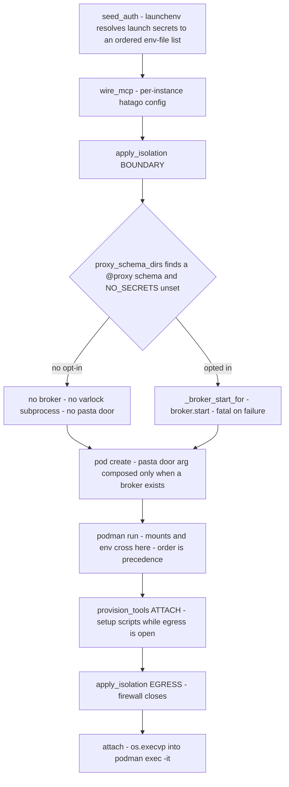
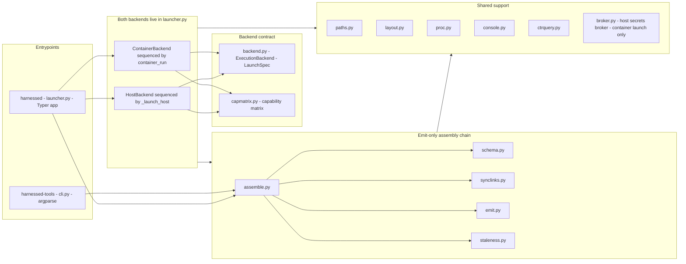

# System overview: what harnessed is and the stage owners

harnessed is a **host-native Python CLI** that composes catalog content (recipes → stacks) and
launches the result. It is installed on the host (pipx/uvx/PyPI) and drives **podman directly** —
there is **no tool container and no daemon socket**. The pipeline is a straight line, and each
stage has one owner: catalog content is **assembled** in-process into a profile (emit-only, host
side), the launcher **builds** the profile into images and **populates** the per-stack volumes, and
the container backend **launches** the result as a podman **pod**: the chosen agent container plus
any referenced service sidecars, with the **hatago** MCP hub running *inside* the agent container
(baked into the base image — there is no separate hatago image; `HATAGO_PORT` overrides its default
3535).

Assembly runs in-process, host-side; the only
things that ever talk to a container runtime are explicit `subprocess` calls in `launcher.py` and
the modules it drives (`volumes.py`, `svcstate.py`, `ctrquery.py`, `credmounts.py`,
`capability.py`'s live-introspection half).

`ARCHITECTURE.md` and `BACKENDS.md` at the repo root are the prose sources of truth for the
concepts below; this page is the code-anchored orientation and the module map.

Related: [execution backends](/openwiki/architecture/backends.md),
[the host secrets broker](/openwiki/architecture/secrets-broker.md),
[catalog and schema](/openwiki/architecture/catalog-and-schema.md),
[state, staleness, and GC](/openwiki/architecture/state.md),
[service sidecars](/openwiki/architecture/services.md),
[build pipeline](/openwiki/workflows/build.md),
[container launch](/openwiki/workflows/container-run.md),
[host launch](/openwiki/workflows/host-run.md),
[the credential proxy](/openwiki/concepts/credential-proxy.md).

## The vocabulary — precise, and not interchangeable

These five words have exact meanings. Substituting one for another is the fastest way to
misread the codebase:

| Word | Meaning |
| --- | --- |
| **agent** | An AI coding harness (`claude`, `omp`, `opencode`, `antigravity`, `codex`), defined in `catalog/agents/<name>/agent.yaml` — its image, its Dockerfile, and any agent-specific runtime contract. An agent is **not** a recipe. |
| **recipe** | A composable capability bundle (MCP servers, skills, commands, rules, tools, an optional Dockerfile) added **onto** an agent. |
| **service** | A sidecar with its own image + `service.yaml`, referenced by a recipe via `service:` (an MCP surface) or attached by a stack via `services:` (no MCP surface). `scope: global` = one shared host-published container on a static port; `scope: project` = one container per project (git-common-dir keyed) reached through a unix socket in its data dir. |
| **stack** | A **harness-free** chosen set of recipes, named after its recipes (`review-harness`; underscores between fields, hyphens within a name; a stack may **not** be named after a harness). May `extends:` another stack; unknown fields are rejected. |
| **catalog** | The collection of all four, searched across three roots in order: the user overlay `~/.config/harnessed/catalog` (wins on a name clash), the shipped `catalog/`, and last the generated root `$XDG_DATA_HOME/harnessed/generated` (machine-minted `--recipe` stacks — included only when it exists, so a generated stack can never shadow one you authored). |

Two load-bearing consequences of that vocabulary:

- **Recipes are harness-independent.** They carry no harness field. Any harness-specific step
  branches on the `${HARNESS}` build arg *inside* the recipe's Dockerfile. Every harness consumes
  the same committed Claude-canonical profile — `HARNESS_CONFIG_DIR` maps all five harnesses to
  `.claude`; they differ only in how they read it and reach MCP.
- **The harness is a run-time argument, never a stack property.** Both run verbs require it as the
  leading positional: `harnessed container-run <harness> --stack <name>`. The same stack runs on
  any harness; `claude`+it and `omp`+it are the same stack, materialized into per-harness
  profiles/images. A stack is named by a **flag** (`--stack/-s`), not a positional, precisely so it
  cannot be confused with the project path; repeatable `--recipe/-r` composes a stack on the fly;
  giving neither runs the `--extends` baseline (`default`) as-is. `--stack` and `--recipe` are
  mutually exclusive, and `--no-extends` requires at least one `--recipe` — with nothing inherited
  and nothing composed there is no stack to run.

## One composition layer, pluggable execution backends

harnessed's product is the composition layer. *Where* a composed stack runs is an
**execution backend** — and isolation is one of that backend's capabilities, not a property of the
product. Two conforming backends exist today:

| verb | backend | what it isolates | ends with |
| --- | --- | --- | --- |
| `harnessed container-run <harness> [path]` | container (podman pod + in-container hatago + services) | filesystem, network, **and** configuration | `os.execvp` into `podman exec -it` |
| `harnessed host-run <harness> [path]` | host-native — no podman, no MCP hub | **configuration only** (per-stack `CLAUDE_CONFIG_DIR` / `PI_CODING_AGENT_DIR`) | `os.execvpe` of the harness on the host |

The verb picks the backend; a flag picks the stack. Both verbs share one stack-selection grammar
(`--stack/-s`, `--recipe/-r`, `--extends`, `--no-extends`, `--service` — literally the same shared
Typer option objects) and one stack resolution path (`_resolve_stack`), and beyond that they share
**no flags except `--rm`** — `--fresh`, `--no-firewall`, `--no-secrets`, `--reauth`, `--shell`,
`--mount-folder` and `--agent-start-folder` all describe a pod, so a combined verb could only
accept them and do nothing. `host-run`'s own docstring states that as the reason it is a separate
verb rather than a mode of `container-run`. Both verbs end by *replacing* the launcher process so
the agent owns the terminal — which is also why launch-time warnings are counted by the console
and re-printed just before the handoff.

Pod launching belongs to the container backend alone: `pod create`, the member `podman run`, the
attach, and every mount helper are container-backend stages, while the host backend declares
`isolation: none`, never creates a pod or a container, and calls `apply_isolation` precisely
because it does nothing — the host path exercises the whole six-capability contract rather than
quietly implementing five sixths of it.

The six-capability contract, the deliberately backend-owned sequencing, and
`harnessed.capmatrix` are treated on the [backends page](/openwiki/architecture/backends.md); the
step-by-step runs live on the [container launch](/openwiki/workflows/container-run.md) and
[host launch](/openwiki/workflows/host-run.md) pages. In brief, so the module map below reads:

- the seam is `harnessed.backend.ExecutionBackend` — six capabilities (materialize config /
  provision tools / wire MCP / seed auth / wire services / apply isolation), two of them two-phase
  (`FIRST_START`/`ATTACH`, `BOUNDARY`/`EGRESS`), plus the backend-independent `LaunchSpec` and a
  name-keyed registry — and there is deliberately **no shared driver**;
- **both implementations live in `launcher.py`** beside the private helpers they call, so the
  dependency points into `backend.py` and never back out;
- the order asymmetry between them is load-bearing (the host backend materializes *before* it
  provisions; the container backend provisions the volumes *before* it materializes), and both
  start the same service sidecars — a `services:` entry is a property of the *stack*, not of the
  backend;
- the container path adds the **host secrets broker** (Epic #388 Topology B): when the composed
  schema opts in with a `@proxy` annotation, `varlock` is on PATH, and `--no-secrets` was not
  passed, `broker.start` spawns one `varlock proxy` on the host's loopback — where 1Password, the
  keychain and a YubiKey can actually authenticate — and the pod holds placeholders and reaches it
  through the pasta door (described under *where things land on disk* below). A failed broker start
  is fatal by design; a broker whose pod is gone is reaped.

### The container launch order — env resolution → broker gate → pod create → attach

The container create path is a fixed order, and the secrets-broker slot sits in the middle of it:

*The container create path. The broker gate runs inside `BOUNDARY`, immediately before `pod
create` — the pod's network args depend on whether a broker exists. The host path shares only the
first stage (env resolution) and then diverges: materialize → exec the harness, no broker, no pod.*

- **Env resolution comes first.** The launch-time secrets are resolved in `seed_auth`:
  `launchenv._resolve_launch_secrets` reads the same global-then-project sources and returns the
  ordered `--env-file` list — plus the generated temp files the backend unlinks the moment podman
  has ingested them — that the single `podman run` later consumes. The gate's own input,
  `launchenv.proxy_schema_dirs`, deliberately mirrors that same dir selection, so a broker always
  resolves the same composed secret set the env-file path resolves. `wire_mcp` follows; then the
  backend stands the boundary up.
- **The broker gate sits inside `BOUNDARY`, immediately before `pod create` — forced, not
  stylistic.** The pod's `--network` arguments depend on whether there is a broker: without one the
  pod must not be handed a route (`pasta --map-host-loopback,169.254.1.1`) to a host loopback it
  has no use for, so `_broker_start_for` runs first and `pod create` composes the pasta door only
  when a broker exists. A failed start is fatal (the alternative is a pod wired half-way to a proxy
  that is not there), and if `pod create` itself then fails, the already-started broker is stopped
  before the error re-raises — a live broker holding real secrets must never outlive the launch
  that owns it.
- **The host path stops at env resolution.** `_launch_host` resolves the same sources through
  `launchenv._resolve_launch_env` — a `KEY → value` map applied straight to `os.environ`, never
  written to disk — and then materializes the home, seeds auth, provisions and execs the harness
  directly. No broker gate, no pod create, no attach: a host launch resolves varlock *natively*, in
  the user's own session, and there is no boundary for a broker to sit on. That stop is pinned, not
  incidental: `tests/test_launch_parity.py`'s `CONTAINER_ONLY` ledger lists `_broker_start_for`
  ("starts a host broker for a POD; a host launch resolves varlock natively"), `proxy_schema_dirs`
  and `_broker_stop_for` as container-only **by nature**, and the lint fails any launch-path helper
  called on one verb but not the other without a written-down reason.

Teardown mirrors the start order: `_pod_teardown` stops the broker **first**, never fatally, before
`pod rm` — it is a host process holding live secrets and must not outlive the pod — and
`harnessed list` runs `broker.reconcile` before reporting, so a broker whose pod is gone is stopped
and reaped even when no teardown ever ran.

## Where things land on disk — and why never in the repo

- **Profiles** are emitted to `$XDG_DATA_HOME/harnessed/profiles/<stack>/<harness>/` — per-harness,
  so the same stack's claude and omp builds never clobber each other. Profiles are XDG *data*, not
  cache, and **never** written into the repo or into the installed package: the clone/wheel stays
  immutable source. `paths.py` is the single source of truth for this and every other derived path
  (host homes at `.../harnessed/home/<stack>/<harness>`, persist roots, instance names); no caller
  computes these independently. That mandate includes literals: `paths.BROKER_HOST_DOOR`
  (`169.254.1.1`) is the address a pod uses to reach a `varlock proxy` broker bound to the host's
  loopback, and it works only because three places agree on it — `paths.py` (the literal), the
  pod's pasta `--map-host-loopback` argument (`mounts._mcp_remote_pasta_net_args`), and the egress
  firewall's `ACCEPT` rule (`catalog/base/egress-firewall.sh`). That is exactly why the constant
  lives in `paths.py` rather than in any one of the three (epic #388 Topology B; #436, #437).
- **The catalog ships inside the wheel.** `src/harnessed/catalog` is a *symlink* to the repo-root
  `catalog/` that setuptools materializes as real files (so an installed harnessed needs no repo on
  disk). `paths.harnessed_home()` resolves through it to a real directory — the repo root in a
  checkout, `site-packages/harnessed` in a wheel — **never the CWD**, with `$HARNESSED_DIR` as the
  override. Builds run from a staged temp context (a copy of `catalog/` plus the resolved
  extra-tools), not from home, so an installed harnessed never gets written into and the build
  context never ships the whole repo. Do not delete the symlink; and keep host-local links out of
  `catalog/` — setuptools follows symlinks. The full packaging and resolution story is on the
  [catalog page](/openwiki/architecture/catalog-and-schema.md).

## The module map, by responsibility

`src/harnessed/` is a few dozen modules; the tree in `ARCHITECTURE.md` is the orientation subset,
not the inventory. Read them as five groups plus a domain layer:

*Every arrow is an import, and every arrow points away from `launcher.py` — into the contract,
into the assembly chain, or into shared support. Nothing imports back. `broker.py` sits in shared
support because `launcher.py` imports it, but only the container launch path ever calls into it —
the host backend's sequencer never touches it (see the launch order above).*

**Entrypoints.** `harnessed` is `launcher.py`'s Typer app (`pyproject.toml` wires
`harnessed = harnessed.launcher:main`): `container-run`, `host-run`, `build`, `list`, `test`,
`stop`, `rm`, `prune`, `clean`, `update`, `new`, `install`, `uninstall`, `scan`, `rescan`,
`host-gc`, `volume-gc`, `svc`, `project-env-path`, `aws-sso`. Its `main()` splits argv at the
first standalone `--` *before* Typer parses — the tail is appended verbatim to the harness
command — and catches the persist gate's three exception types so a default-deny refusal prints as
a one-line error with its remediation instead of a traceback. `harnessed-tools` is `cli.py`'s
argparse entrypoint (`assemble`, `test`, `scan-image-online`, `persist-list`, `persist-prune`,
`lint-prose`). Its `assemble` subcommand is the standalone emit-only path — you can produce a
committed profile on a machine with no container runtime at all. **`harnessed-tools test` is
*not* runtime-free**: it wraps `harnessed.cli test`, which launches the stack `--fresh` headless,
so it needs podman/docker just like `harnessed test` does. Only `assemble`, `persist-list`,
`persist-prune` and `lint-prose` are emit-only / host-only.

**The emit-only assembly chain.** `schema.py` parses and validates `stack.yaml`/`recipe.yaml`/
`agent.yaml`/`service.yaml` into typed objects — reads only, writes nothing, tolerant of unknown
fields (preserved on `.raw` so recipes can grow). `synclinks.py` fans each recipe's
`skills/`/`commands/`/`rules/` into the profile's `.claude/`, failing fast on name collisions (two
recipes shipping the same skill name is an error naming both sources, never a last-wins
overwrite). `emit.py` writes the profile artifacts (`.mcp.json`, the settings floor,
`hatago.config.json`, the derived Dockerfile, the install-env contract). `assemble.py` orchestrates
the chain, runs the fail-fast authoring gates (pin lint, raw-npm rejection,
`validate_no_claude_writes`, `validate_container_only_declared`, script lints), computes the
recipe-closure content hash, and stamps the profile. `staleness.py` owns the `.build-stamp` that
lets a later launch detect that the catalog inputs changed. None of the five invokes podman/docker
or touches a daemon socket — that boundary is what makes `harnessed-tools assemble` workable
without a runtime and what lets the host backend assemble in-process on every launch.

**The backend contract.** `backend.py` declares `ExecutionBackend` — six capabilities
(materialize config / provision tools / wire MCP / seed auth / wire services / apply isolation),
with `provision_tools` and `apply_isolation` deliberately two-phase (`FIRST_START`/`ATTACH`,
`BOUNDARY`/`EGRESS`) — plus `LaunchSpec`, the backend-independent launch input, and a name-keyed
registry (`@register`, `get_backend`). There is **no shared driver**: sequencing is backend-owned,
because the two implementations do not agree on an order and cannot be made to without changing
behavior. `capmatrix.py` is the machine-checked record of which recipe primitive each backend
honors; conformance tests iterate `PRIMITIVES × MATRIX`, so a new backend must fill its column
deliberately, and today exactly one cell is DEGRADED (`egress:` on host).

**Both implementations live inside `launcher.py`.** `HostBackend` (`name="host"`,
`isolation=none`) and `ContainerBackend` (`name="container"`, `isolation=container`) sit next to
the private helpers they call, so the dependency points into `backend.py` and never back out;
backend-specific state (pod names, volume names, mount args, the host home) lives on the backend
*instance*, never on `LaunchSpec`. Their sequencers are `container_run` and `_launch_host`, and
the asymmetry between them is load-bearing, not stylistic:

- the **host** backend materializes *before* it provisions — materializing rmtree's the very dir
  installs write into — and holds the per-stack home lock across materialize + seed-auth +
  `FIRST_START`, running `ATTACH` (setups, which may prompt) outside the lock;
- the **container** backend provisions the volumes *before* it materializes, because podman's
  copy-up is what lifts the image's `~/.claude` into the named volume the mount set then delivers.

Adding a fixed-order driver to the contract would be a behavior change wearing a refactor's
clothes. Both backends start the same service sidecars — a `services:` entry is a property of the
*stack*, not of the backend, so `host-run` brings up the same sidecars `container-run` does. On
the container backend, `apply_isolation(BOUNDARY)` is also where the secrets-broker slot lives —
see [the container launch order](#the-container-launch-order--env-resolution--broker-gate--pod-create--attach) above.

On the container backend, the single `podman run` is both the isolation boundary and the only way
mounts and env cross it, so `apply_isolation(BOUNDARY)` is where its env is assembled — and
**order is precedence**: podman applies `-e` left-to-right and the last one wins, which is why
catalog-authored recipe `env:` goes FIRST (it must not be able to clobber harnessed-owned values)
and the harnessed-owned `HATAGO_TRANSPORT`, socket env, setup env and mise-trust assignments come
after. That matches host mode, where `_launch_host` applies the recipe env to `os.environ` and
*then* overwrites with harnessed-owned values — reversing the order on one path silently inverts
the precedence between the two modes.

**The shared-support layer.** These modules exist so nothing else has to import `launcher.py`:
`paths.py` is the single source of truth for every derived path, instance name
(`harnessed-<harness>-<stack>-<project_hash>`), and catalog root, and for `USERNS_ARG` (keep-id
pinned to the image's uid/gid 1000). `layout.py` holds the tiny derivations a module needs before
the launcher can act (image tags, the profile dir). `proc.py` supplies the three subprocess shapes
— terminal-inheriting, tagged for parallel builds, and `_bounded` with per-command-class podman
deadlines. `console.py` owns the *two* process-wide Rich consoles; the warning counter must be
single, because `_acknowledge_warnings` reads it just before the terminal handoff. `ctrquery.py`
is the inspect-only layer: predicates and ID lookups about the runtime (running? stale image?
stopped leftover?) that never create, start, stop, or remove anything. `broker.py` — the host
secrets broker — is
imported by `launcher.py` (`_broker_start_for` / `_broker_stop_for` / `_broker_report`) and reports
through the shared console, so it is held to the same boundary rule, but it never lived in
`launcher.py`: it is Epic #388 Topology B's one `varlock proxy` per instance, started only when the
composed schema opts in with a `@proxy` annotation and `--no-secrets` was not passed, recorded
atomically to `$XDG_STATE_HOME/harnessed/brokers/` as a five-field record that leaks no secret by
construction, torn down with the pod, and reaped by `reconcile()` when a teardown never ran.

**The domain layer** (one line each; each has its own page or section):
`hosthome.py`/`hostrun.py` — the per-stack host home and the host-mode installs/setups/inits;
`mounts.py`/`volumes.py`/`credmounts.py` — the podman mount set, per-stack volumes, and
reference-don't-replicate credential forwarding; `svcstate.py`/`svcguards.py` — derived service
identity plus the guards that refuse destructive starts; `launchenv.py`/`setupenv.py` — the
launch-secret resolution and the folder-env contract; `attachcmd.py` — the per-harness attach
command and start-dir resolution; `jsonmerge.py` — the recursive settings merge that never loses
the user's half; `toollock.py` — merging per-recipe `mise.lock` files into the one lockfile a
stack's tool install reads; `dynstack.py` — content-named `--recipe` stack minting;
`launchscript.py` — the per-repo launcher script a launch leaves behind; `persist.py` — the
default-deny global persist gate; `persist_gc.py` — list/prune of persist dirs;
`capability.py`/`report.py`/`scan.py` — the capability oracle and the supply-chain scans;
`prose.py` — the on-demand prose linter for `RULE.md`/`SKILL.md` (never a build gate);
`catalogseed.py` — first-run overlay seeding; `aoe.py` — the optional, never-fatal Agent of
Empires bridge (`HARNESSED_NO_AOE=1` disables); `update.py` — the recipe-update machinery.

## The dependency-direction invariant

The one structural rule that holds the map together:

> **Modules extracted from `launcher.py` import INTO the contract and into shared support — they
> never import `launcher.py`.** The module-boundary tests enforce this, and the extracted modules
> say so in their docstrings (`backend.py`: "This module imports nothing from launcher.py and
> never will"; `capmatrix.py`, `ctrquery.py`, `proc.py`, `console.py`, `broker.py` likewise — each
> exists *because* importing it from `launcher.py` would invert the dependency).

`launcher.py` is the top of the graph and also a facade: it re-exports the names the extracted
modules formerly held, because the test suite binds to them by attribute — deleting a re-export
breaks tests even when the code moved (recorded as issue #327 / PR #325, whose `__all__` block is
the explicit contract). The practical corollary for adding code: **a new helper goes beside its
callers or below them, never above.** If two non-launcher modules need the same helper, it belongs
in a support module both can import — not in `launcher.py`, which would force one of them to point
back up. The boundary ledger `tests/test_module_boundaries.py::EXTRACTED` lists every module held
to the rule (the test also fails when a console-importing module is missing from it), and
`broker.py`'s entry carries the note that it never lived in `launcher.py` — it is listed because
it reports through the shared console.

## How a build traverses the map

`harnessed build <stack> <harness>`: `_build_stack` calls the same in-process `assemble()` the
host verb uses, then — the only podman-touching half — builds the base image (hatago baked into
`harnessed-base`), builds the derived per-stack image (`harnessed-<harness>-<stack>`), populates
the fingerprint-gated per-stack volumes (`tools:` + `install:` at runtime, not as layers), merges
installer-written settings back into the profile, and scans. The scan is its own stage and runs
**after** the image build, not as a Dockerfile layer: the derived Dockerfile carries no scan layer
(removed in bd harnessed-8px.21.5 — it scanned an image that no longer contained stack content and
reported green off one scanner in four), and the credentialed post-build pass re-scans the
just-built image with scanner tokens resolved host-side and the populated volumes mounted, so
snyk and socket actually see what was installed. It is advisory: it reports posture and never
fails the build, and `--no-security-scans` / `HARNESSED_NO_SCANS` skip it. A bare `harnessed
build` reconciles every declared/previously-built (stack, harness) pair against the
`harnessed.recipe-hash` image label. The full walk, with the emit-only boundary, is on the
[build pipeline page](/openwiki/workflows/build.md).

`harnessed test <stack> <harness>` — exposed on **both** CLIs (`launcher.py` shells out to
`harnessed.cli`) — is the integration oracle: it launches the stack `--fresh` headless and diffs
the manifest-derived expectation against the live instance, which means the verb as a whole needs
podman/docker. What is runtime-free is its **pure manifest→expected half**
(`schema.expected_capabilities` plus the recipes' `expect:` blocks and the expected-vs-live diff)
— that is what makes the oracle unit-testable without podman, not the verb.

## Reading order

1. `ARCHITECTURE.md` — what the words mean and where things live (prose source of truth).
2. `BACKENDS.md` — the execution-backend seam, the capability contract, and `capmatrix` (prose
   source of truth).
3. This page's siblings: [backends](/openwiki/architecture/backends.md),
   [the host secrets broker](/openwiki/architecture/secrets-broker.md),
   [catalog & schema](/openwiki/architecture/catalog-and-schema.md),
   [state & GC](/openwiki/architecture/state.md),
   [service sidecars](/openwiki/architecture/services.md).
4. The workflows: [build](/openwiki/workflows/build.md),
   [container launch](/openwiki/workflows/container-run.md),
   [host launch](/openwiki/workflows/host-run.md),
   [capability test](/openwiki/workflows/capability-test.md).
5. The concepts: [the credential proxy](/openwiki/concepts/credential-proxy.md) — the varlock
   proxy model the broker implements — and the rest of the concepts section.
6. [The verification ladder](/openwiki/testing/verification-ladder.md) — what a green gate proves,
   and what it does not.
