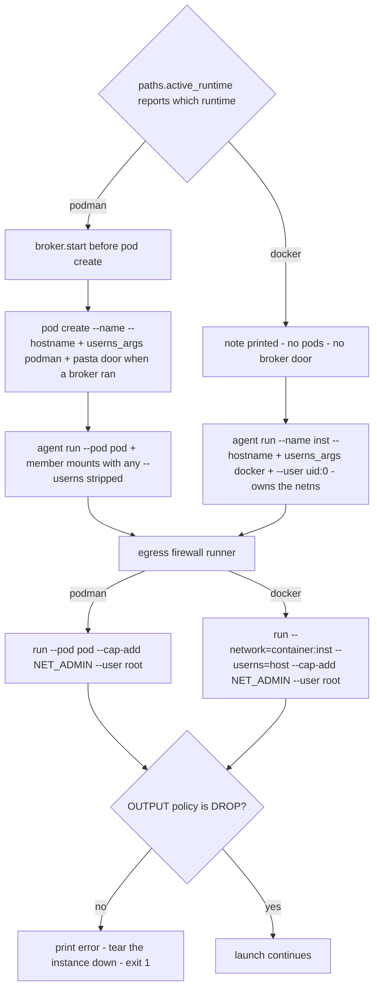

# The two container runtimes: podman and docker

harnessed claims **two container runtimes**, and the claim is load-bearing enough that
`live.yml` states it in its own comments: *"Supported that is not continuously verified is a
claim, not a fact, and harnessed claims both podman and docker."* Podman is the runtime the
project is built around — the only one with pods, pasta networking and `keep-id`. Docker is the
second-class citizen this tree deliberately keeps first-class: almost every runtime-dependent
decision is a small branch in `src/harnessed/paths.py` or `src/harnessed/launcher.py`, each one
carrying the issue or bd id of the defect that forced it to exist.

The design rule underneath all of it: **the `--userns` argument, and the uid derived from it,
must follow the runtime in force** — never a hard-coded podman constant, never a guess.

Related: [execution backends](backends.md) (the capability seam this axis lives inside),
[architecture overview](overview.md), [secrets broker](secrets-broker.md),
[invariants](/openwiki/concepts/invariants.md),
[verification ladder](/openwiki/testing/verification-ladder.md),
[build workflow](/openwiki/workflows/build.md),
[container-run workflow](/openwiki/workflows/container-run.md).

## One detector, two kinds of consumer

`paths.active_runtime()` is **THE detector**: `'podman'`, `'docker'`, or `None` when neither
binary is installed. Everything else delegates to it:

- **argv-building sites take `rt` explicitly** — the flag must match the binary actually being
  executed, so `userns_args(rt)`, `container_user_args(rt)`, `_agent_placement_args(rt, …)`,
  `_firewall_runner_argv(rt, …)` all receive the runtime as a parameter.
- **reasoning sites self-detect** — `paths.pod_host_uid()` and, through it,
  `persist.guard_ownership` call `active_runtime()` because they have no argv to build.

The comment on `active_runtime` explains why there must be exactly one answer: two detectors
that agree today are two detectors that can disagree later, and the disagreement would be
invisible — argv built for one runtime while ownership was checked against the other.
`ctrquery._runtime` and `capability._runtime` are thin wrappers that *delegate* rather than scan
PATH again (#459 moved the `CONTAINER_RUNTIME` override down into `paths` rather than letting it
disappear with `capability`'s private copy).

```python
# src/harnessed/paths.py — the override is read FIRST, and that is what makes a
# docker CI job expressible at all: a GitHub runner has BOTH binaries, so PATH
# order alone always yields podman.
forced = os.environ.get("CONTAINER_RUNTIME", "").strip()
if forced:
    if forced not in ("podman", "docker"):
        raise ValueError(...)          # a typo'd CONTAINER_RUNTIME=dcoker is REFUSED,
    return forced if shutil.which(forced) else None
for rt in ("podman", "docker"):        # ...never silently reinterpreted as podman
    if shutil.which(rt):
        return rt
return None
```

Three properties of the detector matter operationally:

1. **`CONTAINER_RUNTIME` is honoured before PATH.** With both binaries installed, PATH order
   always yields podman; the override is the only way to reach docker.
2. **An unrecognised value raises instead of falling through.** A typo that silently ran the
   whole suite against the wrong runtime would report the wrong runtime as a pass — the exact
   shape of failure this module exists to prevent.
3. **A forced runtime that is not installed answers `None`, not a lie** — an argv whose first
   element cannot execute must never leave this function.

The detector and the rootless probe are each split into an uncached `_`-prefixed function plus a
thin `lru_cache`d wrapper *deliberately*: mutmut generates no mutants for an `lru_cache`-decorated
function, so the combined versions were invisible to the mutation layer while it reported green.

## The mapping: podman pins keep-id to the image uid

Every harnessed image bakes `USER harnessed` = uid 1000 (`paths.CONTAINER_UID` /
`CONTAINER_GID`, one place to change if the images ever move). Podman's mapping is therefore a
**pinned** keep-id:

```python
# src/harnessed/paths.py
USERNS_ARG = f"--userns=keep-id:uid={CONTAINER_UID},gid={CONTAINER_GID}"
#           == "--userns=keep-id:uid=1000,gid=1000"
```

The pin is the fix for **bd harnessed-rv2.1**. Bare `--userns=keep-id` maps the invoking host
uid to the *same number* inside the container, so a bind-mounted host dir was writable only when
the invoking user happened to be uid 1000 — true on many dev boxes, false on a GitHub
`ubuntu-latest` runner, where `live.yml` failed six runs in a row with
`mkdir: cannot create directory '/data/dolt': Permission denied` from the beads-server sidecar.
Pinning the mapping to the image's uid makes the container's uid-1000 process **be** the
invoking host user whatever their host uid is; it is a no-op where the host uid already is 1000,
which is why it cannot regress those boxes.

The tests pin the *property*, not the spelling: `USERNS_ARG` must carry an explicit `uid=` and
`gid=` (the defect was the *absence* of `:uid=`), and a source sweep rejects any quoted bare
`'--userns=keep-id'` outside `paths.py` — which is exempt because it *owns* the constant and
parses it back in `pod_host_uid`. The sweep has its own anti-vacuity guard: an AST-bound check
that `launcher.py` and `volumes.py` still call `paths.userns_args`, so deleting every userns
argument cannot make the sweep pass silently.

## Docker states `--userns=host`, never keep-id (#456)

Docker has no `keep-id` mode and rejects the podman constant outright:

```text
docker: --userns: invalid USER mode
... returned non-zero exit status 125
```

which is where `harnessed` died on a docker host, inside `provision_tools`, before a stack could
build. **#456** is the issue for "the userns handling was written as if podman were the only
runtime". Docker's answer is `DOCKER_USERNS_ARG = "--userns=host"` — and `host` is chosen over
*omitting* the flag for a reason worth keeping: on a daemon started with `userns-remap`, the
default remaps the image's uid 1000 into a subuid range and every bind-mount write fails exactly
the way bd harnessed-rv2.1 described. Saying `host` opts this container out of that remap.

`paths.userns_args(rt)` hands out the per-runtime fragment as a **list** of argv elements (so a
future runtime whose answer is "no flag at all" needs no caller edits) and **raises for an
unrecognized runtime** rather than guessing: a guessed mapping applied to a real bind mount
fails as EACCES deep inside a container, or as files owned by an unrelated subuid — an error
that carries nothing pointing back at the guess.

`tests/test_docker_userns.py` keeps a live `@DOCKER`-marked repro of the premise: against a real
docker, `paths.USERNS_ARG` must still exit 125 with `invalid USER mode` ("if this ever stops
failing, docker grew a keep-id mode and the premise of this whole change moved"), and the
production argv — `*paths.userns_args("docker"), *paths.container_user_args("docker")` — must
actually write the bind mount.

## Who the agent writes as on docker (#457)

This is the asymmetry the module exists to manage:

| | podman | docker |
| --- | --- | --- |
| `--userns` | `keep-id:uid=1000,gid=1000` (pod-level) | `host` |
| `--user` | none (the mapping already did the job) | `--user <invoking uid>:0` |
| agent writes as | the invoking user, via the image uid | the invoking uid, via `--user` |
| volumes owned by | `CONTAINER_UID` (podman chowns new volumes itself) | invoking uid, group 0 (`_chown_volume_for_docker`) |

**#457**: docker's `--userns=host` maps nothing, so the image's uid 1000 *is* host uid 1000 and
the agent wrote as 1000 no matter who launched it — correct only where the invoker happens to be
uid 1000, and wrong on every GitHub runner (uid 1001), which is precisely what kept docker out
of CI. So on docker the invoking uid is stated explicitly:

```python
# src/harnessed/paths.py — docker only; podman gets [] because --user would fight keep-id.
def container_user_args(rt: str) -> list[str]:
    if rt != "docker":
        return []
    return ["--user", f"{os.getuid()}:{_ARBITRARY_UID_GID}"]   # gid 0, not the invoker's gid
```

**The group is 0, and that is not stylistic.** Docker creates no mapping, so the agent runs as
an uid the image never created, and group 0 is the only group such an uid is guaranteed to hold.
The base image pairs with this by giving `$HOME` to group 0 with group perms equal to user perms
(Dockerfile.harnessed-base, "ARBITRARY-UID SUPPORT"). With the invoker's own gid instead, a
uid-1001 agent could not even traverse `/home/harnessed` and died on
`cp: cannot stat '/home/harnessed/.claude/'` — with the volume *correctly* owned.

### The coupling: `container_owner_ids` and the volume chown

`paths.container_owner_ids(rt)` names the `(uid, gid)` that must own anything the agent writes —
`(CONTAINER_UID, CONTAINER_GID)` on podman, `(os.getuid(), 0)` on docker. One function so the two
runtimes cannot drift: it is the number `--user` is derived from **and** the number the volume
chown targets, and the whole point is that they are the same numbers (group included — a volume
chowned to the invoker's own gid is unreadable to a process running as gid 0).

`volumes._chown_volume_for_docker` is the docker half. Docker does not chown a new named volume
the way podman does; unless the mount point exists in the image, a fresh volume is `root:root`
and the first populate step fails with
`cp: cannot create directory '/home/harnessed/.claude/./skills': Permission denied`. The fix is
a throwaway `--user 0:0` chown container — what podman does implicitly, made explicit — and it
carries three constraints that must not be "simplified":

- **It runs at the volume's real mount path, not `/mnt`.** Docker performs copy-up when the
  container starts, so seeding from the image happens before the chown; at `/mnt` the two
  fought and copy-up overwrote the chown, surfacing as
  `cp: preserving times for ...: Operation not permitted` on the destination directory itself.
- **It writes nothing inside the volume.** A sentinel file (the PR #461 review's idea for
  avoiding re-chowns of the shared download cache) suppressed docker's copy-up — docker seeds a
  volume from the image *only while the volume is empty* — and `~/.local` came up without the
  image's pnpm tree. The "have we done this already" state therefore lives outside the volume:
  the caller asks whether the volume existed before creating it, and only a volume this run
  created gets chowned.
- **It is a no-op on podman**, because podman already chowns new volumes to the container's user
  namespace, and a second chown would state a rule in two places that could then disagree.

The chown container is also the **only** container allowed to state a user without going through
`container_user_args` — `tests/test_userns_mapping.py` sweeps every argv construct that splats
`paths.userns_args` and requires either `container_user_args` or the literal `0:0`, and asserts
exactly one call claims the exemption.

## The derived host uid: `pod_host_uid()` and None-means-refuse

`persist.guard_ownership` must compare a persist dir's owner against the host uid the pod's
process writes as. That number is **read off the mapping, not assumed**:

| situation | `pod_host_uid()` |
| --- | --- |
| podman, `keep-id` pinned onto `CONTAINER_UID` | `os.getuid()` |
| podman, `--userns=host` (parse branch) | `CONTAINER_UID` |
| podman, anything else (bare `keep-id`, `auto`, `nomap`, a uid mapped onto somebody else, no `uid=` at all) | `None` |
| docker, rootful daemon | `os.getuid()` — same answer as podman's keep-id, reached by a different mechanism (`--userns=host` + `--user`) |
| docker, rootless or unreadable daemon | `None` |

The contract is **None means unresolved, and callers must refuse rather than guess**. An earlier
version answered `CONTAINER_UID` for the unresolved cases and called it fail-safe; it was not
(CodeRabbit's finding): under bare `keep-id` on a host whose user is 1001, podman maps host 1001
→ container 1001 and the image's uid 1000 is drawn from the *subuid range*, so the pod's writes
land as ~100999 on the host, not as 1000. Answering "1000" would accept a persist dir owned by
host uid 1000 that the pod cannot write — fail-open in precisely the state the original bug
produces. The property tests generalize the rule over inputs nobody enumerated: *the pod writes
as the caller exactly when the mapping names the image's uid; every other mode is unresolved.*

`guard_ownership` then refuses, with a remediation, whenever the mapping cannot name the writer
— **checked before the absent-path early return**, because an unresolved mapping is a problem
even for a dir harnessed is about to create (checking after the return let the unresolved case
escape on the common path). Docker's unresolved case gets its own message, because "the daemon
is rootless" and "we could not read `docker info`" are different causes with different fixes.
And the guard compares against `pod_host_uid()`, *not* `os.getuid()` directly — compared against
`os.getuid()` it waved through six consecutive red CI runs, because the runner owned its own
persist dir while the pod owned nothing.

## Is the daemon rootless? A three-valued answer

`paths.docker_is_rootless()` returns **True** (rootless), **False** (rootful), or **None**
(undetermined). The probe is one `docker info --format '{{range .SecurityOptions}}…'` round
trip, bounded by `_DOCKER_INFO_TIMEOUT = 30` (duplicated rather than imported from `ctrquery` —
`ctrquery` imports `paths`, and the dependency direction must not grow a cycle) and `lru_cache`d,
so it runs at most once per process.

None is not a synonym for False. A daemon that is down, a socket this user cannot read, a wedge,
or a binary that vanished between the PATH check and here all answer None, and callers must
treat None as *refuse*: guessing "rootful" in the one state where nothing is known is the
fail-open direction.

One subtlety the tests pin explicitly: a daemon started with `--userns-remap` reports
`name=userns`, **not** `name=rootless`, so the probe classifies it as rootful — and that
classification is only sound **because** harnessed passes `--userns=host` on every container it
creates, which opts each container out of the remap. The claim and the flag are coupled: if any
creation site stops emitting the flag, the classification becomes a fail-open and
`pod_host_uid` would answer 1000 for a container whose host writer is a subuid like 165536. The
placement and firewall-runner tests are what hold the other half of that coupling.

## The preflight refusal at the top of build and launch

`persist.guard_ownership` already refuses an unresolvable mapping — but only where it is
*consulted*. A stack that declares no persist entry never reaches it and would run all the way
into the bind-mount failure. So `launcher._preflight_runtime(rt)` repeats the refusal at the
top of the launch, where it costs one `docker info` and stops with something a user can act on:

- **podman: unconditionally fine** — `paths.USERNS_ARG` names the mapping outright; the invoking
  uid is irrelevant.
- **docker + rootful daemon: fine, for any uid.** An earlier version refused every uid but 1000
  here; that was correct only while the agent ran as the image's uid, and after #457 it would
  have rejected exactly the case `--user` exists to support — including every GitHub runner.
- **docker + rootless daemon, or unreadable daemon: `typer.Exit(1)`**, with a message that names
  the cause (rootless vs "could not read `docker info`"), the uid that cannot be mapped, why
  (subuid), and both remediations (a rootful daemon, or podman).

It is called at the top of `build` (`_build_stack`) and at the top of the `launch` command, so
both entry points refuse before touching the catalog or creating anything. The tests assert the
refusal's *content* (cause, uid, subuid, both remediations, exit code 1) — mutation found many
survivors in these messages when only an exception type was asserted, and a refusal that exits 0
is a refusal every caller reads as success.

## Netns ownership: the pod versus the agent



*Where the mapping, hostname and network namespace come from, per runtime — the BOUNDARY and
EGRESS phases of the container backend's `apply_isolation`.*

`ctrquery._rt_uses_pods(rt)` returns True only for podman, and everything pod-shaped branches on
it — pod creation, the netns anchor, the member-mount userns strip, and teardown
(`pod rm -f` versus container `rm -f`).

**Podman: the mapping is a pod property.** `pod create` carries `paths.userns_args(rt)` and an
explicit `--hostname` (without it podman uses the pod *name*, which crun rejects past
`HOST_NAME_MAX` — `paths.container_hostname` truncates the middle of long names). Every member
joins via `--pod` and inherits; podman *rejects* `--userns` on a member, so
`launcher._without_userns` strips any `--userns` from the mount args a member reuses. That strip
is keyed on the **flag**, not a literal — an inline inequality against the bare `keep-id`
spelling silently stopped matching once the constant was pinned (bd harnessed-rv2.1): a filter
keyed to a literal is a filter that breaks when the literal moves. An honest note in `wire_mcp`
records that the strip is *inert today* (no `mounts.py` builder emits `--userns`), and is kept
because an unconditional strip would silently swallow a mapping the moment any builder starts
emitting one.

**Docker: the agent is the anchor.** There is no infra container to inherit from, so
`_agent_placement_args` states everything on the agent container itself — `--hostname`
(owning the netns is also what makes `--hostname` legal again: docker refuses it for a container
joining someone else's UTS namespace), `paths.userns_args(rt)`, `paths.container_user_args(rt)`
— and emits **no** `--network`. The first shape pointed the agent at
`--network=container:{pod}`, but nothing creates a container by that name when there is no pod;
docker rejected the `--hostname` + network-mode conflict first, so the dangling anchor was never
even reached (**#458** — one defect masking another). The same function is the fix for a test
gap worth remembering: the old test hand-assigned a `--userns` into `mount_args` and asserted it
survived — a state production never produces — so the docker agent was created with no mapping
at all while coverage, mutation and 3582 green tests reported nothing.

`launcher._netns_anchor(rt, pod, inst)` is the one function that answers "whose network
namespace does everything else join": the **pod** on podman, the **agent instance** on docker.
It replaced the `pod or inst` idiom, which reads as a fallback for a missing pod name but always
chose the pod on docker, because `self.pod` is always set — a container that does not exist. The
question is which *runtime*, never which value is truthy.

## The firewall runner must share the agent's user namespace

The egress firewall runs in a **throwaway container**, not `exec`'d into the agent: installing
iptables rules needs `CAP_NET_ADMIN`, and the agent container must never have it — the agent is
the untrusted party the firewall exists to confine, so handing its namespace-mates the
capability would hand the confined process the key. `_firewall_runner_argv` therefore builds
`--cap-add NET_ADMIN --user root` (NET_ADMIN in the bounding set alone is not enough — the
image's default user is unprivileged and iptables carries no file capabilities, which is exactly
how #429 stayed hidden) over the agent's netns: `--pod <pod>` on podman;
`--network=container:<anchor>` on docker.

The docker branch must repeat the agent's **exact** userns fragment, not merely carry some
mapping: iptables run from a different user namespace than the netns being configured returns
EPERM, so a mismatch installs nothing and the agent it was meant to confine **runs wide open**
(#456). This emit site was missing from the original enumeration entirely; the tests assert the
runner's `--userns` equals the agent's and that the two runtimes never share a placement list.

The whole operation is fail-closed twice over: a nonzero script exit refuses to continue (the
script installs default-DROP, so "it did not run" is *no firewall* — unrestricted egress for the
whole session), and a zero exit is then *verified* by asserting the OUTPUT policy really is DROP
(the script once returned 0 while installing nothing, satisfying the first check for 43
consecutive Permission-denied errors, #429). On either refusal the launcher tears the instance
down before propagating — a container left running without the boundary it was launched with is
strictly worse than no container. `NO_FIREWALL=true` is the supported way to say "deliberately
without one".

## The known gap: no secrets broker on docker

The secrets broker's door into the pod is a **pasta option on `pod create`** —
`--map-host-loopback,169.254.1.1` (`paths.BROKER_HOST_DOOR`), composed into the single
`--network pasta:…` value the pod is created with. Docker has no pods, so it has no way to
deliver that door into a container. A docker launch therefore:

1. prints a note at launch — *"…the varlock secrets broker is not started for this launch — the
   pod would have no route to it. Secrets are resolved into the container env as before"*;
2. starts no broker, and falls back to resolving **real secret values into the container env** —
   the exact behaviour epic #388's behaviour change is meant to retire on podman;
3. has **no test asserting either of those things**.

`ROADMAP.md` carries this as its only *"Known gap with no issue"*: decide what a docker launch
does about the secrets broker, and put a test on the answer — **"Needs an issue"** (no issue
number exists for it, and none should be invented here). The roadmap also warns why the gap
sharpens: once the secrets behaviour change lands, podman gains the property and docker silently
does not. `--no-secrets` is unrelated to this gap — it is the podman-and-docker escape hatch
from the broker's fail-fatal start.

## How CI verifies both runtimes

`.github/workflows/live.yml` runs the live layer twice — **two separate jobs, not a matrix**,
because a matrix would rename the `live` status-check context and a renamed required check
leaves branch protection waiting forever:

- **`live`** — podman. Verifies podman is available (`podman --version` + `podman info`,
  installing it if the runner image ever drops it), runs the suite through `tools/run-tests.sh`
  with `HARNESSED_PODMAN=1`, and ends with a real launch:
  `harnessed test livecheck claude --json --keep`.
- **`live-docker`** — the docker twin. Docker is preinstalled on `ubuntu-latest` but still
  *asserted* (`docker --version` + `docker info`), and every step that shells into harnessed
  exports **both** variables:

```yaml
# .github/workflows/live.yml — the docker job's suite step
env:
  CONTAINER_RUNTIME: docker   # what actually FORCES the runtime: without it detection
  HARNESSED_DOCKER: "1"       # picks podman and the job would silently retest podman
  GITHUB_TOKEN: ${{ secrets.GITHUB_TOKEN }}
run: tools/run-tests.sh -v
```

`CONTAINER_RUNTIME=docker` is what makes the job meaningful at all — a runner has both binaries
and detection prefers podman, so without the override the job would report itself as docker
coverage while retesting the podman path. `HARNESSED_DOCKER=1` gates the docker-only tests
(`test_docker_userns.py`'s `@DOCKER` marker: the live exit-125 repro and the bind-mount write)
the way `HARNESSED_PODMAN=1` gates the podman ones.

Both jobs end with a **launch**, not just a build: the build path and the launch path share
almost no code past image assembly, and a green build is not evidence about the half users
actually run. This is the step that would have caught #458 — `harnessed build` exited 0 on
docker while container-run created the agent pointing at a pod that is never created. Both jobs
also print the runner's identity *before* the suite — `id -u` on both, plus
`docker info --format 'rootless=…'` on the docker job — because a diagnostic that only runs
after a passing suite diagnoses nothing, and the defects that kept this work red (bd
harnessed-rv2.1, #457) were claims about the runner's environment that no failing log could
confirm or refute.

## How the hermetic suite stays hermetic: the podman pin

`tests/conftest.py`'s autouse `_pin_container_runtime` fixture exists because the docker branch
in `pod_host_uid` (#456) created two ambient-input problems at once:

1. **The suite's result depended on which binary the developer had installed.** `active_runtime`
   reads PATH, so the ownership tests took the podman branch on a podman box and the docker one
   on a docker-only box — measured: **17 tests changed outcome** across the two, and
   `test_pod_host_uid_follows_the_pinned_mapping` went green on *both*, for different reasons.
2. **`docker_is_rootless()` is `lru_cache`d**, so whichever test reached it first — under
   whatever HOME/PATH/patching that test had in force — decided the value every later test saw.
   That presented as **31 unrelated failures under `pytest-randomly`** that vanished when the
   same files ran alone.

The fixture therefore does three things, in order: clears both `lru_cache`s
(`paths.active_runtime.cache_clear()`, `paths.docker_is_rootless.cache_clear()`), deletes
`CONTAINER_RUNTIME` from the environment (the third ambient input — the `live-docker` job
exports it for the whole step, which made one detection test red *only* in that job), and pins
`paths.active_runtime` to a lambda answering `"podman"` — the pin because podman is what the
project is built around and what `live.yml` runs. Tests that are *about* the docker branch
override the pin inside the test body, where a function-scoped `monkeypatch` beats the autouse
fixture; `test_docker_userns.py` additionally captures the real detectors at import (before any
fixture runs) so it can restore them where it must *observe* detection rather than assume it,
and clears the caches through those captured originals — the pinned lambda has no `cache_clear`.

## What the tests actually pin

The verification story for this axis is property assertions, not suite statistics:

- **The mapping** (`test_userns_mapping.py`): the constant carries an explicit `uid=`/`gid=`;
  no call site emits the unpinned form (source sweep, `paths.py` exempt as owner); the sweep
  cannot pass vacuously (AST-bound check that the launcher and volume modules still call
  `paths.userns_args`); every mapped container also states its user, with the chown container as
  the single `0:0` exemption; every volume step carries exactly its runtime's mapping.
- **The derived uid** (`test_docker_userns.py` `TestTheDerivedHostUid`): tests pin `os.getuid()`
  to a value that is *not* 1000 (`4242`) so the podman answer and the rootful-docker answer are
  distinguishable by construction — on a uid-1000 box both branches give the same number and a
  green suite would assert nothing.
- **The refusals**: message *content* is asserted (cause, uid, subuid, remediations, exit code),
  because promises about messages that no test reads are where mutants survive.
- **The probe**: argv and kwargs asserted (`docker info --format …` spelled exactly, text mode,
  timeout), plus every failure mode (nonzero exit, `FileNotFoundError`, `PermissionError`,
  `TimeoutExpired`) resolving to None.
- **The properties** (`test_userns_properties.py`): hypothesis fuzzes `_without_userns`
  (removes every userns spelling and nothing else; identity when there is none; idempotent) and
  `pod_host_uid` (only a keep-id mapping onto the image uid resolves; everything else is None).
- **The behavior** (live layers): a real podman must write a bind mount with the pinned mapping
  and fail with a deliberately-unpinned one; a real docker must still exit 125 on keep-id and
  write the mount with the production argv.

The wrapper for all of it is the roadmap's own framing: docker parity (#456 the emitted
argument, #457 the invoking user, #458 the netns anchor, #459 the remaining creation and
detection sites) landed in this tree, the two live jobs gate both runtimes, and the one open
item — the broker decision on docker — is tracked by the roadmap as *needing an issue*, with no
number to cite yet.
