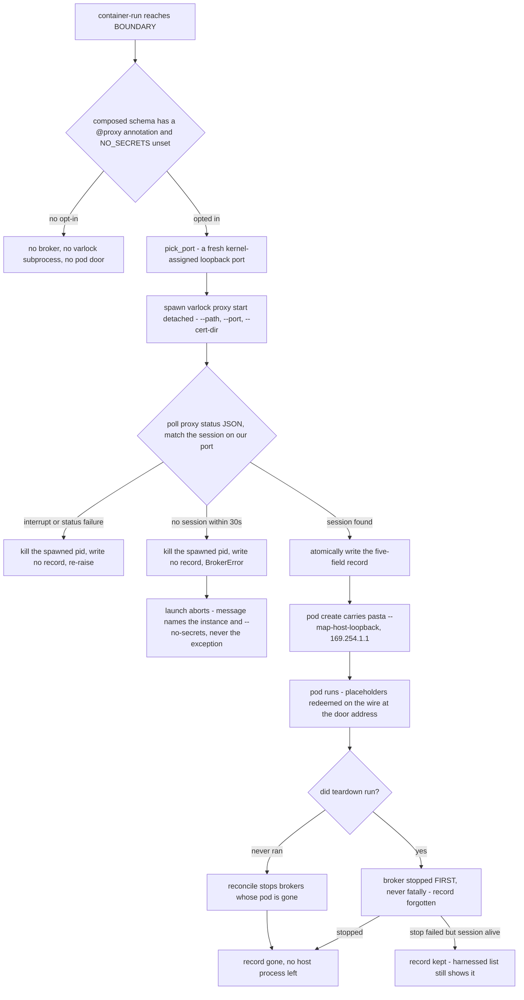

# The host secrets broker: one varlock proxy per instance (Topology B)

Epic #388 Phase 1 ruled **Topology B**: `varlock proxy` runs on the **HOST** — where 1Password, the
keychain, gpg-agent and a YubiKey can actually authenticate — binds `127.0.0.1` only, and injects
real values into outbound requests on the wire. The pod holds **placeholders** and reaches the
broker through pasta's `--map-host-loopback,169.254.1.1`, which the egress firewall permits
(**#436**). Nothing off-host can reach the broker, so there is **no `--expose` and no data-plane
token** — Topology B deleted both, along with the WebSocket tunnel. Do not reintroduce them.

`src/harnessed/broker.py` is the source of record for this subsystem. `launcher.py` consumes it
through three seams (`_broker_start_for`, `_broker_stop_for`, `_broker_report`); `launchenv.proxy_schema_dirs`
decides whether a launch wants one at all; `mounts._mcp_remote_pasta_net_args` delivers the pod's
route to it; `catalog/base/egress-firewall.sh` leaves the door open. Related:
[execution backends](backends.md) (where in the launch sequence the broker starts),
[the credential proxy model](../concepts/credential-proxy.md) (the `@proxy` vocabulary the gate
reads), [invariants](../concepts/invariants.md) (the firewall's fail-closed rules).

## Three measurements against varlock 1.16.1 shape everything

None of these is obvious from `--help`, and an implementation guessed from it would be wrong:

1. **`proxy start` does not daemonize.** It holds the terminal and streams a live request log until
   killed — so `broker.py` **spawns** it detached and returns, rather than running it to completion.
2. **The session id is read back from `proxy status --format json`, matched on the port we chose** —
   never parsed from `start`'s stdout, which wraps the id in ANSI styling. Matching is on the port
   because the port is unique per instance by construction, while several sessions can share an
   entry path and the list order is specified nowhere. Only the `HTTPS_PROXY` env key is matched: a
   measured session sets all six proxy vars to the same URL, so an `HTTP_PROXY` fallback would be a
   second code path no input can reach.
3. **`varlock` is invoked with `--path <schema_dir>`, never by cwd**: the mise shim resolves the
   binary only inside this repo, so a cwd-based call is not portable across callers.

Two timeouts follow from the same shape: `_START_TIMEOUT` (30 s, polled at 0.25 s) is long enough
for a cold node start on a loaded machine but short enough that a broker which will never come up
fails the launch instead of hanging it; `_CONTROL_TIMEOUT` (30 s) bounds `proxy stop`/`status` so a
hung control-plane call cannot wedge a teardown path other cleanup depends on.

## The launch gate: `@proxy` opt-in and `--no-secrets`

`launcher._broker_start_for` starts a broker **only** when both hold:

- the composed schema carries a `@proxy` annotation, and
- `--no-secrets` was not passed.

The annotation half is `launchenv.proxy_schema_dirs(project_path)`, which returns the schema dirs
that opted into the proxy model, in `--env-file` order (user-global `~/.config/harnessed` first,
then the project). It deliberately mirrors the dir selection in `_resolve_launch_secrets` rather
than inventing its own: the broker must resolve the **same** composed set the `--env-file` path
resolves, or the placeholder handoff leaves the pod holding placeholders for items the broker never
loaded. `varlock` must also be on `PATH`; absent, no broker and no error.

`proxy_schema_dirs` is a **text test by design** (`_schema_declares_proxy` reads `.env.schema` and
matches the annotation forms, not the bare word): it costs two file reads and **no subprocess**,
because `varlock proxy rules` *resolves values* and can sit on a 1Password unlock prompt. A launch
that opted into nothing must not buy one. The pinned property is stronger than "no broker was
recorded": **no varlock subprocess runs at all** — the launch test drives `broker._spawn`, `_status`
and `_run` with recorders and asserts the spawn list stays empty. Capability absent, not merely
empty.

`--no-secrets` reaches the backend as the `NO_SECRETS` environment variable — the **same mechanism**
as `--no-firewall`/`NO_FIREWALL`, one mechanism for the two opt-outs. The CLI flag sets the env in
`container_run`; `_secrets_disabled` reads it truthy for `1`/`true`/`yes` (case- and
whitespace-tolerant). The dangerous direction is pinned: a *falsy* value (`false`, `0`, `no`, empty)
must **not** read as "skip the broker", or a user explicitly asking for secrets would silently get
none.

**A failed start is FATAL** (#437, SPEC decision 2) — a deliberate behaviour change. The
alternative is a pod wired half-way to a proxy that is not there, the silent half-wiring epic #388
exists to remove, and it gets worse at **#439**, when the pod's env becomes placeholders that only
this broker can redeem. The failure message is **fixed and value-free by construction**: it names
the instance and the escape hatch and never interpolates the exception, because a message built by
echoing one would make "no resolved value reaches the user" a convention every future raiser has to
remember instead of a property of the code. The accepted cost: the broker's own detail (which port,
which timeout) does not reach the user through this path.

## The pod's private door: `169.254.1.1` through pasta

`paths.BROKER_HOST_DOOR = "169.254.1.1"` is the address at which a pod reaches a broker bound to
the host's `127.0.0.1`. It is **not routable by itself**: it works only because three places agree
on the literal, which is why the constant lives in `paths.py` rather than in any one of them —

1. `paths.py` owns the literal;
2. the pod is created with pasta's `--map-host-loopback,169.254.1.1`
   (`mounts._mcp_remote_pasta_net_args`, on the `pod create` argv) — **#437**;
3. the egress firewall **ACCEPT**s the address (`catalog/base/egress-firewall.sh`) — **#436**.

Remove either half of (2)+(3) and the pod cannot open a socket to the broker at all: the firewall
sets OUTPUT policy to DROP and whitelists from there.

The firewall rule is **deliberately not port-scoped**: the broker port is chosen at launch and is
never passed to the script, so a `--dport` rule cannot be written there. Narrowing it needs that
plumbing and belongs with **#437**; widening the *address* to a link-local CIDR is exactly what
**#436** refuses (a /16 would hand the pod the whole range, the opposite of Topology B's point —
nothing but the pod can reach the broker). The rule is `require`d, not best-effort: a failed call
is a broken firewall, not a missing lookup (#429's silent-firewall history). The firewall-door tests
run the real script under `bash` with stubbed boundary binaries and assert on the iptables argv the
script actually installs — the door rule present, installed *after* the `-F OUTPUT` flush, with no
ip6tables counterpart (the address is IPv4 link-local) and no CIDR anywhere.

### One `--network` value: the broker door composes with the OAuth callback

`podman pod create` accepts a **single** `--network` — emitting two is a hard launch failure. The
broker's `--map-host-loopback` therefore cannot be its own flag; it composes inside
`mounts._mcp_remote_pasta_net_args`, which already owns `--network` for mcp-remote's
`--host-lo-to-ns-lo` (OAuth callback delivery) and the plain `HARNESSED_NET` passthrough. The
composed form `pasta:--map-host-loopback,169.254.1.1,--host-lo-to-ns-lo` is the exact string the
**#388 Phase 0 spike verified with both features live**, which is why the broker option is written
first. The pinning evidence is the **whole-space assertion**: for every combination of
broker × explicit-network × server set, the composed argv contains at most one `--network` and at
most one `pasta:` value — both features can never be wired apart, because the helper returns them
as one list.

Conversely, the door **never appears without a broker**: a launch that gets no broker emits no
`--map-host-loopback`, so every stack in the catalog is not silently handed a route to the host's
loopback when nothing is listening there. An explicit `HARNESSED_NET` wins — the operator asked for
a network and silently rewriting it would be worse than the manual step — and the note says what it
costs: the broker still runs on the host's loopback, but this pod cannot reach it unless that
network routes there, proxied requests will time out, and `--no-secrets` (or unsetting the var)
avoids it. The warning names no secret and no value.

## Ports are picked, never pinned

`broker.pick_port` draws **kernel-assigned ephemeral candidates** (bind port 0, read the
assignment) and returns the first that a fresh bind probe finds free. It is not a fixed constant
because `varlock proxy start --port` *"fails to start if the port is in use"* (measured, 1.16.1) —
a hardcoded port would turn a second concurrent instance into a launch failure. `--port` is still
passed explicitly (that is what varlock means by a "fixed" port, against letting it pick one
internally), because the guest's `HTTPS_PROXY` must name a port before the process exists.

Port picking is **inherently racy and deliberately not locked**: the kernel can hand the same port
to someone else between the probe and varlock's bind, and varlock then fails loudly — the right
outcome, and cheaper than a lock this module would have to hold for the life of the pod. One
non-obvious correctness detail is pinned by test: the candidate generator yields *outside* the
socket context manager, because a generator suspends at its `yield` — yielding inside would hand
out a port the probe socket still holds, every candidate would read as taken, and `pick_port` would
fail on its own default path.

## The lifecycle

*The gate→spawn→status-poll→record→(teardown|reconcile) lifecycle. Every varlock interaction goes
through injected seams (`spawn`, `status`, `run`, `kill`), so the tests drive the whole cycle
without spawning a real broker — which would resolve real secrets out of a real 1Password.*

### `start`: spawn, poll, record

`broker.start` composes `varlock proxy start --path <dir>… --port <port> --cert-dir <dir>` —
`--path` is repeatable, and a launch passes **up to two** schemas (user-global, then project) so the
broker resolves the same composed set the `--env-file` path resolves, not a subset that silently
omits half the user's secrets — then spawns it detached (`start_new_session=True`, all stdio to
`DEVNULL`). It polls `proxy status --format json` every 0.25 s for up to 30 s, looking for the
session whose `HTTPS_PROXY` names our port, writes the record, and returns it. On timeout it raises
`BrokerError` naming the instance, the port and `--no-secrets`.

The broker's cert dir defaults to a sibling of the record (`state_dir()/<inst>-certs`) and may be
overridden; starting again over an existing dir is fine, and the **recorded** cert dir is asserted
to be exactly the one passed to varlock — a later issue (#438) binds that directory into the pod,
and a record naming a different path would send it to the wrong place with nothing noticing.

### A failed start leaves nothing behind

The ordering is the point: on **any** escape from the polling loop, the spawned process is killed
**before any state file is written**. A state file naming a dead session is merely stale and
`reconcile` fixes it; a **live broker with no state file is invisible to every cleanup path** and
would hold real secrets until the machine reboots — the worst orphan this module can produce.

The `except` catches `BaseException`, not `Exception`, and the reason is specific: `spawn` uses
`start_new_session=True`, so the broker does **not** receive the terminal's SIGINT. A Ctrl-C landing
anywhere in the up-to-30 s polling window would otherwise leave a live broker holding real
credentials with no record naming it — structurally invisible to `reconcile` (it reads filenames)
and immortal short of a reboot. The same BaseException rule covers a failure raised inside `status`
itself: any escape from the loop takes the spawned process with it.

### `stop`: one session, by name, never `--all`

`broker.stop` runs `varlock proxy stop --session <id>` — never `--all`, which would stop brokers
belonging to other instances **and to the user's own terminals** — and forgets the record when the
session is gone. It is idempotent, because `_pod_teardown` runs on paths that may already have torn
down, and stopping an unknown instance is a no-op.

A **non-zero `proxy stop` is ambiguous**: the broker may be wedged and still holding secrets, or the
session may simply have died already. The two need opposite handling — dropping the record of a
*live* broker orphans it with nothing naming it, while keeping the record of a *dead* one makes
`harnessed list` report a phantom forever. So on failure `stop` **asks `status` which case it is**
rather than guessing: record kept when the session still lives (the warning prints the manual
command, `varlock proxy stop --session <id>` — the session id, never a secret), record forgotten
when the session is already gone. A record `read()` cannot parse takes the same early-return path
*and is still deleted*, since a file nothing can parse would otherwise be permanent.

### `reconcile`: the backstop for every path teardown never reached

`broker.reconcile(pod_exists)` stops every recorded broker whose pod is gone and returns the
instances reaped. It is the backstop for a crashed launcher, a `podman pod rm` run by hand, a host
reboot that left records behind — without it a broker holding live secrets can outlive its pod
indefinitely, which is the worst failure available here. Its rules:

- It asks about the **POD**, not the instance — the pod is what podman owns; asking the wrong one
  would reap every broker on a runtime that names pods differently.
- A **corrupt** record is reaped too: it names no session to stop, so deleting it is all that is
  available, and leaving it would make it permanent. `all_instances()` reads *filenames*, not
  contents, precisely so corrupt records reach the sweep.
- A broker that **will not die** keeps its record and is *not* reported reaped — the next sweep
  tries again and `harnessed list` keeps showing it.
- A live broker for a still-existing pod never stops the sweep from reaching a later orphan, and one
  corrupt branch never short-circuits the other: the loop is written so each instance is judged on
  its own.

`reconcile` is wired into **`harnessed list`** (`_broker_report`), which reconciles **before**
reporting — the alternative is lying: a record whose pod is gone would otherwise read as an attached
broker, and the whole value of the section is telling the user whether a host process is holding
their secrets right now. It prints instance, session and `127.0.0.1:<port>` — which is everything
the record holds; there is no redaction step because there is nothing to redact. But `list` does
**NOT** reconcile off a failed `podman ps`: on a non-zero query it warns that the instance list is
incomplete and returns without sweeping, because a runtime that cannot be asked is not an answer —
reconciling there would report every pod absent and reap every live broker.

## The five-field state record

`broker.Broker` is a frozen dataclass holding **exactly** `instance`, `pod`, `session`, `port`,
`cert_dir` — what is needed to find a running broker again and stop it. Nothing else. `proxy status`
returns an `endpointToken` (a control-plane credential), `placeholderOverrides`, and the resolved
proxy env; **none of the three is ever persisted**, so *"the state file leaks no secret"* is true
**by construction** rather than by redaction. Anything added to the record must clear that bar. The
lifecycle test asserts it on the raw bytes with sentinels shaped like a resolved secret, a
control-plane token and a `vlk_placeholder` value — and positively, that the JSON keys are exactly
the five fields — so a future field that happens to carry one fails there rather than shipping.

Records live at `$XDG_STATE_HOME/harnessed/brokers/<instance>.json` (the convention
`launcher._attach_marker` established) and are written **atomically** (temp file, then `os.replace`):
`harnessed list` and a teardown can read while a launch writes, and a half-written record — which
would read as corrupt and get the live broker reaped — is never observable.

A corrupt record **reads as absent** (`read` swallows `OSError`/`ValueError`/`KeyError`/`TypeError`
and returns `None`), because it is called from `harnessed list` and from every teardown path, and a
half-written file must not take down a command whose job is to clean up. Absence is then turned into
deletion by `reconcile` (and by `stop`'s early return), which is what removes the file.

## Teardown ordering and fail-safe rules

`_pod_teardown` is the single choke point — covering `--rm`, `--fresh`, `prune`, the stopped-leftover
recreate, the stale-image recreate and the EGRESS abort path in one place — and its first statement
is `_broker_stop_for(instance)`: **the broker stops FIRST**, because it is a HOST process holding
live secrets and must not outlive the pod. And it **never fails fatally**: the wrapper catches
`BaseException`, not `Exception` — `KeyboardInterrupt` is not an `Exception`, and letting one
through would skip the `pod rm` below. The reasoning, stated in the source and pinned by test: the
**pod is the containment boundary**, so a container left running after the user asked to tear it
down is strictly worse than one leaked host process — which `broker.reconcile` will reap anyway.

`_broker_stop_for` is a named wrapper rather than a bare `broker.stop(...)` at each site because
`tests/test_launch_parity` identifies capabilities by **attribute name**: `broker.stop(...)` inside
a backend method would be indistinguishable there from the `stop` CLI command, and the ledger would
record a collision instead of this capability.

Two more ordering facts close the launch-side loop:

- The broker is started **before `pod create`**, because the pod's network args depend on whether
  there is one: without a broker the pod must not be handed a route to the host's loopback it has no
  use for. If `pod create` then fails — Ctrl-C included, same reasoning as EGRESS — the started
  broker is stopped before re-raising: a broker that outlives the launch it was started for is a
  host process holding live secrets that nothing will ever reap by name, worse than a leaked pod,
  which at least `podman ps` can see.
- The backend instance carries `self.broker` (set at BOUNDARY, `None` when the launch gets none) for
  exactly that failure handling — broker state is backend-instance state, not `LaunchSpec` input.

## Container-only by nature

The launch-parity ledger records `_broker_start_for`, `proxy_schema_dirs` and `_broker_stop_for` in
its `CONTAINER_ONLY` set — **container-only by nature, not by decision**. The broker exists so a
CONTAINER can hold placeholders while real values are injected on the wire from the host; a
host-native launch runs the harness in the user's own session with their own credentials, there is
no boundary for the broker to sit on, and varlock resolves natively there already. The epic's
backend matrix records exactly this: "host: n/a (native varlock)".

The pod-less runtime case is handled as a *note*, not a half-wired broker: the door is a pasta
option on `pod create`, so a runtime with no pods has no way to deliver `169.254.1.1` into the
container. Starting a broker there would produce exactly the half-wired state `--no-secrets` exists
to avoid, so the launch says so and resolves secrets into the container env as before.

## The three test modules as contracts

`tests/test_broker_launch_gate.py` pins the **gate**: no opt-in means no varlock subprocess at all
(the spawn recorder stays empty); every documented truthy `NO_SECRETS` spelling disables and every
falsy one does not; `--no-secrets` is a real flag on `container_run`; a failed start aborts the
launch with exit code 1, the message names `--no-secrets`, and a sentinel planted in the raised
`BrokerError` never reaches stderr; and the global schema counts as half the composed set, passed
**global-first** (the order is the contract, because `--env-file` is last-wins and the project must
override the global).

`tests/test_broker_lifecycle.py` pins the **lifecycle and the no-leak property**: the spawned argv
begins `["varlock", "proxy", "start"]` with every composed `--path`, the explicit `--port` and
`--cert-dir`, and **never** `--expose` or `--persist-ca` (reintroducing either would publish a
secret-injecting proxy to the LAN and the tailnet); the session is matched on our port with two
sessions live and the list polling until it appears; a failed start raises, writes no state file and
kills the spawned pid; an interrupt or an in-loop failure does the same; `stop` issues the whole
`varlock proxy stop --session <id>` argv, never `--all`, keeps the record of a broker that would not
die and forgets one whose session is already gone; `reconcile` stops and forgets by the whole argv,
asks about the pod, reaps corrupt records, and is not fooled by a single-record `break`/`continue`
collapse (two-record tests for the live broker and the corrupt branch each); and the state file's
raw bytes hold no secret sentinel, no token, no placeholder prefix — exactly the five keys.

`tests/test_broker_pod_args.py` pins the **composed network argv**: broker alone asks for
`pasta:--map-host-loopback,169.254.1.1`; broker plus callback composes the exact #388-spike string
with the publish intact; the door never appears without a broker; **at most one `--network` and at
most one `pasta:` value across the whole broker × net × servers space** (the invariant the
composition exists to hold); and an explicit `HARNESSED_NET` suppresses the door with a warning that
names the address and no secret. What these tests cannot show is a packet crossing the route — no
test in the repo starts a pod; the firewall half is proven separately by running the real
`egress-firewall.sh` under stubbed `iptables` (tests/test_egress_firewall_broker_door.py).

One structural rule holds `broker.py` itself: it reports through the shared console, so it is listed
in `tests/test_module_boundaries.py::EXTRACTED` (with the note that it never lived in `launcher.py`)
and is barred from importing launcher — dependencies point into the modules, never back out.

## Operations

- **Inspect**: `harnessed list` prints the `Secret brokers (host-side, one per instance)` section
  after reconciling — instance, session, `127.0.0.1:<port>`. A stale record is reaped before it can
  be shown.
- **Stop by hand**: `varlock proxy stop --session <id>` — the exact command the kept-record warning
  prints. Do not use `--all`.
- **Escape hatch**: `harnessed container-run --no-secrets` skips the broker and the pod's proxy
  wiring; the launch keeps working with the pod holding real resolved values as it does today.
- **State**: `$XDG_STATE_HOME/harnessed/brokers/*.json` — five fields, safe to read, safe to delete
  only via `reconcile`/`stop` (deleting the file of a *live* broker by hand orphans it).

## Related

- [Execution backends](backends.md) — BOUNDARY is where the broker starts, and why it runs before
  `pod create`.
- [The credential proxy model](../concepts/credential-proxy.md) — the four `@proxy` modes and the
  annotation gate `proxy_schema_dirs` reuses.
- [Credentials](../concepts/credentials.md) — the host-side resolution machinery (`varlock load`)
  that today still delivers real values to the pod, and the 60-second unlock timeout.
- [Precedence](../concepts/precedence.md) — the global-then-project `--env-file` layering the
  composed schema-dir order mirrors.
- [State](state.md) — the on-disk neighborhood the broker records live in: the XDG state home and
  the attach-marker convention `broker.state_dir` mirrors.
- [Invariants](../concepts/invariants.md) — the fail-closed egress firewall and the deliberately
  unscoped broker door rule.
- [container-run](../workflows/container-run.md) — the launch sequence the gate and teardown sit in.
