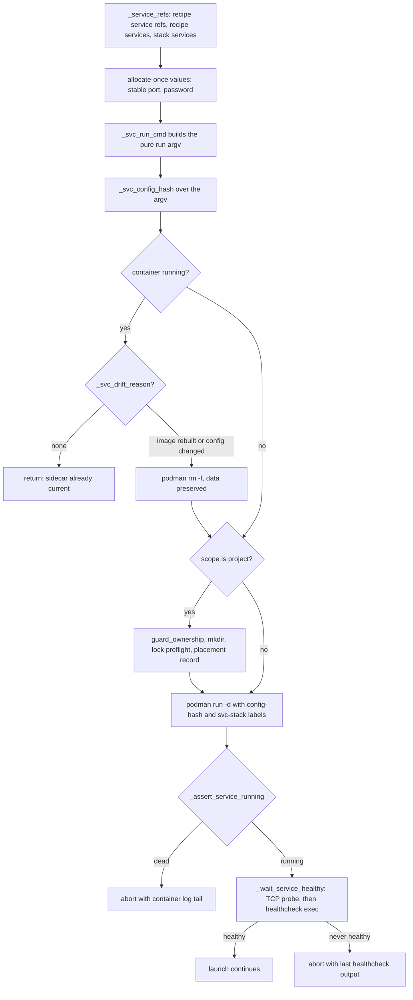

# Service sidecars: identity, scopes, guards, and sockets

A **service** is a sidecar with its own image and `catalog/services/<name>/service.yaml`,
referenced by a recipe via `mcp.servers[].service:` (an MCP surface) or attached by a recipe or
stack via `services:` (no MCP surface). It is shared across the stacks of a project and outlives
any instance: launches start it idempotently, `--fresh` tears down only the pod, and `svc down`
removes only the container — the data stays.

Do not confuse the two MCP shapes a recipe can declare. A **stdio server** (`command:`) is a child
hatago bakes into the harness image and spawns; a **`service:`-referenced server** declares no
command and is a *network proxy* the assembler resolves to a hatago URL entry. The schema refuses
to let one entry be both: `service:` with `command:` is rejected ("a service-referenced server is a
network proxy, not a child process"), and so is `service:` with `direct:` — the URL proxy is
precisely what `direct:` bypasses.

The code splits by verb. `svcstate.py` **derives** everything computable about a sidecar; the
catalog manifest (`ServiceDef`) declares what only the service itself knows; `svcguards.py`
**refuses** launches that would corrupt or shadow data; `launcher.py` is the only module that
starts, stops and health-checks containers. Nothing is written down that can be recomputed — and
that is the property a second launch relies on to find the same service instead of starting a
duplicate.

Related: [system overview](/openwiki/architecture/overview.md),
[state, staleness, and GC](/openwiki/architecture/state.md),
[the folder-env contract](/openwiki/concepts/env-contract.md),
[invariants and deliberate deviations](/openwiki/concepts/invariants.md),
[container launch](/openwiki/workflows/container-run.md).

## Identity is derived, never stored

| Identity | Derived by | From |
|---|---|---|
| container name | `svcstate._svc_container` | `harnessed-svc-<name>`, plus `-{project_key}` when `scope: project` |
| project key | `svcstate._svc_project_key` | `paths.project_hash` of the git common dir (the project path itself outside a repo); empty for global |
| data dir | `svcstate._service_data_dir` | the recipe's persist entry the service names via `data.persist` |
| stable host port | `svcstate._svc_stable_port` | one machine-wide registry, allocated once |
| ephemeral host port | `svcstate._svc_published_port` | `podman port <ctr> <port>`, read back every launch |
| password | `svcstate._svc_password` | one secret file under XDG state, minted once |
| client env | `svcstate.svc_client_env` | the service's own `client_env:` templates, resolved per launch |
| drift | `svcstate._svc_drift_reason` | the `harnessed.svc-config-hash` label vs today's re-derived hash |

Same inputs, same outputs, every launch — that is the whole mechanism. A stored name or port would
need invalidation logic and would drift from reality; a computed one cannot.

### The project key is the git common dir

`scope: project` services are keyed by `paths.git_common_dir`, not by the worktree: every worktree
of one checkout resolves to the **same** key and therefore to **one** server container. That is
the point of the scope — a `dolt sql-server` holds an exclusive lock on its data dir, so one lock
holder must serve every worktree, while agent *instances* stay keyed per worktree
(`paths.instance_name`). Separate checkouts get separate servers.

A consequence the code has to absorb: the stack that owns the sidecar may be running from a
*sibling* worktree. `_repo_project_hashes` walks `git worktree list --porcelain` and returns this
folder's hash plus every sibling's, degrading to just this folder when git does not answer.

## Two scopes, two reachability models

**`scope: global` (the default, and every service shipped today: `ping`, `agentmemory`,
`gbrain`).** One image, one container, one named volume (defaulting to `<name>-data`), published
as `-p <port>:<port>` with a lifecycle independent of any instance. The assembler resolves a
recipe's `service:` reference into a hatago URL-proxy entry —
`{url: http://host.containers.internal:<port>/mcp, type: http}` — so a pod member reaches the
service through the rootless host-gateway address. Any number of concurrent instances attach to
the one container; its named volume survives `svc down`. Note that this is the **only unqualified**
`-p` in the whole service story: it publishes on every interface because a pod member reaches the
service through `host.containers.internal`, an address loopback alone does not answer — while both
`publish:` forms below are pinned to `127.0.0.1`.

**`scope: project`.** One container *per project* (git-common-dir keyed), whose `/data` is a bind
mount of the persist dir the owning recipe declared, and which publishes **no port at all** when
socket-backed. Peers reach it through a **unix socket inside the data dir** — and that is the
load-bearing trick: a socket is a filesystem object, so it crosses the bind mount both backends
already share. No port allocation, no netns arithmetic, no mode-specific addressing; a host agent
and a containerized agent dial literally the same path, which is also what makes a socket-backed
sidecar compose with `host-run` for free. A socket-backed server is reachable only by code that
speaks unix sockets, though — a client that falls back to TCP for any part of its work has
nothing to connect to — which is why `publish: ephemeral` is the current answer for a
project-scoped service that clients reach by TCP, and the socket form remains supported but
secondary.

The schema enforces the shape at load (`schema.load_service`): `name` and `image` are required,
and scope must be `global` or `project`. Beyond that:

- `scope: project` **requires** `data.persist` and gets `volume=""` — a project service never owns
  a named volume; `data.persist` on a global service is rejected.
- a declared `port` must be 1–65535 and may be **omitted only by a socket-backed service** (0 is
  not a "no port" spelling — omit the key, or set `socket`).
- `socket` requires project scope and must be **relative** to the data dir (its host path differs
  per project, so an absolute socket path could silently escape it); `socket` and `publish` are
  mutually exclusive — a service is reached one way, so clients cannot disagree. `publish` may be
  `ephemeral` or `stable`.
- `exclusive_lock` (the pre-start guard's probe name) requires project scope.
- `client_env` values may use only `{host}`, `{port}`, `{socket}`, `{password}` — and only the
  tokens the service actually has (`{host}`/`{port}` are rejected on a socket-only service,
  `{socket}` when no socket is declared).

## The service follows the recipe's placement

A project service does **not** choose where its bytes live — the recipe does. The service names a
persist entry (`data.persist: <name>`), `svcstate._service_data_dir` scans the stack's recipes for
the one that declares it, and follows **that entry's** placement:

- `location: in_repo` → the host dir is the checkout-root-anchored dir
  (`paths.persist_in_repo_dir`: `<root>/<name>` for a normal checkout, `<...>/.bare/<name>` for
  bare + linked worktrees), and agents see it at the **same path** in both modes, because the
  workspace is mounted path-preserving.
- `location: host` → the host dir is the persist dir keyed by the entry's own scope
  (`paths.persist_project_dir` or `persist_workspace_dir`), and the **agent-visible path differs
  by mode**: `$CONTAINER_HOME/<name>` in a pod, the real persist dir on a host launch. Returning
  the container path unconditionally once handed host-mode consumers `/home/harnessed/<name>` — a
  path that does not exist on the machine it would be used on (bd harnessed-5ek).

No recipe in the stack declares the entry → `SchemaError`: a stack that attaches a service but has
no recipe naming its data dir *cannot say where the data lives*. This is the single knob — one
recipe variety declares its data `in_repo`, a sibling declares it `host`, and the same service
manifest follows either one.

For an `in_repo` data dir the sidecar additionally mounts the workspace **path-preservingly**
(`-v {host_dir}:{host_dir}:rw`) and receives the git surface — the repo, git identity, the ssh
agent, and opt-in ssh keys — because the server's own git traffic (`dolt clone` at init,
`dolt push` at sync) shells out to a CLI that only routes to a server on *its own loopback*, so
the clone and the push can only ever run inside the service container.

## Ports and passwords

**`publish: ephemeral`** — the run argv is `-p 127.0.0.1::<port>` with no host side: the runtime
allocates, so N per-project sidecars can never collide and nothing is written down to go stale.
The chosen port is read back with `podman port` at **every** launch — deliberately never cached,
because it changes on every recreate and a stale copy is exactly the failure the socket design
refused to persist its own path to avoid. When the port cannot be read, `svc_client_env` warns and
exports **nothing** for that service: no plausible-looking default, because a wrong port is the
failure where the client cannot reach the server and the auto-start that would normally paper over
it is exactly what harnessed disables.

**`publish: stable`** — a host port the *project* can be told about. Allocated once per
`(service, project key)` into **one machine-wide registry** (`paths.svc_ports_file`,
`$XDG_DATA_HOME/harnessed/svc-ports.json`) taken under an exclusive `flock` on a `.lock` sibling —
one file, not one per project, because an allocation must answer "is this port already promised to
some *other* project?". Candidates come from 20000–59999 (above everything IANA-registered and
above the runtime's scratch range) and are rejected if the registry holds them or
`127.0.0.1:<port>` cannot be bound right now. An entry is **kept even when momentarily
unbindable** — the normal case is that our own sidecar is holding it — which is what stops the
number drifting between launches. `svc_client_env` reads the registry, not `podman port`, so the
value stays knowable while the container is *stopped* — exactly when a plain `bd` in the repo
still needs a configured environment.

Both publish forms bind `127.0.0.1` on purpose: an unqualified `-p` publishes on every interface
and would put a project's issue database on the LAN. But loopback stops the LAN, not other local
processes and users — a TCP port has no filesystem ACL — so a published service must
authenticate. That is `{password}`: whenever any `client_env` value uses it, the launcher
provisions one secret per service+key with `secrets.token_urlsafe(24)` (never a hash of the
project path — the path is guessable, a secret must not be), stored at
`$XDG_STATE_HOME/harnessed/svc-secrets/<name>-<key>` mode `0600` inside a `0700` dir. It lives
under XDG state and **never in the service's data dir**: for an `in_repo` placement that dir is
the user's repo, and a secret written there is one `git add -A` from the remote. The container
receives it as `HARNESSED_SVC_PASSWORD` — a generic name; the entrypoint decides what to call it
in its own protocol's terms.

## The ensure lifecycle

Both backends converge on `_ensure_services` → `_ensure_service` per referenced service:

*`_ensure_service`: the guards and allocate-once resolution fire only on the path about to create
a container; the drift comparison runs against one that is already up.*

The argv is built by `_svc_run_cmd`, which is **pure** — it reads the filesystem and writes
nothing. That matters because it is called twice: once on the create path, and once on the check
path against an *already-running* container, to compute what the current code *would* create. A
write on the second call would fire for a container nobody asked to touch. Hence the two
allocate-once values arrive as arguments rather than being resolved inside: `stable_port` and
`password` both create machine-local state on a miss (a registry entry, a secret file), and
`_ensure_service` resolves them once, at one visible place, on every path. Everything a container
fixes at create time — mounts, published ports, env, userns — is in the argv, which is what makes
hashing it a faithful fingerprint of the running container's configuration.

### Drift: recreate, never restart

`podman restart` re-runs the *existing* container, so mounts, published ports and env stay frozen
at whatever the code emitted the day it was **created**. Without a record, a sidecar drifts
arbitrarily far from the code that would create it today and nothing notices — which is exactly
how five beads-servers ran for days without the mount that made `dolt_backup` work, each failing
every backup silently (bd harnessed-ku9). The record is the `harnessed.svc-config-hash` label: a
sha256 over the create-time argv (`_svc_config_hash`), stamped on the container at create and
**re-derived at every launch** for comparison (the labels are excluded from the hashed argv — the
hash cannot contain itself). `_svc_drift_reason` reports two independent staleness kinds — the
image was rebuilt under the container (`ctrquery._container_stale`), or the create-time
configuration no longer matches — and a **missing** label counts as the second kind: a container
that predates labeling cannot be shown to match, and by construction predates every fix since.

On drift, `_ensure_service` prompts to `podman rm -f` and recreate (proceeding automatically under
`HARNESSED_HEADLESS`). **Data is always preserved** — named volume or bind mount; recreating the
container is the only way a running sidecar picks up a change to how harnessed builds it. This is
also why `harnessed svc recreate` exists as a verb and `restart` does not.

A second label, `harnessed.svc-stack`, records which stack a project-scoped sidecar was created
for — its data dir is chosen by the stack (which recipe declares the persist entry), so rebuilding
it needs that answer, and reading it off the container beats guessing what the current folder
"means". For containers predating the label, `svc recreate` falls back to reading stacks out of
agent instance names (`harnessed-<harness>-<stack>-<hash>`): both ends are stripped against known
values because stack names routinely contain dashes, harnesses are tried longest-first
(`claude` vs `claude-extended`), running instances win over stopped ones, and *two* candidates
refuse to guess — picking one would rebuild against a different persist entry, i.e. a different
data dir.

### Started does not mean healthy

`podman run -d` returns 0 once the container is **created**, so a service whose process dies a
moment later leaves the launch believing it succeeded. `_assert_service_running` inspects the
state immediately; on death `_abort_dead_service` prints the container log tail — the reason is
already in there — and exits 1. `_wait_service_healthy` then does two-phase readiness: raw TCP
first for a published port (the ephemeral case asks the runtime which host port to probe), then
the service's declared `healthcheck` exec'd **in the container** against a deadline. For a
socket-only service there is no port to probe, so that healthcheck exec *is* the readiness
signal. A healthcheck that never passes **aborts the launch** (bd harnessed-dwt): it used to warn
and continue, which left the agent attached to something it could not talk to, failing far from
the cause. There is no `required:` flag — a stack does not attach a sidecar whose health it is
indifferent to. On timeout the **last healthcheck's own output** is surfaced, not the container
log: for an auth failure the log shows a server running contentedly while the healthcheck holds
the actual reason.

## The pre-start guards: assertions about host state, raised not acted

`svcguards.py` holds the checks that run **before** a project sidecar's container is created. Each
reads the filesystem and raises (`typer.Exit(1)`); none starts, stops or touches a container —
that stays in `launcher.py`. They exist because a sidecar shape removes contention between
*containers* by construction, but the host is still there, and the two ways it can corrupt a
service are silent and far from their symptoms.

**The exclusive-lock preflight** (`_assert_data_dir_unlocked`). A project service exists because
it holds an exclusive on-disk lock over per-project data. A **host** process holding that same
lock wins it, and the sidecar then dies at startup while `podman run -d` already returned success:
clients fail against a socket that was never created, and the engine's own advice ("start the
server yourself") is unactionable inside an agent container that deliberately ships no engine
binary. The guard scans `/proc` for a process whose executable basename matches
`exclusive_lock` and whose **cwd is inside the data dir** — matching on cwd, not on the command
line, is what makes it precise: a `dolt sql-server` chdirs into the data dir it locks, so cwd
identifies the *contended resource*, whereas the port or db name on the command line does not.
Other users' processes raise `PermissionError` on inspection and are skipped — not our contention
to worry about. The error prints the holder's PID and command line and suggests stopping it or
running the stack with `--host` to use that server instead.

**Placement stability** (`_assert_placement_unchanged`). A `data.persist` entry can be placed
`in_repo` or `host`, and the two do not notice each other: launching the host placement over a
checkout that already holds an in-repo workspace would silently start a **second, empty** data
dir whose missing contents read to the user as data loss rather than as misconfiguration. So each
service's active placement is recorded in `harnessed-placement.json` **inside the git common dir**
— chosen on both counts: shared by every worktree, so the record cannot disagree between them,
and never git-tracked, which a `location: host` placement (whose whole point is leaving no trace
in the repo) requires. A launch whose placement differs from the record aborts, naming the record
and the `rm` that clears it once the user has decided which copy they meant. It is deliberately
**not self-healing** — both placements may hold real data by the time they disagree, and picking
one would discard the other. Writing the record is best-effort: it only ever prevents a future
mistake, so a read-only git dir must not take down the launch in front of it.

**The honest scope note.** Both guards run only under `if svc.scope == "project"`, and every
service currently in the catalog defaults to `scope: global` — so neither fires today. They are
kept as the generic contract for the next project-scoped service, not because anything shipped
exercises them (beads-server, which did, was removed). Do not "clean them up".

## The wire_services ordering invariant

The services a stack requires are the union of **three** sources, de-duped in first-seen order
(`svcstate._service_refs`): recipe `mcp.servers[].service:` refs (the ones the assembler proxies
by URL), recipe `services:` (sidecars a *recipe* requires with no MCP surface — the form that lets
a bare recipe list describe a working stack, e.g. a `dolt sql-server` that speaks MySQL, not MCP),
and the stack's own `services:` list. `_ensure_services` starts each one idempotently.

`wire_services` is the backend-contract capability that stands those sidecars up, and **where it
sits in each sequencer is load-bearing**:

- **Container backend:** it runs **before the re-attach branch**, deliberately. A long-lived agent
  container outlives its sidecars; the call used to sit on the create path only, so once an
  instance was running, every subsequent launch took the attach branch and never looked at
  services again — a sidecar that died stayed dead for the life of the container (observed
  2026-07-21: a sidecar dead for 3 hours, revived by nothing, while `bd` failed every session).
  Reviving it is exactly what "idempotent" already promised: `_ensure_service` finds it not
  running and starts it again.
- **Host backend:** it runs **before the recipe env and setup scripts** (and before the project
  tool-env write, whose client env includes the services' connection values). A recipe's
  `setup:` may interpolate `$HARNESSED_<SVC>_SOCKET` — the sidecar, and the socket it serves, must
  already exist before anything references them.

Both backends start the *same* sidecars: a `services:` entry is a property of the **stack**, not
of the backend (bd harnessed-2sm) — host mode makes the agent host-native, it does not remove the
service the stack declares. The host call is guarded on the stack actually declaring services, so
a service-less host launch still needs no container runtime at all. Both calls pass
`_resolve_mount_path` (the same widened mount a launch computes), not the raw project path:
otherwise the create-time config — and therefore the `harnessed.svc-config-hash` label — differs
by entry point, and alternating `host-run` with `container-run` would flag drift and recreate the
sidecar on every launch (bd harnessed-wnf).

One more pre-create step sits on the project path: `persist.guard_ownership` on the data dir,
plus its `mkdir`. The persist dirs are ownership-guarded because under `paths.USERNS_ARG` the pod
writes as the invoking host uid — a pre-existing dir owned by a different uid would silently
EACCES inside the container. The guard reads the writer off the declared mapping
(`paths.pod_host_uid()`), not `os.getuid()`, precisely so it can catch the mapping itself being
wrong — compared against `os.getuid()` it waved through six consecutive red CI runs while the pod
owned nothing and the entrypoint died on `mkdir -p /data/dolt`.

## How service client env reaches recipes

A service declares `client_env` — the variables its **clients** need, named in the service's own
protocol's terms (`BEADS_DOLT_SERVER_PORT: "{port}"`). Declaring them in the service keeps the
launcher generic: it knows "a service declares client env", not "beads wants
BEADS_DOLT_SERVER_PORT" — the same separation `data.persist` gives placement. Values are templated
on `{host}`, `{port}`, `{socket}`, `{password}` and resolved **per launch**, because the port does
not exist until the container runs (so this cannot go through emit-time env resolution). `{host}`
is the one value that differs by mode — `127.0.0.1` for a host agent, `host.containers.internal`
for a containerized one — and both mean the same published port.

Two delivery surfaces, both fed from `setupenv.harnessed_env`, which appends
`svc_socket_env` (a `HARNESSED_<NAME>_SOCKET` var per socket-backed project service, valued at the
mode-resolved data dir plus the socket name) and then `svc_client_env`:

- **Real container env** (`podman run -e`), not an attach-shell export: `_init_shell_prologue`
  reaches only the interactive shell, so a `podman exec`, a hook, or any subprocess would
  otherwise see the variables unset — and `bd` silently accepts an *empty* `--server-socket`,
  falling back to its old TCP config instead of failing. Setting them on the container makes every
  process in it agree. The attach shell exports the same values in its prologue.
- **The project tool-env dotenv** (`_write_project_tool_env` → `harnessed project-env-path`):
  the host-mode `svc_client_env` values land in a `0600` file under XDG state, keyed on the git
  common dir, so a plain `bd` in a terminal — a client harnessed does not launch — is configured
  too. This is also why `publish: ephemeral` is wrong for a service a project configures directly:
  an ephemeral port written into that file would be wrong after the next container recreate,
  which is exactly the property `publish: stable` buys.

Nothing about the socket path is persisted into the server's own container: the old
`HARNESSED_SOCKET_PATH` (stamped into `.beads/metadata.json` by the entrypoint) is gone, because
clients now learn the socket from their own environment, resolved through the same persist entry
the server mounts — one computation, no copy to go stale.

## Building the image, and the `svc` verb

`launcher._build_service_image` builds a service image layer-cached (a no-op when the Dockerfile
is unchanged): `harnessed build` calls it for every referenced service so images are ready before
first run, and `_ensure_service` calls it lazily when the image is simply missing. It is built
once per process (`_build_shared_once`) — two stacks referencing the same service under
`--jobs > 1` would otherwise race to build one tag — from a temp build context so podman's secret
temp files never land beside the catalog, with a corporate-proxy CA block injected into a temp
Dockerfile when one is configured.

`harnessed svc <action> <name>` supports exactly `up | down | recreate | sync` — one list both
validates the action and spells the choices in the error, so a new action can never be accepted by
the dispatch while the error still calls it unknown. The unknown-action check runs **before** the
scope/stack guard, because that guard interpolates the action into the command it suggests —
answering `svc restart <name>` with "pass `--stack` … e.g. `harnessed svc restart …`" would send
the user to a second failure instead of the real one. `restart` is rejected as a verb on purpose:
mounts, ports and env are fixed at create time, so a restart reuses the container and reports
success while changing nothing. `up`/`recreate` route through `_ensure_service`
(`force_recreate` for the latter); `down` removes only the container; `sync` execs the service's
declared `sync:` command **inside its container**, unbounded (a database import legitimately runs
for many minutes; Ctrl-C is the control), because the server's git sync can only run where its own
loopback is reachable — and it pushes to your git remote, so it is explicit, never automatic.

`scope: project` changes what the verb needs. The data dir resolves through the stack's persist
entry, so `svc` on a project service requires a project context and — except for `recreate` —
`--stack`. `recreate` is the exception because it rebuilds the container *that is already here*:
it reads the stack off the `harnessed.svc-stack` label (and for a pre-label container, off the
agent instances for this repo), so from inside the project it takes no flags at all. And
`_ensure_service` itself refuses a project service when `project_path` is missing, directing the
user to run it via a stack launch rather than `svc up` — the same reasoning as the `--stack`
guard, one layer earlier.

The mount the sidecar's create-time config depends on is the bare-worktree-widened resolution
from `attachcmd._resolve_mount_path` — it auto-widens to the parent of a bare repo so sibling
worktrees stay visible. `svc up`/`recreate` compute that same widened mount for `scope: project`
services, matching what a launch computes. Only a project-scoped service mirrors the workspace at
all, so the widening is skipped (and its `[INFO]` line suppressed) for global sidecars.

That "both entry points start the same sidecars" is also what `capmatrix` records: the `services`
primitive is SUPPORTED on both backends (`HostBackend.wire_services` → `_ensure_services`,
bd harnessed-2sm) — the table exists because BACKENDS.md's prose version went stale claiming host
did not support sidecars, and the conformance tests over `MATRIX` and `PRIMITIVES` are the
anti-rot mechanism.
