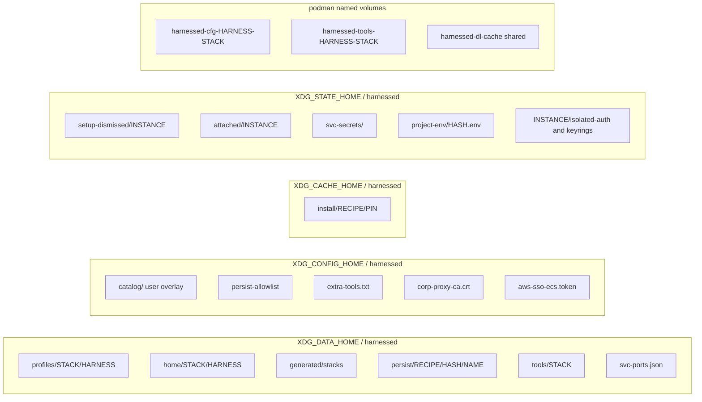
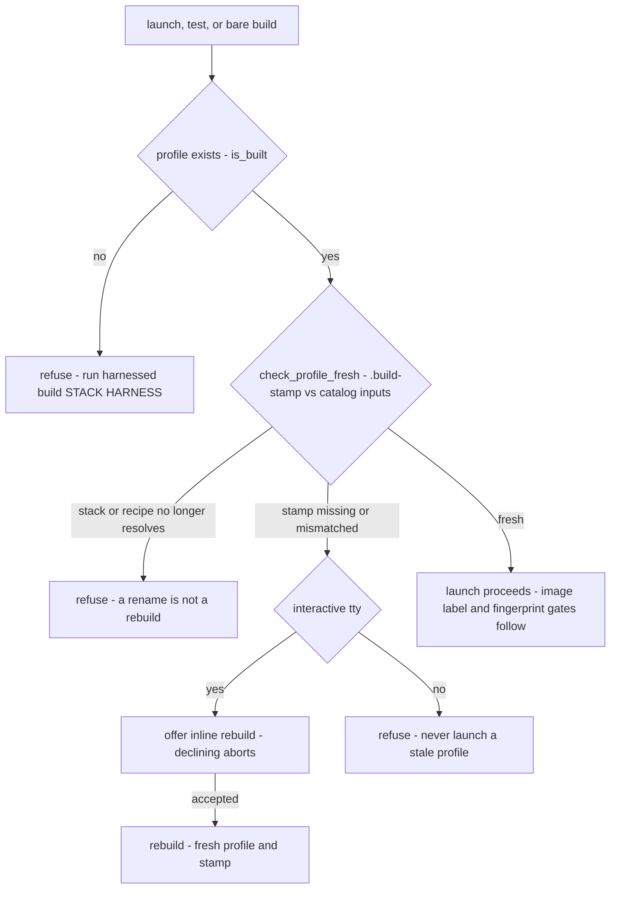
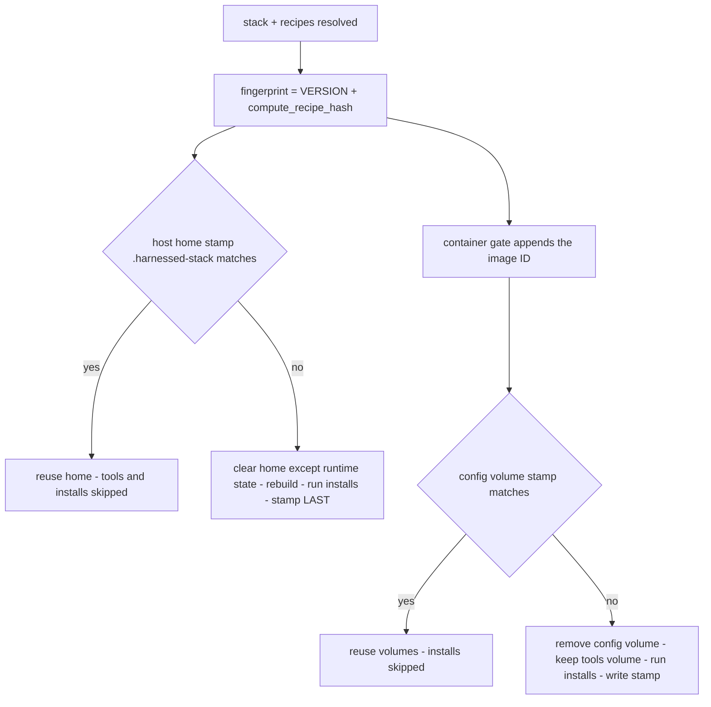

# State: what lives where on disk, staleness, and GC

harnessed keeps **none** of its state in the repo and none of it in the installed package: the
clone/wheel stays immutable source, and everything the tool derives or accumulates lands under
XDG roots or in podman named volumes. Every path, every instance name, and every project key is
computed in exactly one place — `src/harnessed/paths.py`, whose module docstring states the rule
outright ("All profile dirs, instance names, project relpaths, and container-internal paths are
derived here. No caller computes these independently", fixing B6 scatter). `layout.py` exists
alongside it for a narrower reason: the handful of derivations every module needs **before** it can
do anything else (the harnessed home, the repo stacks dir, the derived image tag, the profile dir)
would otherwise have to be imported *from* `launcher.py`, pointing the dependency the wrong way.
That single-resolver rule is what makes the rest of this page safe to reason about: when a module
needs to know where a stack's profile lives or what a pod is called, it imports the answer instead
of re-deriving it.

Related: [system overview](/openwiki/architecture/overview.md),
[catalog and schema](/openwiki/architecture/catalog-and-schema.md),
[service sidecars](/openwiki/architecture/services.md) — sidecar identity and drift —
[build pipeline](/openwiki/workflows/build.md),
[dynamic stacks](/openwiki/workflows/dynamic-stacks.md).

## The disk map



*Every harnessed state root, with the module that owns it. `paths.py` computes all of the
filesystem paths; `volumes.py` names and labels the volumes.*

| What | Path | Owner | Notes |
| --- | --- | --- | --- |
| Assembled profiles | `$XDG_DATA_HOME/harnessed/profiles/<stack>/<harness>/` | `paths.profiles_root` / `paths.profile_dir` | XDG **data**, not cache — per-harness so the same stack's claude and omp builds never clobber each other. `.mcp.json` is the build marker; `.build-stamp` carries the input hash. Regenerated wholesale by `emit.reset_profile` on every assembly, so the tree is a pure function of its catalog inputs. |
| Host homes | `$XDG_DATA_HOME/harnessed/home/<stack>/<harness>/` | `paths.host_home` | The host-native `CLAUDE_CONFIG_DIR` / omp agent tree. Deliberately **not** project-keyed. Siblings: `<harness>.lock` (flock file) and `<harness>.home` (the `$HOME` shim). omp's nested `claude-config` child rides the same rebuild. |
| Generated catalog | `$XDG_DATA_HOME/harnessed/generated/stacks/<name>/stack.yaml` | `paths.generated_catalog_root`, `dynstack.mint` | Machine-minted by `--recipe` composition. A catalog root (it *contains* `stacks/`), deliberately **last** in precedence. |
| Persist dirs | `$XDG_DATA_HOME/harnessed/persist/<recipe>/<project_hash>/<name>/` | `paths.persist_root`, `persist_workspace_dir`, `persist_project_dir` | Recipe-declared persistent data. Bind mounts, not volumes — the host owns the bytes. Its own `persist/` namespace so a recipe name can never collide with `profiles/`. |
| Install cache | `$XDG_CACHE_HOME/harnessed/install/<recipe>/<cache_key>` | `paths.install_cache_dir` | Keyed by the recipe's **pinned** ref, and shared cross-stack on the container path. |
| Host-native tools | `$XDG_DATA_HOME/harnessed/tools/<stack>` | `setupenv._stack_tools_dirs` | Stack-scoped mise data/config dir, bin dir, uv tool dir. |
| Stable port registry | `$XDG_DATA_HOME/harnessed/svc-ports.json` | `paths.svc_ports_file` | ONE file per machine, data not state — losing it re-allocates ports already written into projects' `mise.local.toml`. Mutated under an exclusive flock on a sibling `.lock`. |
| Setup-dismissed flags | `$XDG_STATE_HOME/harnessed/setup-dismissed/<instance_name>` | `paths.setup_dismissed_flag` | Existence means "dismissed", keyed per (stack, harness, project). |
| Attach markers | `$XDG_STATE_HOME/harnessed/attached/<instance>` | `launcher._attach_marker` | mtime records the last interactive attach; drives `harnessed prune`'s idle threshold. |
| Service secrets | `$XDG_STATE_HOME/harnessed/svc-secrets/<name>-<key>` | `svcstate._svc_password` | Machine-local, `0600` in a `0700` dir — never in a service data dir that might be a repo. |
| Project tool env | `$XDG_STATE_HOME/harnessed/project-env/<project_hash>.env` | `setupenv.project_env_path` | The one file that hands the *project* (not just the agent) the same tool env, including the service password. Keyed by git-common-dir hash. |
| Per-instance identity | `$XDG_STATE_HOME/harnessed/<instance>/…` | `mounts._isolated_auth_store`, `mounts._keyring_state_mount` | `isolated-auth/credentials.json` (claude) and `keyrings/` (antigravity) — survive a recreate, wiped only by `--fresh`. |
| Persist allowlist | `$XDG_CONFIG_HOME/harnessed/persist-allowlist` | `paths.persist_allowlist_path` | User-owned gate for `scope: global` mounts (below). |
| Extra tools | `$XDG_CONFIG_HOME/harnessed/extra-tools.txt` | `paths.extra_tools_path` | Seeded from the shipped default on first build; staged into the build context (the staged copy is gitignored). |
| Corp proxy CA / AWS SSO token | `$XDG_CONFIG_HOME/harnessed/corp-proxy-ca.crt`, `aws-sso-ecs.token` | `paths.corp_proxy_ca_path`, `paths.aws_sso_ecs_token_file` | **User-owned config-dir files so a fresh clone never carries host-local secrets.** The CA reaches the base image only as a *build secret*; the token is `0600` and shared between `aws-sso serve` and the launcher's ECS forward args. |
| Volumes | `harnessed-cfg-<harness>-<stack>`, `harnessed-tools-<harness>-<stack>`, `harnessed-dl-cache` | `volumes.py` | Per-stack content volumes plus one shared download cache (below). |

The data-vs-cache split is deliberate and stated in `paths.py`: profiles are "DATA, not cache or
throwaway" — only `harnessed clean` deletes them, and nothing else ever does, which is why the
profile-existence check below is meaningful. The install cache, by contrast, is genuinely
disposable: a miss costs a re-fetch, never correctness.

## Instance identity: one hash everywhere

```python
project_hash   = sha1(normalized project path)[:8]     # paths.project_hash
instance_name  = harnessed-<harness>-<stack>-<project_hash>   # paths.instance_name
```

`project_hash` is the **only** per-project key: `instance_name` (the pod name) and the persist-dir
layout (`persist/<recipe>/<project_hash>/<name>/`) both call it, and no caller recomputes the
digest independently. That single-sourcing is the invariant that keeps the pod name and its data
from drifting apart on a trailing slash or a symlink — the same `.rstrip("/")` normalization
governs both. Consumers of the one format include `harnessed build`'s reconciliation, `harnessed
stop`/`rm`/`prune` (which match instances by a `-<stack>-[0-9a-f]{8}$` regex), the capability
test (which derives the pod name from `paths.instance_name` instead of scraping launcher stdout),
and `svcstate._stack_from_instance_name` (which parses the name back into a stack). Beyond the
pod name, the *same* key names the per-instance state dirs: `setup_dismissed_flag`,
`_attach_marker`, and `mounts`' isolated-auth/keyring stores all key on `instance_name`, which is
why `--fresh` — not "delete the pod" — is what clears an isolated login.

Two refinements keep the scheme usable:

- **Hostnames truncate, names don't.** Linux caps a hostname at 64 chars (`_HOST_NAME_MAX`), and
  podman derives the hostname from the pod name — a content-derived stack can produce a
  69-character instance name (`harnessed-omp-default.beads-team.serena.superpowers-f6eb0941-59258991`),
  and every launch of it died with `sethostname: Invalid argument` (EINVAL) on the infra container
  before `paths.container_hostname` began truncating the *middle* — keeping the
  `harnessed-<harness>-` head and the whole trailing project hash, which are what tell two prompts
  apart. Purely cosmetic: nothing keys on the hostname, so a collision between two long stacks in
  one project costs nothing.
- **Git-scope keys refuse to guess.** `scope: project` persist entries, project-scoped service
  containers, and the project tool-env file all key on the **git common dir** (every worktree of
  one checkout shares one key). When the answer keys something durable,
  `paths.git_common_dir_checked` distinguishes "not a repository" / "git absent" (stable answers;
  fall back) from a timeout, a permission error, or git naming a common dir that does not exist
  (`GitLookupFailed`; refuse) — a transient git failure silently producing a *different* key would
  write the data somewhere empty and find nothing, with no error anywhere. `setupenv.project_env_path`
  raises rather than falls back for exactly this reason (bd harnessed-654); the lossy
  `git_common_dir` twin stays for the fifteen-odd callers that only want "a repo root if there is
  one".

## Persist entries: three scopes, two locations, one gate

A recipe's `persist:` block is a list of entries with **explicit** `scope`, `location`, and
`name`/`path`/`vcs` fields — never inferred from a name shape (the old dict format is rejected
with a migration hint). `schema._parse_persist` validates each entry at load (no absolute paths,
no `~`, no `..`; `location: host` names must be a single path component); `mounts._persist_mounts`
turns each into mount behavior at launch:

| scope | location | Host dir | Agent sees |
| --- | --- | --- | --- |
| `workspace` | `host` | `persist/<recipe>/<hash of resolved launch path>/<name>/` — per-worktree | `$HOME/<name>` in the pod, the real dir host-side |
| `project` | `host` | `persist/<recipe>/<hash of git common dir>/<name>/` — shared by every worktree; falls back to workspace hashing with a warning outside a git repo | same as above |
| `workspace`/`project` | `in_repo` | No harnessed dir at all — anchored at the checkout root (`persist_in_repo_dir`: `<root>/<name>`, or `<...>/.bare/<name>` for bare + linked worktrees, matching how `bd where` behaves). `vcs: ignored` adds the `.gitignore` entry idempotently | The identical path in both modes, because the workspace is mounted path-preserving |
| `global` | — | A real host dir the recipe names (`path: ~/.gbrain`), mounted **path-preserving** (host path == container path) after the gate below clears it | Same path on both sides — which is why a global entry is deliberately *not* referenceable by `{persist:<name>}` templates |

Every host-side target dir — global or harnessed-owned — passes through
`persist.guard_ownership` before it is mounted.

### The global gate: hard-deny, then default-deny

A `global:` entry bind-mounts a real host directory into the otherwise sandboxed pod. That is the
sharpest edge in the persist model, and `persist.py` is the gate, with two independent checks,
**both default-deny**:

1. **Hard-deny.** `$HOME` itself, `~/.ssh`, `~/.aws`, `~/.gnupg`, and `~/.config/harnessed` are
   refused **regardless of the allowlist** — `PersistDeniedError` is absolute, so no edit to any
   file can ever opt a recipe into mounting your SSH keys.
2. **The user-owned allowlist.** The canonical path must be listed in (or nested under an entry of)
   `~/.config/harnessed/persist-allowlist`; otherwise `PersistNotAllowlistedError` names the file
   *and the exact line to add*. The file lives in the user's config dir, never the repo, so a
   recipe can never widen its own access — only the human running harnessed can. Both sides expand
   `~`/`$VARS` and realpath-canonicalize before comparison, so a symlink or a `..` cannot smuggle a
   path past the list.

Because the gate is default-deny by design, a refusal is a *normal outcome of a first launch*, not
a crash — which is why `launcher.main` catches the three exception types
(`PersistDeniedError`, `PersistNotAllowlistedError`, `PersistOwnershipError`) and prints the
message, remediation included, as a one-line error instead of letting typer bury it under a
traceback. The catch is at `main`, not at a call site, because the gate runs from every verb that
composes mounts.

### The ownership guard: refuse rather than guess

The pod runs with `paths.USERNS_ARG = "--userns=keep-id:uid=1000,gid=1000"`: the invoking host
user is mapped onto the image's uid 1000 whatever their host uid, so ownership stops depending on
the coincidence of the user *happening to be* uid 1000 (the bare `keep-id` form failed six CI runs
in a row with `mkdir: cannot create directory '/data/dolt': Permission denied`, bd harnessed-rv2.1).
`persist.guard_ownership` therefore compares a target dir's owner against `paths.pod_host_uid()` —
read off the declared mapping, never assumed to be `os.getuid()`:

- pinned `keep-id:uid=1000` → the invoking user, via `os.getuid()`;
- `--userns=host` → `CONTAINER_UID` (1000);
- **anything else → `None`, and `None` means refuse** (`PersistOwnershipError`) — and the
  unresolved check runs *before* the absent-path early return, deliberately: an unresolved mapping
  is a problem even for a dir harnessed is about to create, because the pod will write to it as a
  uid nobody can name. An earlier version answered `1000` unconditionally and called it fail-safe;
  it was not. Under bare `keep-id` on a uid-1001 host, podman maps host 1001 → container 1001 and
  the image's uid 1000 is drawn from the **subuid** range, so the pod's writes land as ~100999 on
  the host — answering "1000" would *accept* a persist dir the pod cannot write. Fail-open, in
  precisely the state the original bug produces.

Compared against `os.getuid()` instead, the guard waved through six consecutive red CI runs: the
runner owned its own persist dir, the check passed, and the sidecar's entrypoint still died on
`mkdir`. The scope limit is documented in the function itself: it reasons about the *declared*
argument only; a rootful daemon or a missing subuid range still yields a silent EACCES that only
the runner's `podman info --format '{{.Host.IDMappings}}'` can show. Two callers route through it —
`mounts._persist_mounts` for every persist target, and the mcp-remote token store mount, which
calls it *after* its `mkdir` so the check covers both a pre-existing foreign dir and one that raced
in under `exist_ok=True`.

## Volumes, not layers

The single most consequential state decision: **`tools:` and `install:` do not run at image
build**. The derived per-stack image carries only what a volume cannot — recipe `env:` as real
`ENV` lines (a shell export dies with the script that set it) and system-level Dockerfile bodies
(`USER root`, `apt-get`, writes to `/usr`). Everything a recipe installs runs at **container
runtime** into named volumes, gated on a fingerprint:

- `harnessed-cfg-<harness>-<stack>` — the composed agent config tree, mounted at `~/.claude`;
- `harnessed-tools-<harness>-<stack>` — the tool tree at `~/.local`, one volume covering all three
  PATH-bearing dirs (`$PNPM_HOME`, mise installs + shims, `$HARNESSED_BIN_DIR`), with podman's
  copy-up carrying the base image's own mise/snyk in rather than hiding them;
- `harnessed-dl-cache` — deliberately **shared** by every stack at `~/.cache`, the runtime
  successor to the build's `--mount=type=cache` mounts (bd harnessed-1t4.2: a layer cache MISS
  must not mean a re-download).

The numbers that forced the decision: baking installs as image layers made a **one-line** edit to a
recipe's `install.sh` cost a **307s** layer rebuild (podman committing layers over a large tree —
the download caches already covered the fetching), against **4.3s** for the same install executed
natively. With the runtime executor, an unchanged stack pays nothing and a one-line recipe edit
costs seconds, not a 307s layer rebuild. The same reasoning keeps the install **source** cache
shared cross-stack: the build path `rm -rf`'d its clone in the same layer, so every stack re-cloned
what another had already fetched.

Volumes are identified by **labels** (`harnessed.role`, `harnessed.stack`, `harnessed.harness`),
never by parsing the name: a stack name may contain the same hyphens the name format uses, so
`harnessed-cfg-claude-a-b` is ambiguous about where the harness ends and the stack begins
(bd harnessed-8px.21.8). The per-`(stack, harness)` key itself is load-bearing — the recipe closure
picks the content and the harness picks which profile tree is fanned into it, so two stacks sharing
a volume would compose each other's skills.

### The fingerprint gate

`_ensure_stack_volumes` is called by **both** `harnessed build` and `container-run`
(`ContainerBackend.provision_tools`, FIRST_START) — the shared call is what keeps the two paths
from diverging. The gate:

- **unchanged** → "Stack unchanged — reusing … (installs skipped)"; nothing runs.
- **changed** → the **config** volume is removed and recomposed from empty (composition is purely
  additive — copy-up, then `cp -a` of the profile, then installs — so without the discard a recipe
  dropped from the stack would leave its skills and commands in the volume forever); the **tools**
  volume is kept either way (`mise use -g` is declarative, so discarding it would re-download every
  pinned tool for no benefit). Then `tools:` runs, then each recipe's `install.script` in its own
  one-shot container with that recipe's `tests/*.sh` immediately after it. Only **after** every
  step succeeds is the new fingerprint written into the volume — a failed install never certifies a
  half-populated volume, so the next launch retries instead of trusting a stamp. Every populate
  step carries `paths.USERNS_ARG`, matching the pod the agent inherits: a volume first populated
  under the default userns is unusable by the agent (uid 1000 inside reads the files as owner 999
  and every write EACCESes).

One state subtlety keeps install output alive across relaunches: the profile's `settings.json` is
**merged** with the volume's rather than copied over it (`_merged_settings_text`), because the
compose step runs on *every* launch while installs run only when the fingerprint moved — a plain
copy deleted every install-written key (ccstatusline's `statusLine`) on every relaunch
(bd harnessed-8px.19, arriving by a new route). A failed volume read is "absent", not "empty";
conflating them is how that regression was reintroduced once already.

## Staleness: four mechanisms

`paths.is_built()` answers exactly one question — does `profiles/<stack>/<harness>/.mcp.json`
exist — and never whether the profile still matches its inputs. Each artifact therefore carries
its own freshness mechanism, keyed on the thing it certifies:

1. **Existence** (`is_built`, always on, cheap). A launch without a profile is refused with the
   build command to run.
2. **Profile freshness** — the `.build-stamp` hash. `staleness.compute_stamp` is a deterministic
   SHA-256 of the hashing **scheme version**, the **harnessed version**, the `stack.yaml` bytes,
   and every referenced recipe directory recursively (name-ordered, so resolution order cannot
   move the hash). `assemble` writes it **last**, after the profile is complete. Bump
   `_STAMP_SCHEME` when the hashing changes and every existing stamp reads as stale at once. On
   launch, `staleness.check_profile_fresh` raises `SchemaError` when the stack or a referenced
   recipe no longer resolves (the exact failure a fresh build would hit — a rename/removal a
   rebuild of the *old* sources cannot fix) and `StaleProfileError` when the stored stamp is absent
   or mismatched. `container-run` offers an inline rebuild on a tty and declines it headless;
   `harnessed test` rebuilds automatically. The **host** backend needs none of this: it re-assembles
   in-process on every launch (sub-second, emit-only), so assembly *is* its validation gate and a
   renamed recipe simply fails that launch.
3. **Image freshness** — the `harnessed.recipe-hash` label. `assemble.compute_recipe_hash`
   content-hashes the stack's **build closure**: the `stack.yaml`, every recipe-dir file, *and*
   every referenced service directory (services are part of the closure, collected from
   `recipe.servers[].service`, `recipe.services`, and the stack's `services:` list; each
   contribution is length-prefixed so `a/b` + `c` cannot collide with `a` + `bc`, and the service
   *name* is framed in so a rename moves the hash even when content does not). `_build_derived_image`
   stamps it on the image **rather than keeping a side-file manifest, so the hash can never drift
   from the image it describes**. A bare `harnessed build` reconciles every *declared* (via
   `harnesses:`) plus every *previously built* (images with `label=harnessed=true`, parsed by
   prefix after stripping podman's `localhost/` prefix — bug #420) pair by comparing the recomputed
   hash against the label read back via `podman inspect`, and rebuilds the stale ones concurrently
   (`--jobs`), with failures not cancelling siblings. That is how editing a shared recipe
   propagates to every stack that uses it without naming them. `--force` treats every pair in scope
   as stale regardless of hash and bypasses the layer cache.
4. **Runtime-content freshness** — the host/volume fingerprint. `_host_stack_fingerprint` is the
   harnessed `__version__` plus `compute_recipe_hash`; the version component exists because a host
   launch has no image build to force a refresh (change what `emit` writes into settings.json and
   the recipe closure is byte-identical). It gates the **wholesale rebuild of the host home**
   (below) and, with the **image ID appended**, gates the container volumes too — the image
   component is forced by podman's copy-up, which runs exactly once per volume, after which volume
   content wins permanently and a base image that gained a tool would otherwise never reach an
   existing stack.



*Gate 1 and gate 2, the launch-path checks. The image-label gate runs on `harnessed build`'s
reconciliation; the fingerprint gate runs on both backends' provisioning. The host backend skips
both: it assembles in-process on every launch.*

### The host home: wholesale rebuild, fingerprint-gated, stamp-last

The host config dir (`paths.host_home`, `home/<stack>/<harness>`) is keyed by **stack identity
only** — nothing project-specific lives in it. It used to carry a `project_hash`, but only to dodge
a self-inflicted hazard: the materialize wiped the dir on *every* launch, so two projects sharing
one dir meant a second launch could yank it out from under a running session (bd harnessed-8px.12).
With the wipe gated on the fingerprint, an unchanged stack never rebuilds — the hazard, the
per-project duplication of identical stack content, the orphan sprawl, re-running every install
script per launch, and the per-launch reset of `.claude.json` (which cost MCP approvals and folder
trust) all disappeared. Pre-8px.12 per-project dirs became *children* of the new config dir and are
scrubbed by `_migrate_legacy_host_homes` rather than swept away — one of them may hold a real
`.credentials.json` after a token refresh, and a bare rmtree would leave the token recoverable.

Three properties hold together when the fingerprint *has* moved:

1. **The rebuild is wholesale** — the dir is emptied first (`_clear_host_home_except_runtime`,
   bd harnessed-8px.20), so it stays a pure function of (profile + installs) and a recipe dropped
   from the stack cannot leave files behind. Live daemon/runtime state is spared **by content
   probe**, never by name shape (a recipe is free to ship an 8-hex-named directory; the daemon's
   opaque per-project keys are exactly that shape). omp's sole by-name `keep` entry is
   `terminal-sessions` — a live pointer a running session writes, and not recognisable by the
   content probe. The bar is deliberately narrow: *live state a running session would lose*,
   never merely "expensive to rebuild" (`cache/` and `models.db` are refetchable and stay
   wipeable).
2. **The fingerprint is checked, then the work is done** under a per-`(stack, harness)` exclusive
   `flock` on the sibling `<harness>.lock` file — held across materialize + seed_auth +
   FIRST_START installs, because releasing after the rebuild would let a second launch see a
   matching stamp, skip installs, and exec the agent while the first launch's install scripts were
   still writing into the same dir. The lock file is a *file* (so host-gc's `is_dir()` scan skips
   it) and a *sibling* (so the wipe cannot delete it). ATTACH-phase setups run outside it: a setup
   script can prompt, and holding an exclusive flock across a TTY prompt would hang any concurrent
   launch.
3. **The stamp is written last** (`_stamp_host_home`), by the provisioner *after every install
   script succeeded* — never by the materializer. Stamping at the end of the copy meant a failed
   install left a matching stamp behind, so the next launch saw "unchanged", skipped both the
   rebuild and the installs, and started the agent against a permanently half-installed stack,
   silently (bd harnessed-8px.15). The stamp lives **inside** the config dir on purpose: a
   hand-deleted or half-written dir reads as "no fingerprint" and rebuilds rather than being
   trusted.

The `<harness>.home` shim is a **sibling** of the config dir for the same wipe reason: its
`.claude` symlink must survive the rmtree the config dir it points at periodically undergoes, and
it is **relinked every launch** because `home` is rebuilt as a new inode even though the path
string is unchanged. Its stability is the entire point — installers that only know how to write
"globally" into `$HOME/.claude` previously improvised it with `mktemp -d` plus a trap, so every
absolute path they recorded (gsd-core baked 12 hook paths into settings.json) pointed into a dir
deleted seconds later (bd harnessed-8px.9).

The same affordability argument that gates the volumes applies here: a rebuild deletes install
*output*, so host installs re-run on every rebuild — what persists is the pinned **source** in
`paths.install_cache_dir`, keyed by the recipe's pinned ref (a floating `cache:` value is a schema
error, so the key never moves). A miss is "the directory does not exist"; bumping the pin yields a
new directory, so an upgrade can never read stale content, and a first-launch-only gate would leave
the home permanently empty. The container path binds the cache's **parent**, never the leaf: podman
statfs's a bind source before the script runs, so a leaf mount would turn every miss into
`statfs …: no such file or directory`, and the scripts' populate-a-sibling-then-rename idiom would
become a cross-device rename onto a busy mountpoint.

## The garbage collectors

Each GC keys on a different artifact, and the keying is deliberate:

- **`harnessed host-gc`** — lists every dir under `home/<stack>/<harness>` with age, size,
  credential status, and any legacy per-project children. **Orphan = the stack no longer resolves
  in the catalog** (`find_in_catalog("stacks", <name>)/stack.yaml` missing) — a far better signal
  than the old per-project breadcrumb, because the stack name is right there in the path where a
  project hash was a one-way digest that could not be resolved back to anything. `--prune` removes
  orphans through `_scrub_host_home`, which overwrites a real `.credentials.json` with null bytes
  and fsyncs before the rmtree (a token refresh replaces the shared symlink with a regular file, so
  a stranded credential must be scrubbed, not just unlinked — overwrite reduces but does not
  guarantee physical erasure on wear-leveling SSDs); `--dry-run` previews. The `<harness>.home`
  shim and the `<harness>.lock` file are skipped by construction (an `.endswith(".home")` guard and
  the `is_dir()` scan, respectively).
- **`harnessed volume-gc`** — the volume counterpart (bd harnessed-8px.21.8), matching volumes
  **by label**, never by parsing names. Same orphan rule (stack no longer resolves), read straight
  off `harnessed.stack`. A volume whose stack still resolves is **never** removed — reinstalling is
  expensive, and a stack can be temporarily unresolvable because a catalog overlay is not mounted.
  The shared `harnessed-dl-cache` is exempt from `--prune`: it belongs to no single stack and is
  pure cache; remove it by hand if you want the space. `rm`/`prune` deliberately leave named
  volumes alone, and `clean` purges the profiles root rather than the volumes, so nothing else
  reclaims them.
- **`harnessed-tools persist-list` / `persist-prune`** (`persist_gc.py`) — lists every
  `persist/<recipe>/<project_hash>/<name>` triplet with disk usage, and prunes by **re-deriving**
  the hash from the original project path you supply. Because `project_hash` is a one-way SHA1[:8],
  orphan auto-detection is impossible and refused by design — no guessing about what a hash once
  represented. `--scope` selects which key the launcher would have used (workspace path hash, or
  git-common-dir hash); `--yes` is required because removal is irreversible; empty skeleton parents
  are cleaned up afterwards.
- **`harnessed clean`** — the only thing that ever deletes profiles: purges the whole
  `profiles_root()`.
- **`harnessed stop` / `rm` / `prune`** — pod/container-level only. `stop`/`rm` match instances of
  a stack by the name-format regex across harnesses; `prune` reaps instances whose interactive
  session exited and stayed idle past `--idle`, using the `attached/<instance>` marker's mtime and
  a positive tty probe (unknown reads as "leave it alone"). Tearing down pods never touches named
  volumes (that is `volume-gc`'s job) and never touches host data.

One asymmetry to know when changing the catalog: a stack that never **built** owns no volumes, so
`volume-gc` cannot see it — if a freshly minted (generated) stack fails to build, `container-run`
removes the manifest *its own invocation* created and leaves a pre-existing manifest alone (it may
be a working stack broken by today's recipe edit). The same resolution primitive also drives the
omp block prune: `_prune_unlaunchable_omp_blocks` drops `harnessed:<stack>` blocks from the shared
`~/.omp/agent` when `staleness.stack_resolves` fails, on both launch verbs, because a container
launch never re-assembles and so is the only point on that path that can notice.



*The fingerprint gate in both backends. Host mode folds the version into the fingerprint because
there is no image build to force a refresh; container mode appends the image ID because copy-up
runs once and volume content then wins permanently.*

## Retired subsystems

`.gitignore` keeps the beads-era entries (`.beads/`, `.beads-credential-key`, `.dolt/`) so legacy
checkouts' credentials stay un-committed — the feature is retired and out of scope beyond that one
sentence.
