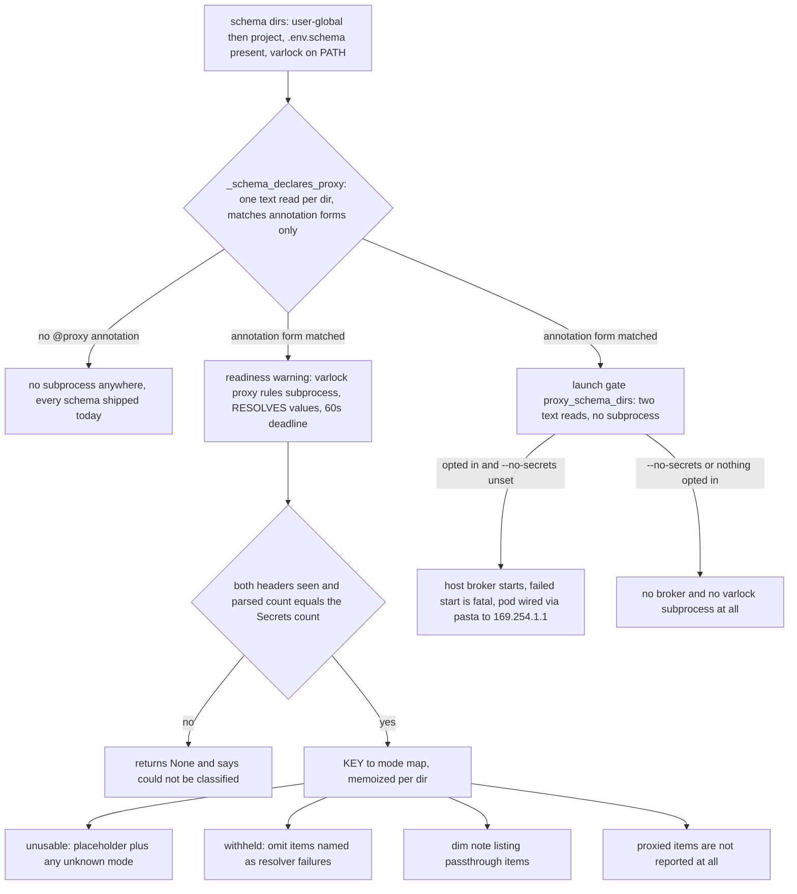

# The credential proxy model: four modes, the cheap annotation gate, and the readiness warning

harnessed is migrating toward **host-anchored runtime secrets over `varlock proxy`** — a container
resolving a secret without ever holding the backend credential (issue #388, on the roadmap as
"Secrets that never land in the stack"). That migration introduces a vocabulary — four per-item
classification *modes*, an opt-in *annotation* on the schema, and a launch-time *readiness warning* —
that appears in open work and has no other home in this wiki. This page is that home;
`src/harnessed/launchenv.py` is the source of record for the classification model. See also
[credentials](/openwiki/concepts/credentials.md) for the resolution machinery this sits on top of and
[precedence](/openwiki/concepts/precedence.md) for the env-file layering the warning rides on.

## Where the model stands now that the broker has landed

Epic #388 Phase 1 landed **Topology B**: a launch whose composed schema opts in now starts a real
host-side `varlock proxy` broker (`src/harnessed/broker.py`) — **fail-fatal** if it cannot start —
and wires the pod to it through pasta's `--map-host-loopback` at `169.254.1.1`. The broker's own
lifecycle (spawn, poll, record, stop, reconcile) belongs to
[the secrets broker page](/openwiki/architecture/secrets-broker.md); this page stays with the
classification model, the annotation gate both consumers share, and the warning.

Two facts keep the rest of this page true after that landing:

- The classification layer is still **advisory for env delivery**. `_varlock_resolve` still runs
  `varlock load`, which returns the real value for every item whatever its proxy mode, and the pod's
  env still arrives through the unchanged `--env-file` path — even on a launch that started a
  broker. The switch that makes an unrouted item actually break, the pod's env becoming
  placeholders only the broker can redeem, is **#439** and has not landed.
- The readiness warning therefore still **states both tenses** (below), and the shipped
  `.env.schema.example` still carries no `@proxy` annotation: a schema with no `@proxy` is every
  schema shipped today.

One version note, carried unnormalized because the two halves were measured against different
releases: launchenv.py's annotation shapes (`@proxy(domain=…)`, `@proxy=passthrough`,
`@proxyConfig={…}`) are measured against **varlock 1.17.0**; `broker.py`'s three lifecycle
measurements and the `mise.toml` pin cite **1.16.1**, the version verified against this tree.

## The four modes, and which of them are broken

`varlock proxy rules` reports a mode per schema item. `launchenv.py` records what each means for a
launch, verbatim:

| Mode | What the launch gets | Verdict |
| --- | --- | --- |
| `proxied` | the pod holds a placeholder, the real value is injected at the wire | the goal state |
| `passthrough` | the pod holds the **real** value; deliberate, via `@proxy=passthrough` | old exposure, fine |
| `placeholder` | sensitive but **no rule**: reaches neither the pod **nor** any upstream | **BROKEN** |
| `omit` | resolution failed, withheld from the child entirely | **BROKEN** |

The last two are why the warning exists. varlock treats every schema item as **sensitive by
default**, so an item nobody classified silently degrades to a useless placeholder: the agent gets a
real-looking value that no upstream will ever accept, and the failure surfaces far away as a
confusing 401. Naming those items at launch is the whole point (issue **#388, finding F1**).

Note the asymmetry a reader must not "fix": `passthrough` is *not* a defect. It is a declared
decision to keep the pre-proxy exposure on an item, and warning on it as though it were broken would
make the report unreadable for schemas that deliberately opt every item out.

*The shared annotation gate and its two consumers: the guarded `proxy rules` subprocess behind the
readiness warning, and the subprocess-free launch gate that now starts the broker.*

## The cheap annotation gate: one file read, and why the bare word does not open it

`_schema_declares_proxy(schema_dir)` is the opt-in gate on everything below it. It is a **text test,
not a parse**, and deliberately so: it costs exactly one file read of `.env.schema`, and a schema
with no `@proxy` anywhere is **every schema shipped today**. That keeps `varlock proxy rules` entirely
off the critical path until somebody opts into the proxy model.

It matches `_PROXY_ANNOTATION_RE` — `@proxy(?:Config)?\s*[(=]` — i.e. the **annotation forms**, and
not the bare word:

- `@proxy(domain="…")` — a routing rule (the item is proxied)
- `@proxy=passthrough` — an explicit opt-out (the item keeps its real value)
- `@proxyConfig={egress=…}` — schema-wide proxy policy
- bare `@proxy` — **an invalid schema**, excluded on purpose (below)

The reason for matching forms rather than the word is what sits on the other side of the gate: a
`varlock proxy rules` subprocess that **resolves values**, so it can sit on a 1Password unlock prompt
for up to `_VARLOCK_TIMEOUT` (**60 seconds**). A prose line like `# TODO: add @proxy after the
migration` used to pass this gate and buy that resolving subprocess for a schema that had opted into
nothing.

Bare `@proxy` is excluded because it is an *invalid* schema: `proxy rules` reports such an item as
`omit` (withheld entirely) and `varlock load` fails validation outright, so `_varlock_resolve`
already returns `None` and the launch reports it. Excluding it from this gate costs no warning that
is not already being made, more loudly, by the resolution path. These shapes are measured against
varlock 1.17.0.

**Two documented limits, both erring toward a missing warning rather than a false one:**

1. It reads the **entry schema only**, so a `@proxy` living exclusively in an imported fragment is
   missed. This must be revisited when recipe `env.schema` fragments land — issue **#388 Phase 1**.
2. Prose that happens to quote a full annotation (`use @proxy=passthrough for these`) still matches.
   Unavoidable without parsing, and the cost is **one spurious subprocess** rather than a wrong claim
   about anybody's secrets.

An unreadable or absent schema is simply `False` — silent, no subprocess.

## `_varlock_proxy_modes`: the only source of per-item mode, and its refusal to guess

`_varlock_proxy_modes(schema_dir)` returns `{KEY: mode}` from `varlock proxy rules`, or `None` when
the output cannot be trusted. It is the **only** source of per-item proxy mode — `varlock load
--format json-full` reports `isSensitive` and the schema-wide egress setting but nothing per item —
and `proxy rules` prints **for humans, with no `--format json`**. So this parses display text, which
will drift.

It therefore refuses to guess. The `Secrets (N)` header states its own count; if the number of lines
parsed does not match `N`, or **either header is missing**, it returns `None` and the caller says so
out loud. `rule_count` from `Rules (N)` is read purely as that structural check — one header alone
does not prove the shape. A guardrail that quietly stops guarding is the failure mode this project
already has one open bug for (**#429**, the egress firewall that reported success it did not
achieve) — not a pattern to repeat here.

The subprocess runs under the same 60-second `_VARLOCK_TIMEOUT` deadline as `varlock load`, because
it resolves values too. A timeout, an `OSError`, or a non-zero exit all degrade to `None` rather
than blocking the launch.

When it does return `None`, `_warn_unproxied_secrets` prints that the schema "declares @proxy, but
`varlock proxy rules` could not be classified" — telling the user to run the command by hand, and
that if its output looks fine the parser needs updating for their varlock version. That message is
the difference between a parser that ages into silence and one that asks to be fixed.

## `_warn_unproxied_secrets`: a readiness report, not a live fault

`_warn_unproxied_secrets(schema_dir)` names the secrets the credential proxy will **not** carry. It
is silent unless the schema opts in (`@proxy` present), and it reports **names and modes only** —
values are never read or printed. That value-blindness is what makes it safe to run on every launch.

Its central property is the tense it is written in. Today `_varlock_resolve` runs `varlock load`,
which returns the real value for every item whatever its proxy mode — so an unrouted item still
works, *including on a launch that started a broker*, because the pod's env still comes from the
`--env-file` path until **#439** flips it to the broker's placeholders. At that cutover the failure
becomes invisible: a real-looking placeholder no API accepts, surfacing far away as a 401. The
warning therefore **states both tenses** — "once harnessed brokers secrets (#388) each will reach
neither the agent nor any upstream… They still arrive as real values today" — and must not be
tightened to the present until the broker path is the one actually delivering these values. Saying
so while the schema is still being authored is the entire value; a warning that arrives only after
the cutover arrives too late to be cheap.

The report groups items by what actually goes wrong, because the fix differs:

- **`unusable`** — every mode that is neither in `_PROXY_MODES_OK` (`proxied`, `passthrough`) nor
  `omit`. This includes `placeholder` and, deliberately, **any mode this version of harnessed has
  never heard of**: a mode it does not recognize is not something to assume is safe. The fix named per item is
  `@proxy(domain=…)` **on the item** to route it (in the header it declares a policy rule and
  injects nothing), `@proxy=passthrough` to send the real value into the container, or
  `@sensitive=false` if it is not a secret.
- **`withheld`** — the `omit` items, reported separately as "could not be resolved at all": resolver
  failures, not routing mistakes; check the backing item exists and the secrets backend is reachable.
  Worth printing even though `_varlock_resolve` also fails on this schema, because its error names
  the *directory* while this names the *item* — the difference between "varlock broke" and "this one
  credential is gone". The item list also carries the tense forward: today an `omit` fails the whole
  schema's resolution; under the broker it would withhold just these items.
- **`passthrough`** — a dim note, not a warning. "Which real secrets are still in the container" is
  exactly the question the proxy exists to make answerable, and a passthrough item keeps the full
  pre-proxy exposure — so it is listed, not scolded.

`proxied` items are **not reported at all**: the whole point is that they work, and naming them would
train the reader to skip the block.

## The gate's second consumer: the broker launch gate

The same annotation gate now decides more than whether the warning runs. `proxy_schema_dirs(project_path)`
returns the schema dirs that opted into the proxy model, in `--env-file` order (user-global
`~/.config/harnessed` first, then the project), and is the gate on starting a secrets broker at all.
It reuses `_schema_declares_proxy` rather than inventing its own test, so it costs two file reads and
**no subprocess** — a launch that opted into nothing must not buy a `proxy rules` call that can sit
on a 1Password unlock prompt. It returns `[]` when `varlock` is not on `PATH`.

The mirroring is the point, not a convenience: `proxy_schema_dirs` deliberately repeats the dir
selection of `_resolve_launch_secrets` so the broker resolves the **same composed set** the
`--env-file` path resolves. A broker that loaded a subset would hand the pod placeholders (#439) for
items it never loaded — the mismatch #388 exists to make impossible.

On the container path, `launcher._broker_start_for` starts the broker **only** when the composed
schema carries a `@proxy` annotation and `--no-secrets` was not passed (the flag reaches the backend
as the `NO_SECRETS` environment variable, the same mechanism as `--no-firewall`). **A failed start is
fatal** (issue #437, SPEC decision 2): the alternative is a pod wired half-way to a proxy that is not
there, which gets worse at #439 when placeholders need the broker to redeem them. The failure message
is fixed and **value-free by construction** — it names the instance and the `--no-secrets` escape
hatch, never the exception, because echoing a raiser's message would make "no resolved value reaches
the user" a convention instead of a property of the code.

The pod's route to the broker is the address `paths.BROKER_HOST_DOOR = "169.254.1.1"`: the broker
binds the host's `127.0.0.1` only, the pod is created with pasta's `--map-host-loopback,169.254.1.1`
on `pod create`, and the egress firewall `require`s an ACCEPT for the same address. The broker starts
**before** `pod create` — the pod's network args depend on whether one exists — and the door never
appears without a broker. A runtime that does not use pods gets a *note* instead of a half-wired
broker: with no `pod create` there is no way to deliver `169.254.1.1` into the container, so secrets
resolve into the env as before. The broker is container-only **by nature** (the launch-parity ledger
records `_broker_start_for`, `proxy_schema_dirs` and `_broker_stop_for` in `CONTAINER_ONLY`): a
host-native launch runs the harness in the user's own session with their own credentials, and varlock
resolves natively there already.

Spawn/poll/record/stop/reconcile mechanics, the five-field state record, and the teardown ordering
are documented in [the secrets broker page](/openwiki/architecture/secrets-broker.md).

## Where it fires, and what is memoized

There are **four call sites** — the two launch paths (`_resolve_launch_secrets` for the container
backend's `--env-file` set, `_resolve_launch_env` for the host backend's in-process `os.environ` map)
each ask about the user-global dir and the project dir. The warn runs *ahead of* resolution, in the
same global → project layering, and only where a `.env.schema` is present and `varlock` is on PATH; a
schema always wins over a sibling plain `.env`, and the plain-`.env` branch never warns because there
is no proxy vocabulary in a dotenv. The global site is also the one `harnessed rescan` reuses
(`_resolve_launch_secrets(project_path=None)`), so a credentialed rescan sees the same report.

Two pieces of process state keep that cheap:

- `_PROXY_WARNED` — dirs already warned, so the four call sites print **once per schema dir per
  launch**. A CLI process is one launch; the first ask wins and the rest are no-ops.
- `_PROXY_MODES_CACHE` — the `{KEY: mode}` result, keyed on schema dir, for the same lifetime and
  the same rationale as `_VARLOCK_CACHE`: `proxy rules` is a subprocess, and both launch paths ask
  about the same dirs. One launch must see a *consistent* classification anyway — resolving the same
  dir twice and acting on different answers would be a bug, not a feature. The `None` result is
  cached too, so an unparseable output reports once per dir rather than once per caller.

Both are dropped by `_varlock_cache_clear()`, which is the reset point tests use.

## Related

- [The host secrets broker](/openwiki/architecture/secrets-broker.md) — the lifecycle behind the
  launch gate: spawn, poll, record, stop, reconcile, and the pod's door.
- [Credentials](/openwiki/concepts/credentials.md) — the resolution machinery (`varlock load`) that
  still delivers real values to the pod, and the 60-second unlock timeout.
- [Precedence](/openwiki/concepts/precedence.md) — the global-then-project `--env-file` layering the
  warn call sites and the broker's composed dir order ride on.
- [Container launch](/openwiki/workflows/container-run.md) — where `_broker_start_for` and the warn
  sit in the launch sequence.
- [Host launch](/openwiki/workflows/host-run.md) — the host path that shares the same warning and
  needs no broker.
