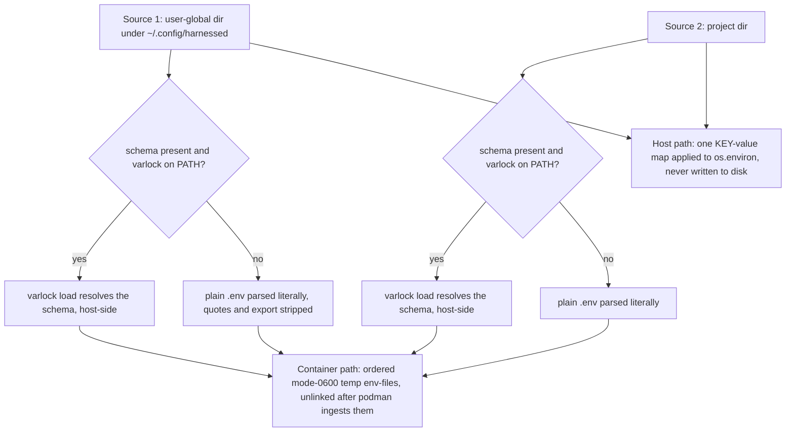
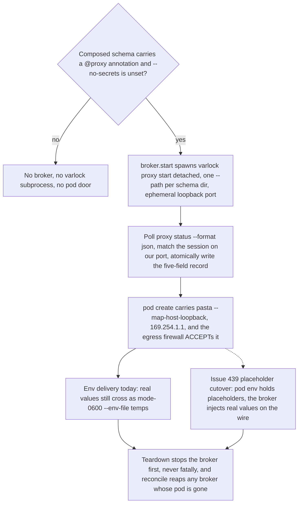
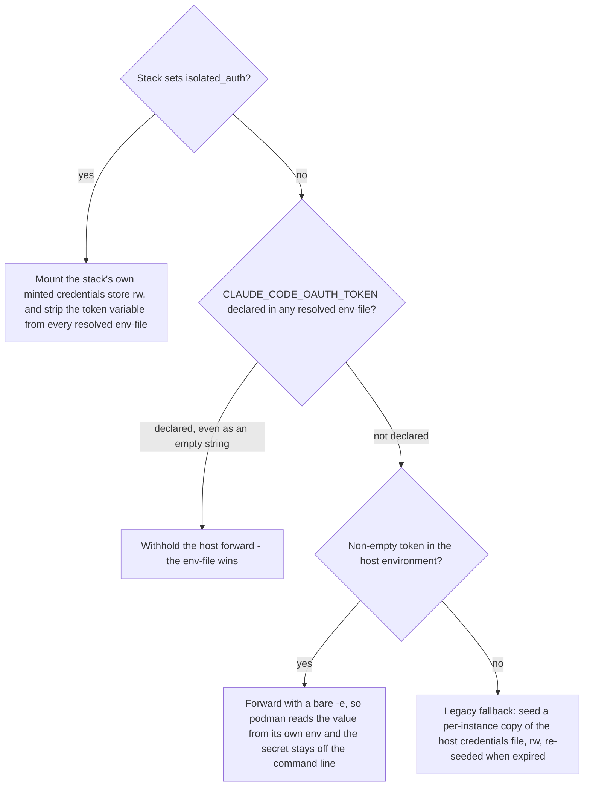
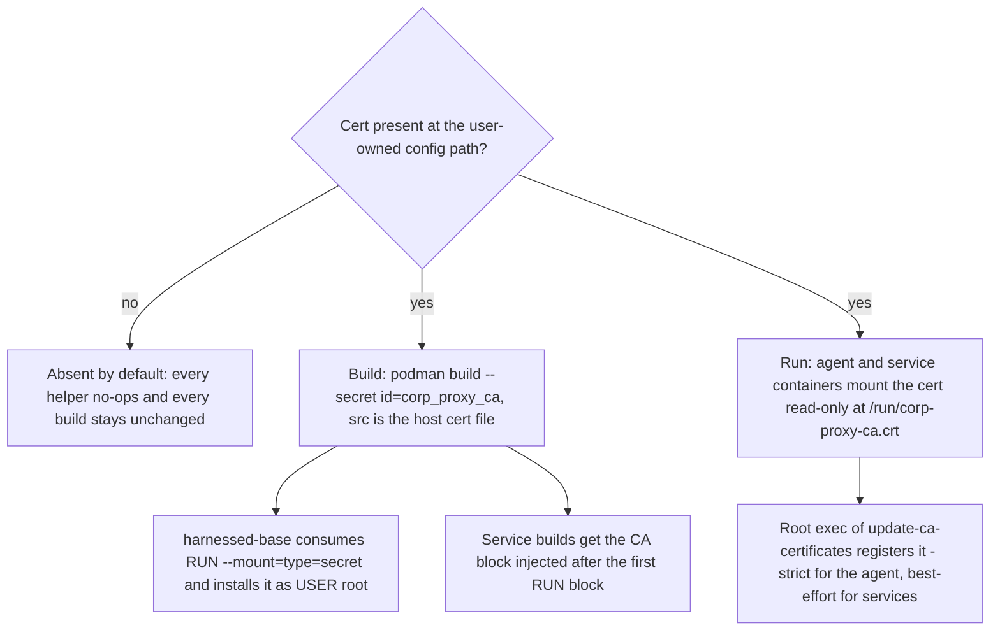

# Credential handling: where secrets enter, what resolves them, what never lands on disk

## The SOP, and why it is structural

harnessed's standard operating procedure is stated in `ARCHITECTURE.md` §Constraints: **credentials are referenced, never replicated**. A harness's login reaches an agent in exactly two sanctioned ways:

1. **Reference the live store** — a mount or a symlink at the real path (read-only where the harness only reads it, read-write where it owns the whole directory).
2. **Reference a token or broker URL** — an environment token, or a broker endpoint. No credential file is involved at all.

Everything else — copy, seed, snapshot, "copy back if newer" — is replication and out of bounds, however carefully guarded. The reason is structural, not stylistic: **a harness rewrites its own credential store on token refresh**. Any copy harnessed makes rots the moment either side refreshes, and the next launch restores the stale copy — which the user experiences as a silent logout that no amount of relaunching fixes. This happened for real (bd harnessed-8px.10): Claude Code's refresh *replaces* `.credentials.json` with a regular file, so a symlink becomes a stale snapshot and the shared copy never sees the refreshed token.

A load-bearing corollary governs mechanism 1's availability: **a symlink is a reference only while the harness writes in place.** SQLite resolves the symlink and creates `-wal`/`-shm` beside the target, so two links drive one database — that is why omp's `agent.db` can be shared by link. Claude Code replaces the file, so its link decays into a copy — which is why `.credentials.json` sharing needs a rescue mechanism (below) rather than trust. The SOP governs credentials only: symlinking *history, sessions, memory, and usage* state up to one shared location is deliberate design, not a violation.

## Where secrets enter, and how each launch resolves them

Secrets enter from three kinds of source, all host-side:

| Source | Location | Resolution |
| --- | --- | --- |
| varlock schema (1Password-backed) | `~/.config/harnessed/.env.schema` (global) or `<project>/.env.schema` | `varlock load` shells out to the secrets manager |
| plain dotenv | `~/.config/harnessed/.env` or `<project>/.env` | parsed literally, quotes/`export` stripped |
| the host environment | any exported variable, e.g. `CLAUDE_CODE_OAUTH_TOKEN` | forwarded or read directly |

`.env.schema.example` is the shipped template for exactly that: the scanner tokens (snyk, socket) it declares are optional, and when unset only the credential-free scanners run. Copy it to `~/.config/harnessed/.env.schema` and fill in 1Password item references; per-service schemas follow the same shape under `~/.config/<service>/.env.schema`. Values are **never** written to the repo, a profile, or an image layer. A bare `.env` is read literally — no varlock, no secret-manager resolution — and a schema wins over a sibling `.env` because varlock itself cascades the overlays.

### The two launch shapes

`launchenv.py` resolves the same sources into two shapes because the two backends consume environment differently:

- **Container path** — `_resolve_launch_secrets` returns an ordered list of `--env-file` paths, because podman needs a *file*. Every file it returns is a mode-0600 **temp file it generated**: the user's own `.env` is copied and normalized (quotes and `export` prefixes stripped — podman keeps them literal), never handed to podman directly. The caller unlinks the temps as soon as podman has ingested them, so resolved values do not linger on disk.
- **Host path** — `_resolve_launch_env` returns a `KEY -> value` map that `_launch_host` applies to `os.environ` *before* materializing anything. There is no box other than the process environment, so **nothing is written to disk at all** — strictly better than the temp-file dance, which exists only because podman needs a file.

Both functions read the same sources in the same **global → project** order (project values override global), and that shared precedence is the reason they live in one module: the two shapes must not drift. This layering is the subject of [precedence](/openwiki/concepts/precedence.md).



*Both launch shapes read the same sources in the same global-then-project order; only the delivery vehicle differs.*

### varlock mechanics (host-side only)

`_varlock_resolve` runs `varlock load --format json` in the schema dir. JSON (not varlock's env format) because the env format double-quotes every value and podman `--env-file` keeps quotes literal. It forwards `OP_SERVICE_ACCOUNT_TOKEN` from the host env when already set — the headless/CI path that authenticates without the desktop app. An `OP_SERVICE_ACCOUNT_TOKEN` set by the user is *passed through*, never extracted from a store by harnessed.

Three deliberate properties:

- **60-second timeout** (`_VARLOCK_TIMEOUT`): `varlock load` may sit waiting on a 1Password unlock approval. Unbounded, an unattended launch — CI, a cron-fired agent, a machine with the desktop app closed — hangs forever with no output. Timed out or failing, resolution degrades to "no secrets from this schema" and the launch proceeds; a launch must not hard-fail on secrets it may not need.
- **Memoized per schema dir** for the lifetime of one CLI process, which is exactly one launch. Several callers in one launch ask the same dirs the same question (`_varlock_resolve_env_file` builds the `--env-file` set, then `_claude_oauth_token_configured` asks the same dirs whether a token is present — and `_resolve_launch_env` does both on the host path), so uncached that is up to **four resolving subprocesses where two suffice**. Caching is safe precisely *because* the process is short-lived and **one launch must see a consistent secret set anyway**: resolving the same dir twice and acting on different answers would be a bug, not a feature. Tests that need fresh resolution monkeypatch `_varlock_resolve` wholesale or call `_varlock_cache_clear()`.
- **Multi-line values are skipped, not truncated** in the env-file writer: podman reads a value to end-of-line, so a PEM block would arrive cut at its first line and the remainder would be parsed as bogus `KEY=VALUE` pairs — truncated key material fails later, somewhere with no hint of the cause.

`_warn_unproxied_secrets` adds a readiness report for schemas that declare `@proxy` annotations. It is deliberately value-blind — it reports **names and modes only**, which is what makes it safe to run on every launch — and its cheap text gate matches annotation forms, not prose mentions, so a comment mentioning `@proxy` cannot buy a resolving subprocess that may prompt for an unlock. The proxy model itself — the four per-item modes, the annotation gate, and why `passthrough` is not a defect — is a migration in progress with its own vocabulary; see [credential proxy](/openwiki/concepts/credential-proxy.md).

## Topology B: the broker changes the end state

Everything above delivers *real values* to the agent; the only question was the vehicle. Topology B (Epic #388 Phase 1) adds a stage that can end that delivery entirely: a **host secrets broker** — one `varlock proxy` per instance, running on the host, where 1Password, the keychain, gpg-agent and a YubiKey can actually authenticate. It binds `127.0.0.1` only and injects real values into outbound requests **on the wire**. The sanctioned end state is a pod that holds **placeholders**, so real values never enter the container env at all. That env flip is issue #439 and has not landed: today even a brokered launch still delivers the pod's env as real values through the unchanged mode-0600 env-file temps above. What has landed is the data flow, which this page owns:

- **Gate.** `launcher._broker_start_for` starts a broker only when the composed schema opts in and `--no-secrets` was not passed. The opt-in test is `launchenv.proxy_schema_dirs(project_path)`: a **subprocess-free text test** over the *same* global → project dirs `_resolve_launch_secrets` resolves, so a launch that opted into nothing buys no varlock subprocess at all — and the broker that does start resolves the same composed set the env-file path resolves.
- **Record.** `broker.start` spawns `varlock proxy start` detached (it does not daemonize) on an ephemeral loopback port with one `--path` per schema dir, polls `proxy status --format json` for the session whose `HTTPS_PROXY` names the chosen port, and persists **exactly five fields** — instance, pod, session, port, cert dir. `proxy status` also returns an `endpointToken`, `placeholderOverrides`, and the resolved proxy env; none of the three is ever written, so "the state file leaks no secret" is true **by construction** rather than by redaction. A failed start is fatal, with a fixed value-free message naming the instance and `--no-secrets`.
- **Door.** The pod is created with pasta's `--map-host-loopback,169.254.1.1` — `paths.BROKER_HOST_DOOR`, which the egress firewall also ACCEPTs; three places must agree on the literal. It composes into the single `--network` value `pod create` accepts, alongside mcp-remote's `--host-lo-to-ns-lo`, and is emitted **only** when the launch actually got a broker — no stack is silently handed a route to the host's loopback when nothing is listening there.
- **Opt-out.** `--no-secrets` (`NO_SECRETS` env, truthy `1`/`true`/`yes`) skips the broker and the pod's proxy wiring; the launch keeps working, "with the pod holding real values as it does today". A runtime without pods gets a note and env resolution as before, rather than a half-wired broker.
- **Lifecycle.** The broker starts **before** `pod create` (the pod's network args depend on whether one exists) and is stopped if that create fails. `_pod_teardown` stops it **first** and never fatally — it is a host process holding live secrets that must not outlive the pod, and the pod is the containment boundary. `broker.reconcile`, run by `harnessed list` before reporting, reaps every recorded broker whose pod is gone: the backstop for every teardown path that never ran.



*The broker's data flow: gate, spawn, record, door, and the two delivery states — env-file values today, placeholders at the #439 cutover.*

The broker is **container-only by nature**: a host-native launch runs the harness in the user's own session with their own credentials, so there is no boundary for it to sit on and varlock resolves natively there already. This page owns the data flow only. The mode vocabulary the gate reads (`proxied` / `passthrough` / `placeholder` / `omit`) is [credential proxy](/openwiki/concepts/credential-proxy.md)'s; the spawn/poll/record/stop/reconcile lifecycle, port picking, and the state record's invariants are [the secrets broker page](/openwiki/architecture/secrets-broker.md)'s.

## Hardware and agent forwarding (`credmounts.py`)

`credmounts.py` answers one question: given what is present on this host, which podman `-v`/`-e`/`--device` arguments make that credential reachable inside the container *without copying the secret in*? It is pure derivation from host state — nothing here decides *whether* to forward (that gating lives in `launcher.py`), and nothing runs a container. The module's whole design rests on the SOP: **sockets and public/config files are forwarded; private key material is not.**

- **SSH agent (1Password primary, gpg-agent fallback).** The 1Password SSH agent socket is mounted when present and wired as `SSH_AUTH_SOCK`; `op-ssh-sign` signs commits and `git push` authenticates through it, with private keys never leaving 1Password. The gpg-agent SSH socket (the YubiKey path, located via `gpgconf --list-dirs agent-ssh-socket`) is mounted when present but claims `SSH_AUTH_SOCK` **only when 1Password's socket is absent** — a machine with both keeps 1Password as the active signer. Socket paths containing `:` are skipped defensively rather than reparsing the `-v src:dst` spec.
- **macOS caveat, explicitly unverified.** On macOS the container runtime is a Linux VM and a host unix socket does not traverse the host→VM file share. The module attempts a podman-machine reverse-forward (`ssh -R` into the VM, with `StreamLocalBindUnlink=yes` so a stale socket doesn't wedge a second launch and `ExitOnForwardFailure=yes` so a failed forward is never reported as a mountable path). This is **PENDING VERIFICATION** in source: it prints a note pointing at the tracking todo and falls back cleanly; it never blocks a launch.
- **YubiKey device passthrough.** `lsusb` is parsed for the Yubico vendor ID and matching `/dev/bus/usb` nodes are passed with `--device` — **Linux only**, because macOS's VM has no `/dev/bus/usb`; there the YubiKey reaches the container via the gpg-agent socket relay instead. Best-effort: absent key or failed `lsusb` is a clean no-op.
- **Git identity config, read-only.** `~/.config/git` (or legacy `~/.gitconfig`) mounted `:ro` — it carries `user.signingkey`, `gpg.format=ssh`, `gpg.ssh.program=op-ssh-sign`, `commit.gpgsign`: the settings that make signing actually work. It is a public-key reference, not a secret.
- **gh auth.** `~/.config/gh/hosts.yml` mounted `:ro` (plus `config.yml`), so `gh` authenticates as the host user with no token baked into env or image. If the file has real host entries but **no plaintext token**, the container is warned: modern `gh` stores the token in the OS keychain, which the container cannot reach — the remedy is re-authing with `--insecure-storage` on the host.
- **SSH directory, file-by-file.** Never blanket-mount `~/.ssh`. Always (when present, `:ro`): `config`, `known_hosts`, every `*.pub`. Private keys **only** when the stack's `ssh_keys:` field opts them in by basename — for hosts without an agent — schema-validated to a single path component so a stack cannot escape `~/.ssh`, with the resolved path re-checked as defense-in-depth. And `ssh_keys` is honored **only from the user's own overlay catalog**: mounting a private key is the key owner's decision, not a third-party stack author's; the same declaration in a shared repo catalog is dropped with a warning.
- **GPG, public surface only.** `pubring.kbx`, `trustdb.gpg`, the two config files, `sshcontrol` — never `private-keys-v1.d/`. The old bash launcher mounted all of `~/.gnupg`, dragging in software-key secret material; read-only does not help, because readable is exfiltratable by an autonomous agent. In-container *openpgp* signing is consequently not the supported path — SSH-format signing through the forwarded agents is.

### Default vs opt-in

The stack field `forward_git_credentials` (default **off**) gates the secret-bearing slice: the gh oauth token file and opt-in private SSH keys. But the **SSH agent socket + read-only git identity config are forwarded automatically whenever the agent socket is live on the host**, independent of that flag. The asymmetry is deliberate: an agent socket exposes no key material and gates every sign/auth behind a host-side 1Password approval or YubiKey touch, so "1Password available → wired up" is safe as a default — while anything secret-bearing requires the stack to ask. (`aws-sso` forwarding is opt-in for the same reason: STS creds pulled over the broker are *not* touch-gated.)

## Per-harness auth paths

### claude: the token ladder

The container-side claude auth ladder, in decision order:



*The container claude auth ladder: isolation first, then token, then the tolerated legacy seed.*

- **`CLAUDE_CODE_OAUTH_TOKEN` is primary** (mechanism 2): a long-lived subscription token from `claude setup-token`, roughly a one-year lifetime. It never expires mid-session, needs no in-container refresh, and therefore makes the whole copy-divergence problem unnecessary. When one is configured, **no credential file is mounted at all**. A token-free `~/.claude.json` onboarding stub is mounted separately in all cases so the agent skips first-run setup — the stub is written to a per-instance state dir and never carries the token.
- **The env-file beats the host export.** `podman run -e` beats `--env-file`, so forwarding the host value unconditionally let a stale shell export outrank every declared source — a per-project token for a *different account* (resolved from 1Password into the project schema) could then never take effect. The launcher therefore **withholds** the `-e` forward when any resolved env-file already declares the variable. The host backend already resolved this the other way (declared schema values overwrite an inherited shell value), and withholding the forward makes the two backends agree.
- **Empty string = declared OFF, not absence.** Precedence answers are computed as *last declaration wins* across global → project, matching how podman actually applies `--env-file`. A project-level `CLAUDE_CODE_OAUTH_TOKEN=` therefore genuinely disables a user-global token and correctly falls back to the credential file; answering from the *first* hit left the container with no token **and** no credentials — logged out with no recovery path from inside the pod (bd harnessed-7bk). The same "empty is OFF" semantics govern the host side (`export VAR=` is how a shell profile turns a token off; misreading it would retire a load-bearing credential file).
- **The legacy rw credential seed is acknowledged replication**, tolerated only so hosts that have not yet run `claude setup-token` keep working. It copies `~/.claude/.credentials.json` into a per-instance state file mounted **rw** (so the container can refresh it) and warns on every launch with the remedy. The current code **re-seeds when the copy has expired** (`_claude_creds_expired` reads only the expiry timestamp), fixing the original design's "permanently logged out" failure; the underlying refresh race remains, which is exactly why this path is a fallback and not a mechanism.
- **`isolated_auth: true` (stack) answers a different question** — not "how does the container get your login" but "how does this stack run as *someone else's*". The host token is withheld from *both* supply routes (the `-e` forward and the env-files: `_strip_var_from_env_files` deletes the variable from the generated temps in place, because `--env-file` is passed unconditionally and a user-global declaration would walk straight past the other suppressions), no host credential is seeded, and the stack gets a per-instance credentials file **minted in-container by its own `/login`**, seeded as `{}` so it starts logged out, persisted on the host across recreates and cleared by `--fresh`. This is **not a fourth SOP violation, because nothing is copied**: the store is the only copy of that credential in existence, so there is no second copy to diverge from and no refresh race. It lives **outside the `~/.claude` config volume** on purpose: `_ensure_config_volume` destroys that volume whenever the profile fingerprint changes, under an explicit "safe to destroy: credentials are bind-mounted over it and live on the host" invariant that this mount relies on — a login stored in the volume would be wiped by the next recipe edit. The flag is claude-only; applying it to a harness that keeps credentials elsewhere warns instead of stripping that harness's auth (omp reads the very `CLAUDE_CODE_OAUTH_TOKEN` this branch would strip, so suppressing it there would leave no auth at all). The field's own comment records the simpler alternative: a `CLAUDE_CODE_OAUTH_TOKEN` the client hands you outright in `<project>/.env.schema` needs no file, no expiry, and nothing to log into — `isolated_auth` is for the case where the client wants you to log in interactively as them. The same identity split propagates to the mcp-remote OAuth token store (`~/.mcp-auth` for host-identity stacks, a per-instance dir for isolated ones), mounted rw so a consent outlives the pod.

The host backend applies the same ladder (`ARCHITECTURE.md`: "host-run applies the same order"). With no token, the per-stack `.credentials.json` is **symlinked** at the host `CLAUDE_CONFIG_DIR`'s copy, so a refresh propagates and one login serves everywhere — mechanism 1, subject to the replace-on-refresh hazard. Because Claude Code's refresh *replaces* the link with a regular file (the refreshed token lands in the stack dir and the shared copy never sees it), `_rescue_host_credentials` runs **before** every materialize wipe: it scans every host home for the newest *usable* credentials file and copies it back to the shared `~/.claude` copy if the shared copy is not already at least as fresh. `_launch_host` ends in `os.execvpe` and never regains control, so there is no exit hook — the rescue must be anticipatory. With a token configured, neither link nor rescue happens, and a per-stack copy left behind by an earlier token-free launch is removed so the stale file cannot outlive the switch; the shared `~/.claude` copy itself is never deleted, because it is the user's own login outside any stack.

Two refinements keep the rescue honest. `_credentials_are_usable` rejects **gutted** credentials — envelope intact but empty access/refresh tokens and a zeroed expiry — because freshness alone let one emptied file overwrite a working shared token and log out every stack sourcing from it (the poisoning observed 2026-07-21). An expired *access* token is deliberately still "usable": that is the healthy state a refresh token exists to serve. And when a per-stack home is deleted outright, `_scrub_host_home` overwrites `.credentials.json` with null bytes and fsyncs before the unlink — including the legacy per-project dirs from the pre-keying layout, which a bare `rmtree` would leave recoverable on disk.

### omp: the live store, whole

omp keeps auth, usage, and sessions together in `~/.omp/agent` (credentials in the `agent.db` SQLite database) with no separately-mountable credential file, so the two backends reference the store at different granularities:

- **Container backend: rw-bind-mount the live `~/.omp/agent` and run plain `omp`.** Never `--profile`: that points omp at an isolated *empty* store, so a credential-less launch lands on the login screen. This is mechanism 1 at directory granularity — shared host state, deliberately not isolated. **Do not "fix" it back to isolation by snapshotting the dir**: a snapshot fragments auth, usage, and sessions across every stack, resets usage on recreate, and still has to copy most of the directory to work — all cost, no isolation anyone wanted. Per-instance mounts shadow only *files inside* the shared dir (a regenerated `mcp.json` pointing at the in-container hatago hub, mounted ro over the dir mount; a compat `config.yml` only when the host file names the retired local bridge path), never the store itself. The attach command likewise runs plain `omp` — `--profile` there would ignore the bind-mounted store — with only the per-folder session key pinned to the host's.
- **Host backend: `PI_CODING_AGENT_DIR` with `agent.db` symlinked.** The env var gives the stack its own agent dir (an absolute path; `PI_CONFIG_DIR` is a *name* under `$HOME` and cannot address one, and `--profile` is mutually exclusive with the env var *and wins* — both dead ends). The per-stack dir then shares the real store by symlink: `agent.db`, `history.db`, `sessions/`, `blobs/`, `memories/`. This is sound because **SQLite writes in place**, so links hold: `-wal`/`-shm` land beside the link target, one logical database with one WAL and same-kernel locking, and the replace-on-refresh hazard that dogs claude structurally cannot occur. Everything else (`config.yml`, identity files, `mcp.json`, skills) stays per-stack, with `config.yml` propagated from the host on every launch — preferences, not credentials, since auth lives in the shared `agent.db`. With no host `agent.db` yet, the link is skipped with a note and omp prompts a per-stack login: a first run, not an error.

An inherited `PI_CODING_AGENT_DIR` (launching a stack from inside another stack's host session) is *ignored* by the share-back target when it points inside harnessed's own homes tree — that is another stack's store, not the user's — and the installs layer pins both `PI_CODING_AGENT_DIR` and `CLAUDE_CONFIG_DIR` per stack so catalog-authored scripts cannot write into a parent stack's home.

## Host-only boundaries: what never touches disk or an image layer

Several steps run on the host **because the alternative would put a secret where it must not go**:

- **varlock resolution and the 1Password timeout are host-side by construction.** 1Password desktop-app auth binds the grant to the calling host application and cannot work from inside a container. The base image even ships a `setsid` shim in front of the `op` CLI so a recipe that shells out to it inside the pod gets a clean "no accounts" exit instead of stealing the agent's TTY with an interactive setup prompt it can never satisfy. Scanner and launch secrets are always resolved *before* anything enters a container — and Topology B extends the same principle to the proxy: `varlock proxy` runs on the host for exactly this reason, with the pod reaching it over the loopback door described above.
- **Scanner tokens reach only the credentialed re-scan.** `_build_derived_image` never touches secrets or varlock — building must always succeed without credentials, so recipe verification never depends on a secret resolving. snyk and socket therefore sit out the image build itself and run on exactly one code path: `_scan_image_in_container`, reached from `harnessed rescan` (also the nightly systemd timer, and re-invoked by `harnessed build` after the derived image is built, unless `--no-security-scans`). Tokens are resolved on the **host** via `_resolve_launch_secrets(None)` — global schema only, project env deliberately not layered in, since a rescan is about the image, not the cwd — handed to podman as a mode-0600 temp `--env-file`, and unlinked in a `finally`. The token names live in the user's scanner schema (see `.env.schema.example`).
- **aws-sso forwarding is a broker URL, not a copy.** For `forward_aws_sso: true` stacks the launcher injects only `AWS_CONTAINER_CREDENTIALS_FULL_URI` (the host's aws-sso ECS server via `host.containers.internal`) and its bearer token read from the user-owned token file `harnessed aws-sso serve` writes. The in-container AWS SDK pulls short-lived STS credentials over HTTP; no aws-sso binary, store, or SSO token ever enters the container, and the bearer arrives as a per-launch `-e`, never an image layer.
- **Credential directories are unmountable by declaration.** Recipe `persist: global` entries are default-deny with hard-deny roots — `~/.ssh`, `~/.aws`, `~/.gnupg`, harnessed's own config dir, and bare `$HOME` itself — that no allowlist entry can override. The persist system, which *does* copy host dirs into per-stack mount trees by design, is fenced off from every directory the credential machinery treats as a live store.
- **The corporate proxy CA is the one credential handled as a build secret instead** — a trust anchor that must be trusted before a container's first HTTPS call, not a launch-time value. It never appears in this list's launch-time mechanics at all; the next section owns its full build/run path.

Two other pieces complete the picture: `--fresh` performs explicit wipes of the persisted in-container auth stores (antigravity's keyring, and an isolated-auth stack's own login) because both deliberately survive ordinary recreates; and `seed_auth` on the container backend runs **last** among the mounts, and only after the aborting checks, so that an early exit can never strand resolved secrets in temp files on disk — the temps are unlinked in a `finally` around the podman run either way.

## The corporate proxy CA: the one credential handled as a build secret

Every mechanism above delivers a credential *at launch*. The corporate proxy CA is different in kind — it is a **trust anchor**, not a value the agent reads, and it must be trusted *before the first HTTPS call a build or a container makes*. It is therefore the one credential-shaped artifact that travels as a **podman build secret** at build time, with a second, deliberate delivery into running containers at run time.



*The corporate proxy CA's two deliveries: a build secret into image trust stores, and a read-only runtime mount into container trust stores. Nothing ever stages the cert into a build context or bakes it into an image layer.*

- **Where it lives.** `paths.corp_proxy_ca_path()` pins the cert to `$XDG_CONFIG_HOME/harnessed/corp-proxy-ca.crt` — user-owned config dir, never the repo, the same rationale as `extra-tools.txt` and the aws-sso token: a fresh clone or worktree must build without carrying a host-local trust anchor, and an internal CA must never surface as a repo diff.
- **Absent by default, no-op everywhere.** Every helper checks the file before doing anything: `_corp_proxy_ca_secret_args` and `_corp_proxy_ca_mount_args` return empty lists, `_install_corp_proxy_ca_in_container` returns without exec'ing, and `_service_dockerfile_with_ca` returns `None`. On a machine without the cert, builds, launches and service containers are exactly what they would be on a machine that has never heard of the feature — there is no "empty CA" state to get wrong.
- **Build time: a `--secret`, never a layer and never a context file.** `_corp_proxy_ca_secret_args` appends `--secret id=corp_proxy_ca,src=<cert>` to the shared-image builds (`_build_images_cmd`, `_build_base_image`) and to service image builds. `Dockerfile.harnessed-base` is the Dockerfile that consumes it, under `USER root`:

```dockerfile
RUN --mount=type=secret,id=corp_proxy_ca,dst=/tmp/corp-proxy-ca.crt,required=false \
    if [ -s /tmp/corp-proxy-ca.crt ]; then \
        cp /tmp/corp-proxy-ca.crt /usr/local/share/ca-certificates/corp-proxy-ca.crt && \
        chmod 0644 /usr/local/share/ca-certificates/corp-proxy-ca.crt && \
        update-ca-certificates; \
    fi
```

  Podman streams the file from the host path for the duration of that one `RUN`: it is never staged into the build context and never lands in image history — the same "never in a layer" bar every launch-time credential on this page answers to, applied at build time. `required=false` is what makes absence a clean no-op at the Dockerfile layer too.
- **Service images: injection, not catalog edits.** Service Dockerfiles are catalog content, so nothing edits them on disk: `_service_dockerfile_with_ca` writes a **temp copy** with `_CORP_CA_DOCKERFILE_BLOCK` injected **after the first complete RUN block** — typically the `apt-get install` step that puts `ca-certificates` on PATH — so every subsequent `curl`/`pip`/`pnpm` download in the build trusts the SSL-inspecting proxy. A Dockerfile with no `RUN` falls back to injecting after the first `FROM`; one that already mentions `corp_proxy_ca` is left alone (no double injection), and the caller unlinks the temp either way.
- **Run time: ro mount, then a root exec.** Agent containers get `-v <cert>:/run/corp-proxy-ca.crt:ro` in the launch mount block, and service containers get the same mount composed into `_svc_run_cmd` — which is hashed, so provisioning or removing the cert is a config change that recreates the sidecar. After start, `_install_corp_proxy_ca_in_container` execs **as root** (the trust store is root-owned) to copy the mounted file into `/usr/local/share/ca-certificates/` and run `update-ca-certificates`. Severity differs by caller: the agent container's install **raises** on failure, while service containers use `best_effort=True` — a bounded, swallowed exec — because a service's base image may not ship the `ca-certificates` package at all, and a sidecar must not fail a launch over trust-store cosmetics; even the best-effort path keeps its deadline (pinned by test). On the agent path the install runs right after the pod is up and **before the egress firewall** closes: the exec is local-only and needs no network, but ordering it first keeps every post-start container mutation on the unconfined side of the boundary.
- **Provisioning is one flag.** `harnessed build --corp-proxy-ca-crt <file>` copies the bundle to the config path once and says so; every later build — base, agent-derived, or service — picks the persisted file up automatically.
- **Why every host-side step stays host-side.** The launch-parity ledger records both helpers as container-only capabilities: "*mounts the CA; the host trusts its own store*", "*installs the CA inside a container*". Nothing on the host needs help trusting the corporate proxy — varlock resolution, the secrets broker, and the `podman build` process itself already run inside the user's own session, behind the host's installed trust — so harnessed never installs the CA anywhere on the host. The CA is the mirror image of the 1Password constraint elsewhere on this page: 1Password resolution must stay on the host because it *cannot* work in a container; the proxy's CA must be *installed into* containers because they do not inherit the host trust store.

## Invariants an editor must not "clean up"

- A copy that is "newer, so copy it back" is still replication — it moves the race rather than removing it. The rescue exists only because claude's replace-on-refresh behavior breaks mechanism 1's symlink; do not generalize it to harnesses that write in place (omp needs no rescue, and adding one would be pure downside).
- `--profile` must never be added to any omp invocation against a stack store: it is mutually exclusive with `PI_CODING_AGENT_DIR`, wins when both are present, and points at an empty store.
- The 60s varlock timeout, the env-file-beats-export withholding, the empty-string-means-OFF semantics, and last-declaration-wins precedence are each the fix for a named production failure; changing one reopens its bug.
- The isolated-auth store must stay outside the config volume, and `_ensure_config_volume`'s "safe to destroy" invariant depends on credentials never living inside it.
- The broker's persistence surface is the five-field record; adding a field means re-proving "the state file leaks no secret by construction", and its failure message must stay value-free (never interpolate the exception). The pod door must never be emitted without a live broker.
- The corporate proxy CA must reach builds only as `--secret` and containers only as the ro `/run/corp-proxy-ca.crt` mount plus the root exec. A `COPY` of the cert into any Dockerfile, or staging it into a build context, would bake a corporate trust anchor into image history — the one thing its helpers exist to prevent.

## Related pages

- [Secrets broker](/openwiki/architecture/secrets-broker.md) — the broker's runtime: lifecycle, ports, teardown ordering, and the state record.
- [Invariants](/openwiki/concepts/invariants.md) — the constraint list this SOP belongs to.
- [Precedence rules](/openwiki/concepts/precedence.md) — the global → project and recipe-vs-harnessed ordering in full.
- [Env contract](/openwiki/concepts/env-contract.md) — the folder-env contract the resolved secret values join in the container.
- [Credential proxy](/openwiki/concepts/credential-proxy.md) — the varlock `@proxy` model this resolution machinery is migrating toward: the four per-item modes, the annotation gate, and the readiness warning.
- [Build pipeline](/openwiki/workflows/build.md) — where `--corp-proxy-ca-crt`, the base-image build, and the credential-free derived build sit.
- [Container run](/openwiki/workflows/container-run.md) — where mounts and `seed_auth` sit in the launch sequence, and where the CA install runs among the post-start steps.
- [Host run](/openwiki/workflows/host-run.md) — the host backend's materialize/share/exec order.
