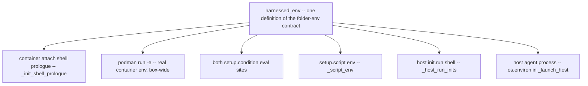
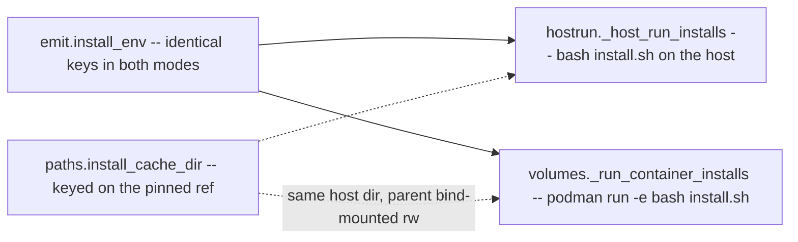

# The env contracts: launch env, folder env, and install env across both modes

harnessed runs catalog-authored content — recipe Dockerfiles, `install.sh`, `setup.sh`, `init.run`,
`setup.condition` — on two surfaces: containerized and host-native. A recipe author must be able to
write one script and have the same names mean the same things in both. That guarantee is delivered
by **two** harnessed-owned contracts, each with exactly one definition and one delivery mechanism
**per mode**, layered on top of a **user-owned launch env** that harnessed resolves in both modes
before anything catalog-authored runs:

| Contract | One definition | Where it exists | Defined by |
| --- | --- | --- | --- |
| **folder-env** | `setupenv.harnessed_env` | every phase that has a project: the container runtime and host launches alike | the project path, the harness, the mode |
| **install-env** | `emit.install_env` | the `install:` phase only — the fingerprint-gated container install into the per-stack volumes, and the per-launch host install | the recipe, the harness, the mode |

The install-env is a **deliberate subset** of the folder-env, not a rival: it carries no project
variables because its phase has no project mounted. Everything else a script may see falls outside
both contracts and is off-limits to catalog authors — notably the host-only package-manager
redirects, which scripts must never read by name.

Related: [services](/openwiki/architecture/services.md) (where the socket and `client_env` values
come from), [container launch](/openwiki/workflows/container-run.md) and
[host launch](/openwiki/workflows/host-run.md) (the two sequencers that inject the contract),
[precedence](/openwiki/concepts/precedence.md) (the full conflict table this page's ordering facts
come from), [credentials](/openwiki/concepts/credentials.md).

---

## The launch env: user-owned variables, resolved per mode

`src/harnessed/launchenv.py` owns the first layer: the environment the **user** brings — API keys,
tokens, gateway URLs — read from varlock schemas and plain `.env` files. It is not catalog-authored
and not a contract recipes may rely on by name; it is what the contracts layer *on top of*. The
module's one rule is the same as the rest of this page: the two launch modes read the same sources
in the same order, so the same winner holds in both.

### Sources and precedence

Two scopes, layered **global → project** (project wins):

1. **User-global `~/.config/harnessed/`** — `.env.schema` resolved via varlock (opt-in: the schema
   must exist and `varlock` must be on PATH), else a bare `.env` read literally. This is also the
   sole source of scanner tokens for `harnessed rescan`.
2. **The project dir** — `<project>/.env.schema` → `varlock load` there (varlock itself cascades
   `.env` / `.env.local` overlays on top of the schema); else `<project>/.env` normalized into a
   temp env-file. A schema always beats a sibling bare `.env` in the same dir.

### One answer, two shapes

`launchenv` returns the same resolution in the shape each mode can consume —
`_resolve_launch_secrets` (a list of `--env-file` paths, because podman needs a file) and
`_resolve_launch_env` (a `KEY -> value` map, because on the host `os.environ` **is** the box and
nothing is written to disk). Both are imported by `launcher.py`; the launch-parity test maps the
pair explicitly so the two halves cannot drift.

- **Container path.** Every env-file handed to `--env-file` is a mode-0600 **temp** file harnessed
  generated; the user's own `.env` is copied, never handed to podman directly. The caller MUST
  unlink the temps after launch — resolved secrets must not linger on disk. Podman `--env-file` is
  last-wins, so the global → project ordering is the precedence mechanism.
- **Host path.** The map is applied in-process to `os.environ` by the caller; values never touch
  disk, which is strictly better than the container's temp file (which exists only because podman
  needs a file).

### varlock resolution and its failure semantics

`_varlock_resolve` runs `varlock load --format json` (JSON, not the `env` format, because that
format double-quotes every value and podman `--env-file` keeps quotes literal) with a 60-second
timeout: varlock authenticates against a secrets manager (1Password), so an unattended launch must
fail with a message instead of hanging on an unlock nobody will approve. **Every failure mode —
timeout, non-zero exit, invalid JSON — degrades gracefully**: the function returns `None` and the
launch proceeds without those secrets rather than hard-failing on ones it may not need. An
`OP_SERVICE_ACCOUNT_TOKEN` already in the host env is passed through (headless / CI bearer auth).

Values are memoized per schema dir for the lifetime of the CLI process: one launch must see a
**consistent** secret set, and `varlock load` subprocesses (up to four per launch uncached) are not
free. The None failure result is cached too.

### The env-file format's hard limits

- A **multiline value** (PEM block, SSH key) is **skipped with a warning**, never written: podman
  reads a value to end-of-line, so writing it would truncate it at the first line and parse every
  following line as its own `KEY=VALUE` — corrupted key material failing far away. A host-native
  launch has no such limit.
- A **plain `.env` is normalized** before podman sees it: one pair of surrounding quotes and any
  `export ` prefix are stripped (`KEY="v"` → `KEY=v`), because podman keeps quotes literal.
  Comment/blank lines pass through.

### Proxy readiness warnings (names, never values)

When a schema opts into the credential-proxy model — detected by a **text test** for a `@proxy`
annotation shape (`@proxy(…)`, `@proxy=…`, `@proxyConfig={…}`), not the bare word, so a prose
mention buys no resolving subprocess — `_warn_unproxied_secrets` runs `varlock proxy rules` and
names, once per schema dir: secrets with no route (which will reach neither agent nor upstream once
the broker cutover lands — a placeholder no API accepts, surfacing as an unexplained 401), secrets
that failed to resolve outright, and passthrough items (a declared decision, reported as a note).
It prints **names and modes only, never values**, which is what makes it safe on every launch. The
`proxy rules` output is human-formatted and will drift; if the parsed line count disagrees with the
declared `Secrets (N)` count the parser refuses to guess and says so. `proxy_schema_dirs` returns
the same composed, opted-in dir set (two file reads, no subprocess) and is the gate on starting a
secrets broker at all — the broker must resolve the same set the `--env-file` path resolves.

### Consumers

- `_strip_var_from_env_files` deletes a variable (e.g. `CLAUDE_CODE_OAUTH_TOKEN`) from the resolved
  temp env-files for `isolated_auth` stacks: suppressing the `-e` forward alone is not enough
  because `--env-file` is handed to podman unconditionally, and a user-global token would reach a
  stack whose purpose is to run as somebody else. Rewriting in place is safe *only* because every
  path is a harnessed-generated temp.
- `api_endpoint_egress_hosts` extracts the hostnames of `ANTHROPIC_BASE_URL` /
  `ANTHROPIC_BEDROCK_BASE_URL` / `ANTHROPIC_VERTEX_BASE_URL` from the resolved env and feeds them
  to the egress firewall: those URLs come from the user's schema, not from any recipe's `egress:`,
  so without this a gateway-repointed agent has every request DROPped at the firewall and reports
  it as an auth failure. It takes the already-resolved mapping rather than re-reading sources — a
  third reader would be a third place for the precedence to drift.

---

## The folder-env contract

One set of variables, same names and same meanings on every surface. `setupenv.harnessed_env` is the
single definition; a recipe author writes `${MAIN_REPO_DIR}` once and it resolves identically in the
container attach shell, a hook, a `podman exec`, a setup script, and the host agent process.

| Variable | Value |
| --- | --- |
| `HARNESS` | The harness being launched (`claude`, `omp`, …). Unprefixed on purpose — see [naming traps](#two-naming-traps-invariants). |
| `PROJECT_DIR` | The project directory the agent starts in. |
| `MAIN_REPO_DIR` | The git **common dir** — in a bare + linked-worktree layout that is the bare repo dir, not the default-branch work tree. Falls back to `PROJECT_DIR` outside a repo. |
| `HARNESSED_GIT_COMMON_DIR` | Same value as `MAIN_REPO_DIR`, under an explicit name. See [naming traps](#two-naming-traps-invariants). |
| `HOST_WORKSPACE_DIR` / `CONTAINER_WORKSPACE_DIR` | The mounted workspace root — **identical strings**, because the project is bind-mounted at its own host path. Auto-widened to the bare-repo container so sibling worktrees are visible. |
| `HOST_HOME` | The **host** `$HOME`, which is not the container's (`/home/harnessed`). A path-preserving persist mount means a recipe pointing a tool at e.g. `~/.pulumi` must write `$HOST_HOME/.pulumi`. |
| `HARNESSED_BIN_DIR` | The dir an `install.script` lands executables in — the **same value the install contract hands that script**, so a wrapper installed at build time can go on `PATH` at attach time (`init: run: export PATH="${HARNESSED_BIN_DIR:?}/…:$PATH"`). Container: `/home/harnessed/.local/bin`. Host: the stack's own `tools/<stack>/bin`. |
| `HARNESSED_RECIPE_DIR` | *(recipe-scoped surfaces only)* The recipe's own source dir — a setup script does `cp` where a Dockerfile did `COPY`. Host: the catalog dir. Container: `/opt/harnessed/recipes/<recipe>` (bind-mounted `:ro`). |
| `HARNESSED_<SERVICE>_SOCKET` | Agent-side socket path for each socket-backed project-scoped service. Resolved **per mode**, so a host launch gets the host path, not the container's. |
| *(a service's own `client_env`)* | Whatever a project-scoped service declares its clients need, injected under the service's chosen names (not a `HARNESSED_*` name). `{host}` resolves to `127.0.0.1` on the host and `host.containers.internal` in a container — this is how a `publish: ephemeral` service hands over a host/port that does not exist until the container is running. |

### Two naming traps (invariants)

Two entries of the contract are named the way they are for reasons a refactor must not "fix":

1. **A bare `GIT_COMMON_DIR` is never exported.** git itself consumes that variable, so exporting it
   would hijack common-dir resolution the moment the agent `cd`s into another repository. The
   contract therefore exports the same value under the explicit name `HARNESSED_GIT_COMMON_DIR`.
2. **`HARNESS` is unprefixed on purpose.** It is already the token a recipe Dockerfile branches on
   via `ARG HARNESS`, so `$HARNESS` in a setup script means exactly the same thing as `${HARNESS}`
   in a Dockerfile — no second spelling of the same decision.

### How each mode delivers the contract

`harnessed_env` is injected at every place catalog-authored content runs. The sites, and the
mechanism each mode uses to reach them:

*One definition, many surfaces. The attach-shell export is redundant by design — the container
already has the contract box-wide from `podman run -e`.*

- **Container attach shell prologue** (`_init_shell_prologue`) — exports the contract (shlex-quoted)
  before the harness starts, so `init.run` snippets and the agent process see it.
- **The container itself** — `podman run -e`, one `-e VAR=…` pair per variable. This is what makes
  the whole box agree: a hook or a later `podman exec` never sees the attach shell, and `bd`
  silently accepts an empty `--server-socket` rather than failing, so a socket var that existed only
  on one exec was a silent fallback to a wrong config.
- **Both `setup.condition` eval sites** — `_collect_setup_notices` (the user-facing notice gate) and
  `_confirm_setup` (the confirm gate, reached from both modes' setup paths). Conditions run
  host-side in the project dir with the contract in env, which is why a condition may be written
  against a real path — `[ ! -f "${MAIN_REPO_DIR}/.sometool/metadata.json" ]`. Under an env-less
  eval that expanded to the empty string and the test passed falsely.
- **`setup.script` env** (`_script_env`) — the contract plus the setup-only keys (below).
- **The host `init.run` shell** (`_host_run_inits`) — the init subprocess gets
  `{**os.environ, **harnessed_env(...)}`; what it exports is then propagated to the agent.
- **The host agent process** — `os.environ` in `_launch_host`. On the host there is no container to
  set env on, so `os.environ` *is* the box; the export is set before setups run so they see it too.

The two columns of that list are the point. The container has a box (the pod) and the mechanism is
`podman run -e`; the host has no box, and `os.environ` of the launching process is made to play that
role, so the exec'd agent inherits everything. **A delivery mechanism wired into one mode only makes
the host and container winners drift** — the declaration then works on one surface and is a silent
no-op on the other. That is the recurring defect shape of this whole area: `init:` was once wired
only into the container attach shell (a silent no-op under `host-run`), the socket vars were once
container-only (so a host launch's `:?` guard always aborted), `_service_data_dir` once returned a
container path in host mode, and the `-e` ordering was once inverted on one side — caught merging
harnessed-0tk.7 and harnessed-8px.2, each self-consistent alone.

### Mode-resolved entries

Several entries resolve differently per mode, which is the entire reason the contract is a function
rather than a constant:

- `HARNESSED_BIN_DIR` — the image's `~/.local/bin` in container mode; the stack's own bin dir
  (`$XDG_DATA_HOME/harnessed/tools/<stack>/bin`) on a host launch.
- `HARNESSED_RECIPE_DIR` — container-side it is the read-only mount at `/opt/harnessed/recipes/<recipe>`;
  host-side it is the recipe's catalog dir. The container path constant (`emit.CTR_RECIPE_DIR`) is
  single-sourced so the install executor's bind-mount and the setup-script mount agree —
  `$HARNESSED_RECIPE_DIR` names one path no matter which phase reads it.
- `HARNESSED_<SVC>_SOCKET` and `client_env` — resolved per launch via `svcstate.svc_socket_env` /
  `svc_client_env`. `_service_data_dir` returns the agent-visible path per mode: returning the
  container path unconditionally handed host-mode consumers `/home/harnessed/<name>`, a path that
  does not exist on the machine it would be used on. The socket and client vars are added **last**,
  so a service declaring both a socket handle and explicit client vars resolves them from the same
  launch.

`HOST_WORKSPACE_DIR` and `CONTAINER_WORKSPACE_DIR` are deliberately *not* mode-resolved: they are
the same string because `_build_mount_args` binds the project at its own host path
(`-v {mount_path}:{mount_path}`). `HARNESSED_PROJECT_DIR` in the setup-script env is mode-invariant
for free for the same reason.

### `setup.script` env: the contract plus setup-only keys

`_script_env` spreads `harnessed_env` (with `recipe=` set, `sockets=False`) and adds keys whose key
**set is identical in both modes** — env, not templating, is what makes one script file runnable on
every backend:

- `HARNESSED_MODE` (`host` | `container`), `HARNESSED_STACK`, `HARNESSED_PROJECT_DIR`,
  `HARNESSED_HOST_HOME`;
- `HARNESSED_CFG_<KEY>` for each resolved `setup.config` value (derive/prompt templates);
- `HARNESSED_<PRIMITIVE>` for the repo-identity values (`repo`, `gcd_db`, `gcd_hash`,
  `project_hash`) — computed **host-side and injected**, because the git common dir (`.bare/`) is
  outside the container mount and not recomputable there;
- when a `bin_dir` is supplied (the host path supplies one), `HARNESSED_BIN_DIR` is overridden to it
  and leads `PATH`, so a script can install a tool and immediately configure it in one file.

`sockets=False` here is deliberate: `_script_env` must produce the same key set in both modes, and
the container already has the socket vars box-wide from `podman run -e`. Container-side the whole
setup env is resolved **host-side** (a `setup.config` item may prompt, which must happen before the
container starts) and set as real container env — not `podman exec -e` — so hooks and later execs
see what the setup script saw; the exec itself passes no env, and it runs before the egress firewall
closes since a first-run setup is exactly the step that downloads.

---

## The install-env contract: a deliberate subset

`emit.install_env` is the contract a recipe's `install.script` may rely on — identical **keys** in
host and container mode. It is deliberately a **subset** of the folder-env, not a superset:
`PROJECT_DIR`, `MAIN_REPO_DIR` and the workspace vars are **absent on purpose**.

The reason is the phase, and it is forced rather than stylistic. `install:` runs where **no project
is bind-mounted** — container-side in a throwaway container writing the per-stack volumes, gated on
the stack fingerprint — so the project-shaped values are unknowable. If harnessed exported them
host-side only, authors would get a variable that works on the host and silently expands to empty in
the other mode: the exact class of mode-asymmetric failure the contract exists to remove. Anything
needing project context belongs in `setup.script`, whose phase has a project.

| Variable | Value |
| --- | --- |
| `HARNESS` | as in the folder-env contract |
| `HARNESSED_MODE` | `host` \| `container` |
| `HARNESSED_RECIPE_DIR` | the recipe's own dir — `cp` where a Dockerfile did `COPY` (mode-resolved as above) |
| `HARNESSED_CONFIG_DIR` | the agent config dir to install **into**: the config volume's `~/.claude` container-side, the materialized host home on a host launch. One name, so `cp … "$HARNESSED_CONFIG_DIR"/skills/` is the whole mode-portability story. |
| `HARNESSED_INSTALL_CACHE` | `$XDG_CACHE_HOME/harnessed/install/<recipe>/<install.cache>`, or **empty** when the recipe declares no `cache:`. See below. |
| `HARNESSED_BIN_DIR` | where to land an **executable**: the tools volume's `~/.local/bin` (already on `PATH`) container-side, the stack's own bin dir on a host launch. Without it a script has no portable destination for a binary and must guess at `$UV_TOOL_BIN_DIR`. |
| `HARNESSED_HOME_SHIM` | a dir whose `.claude` **is** `$HARNESSED_CONFIG_DIR`, for upstream installers that only know how to install "globally" into `$HOME/.claude`: run them as `HOME="$HARNESSED_HOME_SHIM" <installer>`. See below. |
| `HARNESSED_REF_<KEY>` / `HARNESSED_REPO_<KEY>` | for each `install.refs:` entry: the pinned ref, and `owner/repo` (not a URL — the script composes the URL). The transformation is `.upper()` and nothing cleverer, which is why the key charset is restricted; these keys vary by recipe but never by mode. |

Both executors of the contract share one definition:

*Two executors, one contract. The cache is host state, so both modes reach the same directory —
directly on the host, through a bind mount in the container.*

### `HARNESSED_INSTALL_CACHE` semantics

- **Value**: `$XDG_CACHE_HOME/harnessed/install/<recipe>/<install.cache>`; **empty string** when the
  recipe declares no `install.cache`.
- **Keyed on the pinned ref.** Floating keys (`latest`, `main`, `master`, …) are rejected at schema
  load — a moving key is a stale cache. When the recipe declares `install.refs:`, the key is
  *derived* (sha256 of the canonical `key=repo@ref` list, first 16 hex) and a hand-written
  `install.cache:` alongside `refs:` is rejected. Bumping the pin yields a new directory, so an
  upgrade can never read stale content.
- **Cache miss = the directory does not exist.** harnessed creates **only the parent**; the leaf's
  existence is the script's hit/miss test, and the script populates it and copies out of it.
- **The same host dir in both modes.** Host installs use it directly. Container-side, the container
  path (`/tmp/harnessed-install-cache/<recipe>/<key>`) has its **parent** bind-mounted rw onto the
  host cache's parent, so a pinned source clone fetched by one stack is reused by every other stack —
  the build path used to `rm -rf` the clone in the same layer and every stack re-fetched what another
  had already fetched. The **parent is mounted, never the leaf**: podman statfs's a bind source
  before the script runs, so mounting the leaf turns every miss into `statfs …: no such file or
  directory` — i.e. the first build of any new recipe or bumped pin — and the parent also keeps the
  populate-`<leaf>.partial`-then-rename idiom on one filesystem.

### `HARNESSED_HOME_SHIM`: stable, not mktemp

The shim answers one problem: upstream installers that only write "globally" into `$HOME/.claude`.
Container-side the shim is the image home, where `$HOME/.claude` already is the config dir, so it is
a no-op. Host-side it is `paths.host_home_shim` — a **stable** per-project sibling of the config dir
(`<home>.home`), whose `.claude` is a symlink to the config dir, created once and **re-linked each
launch** (the config home is rebuilt, so the symlink must be re-pointed at the new inode even though
the path string is unchanged).

Stability is the entire point. Recipes previously improvised this with `mktemp -d` plus a trap, so
every absolute path the installer *recorded* (gsd-core baked 12 hook paths into `settings.json`
using the `$HOME` it ran under) pointed into a dir deleted seconds later. The authoring contract is
therefore: **never roll your own shim — use `$HARNESSED_HOME_SHIM`.**

---

## Host-only extras: NOT part of either contract

Alongside the install contract, the host install and setup executors also redirect the package
managers so a tool an install lands goes into the *stack's* tree rather than the user's global one —
there is no image to contain it host-side:

| Variable | Value | Why |
| --- | --- | --- |
| `UV_TOOL_DIR` / `UV_TOOL_BIN_DIR` | the stack's uv tool dir and bin dir | so `uv tool install` stays inside the stack |
| `npm_config_prefix` | the stack tools dir | so `pnpm add -g` does not write the user's global prefix |
| `PATH` | `$HARNESSED_BIN_DIR` **first** | so a tool an install just landed is resolvable by the next line of the same script |

These are host-only **by design**: container-side the image already provides the containment they
recreate. They are **not part of the both-modes contract**, and a script must not depend on their
values — for a path you need to name, use `$HARNESSED_BIN_DIR`, which *is* contractual.

Two further pieces of host-side env sit outside both contracts and are layered around them:

- **Recipe `env:`** (mode-resolved) is set on the launching process and inherited by everything;
  it is catalog-authored, so it loses to the contract (see precedence below).
- **`_harness_config_env`** pins the harness's own config-dir variables (`CLAUDE_CONFIG_DIR`,
  `PI_CODING_AGENT_DIR`, omp's nested bridge dir) at the stack home, applied **last** so an
  inherited value cannot redirect a script's writes into another stack's home. Containment, not
  contract: it exists so recipes cannot leak, not so scripts may read.

---

## Precedence: the contract always wins

The rows that matter here are in [precedence](/openwiki/concepts/precedence.md); restated only as
far as this page needs them. Identical in both modes: **inherited environment → recipe `env:` →
harnessed-owned contract.** The contract wins. The inherited environment at the bottom already
includes the user-owned launch env resolved above — in a container it arrives via `--env-file`, on
the host via `os.environ`.

- Container mode, install step: the executor merges
  `{**resolve_recipe_env(...), **install_env(...)}` and passes the result as `-e VAR=…` — the dict
  merge order (recipe first, contract second) is the mechanism, and `-e` also beats the image's
  preceding `ENV` lines, which is where this precedence was first expressed as inline `RUN`
  assignments beating `ENV`. Container mode, launch: `podman run -e` applies `-e` left-to-right with
  recipe `env:` passed **first** among the `-e` block and harnessed-owned values later.
- Host mode: `env.update(install_env(...))` runs after `env.update(recipe_env)`, and
  `os.environ.update(harnessed_env(...))` runs after `os.environ.update(_recipe_env(...))`.

`tests/test_install_script.py::TestPrecedence` locks this in **as ORDER, not values**: the container
test asserts the merged `-e` argv carries `HARNESSED_MODE=container` and not the recipe's attempted
override, the host test asserts `env.update(recipe_env)` textually precedes `emit.install_env(` in
`_host_run_installs`'s source, and a third test runs a real install to confirm the contract actually
wins on the host.

The two orderings are not independent facts: reversing either one **silently inverts precedence
between the modes**, which is the harnessed-8px.2 merge defect and the same reason the delivery
mechanisms above must be added to both modes at once. The host-only extras and `_harness_config_env`
layer after the contract, host-side only.

Recipe-authored `tests/*.sh` run in **the same env as the install** — the host seam passes the
install env straight through (`emit.install_env` is the single authority; a second copy could drift
silently), and the container seam re-runs the install argv with only the script path swapped — so a
test asserts what its own install produced and host/container drift is not expressible in this
mechanism.

---

## What guards the contracts

- **The subset is enforced by omission, not by filtering.** `install_env` simply never receives or
  returns project variables; the `InstallSpec` docstring states the invariant ("a strictly
  PROJECT-INDEPENDENT env"), and the phase split is stated where authors will read it — serena's
  recipe and setup script both note that project-shaped work stays in `setup.sh` because the install
  env deliberately carries no `HARNESSED_PROJECT_DIR`.
- **Content belongs in the contract's config dir.** A recipe Dockerfile may not reference
  `~/.claude` at all (`validate_no_claude_writes`): content written there is invisible to a host
  launch and hidden by the profile bind-mount in a container. A recipe with an `install:` whose
  Dockerfile still has a `RUN` but declares no `install.system:` is rejected
  (`validate_container_only_declared`) — that shape silently delivers less on a host launch than the
  recipe promises. Both push authors toward `install.script` writing `$HARNESSED_CONFIG_DIR`, the
  one destination that lands in both modes.
- **The .sh bodies are linted as files.** `_lint_script_file`, shared by `validate_setup_script` and
  `validate_install_script`, reads the script text and rejects floating refs and raw `npm`/`npx` —
  the two gates that read strings and Dockerfile text never see a file, so without this the pin
  could simply drift back into the script body and out of the contract.
- **Scripts defend themselves with the contract.** Shipped install scripts open with
  `: "${HARNESSED_CONFIG_DIR:?…}"` guards and read `HARNESSED_REF_*` / `HARNESSED_REPO_*` instead of
  carrying pins in the script text — the contract's keys are the only sanctioned inputs.
- **Authoring docs restate the tables** (the shipped harnessed-catalog skill lists the install env
  and the "never roll your own shim" rule), so the contract is the same in code, docs, and examples.
