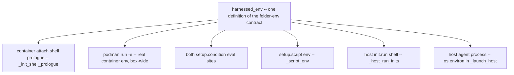
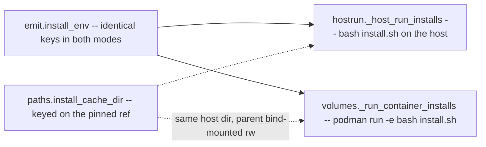
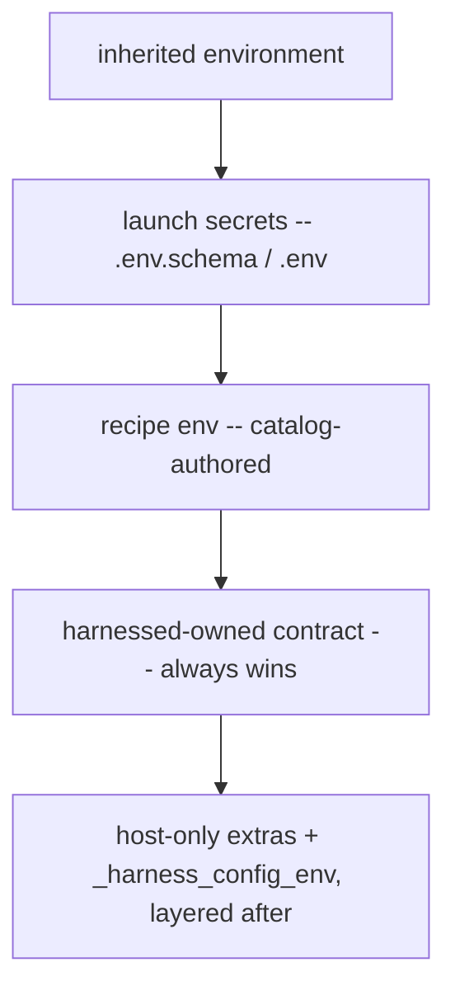

# The env contract: what the agent's environment promises

harnessed runs catalog-authored content — recipe Dockerfiles, `install.sh`, `setup.sh`, `init.run`,
`setup.condition` — on two surfaces: containerized and host-native. A recipe author must be able to
write one script and have the same names mean the same things in both. Everything a launch sets or
consumes falls into four layers, and the layering *is* the precedence order (lowest wins first):

| Layer | One definition | Who authors it | Where it is resolved |
| --- | --- | --- | --- |
| **launch secrets / dotenv** | `launchenv._resolve_launch_secrets` (container) and `launchenv._resolve_launch_env` (host) — two shapes of one resolution | the user: `~/.config/harnessed/` and the project's `.env.schema` / `.env` | per launch, host-side, before anything else runs |
| **recipe `env:`** | `setupenv._recipe_env` — the single declaration behind all three consumers | the recipe | build time for the project-independent subset, launch time for the rest |
| **folder-env contract** | `setupenv.harnessed_env` | harnessed | per launch, per mode |
| **install-env contract** | `emit.install_env` | harnessed | per install, per mode — a deliberate **subset** of the folder-env |

The folder-env contract is the promise this page turns on: one set of variable names with the same
meanings on every surface catalog-authored content runs on. The install-env is a **deliberate
subset** of it, not a rival: it carries no project variables because its phase has no project
mounted. Everything else a script may see falls outside both contracts and is off-limits to catalog
authors — the host-only package-manager redirects, the mise redirect and trust variables,
`_harness_config_env`.

Related: [services](/openwiki/architecture/services.md) (where the socket and `client_env` values
come from), [container launch](/openwiki/workflows/container-run.md) and
[host launch](/openwiki/workflows/host-run.md) (the two sequencers that inject the contract),
[precedence](/openwiki/concepts/precedence.md) (the full conflict table this page's ordering facts
come from), [credentials](/openwiki/concepts/credentials.md) (the secrets layer's token rules).

---

## The folder-env contract

One set of variables, same names and same meanings on every surface. `setupenv.harnessed_env` is the
single definition; a recipe author writes `${MAIN_REPO_DIR}` once and it resolves identically in the
container attach shell, a hook, a `podman exec`, a setup script, and the host agent process.

| Variable | Value |
| --- | --- |
| `HARNESS` | The harness being launched (`claude`, `omp`, …). Unprefixed on purpose — see [naming traps](#two-naming-traps-invariants). |
| `PROJECT_DIR` | The project directory the agent starts in. |
| `MAIN_REPO_DIR` | The git **common dir** — in a bare + linked-worktree layout that is the bare repo dir, not the default-branch work tree. Falls back to `PROJECT_DIR` outside a repo. |
| `HARNESSED_GIT_COMMON_DIR` | Same value as `MAIN_REPO_DIR`, under an explicit name. See [naming traps](#two-naming-traps-invariants). |
| `HOST_WORKSPACE_DIR` / `CONTAINER_WORKSPACE_DIR` | The mounted workspace root — **identical strings**, because the project is bind-mounted at its own host path. Auto-widened to the bare-repo container so sibling worktrees are visible. |
| `HOST_HOME` | The **host** `$HOME`, which is not the container's (`/home/harnessed`). A path-preserving persist mount means a recipe pointing a tool at e.g. `~/.pulumi` must write `$HOST_HOME/.pulumi`. |
| `HARNESSED_BIN_DIR` | The dir an `install.script` lands executables in — the **same value the install contract hands that script**, so a wrapper installed at build time can go on `PATH` at attach time (`init: run: export PATH="${HARNESSED_BIN_DIR:?}/…:$PATH"`). Container: `/home/harnessed/.local/bin`. Host: the stack's own `tools/<stack>/bin`. |
| `HARNESSED_RECIPE_DIR` | *(recipe-scoped surfaces only)* The recipe's own source dir — a setup script does `cp` where a Dockerfile did `COPY`. Host: the catalog dir. Container: `/opt/harnessed/recipes/<recipe>` (bind-mounted `:ro`). |
| `HARNESSED_<SERVICE>_SOCKET` | Agent-side socket path for each socket-backed project-scoped service. Resolved **per mode**, so a host launch gets the host path, not the container's. |
| *(a service's own `client_env`)* | Whatever a project-scoped service declares its clients need, injected under the service's chosen names (not a `HARNESSED_*` name). `{host}` resolves to `127.0.0.1` on the host and `host.containers.internal` in a container — this is how a `publish: ephemeral` service hands over a host/port that does not exist until the container is running. |

### Two naming traps (invariants)

Two entries of the contract are named the way they are for reasons a refactor must not "fix":

1. **A bare `GIT_COMMON_DIR` is never exported.** git itself consumes that variable, so exporting it
   would hijack common-dir resolution the moment the agent `cd`s into another repository. The
   contract therefore exports the same value under the explicit name `HARNESSED_GIT_COMMON_DIR`.
2. **`HARNESS` is unprefixed on purpose.** It is already the token a recipe Dockerfile branches on
   via `ARG HARNESS`, so `$HARNESS` in a setup script means exactly the same thing as `${HARNESS}`
   in a Dockerfile — no second spelling of the same decision.

### How each mode delivers the contract

`harnessed_env` is injected at every place catalog-authored content runs. The sites, and the
mechanism each mode uses to reach them:



*One definition, many surfaces. The attach-shell export is redundant by design — the container
already has the contract box-wide from `podman run -e`.*

- **Container attach shell prologue** (`_init_shell_prologue`) — exports the contract (shlex-quoted)
  before the harness starts, so `init.run` snippets and the agent process see it.
- **The container itself** — `podman run -e`, one `-e VAR=…` pair per variable. This is what makes
  the whole box agree: a hook or a later `podman exec` never sees the attach shell, and `bd`
  silently accepts an empty `--server-socket` rather than failing, so a socket var that existed only
  on one exec was a silent fallback to a wrong config. The full `-e` block, in order:

  ```text
  podman run -d --name <inst>
    --env-file <global> --env-file <project>     # launch secrets, global -> project
    -e <recipe env ...>                          # FIRST - catalog-authored, must not clobber
    [-e CLAUDE_CODE_OAUTH_TOKEN]                 # withheld per the credentials rules
    -e <folder-env contract (harnessed_env)>
    -e <setup env (_container_setup_env)>
    -e MISE_TRUSTED_CONFIG_PATHS=<mount_path>
    -e HATAGO_TRANSPORT=<http|stdio|none>
  ```

  **Order is precedence**: podman applies `-e` left-to-right, so the last wins. Recipe `env:` goes
  first because it is catalog-authored; harnessed-owned values follow. Reversing the pair silently
  inverts precedence between the modes.
- **Both `setup.condition` eval sites** — `_collect_setup_notices` (the user-facing notice gate) and
  `_confirm_setup` (the confirm gate, reached from both modes' setup paths). Conditions run
  host-side in the project dir with the contract in env, which is why a condition may be written
  against a real path — `[ ! -f "${MAIN_REPO_DIR}/.sometool/metadata.json" ]`. Under an env-less
  eval that expanded to the empty string and the test passed falsely.
- **`setup.script` env** (`_script_env`) — the contract plus the setup-only keys (below).
- **The host `init.run` shell** (`_host_run_inits`) — the init subprocess gets
  `{**os.environ, **harnessed_env(...)}`; what it exports is then propagated to the agent.
- **The host agent process** — `os.environ` in `_launch_host`. On the host there is no container to
  set env on, so `os.environ` *is* the box; the export is set before setups run so they see it too.

The two halves of that list are the point. The container has a box (the pod) and the mechanism is
`podman run -e`; the host has no box, and `os.environ` of the launching process is made to play that
role, so the exec'd agent inherits everything. **A delivery mechanism wired into one mode only makes
the host and container winners drift** — the declaration then works on one surface and is a silent
no-op on the other. That is the recurring defect shape of this whole area: `init:` was once wired
only into the container attach shell (a silent no-op under `host-run`), the socket vars were once
container-only (so a host launch's `:?` guard always aborted), `_service_data_dir` once returned a
container path in host mode, and the `-e` ordering was once inverted on one side — caught merging
harnessed-0tk.7 and harnessed-8px.2, each self-consistent alone.

### Mode-resolved entries

Several entries resolve differently per mode, which is the entire reason the contract is a function
rather than a constant:

- `HARNESSED_BIN_DIR` — the image's `~/.local/bin` in container mode; the stack's own bin dir
  (`$XDG_DATA_HOME/harnessed/tools/<stack>/bin`) on a host launch.
- `HARNESSED_RECIPE_DIR` — container-side it is the read-only mount at `/opt/harnessed/recipes/<recipe>`;
  host-side it is the recipe's catalog dir. The container path constant (`emit.CTR_RECIPE_DIR`) is
  single-sourced so the install executor's bind-mount and the setup-script mount agree —
  `$HARNESSED_RECIPE_DIR` names one path no matter which phase reads it.
- `HARNESSED_<SVC>_SOCKET` and `client_env` — resolved per launch via `svcstate.svc_socket_env` /
  `svc_client_env`. `_service_data_dir` returns the agent-visible path per mode: returning the
  container path unconditionally handed host-mode consumers `/home/harnessed/<name>`, a path that
  does not exist on the machine it would be used on. The socket and client vars are added **last**,
  so a service declaring both a socket handle and explicit client vars resolves them from the same
  launch.

`HOST_WORKSPACE_DIR` and `CONTAINER_WORKSPACE_DIR` are deliberately *not* mode-resolved: they are
the same string because `_build_mount_args` binds the project at its own host path
(`-v {mount_path}:{mount_path}`). `HARNESSED_PROJECT_DIR` in the setup-script env is mode-invariant
for free for the same reason.

### `setup.script` env: the contract plus setup-only keys

`_script_env` spreads `harnessed_env` (with `recipe=` set, `sockets=False`) and adds keys whose key
**set is identical in both modes** — env, not templating, is what makes one script file runnable on
every backend:

- `HARNESSED_MODE` (`host` | `container`), `HARNESSED_STACK`, `HARNESSED_PROJECT_DIR`,
  `HARNESSED_HOST_HOME`;
- `HARNESSED_CFG_<KEY>` for each resolved `setup.config` value (derive/prompt templates);
- `HARNESSED_<PRIMITIVE>` for the repo-identity values (`repo`, `gcd_db`, `gcd_hash`,
  `project_hash`) — computed **host-side and injected**, because the git common dir (`.bare/`) is
  outside the container mount and not recomputable there;
- when a `bin_dir` is supplied (the host path supplies one), `HARNESSED_BIN_DIR` is overridden to it
  and leads `PATH`, so a script can install a tool and immediately configure it in one file.

`sockets=False` here is deliberate: `_script_env` must produce the same key set in both modes, and
the container already has the socket vars box-wide from `podman run -e`. Container-side the whole
setup env is resolved **host-side** (a `setup.config` item may prompt, which must happen before the
container starts) and set as real container env — not `podman exec -e` — so hooks and later execs
see what the setup script saw; the exec itself passes no env, and it runs before the egress firewall
closes since a first-run setup is exactly the step that downloads.

### Who may be asked: the prompting gate

Several of these env resolutions can *block on a question* — a `setup.config` prompt, a
`setup.confirm`, a service-drift recreate. Whether harnessed may ask is one predicate,
`console._can_prompt()` = `sys.stdin.isatty() and not in_exec_mode()` (#450). `isatty` alone was the
whole test and is still right for CI and piped launches, but it is wrong for the `host-exec` /
`container-exec` verbs: those run from a real terminal, with a real TTY, and still have nobody at
the keyboard — the operator handed over a prompt and is waiting for an exit code. The run verbs
declare exec-mode once, via `console.set_exec_mode`, and every blocking site gates on the predicate.

`_confirm_setup` — the `setup.confirm` gate, reached from both modes — is the shape to copy:

- **Without consent it skips, never runs.** No TTY (headless/CI) and `-exec` alike print a warning
  and leave the setup undone; "nobody objected" is not consent for a commit into someone's repo.
- **The `setup.condition` is consulted *before* prompting** (same host-side evaluation, same env
  contract, as `_collect_setup_notices`), so the question only fires when there is actually
  something left to do — a prompt that fires every launch trains people to answer without reading.
- The same predicate gates `_resolve_setup_config`'s interactive prompts (non-interactive falls back
  to the declared default), `_prompt_setup_notices`, the service-drift recreate confirm, and
  `_acknowledge_warnings`.

---

## The install-env contract: a deliberate subset

`emit.install_env` is the contract a recipe's `install.script` may rely on — identical **keys** in
host and container mode. It is deliberately a **subset** of the folder-env, not a superset:
`PROJECT_DIR`, `MAIN_REPO_DIR` and the workspace vars are **absent on purpose**.

The reason is the phase, and it is forced rather than stylistic. `install:` runs where **no project
is bind-mounted** — container-side in a throwaway container writing the per-stack volumes, gated on
the stack fingerprint — so the project-shaped values are unknowable. If harnessed exported them
host-side only, authors would get a variable that works on the host and silently expands to empty in
the other mode: the exact class of mode-asymmetric failure the contract exists to remove. Anything
needing project context belongs in `setup.script`, whose phase has a project.

| Variable | Value |
| --- | --- |
| `HARNESS` | as in the folder-env contract |
| `HARNESSED_MODE` | `host` \| `container` |
| `HARNESSED_RECIPE_DIR` | the recipe's own dir — `cp` where a Dockerfile did `COPY` (mode-resolved as above) |
| `HARNESSED_CONFIG_DIR` | the agent config dir to install **into**: the config volume's `~/.claude` container-side, the materialized host home on a host launch. One name, so `cp … "$HARNESSED_CONFIG_DIR"/skills/` is the whole mode-portability story. |
| `HARNESSED_INSTALL_CACHE` | `$XDG_CACHE_HOME/harnessed/install/<recipe>/<install.cache>`, or **empty** when the recipe declares no `cache:`. See below. |
| `HARNESSED_BIN_DIR` | where to land an **executable**: the tools volume's `~/.local/bin` (already on `PATH`) container-side, the stack's own bin dir on a host launch. Without it a script has no portable destination for a binary and must guess at `$UV_TOOL_BIN_DIR`. |
| `HARNESSED_HOME_SHIM` | a dir whose `.claude` **is** `$HARNESSED_CONFIG_DIR`, for upstream installers that only know how to install "globally" into `$HOME/.claude`: run them as `HOME="$HARNESSED_HOME_SHIM" <installer>`. See below. |
| `HARNESSED_REF_<KEY>` / `HARNESSED_REPO_<KEY>` | for each `install.refs:` entry: the pinned ref, and `owner/repo` (not a URL — the script composes the URL). The transformation is `.upper()` and nothing cleverer, which is why the key charset is restricted; these keys vary by recipe but never by mode. |

Both executors of the contract share one definition:



*Two executors, one contract. The cache is host state, so both modes reach the same directory —
directly on the host, through a bind mount in the container.*

### `HARNESSED_INSTALL_CACHE` semantics

- **Value**: `$XDG_CACHE_HOME/harnessed/install/<recipe>/<install.cache>`; **empty string** when the
  recipe declares no `install.cache`.
- **Keyed on the pinned ref.** Floating keys (`latest`, `main`, `master`, …) are rejected at schema
  load — a moving key is a stale cache. When the recipe declares `install.refs:`, the key is
  *derived* (sha256 of the canonical `key=repo@ref` list, first 16 hex) and a hand-written
  `install.cache:` alongside `refs:` is rejected. Bumping the pin yields a new directory, so an
  upgrade can never read stale content.
- **Cache miss = the directory does not exist.** harnessed creates **only the parent**; the leaf's
  existence is the script's hit/miss test, and the script populates it and copies out of it.
- **The same host dir in both modes.** Host installs use it directly. Container-side, the container
  path (`/tmp/harnessed-install-cache/<recipe>/<key>`) has its **parent** bind-mounted rw onto the
  host cache's parent, so a pinned source clone fetched by one stack is reused by every other stack —
  the build path used to `rm -rf` the clone in the same layer and every stack re-fetched what another
  had already fetched. The **parent is mounted, never the leaf**: podman statfs's a bind source
  before the script runs, so mounting the leaf turns every miss into `statfs …: no such file or
  directory` — i.e. the first build of any new recipe or bumped pin — and the parent also keeps the
  populate-`<leaf>.partial`-then-rename idiom on one filesystem.

### `HARNESSED_HOME_SHIM`: stable, not mktemp

The shim answers one problem: upstream installers that only write "globally" into `$HOME/.claude`.
Container-side the shim is the image home, where `$HOME/.claude` already is the config dir, so it is
a no-op. Host-side it is `paths.host_home_shim` — a **stable** per-project sibling of the config dir
(`<home>.home`), whose `.claude` is a symlink to the config dir, created once and **re-linked each
launch** (the config home is rebuilt, so the symlink must be re-pointed at the new inode even though
the path string is unchanged).

Stability is the entire point. Recipes previously improvised this with `mktemp -d` plus a trap, so
every absolute path the installer *recorded* (gsd-core baked 12 hook paths into `settings.json`
using the `$HOME` it ran under) pointed into a dir deleted seconds later. The authoring contract is
therefore: **never roll your own shim — use `$HARNESSED_HOME_SHIM`.**

---

## Launch-time secrets: the `.env.schema` / `.env` layer

Below both contracts sits the layer the *user* authors. `launchenv.py` resolves it — pure
resolution, nothing in the module knows about podman or the CLI — in **two shapes of the same
answer**, because the two modes consume env differently:

- `_resolve_launch_secrets` returns an ordered list of `--env-file` paths, for the container path:
  podman needs a **file**.
- `_resolve_launch_env` returns a `KEY -> value` map, for the host path: `os.environ` **is** the box,
  so nothing is written to disk.

Both read the same sources in the same **global → project** order, and that shared precedence is the
reason they live in one module — the two must not drift:

1. `~/.config/harnessed/.env.schema`, resolved via `varlock load` when varlock is on `PATH` (opt-in:
   needs the schema present); else a bare `~/.config/harnessed/.env` read literally.
2. The project: `<project>/.env.schema` via varlock (varlock itself cascades `.env`/`.env.local`
   overlays on top of the schema); else `<project>/.env` normalized and read literally.

Failure degrades, never hard-fails: a varlock timeout (60 s, so an unattended launch cannot hang
forever on a 1Password prompt), a non-zero exit, or invalid JSON yields "no secrets from this
schema" with an error naming the directory. The resolved env is also what the egress firewall asks
for the agent's own API hosts (`launchenv.api_endpoint_egress_hosts`) — `ANTHROPIC_BASE_URL` comes
from the user's schema, not from any recipe, so nothing else would tell a default-DROP firewall
about a gateway setup.

The container path's files are **generated temps, never the user's own**:

- a plain `.env` is copied to a mode-0600 temp and normalized — one pair of surrounding quotes and
  any `export ` prefix stripped, because podman's `--env-file` keeps quotes literal;
- varlock output is written from `--format json` (raw values), not `--format env` (which double-quotes
  everything podman would ingest literally);
- a value containing a newline is **skipped with a warning** rather than written — podman reads a
  value to end-of-line, so a PEM block would arrive truncated and every following line reparsed;
- the temps are unlinked in a `finally` as soon as podman has ingested them (T-05-06): resolved
  secret values must not linger on disk, whatever happens to the launch.

The `--env-file` list is consumed by `seed_auth`, deliberately **after** every aborting check in
`materialize_config` so an early exit cannot strand resolved secrets on disk; podman applies the
files in order with **last-wins**, which is why the order is global → project (the project
overrides the global). `mounts._env_files_value` answers "what value does this var end up with"
using the same last-wins walk and distinguishes an explicit **empty string** ("declared, and turned
off") from absent — the distinction the token-withholding rules in
[credentials](/openwiki/concepts/credentials.md) are built on. For an `isolated_auth` stack,
`_strip_var_from_env_files` deletes the token's assignment from the resolved temps in place — safe
precisely because none of them is the user's file.

## Recipe `env:`: built where, launched where

Recipe `env:` is one declaration (`setupenv._recipe_env` iterating `schema.resolve_recipe_env` per
recipe, later recipes winning on a clash) consumed by three surfaces: the build-time install step,
the setup script, and the agent process. Its delivery has a **build-vs-launch split**:

- **Build** (container mode): `emit.write_derived_dockerfile` resolves each recipe's env with
  `project_path=None`. `resolve_recipe_env` **omits** — never half-substitutes — any var whose
  template needs the project (`{project_dir}`, an unresolvable `{persist:…}`), and the surviving
  project-independent subset is emitted as real image `ENV` lines, placed before the recipe's own
  Dockerfile body so a build-time `RUN` sees them.
- **Launch** (both modes): the *full* resolved set — project-templated values included — is
  re-resolved with the project known and set on the box: `-e` pairs in the container's `podman run`
  (the image's `ENV` already carrying the build-resolvable subset is not sufficient — a value
  templated on `{project_dir}` or an `in_repo` persist dir is unknowable at build), and
  `os.environ.update(_recipe_env(...))` on the host.

The split is what lets one `env:` declaration serve a Dockerfile `RUN`, an `install.script`, and the
running agent without any of them seeing a half-substituted path.

---

## Host-only extras: NOT part of either contract

Alongside the install contract, the host install and setup executors also redirect the package
managers so a tool an install lands goes into the *stack's* tree rather than the user's global one —
there is no image to contain it host-side:

| Variable | Value | Why |
| --- | --- | --- |
| `UV_TOOL_DIR` / `UV_TOOL_BIN_DIR` | the stack's uv tool dir and bin dir | so `uv tool install` stays inside the stack |
| `npm_config_prefix` | the stack tools dir | so `pnpm add -g` does not write the user's global prefix |
| `PATH` | `$HARNESSED_BIN_DIR` **first** | so a tool an install just landed is resolvable by the next line of the same script |

These are host-only **by design**: container-side the image already provides the containment they
recreate. They are **not part of the both-modes contract**, and a script must not depend on their
values — for a path you need to name, use `$HARNESSED_BIN_DIR`, which *is* contractual.

### The mise redirect and `MISE_TRUSTED_CONFIG_PATHS`

Host provisioning redirects mise at the **stack's own instance** (`_host_mise_env`:
`MISE_DATA_DIR` and `MISE_CONFIG_DIR` under the stack's tools tree), because a mise shim re-resolves
its tool by `argv[0]` against the data dir *at run time* — install-time redirection alone puts the
binary where the shim can never find it again. The redirect is scoped to provisioning (installs and
the recipe scripts that inherit it); the **agent** gets the user's own mise back before the exec
(`_restore_user_mise_env`), because nothing harnessed puts on PATH is a shim any more and carrying
the redirect broke every shim on the user's own PATH, the agent binary included. `MISE_STATE_DIR` is
deliberately **not** redirected — mise keeps its trust store there, and trust is a fact about the
user and a config file, not about which stack happens to be running.

`MISE_TRUSTED_CONFIG_PATHS` is the trust seam, and the two modes set it by opposite-but-mirrored
rules:

- **Host: carry, never invent** (bd harnessed-67u). `_apply_host_mise_env` reads the user's own
  `settings.trusted_config_paths` out of their mise `config.toml` — *before* the `MISE_CONFIG_DIR`
  redirect lands, so a user-chosen config dir is honoured — unions it with the inherited value,
  dedupes, and joins with `:` (mise's only delimiter). It sets nothing when the composed list is
  empty, because an empty value is a value mise would read. Harnessed naming its own paths here is
  rejected by design: a mise config can carry `_.source`, so granting trust is **code execution**,
  and auto-trusting on directory entry would hand that to any repo you walk into. Carrying entries
  the user (or the inherited environment) already chose grants nothing.
- **Container: name the mount root** (bd harnessed-8px.27). `podman run` carries
  `-e MISE_TRUSTED_CONFIG_PATHS=<mount_path>` because setup scripts run as
  `podman exec … bash <script>` — neither a login nor an interactive shell — so the image's own
  `mise trust -a` (in `~/.bashrc` and `/etc/profile.d`) never runs, and any setup invoking a mise
  shim died with `Config files … are not trusted`. serena hit this: its binary *is* a mise shim, so
  merely running it loads the project's config. It is set **on the container, not the exec**, for
  the same reason as everything else in the `-e` block — hooks and later execs must agree with what
  the setup script saw — and preferred over `bash -lc`, which would fix trust only as a side effect
  of login-shell behaviour (reordering `PATH` and pulling in everything else a login shell does).

The contrast is the rule: container-side the only config in play is the one harnessed put there (the
mount root), so naming it grants nothing; host-side the environment belongs to the user, so
harnessed only carries what they already chose.

### The project's own copy

A launch also hands the **project** the same tool env the agent gets: `_write_project_tool_env`
(on both backends) records `_recipe_env(mode="host")` plus the service `client_env` into one 0600
dotenv under `$XDG_STATE_HOME/harnessed/project-env/`, keyed on the git common dir so every worktree
of a checkout shares it, regenerated every launch — it carries the service password, so it is
referenced from the state dir, never copied into the repo. **No mise config is written into the
project** (bd harnessed-7mt): mise keys trust per config file and trust does not cascade, so a
harnessed-dropped `mise.local.toml` re-prompted in every new worktree — and since a mise config can
carry `_.source`, trusting one grants code execution. Removing the file *removes the prompt* instead
of defeating it; configuring a plain shell is opt-in, via a loader pointed at
`harnessed project-env-path`.

Two further pieces of host-side env sit outside both contracts and are layered around them:

- **Recipe `env:`** (mode-resolved) is set on the launching process and inherited by everything;
  it is catalog-authored, so it loses to the contract (see precedence below).
- **`_harness_config_env`** pins the harness's own config-dir variables (`CLAUDE_CONFIG_DIR`,
  `PI_CODING_AGENT_DIR`, omp's nested bridge dir) at the stack home, applied **last** so an
  inherited value cannot redirect a script's writes into another stack's home. Containment, not
  contract: it exists so recipes cannot leak, not so scripts may read.

---

## Precedence: the contract always wins

The rows that matter here are in [precedence](/openwiki/concepts/precedence.md); restated only as
far as this page needs them. Identical in both modes, bottom to top: **inherited environment →
launch secrets / `.env` → recipe `env:` → harnessed-owned contract.** The contract wins.



*The ladder. Container mode realizes it as `--env-file` first, then `-e` left-to-right with recipe
env first and harnessed-owned values last; host mode realizes it as successive `os.environ.update`
calls in the same order.*

- Container mode, install step: the executor merges
  `{**resolve_recipe_env(...), **install_env(...)}` and passes the result as `-e VAR=…` — the dict
  merge order (recipe first, contract second) is the mechanism, and `-e` also beats the image's
  preceding `ENV` lines, which is where this precedence was first expressed as inline `RUN`
  assignments beating `ENV`. Container mode, launch: `podman run -e` applies `-e` left-to-right with
  recipe `env:` passed **first** among the `-e` block and harnessed-owned values later.
- Host mode: `env.update(install_env(...))` runs after `env.update(recipe_env)`, and
  `os.environ.update(harnessed_env(...))` runs after `os.environ.update(_recipe_env(...))` — which
  itself runs after `os.environ.update(_resolve_launch_env(...))`, the secrets layer, applied
  *before* recipe env so a recipe declaration still wins and a stale shell export never beats the
  declared schema.

The two orderings are not independent facts: reversing either one **silently inverts precedence
between the modes**, which is the harnessed-8px.2 merge defect and the same reason the delivery
mechanisms above must be added to both modes at once. The host-only extras and `_harness_config_env`
layer after the contract, host-side only.

Recipe-authored `tests/*.sh` run in **the same env as the install** — the host seam passes the
install env straight through (`emit.install_env` is the single authority; a second copy could drift
silently), and the container seam re-runs the install argv with only the script path swapped — so a
test asserts what its own install produced and host/container drift is not expressible in this
mechanism.

---

## What guards the contracts

- **The subset is enforced by omission, not by filtering.** `install_env` simply never receives or
  returns project variables; the `InstallSpec` docstring states the invariant ("a strictly
  PROJECT-INDEPENDENT env"), and the phase split is stated where authors will read it — serena's
  recipe and setup script both note that project-shaped work stays in `setup.sh` because the install
  env deliberately carries no `HARNESSED_PROJECT_DIR`.
- **Content belongs in the contract's config dir.** A recipe Dockerfile may not reference
  `~/.claude` at all (`validate_no_claude_writes`): content written there is invisible to a host
  launch and hidden by the profile bind-mount in a container. A recipe with an `install:` whose
  Dockerfile still has a `RUN` but declares no `install.system:` is rejected
  (`validate_container_only_declared`) — that shape silently delivers less on a host launch than the
  recipe promises. Both push authors toward `install.script` writing `$HARNESSED_CONFIG_DIR`, the
  one destination that lands in both modes.
- **The .sh bodies are linted as files.** `_lint_script_file`, shared by `validate_setup_script` and
  `validate_install_script`, reads the script text and rejects floating refs and raw `npm`/`npx` —
  the two gates that read strings and Dockerfile text never see a file, so without this the pin
  could simply drift back into the script body and out of the contract.
- **Scripts defend themselves with the contract.** Shipped install scripts open with
  `: "${HARNESSED_CONFIG_DIR:?…}"` guards and read `HARNESSED_REF_*` / `HARNESSED_REPO_*` instead of
  carrying pins in the script text — the contract's keys are the only sanctioned inputs.
- **The prompting gate is one predicate.** Every site that can block a launch on a question routes
  through `console._can_prompt()`, so a new blocking prompt cannot forget the `-exec` case (#450)
  the way the confirm gate originally did.
- **The trust variables have an auditable shape.** Host-side `MISE_TRUSTED_CONFIG_PATHS` only ever
  contains entries read from the user's own config or handed in by the inherited environment
  (`tests/test_host_mise_trust.py` pins the carry-don't-invent rule, the `:` delimiter, the dedupe,
  and fail-closed on unreadable config); container-side the single `-e` is asserted on the source of
  `apply_isolation` so it cannot be dropped from the `podman run` line silently.
- **Authoring docs restate the tables** (the shipped harnessed-catalog skill lists the install env
  and the "never roll your own shim" rule), so the contract is the same in code, docs, and examples.
