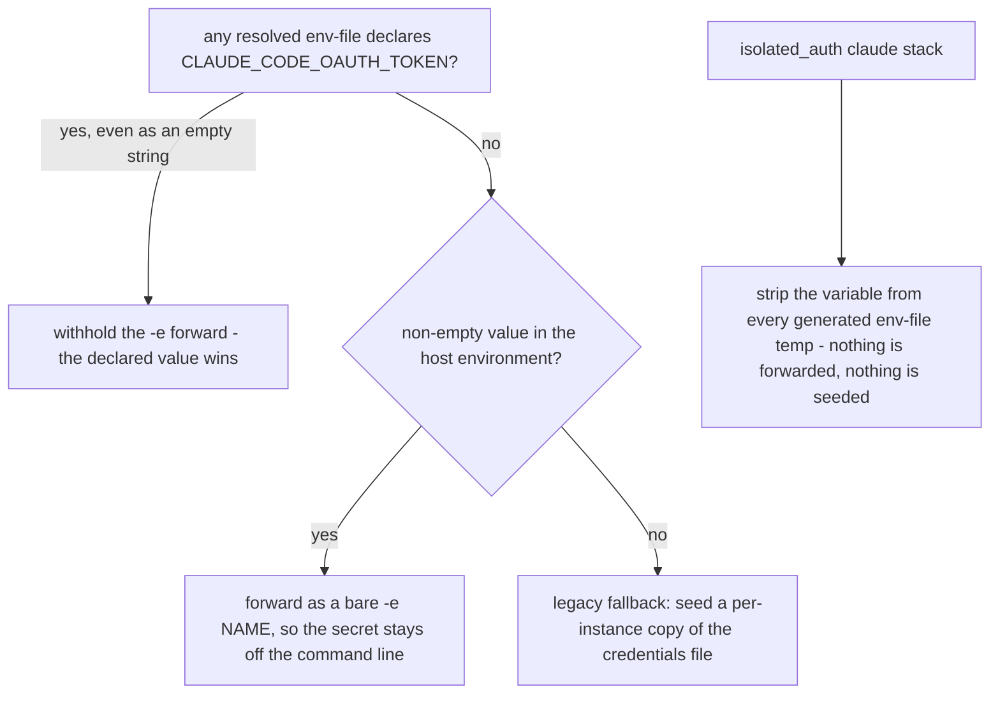
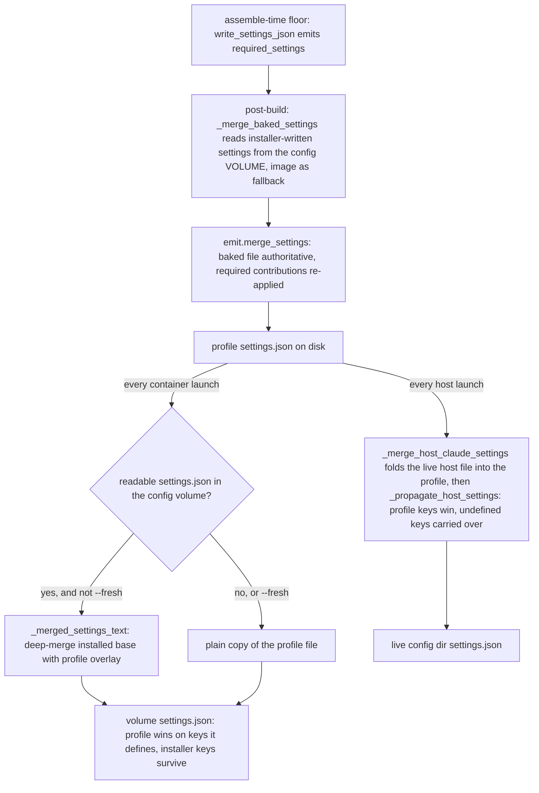

# Precedence: who wins when sources conflict

harnessed deliberately lets the same value arrive from several places: a user-global secrets schema,
a per-project `.env`, a stale shell export, a recipe's `env:`, harnessed's own contract keys, an
install script's output, a parent stack, an overlay catalog. Every one of those overlaps is settled
by a rule that names a **winner**, and in almost every case the code records the production failure
the *loser* of that rule once produced. This page is the single list of those rules; each section
states the winner first and the bug second.

| Conflict | Winner | The failure the loser produced |
| --- | --- | --- |
| global vs project env-file | **LAST assignment wins** (project) | a first-hit presence check left the pod with no usable token *and* no credentials (bd harnessed-7bk) |
| env-file vs host shell export | **any env-file declaration, empty included** | a stale export outranked every declared source, so a per-project token could never take effect (bd harnessed-36l) |
| empty value vs absent | **empty is a declaration meaning OFF** | forwarding past it would override the very intent that declared it |
| recipe `env:` vs harnessed-owned keys | **harnessed-owned** | the host and container winners drifted (bd harnessed-8px.2) |
| baked image ENV vs launch-time re-application | **launch re-application (full resolved set)** | project-templated vars missing from the running agent's env |
| profile vs installer-written `settings.json` | **merge, never copy** | ccstatusline's `statusLine` vanished on every restart (bd harnessed-8px.19) |
| required `defaultMode` vs a baked mode | **the baked mode** (floor, not override) | a recipe's own mode would be silently replaced |
| hatago grant vs a baked `permissions.deny` | **required (grant wins, deny stripped)** | a recipe denying the hub would break every MCP tool |
| duplicate recipe hooks | **union, whole-entry deduped** | each hook fired TWICE per event (bd harnessed-8px.15) |
| user overlay vs repo catalog | **overlay wins, and the loader warns** | sessions quietly assembled stale overlay content while the newer repo copy sat unused |
| generated stack vs authored stack | **authored wins; mint refuses the collision** | `run` would silently execute something the user did not ask for (PR #176) |
| parent vs child `extends:` fields | **child overrides; omissions inherit; the four list fields union** | tolerant parsing let a pre-feature `extends:` inherit nothing for months |
| inherited `CLAUDE_CONFIG_DIR` vs the pinned stack home | **pinned, applied LAST** (bd harnessed-8px.26) | gsd-core's install.sh wrote 69 skills into an unrelated stack's home |
| shipped `default` stack vs a user's own | **the user overlay replaces it wholesale** | a policy-bearing shipped baseline would silently tax every dynamic stack |

---

## Env-file layering: global → project, last-wins, empty=off

Launch-time secrets come from two directories read in a fixed order — the user-global
`~/.config/harnessed/` first, the project directory second. **The project wins**, and the ordering
*is* the mechanism: the container path returns the files as an ordered `--env-file` list, and podman
applies env-files last-wins, so a later project value overrides the global one. The host path
(`_resolve_launch_env`) reads the same sources in the same order into a `KEY -> value` map; the two
shapes live in one module precisely so the two backends cannot drift.

Within a single directory the `.env.schema` **wins over a sibling `.env`** — varlock itself cascades
`.env` / `.env.local` overlays on top of the schema — while a bare `.env` is read literally (no
varlock, no `op://` resolution), with quotes and `export ` prefixes stripped.

Two refinements make the layering correct rather than approximate:

- **An explicit empty value is a declaration, meaning OFF — not absence.** `_env_files_value`
  returns the *last* declaration across the ordered files, `""` included. Any non-`None` answer,
  empty included, causes `_claude_oauth_token_args` to **withhold** the `-e` host-env forward:
  `podman run -e` beats `--env-file`, so forwarding a host export whenever one exists let a stale
  shell export outrank every declared source — a per-project `CLAUDE_CODE_OAUTH_TOKEN` for a
  *different account*, resolved from 1Password into the project schema, could never take effect
  (bd harnessed-36l). Withholding the forward when *any* env-file assigns the variable is what makes
  the container path agree with host mode, where declared schema values already overwrite an
  inherited shell value.

*The precedence slice of the claude auth ladder: a declared env-file value beats the host
environment, an empty declaration beats a stale export, and isolation beats both.*

- **Presence checks must agree with value precedence — the LAST answer wins, not the first hit.**
  `_claude_oauth_token_configured` resolves every dir in global → project order and keeps the last
  declaration, empty included. Returning `True` on the *global* hit meant no credential file was
  mounted either — a container with no usable token *and* no credentials, logged out with no
  recovery path from inside the pod (bd harnessed-7bk). Resolving every dir is cheap: varlock
  resolution is memoized, and these dirs were already resolved for the env-file list.

For `isolated_auth` claude stacks the whole layering is overridden in one direction: identity beats
every declared source. `_strip_var_from_env_files` deletes the token from the generated temp files,
because `--env-file` is handed to podman unconditionally and a user-global declaration would
otherwise walk straight past the other suppressions. Rewriting them in place is safe only because
every path `_resolve_launch_secrets` returns is a mode-0600 temp harnessed generated — a plain
`.env` is copied, never handed to podman directly.

## Recipe `env:` vs harnessed-owned values

Two arenas, one winner in both: **harnessed-owned values beat catalog-authored `env:`, and
catalog-authored values beat whatever the process inherited.**

**The running container.** The podman command applies `-e` left-to-right, so the LAST wins. Recipe
`env:` is passed **first** and harnessed-owned values (the folder-env contract, the setup env,
`HATAGO_TRANSPORT`, the mise trust path) later — recipe env must not be able to clobber values the
harness owns. That matches host mode, where `_recipe_env` is applied to `os.environ` and the
folder-env contract overwrites it afterwards. Reversing the pair silently inverts precedence between
the modes — the drift was caught while merging two changes that were each self-consistent alone
(harnessed-0tk.7 and harnessed-8px.2).

**The host launch.** `os.environ` is the box, and `_launch_host` updates it in a deliberate order:
launch secrets first, recipe `env:` second, the folder-env contract last. Each layer overrides the
previous — and all of them override an inherited shell export, because "letting a stale export in
the invoking shell silently beat a declared source is the failure mode that is hardest to see from
inside a session."

**The install contract.** `install.script` runs with, in both modes:

1. the inherited environment,
2. the recipe's `env:` (mode-resolved),
3. the harnessed-owned install vars (`emit.install_env`) — **applied last and therefore winning**.

Container mode gets this from `{**resolve_recipe_env(...), **install_env}` passed as inline
`-e VAR=…` assignments, which beat the image's preceding `ENV` lines; host mode from
`env.update(recipe_env)` followed by `env.update(emit.install_env(...))`. Same winner both ways —
the exact defect the harnessed-8px.2 merge exposed — and the precedence is asserted as *order*,
not values (`test_install_env_precedence`), so tightening a value cannot pass while breaking the
ordering.

Two host-only layers sit *after* the contract and are precedence rules in their own right:

- **The harness config-dir pinning runs LAST.** After the contract and the package-manager
  redirects, `_harness_config_env` pins `CLAUDE_CONFIG_DIR` (and omp's `PI_CODING_AGENT_DIR` /
  nested bridge dir) at the stack's own home, so an inherited value from a *parent* stack's host
  session cannot redirect an install into the wrong home. Pinned rather than unset: unsetting makes
  such an installer fall back to the user's real `~/.claude`, a worse landing spot. The failure the
  ordering prevents is measured, not hypothetical — gsd-core's install.sh, run with an inherited
  `CLAUDE_CONFIG_DIR`, wrote 69 skills and four top-level artifacts into an unrelated stack's home,
  ignoring the shim it was given (bd harnessed-8px.26).
- **The mise redirect clears as well as sets.** `_apply_host_mise_env` runs after the
  `**os.environ` splat and actively *removes* a stale `MISE_STATE_DIR` (only a harnessed-written
  one), so a value inherited from an outer stack session cannot survive the merge; similarly
  `MISE_NPM_PACKAGE_MANAGER=pnpm` is placed after the splat so it wins — a default a user cannot
  usefully countermand, because with `auto` the install simply fails.

## Recipe `env:` — what is baked vs what is re-applied

Only the **build-resolvable subset** of recipe `env:` is baked as real image `ENV` lines, emitted
before the recipe's Dockerfile body so the body's `RUN` steps see it. A var whose value templates on
the project (`{project_dir}`, an in-repo persist dir) is **omitted** at build, never half-substituted
— `resolve_recipe_env` defers it. The **full resolved set**, project-templated values included, is
re-applied at launch: on the container via `-e`, and on the host via `os.environ`. The running env is
therefore complete and identical across modes; the image ENV is only the extra guarantee that a
build-time step sees what it can.

Within one stack, **later recipes win** on an `env:` clash — `_recipe_env` updates the map in recipe
order, deliberately matching the Dockerfile layering this replaces (a later `ENV` overrides an
earlier one). Stack recipe order is the tie-breaker, so it is load-bearing, not stylistic.

## `settings.json`: merge, never copy

A stack's `settings.json` has three authors — harnessed's required floor, recipe/base installers,
and the host user — and the merge direction differs at each site. Get it wrong and either the
installer's keys or the user's preferences silently vanish.

*One profile file, three merge sites: floor → baked (post-build), baked volume → profile (every
container launch), host preferences → profile → live home (every host launch).*

- **Assemble-time floor → post-build merge.** `write_settings_json` emits only `required_settings`
  (the defaultMode, the hatago grant, declared hooks) because at assemble time no installer has run.
  Once the image exists, `_merge_baked_settings` replaces the floor: it reads the installer-written
  `~/.claude/settings.json` out of the config **volume** first — `install:` moved off image layers
  (bd harnessed-8px.21.4), so the image read is only a fallback for base-image bakes — and passes it
  through `emit.merge_settings`. The merge is unconditional: a settings.json can be baked by the
  agent base image, so gating on a recipe bake would stomp base-sourced settings with the floor.
- **`merge_settings` is surgical, not a generic deep-merge.** The baked file is authoritative and
  every key harnessed does not require is carried through **verbatim**. The required `defaultMode`
  is applied with `setdefault` — a floor, not an override, so a recipe that baked its own mode keeps
  it. The hatago grant is the opposite: it is unioned into `permissions.allow` **and stripped from
  `permissions.deny`** (required wins — hatago is the only MCP path, and a recipe denying it would
  break every tool). Required hooks are appended with **whole-entry union dedup** (bd
  harnessed-8px.15): the floor is written from the same `required` dict, so re-applying it at launch
  used to duplicate every recipe hook and the agent ran each one TWICE per event.
  `warn_duplicate_hooks` remains as a detector — identical (event, matcher, command) triples in the
  final file are warned, never hard-failed.
- **Every relaunch merges the profile over the volume — never copies.** `_ensure_config_volume`
  copies the profile into the config volume on every launch, but `settings.json` is the one file
  routed through `_merged_settings_text`: the installed volume file is the base and the profile the
  overlay (`jsonmerge._deep_merge_json` — dicts merge recursively, non-dicts replaced wholesale), so
  the profile wins on every key it defines without deleting keys it has no opinion about. A plain
  copy dropped every install-written key on every relaunch after the first — bd harnessed-8px.19,
  "ccstatusline statusLine gone on every restart", arriving a second time by a new route when a
  failed read was briefly treated as "empty" instead of "absent".
- **`--fresh` is the one plain-copy case.** It has just discarded the volume, so there is nothing to
  preserve. The volume is removed when the stack fingerprint moves because composition is purely
  additive — reusing the old volume would keep a removed recipe's skills and commands forever.
- **Absent is not empty, on either read.** `read_baked_settings` distinguishes an absent file
  (`None`, silent — keep the floor) from a malformed one (`None` plus a warning — a recipe's bad
  JSON must not crash the build). `_volume_read` maps a failed read to `None`, not `""`: treating an
  unreadable volume as empty made the merge warn and keep the floor, which looks identical to the
  8px.19 regression it exists to prevent. Absent correctly means "copy the profile".
- **Host mode mirrors the merge twice.** Before materialization, `_merge_host_claude_settings`
  merges the user's live `~/.claude/settings.json` into the profile and re-applies the required
  grants — dropping the host's `statusLine`, whose host-absolute command path can never resolve in a
  container. Then `_propagate_host_settings` writes the freshly computed profile over the live home
  carrying **only keys the profile does not define at all** — profile keys win. Without the first
  merge a host session ran on the bare assemble-time floor and a user's `auto` mode silently became
  `acceptEdits` (bd harnessed-8px.8); without propagating on *every* launch (not just on fingerprint
  change) host-side fixes and preference edits never reached the live config (bd harnessed-8px.18).

## Catalog roots: overlay wins, generated last

Catalog entries (agents, recipes, services, stacks) resolve across roots searched in a fixed order:
the user overlay `~/.config/harnessed/catalog` first, the shipped repo `catalog/` second, and the
generated root `$XDG_DATA_HOME/harnessed/generated` **last** — and only when it exists, so a user
who never ran a dynamic launch sees exactly two roots. `find_in_catalog` returns the first existing
candidate, so on a name clash the **overlay wins** and the repo copy is never read. `list_catalog`
dedupes by name the same way, origin-blind.

Because a silent win is also a silent loss, the loader **warns when a recipe is shadowed**:
`load_stack_with_recipes` (production path only — an explicit root is a fixture tree, never an
overlay) prints once per name which copy is used and which is shadowed. Sessions had quietly
assembled stale overlay content while the newer repo copy sat unused, causing real regressions. Only
recipes warn; stacks, agents and services stay silent, and `default` is exempt because overriding it
is a documented, blessed pattern.

The generated root's last place is deliberate in the other direction too: a machine-minted stack
must never shadow one you authored. `dynstack.mint` therefore **refuses** a derived name that
collides with an authored stack — the authored manifest would win resolution while the generated one
sat ignored, and `run` would silently execute something the user did not ask for (reported on
PR #176). Refuse rather than shadow.

One nested-mount rule belongs here because it is the same idea at podman's layer: when a directory
mount and a file mount share a destination prefix, **podman applies the more-specific
destination**. `_omp_mcp_seed_mount` exploits it to shadow only `~/.omp/agent/mcp.json` inside the
shared agent-dir bind mount — a stack's MCP servers reach omp without mutating the host file the dir
mount shares.

## Stack `extends:` — unions, overrides, identity

A child stack merges onto its parent **on the raw dict, before any field parsing**, so every
downstream validator sees one fully-resolved manifest and inheritance needs no per-field knowledge:

- `recipes`, `services`, `harnesses`, `ssh_keys` — **UNION**, parent's entries first, then the
  child's, de-duped. A base stack carries a baseline recipe set that children extend rather than
  restate.
- Every other declared field — **the child's value wins outright**; a key the child omits is
  inherited. `state` and `hatago` included: a declared value *replaces*, it does not deep-merge.
- `name` is always the child's own — identity is never inherited — and `extends` is consumed, never
  carried into the result.

Chains are allowed (a stack extending a stack extending another); a cycle is an error. The parent
resolves against the child's **own catalog root first** (so a fixture tree or a self-contained
overlay resolves within itself), then the normal catalog search — which is what lets a stack in the
user overlay extend one shipped in the repo.

Unknown stack fields are **rejected**, not ignored. Parsing used to be tolerant, and an `extends:`
written before the feature existed looked accepted while inheriting nothing for months — silently
ignored keys on a small, fully-specified manifest are always a bug.

## The default-stack baseline

`--extends` defaults to the literal name `default` on both run verbs, and every dynamic
(`--recipe`) stack mints `extends: default` into its manifest. With neither `--stack` nor
`--recipe`, the baseline itself is the stack that runs — composing nothing on top of it is a
legitimate launch, not a malformed one. `--no-extends` is the one shape that cannot mean this: it
inherits from nothing, so without a recipe list there is nothing left to run, and it is rejected.

The shipped `catalog/stacks/default` is **deliberately minimal and policy-free**: one recipe, no
services, and no `permissions:`, no credential forwarding, no isolation flags. That restraint is a
precedence consequence — the baseline is inherited by *every* dynamic stack on *every* install, so a
shipped baseline that set a policy would silently apply it everywhere. Policy is the user's call:
authoring `~/.config/harnessed/catalog/stacks/default/stack.yaml` replaces the shipped baseline
**wholesale** (the overlay wins resolution on the name clash; fields are not merged between the two
copies). The same ownership model applies one level down: first run seeds the shipped `default`
*recipe* into the user's overlay, where it deliberately shadows the repo copy from then on — the
seeded banner says so outright, including the cost that shipped improvements will never reach the
copy.

---

## Invariants an editor must not "simplify"

- **Order is precedence** in the podman argument list (`recipe_env` before harnessed-owned `-e`s)
  and in the host `os.environ` updates. Reordering either is a silent cross-mode inversion, and it
  passes every value-level test.
- **The env-file forward is withheld on ANY declaration, empty included.** Tightening it to
  "non-empty declarations" reopens bd harnessed-36l; answering presence checks on the first hit
  reopens bd harnessed-7bk.
- **A failed read is "absent", not "empty"** (`_volume_read` returns `None`); and absent means
  "copy the profile", malformed means "keep the floor with a warning". Conflating any pair of these
  reintroduces bd harnessed-8px.19.
- **`settings.json` is merged, never copied, on relaunch** — container volume and host live home
  alike. The plain copy is correct only under `--fresh` (volume discarded) or when there is nothing
  to preserve.
- **Only the four list fields union under `extends:`.** Making other fields deep-merge would change
  declared-value semantics (`state`, permissions) that every existing stack depends on being
  replace-or-inherit.
- **The shipped `default` stack stays policy-free.** Adding a permission mode or a forwarding flag
  there taxes every dynamic stack on every install.

## Related pages

- [Env contracts](/openwiki/concepts/env-contract.md) — the folder-env and install-env contracts
  these precedence rules sit on top of.
- [Credentials](/openwiki/concepts/credentials.md) — the full claude auth ladder the token
  precedence slice belongs to.
- [Credential proxy](/openwiki/concepts/credential-proxy.md) — the advisory proxy-mode model and
  readiness warning that ride on this env-file layering.
- [Host launch](/openwiki/workflows/host-run.md) — the sequencer that applies the host-side
  ordering.
- [Container launch](/openwiki/workflows/container-run.md) — the `-e` argument order and the
  volume merge at runtime.
- [Dynamic stacks](/openwiki/workflows/dynamic-stacks.md) — minting, the generated root, and the
  authored-stack collision refusal.
