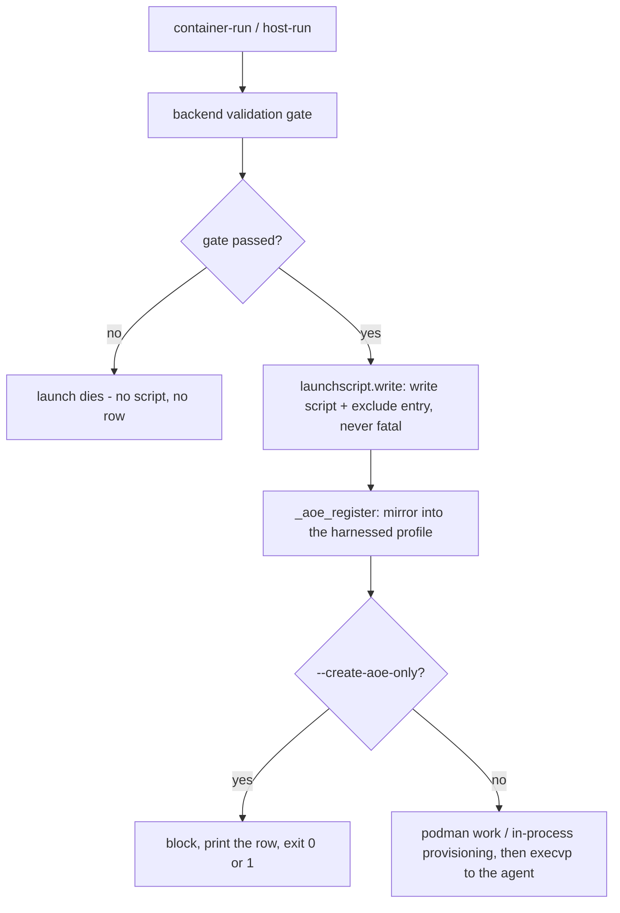
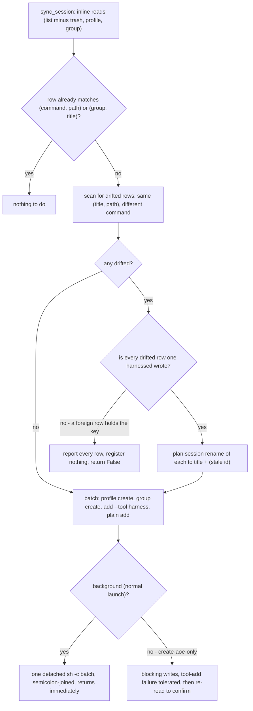
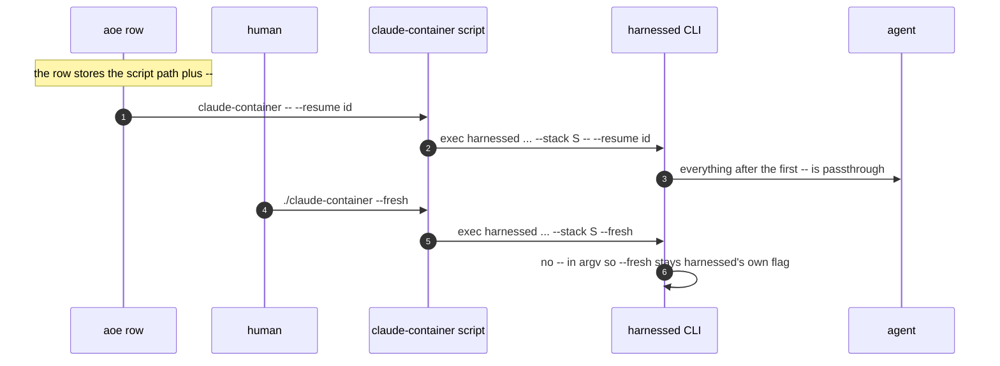

# Agent of Empires mirror and per-project launch scripts

A launch leaves two records behind, and they are one mechanism:

- a **launcher script** in the project folder — `<harness>-<verb>` (e.g. `claude-container`) —
  that replays the launch when run (`src/harnessed/launchscript.py`);
- an **aoe row** in the `harnessed` profile of Agent of Empires, a tmux session coordinator some
  users run in front of their agents (`src/harnessed/aoe.py`).

The interlock is the point: the aoe row's recorded command *is* the launcher script (invoked as
`<script> --`), so the dashboard bookmark and the file you `cat` can never disagree about what a
launch was. `src/harnessed/aoe.py` is the whole bridge; `launchscript.write` and
`launcher._aoe_register` are the two call sites, both invoked by `container-run` and `host-run`,
both after the backend's last validation gate.

Related: [invariants](/openwiki/concepts/invariants.md),
[container run](/openwiki/workflows/container-run.md),
[host run](/openwiki/workflows/host-run.md),
[dynamic stacks](/openwiki/workflows/dynamic-stacks.md).

## The contract: optional, one-way, register-only, never fatal

harnessed **neither requires nor installs aoe**. When aoe is installed (`aoe` on PATH *and*
`~/.config/agent-of-empires/` present — a stray binary alone is not "runs aoe"), every launch
mirrors itself into a dedicated `harnessed` aoe profile: one group per git repo, one session per
launch. Everything the bridge does is scoped to that profile, so a user's own sessions in
aoe's `default` profile are never touched, reordered, or removed. `HARNESSED_NO_AOE=1` turns the
whole thing off for someone who has aoe installed but does not want harnessed near it.

Three properties define the contract, and every line of `aoe.py` is shaped by them:

1. **Register-only, one-way.** harnessed still owns the process: a run verb ends in an
   `os.execvp` that hands the terminal to the agent. The row is a *bookmark* that can be started
   or attached from the aoe dashboard later; aoe never drives harnessed.
2. **Sessions stay in aoe's terminal (raw tmux/PTY) view.** aoe's structured view drives an agent
   over ACP, which cannot reach through the `podman exec -it` attach the container backend uses —
   the attach shell whose per-harness tail is built in `src/harnessed/attachcmd.py` and handed to
   `podman exec -it … bash -l -c`. `aoe add` already defaults to the terminal view, so the bridge
   passes *no view flag at all* — there is no flag to request the default, and an invented one is
   an unknown argument (below).
3. **Never fail a launch.** aoe being absent, broken, slow, or a version that renamed a flag must
   all degrade to silence. Every subprocess call is timeout-bounded (`_READ_TIMEOUT = 10`,
   `_WRITE_TIMEOUT = 120`), `check=False`, and wrapped; every public entry point
   (`sync_session`, `forget_stack`) swallows everything, including exceptions from the caller's
   own drift reporter.

## Where registration happens in a launch

Both run verbs call `launchscript.write` and then `_aoe_register`, and the placement is
load-bearing in both directions:

- **After the backend's last validation gate.** On `container-run` that is the `is_built` check
  plus `staleness.check_profile_fresh`; on `host-run` it is the in-process `assemble()` (the
  analogue of those checks — sub-second, emit-only, no podman). A row registered earlier becomes a
  bookmark for a launch that died on a renamed recipe — a row that fails identically every time it
  is started from the dashboard.
- **Before the podman work.** The row exists even if the container half goes wrong.
- **Script before row.** `_aoe_register` exits under `--create-aoe-only`, and the row's command
  names the script; writing the script afterwards would leave a row pointing at a file that does
  not exist — the same dead-on-arrival class the validation-gate ordering avoids.
- **Before `--create-aoe-only` exits**, because registering *is* that command (below).



*Placement on both verbs: the script and the row are written back-to-back after the last gate
that can kill the launch, and before everything that can fail for unrelated reasons.*

`--create-aoe-only` is the exception to the passive mirror: it registers the session and exits
without launching, so it **blocks**, prints the row (title, profile, group, command), and exits
non-zero if registration fails. It costs one assembly on the host path (sub-second) and, on
`container-run`, a `--recipe` set is still minted **and built** — the row replays
`container-run`, which hard-errors without an assembled profile, so skipping the build would
create a row that is dead on arrival. Because `_aoe_register` ends a successful
`--create-aoe-only` with `typer.Exit(0)`, the CLI wrappers must **not** treat a zero exit as
failure cleanup: deleting the manifest the invocation just minted would manufacture exactly the
dead row the build-ahead avoids.

## Reads inline, writes detached

Measured against live aoe: `list --json`, `group list` and `profile list` return in ~0.01s, but
`aoe add` takes ~12s because it brings aoe's daemon up. A dashboard is not worth twelve seconds of
a launch, so the split is by cost:

- the **reads** that decide *whether* to write (is there already a row? is the profile there? is
  the group there? which rows would silently collide?) run **inline**;
- the **writes** are fired into a detached child (`subprocess.Popen` with `start_new_session=True`)
  that survives the `os.execvp` which replaces harnessed moments later — without its own session,
  the slow `aoe add` would be killed mid-write. Output goes nowhere: a detached child has no
  terminal, and its failures are not the launch's problem.

Two deliberate details of the detached batch:

- The commands are sequenced through one `sh -c` **joined with a semicolon, never `&&`**. Both
  `aoe profile create` and `aoe group create` exit 1 when the thing already exists, and the reads
  that built the batch are not atomic with it — two launches starting together can both observe a
  missing profile and both try to create it. Under `&&` the loser's chain aborts on that benign
  "already exists" and its session is never added; under `;` it proceeds and registers. The failure
  `&&` would guard against — aoe being down — already produces no row either way.
- The only **blocking** path is `--create-aoe-only`, where the user is explicitly waiting and is
  entitled to the exit status. There, success is decided by **re-reading** the session list rather
  than by trusting the `add`'s exit code: aoe 1.13.2 refused a duplicate with exit 0 while 1.14.1
  exits 1, so under exit-code reading every successfully labelled row on 1.14.1 would report
  "could not register" while sitting in the dashboard. The row is there or it is not.

## What a row records

| property | value | why |
| --- | --- | --- |
| recorded command | `<project>/<harness>-<verb> --` (absolute path) | the launcher script carries the flags, so the string stays stable across launches |
| identity (harnessed's match key) | (recorded command, resolved project path) — or (group, title) when both overrides are given | the script *name* carries harness and verb: a stack has an assembled profile per harness, and host-native vs containerized are two different things to run. The stack and the MCP mode are NOT in the key — they live in the script the row points at |
| identity (aoe's accept key) | (title, path), duplicate refused at **exit 0** | the two-key hazard below |
| group | the git **common dir**'s repo name, or `--aoe-group` | every worktree of one checkout shares a group instead of each spawning its own |
| title | `<harness>/<backend> <folder> <composed recipes>[ +open-mcp]`, or `--aoe-title` | must be injective over everything harnessed treats as identity (below) |
| skipped | the `default` stack, unless `--aoe-group`/`--aoe-title` name the row | the baseline every dynamic stack extends is not something the user composed |
| removed by | `harnessed rm <stack>` (container verb only) | `rm` tears down containers; a host-native session owns none |

Because the key is the script's path, a project holds **one row per harness+verb**: relaunching the
same folder against a *different* stack (or with `--no-strict-mcp-config`) finds the existing row on
(command, path) and returns without adding one, while `launchscript.write` has just rewritten the
script it points at. The row starts whatever the last launch wrote; its derived title can lag behind
that content, because a matched row is never retitled — and aoe offers no verb that rewrites a
session's stored command anyway. This is exactly why `harnessed rm` attributes rows by reading the
script rather than the command (see "Cleanup: `harnessed rm`" below).

`aoe.command_for` builds the full harnessed invocation stored inside the script's exec line: the
**resolved** stack name (a `--recipe` set is minted before this runs, so a row records the same
canonical shape whether the user typed `--stack` or a recipe list), the echoed
`--aoe-group`/`--aoe-title` overrides, `--no-strict-mcp-config` when set, and a trailing `--`.
`aoe.replay_command` builds the row's command instead: the absolute script path plus `--`.
Absolute, not `./claude-container`, because whether aoe sets the working directory to the row's
path is aoe's business; an absolute path is correct under either behavior.

### The two keys are not the same key — the drift hazard

harnessed decides whether to write by matching **(command, path)**; aoe decides whether to accept
by matching **(title, path)** and refuses a duplicate at **exit status zero**. A row that agrees
on aoe's key but not ours is invisible to our check and silently eats the `add` — forever, since
the write is detached and never examined: the row keeps replaying whatever command it was first
registered with, with no signal anywhere. This asymmetry, not the registration itself, is why
`sync_session` is shaped the way it is:

1. Before any `add`, `_drifted_rows` scans the session list for **every** row holding (title,
   path) with a different command — all of them, not just the first, because an externally edited
   store or a half-landed repair can leave two.
2. Each drifted row is reported through the `on_drift` callback (the launcher escapes it past
   rich and prints a warning). A row is repaired **only when its stored command is a shape this
   module emits** (`_is_ours`); a foreign row is reported with the exact `aoe session rename`
   command to run by hand.
3. **One row we may not touch blocks the registration outright** — it keeps the (title, path) key
   whatever we do to its neighbours, so the `add` cannot land. Verdicts are decided for every row
   *before* any is reported: announcing a rename for an owned row and then writing nothing when a
   later row blocks is the exact failure mode this ordering removes.
4. `_same_title` compares the way aoe's own dedupe does — trimmed at the ends, case- and
   inner-whitespace-sensitive — so precisely the rows aoe would refuse cannot slip past the scan.



*`sync_session`'s decision flow: drift is discovered before anything is written, and repair only
happens when the key can actually be freed.*

### Repair is a rename, not remove-then-add

aoe has no verb that rewrites a session's stored command (`session rename` changes only the
title), and the obvious repair does not work: `aoe remove` only moves the row to the **trash**, a
trashed row is still returned by `aoe list --json` with no field to filter on, and it still holds
the (title, path) key — so the replacement `add` is refused at exit 0 exactly like the first one,
and the row is lost with nothing in its place. `aoe session rename` frees the key without
destroying anything: the stale row survives beside the corrected one, keeping its id, resume
target and flags. `--purge` would also work and is rejected on purpose — it is irreversible, and
this runs unattended on a launch. The rename target is `<title> (stale <session id>)`; the row id
in the suffix is what makes a collision with anything — including a second `(stale)` row from an
earlier repair — impossible, since a colliding rename would fail silently on the detached path.

The drift message says **"renaming it to …"**, present tense, deliberately: on a launch the batch
is fired detached and its outcome is never examined, so claiming the rename *happened* would
assert something the process cannot know. Only `--create-aoe-only` blocks long enough to find
out — and its three failure messages distinguish "the repair failed part-way (the row may already
have been renamed aside)" from "left the existing row as it is" from "could not register (is aoe
installed?)", because sending a user to inspect the wrong row is worse than no message.

### `--no-strict-mcp-config` is carried by the script, and named by the title

It is the one launch flag that changes the *session* rather than the invocation: dropped, claude
also loads the project's `.mcp.json` and the user's config, so a replay that forgets it restarts
with a **different MCP surface** than the one registered. `--rm`, `--fresh` and the pod flags
describe this invocation's lifecycle and are correctly re-decided by a restart — they are not
recorded.

The flag is echoed into the script's exec line — which is what a dashboard restart actually
executes — so the replayed launch keeps the surface it was registered with. And because identity
the title cannot express is identity aoe discards, the derived title gains a
**` +open-mcp`** suffix in that mode; strict titles are unchanged. Without the distinction, the
strict and open-MCP variants of one stack share a title, and wherever a strict-mode row already
holds that (title, path) — a drifted row, or one sitting in aoe's trash, which still holds the key
— the `add` is refused at exit 0 and the row keeps replaying the command it was first registered
with: the flag would appear to be ignored. A row adopted by `--aoe-group` + `--aoe-title` is left
exactly as it is — the adopt path never examines the stored command — and must be renamed/removed
by hand to pick the flag up.

### `--aoe-group` / `--aoe-title`: overrides, and the only way to adopt a row

Both flags exist on both run verbs. Given **together** they replace the identity key with
(group, title) — the only match that can find a row harnessed did not write: a hand-placed or
hand-edited row records the path as typed and carries flags `command_for` does not emit, so under
command matching it is invisible and a duplicate lands beside it. Either flag alone still
overrides its half of the placement but leaves matching on the command — a group holds many
sessions and a title is unique only within one, so neither alone identifies a row. Either one
also overrules the `default`-stack skip: the skip suppresses a row the user never asked for, and
naming a row is stating that this one is wanted. Both overrides (and the MCP flag) are **echoed
back into the invocation the script carries**, or a restart from the dashboard would re-derive the
placement and produce the duplicate the flags exist to prevent.

The derived title itself — `<harness>/<backend> <folder> <stack-delta>[ +open-mcp]` — carries
three hard-won invariants:

- **The backend is in the title.** aoe dedupes on (title, path), so the title must be injective
  over everything harnessed treats as identity. With the backend omitted, `host-run`
  registrations silently vanished behind their `container-run` twin: same path, same stack, same
  harness, differing only in the verb.
- **The folder stays.** When both overrides are supplied, `_registered` matches (group, title)
  with *no* path check, and the derived group keys on the git common dir — so every worktree of
  one checkout shares a group. Drop the folder and two worktrees running the same stack, harness
  and backend collide on that key: the second launch reads as already-registered and never gets a
  row, silently.
- **The stack is shown as its delta over the baseline.** A dynamic stack's name restates
  `default.` on every row, so the title shows the composed recipes (joined with `+`, because
  recipe names contain `-` themselves), read from the raw generated manifest — never from
  `load_stack`, whose `extends:` resolution would merge the baseline's recipes back in, and never
  by parsing the name, whose digest suffix makes the join lossy. An authored stack falls back to
  its own name.

## The flags `aoe add` is given

`aoe add` is a clap CLI: an unrecognised flag is not ignored, it **exits 2 before adding
anything** — and on the detached write path that failure is invisible (the child dies, the
dashboard just stays empty). `--no-cockpit` was exactly such a flag, and it silently cost every
registration until `--create-aoe-only` surfaced it. So the bridge passes only what aoe is known to
accept: `-p`, `-g`, `-t`, `--cmd-override`, and `--tool`.

- **`--cmd-override`, never `--cmd`.** `--cmd` is validated against aoe's own tool list and
  *silently substituted* with the configured default — a harnessed invocation came back stored as
  `claude-with-env`, losing both the replay and the identity key. `--cmd-override` stores the
  string verbatim and accepts harnesses aoe has no notion of (`omp`).
- **`--tool <harness>`, attempted then retried without.** `--cmd-override` sets the command but
  leaves aoe's recorded tool at its default, so an omp row was stored as a claude one — and aoe's
  restart appends **claude's** resume flags, which (thanks to the trailing `--`) sail past
  harnessed's parser onto the omp binary, which rejects a claude session id; the pane dies, aoe
  respawns it, and it loops. `--tool` makes aoe generate the flags of the agent actually there.
  The retry is load-bearing: aoe validates `--tool` against the *invoking process's* PATH, but a
  container harness lives in the pod and even a host one can be missed (omp through a mise install
  dir that is on the shell's PATH, not a daemon's) — a rejection must cost the label, not the row.
  On the blocking path the labelled add's non-zero exit is an expected outcome (`optional` in
  `_apply`), and the plain retry is refused as a duplicate title+path without touching the stored
  tool when the labelled one won.

## The launcher script

`launchscript.write` leaves `<harness>-<verb>` in the project folder — `claude-host` /
`claude-container`. The verb is in the **filename** rather than a flag, so the two backends cannot
collide in one folder and an aoe row cannot restart a backend it does not name. It is the *only*
file harnessed puts in a project — the `mise.local.toml` alternative was removed precisely because
a mise config file re-prompts for trust in every new worktree and can carry `_.source`, so
trusting one grants code execution; a script needs no trust decision because nothing but the user
executes it. The file it writes:

```sh
#!/bin/sh
# harnessed:launcher v1
# as typed: harnessed container-run claude . --stack my-stack
exec harnessed container-run claude /abs/project --stack my-stack "$@"
```

**Never fatal.** Every failure path returns `None` and the launch proceeds — inherited from the
`lastrun`/`--last` record this file replaced: a launch that got this far has already done the
useful work, and losing the shortcut is not worth killing it.

### The trailing `--` lives on the aoe row, not in the file

The script ends with `"$@"`, and the separator lives on the **row**
(`replay_command` → `<script> --`). aoe's `auto_resume_on_restart` appends the recorded tool's
resume flags to the row's command when it restarts a session, and those have to reach the *agent*
past harnessed's own option parsing (`_extract_passthrough` splits argv at the first standalone
`--` and forwards everything after it). Put the separator in the file instead and the failure
inverts: a human's `./claude-container --fresh` would sail past harnessed too and reach the agent
— flags silently swallowed, no error anywhere.



*The separator arrives as the script's own argument: aoe's resume flags land on the agent, a
human's flag lands on harnessed.*

The same stability argument is why the flags live in the *script* and the row's command is just
`<script> --`: the recorded string stays identical across launches, so a flag added to
`command_for` is free rather than a re-keying of every existing row — and "which stack does this
row start" is answered by reading the script itself (`aoe._replays_stack` parses the `exec`
statement for the `--stack <name>` pair during `harnessed rm`), not by a side record that could
drift from the file that actually runs.

### The sentinel licence, and the two refusals

`# harnessed:launcher v1` on line 2 is the licence to overwrite. `write` replaces only a **regular
file** that carries the sentinel; anything else in the way is refused and the launch proceeds
without its shortcut:

- **Not a regular file → refuse before opening.** A FIFO passes `exists()` and *blocks* on open
  until a writer appears; `except OSError` cannot catch a hang, so the check is "what is it",
  not "can I read it". This also never clobbers a directory or socket somebody put there on
  purpose.
- **Git-tracked → refuse even with the sentinel.** Committing a generated launcher is a choice a
  repo is allowed to make, and rewriting it on every launch would produce a dirty tree nobody
  asked for (`git ls-files --error-unmatch` under a 5s timeout).

### Quoting is `command_for`'s, never re-implemented

The exec line is `aoe.command_for`'s output with the trailing `--` popped (defensively, so a
future change there cannot silently leave a separator in the script), re-joined with `shlex.join`.
A hostile `--aoe-title` value is therefore escaped by the same quoting the aoe row already relies
on; a second implementation of the escaping rule in launchscript would be the shape that drifts.

### The `# as typed:` provenance line

The invocation as the user typed it is recorded as a comment — display only, never executed — and
is the one place user argv reaches a file, so it is bounded: capped at 2048 bytes and marked
`... (truncated)` when cut (argv is bounded only by `ARG_MAX`; a megabyte comment is not a
security problem, but it is an unbounded write into somebody's repo), and filtered to printable
characters plus tab first — a newline would close the comment and let the next line *execute*,
which is the one way a display-only field becomes code. `launcher._typed_invocation` refuses to
emit a line that would lie: no line at all when the process never went through `main` (a
`CliRunner` test would otherwise emit the bare word `harnessed`, which reads as a real launch) or
when the recorded argv names a different verb than the launch being written. A provenance comment
that misreports the launch beneath it is worse than no comment.

### The git exclude entry

The script is added once to the git **common dir**'s `info/exclude` — one file shared by every
worktree of the checkout, so it is written once and covers all of them, and needs no trust
decision because nothing but the user executes the file. Details that matter:

- **Root-anchored pattern** (`/claude-host`), derived from `git rev-parse --show-toplevel`.
  `info/exclude` lives in the common dir, but git matches its patterns against the top of
  whichever working tree it is processing — so a root-anchored pattern written from one worktree
  covers the same-named file at every sibling worktree's root, while a pattern anchored from the
  common dir's parent would match in none of them. Fails **closed**: no pattern rather than a
  wrong one, because a wrong pattern in a file every worktree shares is worse than no entry.
- **Idempotent by exact-line match** — ten launches leave one line. Past a 1 MiB read bound the
  entry is **skipped** rather than appended blind: past the cap the membership check cannot be
  trusted, and a duplicate per launch would corrupt a shared file.
- A non-git folder has no exclude file and gets no warning.

### Reading files the way the shell does

Every read of shell-script-shaped content here goes through `_read_as_the_shell_does`:
`newline=""` and `split("\n")` at the call sites. Python's default universal-newline mode
translates a lone `\r` inside a quoted value into `\n` on read — inventing a line break the shell
will never act on — and `str.splitlines()` additionally breaks on `\x0b \x0c \x1c \x1d \x1e \x85
\u2028 \u2029` where `/bin/sh` breaks on `\n` alone. A caller that gets this wrong reads a
different script than the one that runs: a shifted sentinel check, an unattributable aoe row.
All reads are bounded (sentinel check 4 KiB, launcher-script read 64 KiB, exclude 1 MiB) because
the never-raises contract is unconditional and `MemoryError` is not an `OSError`; `aoe._replays_stack`
bounds the same call for the same reason, and checks `is_file()` before opening because a row's
path comes out of aoe's JSON and can point at a FIFO that would block an unattended `harnessed rm`.

## Cleanup: `harnessed rm`

`harnessed rm <stack>` tears down the stack's containers, then calls `aoe.forget_stack` —
**container verb only**: `rm` never touches host-native sessions, which own no container. Rows are
removed **by session id, not title** (a user-renamed row still matches; `--aoe-title` would
otherwise let a titled row escape cleanup and a coincidentally-titled foreign row be caught by
it). Two command shapes match, because the stack is no longer in the recorded command:

- the raw `harnessed <verb> ... --stack <name> --` shape, matched on the `--stack`/name *pair*
  (its position varies with whether a project path was recorded);
- launcher-script rows, whose stack is read out of the script the row points at
  (`_replays_stack`: verb must agree, the `exec` statement is taken from the first `exec ` to the
  **end of the file** because a quoted flag value may span lines, and the whole thing is
  `.get`-guarded because aoe's JSON is not harnessed's schema).

A replay row whose record is missing or names another stack is **left alone**: removing rows
harnessed cannot positively attribute to this stack is the one failure mode worse than leaving a
stale one, because `rm` is destructive and unattended.

## Operations and verification

- **Enable/disable:** install aoe and run `aoe` once (the config dir must exist); `HARNESSED_NO_AOE=1`
  opts a machine out while aoe stays installed.
- **Presets without launching:** `--create-aoe-only` on either verb registers the row and exits —
  on `container-run` it still builds a minted recipe set; a row for an unbuilt stack would be dead
  on arrival.
- **Manual drift fix:** when a foreign row holds a (title, path) key,
  `aoe session rename <id> -t '<any other title>' -p harnessed` frees it; the drift warning prints
  exactly this.
- **Test posture:** the aoe behaviour the bridge depends on is not in any contract harnessed
  controls, so it was verified against live aoe (1.13.2 and 1.14.1 — trash visibility, trimmed
  title dedupe, `--cmd` substitution, exit-code drift between versions). The hermetic suite and
  CI deliberately do **not** provision aoe: its tests are reported as skipped and never fail a
  run — a declared choice, not a gap.
