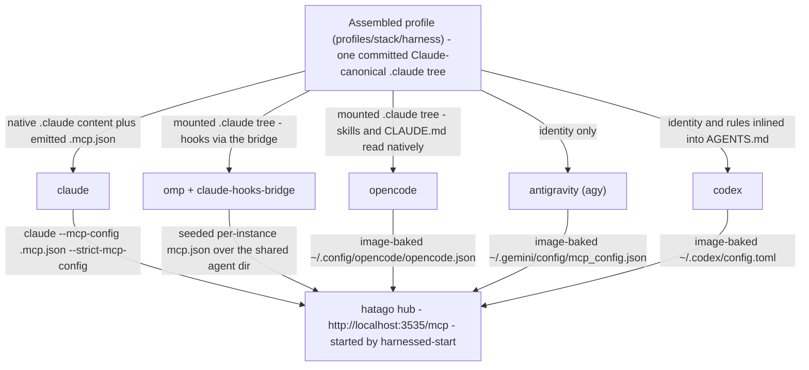
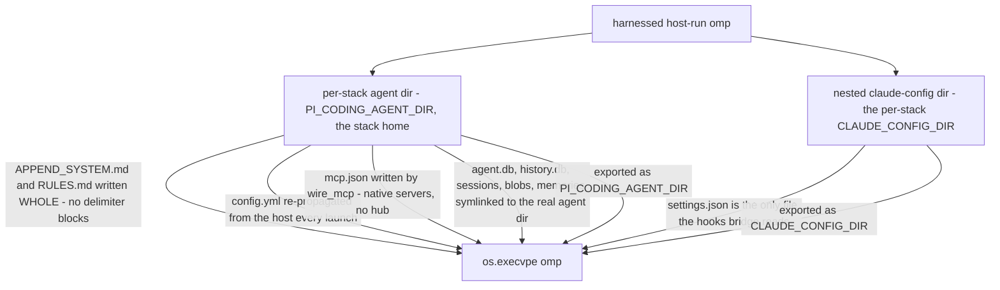

# Harness integrations: one canonical profile, five readers

harnessed supports five coding-agent harnesses — **claude**, **omp** (Oh My Pi), **opencode**,
**antigravity** (`agy`, Google), and **codex** (OpenAI) — and supports them through one
deliberate asymmetry: there is exactly **one** profile format and **five** ways of reading it.
`schema.HARNESS_CONFIG_DIR` maps every harness name to the same config directory, `.claude`:
recipes are authored against Claude's format, the assembler emits one Claude-canonical profile
per `(stack, harness)`, and no harness gets a re-authored variant. What differs per harness is
*how* it reads that profile and *how* it reaches the hatago MCP hub.

Related: [backends](/openwiki/architecture/backends.md),
[architecture overview](/openwiki/architecture/overview.md),
[invariants](/openwiki/concepts/invariants.md),
[container launch](/openwiki/workflows/container-run.md),
[host launch](/openwiki/workflows/host-run.md).



*One profile, five readers, five routes to the same hub. Only claude's route is emitted per
stack; every other harness carries its MCP wiring baked into its image (or, for omp, in a
read-only seed mount over its shared agent dir).*

## The canonical profile and its consumers

`HARNESS_CONFIG_DIR` is the contract in one table (`src/harnessed/schema.py`). The rows below
are that dict's contents at the time of writing — **the dict is the single authority**, and the
table is a reading of it, not a second list to maintain. Adding a harness means adding one key
there; every validator (`_require_supported_harness`, `_parse_harnesses`,
`_parse_hooks_skip_harnesses`), every error message that prints "supported: …", and the verbs
follow from the dict's keys with no other edit.

| harness | config dir | reads the profile how | reaches hatago how |
|---|---|---|---|
| `claude` | `.claude` | natively (skills/commands/agents/CLAUDE.md + settings.json) | emitted `.mcp.json` → `--mcp-config` |
| `omp` | `.claude` | content tree via the mounted config volume; hooks via the pre-installed claude-hooks-bridge | seeded `mcp.json` over the shared `~/.omp/agent` |
| `opencode` | `.claude` | `.claude/skills/**/SKILL.md` + `~/.claude/CLAUDE.md` natively; ignores `.mcp.json` | image-baked `~/.config/opencode/opencode.json` |
| `antigravity` | `.claude` | **not** natively — identity only (`.gemini/GEMINI.md` + `settings.json`) | image-baked `~/.gemini/config/mcp_config.json` (`serverUrl`) |
| `codex` | `.claude` | **not** natively — reads `AGENTS.md` + its own `~/.codex/prompts` | image-baked `~/.codex/config.toml` (`[mcp_servers.hatago] url`) |

One gate worth knowing lives in the container mount set: the composed `.claude` config volume is
mounted only for **claude, omp and opencode** — the three harnesses that actually read that tree.
Antigravity and codex receive only their harness-native identity files, mounted `:ro` when
present; the baked Dockerfile comments calling the profile "mounted for parity" describe an older
mount set, not the current gate.

The harness is a **run-time positional** (`harnessed container-run <harness> [path]`, and the
same grammar on `host-run`), never a stack field; a stack may not even be *named* after a
harness, and `harnesses:` on a stack is only a build-time convenience listing what
`harnessed build <stack>` should build. Anything that accepts a harness name — the verbs,
`hooks.skip_harnesses`, `only_harnesses` — validates against `HARNESS_CONFIG_DIR` at
parse/load time, so a typo like `ompp` fails with a list of valid names instead of silently
doing nothing.

Profile emission is per harness (`profiles/<stack>/<harness>/`) because the identity *surface*
differs even though the content tree does not (`assemble.py`):

- **claude** — stack `instructions:` → `.claude/CLAUDE.md`; recipe rules stay as separate
  `.claude/rules/*.md` files.
- **omp** — identity → `APPEND_SYSTEM.md`, rules → `RULES.md`, written as delimiter-marked
  per-stack blocks in the shared host `~/.omp/agent` (container path only; see
  [omp's host asymmetries](#omps-host-asymmetries) for why the host path is different).
- **codex** — identity **and** every recipe rule concatenated into the single `.codex/AGENTS.md`
  codex reads, because codex has no directory-rules primitive.
- **antigravity** — identity → `.gemini/GEMINI.md` plus a fresh `settings.json` whose
  `context.fileName` is the absolute in-container identity path (agy never mounts or merges
  this file, so it is written whole, unlike claude's settings floor).
- **opencode** — wired *post-build* by the launcher, because opencode reads its config from the
  image-baked `opencode.json`, not from the profile (below).

## The MCP layer: one hub, one emitted config

The hatago hub is a single Streamable-HTTP endpoint — `http://localhost:<HATAGO_PORT or
3535>/mcp` — baked into `harnessed-base`. The container entrypoint `harnessed-start` starts it
in the background only when a `hatago.config.json` was mounted **and** `HATAGO_TRANSPORT=http`;
under `stdio` the harness spawns its own hub (which is what makes OAuth children authorizable),
and under `none` — every declared server `direct:` — no hub exists anywhere. The launcher
passes `HATAGO_TRANSPORT` explicitly from `Stack.hub_transport` so the emitter, launcher and
entrypoint can never disagree about whether a hub exists.

**Only claude's hub wiring is emitted per stack.** `HUB_TRANSPORT_EMITTED_HARNESSES` is exactly
`{"claude"}`, and that single-entry list carries a lot of weight:

- `emit.write_mcp_json` writes the harness `.mcp.json` naming the hatago entry (or, under
  `stdio`, a `command`/`args` entry so the harness spawns the hub itself) plus any `direct:`
  servers as additional entries. A direct server named `hatago` is a schema error — the key is
  reserved even in the all-direct branch, so a stack's validity can never depend on a second
  recipe.
- `_validate_direct_servers` and `_validate_hub_transport` fail the build for any other
  harness: a `direct:` server declared for codex or omp would be excluded from
  `hatago.config.json` *and* absent from the config harnessed does not emit — the recipe would
  read as if the server were configured while the harness never learned of it. Failing the
  build names the problem; the alternative names nothing at all.

### The direct-server rule, re-validated at launch

`container-run` **never assembles**. It launches a previously-built image and reads the recipes
live, so the assembler's guard has never run on that path. An image built *before* a recipe
gained `direct:` would therefore reach launch with servers the harness will never see — excluded
from `hatago.config.json` by `direct`, outside the only emitted MCP config, and, once every
server is direct, with `HATAGO_TRANSPORT=none` stopping the hub as well. An omp or codex stack
in that state comes up **silently toolless**.

So `container_run` re-validates the same rule at launch (`_validate_direct_servers` on the
launch-resolved server set), turning that state into a clear error. CodeRabbit's suggested
remedy on #381 — routing the direct entries into omp's config — was **explicitly rejected**:
it would undo the deliberate decision that only claude's MCP config is emitted per stack, and
quietly give every harness a second emitted-config surface to keep in sync.

## Per-harness routes in detail

### claude — the native reader

claude gets the profile's `.claude/*` content tree (composed into one volume — never a covering
mount) and the emitted `.mcp.json` at `$CONTAINER_HOME/.mcp.json`. The attach command is
`claude --mcp-config '{mcp_cfg}'{strict}` where `{strict}` is ` --strict-mcp-config` by
default: strict makes claude load **only** that file, so nothing host- or account-synced leaks
into an isolated stack — even with zero servers, the file is written (as an empty set) for
exactly this reason. `--no-strict-mcp-config` drops the switch and opts back into the project's
own `.mcp.json` and the user config.

### omp — the bridged reader

The omp image pre-installs the **claude-hooks-bridge** extension (pinned
`@drmikecrowe/omp-claude-hooks-bridge@0.5.0`), an `~/.omp/plugins` module that maps Claude-shaped
hooks onto omp's own events at runtime: 0.4.0 injects a bridged hook's SessionStart stdout /
UserPromptSubmit context instead of discarding it, 0.4.1 returns a PreToolUse hook's
`updatedInput` so command-rewriting hooks work, 0.5.0 bridges PreCompact. The bridge covers
hooks **only** — it has no skills, commands or agents path.

The container path binds the host's `~/.omp/agent` **rw** into every omp pod (auth `agent.db`,
usage ledger, sessions are shared by construction, not isolated — see
[invariants](/openwiki/concepts/invariants.md)) and runs plain `omp`, never `--profile`, which
would point omp at an isolated empty store that ignores the mount. Because omp has **no**
`--mcp-config` flag and reads MCP servers only from `~/.omp/agent/mcp.json`,
`_omp_mcp_seed_mount` generates a per-instance file — the host file's contents plus a `hatago`
HTTP entry — and mounts it **ro over** the shared one (the more-specific mount wins inside the
rw dir mount). omp reaches hatago; the host's own mcp.json is never mutated, and it is
regenerated every launch so host edits propagate. One neighbouring seed does the same job for
`config.yml`: `_omp_config_seed_mount` shadows the host config **only** when it still names the
retired local-dev bridge path (`~/…/omp-extensions/claude-hooks-bridge`), which inside the pod
would expand `~` to `/home/harnessed` and warn about a missing module — mounting a copy with
just that obsolete entry removed keeps the image-installed plugin from loading twice.

In the container the bridge's `CLAUDE_CONFIG_DIR || ~/.claude` fallback lands on the mounted
config volume, so the stack's hooks just work. Host-side there is no mount — see
[the nested claude-config dir](#the-nested-claude-config-dir).

### opencode — reads skills, ignores .mcp.json

opencode natively reads `.claude/skills/**/SKILL.md` and `~/.claude/CLAUDE.md` but **ignores**
`.mcp.json`; its MCP route is the image-baked `~/.config/opencode/opencode.json`, whose
`mcp.hatago` block names the fixed hub endpoint. When a stack ships `instructions:`, the
launcher's post-build `_merge_baked_opencode` reads that baked config out of the image, adds a
custom persona agent (`agent.<name>.prompt` → a persona prompt file in the profile) and appends
a `.claude/rules/*.md` glob to `instructions[]`, then writes the merged config into the profile
where the mount set overrides the image path. The baked `mcp.hatago` block is carried through
verbatim; harnessed only adds. The agent name comes from `emit.opencode_agent_name(stack)` —
the single source shared by the config key, the prompt file, and the attach command.

### antigravity — identity only, keyring auth

`agy` is gemini-cli-derived: it reads `~/.gemini/`, not `.claude/`, and consumes no Claude
skills or commands. Its MCP route is the baked global `~/.gemini/config/mcp_config.json` with
agy's remote-server key `serverUrl` pointing at the hub. Stack identity is delivered in agy's
own shape (`.gemini/GEMINI.md` + `context.fileName`, mounted `:ro` only when present). agy
authenticates via Google OAuth into the OS keyring, so its attach shell starts dbus +
gnome-keyring inline and a persistent per-instance keyring store lets one interactive login
survive recreates (`--fresh` clears it).

### codex — config.toml, one memory doc

codex 0.139+ speaks Streamable-HTTP natively, so its MCP route is the baked
`~/.codex/config.toml`:

```toml
[mcp_servers.hatago]
url = "http://localhost:3535/mcp"
```

It does not read Claude skills or commands. Because it also has no directory-rules primitive,
the assembler inlines everything into the one memory doc it does read:
`.codex/AGENTS.md` = the stack's `instructions:` identity, then every fanned
`.claude/rules/*.md` body under a `## Rule: <label>` header. Identity and rules share one file,
and codex silently truncates AGENTS.md at `project_doc_max_bytes` (32 KiB), so the emitter
truncates *itself* — under the cap, with a visible marker and a warning — rather than let codex
cut mid-rule.

## Host mode: the harness record and its lever

Container mode mounts the profile over the harness's config dir. Host mode has nothing to
mount over — and it is claude-and-omp only, by construction:

```python
_HOST_HARNESSES: dict[str, HostHarness] = {
    "claude": HostHarness(
        config_dir_var="CLAUDE_CONFIG_DIR", argv0="claude",
        share_state=_share_host_claude_state,
    ),
    "omp": HostHarness(
        config_dir_var="PI_CODING_AGENT_DIR", argv0="omp",
        share_state=_share_host_omp_state,
    ),
}
```

The membership rule is mechanical: **a harness qualifies only if it exposes an env var whose
value *is* a per-stack config/agent dir** — one lever that moves the harness's whole user-level
surface. That lever is each row's `config_dir_var`; `argv0` is the binary; `share_state` wires
the per-stack dir back to the harness's live host dir. Materializing is deliberately *not* a
record field: the two harnesses lay down different directory shapes, so `_host_launch_plan`
branches once, explicitly.

codex, opencode and antigravity are absent because their rows are **unestablished** — no
equivalent per-stack config-dir lever has been established for them — not because host mode is
claude-shaped. Adding one is filling in a row. And the harness argument is **spelled out rather
than defaulted** because `path` is the second positional: a defaulted harness would make
`host-run .` bind `.` as the harness. (In the actual grammar the harness **leads** —
`harnessed host-run <harness> [path]` — precisely so the path positional stays unambiguous.)

### What each host harness deliberately shares back

`share_state` is the host analog of the container bind-mounts, and the set is established per
harness, not carried by analogy:

- **claude** symlinks `.credentials.json` (with the replace-on-refresh hazard and its rescue)
  and the session-state dirs (`projects`, `file-history`, `todos`, `tasks`, `session-env`,
  `shell-snapshots`); the `.claude.json` account snapshot is **copied** so onboarding is
  skipped without leaking the stack's writes back into global claude state. Config content
  (skills/commands/rules/CLAUDE.md/settings) stays per-stack.
- **omp** symlinks `agent.db` (auth **and** the usage ledger — the thing that makes "one login,
  one usage history" true), `history.db`, `sessions/`, `blobs/` (sessions reference it), and
  `memories/`. Everything else — config.yml, settings.json, RULES.md, APPEND_SYSTEM.md,
  mcp.json, managed-skills, terminal-sessions, models.db — stays per-stack. No credential
  rescue exists for omp because none is needed: SQLite rewrites `agent.db` **in place**, so the
  symlink never becomes a stale regular file the way claude's `.credentials.json` link can.

### The config-dir variables, pinned for catalog-authored scripts

`hostrun._HARNESS_CONFIG_DIR_ENV` pins the same levers wherever catalog-authored content runs
host-side (installs, setup scripts, the `setup.condition` eval), applied **last**:

| harness | variable | points at |
|---|---|---|
| `claude` | `CLAUDE_CONFIG_DIR` | the stack home |
| `omp` | `PI_CODING_AGENT_DIR` | the stack home (the agent dir) |
| `omp` | `CLAUDE_CONFIG_DIR` | the **nested** bridge dir (`<agent dir>/claude-config`) |

Pinned rather than unset, deliberately: an upstream installer that honours one of these beats
every redirection harnessed invents, and unsetting would send it to `$HOME/.claude` — the
user's *real* config dir, a worse landing spot than the parent stack's. The failure it prevents
is measured (bd harnessed-8px.26): an inherited `CLAUDE_CONFIG_DIR` made gsd-core's install
write 69 skills into an unrelated stack's home. `PI_CONFIG_DIR` is deliberately not listed — it
is a *name under $HOME*, not a path, so a stack home cannot be expressed in it.

## omp's host asymmetries

Host omp diverges from the container path in four deliberate ways: identity delivery, config.yml
propagation, the nested claude-config dir, and the skills gap. (A fifth difference — native MCP
with no hub — is shared with host claude, so it is not omp-specific.)



*One harness, two directories: everything omp reads natively lives in the agent dir; only the
bridge's hook source lives in the nested claude-config dir.*

### Identity written WHOLE

The container path writes omp identity as `<!-- BEGIN harnessed:<stack> -->` delimiter blocks
in the shared `~/.omp/agent/{APPEND_SYSTEM.md,RULES.md}` — idempotent upserts, cross-stack rule
pruning, label dedup — because one dir is shared by every omp stack and the markers are what
let one stack's content be replaced without touching another's. Under `PI_CODING_AGENT_DIR` the
stack **owns** its agent dir, so the whole file *is* its block: `emit.render_omp_identity`
renders `{filename: text}` for whichever of `APPEND_SYSTEM.md` / `RULES.md` the stack has
content for (absent from the mapping = do not write the file), and the host materializer writes
them WHOLE — no blocks, no pruning, no dedup. Host launches assemble with
`shared_identity=False`, which suppresses the one emit step that writes outside the profile, so
a host launch never deposits blocks in the user's own omp where nothing on this path reads
them. Both launch verbs still prune blocks of stacks that no longer resolve from the shared
files — append-first files that nothing else ever cleaned.

### config.yml re-propagated every launch

A per-stack agent dir means a per-stack `config.yml`, and omp resolves config at exactly one
level — the agent dir. Left alone, a host launch would run omp's **shipped defaults**: no model
roles, no provider order. That is not isolation, it is a factory reset. So
`_propagate_host_omp_config` seeds the per-stack file from the host's live preferences on
**every** launch — gate or no gate, because it is a function of the host's live state, not of
the recipe closure the fingerprint covers. Host keys **win**; only keys the fresh file does not
define at all are carried over, so an install script that wrote into
`$PI_CODING_AGENT_DIR/config.yml` is not silently undone. It is the same merge rule as claude's
per-launch settings.json propagation, in YAML.

### The nested claude-config dir

omp reads Claude-shaped **hooks** through the claude-hooks bridge, and the bridge resolves them
from `process.env.CLAUDE_CONFIG_DIR || ~/.claude`. That makes `CLAUDE_CONFIG_DIR` load-bearing
for omp: leaving it unset does **not** mean "the stack's hooks are inert" — it means the bridge
falls back to the user's **real** `~/.claude/settings.json` and fires their **global** hooks
inside a stack session while the stack's own never run. That is the exact inversion of what the
host backend promises, since configuration isolation is its whole boundary.

So a host omp launch materializes a **nested** per-stack `CLAUDE_CONFIG_DIR` —
`_host_omp_claude_dir(home)` = `<agent dir>/claude-config`, holding the profile's `.claude/*`
content layer and a settings.json — and `_launch_host` exports `CLAUDE_CONFIG_DIR` at the exec,
pointed there. settings.json is the only file the bridge reads, and it is the one file in that
dir propagated every launch, gated or not. When the bridge is absent the variable is simply
unread and the export is harmless.

Why **nested**, not a sibling: `paths.host_home` keys homes as `<stack>/<harness>` and
`host-gc` reads every dir at that level as a config dir, so a sibling would show up as a
phantom harness. A child rides the agent dir's wholesale rebuild for free (materialized only
when the agent dir actually rebuilt, since the wipe would otherwise strand it mid-build). And
it is deliberately **distinct** from `host_home(stack, "claude")` — that dir belongs to a real
claude session, with claude's own credential and session-state symlinks in it; sharing one
between the harnesses would put omp's launches inside claude's auth wiring for no reason. No
claude `seed_auth` runs on the omp path at all: omp authenticates out of `agent.db`.

### Skills: inert, and named at launch

Claude-shaped `skills:` are **inert on host omp**: the bridge covers command hooks only — no
skills, commands, or agents path — and omp's own skill surface (`managed-skills`) is a format
harnessed does not emit. The skills land in the profile and are read by nothing on this path,
bridge or no bridge. The gap is stated **at launch** by `_note_host_omp_skill_gap` rather than
encoded in `capmatrix`, whose axis is the *backend*; this gap is keyed (backend, harness), and
bending the table into two dimensions for one cell was rejected in favour of saying it in the
same `[INFO]` register. Hooks are **not** part of the gap and must not be described as if they
were — they are delivered, via the bridge and the nested `CLAUDE_CONFIG_DIR`. Identity, rules
and MCP servers are delivered natively. (In the container the same stack gets the full surface,
which is the remedy the message names: run it under `container-run`.)

### Host MCP: native, no hub

There is no hatago hub host-side. `_host_native_mcp` resolves the stack's servers into a native
config — claude spawns stdio children itself and connects url servers directly; service-backed
servers are warned and skipped (not supported host-native). The file is always written, even
with zero servers, because writing it **is** the isolation:

- **claude**: `<home>/.mcp.json` + argv `--mcp-config <path> --strict-mcp-config`.
- **omp**: `<agent dir>/mcp.json`, written unconditionally — omp has no such flag, and the
  per-stack agent dir *is* the isolation strict buys on the claude path, so a stack with no
  servers gets an empty set rather than inheriting the user's own. `--no-strict-mcp-config`
  for omp is accepted-and-inert, reported at launch — the silent case this codebase names
  rather than tolerates.

## Attach commands, per harness

`attachcmd.py` derives the command a running container is entered with. `_HARNESS_ATTACH_CMD`
is the base table; two harnesses override it in code:

| harness | attach tail | why |
|---|---|---|
| `claude` | `claude --mcp-config '{mcp_cfg}'{strict}` | `{strict}` is ` --strict-mcp-config` by default, empty under `--no-strict-mcp-config`, letting claude also read its normal sources |
| `omp` | `omp --session-dir '<ctr-home>/.omp/agent/sessions/<key>'` | no `--profile` (it would isolate auth/sessions into a store that ignores the bind mount); the session dir is pinned (below) |
| `opencode` | `opencode` — or `opencode --agent <name>` when a persona was baked | stack-conditional: the persona exists only when the stack ships `instructions:` |
| `antigravity` | `agy` | preceded by the dbus + gnome-keyring init prefix in the same shell |
| `codex` | `codex` | config is baked; nothing to pass |

`_attach` composes one `bash -l -c` line — `mise trust -a`, the Model A init prologue (folder
env + inline `init.run`), the keyring prefix if any, then the harness tail — and execs it via
`podman exec -it -w <start_dir>`. A `--` passthrough suffix is appended shell-quoted to the
harness command, skipped under `--shell`.

### The omp session-dir key, pinned to the host

omp names a folder's session directory from the cwd **relative to `$HOME`**: a host project
`/home/u/Prog/x` under `$HOME=/home/u` keys `~/.omp/agent/sessions/-Prog-x`. Inside the pod,
`$HOME` is `/home/harnessed` while the agent's cwd is the mirrored **host** path — outside the
pod's home — so omp escapes the key (`--home-u-Prog-x--`) and writes to a folder the host never
reads. The store was already shared by the rw agent-dir mount; only the key diverged, and
`/resume` in the pod reported "No sessions in current folder".

`_omp_attach_cmd` recomputes the key against the **host** home (`-` + the cwd's path relative
to `$HOME`, slashes folded to dashes; the full path when the project sits outside the host
home) and pins it:

```
omp --session-dir '/home/harnessed/.omp/agent/sessions/-Prog-x'
```

The dir is fixed **at attach time** — `cd`-ing elsewhere in the pod does not re-key omp's
picker — which is exactly the property the aoe dashboard's relaunches rely on: a row restarted
from the dashboard re-derives the same start directory, so the same pinned key resolves, and
the relaunched session resumes the right per-folder history instead of opening an empty one.

## Summary of the gaps each harness leaves

| harness | skills/commands | hooks | identity | MCP | notes |
|---|---|---|---|---|---|
| claude | native | native (settings.json) | CLAUDE.md | emitted `.mcp.json` → hub | the canonical reader |
| omp (container) | inert (bridge has no skills path) | via bridge | shared-dir blocks | seeded `mcp.json` → hub | full surface via the bridge |
| omp (host) | inert, **named at launch** | via bridge + nested `CLAUDE_CONFIG_DIR` | whole files | agent-dir `mcp.json`, native | no hub host-side |
| opencode | native (skills, CLAUDE.md) | — | persona via post-build merge | baked `opencode.json` → hub | ignores `.mcp.json` |
| antigravity | **not consumed** | — | `.gemini` identity files | baked `mcp_config.json` → hub | keyring OAuth |
| codex | **not consumed** | — | `.codex/AGENTS.md` (rules inlined) | baked `config.toml` → hub | 32 KiB doc cap |
