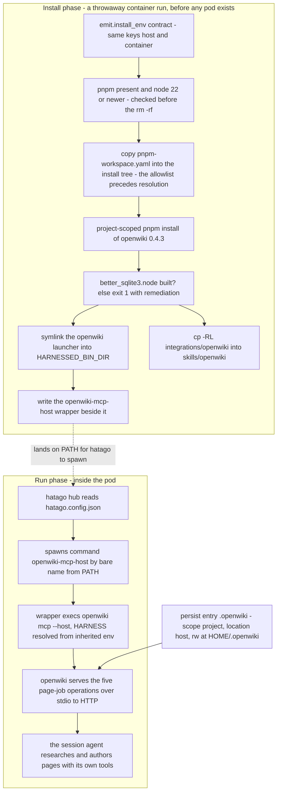
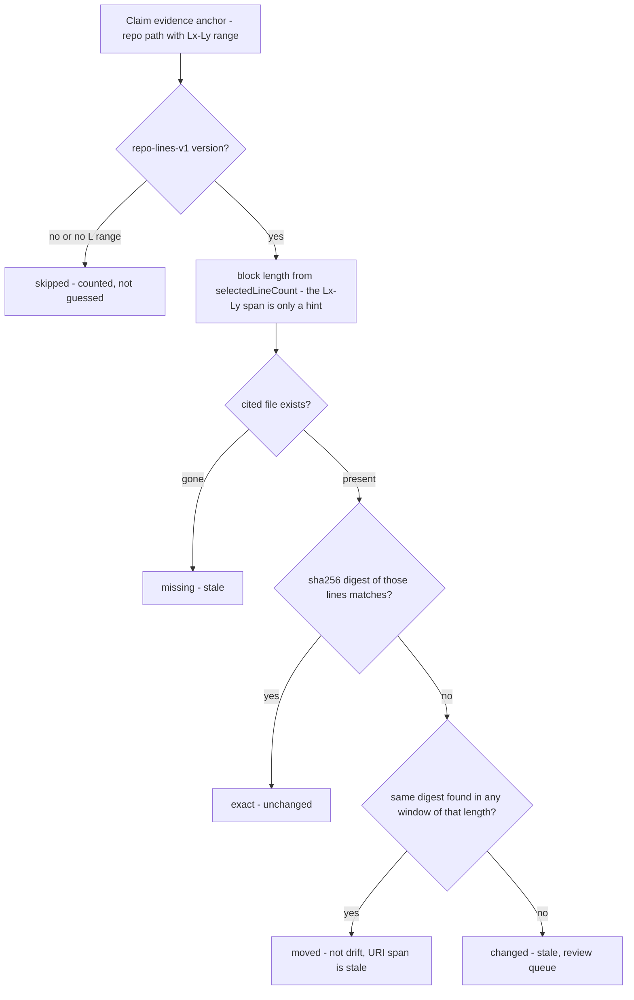

# The openwiki recipe: this wiki generator as catalog content

`catalog/recipes/openwiki/` (recipe.yaml, install.sh, pnpm-workspace.yaml, README.md) paired with
`catalog/stacks/openwiki/stack.yaml` is the pairing that makes langchain-ai/openwiki launchable and
testable. The subject is the agent-driven repository wiki, wired as the **host-driven integration**:
the session's own agent does the repository research and the factual page authoring with its native
tools, while openwiki owns the durable page queue, Claims validation, source-drift handling, and
deterministic finalization. The generator that wrote this wiki is the package this recipe installs —
so the deliverables below are not hypothetical.

`catalog/` is authored content, not code, and this page is the recipe-shaped view of the mechanics
[the catalog page](/openwiki/architecture/catalog-and-schema.md) documents in general: which schema
fields the recipe exercises (`mcp`, `install`, `persist`, `env`, `expect`), and how the build and
launch consume them. It is not a template for documenting every recipe.

Related: [credentials](/openwiki/concepts/credentials.md),
[container launch](/openwiki/workflows/container-run.md), the
[verification ladder](/openwiki/testing/verification-ladder.md),
[wiki automation](/openwiki/operations/wiki-automation.md).

## What a launch of the stack delivers

`catalog/stacks/openwiki/stack.yaml` composes `recipes: [default, openwiki]`, `services: []`, and no
`harnesses:` field — harness-free, like every stack: the harness is the run-time positional in
`harnessed build openwiki claude` or `harnessed test openwiki omp`. The README records four
deliverables:

| Deliverable | How |
| --- | --- |
| `openwiki` on PATH | `install.sh` — a project-scoped `pnpm install`, symlinked into `$HARNESSED_BIN_DIR` |
| `openwiki` skill | `install.sh` copies the package's own `integrations/openwiki` directory |
| `openwiki` MCP server | `recipe.yaml` — stdio, command `openwiki-mcp-host` (a wrapper passing `$HARNESS`), spawned by hatago |
| Resumable state | `persist:` entry `.openwiki`, scope `project`, location `host` |

Five operations reach the agent: `openwiki_begin`, `openwiki_submit_plan`, `openwiki_next_page`,
`openwiki_submit_page`, `openwiki_finish`. You ask it to *initialize this repository's OpenWiki*, or
to *update it for changes since the last successful run*. The brief that scopes the work lives at
`openwiki/INSTRUCTIONS.md` in the target repository — openwiki reads it for scope and priorities and
never rewrites it. This repository's own `openwiki/INSTRUCTIONS.md` is the working example.



*Install-time artifacts on top, run-time spawn chain below. The install runs outside the pod and
outside the egress firewall; everything the pod needs at run time is on PATH or in the hatago
config.*

## No credential, and no egress

**No credential is structural, not an omission.** Host-driven runs use the agent's own authenticated
model session, so no provider key exists to manage. That is upstream's documented behavior and it
holds in the shipped code: `dist/integrations/mcp/server.js` builds the server from a tool provider
and never reaches `needsCredentialSetup` or the onboarding gate that the standalone
`openwiki --init` path walks. The recipe declares no provider env and nothing for
[the credential machinery](/openwiki/concepts/credentials.md) to resolve.

**No egress at run time** for the same reason: the model call belongs to the session's own agent.
The one outbound act openwiki would still perform — an anonymous telemetry event — is disabled
declaratively with `env: OPENWIKI_TELEMETRY_DISABLED: "1"` (the `DO_NOT_TRACK` cross-tool semantics;
openwiki honours either spelling). Under the default-DROP
[egress firewall](/openwiki/workflows/container-run.md) that choice is the difference between a
clean run and a blocked connection on every run.

**The install fetch needs no hole either**, because of where it runs. Recipe installs execute during
`provision_tools(FIRST_START)` as throwaway `podman run --rm` containers that populate the stack's
volumes — *before* the pod is created (`BOUNDARY`) and *before* the EGRESS phase closes OUTPUT.
A host launch has no firewall at all. The recipe therefore declares no `egress:`; there is nothing
for it to allowlist.

A stack that wants the **standalone generator** instead — openwiki making its own model calls —
needs provider env and an inference host in `egress:`. That is a different recipe, not a flag on
this one.

## The stack: baseline plus one recipe, and what listing `default` records

`catalog/stacks/openwiki/stack.yaml`'s comment is a rule, not a preference: **an AUTHORED stack does
not implicitly extend the baseline.** `extends:` defaults to `default` only for a DYNAMIC
(`--recipe`) stack — `launcher._resolve_stack` applies `_EXTENDS_DEFAULT` when it composes and mints
a manifest from a recipe set. An authored `stack.yaml` without `extends:` inherits nothing, which is
why the openwiki stack lists `default` explicitly under `recipes:` — the openwiki skill is only
useful next to the baseline's own authoring content, and explicit composition is how an authored
manifest gets it.

## Why `openwiki integrations install claude` is not used

That upstream command wires the same integration by hand: a skill into `~/.claude` and an
`mcpServers` entry into `~/.claude.json`. Both destinations are wrong here:

- `~/.claude` is **shadowed by the profile mount in a pod** and invisible to a host launch — the
  same reason `validate_no_claude_writes` rejects recipe Dockerfiles that write there. The
  sanctioned route for installed content is `$HARNESSED_CONFIG_DIR` from `install.script`, which
  lands in both modes.
- `~/.claude.json` would be **dead config**: harnessed owns MCP wiring through the hatago config the
  profile carries, not through a harness config file.

The recipe re-creates both deliverables from the same pinned package. The skill is `cp -RL` of
`node_modules/openwiki/integrations/openwiki` — the *exact* directory upstream's installer copies —
into `$HARNESSED_CONFIG_DIR/skills/openwiki`, so it stays byte-identical to upstream's own install
and cannot drift from the pinned version, while keeping third-party prose out of `catalog/` (which
`tests/test_prose_lint.py` gates). The `-L` matters: pnpm's `node_modules` is symlinked into
`.pnpm`, and a dangling link into a tree the profile does not mount delivers nothing. The MCP entry
is `recipe.yaml`'s `mcp.servers`, and the wrapper is generated by `install.sh`.

## Why not `tools: [npm:openwiki@…]`

This one is forced, not stylistic, and it is where the recipe exercises the supply-chain policy
(`BLD-01`). `catalog/base/pnpm/config.yaml` is COPY'd into `~/.config/pnpm/config.yaml` in every
image that runs pnpm, so every JS install is policy-governed. It sets `strictDepBuilds: true` —
lifecycle default-deny, non-zero exit on any unreviewed dependency build script.

openwiki pulls `better-sqlite3` transitively through `@langchain/langgraph-checkpoint-sqlite`, and
imports its `SqliteSaver` **statically** at `dist/agent/index.js:9`. The native addon is therefore
required to **load** the CLI — for every subcommand, including `mcp`. Building it means running a
dependency lifecycle script, which the default-deny refuses without a reviewed entry.

The approval cannot live next to the deny, and this is the load-bearing pnpm 11 fact the policy file
records: **pnpm v11 rejects `allowBuilds` from the global config** (it belongs in a project-level
`pnpm-workspace.yaml`) **and the allowlist does not apply to global installs**. `tools:` is a list
of pinned spec strings — there is no way to carry a build approval, and the mise tool options that
could carry one are not part of it. So the install is a **project-scoped `pnpm install` with a
one-entry reviewed allowlist** — exactly the mechanism the policy file prescribes for this case.

Measured, as recorded in `recipe.yaml`, in `localhost/harnessed-claude:latest` with pnpm 11.21.0:

```text
no allowlist  -> pnpm install exits 1, [ERR_PNPM_IGNORED_BUILDS] better-sqlite3@12.11.1
allowBuilds   -> exit 0, build/Release/better_sqlite3.node present, openwiki loads
```

The allowlist itself is one reviewed entry in `pnpm-workspace.yaml`
(`allowBuilds: { better-sqlite3: true }`), and `install.sh` copies it into the install tree *before*
pnpm resolves, because the gate reads it at resolution time.

The failure mode when the allowlist is ever lost is **loud, twice**. pnpm exits 1 naming the
package — a future dependency that grows a build script fails the install rather than shipping a
half-built tree. And because the CLI's own failure (`Could not locate the bindings file`, with a
14-line path list) reads like a broken Node install rather than a denied lifecycle script,
`install.sh` checks for `better_sqlite3.node` **by name** and exits 1 saying what actually happened
and which file to restore.

## install.sh: guards, pin, and the wrapper

**Ordering is the safety story.** The pnpm-on-PATH check and the Node >= 22 check (openwiki declares
`engines.node >= 22` and its CLI dies at import on an older runtime) run **before** the `rm -rf` of
the previous tree — the destructive step used to run first, so a host launch on old node destroyed a
good install and then failed. The `rm -rf` plus fresh re-resolve is the idempotency story: a re-run
after a failed attempt must not inherit half a `node_modules` tree, and pnpm is declarative over
`package.json`, so re-resolving into a clean directory is the cheap correct thing.

**The install root is derived, never hard-coded.** `$HARNESSED_BIN_DIR` is `<tool-root>/bin` in both
modes — the pod's `~/.local` (one volume covers the bin dir, mise's installs, and `$PNPM_HOME`) or
the stack's own host tools tree — so the script computes the install root as
`$(dirname "$HARNESSED_BIN_DIR")/share/openwiki`. On a host launch that is what keeps the install
**stack-scoped** instead of landing in the user's home. The bin is a **symlink, not a copy**: the
target is pnpm's own launcher and resolves its package relative to its real path.

**The pin has exactly one home.** `OPENWIKI_VERSION=0.4.3` in `install.sh` — nowhere else, and not
in a comment (a second copy is a second thing to drift). `harnessed update` reads pin-shaped
literals out of install scripts as *opaque* pins, so this pin appears in the pin report even though
it is not a `tools:` entry; an unresolvable pin is reported, never silently dropped. No
`pnpm-lock.yaml` ships with the recipe: the top-level package is pinned, and transitives resolve
under house policy (`minimumReleaseAge` 1 day, strict; `blockExoticSubdeps`;
`verifyStoreIntegrity`) — the same way every other npm-backed recipe is pinned.

**The install layer is otherwise minimal.** `install: script: install.sh` and nothing else: no
`system:` (nothing needs root, so the same script delivers the same result in both modes) and no
`cache:` (pnpm's content-addressed store already keys content; a second content cache would key
nothing).

**The wrapper is the provenance story.** The MCP server is not spawned as
`openwiki mcp --host <literal>` because `--host` is the **authoring agent's identity**, not the
launcher's: upstream's `session-manager.js:52` does
`producerActor = options.producerActor ?? options.host` and records
`metadataModel: host-agent/<host>`, so the value becomes run metadata and generated provenance. The
agent doing the writing is claude, omp, codex, … — never harnessed, which starts the pod and authors
nothing. A literal in `recipe.yaml` would stamp every harness with one agent's name.

`${HARNESS}` cannot go in the server's `args:` either: `emit.py` writes stdio `args` **verbatim**
and substitutes `${VAR}` only for a `url_env` URL, so the placeholder would reach openwiki intact
and fail its `isValidHostId` check. `$HARNESS` *is* in the folder-env contract and reaches the child
through hatago's inherited container env — so `install.sh` writes `openwiki-mcp-host`, a two-line
wrapper (`exec openwiki mcp --host "${HARNESS:-unknown}" "$@"`) that resolves it at spawn time: the
one place that works. It is honest for all five harnesses with no branching — upstream's installer
knows ids for claude, codex, and opencode only, but `isValidHostId` accepts any lowercase name, so
omp and antigravity record *their own* harness rather than someone else's.

At launch the per-instance hatago config is regenerated with each stdio child's `cwd` pinned to the
mirrored container-side project path, so the openwiki server reads the repository that is actually
mounted.

## Resumable state: the persist entry

Resumability is the whole point of openwiki's page-job architecture — without persist, a container
restart silently costs every completed page. openwiki keeps its local state under its config dir:
conversation history, connector data, and the langgraph sqlite checkpoints that make an interrupted
run resumable. The recipe wires that up with two declarations:

- `persist: [{name: .openwiki, scope: project, location: host}]` — harnessed owns a host dir under
  `$XDG_DATA_HOME/harnessed/persist/openwiki/<project-hash>/.openwiki` and bind-mounts it rw at
  `$HOME/.openwiki` in the pod, surviving `--fresh`.
- `env: OPENWIKI_CONFIG_DIR: "{persist:.openwiki}"` — upstream's own state-directory override, read
  at process start, so it must be **live in the agent's environment**; a script's `export` dies with
  the script's process, which is why this is a declarative `env:` field rather than another
  executable step. The `{persist:<name>}` placeholder resolves mode-correctly — the bind-mount
  target in a pod, the real host path on a `--host` launch — so one declaration is right in both
  modes, and the schema rejects a dangling placeholder at load rather than letting a literal
  `{persist:...}` reach the agent.

`scope: project` keys the host dir on the **git common dir**, so every worktree of the same
repository shares one state dir — openwiki state is per-repository, which is the case the scope
exists for. A non-git project falls back to workspace scope with a warning. The generated wiki
itself is not persisted state: it lives in the repository as committed Markdown.

## Removal

`install.sh` writes to two harnessed-owned places and nowhere else:
`$(dirname "$HARNESSED_BIN_DIR")/share/openwiki` (the install tree and the `openwiki` symlink beside
it) and `$HARNESSED_CONFIG_DIR/skills/openwiki`. Dropping the recipe and relaunching `--fresh`
clears both. Persisted state is separate:
`harnessed-tools persist-prune --recipe openwiki`.

## What `harnessed test` checks

Neither the skill nor the MCP server is visible to the assembler — the skill is written by a script
into `$HARNESSED_CONFIG_DIR`, not declared under `skills:`, and the MCP server is merged from
`mcp.servers` and reached through the hatago hub rather than inferred from a Dockerfile. That is
what the `expect:` block is for: `expect: {skills: [openwiki], mcp: [openwiki]}` declares the
capabilities the parser cannot see. `expected_capabilities` unions these declarations with
everything parsed from the manifests, and the capability test launches the stack headless,
introspects the live instance (filesystem listing for skills, `hatago://servers` for MCP), and
diffs expected against live.

## The dogfooding loop: how this wiki is regenerated

The recipe above packages the generator; this repository drives it with two `mise` tasks and a
scheduled workflow, and this section is the dogfooding half of the story — the package under
`catalog/recipes/openwiki/` installing the same tooling that produces `openwiki/` itself.

**`mise run openwiki-update` is the entry point — including for the very first run.** Upstream's
own CI example notes that `--update` "also handles the first run for code docs when env vars are
set", and unlike `openwiki --init` it does not force the setup wizard (dist/cli/app/app.js gates the
wizard on `needsCredentialSetup(...) || (isInitCommand && !initWizardConsumed)`, so `--init` walks
every step even in a fully configured environment). The task runs
`python3 tools/openwiki-retry-patch.py` **first**, then
`openwiki code --update --print` under a `varlock run` environment. The retry patch exists because
no upstream release through 0.5.1 retries a skipped page: a page worker that ends without calling
`submit_page` (seen with glm-5.3-flash, PR #445 run 6) is marked skipped and the run finalizes
"interrupted" without advancing the diff base. The patch re-applies itself after any
`mise install` that restores the stock runner, and fails loudly on version drift rather than
patching blind. 0.5.0's durable page manifest (`openwiki/.page-manifest.json`) means a skip no
longer costs a full regeneration, only a clean finalize.

The `openwiki_env` variable deliberately `env -u`-unsets the whole provider surface
(`OPENWIKI_PROVIDER`, `OPENWIKI_MODEL_ID`, `OPENWIKI_MAX_OUTPUT_TOKENS`,
`OPENWIKI_OPENAI_COMPATIBLE_STREAMING`, the OpenAI-compatible and Anthropic pairs) before varlock
re-injects the schema-declared values. That is the same stance harnessed's host launcher takes — the
schema is the declared source of truth and a shell export must not outrank it — and it is measured,
not paranoid: on 2026-09-04 leftover exports repointed a 13-hour run at the wrong provider, and on
2026-09-08 a shell export of `OPENWIKI_MAX_OUTPUT_TOKENS=32768` beat the schema's 20000 and made the
@anthropic-ai/sdk client guard refuse the planner's one non-streaming call
(`3600 * maxTokens / 128000 > 600s` rejects any cap above 21,333) — the only failures in an
otherwise clean 1.7h update.

**`mise run openwiki-drift` is the cheap check that answers "which pages are lying."** It is not
interactive, makes no model call and no network access (tools/openwiki-drift.py): it recomputes each
Claim's recorded content digest against the working tree (or `--rev <git-rev>` via `git show`, never
a checkout) and exits non-zero when cited code actually changed. That makes drift a check rather
than a regeneration — the thing to run before deciding to run `openwiki-update`.

What the gate verifies is deliberately narrower than "every Claim": it checks **line-ranged evidence
anchors only** — resources matching `repo://<path>#L<a>` or `#L<a>-L<b>` whose recorded version uses
the known `repo-lines-v1` scheme. Whole-file evidence (no `#L`) has nothing to hash against, and an
unknown future scheme (`repo-lines-v2`) must be reported as unverifiable rather than silently
checked with v1 rules; both are counted and reported on a separate `skipped` line, never guessed at.

The heart of the gate is separating **moved** from **changed**. Ordinary development shifts line
numbers constantly; a check that treats a shifted-but-identical block as drift reports ~30% of
Claims stale after a week of normal work — noise that trains you to ignore it. Separating the two on
a one-week window measured 27.5% moved against 4.7% genuinely changed, and only the second number is
a review queue. Mechanically, openwiki leaves the `#Lx-Ly` in the resource **stale** when it
relocates a block, so the authoritative block length is the `selectedLineCount` read out of the
base64 version payload (the per-line hashes in that payload are deliberately not reproduced — their
inputs are undocumented, and guessing them would make the check unfalsifiable). A failed exact-digest
check triggers one window scan per `(file, length)` pair: any window of that length anywhere in the
file whose digest matches makes the anchor `moved`, otherwise `changed`.



*How `tools/openwiki-drift.py` buckets one anchored evidence item. `--strict-lines` collapses the
window scan: any non-exact anchor counts as `changed`. Exit 0 = nothing changed, 1 = at least one
`changed`/`missing`, 2 = the wiki or its Claims are unreadable.*

`moved` anchors also surface as a `staleURI` count when the recorded length disagrees with the URI
span: not drift — the digest still matches real code — but a reader-facing accuracy problem, because
the published page cites line numbers that no longer contain the block. Both unreadable-input paths
print and exit 2 explicitly, because a bare `SystemExit(str)` would exit 1 and collide with the
"Claim went stale" status a caller gates on.

The scheduled workflow (`.github/workflows/openwiki-update.yml`) closes the loop: it runs the update
task, then opens a PR with `if: always()` — not `!cancelled()` — so a timeout (which kills the job
with `cancelled() == true`) does not discard every page the durable queue just wrote. The PR body
tells the reviewer to run `mise run openwiki-drift` before merging, and a failed run still fails the
job so a partial PR is visible rather than green.

## Related pages

- [Catalog: schema, roots, resolution, and packaging](/openwiki/architecture/catalog-and-schema.md)
  — the parse/validate/merge machinery this recipe exercises.
- [Credential handling](/openwiki/concepts/credentials.md) — why a recipe with no credential is the
  normal case, and what a provider-keyed recipe would have to add.
- [Wiki automation](/openwiki/operations/wiki-automation.md) — operating the generator this recipe
  packages.
- [The verification ladder](/openwiki/testing/verification-ladder.md) — the capability-test rung the
  `expect:` block feeds.
- [Container launch: container-run end to end](/openwiki/workflows/container-run.md) — where the
  install step sits relative to pod create and the egress firewall.
