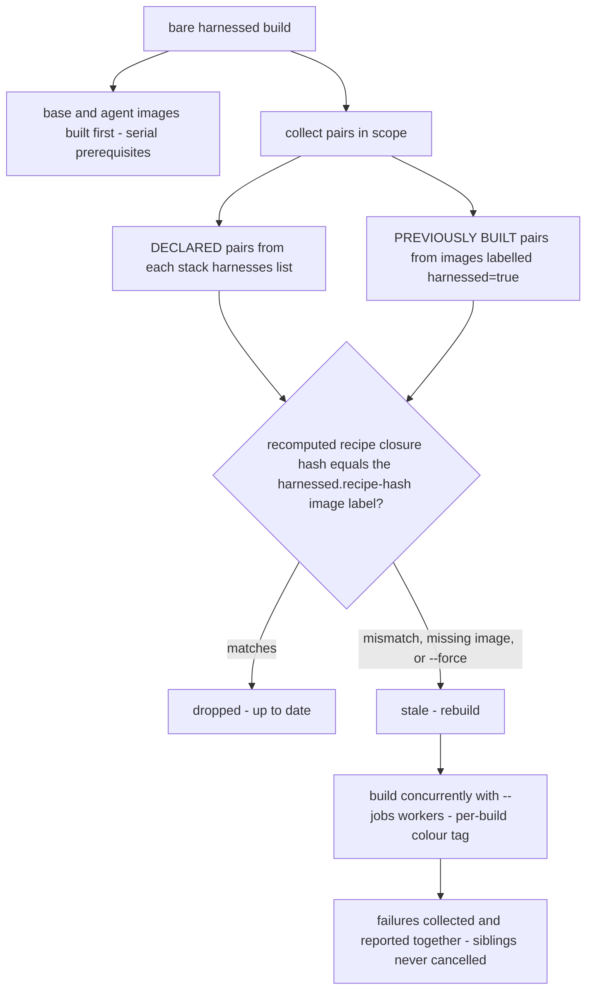
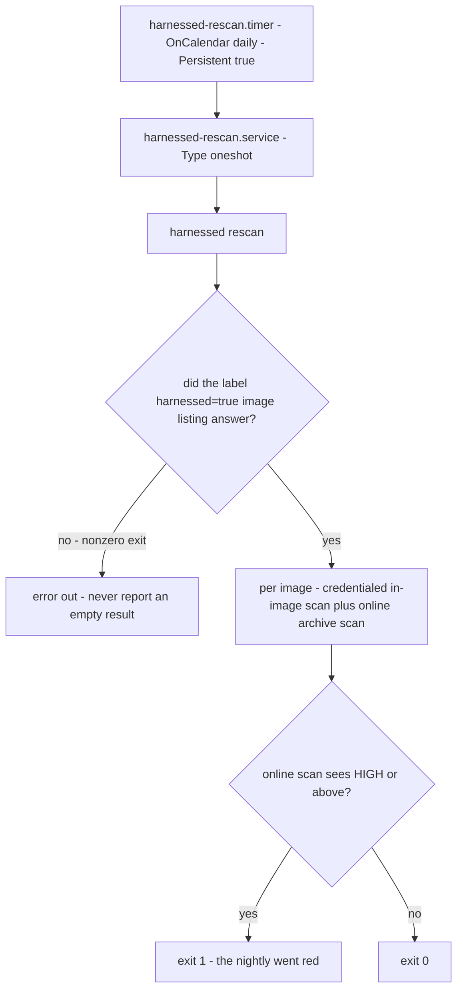

# Operations: the command surface and lifecycle verbs

harnessed is driven through **two CLIs with one division of labor**:

- **`harnessed`** — `launcher.py`'s Typer app (`pyproject.toml` wires `harnessed = harnessed.launcher:main`). Every verb that can touch the container runtime, launch an agent, or manage host-side state lives here.
- **`harnessed-tools`** — `cli.py`'s argparse app. Its verbs are deliberately **emit-only or analysis-only**: assemble a profile without a runtime, run the capability test, drive the nightly online scan, and manage persist dirs. It never invokes podman/docker itself.

The operational rule about *who may run what* lives at the top of [AGENTS.md](https://github.com/drmikecrowe/harnessed/blob/main/AGENTS.md) (and is mirrored in CLAUDE.md): the two interactive run verbs hand the terminal to a live agent session and are not for automation to invoke.

Related: [system overview](/openwiki/architecture/overview.md),
[state, staleness, and GC](/openwiki/architecture/state.md),
[build pipeline](/openwiki/workflows/build.md),
[service sidecars](/openwiki/architecture/services.md),
[aoe and launch scripts](/openwiki/integrations/aoe-and-launch-scripts.md),
[the verification ladder](/openwiki/testing/verification-ladder.md).

## The verb table

Each verb with its owning module and the lifecycle it manages. Function names are the Typer/argparse handlers.

| Command | Owner | Lifecycle |
| --- | --- | --- |
| `harnessed container-run` / `host-run` | `launcher.container_run` / `launcher.host_run` → `ContainerBackend` / `HostBackend` | **Launch** — covered by the container-run and host-run pages |
| `harnessed build [<stack> [<harness>]]` | `launcher.build` → `_build_stack`, `_build_images_cmd`, `_reconcile_stacks` | **Build** — profile + images + volumes; reconciliation sweep |
| `harnessed list` | `launcher.list_stacks` | **Inspect** — authored stacks + instances, running and stopped |
| `harnessed stop <stack>` / `rm <stack>` | `launcher.stop` / `launcher.remove` | **Instance teardown** — pods/containers only |
| `harnessed prune` | `launcher.prune` | **Idle reaping** — instances detached past `--idle` |
| `harnessed new <stack>` | `launcher.new_stack` | **Authoring scaffold** — `stacks/<name>/stack.yaml` |
| `harnessed install` / `uninstall <stack>` | `launcher.install_stack` / `launcher.uninstall_stack` | **Per-stack shim** in `~/.local/bin` |
| `harnessed test <stack> <harness>` | `launcher.test_stack` → `cli._run_test` → `capability.run_capability_test` | **Verification** — the capability oracle |
| `harnessed scan <stack> [<harness>]` | `launcher.scan` | **Re-scan**, scoped to one stack |
| `harnessed rescan [<image>]` | `launcher.rescan` | **Re-scan**, whole fleet — the nightly timer's ExecStart |
| `harnessed update [--check]` | `launcher.update_pins` → `update.py` | **Pin maintenance** across the catalog |
| `harnessed svc up\|down\|recreate\|sync <service>` | `launcher.svc` (+ `svcstate.py` helpers) | **Sidecar lifecycle** |
| `harnessed host-gc` | `launcher.host_gc` | **GC** — host config homes |
| `harnessed volume-gc` | `launcher.volume_gc` | **GC** — per-stack named volumes |
| `harnessed clean` | `launcher.clean_profiles` | **GC** — the only verb that deletes profiles |
| `harnessed project-env-path` | `launcher.project_env_path_cmd` | **Host helper** — the project tool-env dotenv path |
| `harnessed aws-sso serve` | `launcher.aws_sso` | **Credentials** — the ECS credential server |
| `harnessed-tools assemble` | `cli._run_assemble` → `assemble.assemble` | **Emit-only build** — works with no runtime installed |
| `harnessed-tools test` | `cli._run_test` | **Verification** — same oracle as `harnessed test` |
| `harnessed-tools scan-image-online <tar>` | `cli._run_scan_image_online` → `scan.run_image_scan_online` | **Verification gate** — HIGH+ findings exit 1 |
| `harnessed-tools persist-list` / `persist-prune` | `cli._run_persist_list` / `cli._run_persist_prune` → `persist_gc.py` | **GC** — persist dirs |
| `harnessed-tools lint-prose` | `cli._run_lint_prose` → `prose.py` | **Authoring gate** — RULE.md/SKILL.md style check |

## What `main()` does before any verb

`launcher.main` rewrites argv once, before Typer parses it: `_extract_passthrough` splits at the
first standalone `--`, stashing the tail in `_passthrough` (appended verbatim to the harness
command by whichever run verb fires) and keeping the head — the invocation as typed — for the
launch script's `# as typed:` line. There is **no bare-stack shortcut**: the leading token is a
subcommand, full stop. An earlier design treated "a stack name unless it matches a registered
command", which made every new verb require a hand-maintained `_COMMANDS` set — `harnessed update`
parsed as `harnessed launch update` and failed with `Missing argument 'HARNESS'`, which reads like
a usage error rather than a missing registration. `main` also catches the persist gate's three
exception types (`PersistDeniedError`, `PersistNotAllowlistedError`, `PersistOwnershipError`) so a
default-deny refusal prints as a one-line error carrying its remediation, not a Rich traceback
under typer's excepthook — the gate refusing is a *normal outcome of a first launch*, not a crash.

## The launch verbs, in one paragraph

`container-run` and `host-run` share one grammar and one stack-resolution path (`_resolve_stack`)
and differ in backend and nothing else; both end by replacing the launcher process (`os.execvp`),
which is why the [AGENTS.md rule](https://github.com/drmikecrowe/harnessed/blob/main/AGENTS.md)
exists. The full walks live on the container-run and host-run pages. What this page owns is the
**minted-manifest cleanup rule** (below) and the **launcher scripts** each launch leaves
behind (below).

### The minted-manifest cleanup rule

`_resolve_stack` returns `(name, minted_dir)`, where `minted_dir` is non-None **only when THIS
invocation created the manifest** under the generated catalog root — an authored stack, or a
dynamic one whose manifest already existed, yields None. The ownership rule that follows is:

- A manifest this invocation minted is **removed when its launch fails** — `container-run` deletes
  it when `_build_stack` raises; `host-run` deletes it on any non-zero `typer.Exit` or unexpected
  exception. Without this, a stack that never built lingers where `harnessed list` shows it, and
  **no GC reclaims it**: `volume-gc` keys on volumes, and a stack that never built owns none.
- A **pre-existing** manifest (`minted_dir is None`) is **never collateral** — it may be a working
  stack that today's recipe edit merely broke.
- `typer.Exit(0)` must **not** trigger cleanup: `--create-aoe-only` ends that way after registering
  a row whose recorded command names this manifest, so deleting it would manufacture exactly the
  dead-on-arrival row the flow otherwise avoids.

## `build`: three forms and the reconciliation sweep

`harnessed build` has three forms, driven by which arguments are present:

1. **`build <stack> <harness>`** — validate the harness against `HARNESS_CONFIG_DIR`, then
   `_build_stack` for that one pair (assemble in-process, build base → agent → derived image,
   populate volumes, advisory scan).
2. **`build <stack>`** — fan out to the stack's declared `harnesses:` list
   (`_declared_harnesses`); **error when the stack declares none**, because the harness is then
   still required.
3. **bare `build`** — `_build_images_cmd` (base + agent images only), then `_reconcile_stacks`.



*The reconciliation half of a bare build. Declaring `harnesses:` is the opt-in that lets a bare
build provision a freshly authored stack from nothing; a stack that declares none is only ever
reconciled once someone has built it explicitly at least once.*

The sweep's semantics, each of which is load-bearing:

- **Scope.** `_stale_pairs` unions the **declared** pairs (every catalog stack's `harnesses:` list,
  enumerated via `paths.list_catalog_stacks`) with the **previously built** pairs (images matching
  `label=harnessed=true`, repository names parsed by `parse_built_pairs` after stripping podman's
  optional `localhost/` prefix).
- **Staleness.** A pair is stale when `compute_recipe_hash(stack.yaml, recipes)` differs from the
  `harnessed.recipe-hash` label baked into its image, or the image is absent. This is how editing a
  shared recipe propagates to every stack that uses it without naming them one by one.
- **Concurrency.** `--jobs/-j` (default half the cores capped at 4, `_DEFAULT_JOBS`). Base and
  agent images build **first, serially** — they are prerequisites of every derived build. Each
  worker runs under a colour+label tag so interleaved podman logs stay readable; a failure is
  *returned*, not raised, so one broken stack never cancels its siblings. Failures are reported
  together and exit 1 at the end.
- **`--force`** treats every in-scope pair as stale regardless of hash and **implies
  `--no-cache`**, both implemented by setting the process-global `HARNESSED_PODMAN_NO_CACHE` env —
  restored to its previous value in a `finally`, because `build` can run more than once in-process
  (tests via `CliRunner`) and a leaked flag would silently disable the cache for unrelated later
  builds.
- **A failed image listing does not abort the sweep.** Unlike the interactive listings (below),
  `_stale_pairs` treats an unanswered `podman images` *additively*: it warns loudly that
  previously-built-but-no-longer-declared stacks will be missed, then reconciles the declared
  pairs anyway — aborting would overreact, but saying nothing would print "All stacks up to date"
  over a sweep that never looked.

`--corp-proxy-ca-crt` is a one-time setup: it persists the CA bundle under
`$XDG_CONFIG_HOME/harnessed/` and later builds auto-inject it into the base image trust store.

## `list`, `stop`, `rm`, `prune`: the instance lifecycle

**`list`** prints authored stacks (via `paths.list_catalog_stacks` — **origin-blind**: one deduped
name across the user overlay, the repo catalog, and the generated root, overlay winning on a
clash) with which harnesses are built (`is_built`), then instances from `podman ps -a` filtered on
`name=harnessed-`. The Status column shows the real state — never label it "Running", or exited
containers read as live. On a failed listing, `list` prints an **INCOMPLETE warning** and continues
rather than aborting: the heading is already on screen, and "nothing printed" must be
distinguishable from "none exist" by return code alone. The origin-blindness of the stack list is
exactly why the minted-manifest cleanup rule exists: `harnessed list` cannot tell a generated stack
from an authored one, so a minted manifest that failed to build would otherwise be advertised
forever.

**`stop` and `rm`** tear down **by stack** across all harnesses: they list every `harnessed-`
container and match the instance-name format with the regex `-{stack}-[0-9a-f]{8}$`. They operate
at the pod/container level **only** — named volumes (that is `volume-gc`'s job, by design) and
host-side data are never touched. `rm` additionally calls `aoe.forget_stack`, and that is the
**container verb only**: `rm` removes the aoe rows pointing at containers that no longer exist,
and deliberately never touches host-native sessions, which own no container. No-op without aoe.

**`prune`** reaps instances whose interactive session has been idle past `--idle` (default 120
minutes). After hatago-consolidation an idle instance is not just its PID-1 `sleep infinity` — it
also runs the in-container hatago hub and the stdio MCP children it spawned — so attachment is
detected **positively by controlling terminal** (`_session_active` probes `podman top … tty` for a
real pts), never by process count. The safety rules:

- An instance **never interactively attached** (no attach-marker file) is left alone — headless and
  externally driven instances are never pruned.
- `_session_active` returns **None** when `top` fails, and None is treated as *do not prune*: a
  transient runtime hiccup must never tear down a live session; the next run retries.
- Non-running containers (exited after a host reboot) have no session by definition, so they skip
  the tty probe and are reaped once idle — otherwise they accumulate forever, since a plain
  `podman ps` never lists them.
- `--dry-run` reports what would be pruned without tearing down.

**`clean`** is the GC that owns profiles: it purges the whole `profiles_root()`. Nothing else ever
deletes a profile — which is what makes profile-existence checks meaningful.

## `new` and the `install`/`uninstall` shims

**`new <stack> [--recipes a,b,c]`** scaffolds `stacks/<name>/stack.yaml` (name, recipes, empty
services). It refuses a stack name that collides with a harness name — the harness is a run-time
positional, so such a name would be unlaunchable — and refuses to overwrite an existing stack.

**`install <stack>`** writes a `~/.local/bin/<stack>` shim:

```bash
#!/usr/bin/env bash
exec <absolute path to harnessed> container-run --stack <stack> "$@"
```

Two details are deliberate. The shim bakes in the **absolute path to this `harnessed` binary**
(PATH-resolved, falling back to the running interpreter's script), so it works even when
`harnessed` itself is not on PATH. And `--stack` goes **before** `"$@"` — the ordering is
load-bearing: the stack can no longer be a bare leading token (that slot is the harness), but put
the flag last and a passthrough invocation swallows it, because `_extract_passthrough` splits argv
at the *first* `--`. `uninstall` removes the shim.

## `test`: the capability oracle

`harnessed test <stack> <harness>` verifies that a built stack delivers what its manifests
declare. The verb:

1. Auto-assembles first when the stack is not built or its profile is stale
   (`staleness.check_profile_fresh`) — a test must run against a current build, and the rebuild
   here is the same fingerprint-gated `_build_stack` a launch uses.
2. **Delegates to a subprocess**: `uv run` (or `python3`) `-m harnessed.cli test <stack>
   <harness> --root …` with `PYTHONPATH`, `CONTAINER_RUNTIME`, and `HARNESSED_DIR` set. The
   subprocess is deliberately **unbounded**: the child bounds its own work
   (`capability.DEFAULT_TEST_TIMEOUT = 120` per test), and a second deadline out here would only
   cut off a run that is legitimately still going. The child's return code becomes the exit code.

The `harnessed.cli` side (`_run_test` → `capability.run_capability_test`) is the oracle proper:
manifest oracle (`schema.expected_capabilities`) → launch `--fresh` headless (owning a scratch
project dir for the whole test, since it is the pod's bind mount and must outlive
launch→introspect→teardown) → `wait_ready` → `introspect` (hatago resource + mounted-profile
filesystem listing, harness-independent; `expect_mcp` forwarded so late-connecting hatago children
are waited for rather than raced) → optionally copy recipe-authored `tests/*.sh` into the live
instance and run them, each exit code folding into the **same** report as a TEST result → teardown
unless `--keep` → `build_report`. `report.emit` renders the report (rich table, or clean JSON for
CI via `--json`) and returns `report.exit_code` — the **same structured result drives both the
report and the exit code**, so CI goes red exactly when the rendered report is red. `--no-tests`
runs only the presence oracle.

## `svc`: the sidecar lifecycle

`harnessed svc` takes one of exactly four actions — `up`, `down`, `recreate`, `sync`
(`_SVC_ACTIONS` is the single list used both to validate and to spell the error, so a new action
can never be accepted while the error still calls it unknown). The README's command table
additionally lists a `migrate` action; **the code does not implement one** — `svc migrate` is
rejected with the valid-actions error.

- **`up`** builds (if missing) and starts (if not running) the sidecar through `_ensure_service`.
- **`down`** is `podman rm -f` of the sidecar container.
- **`recreate` exists because mounts, published ports, and env are fixed at CREATE time**:
  `podman restart` re-runs the existing container and reports success while changing nothing, so it
  is not offered and the action is deliberately not named "restart". Recreate tears down and
  rebuilds through the same `_ensure_service` path (`force_recreate=True`); data — the named
  volume or the bind-mounted persist dir — is untouched. Recreate is also the one action that
  needs no `--stack` from inside the project: it reads the stack back off the container's
  `harnessed.svc-stack` label, and for a container predating that label, off the agent instances
  running for this repo (running instances win over stopped ones; more than one candidate is an
  error demanding `--stack`). `up`/`recreate` compute the **same widened mount** a launch computes,
  so a sidecar started via `svc up` never gets a narrower git surface than one started by a launch.
- **`sync`** execs the service's own `sync:` command *inside its container* (`podman exec … bash
  -lc <sync_cmd>`), unbounded — a catalog-authored sync is explicit, watched work (a database
  import legitimately runs for many minutes; Ctrl-C is the control). It exists for a server whose
  sync shells out to a CLI that only routes to a server on its own loopback, so the push can only
  run inside the service container, never in an agent container.
- **Drift detection.** At create time the sidecar is stamped with `harnessed.svc-config-hash` (a
  digest of the full `podman run` argv). Every later `up` re-derives what the code *would* create
  today and compares: a healthy-looking container whose config hash no longer matches prompts for
  recreation before a harness launches (proceeding automatically headless). Without this, a
  sidecar drifts arbitrarily far from the code that would create it today and nothing notices.
- `scope: project` services otherwise require `--stack` for every action, because the persist
  entry that holds their data is resolved through the stack.

## `scan` and `rescan`: the post-build CVE catch

The build-time scan layer is deliberately credential-free and uses an offline advisory DB — so by
design it cannot see CVEs disclosed *after* the image was built. Two verbs close that gap:

- **`harnessed scan <stack> [<harness>]`** — the stack-scoped variant. With no harness argument it
  re-scans every supported harness's image for the stack, skipping unbuilt ones; naming an unbuilt
  pair is an error.
- **`harnessed rescan [<image>]`** — the fleet variant, and **the systemd timer's ExecStart**.
  With no argument it enumerates every image matching `label=harnessed=true`. That listing goes
  through `_listing`, which **aborts on any non-zero runtime exit** — here the guard is
  especially load-bearing: `rescan` is what the nightly fires, and an unanswered listing that
  printed "nothing to rescan" and exited 0 would silently skip the whole nightly vulnerability
  scan, indistinguishable from a nightly that keeps finding nothing (scan.py's Pitfall 6 warning
  sign). "The runtime did not answer" and "there is nothing to rescan" must never collapse into
  the same empty string.

Each image gets two complementary passes (`_scan_image`):

1. **Credentialed in-image scan** (`_scan_image_in_container`) — a throwaway container from the
   image itself runs the baked `harnessed-scan` with scanner tokens injected as a mode-0600 temp
   `--env-file` (resolved on the *host* from the user-global env files; varlock never runs
   in-container). **This is the only path on which snyk and socket actually run** — builds never
   pass secrets, so they get osv-scanner + pip-audit only. Advisory: `harnessed-scan` always exits
   0, so this reports posture and never gates. The container is deliberately **not** `--rm`: the
   credentialed report is `podman cp`'d out (a bind-mount write from the unprivileged in-image
   user would need userns mapping this call site does not otherwise require) before the container
   is removed in a `finally` — a discarded credentialed report once let the weaker build-time
   report be surfaced in its place under a green verdict. Stack volumes are mounted so the report
   covers the whole stack, not just the image layers.
2. **Online archive scan** — `podman save` the image and run `harnessed.cli scan-image-online` on
   the tarball: osv-scanner against osv.dev with the offline-DB flags **dropped**, so it sees
   advisories disclosed since the build. This pass **gates on HIGH+** (exit 1).



*The nightly path. The timer is a user unit: copy to `~/.config/systemd/user/` and enable with
linger — without `loginctl enable-linger`, the user systemd instance is torn down on logout and
the timer never fires.*

### The timeout story

Two bounds frame the scans, both chosen against recorded incidents:

- `_SCAN_CONTAINER_TIMEOUT = 900` — the **outer backstop** for the in-image scan (the script
  bounds each scanner itself). Not hypothetical: a scan container once ran 71 hours at 0% CPU with
  no timeout above it, which would have hung `harnessed build` indefinitely and silently. The
  timeout handler reads the cidfile and removes the container — the assignment after
  `subprocess.run` never ran, so without this the 71-hour container is exactly what the `finally`
  would have missed.
- `_SCAN_ONLINE_TIMEOUT = 1800` — bounds the online scan despite its network dependence, because
  **nobody is watching** the nightly: an unattended hang wedges the timer silently and the nightly
  re-scan simply stops happening, which looks exactly like a nightly that keeps finding nothing.

## `update`: pin maintenance

`harnessed update` sweeps every resolvable pin in the catalog — recipe `tools:` entries, **agent
manifests**, and the base image's `extra-tools` list — resolves latest versions through the pin's
backend (npm / PyPI / GitHub releases / mise), and offers bumps. The design's invariants:

- **Five buckets, all printed even in `--check`**: *stale* (offered), *cooling* (newer exists but
  is younger than the release-age window — shown with its age, because "wait" should be a decision
  rather than a mystery), *held* (`hold:` marks a pin manual-upgrade-only — skill content is agent
  instructions run with the agent's full tool permissions, so a compromised upgrade is prompt
  injection no CVE scanner detects), *unresolved* (pins inside install scripts and Dockerfiles —
  loud on purpose, because a pin that could not be checked is the one case where silence reads as
  "fine"), and *unpinnable* (agents with no version selector that preserves integrity — its own
  bucket, never folded into unresolved, so a permanent, declared condition cannot hide a real
  resolver outage).
- **`--check` writes nothing.** Report building is side-effect free; only `apply` writes. A CI mode
  that mutated the tree it was validating would be a trap. Its exit code comes from
  `check_exit_code`: **non-zero only for a stale, unheld, resolvable, past-cooldown pin** —
  unresolved pins do not fail (every recipe with a Dockerfile has one; a permanently red check is
  one nobody reads), and cooling/unpinnable pins fail nobody's fault.
- **The release-age cooldown** (`--minimum-release-age`, default 10080 minutes = 7 days, pnpm's
  `minimumReleaseAge` semantics and unit): a compromised or broken publish is usually yanked
  within days. A too-fresh newest release does not mean "no update" — the newest version that *is*
  old enough is offered instead, and the skipped newer one is named.
- **`apply` is an allow-list of per-file rewriters**, not an else-branch to a text rewriter: YAML
  round-trippers for recipe/agent manifests, a plain-text rewriter for the extra-tools list, and
  **an unrecognized file is skipped** rather than naively line-edited — the fail-closed posture
  that costs a bump nobody asked for instead of a corrupted catalog file.
- **After writing**, the verb names the bumped recipes, the affected stacks, and prints the literal
  `harnessed build`/`harnessed test` commands to verify before committing — a bumped pin is a code
  change like any other, and printing the commands is the difference between a reminder and a task
  the user has to go research.
- Resolution goes **through the module attribute** (`pinupdate.resolve_releases`), so a test or a
  future offline mode can swap the resolver.

Where the opaque literals come from — install scripts and Dockerfiles read by `_ASSIGN_RE` — is
[scanner depth on the supply-chain page](/openwiki/operations/supply-chain.md). What this page owns
is that `update` reports them rather than skipping them.

## The GC verbs

Each garbage collector keys on a different artifact, and the keying is deliberate (full detail on
the [state page](/openwiki/architecture/state.md)):

- **`host-gc`** lists every host config home with age, size, and credential status; `--prune`
  removes only dirs whose **stack no longer resolves in the catalog** — a dir whose project path
  exists is never removed, because a missing path can mean an unmounted volume, and deleting that
  config would be data loss. Real `.credentials.json` files are overwritten with null bytes and
  fsync'd before removal.
- **`volume-gc`** matches volumes **by label** (`harnessed.role`, `harnessed.stack`,
  `harnessed.harness`), never by parsing names — a stack name may contain the same hyphens the
  name format uses. Same orphan rule as host-gc; a volume whose stack still resolves is **never**
  removed (a stack can be temporarily unresolvable because an overlay is not mounted), and the
  shared `harnessed-dl-cache` is exempt — it is pure cache; remove it by hand.
- **`persist-list` / `persist-prune`** (on `harnessed-tools`; `persist_gc.py`) lists every
  `persist/<recipe>/<project_hash>/<name>` triplet with disk usage, and prunes by **re-deriving**
  the hash from the original project path you supply (`--project` is required). Because
  `project_hash` is a one-way SHA1[:8], orphan auto-detection is impossible and refused by design
  — no guessing about what a hash once represented. `--scope workspace|project` selects which key
  the launcher would have used (resolved path hash vs. git-common-dir hash, with the launcher's
  same fallback outside a repo); `--yes` is required because removal is irreversible; `--name`
  removes one entry, its absence removes all entries for the recipe+project; empty skeleton parent
  dirs are cleaned up afterwards.
- **`clean`** — the profile purge (above).

## Host helpers: `project-env-path` and `aws-sso`

**`harnessed project-env-path [path]`** prints where the project's tool-env dotenv lives — for the
audience a launch does not configure (a `bd` in a terminal, a self-started `claude`, a hook).
Wiring it up is opt-in and the user's; harnessed writes nothing into the repo or shell config.
The file must be **referenced, never copied**: it holds real service credentials and is regenerated
on every launch. Two details are load-bearing:

- It prints with the **builtin `print`, not the Rich console**: rich hard-wraps at terminal width
  (a newline lands in the middle of a long path) and reads `[...]` as markup (a bracketed span is
  lost) — both failing *silently*, because env loaders tolerate a missing file.
- On a failed git lookup it **prints nothing on stdout and exits 1**: the caller is a shell
  substitution in someone's env loader, and a fallback path computed after a failed lookup is a
  plausible-looking wrong answer that loads no env and explains nothing.

It prints the path whether or not it exists — direnv tolerates a missing env file silently, so a
never-launched directory is not an error.

**`harnessed aws-sso serve`** walks host setup for the ECS credential server that stacks with
`forward_aws_sso: true` consume: verifies `aws-sso` is installed, generates and stores the bearer
token (0600) on first run, then runs `aws-sso ecs server` in the foreground (unbounded — a
foreground daemon's "leave this running" is the feature). The default bind is `0.0.0.0` on purpose:
containers reach the server via `host.containers.internal`, which `127.0.0.1` does not answer; the
listener is gated by the bearer token, and `--bind-ip 127.0.0.1` turns it host-only at the cost of
container reachability.

## The per-project launcher scripts (`launchscript.py`)

Every successful launch writes `<project>/<harness>-<verb>` — `claude-host` or
`claude-container` — a shell script that **replays the launch** when run
(`./claude-container --fresh`). The verb is in the **filename** rather than a flag, so the two
backends cannot collide in one folder and an aoe row cannot restart a backend it does not name.
This mechanism **replaces the retired `lastrun`/`--last` state file** (bd harnessed-7mt): that
record held the same facts invisibly, so "what did I launch here" meant reading shell history —
**the file is the record**, something you can `cat`, run, and extend. There is no `--last`
flag and no state file to drift from it.

```sh
#!/bin/sh
# harnessed:launcher v1
# as typed: harnessed container-run claude . --stack my-stack
exec harnessed container-run claude /abs/project --stack my-stack "$@"
```

Its contract:

- **Written after the validation gates.** Both run verbs call `launchscript.write` and
  `_aoe_register` back-to-back, after the backend's last gate that can kill the launch
  (`is_built` + `check_profile_fresh` on the container path; the in-process `assemble()` on the
  host path) and before the work that can fail for unrelated reasons. A script for a launch that
  died on a renamed recipe would be a bookmark for a dead launch. The ordering with
  `_aoe_register` is itself load-bearing: the row's command **is** this script, and
  `_aoe_register` *exits* under `--create-aoe-only`, so writing afterwards would leave a row
  pointing at a file that does not exist.
- **Never fatal.** Every failure path returns `None` and the launch proceeds — a launch that got
  this far has already done the useful work, and losing the shortcut is not worth killing it.
  Every read is bounded so the "never raises" contract is unconditional (`MemoryError` is not an
  `OSError`).
- **The sentinel gates overwrite.** `# harnessed:launcher v1` on line 2 is the licence to
  overwrite. `write` replaces only a **regular file** carrying the sentinel in its first lines;
  anything else in the way is refused and the launch proceeds without its shortcut. Two refusals
  apply even to a file carrying the sentinel: **not a regular file → refuse before opening** (a
  FIFO passes `exists()` and *blocks* on open until a writer appears — `except OSError` cannot
  catch a hang, so the check is "what is it", not "can I read it"), and **git-tracked → refuse**
  (committing a generated launcher is a choice a repo is allowed to make, and rewriting it on
  every launch would produce a dirty tree nobody asked for).
- **Quoting is `aoe.command_for`'s, never re-implemented.** The exec line is that function's output
  with its trailing `--` popped (defensively popped, so a future change there cannot silently
  leave a separator in the script), re-joined with `shlex.join` — a hostile `--aoe-title` is
  escaped by the same quoting the aoe row already relies on. The trailing `--` itself **does not
  live in the file**: the row invokes `<script> --`, the separator arrives as the script's own
  argument, and aoe's appended resume flags sail past harnessed's parser to the agent while a
  human's `--fresh` stays harnessed's own flag. Details on the
  [aoe page](/openwiki/integrations/aoe-and-launch-scripts.md).
- **The `# as typed:` provenance line** is the one place user argv reaches a file, so it is
  bounded (capped at 2048 bytes, marked `... (truncated)`) and sanitized to printable characters
  plus tab — a newline would close the comment and let the next line *execute*, the one way a
  display-only field becomes code. `launcher._typed_invocation` **refuses to emit a line that
  would lie**: no line at all when the process never went through `main` (a `CliRunner` test would
  otherwise emit the bare word `harnessed`, which reads as a real launch), and none when the
  recorded argv names a different verb than the launch being written (one test process can write
  scripts for several projects). A provenance comment that misreports the launch beneath it is
  worse than no comment.
- **The git exclude entry.** After writing, `_ensure_excluded` adds a **root-anchored** pattern
  (`/claude-host`) to the git **common dir**'s `info/exclude` — one file shared by every worktree,
  written once and covering all of them (git matches exclude patterns against the top of whichever
  worktree it processes, which is why the pattern anchors on `--show-toplevel` and would match
  nowhere if anchored from the common dir's parent). It is idempotent by exact-line match (ten
  launches leave one line), **skips rather than appends blind** past a 1 MiB read bound (past the
  cap the membership check cannot be trusted, and a duplicate per launch would corrupt a shared
  file), and **fails closed**: no pattern rather than a wrong one. A non-git folder gets no
  warning.
- **Files are read the way the shell reads them.** `_read_as_the_shell_does` uses `newline=""` and
  callers split on `"\n"`: Python's universal-newline mode would translate a lone `\r` inside a
  quoted value into `\n`, and `str.splitlines()` breaks on eight characters `/bin/sh` does not —
  either way the reader sees a different script than the one that runs (a shifted sentinel check,
  an unattributable aoe row).

## `harnessed-tools`: the emit-only surface

`cli.py`'s parser describes itself as "emit-only; never drives the daemon", and the module
docstring says what that buys: it runs on the host, in-process from `harnessed build` or
standalone, and never invokes podman/docker — the host runs `podman build` on the emitted
artifacts. Its verbs:

- **`assemble <stack> <harness> --build-dir <dir> [--root <dir>]`** — the standalone emit path:
  you can produce a committed profile on a machine with no container runtime. When `--root` is
  absent it passes `None`, resolving **across the catalog roots exactly as `harnessed build`
  does** — deliberately not the CWD, because `root` here is a single catalog root
  (`root/stacks/<stack>`), and a CWD default would silently demand you be standing in `catalog/`.
- **`test`** — the same capability oracle as `harnessed test`, taking `--root`, `--project`,
  `--harnessed-bin` (default `$HARNESSED_DIR/harnessed` or PATH, since it must drive a launch),
  `--keep`, `--no-tests`, `--json`.
- **`scan-image-online <archive>`** — the online image-archive scan as a first-class verb: fresh
  osv.dev DB, exit 1 on any HIGH+ finding. `rescan` shells out to exactly this.
- **`persist-list` / `persist-prune`** — the persist GC (above).
- **`lint-prose <targets…>`** — style-checks injected content (RULE.md/SKILL.md) against the house
  standard. Unlike the npm/pin gates it reports **all** findings rather than raising on the first,
  because prose quality is a gradient and an author wants the whole list in one pass; exit 1 only
  on error-severity findings, unless `--warn-only`. `--summary` prints the per-file metric table.
