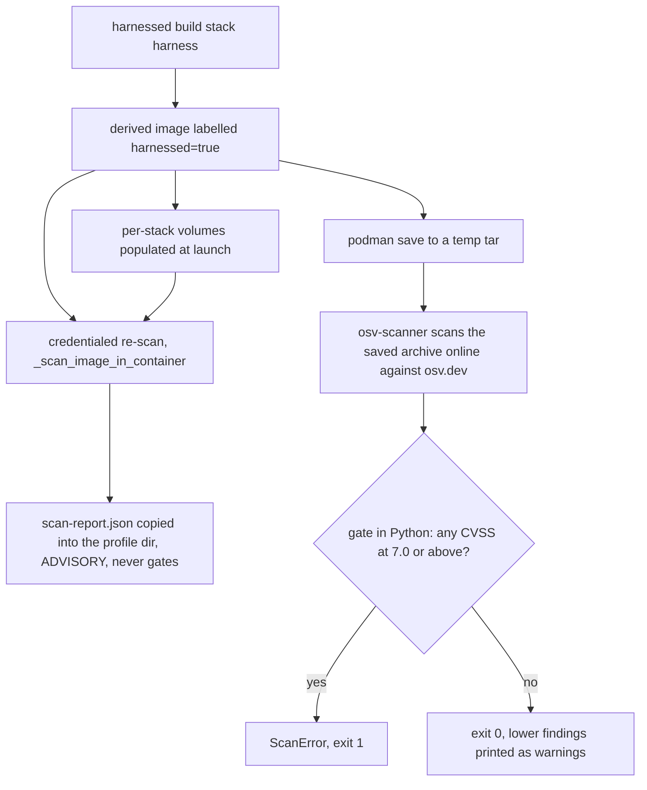
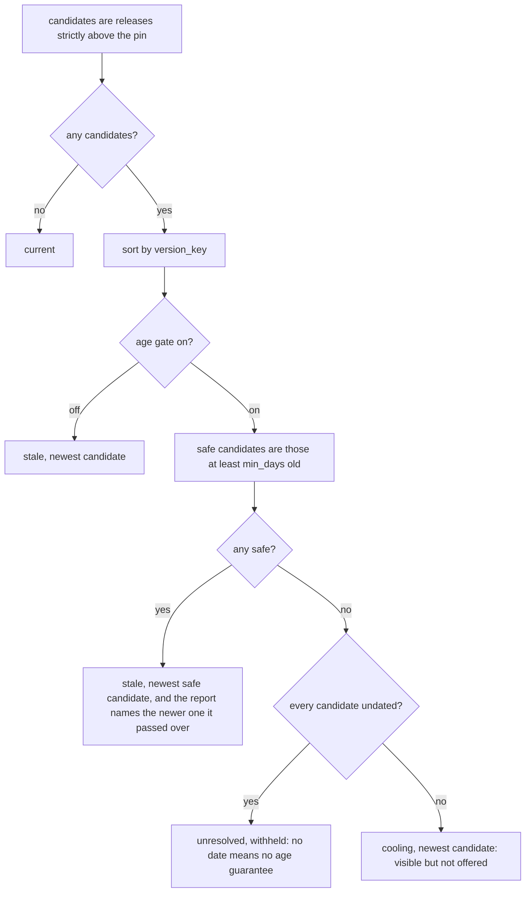

# Supply chain: scans, pins, and tool locks

Four surfaces keep the catalog's downloads honest, and each one exists because the alternative fails
*silently*:

| Surface | Module / file | What it proves | Failure it removes |
|---|---|---|---|
| Gating image scan | `src/harnessed/scan.py` | no HIGH+ (CVSS ≥ 7.0) advisory in a built image | "green build that shipped a CVE" |
| Advisory in-image scan | `catalog/base/harnessed-scan` | posture + *coverage* (which scanners actually reported) | "clean result" off 1 of 6 scanners |
| Pin freshness | `src/harnessed/update.py` (`harnessed update`) | every pin either current, or visibly stale/held/cooling/unresolved | pins rotting unseen until a human reads a Dockerfile |
| Install checksums | `src/harnessed/toollock.py` | the bytes a stack installs match the recipe's locked checksums | a lockfile mise silently ignores |

The recurring theme is **absence of a signal reads as "fine"**: a scanner that produced nothing
parseable looks like a scanner that found nothing; a pin the updater cannot parse looks up-to-date; a
lockfile with the wrong filename verifies nothing while `mise install` exits 0. Every mechanism here
is shaped to convert one of those silences into something a human can see.

## The two scan passes: advisory vs gating

`harnessed build`'s **image build** is deliberately credential-free — `_build_derived_image` never
passes a secret, so recipe verification never depends on 1Password being authorized. Two
consequences follow:

- The derived Dockerfile has had **no scan layer at all** since bd harnessed-8px.21.5. `tools:` and
  `install:` stopped being image layers (they run into per-stack volumes at launch), so a baked scan
  layer scanned an image containing no stack content and still printed "no high/critical advisories" —
  a green-looking result covering almost nothing (`emit.write_derived_dockerfile`).
- A real, credentialed scan is a **host-side step outside the image build**: `harnessed rescan`, which
  re-scans already-built images — and the very same re-scan `_build_stack` runs immediately after the
  derived image is built, unless `--no-security-scans`. Nothing in the podman build itself resolves
  scanner tokens.

`_scan_image` (launcher.py) runs the two complementary passes per image, both driven **host-side** —
the only container in the path is the throwaway one the advisory pass creates:

1. **Credentialed in-image scan** (`_scan_image_in_container`) — runs the image's own baked
   `harnessed-scan` in a throwaway container with scanner tokens injected as env. **Advisory**: it
   reports posture and never gates. This is the *only* path on which snyk and socket actually run.
2. **Online archive scan** (`scan-image-online` → `scan.run_image_scan_online`) — the host
   `podman save`s the image to a tarball and runs osv-scanner against the archive **online**, i.e.
   with the offline build-time DB flags dropped, so it sees advisories disclosed *since* the build.
   **Gates** on HIGH+. The subprocess is
   `uv run --no-project --with ruamel.yaml python -m harnessed.cli scan-image-online <tar>`, bounded
   at 1800s with the tar unlinked afterwards — no daemon-in-container, no API socket.

*Figure: the two per-image scan passes — the in-container pass is advisory and credentialed, the
archive pass is credential-free but online and is the one that gates.*

`harnessed scan <stack> [harness]` scopes the same `_scan_image` to one stack (fanning out to every
built harness when the harness argument is omitted); `harnessed rescan [image]` runs it over one named
image or **every image carrying the `harnessed=true` label** (`podman images --filter
label=harnessed=true`). That label is set by `_build_derived_image` for exactly this purpose. The
image listing in `rescan` goes through `_listing`, which aborts on any non-zero runtime exit — and
that guard is load-bearing: an unanswered listing would print "nothing to rescan", exit 0, and
silently skip the whole nightly, indistinguishable from a nightly that keeps finding nothing.
`build --no-security-scans` (env `HARNESSED_NO_SCANS=true`) skips the credentialed pass, and
`_surface_scan_report` then says so — "no supply-chain report produced — nothing was scanned" —
because a build that scanned nothing must not look identical to one that scanned everything and found
nothing. (See [the CLI page](/openwiki/operations/cli.md) for the verb surface,
[the build pipeline](/openwiki/workflows/build.md) for where the scan sits in Stage 8.)

## scan.py — the HIGH threshold is pure Python

The crux: **osv-scanner exits 1 on ANY finding and offers no severity flag**. Its exit codes are
0 (clean), 1 (any finding), 127 (usage error), 128 (no packages found). So the exit code cannot decide
HIGH — `_run` never raises on a non-zero scanner exit, and the decision is taken in `gate()` over the
parsed `--format json` output.

The second non-obvious fact: `severity[].score` in osv-scanner's JSON is a **CVSS vector string**
(`"CVSS:3.1/AV:N/AC:L/PR:N/UI:N/S:U/C:H/I:H/A:H"`), not a number. `_max_cvss` therefore:

- takes a numeric score directly if one appears,
- otherwise computes the **CVSS v3 base score from the vector** (`_cvss3_base`: FIRST.org metric
  tables, scope-changed impact formula, `_roundup` per the v3.1 spec); an unparseable or CVSS v2
  vector returns `None`,
- and if no CVSS is parseable at all, falls back to the advisory's qualitative label band
  (`_LABEL_SCORE`: HIGH → 8.0, CRITICAL → 9.5, MEDIUM → 5.0 …), chosen so a HIGH-*labelled* record
  still trips the gate rather than sailing under it.

`gate(osv_json)` is the **only** HIGH decision point: it walks `results[].packages[].vulnerabilities[]`
and returns every finding id whose max CVSS ≥ `HIGH = 7.0`. An empty list is a pass. Lower findings
never red-line the run — `run_image_scan_online` returns them as `ScanResult.warnings`, which the CLI
prints; only a HIGH+ set raises `ScanError` (exit 1).

Exit **128** ("no package sources found") is preserved as its own investigate-branch in
`run_image_scan_online`: it becomes a warning telling you to investigate, because a scan that forever
sees no packages is the symptom of a scan that is not actually scanning anything. Scanner invocation
itself is bounded at `_TIMEOUT = 300`s — a stuck scanner must not hang the pass — and any
`SubprocessError`/`OSError` becomes `ScanError` rather than a traceback.

## The nightly re-scan and its timer

`systemd/harnessed-rescan.timer` fires `~/.local/bin/harnessed rescan` daily (`OnCalendar=daily`,
`Persistent=true`), via the oneshot `harnessed-rescan.service`. Two operational facts the units
themselves record:

- **`loginctl enable-linger $USER` is a prerequisite.** Without it the *user* systemd instance is torn
  down on logout and the timer does not fire while you are logged out — the nightly simply stops
  happening.
- The service **requires network egress to osv.dev at scan time**. The online DB is the whole point:
  the build-time DB only knows about CVEs at build time, so a stale-DB nightly would see nothing new
  forever, and that vacuous "0 findings" is the Pitfall-6 warning sign the code comments repeatedly.

The timeout ladder is deliberate and each rung is bigger than the one below it, with different
reasons:

| Bound | Value | Owner | Why bounded |
|---|---|---|---|
| per scanner call | 120s (env `HARNESSED_SCAN_TIMEOUT`) | `harnessed-scan` (`timeout -k 10`) | one wedged scanner costs its own result, not the other three; `-k 10` because a real scan container once ignored SIGTERM |
| whole scan container | 900s | `_scan_image_in_container` | backstop for the script wedging *outside* the scanners — one container ran 71 hours at 0% CPU |
| online archive scan | 1800s (`_SCAN_ONLINE_TIMEOUT`) | `_scan_image` | network + `uv run` dependency resolution; bounded **because nobody watches** — an unattended hang wedges the timer silently and looks exactly like a nightly that keeps finding nothing |

## harnessed-scan: advisory posture plus first-class coverage

`catalog/base/harnessed-scan` is baked into the base image (`COPY` to `/usr/local/bin/harnessed-scan`,
with uv + osv-scanner via `mise use -g`, pip-audit via `uv tool install`, and snyk plus
`socket@1.1.143` via `pnpm add -g` installed beside it, so `rescan` needs no network install). It
**always exits 0** — harnessed installs third-party agent tooling whose JS trees almost always carry
open HIGHs, so a hard build-gate there would make the recipe system unusable. It scans:

1. mise-installed **node globals** (deduped via realpath),
2. **recipe node trees** under `~/.claude/skills/*/node_modules` and `~/.claude/commands/*/node_modules`
   — both via a *synthesized* `package.json` naming every on-disk package at its installed version,
   because an upstream-installed `node_modules` vendors no top-level manifest snyk or socket can see,
3. **osv-scanner over recipe trees that ship a real lockfile** (it sees `bun.lock`/`package-lock` the
   synthesized manifest misses),
4. **pip-audit** over the active Python env.

Each scanner's JSON has a dedicated parser normalizing severity vocabularies: snyk's `severity`
field, osv's per-group `max_severity` CVSS string, socket's vocabulary (which says "middle", not
"medium") with its artifact-of-our-own-manifest `missingLockfile` alerts filtered out, and pip-audit
which has no severity field at all and reports `unknown`. Findings are deduped per vulnerability id
(snyk reports the same vulnerability once per detected project, and the id map collapses it to one);
a finding with no usable id is counted under a synthetic key rather than dropped — dropping it would
be a silent under-count in a security scan, the one direction this file must never fail in.

### Coverage is the feature

Every scanner announces its attempt to the **attempts ledger** *before* it runs, and a manifest line
is written only when parseable output appeared. The summary reconciles the two, and distinguishes two
opposite kinds of "nothing":

- `no-output` — the scanner **ran** and produced nothing parseable → it is probably *broken*;
- `unrun` — it never started (no token, binary absent, timed out, nothing to scan) → it was never
  configured, and the recorded *reason* is what makes the row actionable.

Conflating them either hides a broken scanner or cries wolf about a deliberately unconfigured one. A
scanner that both attempted and skipped yields **one** row — the reasoned skip wins, because every
skip reason means the run did not complete, so any output it left is partial and must not reach the
totals as a finished result. Zero reporting scanners prints `NO COVERAGE — 0 scanners produced output.
This is NOT a clean result.`, and even a green line says out loud how many scanners contributed
nothing — "a green line earned by 1 of 6 scanners is a FALSE clean", said right where the reassuring
sentence is.

Two scanner-level details back the same theme. The in-image osv pass handles exit codes
verified against 2.5.1 rather than assumed: 128 ("No package sources found") is a *skip*, not a
broken scanner — left to fall through it writes no manifest line and the reconciler can only read
that as broken — while 127 deliberately falls through, since a broken invocation is exactly what that
bucket is for. And every early bail path that a scanner *itself* knows about must call `record_skip`
before returning: an attempt with no result and no reason reads as "ran and produced nothing", i.e.
broken.

Two further invariants:

- **Acknowledged advisories** (no patched release anywhere upstream, e.g. brace-expansion < 5.0.9
  bundled by every npm release) are keyed by **advisory id plus package**, never by package alone —
  id-keying is self-expiring and the package is a second necessary condition so an entry can never
  become a package-name suppression. Every hit is counted, printed by name, and written to
  `scan-report.json`; it is excluded from the totals but never silent.
- **The ledger format is hand-rolled** (`|`-separated, no escaping, parsed by `split("|", 3)`). The
  bash writer strips `|` from every field at a single choke point (`nosep`), because one label is
  `recipe: $(basename …)` — a directory name a recipe controls; the Python parser must not *depend* on
  that guarantee, and `maxsplit=3` keeps the whole tail as the reason.

Everything a scanner emits is third-party input that reaches a build console and `scan-report.json`,
so the summarizer sanitizes it at both sinks: package names and advisory ids are filtered to
printable characters and length-bounded, and snyk's `identifiers` map is handled defensively (a bare
string, a number, or a nested list are all valid JSON) — the surrounding bash runs `set -uo pipefail`
*without* `-e`, so an exception there would kill the Python, skip the report entirely, and the script
would still exit 0 looking like it had nothing to say.

The consolidated report lands at `~/.harnessed/scan-report.json` in the container and is copied out to
the stack profile. The launcher treats the **credentialed** report as authoritative (`keep_existing`):
overwriting it with the image-baked (credential-free) report would replace snyk/socket findings with a
report that structurally cannot contain them — which once produced a green "no high/critical" verdict
on a build that had just reported 4 high (bd harnessed-de7). The build path therefore **unlinks any
previous `scan-report.json` before the credentialed re-scan runs**, so an old report can never be
taken for this scan's output, and the scan container is *not* `--rm`: a removed container would take
the credentialed report with it (it is kept just long enough to `cp` the report out, then removed in
a `finally`). Raw scanner JSON stays available for debugging behind `HARNESSED_SCAN_VERBOSE=1`.

### Where the tokens come from

Scanner tokens are **env-only, never a build-arg** (so never baked into image history), and env wins
over any residual build-secret mount — which builds no longer create. `_scan_image_in_container`
resolves them **on the host** from the user-global `~/.config/harnessed/.env.schema` (varlock) or a
bare `.env` — `_resolve_launch_secrets(project_path=None)` — and hands podman a mode-0600 temp
`--env-file`, unlinked afterwards. varlock never runs in-container (1Password app-auth binds the grant
to the calling host application). **Project env is deliberately not layered in**: a rescan is about
the image, not about whichever directory you are standing in, and nothing ever resolves a token from
inside an image layer. `harnessed-scan` accepts `SOCKET_SECURITY_API_KEY` as an alias for
`SOCKET_CLI_API_TOKEN` (what Socket's GitHub Action and older harnessed docs used); the canonical name
wins when both are set. With no env file at all, the pass *says so* — "snyk and socket have no tokens
and will be skipped (osv-scanner + pip-audit still run)" — because silence there reads as "snyk ran
and found nothing". Socket additionally needs an org slug, which it derives from the token (one
memoized API call; an explicit `SOCKET_CLI_ORG_SLUG` wins) since a container has no `~/.config/socket`
to read one from. (See [credentials](/openwiki/concepts/credentials.md) for the env-file machinery.)

## update.py — finding and bumping stale pins

Every download in the catalog is pinned on purpose: `tools:` rejects a floating `@latest`, and a
recipe Dockerfile that fetches from a moving ref fails the build. The cost is that pins rot silently.
`harnessed update` exists to remove the false confidence; its own hard rule is the mirror image — **a
pin it cannot check must be reported, never silently dropped**, because a tool that quietly drops
what it cannot parse reads as "everything is current".

### Resolvable vs opaque

A `tools:` entry is a mise spec, and **a mise spec names its backend** (`npm:`, `pipx:`, `github:`, or
bare = mise-registered). `_split_spec` splits on the first `:` and the *last* `@` — a scoped npm
package leads with an `@`, so the naive first-`@` split is wrong — and an unknown prefix is treated as
part of a mise-registered tool's name, not as a backend.

Everything else is found **best-effort** and reported `opaque`:

- **install.sh bodies and Dockerfiles**: `_ASSIGN_RE` finds a pin-shaped literal assigned to a shell /
  `ARG` / `ENV` variable (`FOO_SHA=0283…`, `TOOL_REF="v6.0.3"`), and `_IMMUTABLE_LITERAL_RE` accepts
  only a 40-hex SHA or a version-ish tag. Fails closed on shape: an unrecognized literal is *not*
  reported as a pin, because a false "here is a pin you should bump" on every `FOO=bar` would bury the
  real ones.
- **`install.cache`** is a synthetic content-cache key, not an upstream version — reported opaque with
  a note saying exactly that. A *derived* cache (computed from `install.refs`) is **not** reported at
  all: it would double-count the refs it is computed from and offer a bump against a digest no human
  can act on.
- **`install.refs` entries are the first resolvable non-`tools:` pin** — `repo` names the upstream and
  `ref` is the pin, resolved through dated GitHub releases; `hold` is per-REF, so a recipe with three
  refs may hold one and auto-bump two (the granularity the recipe-wide `install.hold` cannot express).
- **Agent `build_args`** are read from the *manifest*, never extracted from a Dockerfile — extraction
  works for 2 of 5 agents and is silently blind for the 3 whose Dockerfiles name no upstream at all
  (a piped `curl … | bash` identifies nothing). A `build_args` entry is resolvable only when it
  declares a `spec:`; without one it is opaque. An agent's top-level `unpinnable:` entries are
  *declared non-pins* and get their own bucket.
- **`catalog/base/extra-tools.default.txt`** is swept as resolvable mise pins through the same
  `_split_spec` path (the *shipped template*, not the user's host-local copy — a bump has to land as a
  reviewable diff). A bad entry skips that **entry**, never the whole file: reusing the build's
  all-or-nothing parser left `--check` green while fourteen other pins rotted.

The sweep enumerates every recipe dir across the active catalog roots (user overlay wins on ref
clash) by walking for `recipe.yaml` — recipe *families* nest one level down, so a plain directory
listing would miss family members — plus every agent dir, and both sources are gathered *before* the
"nothing found" warning, or a catalog of agents and no recipes would report nothing at all, its
unpinnable entries included. Discovery never raises for an unloadable recipe, agent, or missing file —
`update` sweeps the whole catalog and one bad manifest must not blind it to the other forty.

### The report buckets

`build_report` classifies every pin into exactly one bucket, and `Report.check_exit_code()` returns 1
**only** when `stale` is non-empty — i.e. only for a pin that is stale, unheld, resolvable, and past
the release-age cooldown:

| Bucket | Meaning | Fails `--check`? |
|---|---|---|
| `stale` | a newer, mature, unheld version exists and was offered | **yes** |
| `cooling` | a newer version exists but is inside the cooldown window | no — you cannot act on a release you are deliberately waiting for |
| `held` | `hold`-marked; listed *with* its newer ref and hold reason | no |
| `unresolved` | nothing could be asked (opaque, resolver error, undated-only candidates) | no — every recipe with a Dockerfile has one |
| `unpinnable` | agent declared `unpinnable:` — conceded to track upstream | no |
| `current` | nothing newer | no |

The order of classification matters: `unpinnable` is checked *before* the resolvable test (so "we said
this cannot be pinned" never turns into "the resolver failed"), and a backend that publishes **no
releases at all** routes a *held* pin to `held` rather than `unresolved` — that is what a structural
hold already explains. A transient `ResolveError` (rate limit, network) still lands in `unresolved`,
because hiding it would make a broken run look like a clean one.

### Holds: a skill upgrade is prompt injection, not a CVE

`install.hold` (recipe-wide, covering the script's literals and the cache key, since they are bumped
as a unit after a human diff review), a `tools:` entry's `hold`, a per-`ref` `hold`, and an agent
`build_arg`'s `hold` all mean **manual-upgrade-only**. The motivating case is skill content: a skill
is agent instructions run with the agent's full tool permissions, so a compromised upgrade is prompt
injection rather than a CVE, and no scanner in the osv/trivy/grype family detects it. Held pins are
listed with their newer ref — hiding the information would be its own failure — but never enter the
bump set, never fail `--check`, and answering "y" to everything still does not bump one. The hold
value is a **reason string, not a flag** (the schema and parser reject `hold: true` and
whitespace-only values), because it is shown to whoever decides whether to lift it. The hold outranks
the age gate: a held pin is never offered whatever its age. And a hold never licenses a floating ref —
both `tools:` forms must still be pinned.

### Minimum release age (pnpm-modelled)

`DEFAULT_MINIMUM_RELEASE_AGE_MINUTES = 7 * 1440 = 10080`, in **minutes** — pnpm's
`minimumReleaseAge` unit included. The default is 7 days rather than pnpm's 1 day, measured on the
live catalog: all five pins the command once offered were younger than a week, two of them hours old.
A compromised or broken publish is usually yanked within days, so declining anything younger costs
nothing and closes that window. `--minimum-release-age 0` disables the gate for someone who has read
the release themselves.

`_select` is pnpm's rule rather than a naive gate — a too-fresh newest release does **not** mean "no
update":

*Figure: `_select`'s version choice. Offering the newest *mature* release is the whole point —
refusing outright would leave a stale pin stale for a week even when a mature intermediate exists.*

Three properties this ordering guarantees:

- **No downgrades** — only versions strictly above the pin are candidates; a pin ahead of the registry
  (a yanked release) is `current`, never a "bump".
- **An undated release is never offered** while the gate is on — the age guarantee could not be
  honoured for it, so it is withheld and the report says so by hand. (This is a deliberate divergence
  from pnpm, which installs anyway when a publish date is missing.)
- **`apply` refuses a cooling finding outright** (`f.cooling → skip`), so a caller handing it the
  wrong bucket still cannot write a too-fresh version.

### Backends and their payload shapes

`resolve_releases` returns the *full dated list*, not just the newest — the fallback to a mature
predecessor needs more than one entry:

- **npm**: the full **packument**, never `/latest` (only the packument carries `time`). `versions` is
  crossed with `time` (which also holds `created`/`modified` and can retain unpublished versions);
  semver **prereleases are excluded** — the newest npm version of `@openai/codex` is a
  platform-suffixed alpha, and the first `harnessed update` would have offered it as an upgrade.
- **pipx**: the PyPI `releases` map; a fully-yanked release keeps its key but loses its files, so an
  empty file list is not a candidate (no date, not installable).
- **github**: the **list** endpoint (`/releases?per_page=100`), not `/releases/latest`; `prerelease`
  and `draft` flags excluded — the publisher's own flag, not punctuation inferred from the tag.
- **mise** (bare tool names): `mise latest` returns a version and nothing else, so `mise_repo` derives
  the `owner/repo` from **`mise registry`** — only the `aqua:`/`ubi:`/`github:` backends name the
  tool's own repo (`asdf:` names the *plugin's* repo, whose releases are the plugin's) — and then
  reads that repo's dated GitHub releases. No hand-maintained tool→repo table to rot. A tool whose
  repo cannot be derived raises `ResolveError` rather than falling back to an undated `mise latest`,
  because that would offer a bump under a rule promising an age check that could not be performed.

### version_key must be a total order

`_select` *sorts* with `version_key`, and sorting compares candidates against **each other** — two
versions can each compare fine against the current pin and still be mutually incomparable. That is not
hypothetical: `npm:@openai/codex` crashed `harnessed update --check` on the live registry because
`0.146.0-alpha.3.1-linux-x64` and `0.146.0-alpha.3.1` keyed to tuples differing in *type* at index 2.
So the key:

- splits into numeric and non-numeric runs (`1.10.0` outranks `1.9.0` — the classic lexicographic bug),
- strips `v`/`V` prefixes and **build metadata before the prerelease split** (semver §10: `+build`
  must not affect precedence, and partitioning the raw string on `-` first would read `1.1.0+build-7`
  as a prerelease — offering a same-precedence version as a no-op bump presented as progress),
- sorts a prerelease **below** its own release, and
- **tags every prerelease identifier with its kind** — `(0, int)` or `(1, str)` — so a payload only
  ever meets its own kind. `str()` everywhere would also stop the crash and would order `10` before
  `9`; `isdecimal()` (exactly `int()`'s domain) rather than `isdigit()` (`"²".isdigit()` is True but
  `int("²")` raises, out of a function contracted never to raise).

`is_semver_prerelease` is applied **only to the npm branch**. A GitHub tag may carry a `-` for reasons
unrelated to prereleases (this repo's own bun pin resolves against tags spelled `bun-vX.Y.Z`), so the
github branch uses the API's publisher-set `prerelease` flag instead.

### Rewriting: what a bump actually touches

`--check` **writes nothing** — report building is side-effect free; a CI mode that mutated the tree it
was validating would be a trap. Only `apply` mutates, and only accepted findings. Each pin kind whose
version lives in a **field** rather than inside a spec string needs its own rewriter (a missing one
produces a bump that is offered, accepted, reported as success, and never written):

- `_rewrite_tools_entry` — swaps one `tools:` entry in a **ruamel round-trip** (`width = 4096` so
  long descriptions are not re-wrapped, `indent(mapping=2, sequence=4, offset=2)` so list dashes stay
  at col 2). Round-trip is mandatory: catalog recipes carry more comment than YAML, and the comments
  are where the WHY lives.
- `_rewrite_install_ref` — sets `install.refs.<key>.ref` in place.
- `_rewrite_agent_build_arg` — sets `build_args.<KEY>.value` (or the scalar form).
- `_rewrite_extra_tools_entry` — swaps the **first field** of a plain-text line, copying the trailing
  `# why` comment verbatim; matching is on the whole field, never a substring (a substring swap would
  rewrite the `dua` inside `dua-cli@1.0.0`).

Rewriter dispatch is an **allow-list keyed on the file being written**, not an else-branch: `.yaml`
→ the YAML round-tripper, `extra-tools*` → the text rewriter, anything else is skipped — the next
resolvable pin type must not inherit a naive line-edit of a file nobody chose. Opaque pins are skipped
visibly (no safe automated rewrite for a ref buried in shell). `_match_v_prefix` normalizes the
offered version to the pin's own `v`-prefix convention *once*, so the report shows exactly the string
`apply` will write (`pulumi@3.251.0` resolves to `3.254.0`, not `v3.254.0`).

After a bump, `affected_stacks` maps the bumped recipes to the stacks whose `recipes:` include them
(with that stack's declared `harnesses`), and `verify_commands` prints the literal
`harnessed build <stack> <harness> && harnessed test <stack> <harness>` lines — a bumped pin is a
code change and an unverified bump is worse than a stale one.

### The pin check in CI

`.github/workflows/pin-check.yml` runs `uv run --extra dev harnessed update --check` **weekly on
schedule (Mondays 06:00 UTC) and on `workflow_dispatch`, deliberately not on `pull_request`**: it
resolves live registries, so as a PR gate it would fail an unrelated contributor's branch the moment a
third party cut a release — red through nobody's fault. mise is installed on the runner precisely so
bare-name `tools:` pins resolve instead of degrading to "unresolved (reported, never silently
skipped)". Weekly, not daily, because the gate already refuses anything published in the last 7 days.
Where this sits in the gate order — and what a green scheduled run does and does not prove — is the
[verification ladder](/openwiki/testing/verification-ladder.md).

## toollock.py — merging per-recipe mise.lock files

A stack's tool set is the **union** of its recipes' `tools:`, composed at launch (sorted and deduped).
The checksums are authored per **recipe** though, so each recipe ships its own `mise.lock` beside
`recipe.yaml`, and assembly merges the ones its stack actually uses.

Four facts were measured against mise 2026.8.3 before any of this was written, because each would
otherwise have produced a mechanism that verifies nothing:

1. **mise ENFORCES the lockfile** — a wrong checksum fails `mise install` with `Checksum mismatch`,
   exit 1. Without this the whole feature would be decorative.
2. **The file must be named `mise.lock`.** `config.lock` and `config.toml.lock` are *silently
   ignored* — install exits 0 on a corrupted checksum. This is the failure the module most needed to
   avoid, and only running it revealed the name.
3. **`mise lock` refuses to generate one for a global config** ("No tools configured to lock"), so
   assembly cannot shell out to mise — **the merge is ours to perform**, which is why the module
   exists.
4. **Each tool's tables are contiguous** — `[[tools."<spec>"]]` followed by its `platforms.*` tables —
   which is what makes **verbatim** block extraction safe: unknown future fields are copied through
   untouched rather than lost to a re-serialization. (mise owns this format; the real lockfiles carry
   fields like `url_api` and `provenance` that this module never inspects.)

Enforcement is **per-tool**, so adoption is incremental: a lockfile covering some of a stack's tools
verifies those and leaves the rest installing exactly as before. A recipe with no lockfile is *not* an
error — absent means "these tools install unverified, as now".

### Merge semantics

- `_TOOL_PATH_RE` accepts **both** the quoted form (`tools."npm:x"`, needed for specs containing `:`
  or `/`) and the **bare** form (`tools.pulumi`, which is what mise writes for a mise-registered
  tool). Requiring only the quoted form dropped `pulumi` and all seven of its platform checksums from
  the merge — a fail-open in the mechanism whose job is to fail closed, found in review of PR #341
  against real `mise lock` output.
- `read_lock` parses each file with `tomllib` **as a validity gate**, not as the merge input — an
  invalid lockfile concatenated into the stack's file would break every tool in it, not just its own.
- Identical blocks for one spec **merge to one entry** (two recipes pinning `pulumi` is ordinary — the
  stack's tool set is deduped). **Differing blocks fail closed** with `ToolLockError` naming *both*
  recipes: two recipes claiming different bytes for the same tool cannot both be satisfied, and
  picking a winner would let one recipe install what its own lockfile denies.
- Non-tool top-level tables (should mise ever emit one) become their own block under the same
  identical-merges/differing-fails rule, so they can never be emitted twice and turn the file into
  invalid TOML. Root-document assignments survive and are emitted **before any table** (a root key
  written after a table would belong to that table); mise's own `# @generated by mise lock` preamble
  is deliberately not carried through — the merged file writes its own single header.
- The merged body is sorted by spec and is order-independent; `merge_locks({})` returns `""`.

### Wiring into both install paths

`write_stack_lock` places (or **removes**) `mise.lock` in a mise config dir. Removal is the half that
is easy to omit and unsafe to skip: a stack's tool set changes with its recipe list, and a stale
lockfile would keep asserting checksums for a recipe that is gone. Both launch modes route through the
same helpers so a conflict reads identically in each:

- **container** (`volumes._run_container_installs`): sets `MISE_CONFIG_DIR` explicitly (mise enforces
  `$MISE_CONFIG_DIR/mise.lock` and silently ignores every other name), passes the body **by env**
  (`HARNESSED_TOOL_LOCK`) and lets the shell `printf %s` it into place before
  `mise use -g && mise install` — interpolating multi-line TOML into an `sh -c` string would be
  hand-quoting whose failure mode is arbitrary-code-shaped. The config dir is ephemeral by design; the
  *installed* tools persist in the volume.
- **host** (`hostrun._host_install_tools`): writes the lockfile into the redirected `MISE_CONFIG_DIR`
  **before** `mise use -g` / `mise install`.

A `ToolLockError` in either path is reported as one line and `typer.Exit(1)` — never a Python
traceback, which would bury the message naming both recipes. The two ways to get this wrong (wrong
filename, wrong directory) both fail *silently* — mise installs unverified and exits 0 — so the wiring
is proven by the podman-gated live layer rather than by inspection; see
[the verification ladder](/openwiki/testing/verification-ladder.md) for what the live rung is for.

Recipes ship real lockfiles today (`catalog/recipes/tokensave`,
`catalog/recipes/codebase-memory-mcp`), each recording the per-platform sha256 mise enforces at
install — the same checksums the recipes' deleted Dockerfiles used to verify by hand.

The sweep's one assertable hole is the filename and the directory, because mise's silent-ignore of
other names means every *unit-level* assertion could pass against a mechanism mise never reads —
which is why the wiring tests read the constructed container argv (lockfile name and position before
`mise install`) rather than trusting a helper's return value, and why the live layer keeps a test
that feeds a merged lockfile with a deliberately corrupted checksum to the real `mise install` and
asserts the install **fails**. A test proving only that a correct checksum installs cannot tell a
working check from an absent one.

## Related pages

- `/openwiki/operations/cli.md` — the verb surface (`update`, `scan`, `rescan`) and the nightly
  timer's execution path.
- `/openwiki/workflows/build.md` — where the credentialed re-scan sits in the build's Stage 8, and
  the volume population the scan mounts.
- `/openwiki/testing/verification-ladder.md` — where the scheduled pin check and the podman-gated
  live layer sit, and what a green run does not prove.
- `/openwiki/concepts/invariants.md` — toollock's four mise facts as an entry in the invariant
  catalog.
- `/openwiki/concepts/credentials.md` — how scanner tokens resolve host-side and never touch an
  image layer.
