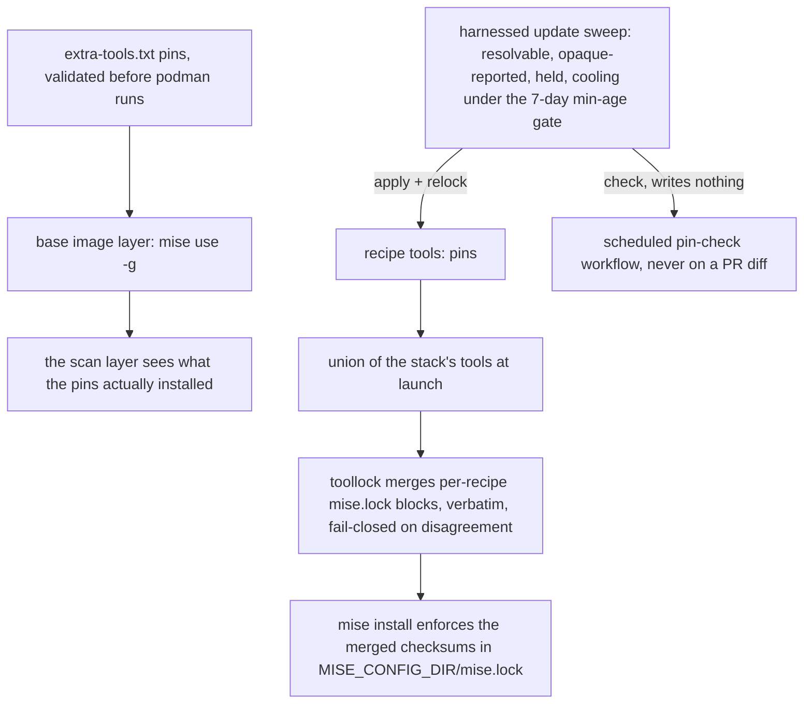
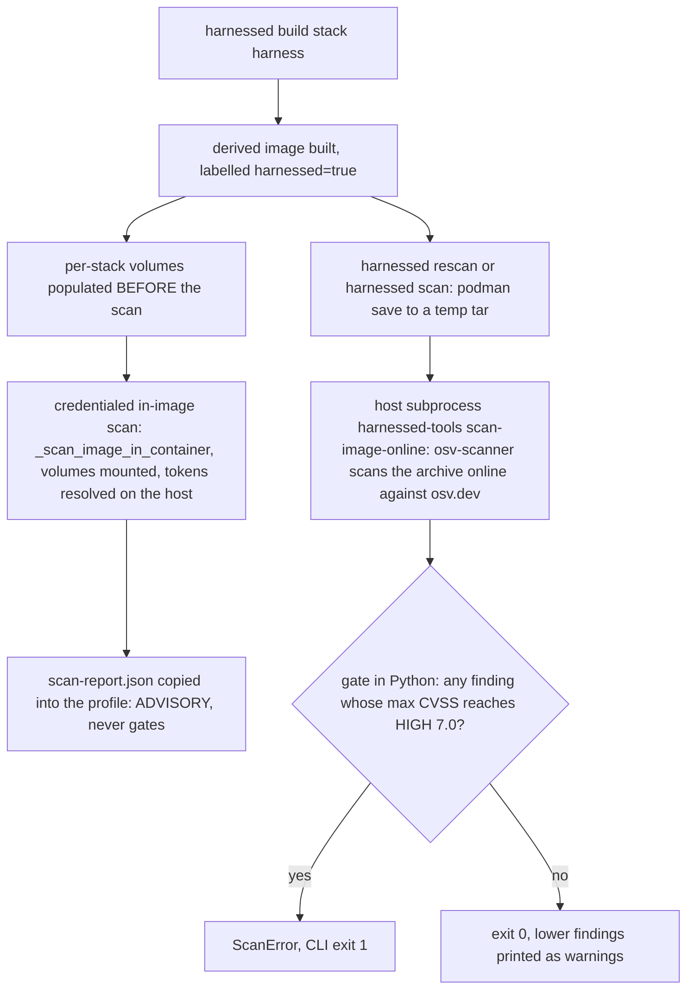
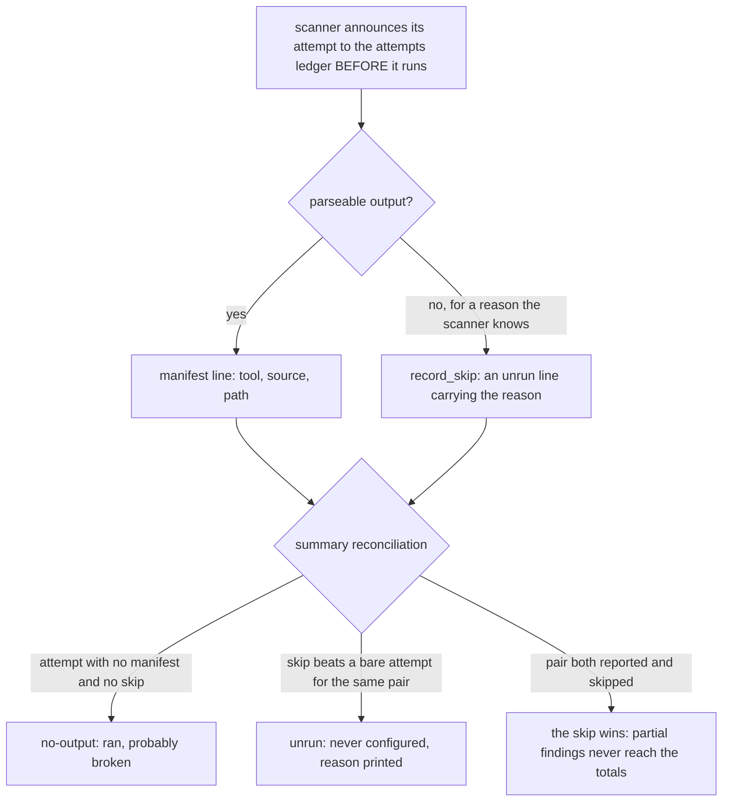

# Supply chain and pinning: what ships, how it is pinned, and how it is scanned

Everything harnessed installs from the outside world arrives through one of a handful of pin
surfaces, and every one of them is *closed* — a floating reference is rejected before anything
downloads. This page covers the pinning half first (what is pinned where, how per-recipe
`mise.lock` checksums are enforced at launch, and how `harnessed update` keeps pins from rotting),
then the scanning half that watches the result: `src/harnessed/scan.py` (the gate),
`catalog/base/harnessed-scan` (the in-image advisory pass), and the `rescan`/`scan` verbs in
`src/harnessed/launcher.py` that drive both — scheduled nightly by the two units in `systemd/`.

## Part I — Pinning

### The pin surfaces and their fail-fast gates

There are four places a version string can live, and each has a gate:

1. **Recipe `tools:`** (`recipe.yaml`) — `schema._parse_tools` rejects a spec with no `@`
   (`"@" not in spec`), so `npm:context-mode@1.0.169` and `pulumi@3.251.0` are the only legal
   shapes. `@latest` is equally illegal.
2. **`extra-tools.txt`** — `catalog/base/extra-tools.default.txt` is the template (seeded to
   `~/.config/harnessed/extra-tools.txt` on first build); `schema.parse_extra_tools` holds it to
   the same rule. The motivating failure (bd harnessed-2o9) is the file's own header comment: a
   bare name is not "unversioned", it is `@latest` resolved at build time — the most floating
   form the file can hold — and on 2026-08-06 it broke the base image outright, because *absence
   of a version reads as "nothing to validate"* to any check looking for a floating marker.
3. **Image layers** (`catalog/base/Dockerfile.harnessed-base`) — the runtimes
   (`node@22 pnpm@11 python@3.12 bun@1.2 rust@1.87 go@1.24 gh@2.96.0`), the node-bundled npm
   self-upgraded to a *patched, pinned* `npm@11.18.0` (a self-upgrade is the only way to move what
   the scan sees under `lib/node_modules`), `socket@1.1.143` and
   `@drmikecrowe/hatago-mcp-hub@0.1.2` via `pnpm add -g`, and corepack *deleted* rather than
   acknowledged — the findings go away because the code does, and the deletion layer proves it
   happened (resolve `mise where node@22`, refuse an empty answer, then `! command -v corepack`)
   because `rm -rf` on a missing path returns 0.
4. **Per-recipe `mise.lock`** — checksum-verified bytes per platform, covered next.

The extra-tools gate runs **on the host, before podman is invoked**: the base build stages its
context through `launcher._staged_build_context`, which parses the file and raises
`PinValidationError` naming the *user's* file (`~/.config/harnessed/extra-tools.txt`) and the
recovery ("delete it and rebuild"), not the "do not edit" template. Before that guard existed an
unpinned entry surfaced as `exit status 123` from inside a RUN layer, naming nothing.

### The guard/build agreement invariant

The build's extra-tools step is a shell pipeline —
`grep -v '^\s*#' | grep -v '^\s*$' | awk '{print $1}' | xargs -r mise use -g` — so the Python
validator and awk must agree on what an entry *is*, or a file can pass every check and still kill
the image. `tests/test_extra_tools_pins.py` enforces this the strong way: it **reads the pipeline
out of the real Dockerfile** (anchored on the literal `/tmp/extra-tools.txt` COPY target, cut at
`xargs`) and runs it, so editing the Dockerfile breaks the tests rather than letting them drift.
The agreement rules that fell out of real defects:

- CRLF files must not hand mise `bat@0.26.1\r` (awk does not treat `\r` as a separator);
- a UTF-8 BOM is stripped once and only once;
- **printable ASCII only** (SPEC amendment 2): the characters `str.splitlines()` breaks on that
  awk's record separator does not (`\x0b`, `\u2028`, `\u2029`, …) are *refused*, not folded — awk
  would read `bat@0.26.1\u2028dua@2.41.1` as ONE tool name, so there is no reading of the file both
  sides agree on, and failing closed is the only answer that cannot silently install the wrong
  thing. The rule is "agree, or refuse — never diverge", asserted as a property for the whole
  class, not per-defect.

The regression gate on the shipped template (`test_the_shipped_default_passes_its_own_validator`)
holds the *real* `extra-tools.default.txt` to the rule (a fixture copy would defeat the point),
and its dua entry is asserted on **presence and pinned-ness, never the version number** — an early
literal `dua@2.41.1` assertion turned red on a routine 2026-09-14 bump to 2.44.0 with nothing
wrong, so the gate now proves "dua is still listed and still carries a version".

### toollock: per-recipe checksums, merged at launch

A stack's tool set is the **union** of its recipes' `tools:`, composed at launch — but the
checksums are authored per **recipe**, as a `mise.lock` beside `recipe.yaml`
(e.g. `catalog/recipes/tokensave/mise.lock`: version, per-platform `sha256`, and download URL for
`github:aovestdipaperino/tokensave@7.12.1`). `src/harnessed/toollock.py` merges the lockfiles of
the recipes a stack actually uses. Four facts were measured against a real mise before any of this
was written (module docstring), because each would otherwise have produced a mechanism that
verifies nothing:

1. **mise ENFORCES the lockfile** — a wrong checksum fails `mise install` with `Checksum
   mismatch`, exit 1. Without this the feature is decorative.
2. **The file must be named `mise.lock`** — `$MISE_CONFIG_DIR/config.lock` and
   `config.toml.lock` are *silently ignored*: install exits 0 on a corrupted checksum. This is
   the failure the wiring most needs to avoid, which is why both install paths set
   `MISE_CONFIG_DIR` explicitly and write the lock there by exact name.
3. `mise lock` refuses to generate one for a global config, so assembly cannot shell out — the
   merge is harnessed's to perform.
4. Each tool's tables are contiguous, so **verbatim block extraction** is safe: unknown future
   fields are copied through untouched rather than lost to a re-serialisation (mise owns this
   format). The block splitter recognises both quoted (`tools."npm:x"`) and bare (`tools.pulumi`)
   paths — requiring the quoted form dropped `pulumi` and all seven of its platform checksums,
   a fail-open in the middle of the mechanism whose job is to fail closed.

Merge semantics, all fail-closed where it matters:

- **Identical blocks for the same spec merge to one entry** (two recipes pinning the same tool is
  ordinary); **differing blocks raise `ToolLockError`** — "one tool cannot have two sets of bytes
  in one stack" — surfaced as an error naming both recipes, and the whole install exits 1.
- A lockfile that is not valid TOML is rejected before merge: a broken file would otherwise be
  concatenated into the stack's and break every tool in it, not just its own.
- **An empty body REMOVES** `mise.lock` from the config dir rather than declining to write — a
  leftover lockfile from a previous recipe list would keep asserting checksums for tools the stack
  no longer installs.
- A recipe that ships no lockfile is not an error: enforcement is per-tool, so adoption is
  incremental and an absent lock means "these tools install unverified, as they always have".

Both install paths do the merge (`tests/test_toollock_wiring.py` asserts the merged file reaches
exactly where mise will read it, in each mode, and is removed again when a stack no longer has
one):

- **Container path** (`volumes.py`): the merged body is passed as env `HARNESSED_TOOL_LOCK` and
  `printf %s`'d into `$MISE_CONFIG_DIR/mise.lock` by the same shell that runs
  `mise use -g … && mise install` — interpolated into `-c` rather than the argv, because
  hand-quoting a multi-line TOML body has an arbitrary-code-shaped failure mode. The config dir is
  ephemeral by design: only the *installed tools* persist in the volume; the lock only has to
  exist during `mise install`.
- **Host path** (`hostrun.py`): `toollock.write_stack_lock` writes (or removes) the file into the
  redirected `MISE_CONFIG_DIR` **before** the install runs.

### `harnessed update`: the staleness sweep

Pinning trades a broken build for a silently rotting one, so `src/harnessed/update.py` sweeps
every pin surface and offers bumps. Its classification rules (each pinned by a test class in
`tests/test_update_pins.py`):

- **RESOLVABLE vs OPAQUE.** `tools:` and extra-tools entries name their backend, so the latest
  version is a registry lookup (npm/PyPI/GitHub/mise registry; a scoped npm package keeps its
  slash unescaped and its version splits at the **last** `@`). `install.cache` keys, shell-var
  SHAs in `install.sh`, and Dockerfile `ARG REF=` literals are opaque — machine-unresolvable, but
  **reported, never silently skipped**: a pin the tool quietly drops reads as "everything is
  current", which is worse than no tool. Opaque pins are also never auto-rewritten — there is no
  safe automated edit for a ref buried in shell.
- **The sweep covers four sources, not one.** Beyond recipe `tools:`, `build_report` also sweeps
  **agent manifests** (`agent.yaml` pins live in `build_args.<KEY>.value`, not inside a spec
  string — A7: agent manifests own their pins too, and used not to be swept at all, which is how
  three agents reached main with genuinely unpinned downloads), the **tracked extra-tools
  template** `catalog/base/extra-tools.default.txt` (deliberately the tracked file, not the
  user's host `~/.config/harnessed/extra-tools.txt` — a bump must land as a reviewable diff, and
  the host file is nobody's to rewrite; an unpinned entry there is skipped *entry by entry* so
  one bad line cannot blind `--check` to the other fourteen, bd harnessed-2o9), and a declared
  **`unpinnable`** backend, which is sorted into its own bucket *before* the resolvable check so
  "we said this cannot be pinned" is never misread as "the resolver failed". Every extra source
  rides the same classification path — same cooldown, same hold semantics, same buckets — because
  a pin reported differently from every other pin is a pin nobody trusts.
- **HELD.** A `hold:` on a `tools:` entry or an `install.hold` on a script (the motivating case is
  skill content no scanner vets) makes its pins informational: listed with the newer ref, never
  offered for bumping, never failing `--check`. Without that, a deliberately frozen pin makes CI
  permanently red and the hold is worthless.
- **Version order is numeric, not lexicographic** (`1.9.0 < 1.10.0`), a leading `v` is ignored,
  and a release outranks its own prerelease — so a bump is never a silent downgrade. A pin *ahead*
  of the registry is not stale.
- **Resolver failures and unknown packages are `unresolved`, never `current`** — a registry
  timeout must never read as up-to-date. A newer release whose backend gives **no publish date**
  (and has no dated sibling to offer) is also `unresolved` ("review it by hand"), because its age
  cannot be checked against the minimum-release-age gate — with one exception: a *harness* pin
  (see below) is offered undated-newest flagged `fresh`.

### The minimum-release-age gate (pnpm `minimumReleaseAge`)

A bump is offered only from releases at least `DEFAULT_MINIMUM_RELEASE_AGE_MINUTES = 10080`
(**7 days**; launcher exposes `--minimum-release-age`, 0 disables the gate) — modelled on pnpm's
`minimumReleaseAge` on the theory that a compromised or broken publish is usually yanked within
days. The 7-day default (pnpm uses 1) is measured, not guessed: on 2026-07-25 all five pins the
command offered were younger than a week, two of them hours old. Crucially a too-fresh *newest*
release does **not** mean "no update": the newest release that *is* old enough is offered instead,
and the newer one it passed over is named in the finding (`skipped_newer`) — refusing outright
would leave a stale pin stale for a week even when a mature intermediate release exists. A pin
whose only newer candidates are all too fresh lands in a separate **`cooling`** bucket, and
`apply` refuses cooling pins even if a caller passes the wrong bucket, so the cooldown cannot be
raced. A newer release with no publish date is `unresolved` ("review it by hand") *when every*
newer candidate is undated — the age guarantee cannot be honoured for a release whose age is
unknown, and harnessed deliberately diverges from pnpm's
`minimumReleaseAgeIgnoreMissingTime=true` here because every registry it queries is public and
does supply dates.

**Harness pins are the exception** (owner decision 2026-09-23: "a harness tracks its vendor's
latest — we need to trust their release process"). Pins discovered from agent manifests carry
`pin.harness = True` and ride `HARNESS_MINIMUM_RELEASE_AGE_MINUTES = 2880` (**2 days**), and that
window is a *preference, not a gate*: when every newer release is younger than it — or undated —
the newest is offered anyway and flagged **`fresh`**, rendered with its age ("inside the harness
release-age window, offered because a harness tracks its vendor's latest") and carried into the
accept prompt, so accepting it is a decision, not a surprise. Harness pins therefore never park in
`cooling`; recipe and extra-tools pins keep the full 7-day gate in the same report. An explicit
`--minimum-release-age` overrides **both** windows, preserving the flag's pre-split one-knob
contract (launcher passes it as `minimum_release_age_minutes` *and*
`harness_minimum_release_age_minutes`). `build_report` picks the window per pin inside the loop
(`harness_age if pin.harness else minimum_release_age_minutes`), so the split lives entirely in
`_select`'s caller, and the hold still outranks both windows — a held pin is never offered
whatever its age. Both halves — the pnpm-style "newest old-enough wins" selection and the harness
exception — are pinned by `tests/test_update_release_selection.py` and
`TestHarnessesTrackLatest` in `tests/test_update_cooldown.py`; the general cooldown behaviour
(withholding, `cooling` never failing `--check`, `apply` refusing the bucket) lives in the same
file's `TestCooldownWithholdsFreshReleases`.

`--check` is the CI mode: it writes nothing and exits non-zero only for a pin that is stale AND
resolvable AND unheld AND past the cooldown (extra-tools pins included) — building a report must
leave the catalog byte-identical. Unresolved pins
alone do not fail the check, because every recipe with a Dockerfile literal has one; failing on
them would make CI permanently red and teach everyone to ignore it. The workflow placement
(`.github/workflows/pin-check.yml`, guarded by `tests/test_ci_pin_check_workflow.py`) is itself a
design decision: `harnessed update --check` resolves **live registries**, so its result depends on
what third parties published today — wired to `pull_request` it would fail an unrelated
contributor's branch unfixably by the author. It therefore runs on `schedule` and
`workflow_dispatch` only, never on a diff (the tests assert that adding `pull_request:`/`push`
breaks a test, not a contributor's PR); the hermetic test suite, whose result depends only on
the diff, still gates PRs. Three further facts about the scheduled run:

- It is **weekly** (Mondays 06:00 UTC, `0 6 * * 1`), not daily: the gate already refuses anything
  published in the last 7 days, so a daily run would re-report the same pins six times before any
  of them is offerable.
- It invokes `harnessed update --check --fail-on major` (#469): the scheduled check fails **only
  when a stale pin's offered bump crosses a major version boundary** (`Report.check_exit_code`
  with `fail_on="major"`, `update.is_major_bump`) — a weekly check failing on ANY drift made red
  its normal state (eight consecutive red weeks carried no signal). Minor and patch drift is
  still listed in the run's output and bumped on the roadmap's wave cadence; `"any"` remains the
  default for the interactive caller and the existing tests.
- The runner installs **mise** before the check, because bare `tools:` entries with no backend
  prefix (currently `pulumi`) resolve through `mise registry` to the dated GitHub releases of the
  aqua/ubi/github repo backing them — without mise those pins degrade to `unresolved`, reported
  but unchecked, quietly shrinking what the sweep covers.

On accept, `apply` rewrites the pin **in place**: recipe YAML goes through a ruamel round-trip
that preserves comments and reflows nothing (a bump must produce a one-line diff), extra-tools
goes through a line rewriter that keeps trailing comments, blank lines, and neighbouring entries
untouched, does not match a shared-prefix neighbour (`dua` must not rewrite `dua-cli`), and
rewrites only the *entry* — the same text recurring in a comment is prose. A recipe that ships a
`mise.lock` is **relocked in the same write** (`update._relock_recipe`): a bumped pin beside a
stale lock forces mise to migrate the lock at install time, re-resolving every platform and
tripping mise's provenance-downgrade guard on machines that bumped nothing — reported as a
supply-chain alarm for a release that is in fact attested. A recipe shipping no lockfile relocks
nothing; inventing one would fabricate a supply-chain claim nobody authored. The relock runs
against a **copy in a temp dir** (`mise lock` writes into its config root, so a crash must not
leave a stray `mise.toml` in `catalog/`, which ships inside the wheel) on a 900s budget —
`mise lock` downloads each platform's artifact to verify provenance — and relocks are collected
into a set and run **after** the bump loop, once per manifest against the finished recipe (three
bumped entries must regenerate the lock once, not three times against half-bumped YAML).

### The bump flow: one rewriter per pin shape, then verify before committing

`apply` dispatches on *where the version lives*, and the failure mode that shaped it is precise:
a pin whose version is a **field** rather than a substring of a spec needs its own round-tripping
rewriter, and a pin kind without one produces a bump that is *offered, accepted, reported as
successful, and never written* — that is exactly how agent pins (`_rewrite_agent_build_arg`) and
`install.refs.<key>.ref` pins (`_rewrite_install_ref`) were both missed. The dispatch itself is an
**allow-list, not an else-branch**: `.yaml/.yml` goes to the ruamel round-tripper, `extra-tools*`
to the plain-text line rewriter, and anything else is skipped — a fallback would let the next
resolvable pin kind inherit a naive line-edit of a file nobody chose. All YAML rewriters run with
`width = 4096` and `indent(sequence=4, offset=2)` so a bump is a **one-line diff** (ruamel's
defaults re-wrap 80-col scalars and re-indent every list), and `_match_v_prefix` rewrites
`latest` to whatever `v`-prefix convention the pin itself already used — a GitHub release answers
with its TAG, and `pulumi@3.251.0` must not become `pulumi@v3.254.0`. Field-valued pins are
dispatched *first*, by `pin.key` plus the manifest name (`agent.yaml` →
`_rewrite_agent_build_arg`, `recipe.yaml` → `_rewrite_install_ref`), before the spec-string
allow-list runs; and the agent rewriter **validates the new value before writing it**
(`_require_immutable_build_arg`): a resolver that answers with a channel ("nightly") is declined
with `False` rather than persisted, because a manifest that was valid a moment ago must not fail
at the *next* build's schema gate.

When anything was written, the launcher prints the **verify-before-commit block** (bd
harnessed-czo): the bumped recipes, the affected stacks (`update.affected_stacks` — a stack lists
its recipes flatly, so "rebuild the affected stacks" is a lookup, not a guess; a stack with no
declared `harnesses:` still gets a line with a `<harness>` placeholder, because dropping it would
hide a real dependency of the bump), and the literal commands, one per stack and harness:

```
harnessed build <stack> <harness> && harnessed test <stack> <harness>
```

The rationale is the repo's own rule: a bumped pin is a code change like any other, and an
unverified bump is worse than a stale one — naming the stacks and printing the literal commands is
the difference between a reminder and a task the user has to go research. The same reasoning puts
the pin check in `tools/preflight.sh` as an **opt-in** gate (`--all`, network-bound and slow):
irrelevant to most diffs, but the one to run before pushing a `catalog/` change.



*Figure: the pin surfaces, the launch-time lockfile merge mise enforces, and the sweep that keeps
the pins from rotting.*

### What the pin check proves

The pin hygiene lint (`tests/test_recipe_pin_hygiene.py`, AC-1 "one pin, one place") holds that
every upstream version/ref string appears exactly once per recipe: an `install.sh` shell literal
whose value equals a version the same recipe's `tools:` already pins is a second source of truth
kept in sync only by a comment, and comments do not fail builds. The exemption allowlist is
asserted to contain only recipes that still duplicate — an allowlist that outlives its reason is
how a lint stops meaning anything. And the convention reaches the test suite itself: live-contract
fixtures pin their images (`alpine:3.20`, "Pinned — project hygiene forbids a floating tag"),
because those tests exist to prove external output *formats*, and a floating tag would let the
thing under test change out from under the assertion.

## Part II — Scanning

The scan layer is `src/harnessed/scan.py`, `catalog/base/harnessed-scan`, and the
`rescan`/`scan` verbs in `src/harnessed/launcher.py`, scheduled nightly by the two units in
`systemd/`. Its job: no built image ships a HIGH+ (CVSS ≥ 7.0) advisory without somebody seeing it,
and a scanner that silently did nothing never reads as a clean result.

The single most misread fact about this layer is **where it runs**, so it comes first.

## Placement: build → scan, never a Dockerfile stage

**The derived Dockerfile has no scan layer at all.** There is no build-time scan stage to describe:
the pipeline is *build, then scan* — the image is assembled by `podman build`, and every scan runs
afterwards, host-side, against the finished image.

- `emit.write_derived_dockerfile` emits recipe `env:` and system-level recipe bodies and nothing
  else — with an explicit **NO SCAN LAYER** comment (bd harnessed-8px.21.5). `assemble` carries the
  same note (ASM-03): the scan moved to the credentialed post-build pass, which is the only one that
  has tokens and the only one that can see the stack volumes; `HARNESSED_NO_SCANS` is honoured there.
- Why the layer was removed: `harnessed-8px.21.4` moved `tools:`/`install:` out of image layers into
  per-stack volumes (a one-line recipe edit cost a measured **307s** layer commit against 4.3s for
  the same install natively). Once installs left the image, the baked scan layer scanned an image
  containing no stack content and still printed "no high/critical advisories" — off 1 of 4 scanners,
  with osv reporting "no skills/ or commands/ dir to scan". A green-looking result covering almost
  nothing is worse than no result (`launcher._build_derived_image`'s docstring records the history).
- `_build_derived_image` is deliberately credential-free — it never passes a secret — so recipe
  verification never depends on 1Password being authorized. Nothing in the `podman build` resolves a
  scanner token, and no scanner token is ever resolved from inside an image layer.
- A few older comments (the base Dockerfile's scanner-install comment, `harnessed-scan`'s header)
  still call the script the image's "final RUN layer". `emit.write_derived_dockerfile` and the
  ASM-03 note are the source of record: that layer is gone, and the invocation is post-build.

What *is* baked, once, in `Dockerfile.harnessed-base`: the four scanners (`mise use -g uv
osv-scanner`, `uv tool install pip-audit`, `pnpm add -g snyk socket@1.1.143`) plus the
`harnessed-scan` script at `/usr/local/bin/harnessed-scan` — so a scan never needs a network
install at scan time.

`harnessed build` then drives the scan itself as a **post-build step** (`_build_stack`): after the
derived image is built and after the per-stack volumes are populated, it runs the credentialed
in-image pass — unless `--no-security-scans` (`HARNESSED_NO_SCANS=true`) was given. `harnessed
rescan` / `harnessed scan` re-run the same passes later against already-built images. That is the
whole pipeline: **build → scan**, with the scan a host-side step, never a Dockerfile stage. (Where
this sits among the build's stages:
[the build pipeline](/openwiki/workflows/build.md).)

## The two passes per image

`_scan_image` runs two complementary passes per image and returns clean only when **both** are clean:

1. **Credentialed in-image scan** (`_scan_image_in_container`) — runs the image's own baked
   `harnessed-scan` in a throwaway container with scanner tokens injected as env. **Advisory**: it
   reports posture and never gates (`harnessed-scan` always exits 0). This is the *only* path on
   which snyk and socket actually run, because the build is credential-free. When the build drives
   it, the per-stack volumes are mounted in (`extra_args`) so the report covers what launch actually
   installs — an image-only scan still passes and still prints green while silently covering less,
   and a narrower scan that reports green is worse than a failing one.
2. **Online archive scan** (`scan-image-online` → `scan.run_image_scan_online`) — the host `podman
   save`s the image to a temp tarball and a host subprocess runs
   `sys.executable -m harnessed.cli scan-image-online <tar>`
   (the `harnessed-tools` CLI verb; the tar unlinked in a `finally`). osv-scanner scans the archive
   with the offline build-time DB flags dropped, so it contacts **osv.dev** and sees advisories
   disclosed *since* the build. **Gates** on HIGH+.
   No daemon-in-container, no API socket (design §15 / D-12) — the archive *is* the interface
   between the runtime and the scanner.

   The invocation is `sys.executable`, not an interpreter resolved by name, for the same reason
   `harnessed test` carries at length (#460): this process *is* harnessed, so its own interpreter
   imports `harnessed.cli` by construction and already has every declared runtime dependency,
   `ruamel.yaml` included. The old line spelled a checkout — `uv run --no-project` plus
   `PYTHONPATH=<root>/src` — and died in every installed copy with
   `ModuleNotFoundError: No module named 'harnessed'`, hidden on developer machines because
   `--no-project` *borrows* an activated virtualenv (#493).



*Figure: the two per-image passes. The in-container pass is credentialed and advisory; the archive
pass is credential-free but online, and it is the only pass that can abort anything.*

### Surfacing the report — the credentialed one wins

`harnessed-scan` writes its consolidated report to `~/.harnessed/scan-report.json` in the container;
the launcher `cp`s it out to the stack profile. The credentialed report is treated as **authoritative**
(`keep_existing`): overwriting it with any image-baked, credential-free report would replace snyk /
socket findings with a report that structurally cannot contain them — the exact failure that once
produced a green "no high/critical" verdict on a build that had just reported 4 high (bd
harnessed-de7). Three mechanics enforce that:

- The scan container is **not** `--rm`: a removed container takes the credentialed report with it.
  It is kept just long enough to `cp` the report out, then removed in a `finally`. (`cp` rather than
  a bind-mount on purpose: the image runs as an unprivileged user, and host writes from a rootless
  container would need userns mapping this call site does not otherwise require.)
- The build **unlinks any previous `scan-report.json` before the re-scan**, so an old report can
  never pass for this scan's output.
- If nothing was scanned, `_surface_scan_report` says so — "no supply-chain report produced —
  nothing was scanned (set HARNESSED_NO_SCANS=false, or run `harnessed rescan <image>` with
  tokens)" — because a build that scanned nothing must not look identical to a build that scanned
  everything and found nothing.

Raw scanner JSON stays available behind `HARNESSED_SCAN_VERBOSE=1`.

## scan.py — the HIGH threshold is pure Python

The crux (RESEARCH Pattern 2 / Pitfall 3): **osv-scanner exits 1 on ANY finding and offers no
severity flag**. Its exit codes are 0 (clean), 1 (any finding), 127 (error), 128 (no packages found)
— so the exit code cannot decide HIGH. `_run` never raises on a non-zero scanner exit, and the
decision is taken in `gate()` over the parsed `--format json` output. `gate(osv_json)` is the
**only** HIGH decision point: it walks `results[].packages[].vulnerabilities[]` and returns every
finding id whose max CVSS ≥ `HIGH = 7.0`. An empty list is a pass.

The second non-obvious fact (RESEARCH A3, **verified against real findings 2026-06-15**):
osv-scanner's `severity[].score` is a CVSS **vector string**
(`"CVSS:3.1/AV:N/AC:L/PR:N/UI:N/S:U/C:H/I:H/A:H"`), not a number. `_max_cvss` therefore:

- takes a numeric score directly if one appears,
- otherwise computes the **CVSS v3 base score from the vector** (`_cvss3_base`: FIRST.org v3.1
  metric tables, the scope-changed impact formula, `_roundup` per the spec); an unparseable or CVSS
  v2 vector yields `None`,
- and if no CVSS is parseable at all, falls back to the advisory's qualitative
  `database_specific.severity` label band (`_LABEL_SCORE`: HIGH → 8.0, CRITICAL → 9.5, MEDIUM →
  5.0 …) — chosen conservative so a HIGH-*labelled* record still trips the gate rather than sailing
  under it.

What the gate then does with the result:

- **HIGH+ aborts**: `run_image_scan_online` raises `ScanError` naming the count and ids; the CLI
  (`harnessed-tools scan-image-online`) prints it and returns exit 1.
- **Below HIGH only warns**: the remaining finding ids come back as `ScanResult.warnings`, printed
  without failing — low/medium findings never red-line the run.
- **Exit 128 is preserved as its own investigate-branch**: it becomes a warning ("found no packages
  in image archive — investigate"), because a scan that forever sees no packages is the symptom of a
  scan that is not actually scanning anything.
- Any `SubprocessError`/`OSError` from the invocation itself becomes `ScanError`, not a traceback.

Every scanner invocation in scan.py is bounded at `_TIMEOUT = 300` seconds — source/image scans over
a manifest set are fast, and a stuck scanner must not hang the build (RESEARCH Project Constraint 6
/ Pitfall 6).

One scope note that matters when reading a red result: **only the online osv-scanner archive scan
can abort anything.** pip-audit's JSON carries no severity field at all, so its findings are counted
as `unknown` severity inside the always-exit-0 advisory summary and never reach `gate()` — the CVSS
≥ HIGH decision exists only in scan.py's Python gate over osv-scanner's `--format json`.

## harnessed-scan: advisory posture plus first-class coverage

`catalog/base/harnessed-scan` **always exits 0**. harnessed installs third-party agent tooling by
running upstream installers, whose JS trees almost always carry open HIGHs at any given moment — a
hard gate there would make the recipe system unusable. So this pass REPORTS posture; the gate lives
in the online archive pass. It scans:

1. mise-installed **node globals** (deduped via realpath),
2. **recipe node trees** under `~/.claude/skills/*/node_modules` and
   `~/.claude/commands/*/node_modules` — both via a *synthesized* `package.json` naming every
   on-disk package at its installed version, because an upstream-installed `node_modules` vendors no
   top-level manifest snyk or socket can see,
3. **osv-scanner** over recipe trees that ship a real lockfile (one recursive pass; it sees
   `bun.lock`/`package-lock` that the synthesized manifest misses),
4. **pip-audit** over the active Python env.

Each scanner's JSON has a dedicated parser normalizing severity vocabularies: snyk's `severity`
field, osv's per-group `max_severity` CVSS string, socket's vocabulary (which says "middle", not
"medium") with its `missingLockfile` alerts filtered out — those are an artifact of harnessed's own
synthesized manifest, not a property of the installed tree — and pip-audit, which has no severity
field and reports `unknown`. Findings are deduped per vulnerability id (snyk reports the same
vulnerability once per detected project); a finding with no usable id is counted under a synthetic
key rather than dropped — dropping it would be a silent under-count in a security scan, the one
direction this file must never fail in.

### Coverage is the feature

Every scanner announces its attempt to the **attempts ledger** *before* it runs, and a manifest line
is written only when parseable output appeared. The summary reconciles the two ledgers and
distinguishes two opposite kinds of "nothing":

- `no-output` — the scanner **ran** and produced nothing parseable → it is probably *broken*;
- `unrun` — it never started (no token, binary absent, timed out, nothing to scan) → it was never
  configured, and the recorded *reason* is what makes the row actionable ("set SNYK_TOKEN").

Conflating them either hides a broken scanner or cries wolf about a deliberately unconfigured one.
The reconciler's rules: an `unrun` line **beats** a bare attempt for the same (tool, source); a pair
that both reported and skipped yields **only** the skip, because every skip reason means the run did
not complete and any output it left is partial — partial findings must not reach the totals as a
finished result; and zero reporting scanners prints `NO COVERAGE — 0 scanners produced output. This
is NOT a clean result.` Even a green line says out loud how many scanners contributed nothing — "a
green line earned by 1 of 6 scanners is a FALSE clean", said right where the reassuring sentence is.



*Figure: harnessed-scan's coverage accounting — every committed attempt must resolve to a manifest
line or a reasoned skip, and absences become named rows instead of silence.*

Two scanner-level details back the same theme. The in-image osv pass handles exit codes **verified
against osv-scanner 2.5.1** rather than assumed: 128 ("No package sources found") is recorded as a
*reasoned skip*, not a broken scanner — left to fall through it writes no manifest line and the
reconciler can only read that as broken — while 127 deliberately keeps falling through, since a
broken invocation is exactly what that bucket is for. And the invariant every scanner must hold: a
path that bails early *for a reason the scanner itself knows* must call `record_skip` before
returning, because an attempt with no result and no reason reads as "ran and produced nothing",
i.e. broken. (Reaching the end with an empty output file is deliberately *not* covered — that is a
scanner that genuinely ran and yielded nothing, the definition of `no-output`.)

Per-scanner bounds: each call runs under `timeout -k 10 "$SCAN_TIMEOUT"` (`HARNESSED_SCAN_TIMEOUT`,
default 120s), and `timeout`'s 124 is turned into an explicit "timed out" skip — the summary must
say a scanner was cut off, never silently report it as having contributed nothing.

### Acknowledged advisories, not suppressed ones

Advisories with no patched release anywhere upstream are **ACKNOWLEDGED, never suppressed**: every
hit is counted, printed by name, and written to `scan-report.json` under `acknowledged`, while being
excluded from the totals. The list is keyed by **advisory id** (which makes it self-expiring — a
fixed release stops emitting the id, and a NEW advisory against the same package is not in the map
and reports at full severity), with the package name as a second *necessary condition* that can only
narrow the match, never a package-name key — that would blind the scan to the next CVE in the same
dependency. The current entries (brace-expansion < 5.0.9, bundled by every npm release) carry their
own re-check instruction and were **verified 2026-08-22** against npm 11.18.0, 11.19.0, and 12.0.2.

### Untrusted input at both sinks

Everything a scanner emits is third-party input that reaches a build console and
`scan-report.json`, so the summarizer sanitizes at both sinks: package names and advisory ids are
filtered to printable characters and length-bounded, and snyk's `identifiers` map is handled
defensively (a bare string, a number, or a nested list are all valid JSON). That defense has
nowhere to land: the surrounding bash runs `set -uo pipefail` *without* `-e`, so a Python exception
would kill the summarizer, skip the report entirely, and the script would still exit 0 looking like
it had nothing to say.

The ledgers themselves are a hand-rolled `|`-separated format with no escaping, parsed by
`split("|", 3)`. The bash writer strips `|` from every field at a single choke point (`nosep`),
because one label is `recipe: $(basename …)` — a directory name a recipe controls; the Python parser
deliberately does not *depend* on that guarantee, and `maxsplit=3` keeps the whole tail as the
reason.

## Where the tokens come from

Scanner tokens are **env-only, never a build-arg** (so never baked into image history).
`_scan_image_in_container` resolves them **on the host** via
`_resolve_launch_secrets(project_path=None)`: the user-global `~/.config/harnessed/.env.schema`
through varlock, else a bare `.env` read literally — this global layer is the *sole* source of
scanner tokens for a rescan — and hands podman a mode-0600 temp `--env-file`, unlinked afterwards.
varlock never runs in-container (1Password app-auth binds the grant to the calling host
application). **Project env is deliberately not layered in**: a rescan is about the image, not about
whichever directory you are standing in.

Two adapter details: `harnessed-scan` accepts `SOCKET_SECURITY_API_KEY` as an alias for
`SOCKET_CLI_API_TOKEN` (what Socket's GitHub Action and older harnessed docs used; the canonical
name wins when both are set), and socket needs an org slug it would normally read from
`~/.config/socket` — which a container does not have — so it derives one from the token (one
memoized API call; an explicit `SOCKET_CLI_ORG_SLUG` wins). With no env file at all, the pass *says
so* — "snyk and socket have no tokens and will be skipped (osv-scanner + pip-audit still run)" —
because silence there reads as "snyk ran and found nothing". (The env-file machinery itself:
[credentials](/openwiki/concepts/credentials.md).)

## The nightly re-scan and its timer

`systemd/harnessed-rescan.timer` fires `~/.local/bin/harnessed rescan` daily (`OnCalendar=daily`,
`Persistent=true`) via the oneshot `harnessed-rescan.service` — the SEC-04 nightly. Two operational
facts the units themselves record:

- **`loginctl enable-linger $USER` is a prerequisite.** Without it the *user* systemd instance is
  torn down on logout and the timer does not fire while you are logged out — the nightly simply
  stops happening.
- The service **requires network egress to osv.dev at scan time**. The online DB is the whole point:
  the build-time DB only knows about CVEs at build time, so a stale-DB nightly would see nothing new
  forever — that vacuous "0 findings" is exactly the Pitfall 6 warning sign.

`harnessed rescan [image]` re-scans one named image or **every image carrying the `harnessed=true`
label** (`podman images --filter label=harnessed=true` — the label `_build_derived_image` sets for
exactly this purpose). The image listing goes through `_listing`, which aborts on any non-zero
runtime exit, and that guard is load-bearing: an unanswered listing would print "nothing to rescan",
exit 0, and silently skip the whole nightly, indistinguishable from a nightly that keeps finding
nothing. `harnessed scan <stack> [harness]` scopes the same `_scan_image` to one stack, fanning out
over every *built* harness when the harness argument is omitted; any image failing either pass
exits non-zero. (The verb surface: [the CLI page](/openwiki/operations/cli.md).)

### The timeout ladder

Each rung is bigger than the one below it, with a different reason:

| Bound | Value | Owner | Why bounded |
|---|---|---|---|
| per scanner call, in-image | 120s (`HARNESSED_SCAN_TIMEOUT`, `timeout -k 10`) | `harnessed-scan` | one wedged scanner costs its own result, not the other three; `-k 10` because a real scan container once ignored SIGTERM |
| per scanner invocation, host-side gate | 300s (`scan._TIMEOUT`) | `run_image_scan_online` | source/image scans over a manifest set are fast; a stuck scanner must not hang the build (Project Constraint 6 / Pitfall 6) |
| whole scan container | 900s (`_SCAN_CONTAINER_TIMEOUT`) | `_scan_image_in_container` | backstop for the script wedging *outside* the scanners — one container ran **71 hours** at 0% CPU with no timeout above it (bd harnessed-8px.28) |
| online archive scan | 1800s (`_SCAN_ONLINE_TIMEOUT`) | `_scan_image` | network plus interpreter/module startup; bounded **because nobody watches** — an unattended hang wedges the timer silently and looks exactly like a nightly that keeps finding nothing |

## Related pages

- `/openwiki/workflows/build.md` — where the post-build credentialed scan sits in the build's stage
  order, and the volume population the scan mounts.
- `/openwiki/testing/verification-ladder.md` — what each gate (pin check, scan gate) proves, and
  what a green run does not.
- `/openwiki/operations/cli.md` — the `scan`/`rescan` verbs, the nightly timer's execution path, and
  the `harnessed-tools` entrypoints including `scan-image-online`.
- `/openwiki/testing/verification-ladder.md` — what each gate proves, and what a green run does not.
- `/openwiki/concepts/credentials.md` — the env-file machinery scanner tokens resolve through.
- `/openwiki/concepts/invariants.md` — the invariant catalog entry for the coverage ledger, and the
  catalog's other supply-chain surfaces (pin freshness via `harnessed update`, per-recipe
  `mise.lock` checksums via `toollock.py`).
