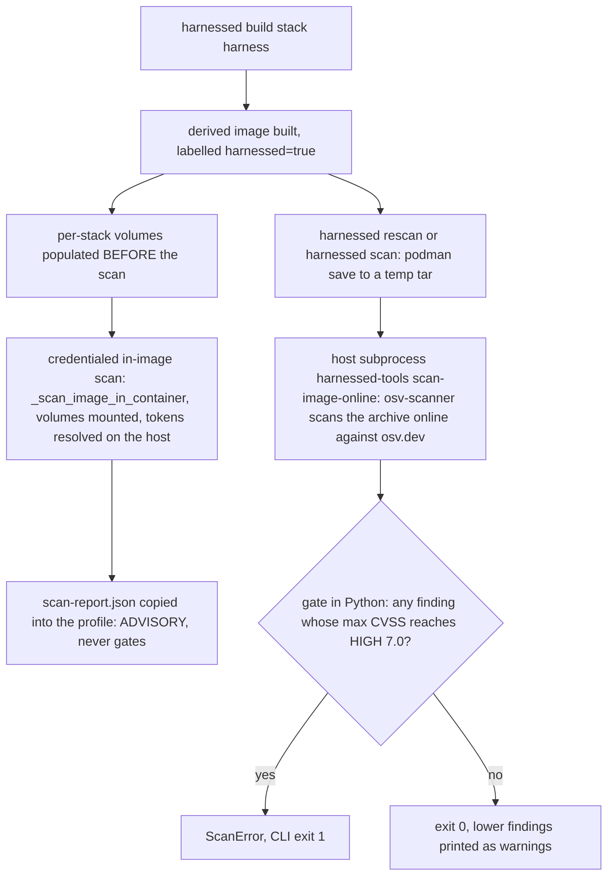
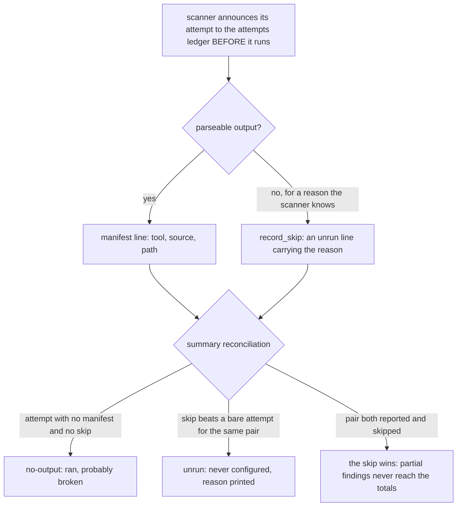
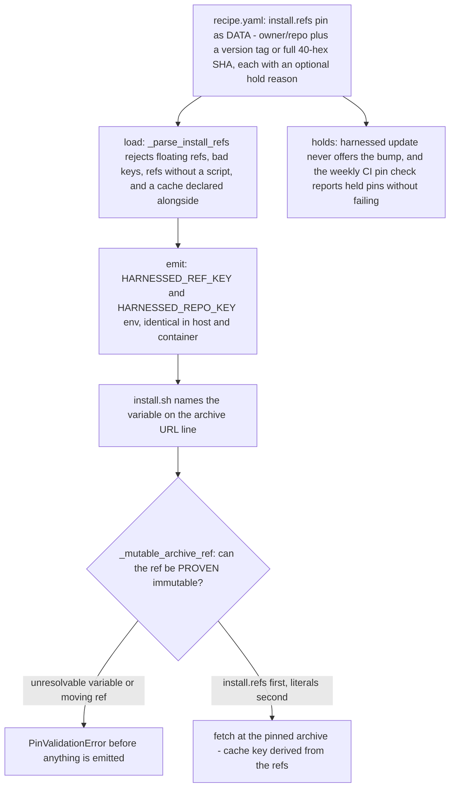

# Supply-chain posture: pins, scans, and advisory reporting

The posture has two halves answering two different questions. **Pins** constrain what a build is
allowed to fetch: every acquisition names something that cannot move, and content that *is*
instructions is additionally held against automatic bumps. **Scans** watch what got installed
anyway: an advisory credentialed pass in-image, plus the one online pass whose pure-Python CVSS
gate can abort. Neither half is allowed to fail in the reassuring direction — a pin that moved
never passes as pinned, and a scanner that silently did nothing never reads as a clean result.

The moving parts: `src/harnessed/schema.py` (pin validation and the `_mutable_*_ref` gates),
`src/harnessed/update.py` behind `.github/workflows/pin-check.yml` (pin freshness and holds),
`src/harnessed/scan.py` (the gate), `catalog/base/harnessed-scan` (the in-image advisory pass),
and the `scan`/`rescan` verbs in `src/harnessed/launcher.py` that drive both — scheduled nightly
by the two units in `systemd/`.

The single most misread fact about the scan half is **where it runs**, so it comes first.

## Placement: build → scan, never a Dockerfile stage

**The derived Dockerfile has no scan layer at all.** There is no build-time scan stage to describe:
the pipeline is *build, then scan* — the image is assembled by `podman build`, and every scan runs
afterwards, host-side, against the finished image.

- `emit.write_derived_dockerfile` emits recipe `env:` and system-level recipe bodies and nothing
  else — with an explicit **NO SCAN LAYER** comment (bd harnessed-8px.21.5). `assemble` carries the
  same note (ASM-03): the scan moved to the credentialed post-build pass, which is the only one that
  has tokens and the only one that can see the stack volumes; `HARNESSED_NO_SCANS` is honoured there.
- Why the layer was removed: `harnessed-8px.21.4` moved `tools:`/`install:` out of image layers into
  per-stack volumes (a one-line recipe edit cost a measured **307s** layer commit against 4.3s for
  the same install natively). Once installs left the image, the baked scan layer scanned an image
  containing no stack content and still printed "no high/critical advisories" — off 1 of 4 scanners,
  with osv reporting "no skills/ or commands/ dir to scan". A green-looking result covering almost
  nothing is worse than no result (`launcher._build_derived_image`'s docstring records the history).
- `_build_derived_image` is deliberately credential-free — it never passes a secret — so recipe
  verification never depends on 1Password being authorized. Nothing in the `podman build` resolves a
  scanner token, and no scanner token is ever resolved from inside an image layer.
- A few older comments (the base Dockerfile's scanner-install comment, `harnessed-scan`'s header)
  still call the script the image's "final RUN layer". `emit.write_derived_dockerfile` and the
  ASM-03 note are the source of record: that layer is gone, and the invocation is post-build.

What *is* baked, once, in `Dockerfile.harnessed-base`: the four scanners (`mise use -g uv
osv-scanner`, `uv tool install pip-audit`, `pnpm add -g snyk socket@1.1.143`) plus the
`harnessed-scan` script at `/usr/local/bin/harnessed-scan` — so a scan never needs a network
install at scan time.

`harnessed build` then drives the scan itself as a **post-build step** (`_build_stack`): after the
derived image is built and after the per-stack volumes are populated, it runs the credentialed
in-image pass — unless `--no-security-scans` (`HARNESSED_NO_SCANS=true`) was given. `harnessed
rescan` / `harnessed scan` re-run the same passes later against already-built images. That is the
whole pipeline: **build → scan**, with the scan a host-side step, never a Dockerfile stage. (Where
this sits among the build's stages:
[the build pipeline](/openwiki/workflows/build.md).)

## The two passes per image

`_scan_image` runs two complementary passes per image and returns clean only when **both** are clean:

1. **Credentialed in-image scan** (`_scan_image_in_container`) — runs the image's own baked
   `harnessed-scan` in a throwaway container with scanner tokens injected as env. **Advisory**: it
   reports posture and never gates (`harnessed-scan` always exits 0). This is the *only* path on
   which snyk and socket actually run, because the build is credential-free. When the build drives
   it, the per-stack volumes are mounted in (`extra_args`) so the report covers what launch actually
   installs — an image-only scan still passes and still prints green while silently covering less,
   and a narrower scan that reports green is worse than a failing one.
2. **Online archive scan** (`scan-image-online` → `scan.run_image_scan_online`) — the host `podman
   save`s the image to a temp tarball and a host subprocess runs
   `uv run --no-project --quiet --with ruamel.yaml python -m harnessed.cli scan-image-online <tar>`
   (the `harnessed-tools` CLI verb; `PYTHONPATH` pointed at the checkout, the tar unlinked in a
   `finally`). osv-scanner scans the archive with the offline build-time DB flags dropped, so it
   contacts **osv.dev** and sees advisories disclosed *since* the build. **Gates** on HIGH+.
   No daemon-in-container, no API socket (design §15 / D-12) — the archive *is* the interface
   between the runtime and the scanner.

*Figure: the two per-image passes. The in-container pass is credentialed and advisory; the archive
pass is credential-free but online, and it is the only pass that can abort anything.*

### Surfacing the report — the credentialed one wins

`harnessed-scan` writes its consolidated report to `~/.harnessed/scan-report.json` in the container;
the launcher `cp`s it out to the stack profile. The credentialed report is treated as **authoritative**
(`keep_existing`): overwriting it with any image-baked, credential-free report would replace snyk /
socket findings with a report that structurally cannot contain them — the exact failure that once
produced a green "no high/critical" verdict on a build that had just reported 4 high (bd
harnessed-de7). Three mechanics enforce that:

- The scan container is **not** `--rm`: a removed container takes the credentialed report with it.
  It is kept just long enough to `cp` the report out, then removed in a `finally`. (`cp` rather than
  a bind-mount on purpose: the image runs as an unprivileged user, and host writes from a rootless
  container would need userns mapping this call site does not otherwise require.)
- The build **unlinks any previous `scan-report.json` before the re-scan**, so an old report can
  never pass for this scan's output.
- If nothing was scanned, `_surface_scan_report` says so — "no supply-chain report produced —
  nothing was scanned (set HARNESSED_NO_SCANS=false, or run `harnessed rescan <image>` with
  tokens)" — because a build that scanned nothing must not look identical to a build that scanned
  everything and found nothing.

Raw scanner JSON stays available behind `HARNESSED_SCAN_VERBOSE=1`.

## scan.py — the HIGH threshold is pure Python

The crux (RESEARCH Pattern 2 / Pitfall 3): **osv-scanner exits 1 on ANY finding and offers no
severity flag**. Its exit codes are 0 (clean), 1 (any finding), 127 (error), 128 (no packages found)
— so the exit code cannot decide HIGH. `_run` never raises on a non-zero scanner exit, and the
decision is taken in `gate()` over the parsed `--format json` output. `gate(osv_json)` is the
**only** HIGH decision point: it walks `results[].packages[].vulnerabilities[]` and returns every
finding id whose max CVSS ≥ `HIGH = 7.0`. An empty list is a pass.

The second non-obvious fact (RESEARCH A3, **verified against real findings 2026-06-15**):
osv-scanner's `severity[].score` is a CVSS **vector string**
(`"CVSS:3.1/AV:N/AC:L/PR:N/UI:N/S:U/C:H/I:H/A:H"`), not a number. `_max_cvss` therefore:

- takes a numeric score directly if one appears,
- otherwise computes the **CVSS v3 base score from the vector** (`_cvss3_base`: FIRST.org v3.1
  metric tables, the scope-changed impact formula, `_roundup` per the spec); an unparseable or CVSS
  v2 vector yields `None`,
- and if no CVSS is parseable at all, falls back to the advisory's qualitative
  `database_specific.severity` label band (`_LABEL_SCORE`: HIGH → 8.0, CRITICAL → 9.5, MEDIUM →
  5.0 …) — chosen conservative so a HIGH-*labelled* record still trips the gate rather than sailing
  under it.

What the gate then does with the result:

- **HIGH+ aborts**: `run_image_scan_online` raises `ScanError` naming the count and ids; the CLI
  (`harnessed-tools scan-image-online`) prints it and returns exit 1.
- **Below HIGH only warns**: the remaining finding ids come back as `ScanResult.warnings`, printed
  without failing — low/medium findings never red-line the run.
- **Exit 128 is preserved as its own investigate-branch**: it becomes a warning ("found no packages
  in image archive — investigate"), because a scan that forever sees no packages is the symptom of a
  scan that is not actually scanning anything.
- Any `SubprocessError`/`OSError` from the invocation itself becomes `ScanError`, not a traceback.

Every scanner invocation in scan.py is bounded at `_TIMEOUT = 300` seconds — source/image scans over
a manifest set are fast, and a stuck scanner must not hang the build (RESEARCH Project Constraint 6
/ Pitfall 6).

One scope note that matters when reading a red result: **only the online osv-scanner archive scan
can abort anything.** pip-audit's JSON carries no severity field at all, so its findings are counted
as `unknown` severity inside the always-exit-0 advisory summary and never reach `gate()` — the CVSS
≥ HIGH decision exists only in scan.py's Python gate over osv-scanner's `--format json`.

## harnessed-scan: advisory posture plus first-class coverage

`catalog/base/harnessed-scan` **always exits 0**. harnessed installs third-party agent tooling by
running upstream installers, whose JS trees almost always carry open HIGHs at any given moment — a
hard gate there would make the recipe system unusable. So this pass REPORTS posture; the gate lives
in the online archive pass. It scans:

1. mise-installed **node globals** (deduped via realpath),
2. **recipe node trees** under `~/.claude/skills/*/node_modules` and
   `~/.claude/commands/*/node_modules` — both via a *synthesized* `package.json` naming every
   on-disk package at its installed version, because an upstream-installed `node_modules` vendors no
   top-level manifest snyk or socket can see,
3. **osv-scanner** over recipe trees that ship a real lockfile (one recursive pass; it sees
   `bun.lock`/`package-lock` that the synthesized manifest misses),
4. **pip-audit** over the active Python env.

Each scanner's JSON has a dedicated parser normalizing severity vocabularies: snyk's `severity`
field, osv's per-group `max_severity` CVSS string, socket's vocabulary (which says "middle", not
"medium") with its `missingLockfile` alerts filtered out — those are an artifact of harnessed's own
synthesized manifest, not a property of the installed tree — and pip-audit, which has no severity
field and reports `unknown`. Findings are deduped per vulnerability id (snyk reports the same
vulnerability once per detected project); a finding with no usable id is counted under a synthetic
key rather than dropped — dropping it would be a silent under-count in a security scan, the one
direction this file must never fail in.

### Coverage is the feature

Every scanner announces its attempt to the **attempts ledger** *before* it runs, and a manifest line
is written only when parseable output appeared. The summary reconciles the two ledgers and
distinguishes two opposite kinds of "nothing":

- `no-output` — the scanner **ran** and produced nothing parseable → it is probably *broken*;
- `unrun` — it never started (no token, binary absent, timed out, nothing to scan) → it was never
  configured, and the recorded *reason* is what makes the row actionable ("set SNYK_TOKEN").

Conflating them either hides a broken scanner or cries wolf about a deliberately unconfigured one.
The reconciler's rules: an `unrun` line **beats** a bare attempt for the same (tool, source); a pair
that both reported and skipped yields **only** the skip, because every skip reason means the run did
not complete and any output it left is partial — partial findings must not reach the totals as a
finished result; and zero reporting scanners prints `NO COVERAGE — 0 scanners produced output. This
is NOT a clean result.` Even a green line says out loud how many scanners contributed nothing — "a
green line earned by 1 of 6 scanners is a FALSE clean", said right where the reassuring sentence is.

*Figure: harnessed-scan's coverage accounting — every committed attempt must resolve to a manifest
line or a reasoned skip, and absences become named rows instead of silence.*

Two scanner-level details back the same theme. The in-image osv pass handles exit codes **verified
against osv-scanner 2.5.1** rather than assumed: 128 ("No package sources found") is recorded as a
*reasoned skip*, not a broken scanner — left to fall through it writes no manifest line and the
reconciler can only read that as broken — while 127 deliberately keeps falling through, since a
broken invocation is exactly what that bucket is for. And the invariant every scanner must hold: a
path that bails early *for a reason the scanner itself knows* must call `record_skip` before
returning, because an attempt with no result and no reason reads as "ran and produced nothing",
i.e. broken. (Reaching the end with an empty output file is deliberately *not* covered — that is a
scanner that genuinely ran and yielded nothing, the definition of `no-output`.)

Per-scanner bounds: each call runs under `timeout -k 10 "$SCAN_TIMEOUT"` (`HARNESSED_SCAN_TIMEOUT`,
default 120s), and `timeout`'s 124 is turned into an explicit "timed out" skip — the summary must
say a scanner was cut off, never silently report it as having contributed nothing.

### Acknowledged advisories, not suppressed ones

Advisories with no patched release anywhere upstream are **ACKNOWLEDGED, never suppressed**: every
hit is counted, printed by name, and written to `scan-report.json` under `acknowledged`, while being
excluded from the totals. The list is keyed by **advisory id** (which makes it self-expiring — a
fixed release stops emitting the id, and a NEW advisory against the same package is not in the map
and reports at full severity), with the package name as a second *necessary condition* that can only
narrow the match, never a package-name key — that would blind the scan to the next CVE in the same
dependency. The current entries (brace-expansion < 5.0.9, bundled by every npm release) carry their
own re-check instruction and were **verified 2026-08-22** against npm 11.18.0, 11.19.0, and 12.0.2.

### Untrusted input at both sinks

Everything a scanner emits is third-party input that reaches a build console and
`scan-report.json`, so the summarizer sanitizes at both sinks: package names and advisory ids are
filtered to printable characters and length-bounded, and snyk's `identifiers` map is handled
defensively (a bare string, a number, or a nested list are all valid JSON). That defense has
nowhere to land: the surrounding bash runs `set -uo pipefail` *without* `-e`, so a Python exception
would kill the summarizer, skip the report entirely, and the script would still exit 0 looking like
it had nothing to say.

The ledgers themselves are a hand-rolled `|`-separated format with no escaping, parsed by
`split("|", 3)`. The bash writer strips `|` from every field at a single choke point (`nosep`),
because one label is `recipe: $(basename …)` — a directory name a recipe controls; the Python parser
deliberately does not *depend* on that guarantee, and `maxsplit=3` keeps the whole tail as the
reason.

### The real-execution layer: tools/scan-real-run.sh

Unit tests say the code does what the tests claim; `tools/scan-real-run.sh` says what the **build
prints**. It runs the actual `catalog/base/harnessed-scan` against a fake `$HOME` and stub scanners
— osv-scanner stubbed to exit 128, snyk stubbed to report the two brace-expansion advisories every
published npm bundles — and asserts on the summary an operator reads: exit 0 whatever it found (the
scan is advisory and must never gate), the 128 recorded as a reasoned skip rather than a spurious
"produced NO parseable output" warning, the acknowledged advisories printed by name but excluded
from the totals, the all-clear line still reached, and `scan-report.json` agreeing with the printed
summary. Stubs rather than real scanners on purpose: snyk and socket need live credentials and
network, which a reproducible evidence command must not require.

## Where the tokens come from

Scanner tokens are **env-only, never a build-arg** (so never baked into image history).
`_scan_image_in_container` resolves them **on the host** via
`_resolve_launch_secrets(project_path=None)`: the user-global `~/.config/harnessed/.env.schema`
through varlock, else a bare `.env` read literally — this global layer is the *sole* source of
scanner tokens for a rescan — and hands podman a mode-0600 temp `--env-file`, unlinked afterwards.
varlock never runs in-container (1Password app-auth binds the grant to the calling host
application). **Project env is deliberately not layered in**: a rescan is about the image, not about
whichever directory you are standing in.

Two adapter details: `harnessed-scan` accepts `SOCKET_SECURITY_API_KEY` as an alias for
`SOCKET_CLI_API_TOKEN` (what Socket's GitHub Action and older harnessed docs used; the canonical
name wins when both are set), and socket needs an org slug it would normally read from
`~/.config/socket` — which a container does not have — so it derives one from the token (one
memoized API call; an explicit `SOCKET_CLI_ORG_SLUG` wins). With no env file at all, the pass *says
so* — "snyk and socket have no tokens and will be skipped (osv-scanner + pip-audit still run)" —
because silence there reads as "snyk ran and found nothing". (The env-file machinery itself:
[credentials](/openwiki/concepts/credentials.md).)

## The nightly re-scan and its timer

`systemd/harnessed-rescan.timer` fires `~/.local/bin/harnessed rescan` daily (`OnCalendar=daily`,
`Persistent=true`) via the oneshot `harnessed-rescan.service` — the SEC-04 nightly. Two operational
facts the units themselves record:

- **`loginctl enable-linger $USER` is a prerequisite.** Without it the *user* systemd instance is
  torn down on logout and the timer does not fire while you are logged out — the nightly simply
  stops happening.
- The service **requires network egress to osv.dev at scan time**. The online DB is the whole point:
  the build-time DB only knows about CVEs at build time, so a stale-DB nightly would see nothing new
  forever — that vacuous "0 findings" is exactly the Pitfall 6 warning sign.

`harnessed rescan [image]` re-scans one named image or **every image carrying the `harnessed=true`
label** (`podman images --filter label=harnessed=true` — the label `_build_derived_image` sets for
exactly this purpose). The image listing goes through `_listing`, which aborts on any non-zero
runtime exit, and that guard is load-bearing: an unanswered listing would print "nothing to rescan",
exit 0, and silently skip the whole nightly, indistinguishable from a nightly that keeps finding
nothing. `harnessed scan <stack> [harness]` scopes the same `_scan_image` to one stack, fanning out
over every *built* harness when the harness argument is omitted; any image failing either pass
exits non-zero. (The verb surface: [the CLI page](/openwiki/operations/cli.md).)

### The timeout ladder

Each rung is bigger than the one below it, with a different reason:

| Bound | Value | Owner | Why bounded |
|---|---|---|---|
| per scanner call, in-image | 120s (`HARNESSED_SCAN_TIMEOUT`, `timeout -k 10`) | `harnessed-scan` | one wedged scanner costs its own result, not the other three; `-k 10` because a real scan container once ignored SIGTERM |
| per scanner invocation, host-side gate | 300s (`scan._TIMEOUT`) | `run_image_scan_online` | source/image scans over a manifest set are fast; a stuck scanner must not hang the build (Project Constraint 6 / Pitfall 6) |
| whole scan container | 900s (`_SCAN_CONTAINER_TIMEOUT`) | `_scan_image_in_container` | backstop for the script wedging *outside* the scanners — one container ran **71 hours** at 0% CPU with no timeout above it (bd harnessed-8px.28) |
| online archive scan | 1800s (`_SCAN_ONLINE_TIMEOUT`) | `_scan_image` | network plus `uv run` dependency resolution; bounded **because nobody watches** — an unattended hang wedges the timer silently and looks exactly like a nightly that keeps finding nothing |

## Pin discipline: what the fetch may move on

The scan layer watches what got installed; the pin layer constrains what a build may fetch in the
first place. The rule: **every acquisition names something that cannot move** — a version tag or a
full 40-hex commit SHA — and content that *is* instructions is additionally **held** against
automatic bumps, because no scanner vets instructions. Enforcement is layered so the discipline
survives contact with real scripts:

- `tools:` entries are pinned mise specs (optional per-entry `hold:`), and an agent's `build_args`
  values are the single source of truth for its pinned tool versions — `unpinnable:` must concede
  each unpinned acquisition one entry at a time, never as a blanket excuse.
- `install.refs[]` carries content pins **as data in the manifest**. `_parse_install_refs`
  validates them at load, not at fetch: keys match `^[a-z][a-z0-9_]*$` so the key → env mapping
  stays a total `.upper()`; `repo` is `owner/repo`, never a URL (the script composes the URL, so a
  recipe switching from `git clone` to a tarball fetch needs no manifest change); `ref` must match
  `_IMMUTABLE_REF_RE` — a version tag or a full 40-character commit SHA, since a branch moves and an
  abbreviated SHA is not a stable identifier; and each ref may carry a `hold:` that must be a
  non-empty reason, because the reason is shown to whoever decides whether to lift it.
- `emit.install_env` renders each key to exactly `HARNESSED_REF_<KEY>` and `HARNESSED_REPO_<KEY>` —
  deterministically and totally, identical keys in host and container mode. The script reads pins
  from env and nothing else, with `:?` guards per variable: an unset ref means manifest and script
  disagree about the key name, and a default would paper over that by fetching the default branch.
- `install.cache` is **derived** from the refs — sha256 of the byte-order-sorted `key=repo@ref`
  renderings, first 16 hex — so declaring a hand-written `cache:` alongside `refs:` is a schema
  error, not a precedence rule (the hand-mashed key this replaced truncated three SHAs to 10 hex
  and drifted from every one of them). Declaring `refs` without `install.script` is also an error:
  the refs describe what a script fetches, and without one they are inert data `harnessed update`
  would still offer to bump.
- The text gates: `validate_pin` (recipe Dockerfiles, run from `assemble()` before anything is
  emitted) and `_lint_script_file` (over `install.script` / `setup.script` bodies, with the recipe
  threaded in) reject floating refs (`--branch main|master|HEAD`, `:latest`, `@latest`) and run the
  `_mutable_clone_ref` / `_mutable_archive_ref` / `_mutable_fetch_ref` gates. `_mutable_fetch_ref`
  walks `git fetch <remote> <ref>` token-by-token against a binary-audited option table and fails
  **closed** on any option it cannot interpret — "can't tell which token is the ref" and "it moves"
  have the same consequence. Routing every script-bearing field through `_lint_script_file` is what
  keeps a pin moved out of a Dockerfile into a `.sh` inside enforcement.

*Figure: the pin chain. The manifest owns the pin, the script owns the fetch, and the gate proves
the URL line still names an immutable ref before the build emits anything.*

### The archive gate resolves the pin it can now see

`_mutable_archive_ref` exists because an archive download is a clone by another spelling (bd
harnessed-po7): `curl …/archive/main.tar.gz` moves exactly as much as `--branch main`, and when the
bead was filed, swapping a SHA for `archive/main.tar.gz` left every pin test green. The gate matches
`github.com/…/archive/` and `codeload.github.com/…/(tarball|zipball|…)` URLs (codeload is the same
download under another hostname *and* is in the egress allowlist, so omitting it would leave a
reachable bypass) and asks whether each ref can be **proven** immutable:

- a `refs/tags/`-qualified ref passes (self-describing);
- a **named shell variable** (`$HARNESSED_REF_OAKOSS`) resolves one hop — against `install.refs:`
  FIRST, literal assignments in the same body SECOND, because the script's own assignment wins at
  runtime and precedence must mirror the shell's, not the author's intent — and then faces the same
  immutability test; a variable with no resolvable source is *reported* ("cannot be shown
  immutable"), not waved through;
- a **positional parameter** (`$2`) passes through: the ref genuinely is not knowable from that
  line, and failing closed would reject a recipe that is pinned exactly right.

That pass-through was mikes-universal-setup's residual gap, recorded under the same bead: while the
fetch hid its refs behind `fetch()`'s `$2`, the gate neither rejected nor *proved* those pins — it
declined to look. The fix went into the script, not the gate: the archive URLs now name the variable
on the URL line (`${HARNESSED_REPO_OAKOSS}/archive/${HARNESSED_REF_OAKOSS}.tar.gz`), which turns the
pass-through into an actual check for both refs.

### Holds: a compromised skill upgrade is prompt injection, not a CVE

Pins make a fetch reproducible; **holds** decide whether `harnessed update` may offer to move one.
mikes-universal-setup declares a recipe-wide `install.hold` (bd harnessed-c5t) whose reason is about
what the content *is*, not about release mechanics: a skill is agent instructions executed with the
agent's full tool permissions, so a compromised upgrade is prompt injection, not a CVE — no scanner
in the osv/trivy/grype family vets it. Bumping a ref requires a human to have read the diff of the
new content. Every ref additionally carries its own `hold:` naming its *class*, because acceptance
is per ref: `oakoss` is structural (upstream publishes no releases and no tags, so a commit SHA is
the only available pin — lifting the policy would change nothing), and `aminblg` is policy
(SHA-pinned by design; the nearest tag is a content change, not a re-expression of the shipped
commit). The recipe-wide hold is the **floor**: a ref added later without its own `hold:` is still
held rather than silently bumpable.

`harnessed update` reads these fields rather than comments: a held pin is never put in the
interactive bump set and never fails `--check` — `check_exit_code` returns non-zero ONLY for a pin
that is stale, unheld, resolvable, and past the minimum release age. Held, cooling, and unresolvable
pins are reported in the output without failing, because a permanently-red check is one nobody
reads. The catalog-wide test `tests/test_pin_hold_marker.py` pins the marker's existence (mikes-
universal-setup must declare `install.hold`; no recipe may hold without a reason) precisely because
a comment in a recipe is not readable by the updater.

### skills-lock.json: the lock file the ecosystem cannot honor yet

The repo carries a `skills-lock.json` — the vercel `skills` CLI's lock format (skill name →
`source`, `skillPath`, `computedHash`). It is the *intended end state* for third-party skill
fetching, and its gap is the reason the bridge exists: the CLI cannot pin to a SHA (`skills add
repo#<sha>` runs `git clone --branch <sha>`, which fails on a commit — branches and tags only, both
movable) and does NOT verify content on restore (`experimental_install` installs despite a wrong
`computedHash`, proven 2026-07-24; upstream acknowledges it). A `skills-lock.json` written today
would therefore record an unpinned, unverified fetch from a mutable branch — the same exposure as
gsd-build, whose compromised upstream moved tags. Until upstream lands SHA pinning (#1439) and
verify/real-install (#463/#549), `install.sh` supplies the pin+verify the ecosystem lacks, and the
switch over is tracked in bd harnessed-197. The related precedent lives in mikes-universal-setup's
README: the canonical GSD upstream repo was compromised once already, and any reference to it
reappearing in the tree is treated as a regression.

### The CI pin check reports; it does not gate PRs

`.github/workflows/pin-check.yml` runs `harnessed update --check` over the whole catalog — weekly,
Mondays 06:00 UTC, plus manual dispatch. **Deliberately not `pull_request`**: the check resolves
live registries, so its result depends on what npm/PyPI/GitHub published today rather than on the
diff — as a PR gate it would fail an unrelated contributor's branch the moment a third party cut a
release (red through nobody's fault, unfixable by the author), which is the same false-signal
problem bd harnessed-wx9 was about, pointed the other way. A failing *scheduled* run is the
notification, the Renovate/Dependabot cadence rather than a merge block. The runner installs mise
so backend-prefix pins resolve through `mise registry` to their backing repos' dated releases —
without it those pins degrade to reported-but-unchecked "unresolved" rows, and the sweep would be
silently incomplete. It exits non-zero only for a pin that is stale AND past the minimum release age
AND not held (bd harnessed-tfm, harnessed-7zb, harnessed-4xu); held pins, cooling pins, and
unresolvable ones are reported in the output without failing (bd harnessed-c5t).

## Related pages

- `/openwiki/workflows/build.md` — where the post-build credentialed scan sits in the build's stage
  order (Stage 8), and the volume population the scan mounts.
- `/openwiki/operations/cli.md` — the `scan`/`rescan` verbs, the nightly timer's execution path, and
  the `harnessed-tools` entrypoints including `scan-image-online`.
- `/openwiki/testing/verification-ladder.md` — what each gate proves, and what a green run does not.
- `/openwiki/concepts/credentials.md` — the env-file machinery scanner tokens resolve through.
- `/openwiki/concepts/invariants.md` — the invariant catalog entry for the coverage ledger, and the
  catalog's other supply-chain surfaces (pin freshness via `harnessed update`, per-recipe
  `mise.lock` checksums via `toollock.py`).
- `/openwiki/architecture/catalog-and-schema.md` — the pin-validation gates in parser context:
  `validate_pin`, `validate_agent_pin`, `_lint_script_file`, and the `install.refs` contract.
