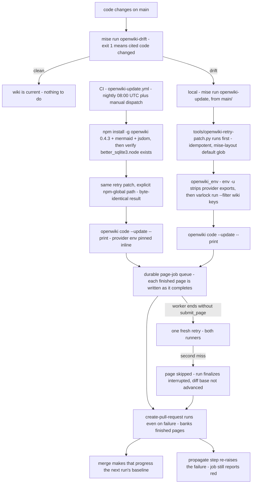

# Wiki automation: mise tasks, the retry patch, and the CI update workflow

The wiki under `openwiki/` is generated, never maintained by hand. The generator is
`langchain-ai/openwiki`, pinned at 0.4.3 in `mise.toml` — the version verified against this tree
(2026-08-29); `latest` would make the provider env-var contract an unpinned assumption. Two entry
points run it and both execute the same command, `openwiki code --update --print`: locally
`mise run openwiki-update`, and in CI the scheduled workflow `.github/workflows/openwiki-update.yml`
(daily `cron: "0 8 * * *"` plus `workflow_dispatch`). Both runners apply the same page-worker retry
patch before generating — locally through the task itself, in CI through a dedicated step. A third
task, `mise run openwiki-drift`, decides whether regeneration is worth running at all.

Related: [what the drift gate proves](/openwiki/testing/verification-ladder.md) — the gate's
semantics live there, not here — [the openwiki recipe](/openwiki/integrations/openwiki-recipe.md)
(the container-side integration of the same package),
[harnessed quickstart](/openwiki/quickstart.md), and
[precedence](/openwiki/concepts/precedence.md) (the schema-beats-shell rule this page applies).



*The regeneration loop. CI banks partial progress even on a failed run and still reports red; the
drift gate decides when a local regeneration is worth starting.*

---

## The mise task surface

`mise.toml` defines five `openwiki-*` tasks (plus the `openwiki_env` wrapper they share):

| Task | What it does | The non-obvious part |
| --- | --- | --- |
| `openwiki-drift` | Verifies each **line-ranged** evidence anchor's digest against the tree, exits non-zero when cited code changed; whole-file evidence and unknown version schemes are skipped and counted, never silently verified | No model call, no network, no varlock — the cheap check before deciding to regenerate (gate semantics: [verification ladder](/openwiki/testing/verification-ladder.md)) |
| `openwiki-update` | Generate or refresh `openwiki/`, no prompts | Runs the retry patch **first**; handles the first run too |
| `openwiki-init` | Reconfigure from scratch | Walks the setup wizard **unconditionally**, even when already configured |
| `openwiki-chat` | Interactive openwiki session against this repository | Same env guard as `openwiki-update` |
| `openwiki-visualize` | Serve the graph and Markdown reader on 127.0.0.1 | Deliberately skips varlock — no credential involved |

### `openwiki-update` is the only generation entry point

Upstream's own CI notes that `--update` "also handles the first run for code docs when env vars are
set", and unlike `--init` it does not force the setup wizard; `--print` makes it one-shot and exits.
So `mise run openwiki-update` is THE entry point, including for a repository's very first wiki. Its
command line is two stages:

```bash
python3 tools/openwiki-retry-patch.py && {{vars.openwiki_env}} openwiki code --update --print
```

The retry patch runs **first and on every invocation**, which is also what re-applies it after any
`mise install` that restores the stock runner — the patch is idempotent, so re-running it on a
freshly reinstalled openwiki is exactly what you want. Every generator task is marked
`interactive = true`: openwiki's UI is Ink, which needs the real stdin/stdout, and under mise's
default output capture a prompt draws but cannot be answered, so it re-prompts forever.

Run these tasks **from `main/`, not from a worktree**. `docs/` is a gitignored live clone of the
GitHub wiki, so a worktree checkout does not have it and the generated wiki would be written from an
incomplete view of the project's own documentation.

### The environment guard: schema beats shell

All provider configuration for these tasks lives in `~/.config/harnessed/.env.schema`, so the tasks
are just `varlock run` — nothing in `mise.toml` knows a variable name or an endpoint. The wrapper
var `openwiki_env` does two things to that `varlock run`, both learned from incidents:

**`env -u` first, stripping the full provider surface** (`OPENWIKI_PROVIDER`, `OPENWIKI_MODEL_ID`,
`OPENWIKI_MAX_OUTPUT_TOKENS`, `OPENWIKI_OPENAI_COMPATIBLE_STREAMING`, `OPENAI_COMPATIBLE_API_KEY`,
`OPENAI_COMPATIBLE_BASE_URL`, `ANTHROPIC_API_KEY`, `ANTHROPIC_BASE_URL`). varlock lets a
`process.env` value **override** the schema, so a stale export in whatever shell invokes the task
silently repoints the run: on 2026-09-04 leftover `OPENWIKI_PROVIDER=openai-compatible` plus a
streaming flag made every schema correction look broken across a 13-hour run. The schema is the
declared source of truth and a shell export must not outrank it — the same stance harnessed's own
host launcher takes. `OPENWIKI_MAX_OUTPUT_TOKENS` is in the strip list for a second, measured
reason: in run 7 (2026-09-08) a shell export of 32768 beat the schema's 20000, and the
`@anthropic-ai/sdk` client guard (`_calculateNonstreamingTimeout: 3600*maxTokens/128000 > 600s`)
refuses any **non-streaming** call whose cap exceeds 21,333. The planner is that one non-streaming
call, so the run died there twice — the only failures in an otherwise clean 1.7h update.

**`--filter` narrows resolution to openwiki's own keys** (`OPENWIKI_*,ANTHROPIC_*,LANGCHAIN_TRACING_V2,LANGSMITH_API_KEY`).
Without it a wiki run also pulls `CLAUDE_CODE_OAUTH_TOKEN` and the scanner tokens out of 1Password
and exports them into a process that talks to a third-party inference endpoint.

### `openwiki-init` is for reconfigure/discard only

`--init` walks every setup step unconditionally: `dist/cli/app/app.js:96` is
`needsCredentialSetup(...) || (isInitCommand && !initWizardConsumed)`, so a fully configured
environment does **not** skip it. Use `mise run openwiki-init` only to reconfigure or to discard the
generated wiki and start over; ordinary generation belongs to `openwiki-update`.

`openwiki-chat` shares the env guard for an interactive session against the repository.
`openwiki-visualize` deliberately skips varlock: it only serves Markdown already on disk, so routing
it through `varlock run` would touch 1Password for nothing.

### The other wiki surface: `docs/`

The tasks above generate `openwiki/`, the agent-facing wiki. The repository also carries a
human-facing one: `docs/` is a gitignored live clone of the GitHub wiki — not a submodule, no
pinned commit, pull it yourself with `git -C docs pull`. The wiki serves pages under a **flat
namespace** (`guides/beads.md` on disk is published at `/wiki/beads`), so a relative link that looks
correct on disk breaks once published — which is why the rewrite is a task, not a habit.

`mise run docs` runs `tools/wiki-links.py` to rewrite links in place: relative `.md` targets inside
`docs/` become wiki URLs, repo-source targets become blob/tree URLs on `main`, and a dead target is
reported rather than rewritten into a tidy-looking 404. It also checks every guide under
`docs/guides/` is listed in `_Sidebar.md`. `mise run docs-check` is the read-only form (exit 1 if
anything would change) for CI or a pre-push hook. Run `docs` after editing the wiki; this is also
the second reason the openwiki tasks insist on `main/` — the clone only exists there.

---

## The retry patch: `tools/openwiki-retry-patch.py`

### The failure it fixes

A page worker whose stream ends without a `submit_page` call is marked **skipped** by openwiki, the
page snapshot is restored, and the run finalizes **`interrupted` without advancing the diff base** —
one quit costs the next run a full regeneration of the whole changeset. The trigger, as recorded in
the workflow: a final turn that ends **thinking-only** — no text, no tool call — because the model
spends its whole completion budget on reasoning. Observed with glm-5.3-flash: 94 LLM calls, a clean
exit, no tool call, no error (PR #445 run 6). Neither upstream 0.4.3 nor 0.5.0 retries a skipped
page — verified against the 0.5.0 tarball on 2026-09-08. Until upstream ships a retry, this patch
gives each page worker **one fresh second attempt** before the page is skipped.

### What the patch changes

It edits the installed runner (`dist/agent/repository-runner.js`) inside `runPageAgent`: the single
`const agent = createDeepAgent({...})` becomes a `createWorkerAgent` factory, and the worker call is
wrapped in a two-attempt loop. The retry **shares the worker's virtual backend**, so attempt 2 sees
the page markdown attempt 1 already wrote. A first miss emits a named event
(`[openwiki-retry-patch] <path> worker ended without submit_page (attempt 1); retrying with a fresh
worker.`); only a second miss falls through to `skipRepositoryPage` plus the deferred warning,
exactly as the stock code does.

### Fail-loud discipline, on purpose

The patch must never guess at a moving target:

- It **refuses any install whose version is not the verified 0.4.3**.
- It **fails loudly when its anchor text does not match** — `runPageAgent` must exist, and the agent
  declaration and the worker try-block must each be found exactly once — with the error
  `anchor drift, re-derive the patch`. Version drift means a human re-derives the patch against the
  new layout; it never patches blind.
- It is **idempotent** (a marker identifies an already-patched runner), **reversible** (`--revert`
  restores the `.orig` backup; `--check` exits 0/1 to report patched state without touching
  anything), and every write is followed by a `node --check` syntax check.

### Applied on both runners, anchored differently

The patch used to be wired into the local task alone; it now runs on **both** runners. Its default
target glob is the **mise** install layout, which is what the local task hits when it runs the patch
with no argument. CI installs openwiki with npm, so its dedicated step passes the runner path
explicitly:

```bash
python3 tools/openwiki-retry-patch.py "$(npm root -g)/openwiki/dist/agent/repository-runner.js"
```

The workflow records the verification behind that trust: patching an npm-global-layout copy produces
a runner **byte-identical** to the locally patched one, and the patch is idempotent and
version-gated (it would refuse anything but 0.4.3).

The patch is one retry, not a guarantee. A worker that misses **twice** still lands in
`skipRepositoryPage`, and the run still finalizes `interrupted`. That residual case is survivable on
CI for exactly one reason: the durable page-job queue plus the PR banking step (below) mean the
finished pages still become the next run's baseline.

---

## The scheduled workflow: `.github/workflows/openwiki-update.yml`

### Checkout: full history, no persisted credentials

`fetch-depth: 0` because `openwiki code --update` diffs HEAD against the commit it last documented —
a shallow clone hides that commit and the update runs against an empty change summary, silently
regenerating nothing. `persist-credentials: false` because the openwiki step below runs third-party
code over the whole repository: persisted git credentials would sit in the job's git config for it
to find, and `create-pull-request` takes its own `token:` input and does not read them, so nothing
in the job needs them.

### Install, then verify the native addon actually built

The workflow installs with `npm install --global openwiki@0.4.3` plus pinned `mermaid@11.16.0` and
`jsdom@29.1.1` (which add high-fidelity validation of the pages' Mermaid diagrams) — deliberately
**not** the recipe's project-scoped pnpm install. The two differ because their constraints do: the
recipe installs under `catalog/base/pnpm/config.yaml`, whose `strictDepBuilds: true` denies
better-sqlite3's build script and forces a project-scoped allowlist; this runner has no such policy,
and npm 10/11 still runs dependency lifecycle scripts by default.

That default is going away — npm 12 blocks dependency lifecycle scripts and requires explicit
opt-in — and when this runner's npm crosses that line the addon will silently not build while the
install still "succeeds". So a dedicated verify step searches the global `node_modules` for
`better_sqlite3.node` and fails naming the fix (`--allow-scripts=better-sqlite3`, or a pnpm
`allowBuilds` entry as the recipe does). The stakes are all-or-nothing, not partial: openwiki
imports `SqliteSaver` at module load, so a missing addon breaks **every** subcommand — the failure
surfaces as `Could not locate the bindings file` mid-generation rather than at install time.
[The openwiki recipe](/openwiki/integrations/openwiki-recipe.md) documents the image-side twin of
this same constraint; two runners, one constraint, and each solution is the one that fits its
runner's defaults.

### The retry patch, before generating

Between verify and generate, a dedicated step applies `tools/openwiki-retry-patch.py` to the
npm-global runner (see [the retry-patch section](#applied-on-both-runners-anchored-differently)).
CI therefore gets the same one-fresh-retry-per-page-worker behavior the local task gets — the two
runners no longer differ on skipped-page handling, only in how the patch locates its target.

### The generation step: durable queue over fail-fast

```yaml
- name: Run OpenWiki
  id: openwiki
  continue-on-error: true        # NOT fail-fast, deliberately
  run: openwiki code --update --print
```

The page-job queue is **durable**: a run that dies partway has already written every page it
finished, and the PR step below banks that progress as the next run's baseline. Letting the job die
here instead discards that progress and defeats the resumable architecture the queue exists for.
The trade-off is the opposite of a lint gate's, and right for a job whose output is cumulative
rather than binary — and the failure is still surfaced: the last step re-raises when
`steps.openwiki.outcome == 'failure'`, so the job reports red.

The provider and model env is pinned **inline in the step** — the same provider configuration the
local tasks resolve from the schema, expressed as workflow env because CI has no varlock and no
1Password (the workflow comment carries the exact values, the endpoint, and the secret wiring).
Two env facts are deliberate:

- **The provider's Anthropic-compatible face, not its OpenAI-compatible face, with the model pinned
  to `glm-5.3-flash`.** The face choice is measured, not taste: non-streaming HTTP on the
  OpenAI-compatible face dies at undici's default 300-second `headersTimeout`, and that face's
  streaming flag is broken in openwiki 0.4.3 **and** 0.5.0 (the `wrapModelCall` middleware returns
  an object). The Anthropic client streams SSE by default inside the agent loop, so response
  headers arrive immediately and long glm turns survive. Verified end-to-end in PR #445 run 8 — the
  first complete finalize in eight attempts. The API key is wired from a repository secret whose
  *name* is a legacy of the first, abandoned provider attempt.
- **`OPENWIKI_MAX_OUTPUT_TOKENS: "20000"` — set, and bounded on both sides.** It is REQUIRED for
  glm on this provider: the `@anthropic-ai/sdk` client guard
  (`_calculateNonstreamingTimeout: 3600*maxTokens/128000 > 600s`) refuses any **non-streaming** call
  whose cap exceeds 21,333, and the planner is that one non-streaming call. 20,000 keeps it under
  the guard while leaving room for reasoning plus the `submit_page` call — glm draws reasoning
  tokens from the completion budget, and a cap this size measured fine locally. Do **not** raise it
  above 21,333, and do **not** drop it low: a low cap returns HTTP 200 with empty content and no
  error — a silently blank page. (The local task strips this same variable from the shell for the
  different, measured reason above — an export would override the schema. In CI there is no schema
  to override, so the value is pinned here, measured against this model.)
- **No `LANGCHAIN_TRACING_V2`.** That variable gates openwiki's interactive setup wizard
  (`setup/credentials/steps.js`), which additionally requires a TTY (`cli/app/app.js`) that CI does
  not have. It is needed for a terminal run; here it is redundant.

### Banking the result: the PR step

`peter-evans/create-pull-request` runs `if: ${{ !cancelled() }}` — even when generation failed — so
a partial run still opens its PR. `add-paths` limits the PR to `openwiki`, `AGENTS.md`, `CLAUDE.md`,
and the workflow itself: the wiki, the two pointer blocks the run keeps current, and the workflow
that defines the pipeline. The branch is `openwiki/update`, and the body states the contract
plainly: when the result is `failure`, the PR intentionally preserves only the pages completed
before the failure, and merging makes that progress the baseline for the next run. It also tells
the reviewer what to do before merging: `mise run openwiki-drift` reports which pages cite code
that has changed.

`openwiki/.run.json` is gitignored in this repository, so unlike upstream's scheduled-workflow
example there is no transient run-state file to delete before this step.

---

## What is committed, and what the run may read

The run's durable output is the wiki itself — `openwiki/*.md` and `openwiki/.claims/` — plus the
pointer blocks in `AGENTS.md` and `CLAUDE.md`. The resumable-run checkpoint `openwiki/.run.json`
(queue state, diff base, the prepared wiki snapshot) is deliberately **gitignored**: a half-finished
run's queue state is meaningless in any other checkout, so the generated content is committed and
the transient state never is. That is also why no CI step cleans it up.

What the run may *read* is a contract of its own, and it is the last input this page has not
covered — the next section.

---

## The read boundary: `.openwikiignore`

`.openwikiignore` is the generator's read contract, not a taste filter. openwiki never reads,
scans, or reproduces a path listed there, and the file's header states the standard every entry
must meet: each excluded path is either a byte-for-byte duplicate of source openwiki already reads,
or generated output whose staleness would be laundered into the wiki as fresh evidence. The
exclusions, and why each earns its place:

- **`.claude/worktrees/`** — agent task worktrees are full checkouts of this same repository, each
  on a different branch. Left readable, openwiki would ground Claims in dozens of divergent copies
  of every file it documents: evidence from the wrong branch.
- **`docs/codebase/`** — the output of an older `/map-codebase` run. Grounding a generated wiki on
  an older generated map turns "the map said so" into evidence, which is exactly the drift
  openwiki's Claims exist to catch. The hand-written `docs/guides/` and `docs/harnessed-design.md`
  stay readable.
- **`tests/` and `tools/` are deliberately NOT ignored**, because that is where this project's
  contracts are actually pinned: `mise.toml` cites `test_external_contracts_live.py` by name as the
  reason varlock is pinned, and `install.sh`'s precedence order is asserted as order in
  `test_install_script.py::TestPrecedence`. Excluded, the wiki would have to infer those guarantees
  instead of citing them.
- **The `tools/` exclusion was narrowed to generated fixtures, on purpose.** It now covers only
  `tools/test-fixtures/profiles/`, because an earlier whole-directory exclusion is documented as
  having made the wiki describe `tools/run-tests.sh`, `tools/preflight.sh`, and
  `tools/openwiki-drift.py` from `mise.toml` and the CI workflows alone — without opening any of
  them — which is how `testing/verification-ladder.md` came to overstate what the drift gate
  verifies (raised in review on #445). A boundary drawn too wide does not merely hide content; it
  substitutes the file's reputation for its text.
- **The rest of the file rounds out the boundary with derivations and noise**: build and analysis
  artifacts (`/profiles/`, `catalog-local/`, `mutants/`, the caches), editor and agent state
  (`.serena/`, `.vscode/`, `.agents/`, and the `.claude/` remainder — its consequential half is the
  worktrees entry above), `web/` (not part of the shipped project), `catalog/recipes.backlog`
  (PLAN.md drafts for recipes that do not exist yet — documenting them would describe capabilities
  the catalog lacks), and `uv.lock` (a machine-generated dependency graph of tens of thousands of
  lines with no prose signal).

The boundary applies to every run this page documents — local and CI alike — and the #445 episode
is its cautionary tale in both directions: excluding duplicates and stale artifacts keeps laundered
evidence out of the wiki, but excluding real contracts forces the generator to describe files it
never opened.

---

## The operating loop

1. **Check first**: `mise run openwiki-drift`. Exit 0 — no line-cited evidence changed, stop.
   Exit 1 — cited code changed; the output names the Claims to re-verify. The check is bounded by
   design: it verifies line-ranged evidence anchors only, and whole-file evidence plus unknown
   version schemes are skipped, counted, and printed as a separate `skipped` line — never silently
   treated as verified. What that boundary means for trust is the
   [verification ladder](/openwiki/testing/verification-ladder.md)'s subject.
2. **Regenerate**: `mise run openwiki-update` from `main/`. The retry patch re-applies itself, the
   env guard guarantees the schema's provider wins, and `openwiki code --update --print` runs
   one-shot.
3. **Bank it**: review and merge the result (a local commit, or CI's `openwiki/update` PR — which
   opens nightly regardless). Merging is what advances the baseline; a failure PR preserves only
   the finished pages, which is still forward progress.
4. **Trust, then verify**: the drift gate proves nothing it cites has moved — it cannot prove a
   claim that misreads unchanged code. That distinction is the drift page's subject.
