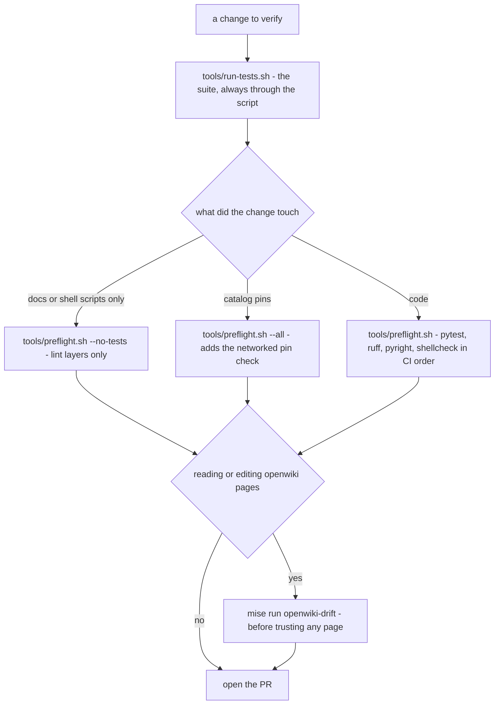

# Quickstart: set up, build, launch, and where to read next

harnessed is a host-native Python CLI that assembles catalog content into profiles and launches
composed coding-agent stacks. This page is the working entry point: what must be installed before
anything runs, the sanctioned ways to run the verification entry points, the two console
entrypoints, the launch verbs an agent must never invoke, a safe first slice, and where every other
wiki page lives.

Related: [what each gate proves](/openwiki/testing/verification-ladder.md),
[the command surface](/openwiki/operations/cli.md),
[system overview](/openwiki/architecture/overview.md).

## Prerequisites

| Tool | Required? | Why |
| --- | --- | --- |
| **mise** | yes | Owns the venv activation and the non-Python analysis tools. `pyright` and `shellcheck` are installed by `mise.toml`'s `[tools]` (pinned `npm:pyright` and `shellcheck` versions), so **the lint layers cannot run without mise** — `tools/preflight.sh` reports them as skipped rather than passing silently. `tools/run-tests.sh` shells out to mise on its first line and fails with "is mise installed and on PATH?" without it. |
| **uv** | yes | Creates the Python venv, installs harnessed editable plus the `dev` extra (pytest, ruff, hypothesis, pytest-randomly, …). |
| **podman** or **docker** | only for live work | Needed by the live test layer behind `HARNESSED_PODMAN=1`, by `harnessed test`, and by `container-run`. The hermetic suite and `harnessed-tools`' emit-only verbs run with no runtime installed at all. `_runtime()` prefers podman and exits when neither is on PATH. |

Python versioning is a floor, not a preference: `mise.toml` pins `UV_PYTHON = "3.12"` — the floor of
`requires-python = ">=3.12"` and what CI's default job runs — because an unpinned uv picks the newest
interpreter on the box, leaving no local run that exercises the supported version. That hid a real
crash through a full local review once (`Path.resolve()` raises on a failing readlink under 3.12 and
swallows it under 3.13, bd harnessed-925). CI covers the top of the range with a separate 3.13 job.

The operational ground rules live in [AGENTS.md](https://github.com/drmikecrowe/harnessed/blob/main/AGENTS.md)
(git workflow, the launch-verb ban), [CLAUDE.md](https://github.com/drmikecrowe/harnessed/blob/main/CLAUDE.md)
(non-negotiable constraints), and [CONTRIBUTING.md](https://github.com/drmikecrowe/harnessed/blob/main/CONTRIBUTING.md)
(catalog authoring). This page links to them instead of restating them.

## The toolchain: one venv per branch, outside the repo

`mise.toml` points `UV_PROJECT_ENVIRONMENT` at
`~/.local/share/harnessed/venvs/<branch>/.venv` — the venv is keyed to the git branch and
deliberately lives outside the repository. Two reasons, both load-bearing:

- A podman container that bind-mounts this repo cannot corrupt a `.venv` it does not contain.
- One venv per branch avoids cross-branch dependency clobbering — which means **a fresh worktree
  starts with no venv** and does not inherit `main`'s.

With mise active, the venv is activated automatically (`_.source` in `mise.toml`), so `uv run …` and
`harnessed` resolve against the right environment without a manual `export PATH`. Both
`tools/run-tests.sh` and `tools/preflight.sh` run `mise trust` (a no-op once trusted) and
`uv sync --extra dev` (a fast no-op when already in sync) before doing anything else, so first-run
setup and repeat runs are the same command.

## Running the suite: `tools/run-tests.sh`, and nothing else

The suite is invoked **only** through the script — never a bare `pytest`, never a hand-composed
`mise exec -- uv run pytest`. The script exists because three separate things make the suite fail
locally while CI stays green, and the script handles all three so nobody has to remember them:

1. **Per-branch venv outside the repo.** A fresh worktree starts with no venv (see above).
2. **pytest is an optional extra** (`[project.optional-dependencies].dev`). A plain `uv sync`
   installs the project without it, and `uv run pytest` then silently falls through to a system
   pytest on a different Python, where every test errors with
   `ModuleNotFoundError: No module named 'harnessed'` — which reads like a broken checkout.
3. **mise refuses an untrusted config** in a new worktree. The script runs `mise trust` first.

```bash
tools/run-tests.sh                        # whole suite, quiet
tools/run-tests.sh tests/test_schema.py   # one file
tools/run-tests.sh -k install -x          # filter, stop on first failure
```

CI is held to the same entry point: `live.yml` invokes `tools/run-tests.sh -v` with
`HARNESSED_PODMAN=1`, and `tests/test_live_workflow.py` fails the workflow definition if it ever
invokes a hand-composed pytest line or drops the gate — a local green and a CI green are evidence
about the same thing **by construction**.

Record the baseline test count before a change: **a drop is a regression even if your new tests
pass.**

### What a green suite does not prove

The hermetic suite runs **no real podman** — no `podman build`, no `harnessed container-run`. The
`HARNESSED_PODMAN`-gated tests skip on a podman-less machine, and `tests/conftest.py` prints a
"live verification" section naming exactly what did not execute; **a skip is not a pass**. The
gated layer has one home: `live.yml`, behind `HARNESSED_PODMAN=1`, on pushes to `main` and a
nightly schedule — deliberately never on pull requests. When the gate is open, the run is
fail-closed about it: if any `live_podman`-marked test skips anyway, the session refuses to exit
green, and that decision keys on the marker rather than on skip wording, so a broken podman cannot
masquerade as success.

The full ladder — what every gate proves and what it does not — is
[the verification ladder](/openwiki/testing/verification-ladder.md).

## Before a PR: `tools/preflight.sh`

`tools/preflight.sh` replays every gate CI runs, **in CI's order**: pytest, then `ruff` →
`pyright` → `shellcheck`. The order matters and is not cosmetic: `lint.yml` has no
`continue-on-error` and ruff is its first step, so on CI a ruff finding means pyright and
shellcheck **never ran** — a red lint job understates how much is still unverified. That is not
hypothetical: PR #431 went red on two RUF005 findings invisible locally, with pytest fully green.

```bash
tools/preflight.sh              # pytest + ruff + pyright + shellcheck
tools/preflight.sh --all        # also the catalog pin check (network, slow)
tools/preflight.sh --no-tests   # lint layers only, for a docs- or shell-only change
```

The pin check (`harnessed update --check`) is opt-in locally on purpose: it queries live upstream
release feeds, so it needs the network and is irrelevant to any change that does not touch
`catalog/`. CI runs it as a weekly scheduled workflow (Mondays 06:00 UTC) rather than a PR gate,
for the same reason a live registry query would fail unrelated branches through nobody's fault.

Two things to know about how preflight reports:

- **Its one deliberate divergence from CI:** every gate runs even after an earlier one fails, and
  each layer that did not run is reported **by name** in the summary. CI stops at the first failure
  and leaves you guessing; preflight hands you the whole list in one pass. A bare "all clear" is
  never printed while a layer was skipped — that overstatement is what the script exists to
  prevent.
- **pyright gets the venv interpreter explicitly** (`--pythonpath` resolved from the same uv venv).
  Because the venv lives outside the repo, a bare `pyright` inherits no activation, resolves none of
  the installed packages, and reports hundreds of phantom `reportMissingImports` on a tree that is
  genuinely clean.

## The wiki's own gate: `mise run openwiki-drift`

Before trusting any page in `openwiki/` — including this one — run:

```bash
mise run openwiki-drift
```

The task runs `tools/openwiki-drift.py`: no model call, no network, no credentials. It recomputes
each Claim's line-ranged evidence digest against the tree and exits non-zero when cited code
actually changed (exit `0` nothing changed, `1` at least one Claim's code changed or its file is
gone, `2` the wiki or its Claims are unreadable/malformed). Its coverage is precise, and the
boundaries matter:

- It verifies evidence carrying a `repo://<path>#L<a>-L<b>` range. **Whole-file evidence and
  unknown version schemes are counted and reported as `skipped`, never verified.**
- A block that **moved** (identical content, different line numbers) is separated from one that
  **changed** — ordinary development shifts lines constantly, and a check that reported moved
  blocks as drift measured 27.5% moved against 4.7% genuinely changed on a one-week window. Only
  the second number is a review queue.

So a green drift run means **"nothing it cites has moved"**, not "everything it says is true" — no
digest can catch a claim that misreads code which has not changed; only a reader can. AGENTS.md
§Generated wiki carries that rule and the drift-check limits.

## The two console entrypoints

`pyproject.toml` defines two scripts with one division of labor:

| Entrypoint | Code | What it owns |
| --- | --- | --- |
| **`harnessed`** | `harnessed.launcher:main` (Typer) | Every verb that can touch the container runtime, launch an agent, or manage host-side state: `build`, `container-run`, `host-run`, `test`, `svc`, `update`, the GCs, … |
| **`harnessed-tools`** | `harnessed.cli:main` (argparse) | The emit-only / analysis surface: `assemble` (reads the catalog, writes a profile — never invokes podman/docker), `persist-list`/`persist-prune`, `lint-prose`, `scan-image-online` — **plus `test`, which launches a headless instance and needs podman/docker** |

Two invocation rules for `harnessed` that prevent real usage errors:

- There is **no bare-stack shortcut**: the leading token is always a subcommand. The earlier
  "stack name unless it matches a registered command" design made every new verb require
  hand-registration and read its failures as usage errors.
- Args after a standalone `--` are **passthrough**, appended verbatim to the harness command
  (`harnessed container-run claude -s S -- --resume` runs `claude … --resume`).

### The interactive run verbs are the user's

`harnessed container-run` and `harnessed host-run` hand the terminal to a live agent session: both
end by **replacing the launcher process** — `os.execvp` hands the TTY to the runtime attach on the
container path, `os.execvpe` execs the harness against your real home on the host path — so nothing
after the launch point can observe, bound, or reap it. They are for the user, not for automation;
the rule and its rationale are stated at the top of
[AGENTS.md](https://github.com/drmikecrowe/harnessed/blob/main/AGENTS.md) and mirrored in
[CLAUDE.md](https://github.com/drmikecrowe/harnessed/blob/main/CLAUDE.md).

To reason about behavior, use `harnessed build`, `harnessed test`, `harnessed list`, or read the
source. **`harnessed test <stack> <harness>` is the headless equivalent of a launch**: it launches
`container-run <harness> <project> --stack <name> --fresh` under `HARNESSED_HEADLESS=true` — pod up,
no interactive attach — introspects the live instance against the manifest oracle, and tears the
instance down as part of the contract.

## A safe first end-to-end slice

```bash
tools/run-tests.sh               # the whole suite — fast, hermetic, no podman needed or used
harnessed build default claude   # assemble the shipped baseline in-process + build its images
harnessed test default claude    # headless capability oracle (needs podman or docker)
```

`default` is the shipped baseline stack — one recipe, no services, no policy fields — and the
baseline every dynamic (`--recipe`) stack extends, so this slice works on a fresh install. The
first command needs no runtime; the second and third build and exercise real images, which is
exactly the territory the hermetic suite does not cover. `test` auto-assembles first when the
profile is missing or stale, so it is also the quickest "does my change still launch" probe.



*The local verification loop. Every arrow is a command from this page; the flags map one-to-one to
`tools/preflight.sh`'s argv.*

## Where to go next

Route by task, not by directory. The index files under each directory list the same pages.

| Task or question | Page |
| --- | --- |
| What harnessed is; the module map; the precise vocabulary (agent, recipe, service, stack) | [architecture/overview](/openwiki/architecture/overview.md) |
| What a backend is; the six-capability contract; what container vs host mode honors | [architecture/backends](/openwiki/architecture/backends.md) |
| How catalog content is validated, resolved across roots, overlaid, and shipped in the wheel | [architecture/catalog-and-schema](/openwiki/architecture/catalog-and-schema.md) |
| What lives where on disk; staleness detection; what each GC keys on | [architecture/state](/openwiki/architecture/state.md) |
| How service sidecars get identity, ports, sockets, and guards | [architecture/services](/openwiki/architecture/services.md) |
| The host secrets broker: the proxy per instance, the spawn/stop lifecycle, the pod's door | [architecture/secrets-broker](/openwiki/architecture/secrets-broker.md) |
| How a stack + harness becomes a profile, images, and populated volumes — stage by stage | [workflows/build](/openwiki/workflows/build.md) |
| The container launch sequence end to end, with the invariant each step upholds | [workflows/container-run](/openwiki/workflows/container-run.md) |
| The host launch sequence end to end; what "configuration-only isolation" means | [workflows/host-run](/openwiki/workflows/host-run.md) |
| How `--recipe`/`--extends` mints a real stack at launch time | [workflows/dynamic-stacks](/openwiki/workflows/dynamic-stacks.md) |
| How `harnessed test` proves a build against the manifest oracle | [workflows/capability-test](/openwiki/workflows/capability-test.md) |
| Who wins when two config sources conflict — one row per conflict | [concepts/precedence](/openwiki/concepts/precedence.md) |
| Constraints that read like defects but are load-bearing — check before "fixing" | [concepts/invariants](/openwiki/concepts/invariants.md) |
| The credential SOP: referenced, never replicated | [concepts/credentials](/openwiki/concepts/credentials.md) |
| The credential-proxy vocabulary: four modes, the annotation gate, the readiness warning | [concepts/credential-proxy](/openwiki/concepts/credential-proxy.md) |
| The folder-env and install-env contracts recipes may rely on | [concepts/env-contract](/openwiki/concepts/env-contract.md) |
| What each verification gate proves and what it does not | [testing/verification-ladder](/openwiki/testing/verification-ladder.md) |
| The full verb surface and the lifecycle each verb manages | [operations/cli](/openwiki/operations/cli.md) |
| Image scans, catalog pins, and per-recipe tool locks | [operations/supply-chain](/openwiki/operations/supply-chain.md) |
| How the five harnesses read the one Claude-canonical profile | [integrations/harnesses](/openwiki/integrations/harnesses.md) |
| The aoe tmux bridge and the per-project launch scripts a launch writes | [integrations/aoe-and-launch-scripts](/openwiki/integrations/aoe-and-launch-scripts.md) |
