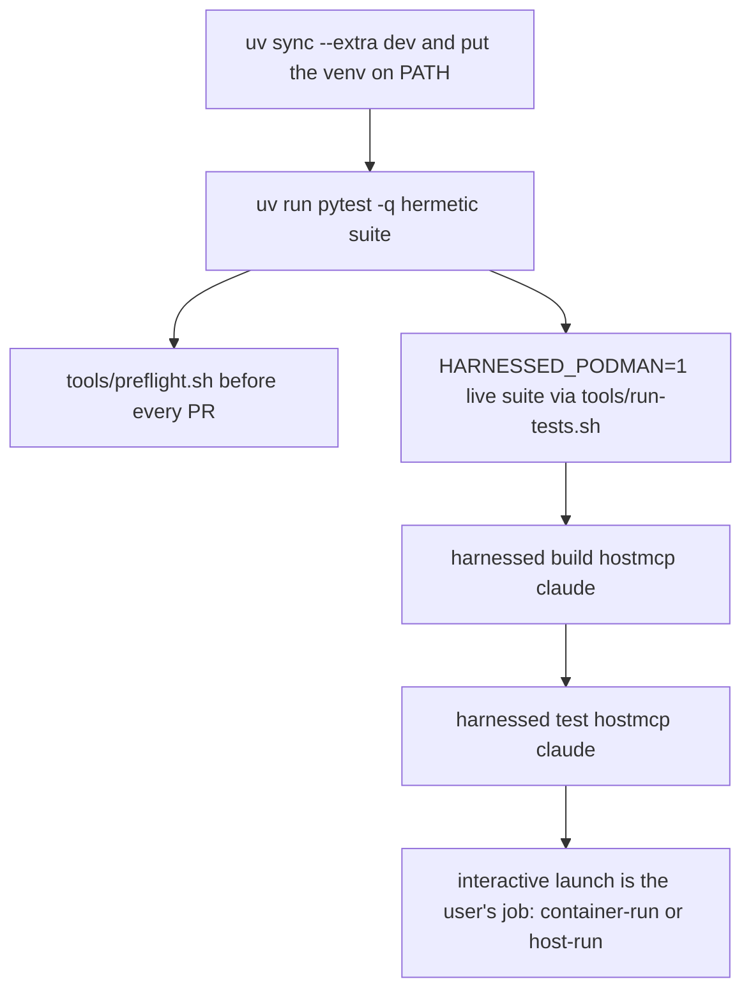

# Quickstart: set up, build, launch, and where to read next

harnessed is a **host-native Python CLI** (`src/harnessed/`) that composes catalog content into
profiles and launches the result through pluggable execution backends, driving **podman** directly —
no tool container, no daemon socket. That has one consequence that shapes everything on this page:
**the CLI runs on your host, so an edit under `src/harnessed/` is live immediately, with no image
rebuild.** The images are a *delivery* artifact for launched stacks, not the thing you are editing.

## 1. Prerequisites, then the dev loop

Two host dependencies: **podman** (rootless — the reference runtime; Docker support is pending) and
**uv**. `install.sh` is the end-user path: it *detects* both but never installs podman for you
(privileged and distro-specific), and it installs the CLI from a **pinned git tag** — and no release
tag has been cut yet. So for working *on* harnessed, ignore the installer and use the editable dev
environment:

```bash
uv sync --extra dev                    # NOT plain `uv sync` — see below
export PATH="$PWD/.venv/bin:$PATH"     # put the `harnessed` CLI on PATH

uv run pytest -q                                    # hermetic: fast unit + assembly, no containers
HARNESSED_PODMAN=1 uv run pytest tests/test_recipes_integration.py   # live: real podman builds

tools/run-tests.sh                   # the suite — always through this script
tools/run-tests.sh tests/test_schema.py   # one file
tools/run-tests.sh -k install -x          # filter, stop on first failure

tools/preflight.sh                   # before every PR: every CI gate, in CI's order
```



*The loop. Every step terminates; the only non-terminating step in the system is the one handed to
the user.*

Four things in that block are load-bearing:

- **`--extra dev` is mandatory, not stylistic.** The runtime dependencies are only
  `ruamel.yaml`/`rich`/`pip-audit`/`typer`; pytest and the Python-installable analysis toolchain
  (ruff, mutmut, diff-cover, hypothesis, pytest-randomly, …) live in the optional `dev` extra. Plain
  `uv sync` succeeds, installs no `pytest`, and the suite "breaks" with a command-not-found rather
  than a test failure. `pyright` and `shellcheck` are not Python packages at all — they are pinned
  as **mise tools in `mise.toml`**, which is why the lint layers still need mise on the box.
- **The live gate is what the hermetic suite cannot give you.** `HARNESSED_PODMAN=1 uv run pytest
  tests/test_recipes_integration.py` builds each catalog stack and asserts every declared
  skill/command/plugin/MCP server is present *in the running container* — a stack you add to the
  catalog is covered automatically. It is also the README's documented way to verify a host against
  the reference runtime.
- **Always invoke the suite through `tools/run-tests.sh`, never a hand-composed mise/uv/pytest
  line.** It absorbs the traps that fail locally while CI stays green — the per-branch venv that
  lives *outside* the repo (`mise.toml`'s `UV_PROJECT_ENVIRONMENT`, which keeps a `.venv` out from
  under a podman bind mount), the mandatory `--extra dev`, and mise's untrusted-config refusal. CI's
  live job invokes the same script.
- **A green `pytest` run is one gate of four.** It proves no container behaviour: no `podman build`,
  no `harnessed container-run`. `tools/preflight.sh` runs pytest, then `ruff` → `pyright` →
  `shellcheck` in CI's exact order and with CI's exact argv (`--all` adds the catalog pin check,
  `--no-tests` runs the lint layers only). Record the baseline test count before your change — **a
  count drop is a regression even when your new tests pass.**

What each gate proves — and, more usefully, what it silently does not — is the whole subject of the
[verification ladder](/openwiki/testing/verification-ladder.md).

## 2. Two console entrypoints, one package

`pyproject.toml` declares exactly two console scripts, and the split is the system's most important
seam:

| entrypoint | module | role |
| --- | --- | --- |
| `harnessed` | `harnessed.launcher:main` | the Typer verb surface — `build`, `test`, `list`, `new`, `svc`, `stop`/`rm`, `install`/`uninstall`, `update`, `rescan`, the GCs, and both interactive run verbs. This half **drives podman**. |
| `harnessed-tools` | `harnessed.cli:main` | the emit-only assembler (`assemble`, `scan-image-online`, `persist-list`, `persist-prune`, `lint-prose`) plus the `test` subcommand that `harnessed test` delegates to. This half **never invokes a container runtime**. |

Assembly (`schema.py`, `assemble.py`, `emit.py`, `synclinks.py`) only reads the catalog and writes
the profile; the host runs `podman build` on the emitted artifacts. Only the launcher — and
`volumes.py`, which it drives — touch the runtime. Two consequences for a change plan: adding a
podman call to any emit module breaks `harnessed-tools assemble` on machines with no runtime, and a
launcher-only bug will not reproduce under `harnessed-tools`. The
[build pipeline](/openwiki/workflows/build.md) page names the module that owns each stage.

## 3. The first end-to-end slice

The README's quickstart reads:

```bash
harnessed build time claude && harnessed time claude
```

**Two parts of that line no longer describe the shipped CLI**, and knowing why is the fastest way
to learn the grammar:

1. **There is no `time` stack.** `catalog/stacks/` ships `default`, `gsd-core_repowise`, `hostmcp`,
   `hostspike`, `openbrain-example`, `openwiki`. The stack that composes the `time` recipe — one
   pinned stdio MCP server (`uvx --with mcp==1.29.0 mcp-server-time@2026.7.10`) plus one standalone
   skill — is **`hostmcp`** (`recipes: [time]`). (`openwiki`, the newest, composes `default` +
   `openwiki`.)
2. **The bare `harnessed <stack> <harness>` shorthand is gone.** `launcher.main` treats the leading
   token as a subcommand, full stop: the old `_COMMANDS` dispatch meant every newly registered verb
   silently became unreachable (`harnessed update` parsing as a launch and failing with a
   usage-shaped error). A stack is named by `--stack`, and the harness is the leading positional of
   the verb. The short `time claude`-shaped command still exists — delivered by
   `harnessed install <stack>`, which writes a `~/.local/bin/<stack>` shim expanding to
   `harnessed container-run --stack <stack> "$@"`.

(`install.sh`'s printed "next steps" — `harnessed build claude_time` — carries the same stale
shape.)

What actually works today, and is safe for an agent to run because every step terminates:

```bash
harnessed build hostmcp claude      # assemble in-process, build base + agent + derived images, populate volumes, scan
harnessed test hostmcp claude       # the capability oracle: launch --fresh headless, assert declared capabilities, tear down
harnessed list                      # authored stacks (which harnesses are built) + instances
```

`harnessed test` is the safe substitute for a launch: it validates the harness name, auto-assembles
first when the profile is missing or stale, then delegates to the `harnessed-tools test` entrypoint
(module form `python -m harnessed.cli test`) in a subprocess with no outer timeout and propagates
the child's exit code. Its output is **printed, not written to a file**: a rich markdown capability
table on the terminal, or the structured result on clean stdout under `--json`, with the *same*
structured result driving the exit code. (The README's claim that the report lands at
`$XDG_DATA_HOME/harnessed/profiles/<stack>/<harness>/capability-report.md` no longer matches the
code.) The [capability test](/openwiki/workflows/capability-test.md) page explains the oracle.

The supported harnesses are exactly the keys of `schema.HARNESS_CONFIG_DIR` — **claude, omp,
opencode, antigravity, codex** — and the run verbs reject any other name at the CLI boundary via a
shared helper, so the two entrypoints cannot drift apart.

### The launch verbs are the user's, not yours

**`harnessed container-run` and `harnessed host-run` are interactive and are for the user, never
the agent.** Both end by *replacing* the harnessed process with the agent session — `container-run`
terminates in an `os.execvp` that hands the TTY to a shell inside the pod, and `host-run` terminates
in an `os.execvpe` that execs the harness directly on the machine, against your real home and
credentials, with no container. There is no prompt to answer and no way back. `AGENTS.md` states
this as a hard rule; `harnessed build`, `harnessed test`, `harnessed list`, and reading the source
are the sanctioned ways to reason about behaviour.

| Instead of | Run / read |
| --- | --- |
| `harnessed container-run claude --stack S` | `harnessed build S claude`, `harnessed test S claude`, or [container launch](/openwiki/workflows/container-run.md) |
| `harnessed host-run claude --stack S` | `harnessed test S claude`, or [host launch](/openwiki/workflows/host-run.md) |
| "what exists / what is built?" | `harnessed list`, or [system overview](/openwiki/architecture/overview.md) |

For a human, the equivalent one-off forms are `harnessed container-run claude --stack hostmcp` /
`harnessed host-run claude --stack hostmcp`, or a dynamic stack with no manifest at all:
`harnessed container-run claude --recipe time`. Both verbs pick the stack through the *same*
`_resolve_stack` call — they differ in **backend**, never in how a stack is chosen — and they are
the two implementations behind the `ExecutionBackend` contract in `src/harnessed/backend.py`: six
capabilities, backend-owned ordering, no shared driver. The
[execution backends](/openwiki/architecture/backends.md) page is that contract.

## 4. Task routing

| Task | Read first |
| --- | --- |
| **Change how images build** (assembly, Dockerfiles, image lineage, scans) | [build pipeline](/openwiki/workflows/build.md) |
| **Touch secrets** or anything credential-shaped | [credential handling](/openwiki/concepts/credentials.md) — the constraint is *referenced, never replicated* |
| **Reason about the credential-proxy migration** (the four modes, `@proxy`, the readiness warning) | [the credential proxy model](/openwiki/concepts/credential-proxy.md) |
| **Add or alter a launch path** (a backend, or either verb's sequence) | [execution backends](/openwiki/architecture/backends.md), then both launch pages: [container-run](/openwiki/workflows/container-run.md) and [host-run](/openwiki/workflows/host-run.md) |
| **Compose a stack at launch time** (`--recipe` / `--extends` / `--service`, the minted name) | [dynamic stacks](/openwiki/workflows/dynamic-stacks.md) |
| **Author catalog content** (recipe / stack / agent / service) | [catalog and schema](/openwiki/architecture/catalog-and-schema.md) |
| **Before opening a PR** | [verification ladder](/openwiki/testing/verification-ladder.md) |
| Orient: vocabulary, module map, dependency direction | [architecture overview](/openwiki/architecture/overview.md) |
| Add or change a service sidecar | [service sidecars](/openwiki/architecture/services.md) |
| Understand what a build left on disk, staleness, or a GC | [state and staleness](/openwiki/architecture/state.md) |
| Reason about who wins a layered value | [precedence](/openwiki/concepts/precedence.md) |
| Change env injection or recipe install/setup phases | [the env contracts](/openwiki/concepts/env-contract.md) |
| Something reads like a defect — check before "cleaning it up" | [invariants and deliberate deviations](/openwiki/concepts/invariants.md) |
| Understand the full verb surface (`svc`, `update`, `rescan`, GCs, …) | [operations: the command surface](/openwiki/operations/cli.md) |
| Change scans, pins, or tool locks | [supply chain](/openwiki/operations/supply-chain.md) |
| Understand how the five harnesses read one profile | [harness integrations](/openwiki/integrations/harnesses.md) |
| Change the aoe bridge or the per-project launcher scripts | [aoe and launch scripts](/openwiki/integrations/aoe-and-launch-scripts.md) |

## 5. The repo's own rulebooks — read them, this page does not restate them

Three files at the repo root govern workflow and safety, and they outrank anything summarized here:

- **`AGENTS.md`** — the operational rules: the ban on running `container-run`/`host-run` yourself,
  the git workflow (no commits to `main`; worktree → passing full suite → PR), the worktree rules,
  and where authorable content lives. Also the boundary that an agent may modify only files **in
  this repository** and must not touch the user's home directory unless explicitly asked.
- **`CLAUDE.md`** — the non-negotiable technical constraints (host-native CLI, Claude format
  canonical, recipes harness-independent, pnpm everywhere, pinned downloads, credentials referenced
  never replicated) plus the test-invocation rules and PR conventions, including signed commits.
- **`CONTRIBUTING.md`** — dev setup and how to add catalog content: recipe authoring rules,
  `expect:` declarations, the `catalog/`-ships-in-the-wheel consequences, and the compose + test
  loop.

For vocabulary and the build/launch model, `ARCHITECTURE.md` is the first read both of them point
at; `BACKENDS.md` is the authority for the backend vocabulary the
[execution backends](/openwiki/architecture/backends.md) page follows. Read `AGENTS.md` and
`CLAUDE.md` before your first change; they are short, and every rule in them was written after
something went wrong.
