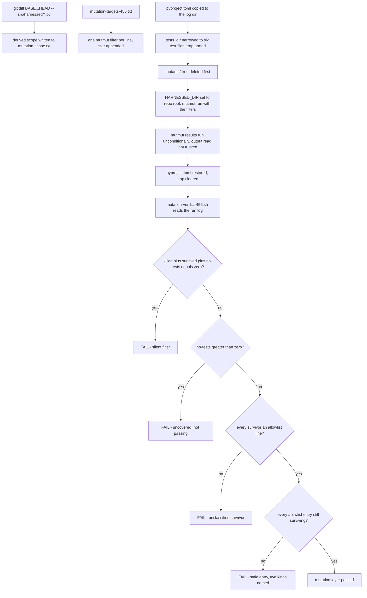

# The mutation gauntlet: proving the tests would fail

The last rung of #456's verification ladder is the one that asks the question coverage cannot:
**does a test FAIL when the code is broken, or does it merely execute the line?** A change can sit
at 100% changed-line coverage and still be untested — every line executed, nothing constrained.
`tools/gauntlet-456.sh` is the one command that reruns every layer the #456 report cites, in cost
order (merge-gate checks in seconds, suite, coverage, then mutation in minutes), and its mutation
layer is the subject of this page: the derived scope, the verdict script that is the actual gate,
the classified allowlist, and the mutmut traps that make an unguarded run report green while
measuring nothing.

Related: [the two container runtimes](/openwiki/architecture/runtimes.md) (the #456 feature surface
this layer proves), [invariants](/openwiki/concepts/invariants.md) (the two mutmut-honesty rules),
[the verification ladder](/openwiki/testing/verification-ladder.md) (where mutation sits among the
gates), [harnessed quickstart](/openwiki/quickstart.md).

## Why the layer exists: coverage cannot tell a test that fails from one that executes

The layer beneath mutation is `diff-cover ... --fail-under 100` — and that gate proves only that
every line the branch touched was **executed** by some test. As `pyproject.toml`'s `[tool.mutmut]`
header puts it: *"does a test FAIL when the code is broken, or does it merely execute the line?
Coverage cannot tell those apart, which is why a 100%-covered change can still be untested."*
Mutation testing closes the gap mechanically: mutmut regenerates each changed function from the AST
with one operator flipped, runs the suite, and a mutant that nothing kills marks a line no test
actually constrains. That is also why `[tool.mutmut]` insists the suite's hermetic half does the
killing — **a mutant must be killed by a test that runs WITHOUT a container**, or the score would
measure the `HARNESSED_PODMAN` gate, not the tests.

The specific code at stake is the docker `--userns` half of #456: the runtime detector
(`paths._detect_runtime`), the mapping and `--user` argv builders (`userns_args`,
`container_user_args`, `container_owner_ids`), the derived host uid (`pod_host_uid`), the ownership
guard (`persist.guard_ownership`), the preflight refusal (`launcher._preflight_runtime`), the netns
placement and firewall runner argv, and the docker-only volume chown. Every one of these is a
refuse-rather-than-guess branch or a security-relevant argv fragment — exactly the shapes where a
test that merely executes the line hides a real defect.

## The wrapper: fail closed, never fail early

`gauntlet-456.sh` runs under `set -euo pipefail` with no `|| true` and no swallowed exit codes —
a layer that cannot run is a failed layer, never a passed one. But it deliberately does not
**fail early**: each layer runs through a `run` wrapper that captures the exit code, tails the
log, records the failure, and continues. Fail-fast was measured wrong three times: a red
`diff-cover` meant the two randomized-order runs and the entire mutation layer never executed, so
the report could say nothing about them at all. A gauntlet exists to tell you the state of EVERY
layer; one that stops at the first red tells you the state of one. The script still exits nonzero
at the end if any layer failed.

The base ref and log dir are overridable so the script keeps working across rebases:
`GAUNTLET_BASE` (default `main`) drives both the diff-derived scope and diff-cover, and
`GAUNTLET_LOGS` (default `.old-coder/20260907-141233-issue-456-docker-userns/logs`) is where every
layer's full output lands — the point is that the EVIDENCE.md report is reproducible from the repo
alone, not from a transcript. The first three layers are transcribed **verbatim** from the merge-gate
workflows (arguments included), because `pyright src/` is not a cheaper `pyright` and the
difference is invisible in a row that says "0 errors".

The mutation half of the script looks like this:



*The mutation layer of `tools/gauntlet-456.sh`: derived scope, the trapped `tests_dir` edit, the
cache deletion, and the verdict rules that make the gate able to go red.*

## Scope is derived, and both layers read one list

Two decisions shape everything downstream.

**Scope is derived, not typed.** The changed source files come from
`git diff --name-only "$BASE"...HEAD -- 'src/harnessed/*.py'`, printed to the log as
`mutation-scope.txt`, so the glue is mutated along with the new logic rather than only the
functions the change "feels like" it lives in.

**The changed-function list lives in one file because the run and the verdict must read the SAME
list.** `tools/mutation-targets-456.txt` is that file: `gauntlet-456.sh` appends `*` to each
surviving line and passes the results as mutmut run filters; `mutation-verdict-456.sh` loops the
same lines to demand each one produced killed mutants and no survivors. It is a file rather than
two literal lists because it **was** two literal lists, and they had already drifted: eight changed
decision functions — the whole docker `--user`/ownership/netns half of #456 — appeared in neither,
so the layer that exists to prove the tests constrain the change never mutated the code the change
is about. Raised on PR #461 review. The reasoning is worth quoting in full: *two lists that must
agree and are edited by hand will disagree; one list cannot.* Both scripts hard-fail if the file
parses to nothing, so deleting the list fails the layer rather than emptying it.

The entries use mutmut's own naming — mutants are `harnessed.<module>.x_<function>__mutmut_N`, so
the list carries the `x_` prefix (`x__` for a private function's leading underscore, and no `x__`
doubling for public ones — `harnessed.launchenv.x_api_endpoint_egress_hosts` is the public
`api_endpoint_egress_hosts`). The sixteen entries span every module #456 touched:

```text
harnessed.paths.x__detect_runtime          harnessed.launcher.x__preflight_runtime
harnessed.paths.x_userns_args              harnessed.launcher.x__without_userns
harnessed.paths.x__probe_docker_rootless   harnessed.launcher.x__agent_placement_args
harnessed.paths.x_pod_host_uid             harnessed.launcher.x__netns_anchor
harnessed.paths.x_container_user_args      harnessed.launcher.x__firewall_runner_argv
harnessed.paths.x_container_owner_ids      harnessed.volumes.x__chown_volume_for_docker
harnessed.persist.x_guard_ownership        harnessed.launchenv.x_api_endpoint_egress_hosts
harnessed.ctrquery.x__runtime              harnessed.capability.x__runtime
```

*The target list in `tools/mutation-targets-456.txt`, regrouped two-column here for reading; the
file itself is one name per line. `ctrquery._runtime` and `capability._runtime` are both in the
list because both now delegate to `paths.active_runtime` — the duplicate detectors #456 removed
left two thin wrappers whose error paths still needed constraining.*

## The mutmut traps: how an unguarded run lies silently

Each of these was measured on this repo, and each is the reason a specific line of glue exists. An
unguarded `mutmut run` hits several of them at once, and their common signature is a green report
over a run that measured nothing.

### A filter that matches nothing is silent

A typo'd or stale filter selects zero mutants; mutmut exits 0, generates the tree, and `mutmut
results` prints every mutant as `not checked` — which reads exactly like a clean run. On the
layer's first pass the gauntlet printed `all layers passed` over **51 survivors and five filters
that had matched nothing at all**. This is why `mutmut results` runs unconditionally after the run
and its *output* is read, never just its exit code — and why the verdict re-derives the filter list
from `mutation-targets-456.txt` rather than trusting anything the run printed.

### `lru_cache`-decorated functions generate zero mutants

mutmut does not mutate a function behind `functools.lru_cache`: the combined detector generated
**zero mutants and reported nothing**, so the mutation layer was silently blind to the runtime
detection logic — including every refuse-rather-than-guess branch in it — while looking green.
That is why `paths._detect_runtime` and `paths._probe_docker_rootless` exist as plain, uncached
functions beside their `lru_cache(maxsize=1)` wrappers `active_runtime` and `docker_is_rootless`.
The split is documented on the functions themselves as deliberate, and it also makes the logic
testable without `cache_clear` gymnastics. Hoisting the body back into the cached function is
exactly the cleanup this design forbids: it fails only in the tool nobody watches, as a clean
report instead of an error.

### mutmut dereferences the catalog symlink: the trapped `tests_dir` edit

With the committed `tests_dir = ["tests/"]`, `mutmut run` cannot even establish a baseline here:
mutmut's tree-building **dereferences symlinks**, so the `catalog/*.local` overlays and the
`src/harnessed/catalog` link arrive in `mutants/` as real directories, and
`test_dynstack.py::test_the_default_recipe_ships_the_authoring_skill` — which asserts a link IS a
link — fails there. The runner then reports `failed to collect stats` and **no mutant is ever
executed**. This is a pre-existing repo limitation, documented in `[tool.mutmut]`'s own comment,
which prescribes narrowing `tests_dir` to the test files covering the change for a targeted run.

mutmut 3 exposes no `--tests-dir` flag, so the narrowing has to be written into `pyproject.toml`.
The gauntlet does it with a scripted edit rather than by hand — a report whose mutation row depends
on an undocumented manual edit does not reproduce — and the edit is wrapped in a trap that restores
the original file on every exit path, including a failed layer or a Ctrl-C:

```bash
MUT_TESTS='tests_dir = ["tests/test_docker_userns.py", "tests/test_userns_mapping.py",
  "tests/test_userns_properties.py", "tests/test_persist_allowlist.py",
  "tests/test_exec_verbs.py", "tests/test_launch_parity.py"]'
cp pyproject.toml "$LOGS/pyproject.toml.orig"
restore_pyproject() { cp "$LOGS/pyproject.toml.orig" pyproject.toml; }
trap restore_pyproject EXIT INT TERM
python3 - "$MUT_TESTS" <<'EOF'
import sys, pathlib
p = pathlib.Path("pyproject.toml")
s = p.read_text()
old = 'tests_dir = ["tests/"]'
assert s.count(old) == 1, f"expected exactly one {old!r}, found {s.count(old)}"
p.write_text(s.replace(old, sys.argv[1]))
EOF
```

*From `tools/gauntlet-456.sh` (line wraps added here): the six narrowed test files are the ones
covering the #456 change, and the `assert` makes a drift in `[tool.mutmut]` loud instead of a
silent no-op replacement.*

### A stale `mutants/` tree reports newly-covered functions as no-tests

mutmut caches its test→function mapping in `mutants/` and does not re-collect stats for tests that
did not exist when the tree was built. A stale tree therefore reports newly-covered functions as
`🫥 no tests` — *it does not re-check them against the tests that now exist*. Measured here: 30
mutants across `_detect_runtime` and `_probe_docker_rootless` sat at `no tests` through two full
runs **with passing tests calling them directly**, and only a fresh tree attributed them. A cache
that reports "nothing tests this" when something does is a fail-open in the layer that exists to
catch fail-opens, which is why the tree is deleted before every run — `if [ -d mutants ]; then rm
-r mutants; fi` — and why `mutants/` is gitignored and disposable.

### `HARNESSED_DIR` is required

Every mutmut invocation in the gauntlet runs with `HARNESSED_DIR="$PWD"` because
`paths.harnessed_home()` resolves harnessed's home **through the `src/harnessed/catalog` symlink**,
which does not exist in the mutants tree. Without the override, the asset-asserting tests cannot
find the catalog and the suite inside the mutants tree fails for reasons that have nothing to do
with any mutant. The same symlink reality shapes `[tool.mutmut]`'s wide `also_copy` (the whole
`tests/`, `.github/`, `catalog/`, `tools/`, `schemas/`, plus `mise.toml` and `README.md`): the
suite asserts repo assets and imports `support`/`conftest` as top-level modules, so anything a test
reads must exist in the mutants tree or every mutant reports "survived" for want of a runnable
suite — the mirror-image lie of a silent filter.

## The verdict script is the gate — mutmut's exit code is not

`mutmut run` exits 0 whether every mutant died or every one survived, so no wrapper around it can
fail this layer — and on the first pass, nothing did: the gauntlet printed `all layers passed`
over 51 survivors and five dead filters. **A gauntlet layer that cannot go red is a report, not a
gate.** The gate is `tools/mutation-verdict-456.sh <mutmut-run-log> [allowlist]`, split out of
`gauntlet-456.sh` precisely so it can be run and controlled on its own: inline, the only way to
exercise it was a 15-minute full gauntlet, which meant in practice it was never exercised at all —
and a gate nobody can cheaply run against a known-bad input is a gate nobody has proven can fail.

The verdict re-reads `mutation-targets-456.txt` (so it certifies exactly the functions the run
mutated) and then applies four rules per function, counted from what the run log actually
executed:

1. **Silent filters fail.** If `killed + survived + no-tests` is zero for a target function, the
   filter matched no mutant at all — the silent-filter trap — and the layer fails with "check the
   name".
2. **🫥 no-tests fails, as its own rule.** It is NOT a pass and NOT the same as a silent filter:
   the mutant exists but mutmut believes nothing covers it. Counted separately so the verdict says
   which of the two happened; the message reads "uncovered, not passing".
3. **Every survivor must be a classified allowlist entry.** Survivors are extracted per function,
   de-duplicated, and each must match an allowlist line exactly (`grep -qx`); an unlisted survivor
   fails the layer. The allowlist is a set of individual claims with reasons, never a per-function
   threshold.
4. **The allowlist is checked in reverse.** Every entry must still match a surviving mutant in the
   log. A stale entry is how a classified allowlist decays into a mute file: the next person adds a
   test that kills the mutant, the entry stays, and it silently excuses some future survivor that
   happens to reuse the number.

Rule 4 distinguishes **two kinds of stale, because they demand different responses**, and the
single message "no longer survives" once sent a reader after the wrong one: if the mutant's
function still exists in `mutants/src/harnessed/<module>.py`, a test got stronger — delete the
entry and move on. If the function itself is gone, the allowlist was written against a different
source state, and **every other numbered entry for that function is suspect** and must be re-read,
not just this one. Found on the PR #461 review pass: 13 `_preflight_runtime` entries reported as
stale were numbers the function no longer generates (it produces 21 mutants in its current shape).

One more trap lives inside rule 3, and shellcheck (SC1087) caught it: the survivor grep uses the
braced pattern `"${fn}__mutmut_"`. Unbraced, `$fn__mutmut_` is parsed as the variable
`fn__mutmut_` — unset — so the pattern matches nothing and **every survivor would pass
unclassified**. A gate that silently matches nothing is the failure this whole layer exists for;
the same failure shape shows up three times in this page by design.

## The classified allowlist: entries are claims, not mutes

`tools/mutation-allowlist-456.txt` holds the survivors the verdict is allowed to excuse, and its
header states the contract: *an entry here is a CLAIM, not a mute — "this mutant survives, and
here is why no behaviour turns on it."* The gate enforces the file in BOTH directions (rule 3 and
rule 4 above); the second is what stops the file rotting into a blanket excuse, because once a
mutant becomes killable the entry must go.

**The one class ever listed: mutmut's string mutations applied to the text of error messages.**
mutmut rewrites `"x"` as `"XXxXX"` and inverts case; applied to a message literal, killing the
mutant would mean asserting user-facing prose character-for-character, which is brittle and is what
the anti-gaming rules warn against. The classification rule is to first name the real defect that
could live in the same expression — for a message literal there is none: no branch, no comparison,
no argument to another call reads the string. And the classification is narrow, not a blanket
pass, because the tests DO assert real content about these messages:

- `guard_ownership` — the message names the path, the cause ("rootless"), the uid, "subuid", and
  BOTH remediations ("rootful", "podman"); the unreadable-daemon variant names "docker info"; the
  podman message names the pinned mapping, bare.
- `_preflight_runtime` — names the cause, the uid, "subuid", both remediations, and exits 1.
- `_runtime` — names "neither podman nor docker", and exits 1.

**Mutants that changed exit codes or command argv were fixed with tests, never listed here.** The
allowlist therefore contains only `ctrquery.x__runtime`, `capability.x__runtime`,
`launcher.x__preflight_runtime`, and `persist.x_guard_ownership` message-text entries.

### regen-allowlist-456.py records survivors; it never classifies them

`python3 tools/regen-allowlist-456.py <mutmut-run-log>` rewrites the entry section of the
allowlist from a run log's `🙁` lines, grouped per function, sorted numerically. Two hard
boundaries keep it from becoming the gaming move — *"rerunning the script over a fresh log makes
every survivor listed and therefore passing"*:

- **It refuses unclassified functions.** Any function with survivors that has no entry in the
  script's `REASONS` dict aborts with `unclassified function(s) with survivors` — a new function
  with survivors is a CLASSIFICATION DECISION, and refusing here keeps the script from silently
  widening the allowlist over code nobody judged.
- **Its reasons are message-text-only by construction.** The only reasons the script can attach
  are the three per-function message-text justifications; a survivor of any other shape has no
  reason that fits, which is exactly the point at which a human should notice and a test should be
  written instead.

It also refuses to write an empty allowlist if the log contains no survivors, and it preserves the
hand-written header — the contract text above and the log of removals — so regeneration rewrites
the entries, never the judgement.

### show-survivors-456.py diffs what is already on disk

`mutmut show` rebuilds the package per call (~40 seconds × survivors); everything classification
needs is already on disk, because mutmut writes each mutant as an `x_<fn>__mutmut_<n>` function
beside an `x_<fn>__mutmut_orig` in `mutants/src/harnessed/<module>.py`. The tool parses that file
with `ast`, and prints each survivor as a unified diff of the two function bodies — read-only, no
mutmut re-invocation.

Its failure posture is the same honesty the verdict enforces: **a survivor it cannot locate is
reported, never skipped.** A mutants tree that does not carry the module, or a mutant/orig pair
missing from it, prints `### <mutant>: NO MUTANTS FILE ...` or `NOT FOUND in ...`, increments a
counter, and the tool exits 1 with `N survivor(s) could not be located -- classification is
INCOMPLETE`. A classifier that quietly drops what it cannot parse produces a short list that looks
like progress. (The missing-file reporting exists because the first version raised `FileNotFoundError`
from inside the walk, killing the whole run before a single survivor was printed — the tool that
exists to enumerate survivors failing closed on the first one it could not resolve. Raised on
PR #461 review.)

## The tests that make the gate mean something

An allowlist entry is honest only when the tests around it are real. The assertions that killed
the survivors' neighbours are the evidence that this layer is measuring constraints, not coverage:

- **Exit codes are asserted as numbers, not just exception types.** `test_docker_userns.py`'s
  rootless-preflight test catches `typer.Exit` and asserts `ei.value.exit_code == 1` — `Exit(None)`
  and `Exit(0)` both raise and both mean success, and two surviving mutants sat exactly at that
  exit code before the assertion existed.
- **Message content is asserted beyond one substring.** The same test asserts "rootless", the
  container uid, "subuid", and both remediations, because 15 mutants inside that one message
  survived while the only assertion was a single substring.
- **The bare-mapping quoting is pinned negatively.** `test_persist_allowlist.py` asserts
  `"--userns=" not in msg` after the substring assertion — without the negative check,
  `removeprefix` → `removesuffix` is a surviving mutant, because the positive substring assertion
  holds either way.
- **The probe's argv is asserted element-for-element, because mutation showed what hides in an
  unchecked call.** `"docker"` → `"DOCKER"`, `"info"` → `"INFO"`, `"--format"` → `"--FORMAT"` all
  survive a return-value-only test (and all fail on a case-sensitive filesystem), and lowercasing
  the Go template returns EMPTY output — so `name=rootless` is never found and **every rootless
  daemon reads as rootful**, the exact fail-open `_probe_docker_rootless` exists to prevent. Its
  three-valued contract (True / False / None, with every failure mode — nonzero exit,
  `FileNotFoundError`, `PermissionError`, `TimeoutExpired` — resolving to None) is driven through
  `subprocess` directly; `diff-cover` had reported those lines unexecuted, and the missing half was
  the half where "refuse rather than guess" is implemented.
- **The firewall runner argv is pinned element-for-element.** When PR #461 review added
  `_firewall_runner_argv` to the selectors, mutation found 19 survivors: `"run"` → `"XXrunXX"`,
  `"--cap-add"` → `"--CAP-ADD"`, `"root"` → `"ROOT"`, `"-v"` → `"-V"`. Each produces a runtime
  error or — worse — a runner that starts without NET_ADMIN and silently installs no rules, the
  shape of #429, where the defect hid behind a container that appeared to run fine.
- **The source sweeps cannot pass vacuously.** `test_userns_mapping.py`'s no-bare-keep-id sweep is
  paired with an AST-bound check that `launcher.py` and `volumes.py` still CALL
  `paths.userns_args` — added on PR #461 review after the assertion kept passing while every
  executable reference was gone, matched only by docstrings. This is the discipline the mutation
  layer enforces at mutant granularity, applied at whole-sweep granularity.
- **The property tests are shaped by the mutation layer itself.** `test_userns_properties.py`
  fuzzes `_without_userns` (removes every `--userns` spelling and nothing else; identity when there
  is none; idempotence) and `pod_host_uid` (only a keep-id mapping onto the image uid resolves;
  bare keep-id, `auto`, `nomap`, `private` and every other spelling is None — the fail-open
  CodeRabbit found). They are **module-level functions, not methods**, because under mutmut the
  same test file executes from both the repo tree and the mutants tree, and hypothesis fails
  `HealthCheck.differing_executors` when a test method is invoked from two different `self`
  executors sharing one example database; and `monkeypatch` is used as a context manager rather
  than a fixture so a patch cannot leak from one generated example into the next.

## Operating the layer

```bash
# The whole gauntlet (layers in cost order; every layer runs even after one fails)
GAUNTLET_BASE=main tools/gauntlet-456.sh

# The gate alone, against any mutmut run log -- the way to prove it can fail
tools/mutation-verdict-456.sh <mutmut-run-log> [allowlist]

# Record a fresh run's survivors into the allowlist (never a substitute for classifying)
python3 tools/regen-allowlist-456.py <mutmut-run-log>

# Read survivors as diffs, without re-invoking mutmut
python3 tools/show-survivors-456.py <file-of-mutant-names>
```

The full gauntlet needs mise and the dev extra (mutmut is declared in `pyproject.toml`, so the
layer does not depend on someone's PATH); `GAUNTLET_BASE` must name a ref that still diffs against
HEAD; and `mutants/` should never be committed or reused — the deletion step is what makes the
verdict reproducible. The operational summary: **scope is derived from the diff, both layers read
`mutation-targets-456.txt`, the verdict — not mutmut's exit code — decides, survivors are allowed
only as individually classified message-text claims, and the allowlist is enforced in reverse so
it can only ever describe the present.**
