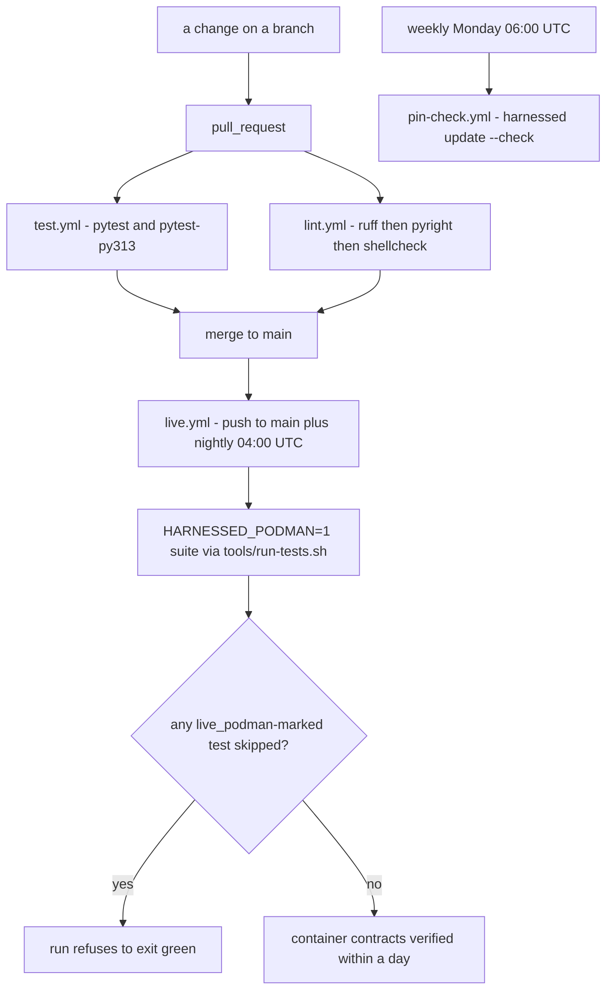

# The verification ladder

Four CI gates, one oracle they share, two packaging/mutation checks, a drift check over this wiki
itself plus the regeneration path that stands behind it, and local tools that replay the ladder
before a PR. The organizing rule is stated once and never relaxed: **a green at one rung says
nothing about any rung above it.** A green pytest run performs no `podman build` and no
`harnessed container-run` — CLAUDE.md says exactly that, in one line, at the end of its test
section. A green lint run says nothing about types or tests. The live layer and the pin check do
not run on pull requests at all, so a green PR merge has proven, by construction, nothing about
containers or about registry drift.

The gates also *understate*: each one stops at its first failure, so a red run tells you what broke
and silently withholds what was never checked. `tools/preflight.sh` exists to remove that locally
(see [The developer loop](#the-developer-loop)).

Related: [system overview](/openwiki/architecture/overview.md),
[invariants](/openwiki/concepts/invariants.md),
[supply chain: scans, pins, locks](/openwiki/operations/supply-chain.md),
[the capability test](/openwiki/workflows/capability-test.md),
[harnessed quickstart](/openwiki/quickstart.md).

*Which workflow runs when, and the one refusal that turns a skip into a failure. Nothing in this
diagram runs the live layer or the pin check on a pull request.*

---

## Rung 1 — the hermetic pytest suite

`.github/workflows/test.yml`, job `pytest`, runs `uv run --extra dev pytest` on `pull_request` and
`push: [main]`. There is deliberately **no `paths:` filter**: when a workflow is a required status
check, a path filter deadlocks any PR that does not touch the filtered paths — the check never
reports, so the PR can never merge.

The Python range is covered by **two jobs, not a matrix**: `pytest` (3.12) and `pytest-py313`. A
matrix rewrites the check name to `pytest (3.12)`, and `pytest` is a required status check on this
repo — renaming it leaves branch protection waiting on a context that never reports again. The 3.13
leg exists because the declared range is `requires-python = ">=3.12"`, so 3.12 alone only proves the
floor. 3.13 has already changed pathlib, dict/asyncio and warnings behaviour under this code at
least once.

Locally, `mise.toml` pins `UV_PYTHON = "3.12"` — the floor of `requires-python`, and what CI's
default job runs. Left unpinned, uv picks the newest interpreter on the box (3.13 here), so no local
run exercises the version CI uses or the version the project claims to support, and any behavioural
difference between the two is invisible by construction. That is not theoretical:
`Path.resolve()` raises on a failing readlink under 3.12 and swallows it under 3.13, which hid a
real crash in catalogseed through a full local review (bd harnessed-925). Local covers the floor; CI
covers the top of the range.

**What it proves.** Pure functions, the assembly oracle over every catalog stack, emitted-artifact
text, and — the part that shapes everything below — **repo-asset invariants**. The suite asserts
against checked-in assets, not only `src/`: the workflow YAML under `.github/`, the catalog, the
JSON schemas, and the shell scripts under `tools/`. This is also why `mutmut`'s `also_copy` has to
be wider than `tests/` (see [Mutation testing](#mutation-testing)) — and why a missing asset errors
at collection, which makes every mutant report "survived" for want of a runnable suite rather than
failing the assertion it weakened.

**What it does not prove.** Any container behaviour. The `ubuntu-latest` runner has no podman, so
every `HARNESSED_PODMAN`-gated integration test **skips** there. That is deliberate and it is not
the whole story: those tests have a home in `live.yml`. Before that job existed they ran nowhere at
all, and the hermetic job's skip count was the only trace of it. The hermetic run now prints a
"live verification" section naming what did not execute. **A skip is not a pass** — a reassuring
skip count over a suite that ran nowhere was the original defect this ladder was built to close.

**The count is part of the result.** Record the baseline test count before your change: **a drop is
a regression even if your new tests pass.** A suite this size (~2200 tests) hides a silently
deselected file behind any green tick, and the count is the only signal that catches it.

### Order independence and the console environment

`pytest-randomly` is a declared dev dependency, not an accident: every count this suite reports
rests on the suite being order-independent, and ~2200 tests is well past where order-dependence
stays visible by inspection. A test that only passes in one order is a latent failure, and the
randomizer is what keeps finding that out.

The console environment is pinned the same way. `src/harnessed/console.py` constructs the two
process-wide `Console` objects at **module import** (`_out`, `_err`, both `_WarnCountingConsole`
instances), and `launcher.py` imports them, so whether rich decides to emit ANSI is fixed before any
test body runs. `tests/conftest.py` therefore pins the colour environment at import. The consequence
for a contributor is a hard rule: a plain-text-vs-ANSI assertion failure means **the environment is
wrong, never the assertion** — do not "fix" it by weakening what the test asserts about rendered
output.

`pythonpath = ["tests"]` in `[tool.pytest.ini_options]` makes `support` and `conftest` importable as
top-level modules; the same path is declared for pyright as `extraPaths`, because pytest's setting
is pytest's alone and a type-checking layer whose result depends on where it runs cannot be held at
a fixed number.

---

## Rung 2 — the live layer behind `HARNESSED_PODMAN=1`

`.github/workflows/live.yml` is the home for everything the hermetic runner skips. It triggers on
`workflow_dispatch`, `push: [main]`, and a nightly `cron: "0 4 * * *"` (04:00 UTC — contract drift
found next morning, not by a user).

**Deliberately NOT on `pull_request`.** These tests run `podman build`; adding those minutes to every
PR would get the job disabled within a week, and **a disabled check verifies exactly as much as a
skipped one**. Post-merge plus nightly catches drift in the external contracts — podman's
inspect/port/images output formats, and the live behaviour of every pinned tool — within a day,
which is the timescale those actually change on.

The automatic triggers were only enabled after the suite was measured green against a real podman
(`HARNESSED_PODMAN=1 pytest` → 2166 passed, 1 skipped). Scheduling a nightly job against a suite
that is red from day one produces a check people mute within a week, which verifies exactly as much
as the skip it was meant to replace. Four defects stood in the way, all fixed first: test-isolation
leakage from linked catalog dirs left behind after the first test, a capability sweep invoked with
no harness (a usage error — all 7 parametrizations failed in 27 s without podman doing any work), a
persist round-trip against a stack that never existed under any naming scheme, and a transitive
`mcp` 2.0.0 rename that killed a shipped recipe's server at import in every container.

### The shape of the job

- **`timeout-minutes: 60`.** Observed runtimes were 15:03, 14:41 and 23:47; a 30-minute budget came
  within six minutes of a kill, and a timeout kill presents as an *unrelated* failure — the worst
  way for this job to go red. mise also provisions shellcheck and pyright on a cold runner now,
  widening the gap further.
- **Podman availability is verified loudly**, not assumed: `podman --version` plus `podman info`,
  installing it if the runner image ever drops it. This job's entire value is that podman is really
  here; if it were absent the suite would skip its way to a green tick.
- **`aoe` is deliberately not provisioned.** ARCHITECTURE.md and `src/harnessed/aoe.py` both say
  harnessed "neither requires nor installs" it, and its tests carry no `live_podman` marker, so they
  are reported and never fail the run — a declared choice, not a gap. (The workflow's comment still
  credits `mise.toml` with provisioning `dolt`; `mise.toml`'s `[tools]` declares only shellcheck,
  pyright, varlock and openwiki today — the beads-era need is gone, that recipe having been retired.
  Read the comment as history, not as a current dependency.)
- **`mise` is installed with a pinned version** (`2026.8.2`) because `tools/run-tests.sh` shells out
  to mise on its first line — without it the job dies having run nothing.

### The base image must exist before pytest starts

The workflow runs a bare `mise exec -- uv run --extra dev harnessed build` **before** invoking
pytest, and the ordering is load-bearing: `test_live_verification_debt.py` skips two gated tests
unless `localhost/harnessed-base:latest` exists, and evaluates that precondition at **collection
time** — before any test runs. The capability sweep later in the suite does build the image, which
is why this looked like it should already work, but by then the skip decision is made. Both tests
skipped on every run the workflow had ever done until this was fixed — and because they carry the
`live_podman` marker, they were what failed the run, not the aoe and dolt gates the report listed.

It is a **bare** `build`, not `build default claude`, because bare `build` (`launcher._build_images_cmd`)
builds exactly the base and agent images and then reconciles stacks (`_reconcile_stacks`) — a no-op
on a fresh runner. `build <stack> <harness>` would additionally build the derived image, run the
credentialed supply-chain rescan, and create the stack's podman volumes: work the suite does again
inside pytest in a separate process the build-once cache cannot deduplicate, and volume creation
ahead of the tests that exercise volume creation would mask a cold-start failure.

`GITHUB_TOKEN` is **required** on both the build and the test step, not a nicety: mise's aqua
backend resolves several pinned tools through `api.github.com`, an unauthenticated runner shares one
heavily-used rate-limit pool, and when it runs out the API answers 403 mid-layer
(`aqua:cli/cli@2.96.0 … 403 Forbidden`) — which reads as a broken pin when the pin is fine. Passing
the workflow token raises the limit from 60/hr per IP to 1000/hr per repo, needs no secret to be
configured, and is read-only. The test step needs it for the same reason at one remove: stack images
install their `tools:` at container runtime through mise, so an unauthenticated 403 there fails a
test rather than a build, which is harder to read.

### The fail-closed skip accounting

The suite itself is invoked **through `tools/run-tests.sh -v`** with `HARNESSED_PODMAN=1`, never as a
hand-composed pytest line, so CI and a developer's box run the same thing by construction.

`tests/conftest.py` holds the guard that makes this rung honest: **when `HARNESSED_PODMAN=1` is set
and any governed test skipped, the run refuses to exit green.** "Asked for live verification and
silently delivered none" is the exact failure mode this exists to catch — a broken podman cannot
masquerade as success here.

The division of labour inside that guard is deliberate and was learned the hard way:

- **Skip *reasons* are pattern-matched for the report only** — to name what sat out.
- **The fail-closed decision uses the `live_podman` marker, never the wording** of the reason —
  because the one skip that failed a real run was the one reason not printed. Discovery of *what to
  list* may be fuzzy; the decision of *whether to fail* may not be.

A skip count is not neutral information on a run that asked for the gated layer.

### What the live tier asserts — and the seam it stops at

The live contract tests point production parsers at real external output: podman's
`inspect -f {{.State.Running}}` and `{{.Id}}`, the `addr:NNN` lines of `podman port`, the tty
column of `podman top`, the label-filter repository list, a real `mise trust` flow, and varlock's
JSON resolution. Each passes only when the external binary still produces the format the parser
expects — a parser cannot pass here by agreeing with a private copy of itself.

The varlock those resolution tests run is itself a pin: `mise.toml` declares `npm:varlock`
**1.16.1**, verified against this tree **2026-08-18**, and the live resolution tests are the
reason the pin exists. Separately, the proxy-shape regexes in `launchenv.py` — what counts as
opting into the proxy model — are measured against varlock **1.17.0**, a different binary at a
different date. The sources carry both references deliberately: one is a pinned install, the
other a measured behaviour, and silently reconciling them into a single "verified version" would
overstate at least one of them. (Note what the weekly pin check does *not* cover here: it sweeps
the catalog; `mise.toml`'s own `[tools]` pins land as their own dated PR via the `upgrade-pr`
task, by hand.)

The broker half of the same feature is where this rung's honesty has to be sharpest. The launch
gate and pod-args tests are hermetic, and they assert through injected seams: a spy stands in for
`broker.start`, `shutil.which` is stubbed so a test measures schema content rather than the
host's PATH, and the port-free predicate is injected. What they settle is real behaviour, stated
as assertions rather than comments. When nothing opts in — no `@proxy` anywhere in the composed
schema, project or global — **no varlock subprocess runs at all**, asserted on the spawned argv
list and not on "no broker was recorded", because `varlock proxy rules` resolves values and can
sit on a 1Password unlock prompt, so buying one for a schema that opted into nothing is a real
cost ("capability absent, not merely empty", in the issue's words). And a broker that cannot
start **fails the launch** — SPEC decision 2, the escape hatch being `--no-secrets` — because the
alternative is a pod wired half-way to a proxy that is not there; the failure message names the
hatch and prints no resolved value.

But the pod-args docstring draws the boundary in one line, and the ladder keeps it: these tests
assert the argv the launcher hands `podman pod create`; **what they cannot show is a packet
crossing that route — no test in this repo starts a pod.** The composed
`pasta:--map-host-loopback,169.254.1.1,…` form was verified live once, by the epic #388 Phase 0
spike; that spike is history, not a rung, so nothing in CI ever proves a secret actually crosses
the 169.254.1.1 door. Every other gate on this rung exercises a real container; this one seam is
verified only at the layer below it.

---

## Rung 3 — the lint layers, held at zero

`.github/workflows/lint.yml` runs ruff, pyright and shellcheck as a **merge gate at zero** on
`pull_request` and `push: [main]` (again with no `paths:` filter). Since #369 burned all three to
zero, the gate needs no ratchet and no committed baseline file — the threshold is simply zero, the
only threshold nobody has to maintain. The history is the point: the three counts (190 / 74 / 0)
were carried for a long time as a "baseline" every task measured its delta against, which is
precisely what kept them alive — a debt compared against itself never shrinks, and #264 had already
recorded that the figures were "too high to gate on as-is".

If a change genuinely needs a finding kept, the answer is a `# noqa: <RULE>` (or a pyright
suppression) **carrying the reason on the line itself**, not a raised number here. That keeps the
justification next to the code where the next reader meets it.

Each layer is its own step so a red run names the layer in the GitHub UI without anyone opening the
log. There is **no `continue-on-error` anywhere**: each tool exits nonzero on a finding and that
must fail the job — a lint gate that reports without failing is a report, not a gate.

The job id is itself the status-check context name, which is why it is not renamed or wrapped in a
matrix (the same trap `test.yml` calls out for `pytest`): a renamed check silently leaves branch
protection waiting on a context that never reports again.

### The order is the contract

The layers run **ruff → pyright → shellcheck**, in that order, and the order is information:
**a ruff finding means pyright and shellcheck never ran.** A red lint run understates what is
unverified; read it as "at least this is broken", never as "only this is broken".

### The exact argv

- ruff: `uv run --extra dev ruff check src tests tools`
- pyright: `pyright --pythonpath "$(uv run --extra dev python -c 'import sys; print(sys.executable)')"`
- shellcheck: `shellcheck $(git ls-files '*.sh')`

The pyright `--pythonpath` is not optional. `mise.toml` puts the venv **outside the repo**
(`UV_PROJECT_ENVIRONMENT` under `~/.local/share/harnessed/venvs/<branch>/.venv` — one venv per
branch so branches cannot clobber each other's dependencies) and activates it via `_.source`, so a
developer's bare `pyright` inherits `VIRTUAL_ENV` and resolves everything. A CI `run:` step gets no
such activation, and pyright then finds none of the installed packages — the first run of this gate
reported 402 phantom `reportMissingImports` for pytest/harnessed/hypothesis on a tree that is
genuinely at 0. The interpreter is asked for explicitly, from the same source of truth uv and pytest
use, rather than inherited from whatever the shell happened to export.

`catalog/**` is inside the shellcheck set on purpose: those install scripts run **inside recipe
images as root**, so a quoting bug there is a container build that fails opaquely — or worse,
succeeds wrongly. They are the shell most worth checking and the least often read.

### Versions come from mise, not the runner

pyright and shellcheck are pinned in `mise.toml` (`npm:pyright` 1.1.411, `shellcheck` 0.11.0), **not**
in the dev extra, and the job runs `mise-action` with `install: true` before the lint steps. A tool
resolved from the runner's ambient PATH would make this gate unreproducible — the failure mode that
lets a green CI disagree with a red local run. The Python-package lint tools (ruff, mutmut,
diff-cover, hypothesis, pytest-randomly) are the mirror image: declared in the `dev` extra precisely
so a check does not only run on machines where someone happened to install the binary.

### What the lint configuration chooses

- **ruff selects correctness and security, not style**: `E9, F, B, S, PLE, RUF, BLE`, with
  `target-version = "py312"` — the floor, not the newest interpreter around, because set to py313
  ruff green-lights 3.13-only constructs that break on the 3.12 this project claims to support and
  CI runs. Formatting is deliberately **not** enforced — the codebase's layout is hand-tuned and
  reformatting it would bury real findings under thousands of diffs. `S` is flake8-bandit, so there
  is no separate bandit dependency. `S603`/`S607` are ignored project-wide because this tool's
  entire job is driving podman, git and mise as subprocesses. `BLE` is *enabled* so the existing
  deliberate `# noqa: BLE001` markers stay meaningful instead of being reported as unused by
  `RUF100` — leaving BLE out of `select` would make "fixing" those markers strip them before the
  rule they document was ever switched on. `tests/**` ignores `S101` because `assert` is what a test
  suite is made of. Bugbear's `B008` is handled by listing `typer.Option`/`typer.Argument` as
  immutable calls rather than muting the rule, so it still fires on a genuine mutable default.
- **pyright runs `basic`, not `strict`**, over `src`, `tests` and `tools` with
  `extraPaths = ["tests"]` and `pythonVersion = "3.12"` (the floor, for the same reason as ruff's
  `target-version`). `strict` would report far more and become a number nobody looks at. The
  `src/harnessed/catalog` symlink target is excluded because those scripts execute inside recipe
  images against dependencies (mcp, starlette, uvicorn) the host package deliberately does not
  install; in pyright `exclude` overrides `include`, so listing the subpath narrows `src/` with no
  wider side-effect.

**What this rung does not prove:** nothing about runtime behaviour, nothing about the catalog's
content correctness beyond what static analysis can see, and — because of the ordering above —
whatever the later layers would have found whenever an earlier layer is red.

---

## Rung 4 — the pin check

`.github/workflows/pin-check.yml` runs `uv run --extra dev harnessed update --check` on a weekly
schedule (Mondays 06:00 UTC, `cron: "0 6 * * 1"`) and on `workflow_dispatch`.

**Deliberately not `pull_request`.** This check resolves **live registries**, so its result depends
on what npm/PyPI/GitHub published today, not on the diff. As a PR gate it would fail an unrelated
contributor's branch the moment a third party cut a release — red through nobody's fault, and
unfixable by the author. A check that behaves that way is one everyone learns to ignore. A failing
**scheduled** run is the notification, the same role Renovate and Dependabot play for staleness.

Weekly, not daily, because the gate already refuses anything published inside the minimum release
age (`DEFAULT_MINIMUM_RELEASE_AGE_MINUTES = 7 * 1440`, i.e. 7 days): a daily run would re-report the
same pins six times before any of them became offerable.

It exits non-zero **only** for a pin that is stale, past the minimum release age, and not held.
Held pins (a recipe's `install.hold`, a `tools:` entry's `hold`), cooling pins, and unresolvable
ones are all reported in the output without failing. An undated release is never selectable — the
age gate cannot be honoured for it, so it is surfaced rather than waved through.

mise is installed on the runner (`install: false` — the binary, not the tools) because `tools:`
entries with no backend prefix (currently `pulumi@3.256.0`) resolve through `mise registry` to the
aqua `owner/repo` backing them, then read that repo's dated GitHub releases. Without mise those
pins degrade to "unresolved" — reported, never silently skipped, but unchecked. Installing it is
what keeps the sweep actually complete.

One divergence worth naming: `pin-check.yml` is the only workflow of the verification set whose
actions float on mutable tags (`actions/checkout@v5`, `astral-sh/setup-uv@v7`, `jdx/mise-action@v2`).
`lint.yml`, `test.yml` and `live.yml` pin every action to a commit SHA — a git tag is mutable, so
whoever controls the action can repoint `v5` at different code that then runs on the runner — and
set `persist-credentials: false` because no later step needs git auth. If you touch that file, decide
deliberately whether to bring it into the pattern.

---

## The oracle the live layer asserts: the capability test

`harnessed test <stack> <harness>` (the `test` entrypoint in `cli.py`, reached from
`launcher.test_stack`) is the only thing on this ladder that answers *"did the build actually
deliver what its manifest declares?"* — and its design is the reason a green capability report is
meaningful rather than self-confirming.

### The manifest is the oracle

Expected capabilities are **derived, never hardcoded**: `schema.expected_capabilities(stack, recipes)`
unions two sources — (1) what the assembler can *see* (`mcp.servers`, and the standalone
`skills:`/`commands:` dirs it fans into the profile), and (2) what a recipe *declares* via `expect:`
for capabilities it delivers through its Dockerfile or install script, which the assembler cannot
infer. The union is de-duplicated order-preserving (`dict.fromkeys`), so a recipe that both ships and
declares the same name counts once. A recipe that bakes a tree into the image must list it under
`expect:` — that is the whole contract (`catalog/recipes/superpowers` lists all fourteen skills,
installed by `install.sh` precisely because the declarative `skills:` field cannot see them; `rtk`,
which ships no skill surface and has no `expect:` kind for "a binary runs", is verified manually
instead).

### The probe goes to the right place

`run_capability_test` launches the stack `--fresh` **headless** (`HARNESSED_HEADLESS=true`), waits
for readiness, introspects the live pod, runs any recipe-authored tests, tears the instance down,
and diffs expected against live in one structured `CapabilityReport`.

The instance name is **host-derived** through `paths.instance_name` — the same pure function of
stack + harness + resolved project path the launcher hashes — so the oracle never depends on
scraping the launcher's stdout. The launch grammar it invokes is the current
`container-run <harness> <path> --stack <name> --fresh`; the older bare form this used to call was
rejected by typer as `No such command '<stack>'`, and *nothing caught it* because the only callers
were the podman-gated layer that was never running — the ladder's own original defect, again.

Two probes, both deliberately **auth-free** and harness-independent:

- **MCP** — hatago's `hatago://servers` resource over Streamable HTTP (the JSON snapshot of the
  connected child servers behind the hub), read with a small JSON-RPC handshake inside the pod that
  is tolerant of hatago schema drift (any dict carrying a `name` counts as a server entry; a server
  is connected unless an explicit status/connected field says otherwise).
- **Skills / commands / plugins** — a plain `ls -1` of the mounted profile filesystem
  (`$CONTAINER_HOME/.claude/<subdir>`), stripping `.md` from command files to recover the name the
  manifest uses.

The headless LLM probe (`claude -p --output-format json`, `omp -p --mode json`, `opencode run
--format json`, `agy -p`, `codex exec`) is the **backstop only**, reached when the machine-readable
source is empty; `harness` routes only that fallback. Nothing in the primary path needs a credential
or a model.

### The race the poll exists to lose gracefully

`wait_ready` returns as soon as hatago's own port accepts a connection — it does **not** wait for
the stdio children hatago spawns to finish connecting, and that gap was measured at 0.3 s on a warm
box and is unbounded on a cold one. A single read into that gap reports a perfectly healthy server
as `not connected`. So `introspect_mcp` turns the read into a deadline poll keyed on the *declared*
names, with the deadline starting after the first probe and bounding when a probe may *start*, not
merely when a sleep may end — otherwise a hanging `podman exec` consumes the whole window before the
loop is entered even once. A partial answer is deliberately returned even when incomplete, because
`build_report` marking the absent names individually says more than discarding it and asking the
LLM. A stack that declares no MCP servers pays none of this latency.

### One result, two audiences

`CapabilityReport.ok` / `.exit_code` derive from the same structured result that `report.py`
renders: green only when every expected capability is present or connected; exit 0 / 1 for CI. One
mechanism, two audiences — the user sees the markdown table, CI sees the exit code (or the
`--json` document, printed to plain stdout with no rich styling so CI gets a clean document).

**The report carries capability names and status only, never config values** (threat T-02-07). The
`detail` on a missing MCP server names where it looked and a pointer to remediation — re-run with
`--keep`, then `podman exec <instance> cat /tmp/hatago.log` — never the log itself, because hatago's
children are MCP servers that take credentials from the environment and `--json` feeds this report
to a public CI log. An earlier version of the module copied a 200-line log tail into the report;
that was the violation this shape exists to prevent. A recipe-test failure detail is `exit <n>` plus
one truncated tail line, capped at 120 characters, for the same reason.

### Recipe-authored tests

Any `*.sh` under a resolved recipe's `tests/` dir is a test — convention over schema, no `tests:`
field, and discovery inherits the user-overlay precedence for free because it walks the
already-resolved recipes' roots. They are `podman cp`'d into `/tmp/harnessed-tests/<recipe>` and
exec'd in the real running instance with a documented env contract (`HARNESSED_STACK`,
`HARNESSED_RECIPE`, `HARNESSED_TEST_DIR`, `HARNESS`, `CONTAINER_HOME`, `HATAGO_ENDPOINT`,
`HATAGO_PORT`), each bounded at 120 s; a script that cannot be copied in folds as a failure rather
than vanishing. Each exit code folds into the **same** report as a `TEST`-kind result, so a failing
script goes red through the same `.ok`/`.exit_code` a missing skill does — no second gating path.
`--no-tests` runs only the presence oracle.

`harnessed test` itself validates the harness, auto-assembles first when the profile is missing or
stale (`is_built` plus `staleness.check_profile_fresh`), then delegates to the `harnessed-tools
test` entrypoint in a subprocess (via `uv run --no-project … python -m harnessed.cli test` when `uv`
is on PATH, else `python3 -m`) with **no outer timeout** — the child bounds its own work per test,
and a second deadline out here would only cut off a run that is legitimately still going —
propagating the child's return code as the CLI exit.

**What this oracle does not prove:** anything about the *host* backend (it launches a pod), anything
about interactive attach, and anything a recipe did not declare — which is exactly why the authoring
rule is "declare what your Dockerfile delivers".

---

## The wheel-packaging gate

Because `catalog/` ships **inside the wheel** (through the `src/harnessed/catalog` symlink plus the
package-data glob), an installed `harnessed` carries its own recipes, agents, services, stacks and
base Dockerfiles and needs no repo on disk. The suite closes the obvious failure mode of that
design: `tests/test_wheel_packaging.py` builds a real wheel and fails if host-local content shows up
in it. What must stay out is exactly what `[tool.setuptools.exclude-package-data]` names — the
user-overlay symlinks (`catalog/*.local`, which setuptools would otherwise follow into the user's
private overlay and publish), the resolved per-user `extra-tools.txt` (the committed seed
`extra-tools.default.txt` ships; the resolved copy must not), and `recipes.backlog`. The failure
mode it cannot catch: it proves packaging *content*, not that an installed wheel can build and run a
stack — an installed binary's container behaviour is still only exercised by the live layer.

---

## Mutation testing

`[tool.mutmut]` in `pyproject.toml` asks the question coverage cannot: **does a test fail when the
code is broken, or does it merely execute the line?** It mutates `src/harnessed/` from the AST — no
hand-written mutants to rot — and is declared in config rather than passed ad hoc so the layer is
reproducible.

Two configuration decisions carry the weight:

- **`also_copy` is wider than it looks like it should be** — `tests/`, `.github/`, `catalog/`,
  `tools/`, `schemas/`, `mise.toml`, `README.md` — because this suite asserts against **repo
  assets**, not only `src/`. Those tests resolve paths relative to the tree root, so anything they
  read has to exist in the mutants tree or they error at collection and every mutant reports
  "survived" for want of a runnable suite. It is the whole directory, not a file list, because
  `support` and `conftest` are imported as top-level modules and mutmut does not create parent dirs.
- **A mutant must be killed by a test that runs WITHOUT a container.** The suite is
  podman-*gated*, not podman-driven: a mutant only reachable through a `HARNESSED_PODMAN` test would
  survive every hermetic run and the score would measure the gate, not the tests.

Known traps, both found by running it:

1. `harnessed_home()` resolves through the `src/harnessed/catalog` **symlink**, which does not exist
   in the mutants tree — export `HARNESSED_DIR=$PWD` when running mutmut.
2. A **non-matching filter is silent**: mutmut exits 0, generates the tree, and `mutmut results`
   prints every mutant as `not checked`, which looks like a clean run. Mutant names are
   `harnessed.<module>.x_<function>__mutmut_N` — no `src.` prefix, `x_` before the function.
   Additionally, mutmut's copy dereferences symlinks, so `catalog/*.local` arrive as real dirs and
   the few tests asserting a link *is* a link fail there; scope a targeted run by narrowing
   `tests_dir` to the files covering your change.

That scoping is not a workaround but the intended use: `mutmut run` with no arguments mutates
everything, while a single change runs
`HARNESSED_DIR=$PWD mise exec -- uv run --extra dev mutmut run "*<function>*"` and reads
`mutmut results`.

---

## A fifth gate that is not a rung: this wiki's drift check and regeneration

The wiki you are reading is itself held to a check — a precisely bounded one. `mise run
openwiki-drift` (`tools/openwiki-drift.py`) recomputes each Claim's evidence digest against the tree
and **exits non-zero when cited code has actually changed**, which turns "which pages are lying"
into a check rather than a regeneration and makes it the cheap thing to run before deciding to
regenerate. It is *not* a verifier of every Claim, and the boundary is deliberate:

- **Only line-ranged evidence anchors are verified** — `repo://<path>#L<a>-L<b>` whose version
  records the known `repo-lines-v1` digest. Whole-file evidence (no `#L` range) carries nothing to
  hash against, and an unknown version scheme must be reported as unverifiable rather than checked
  with v1 rules — that would let the gate go quietly green. Both are skipped, counted, and printed
  as a separate `skipped` line: never silently treated as verified.
- **A block that moved is not drift.** Ordinary development shifts line numbers constantly. An
  anchor that misses its exact lines is re-found by scanning the file for any same-length window
  with a matching digest and classified `moved` — identical content, different line numbers —
  which is reported but never fails the check. Only `changed` (cited code genuinely differs) and
  `missing` (file gone) are drift. The tool carries its own dated measurement of why the split is
  the whole point: on a one-week window of normal work, **27.5% of anchors had moved versus 4.7%
  that genuinely changed — and only the second number is a review queue.** A check that treated
  every moved block as drift would report ~30% of Claims stale after a week, which is noise that
  trains you to ignore it.
- **The exit contract makes it a gate**: `0` no Claim's evidence changed, `1` at least one Claim's
  cited code changed or its file is gone, `2` the wiki or its Claims are unreadable or malformed —
  an explicit exit 2, because an accidental exit 1 would collide with the one status a caller gates
  on. `--rev` diffs against a git revision instead of the working tree (what a wiki generated then
  would say about now), `--quiet` prints nothing but the exit status, and `--strict-lines`
  collapses the moved/changed distinction for when a reformat *should* count.

### The regeneration workflow verifies the native addon it installs

Its generation counterpart, `openwiki-update.yml` (nightly 08:00 UTC plus `workflow_dispatch`),
checks out full git history so the diff against the last-documented commit is nonempty and sets
`persist-credentials: false`; it is deliberately *not* fail-fast, because openwiki's page-job queue
is durable — a run that dies partway has already written every page it finished, and the PR step
banks that progress as the next baseline — so the failure is re-raised at the end and the job still
reports red. That is the opposite trade-off from the lint gate, and the right one for a job whose
output is cumulative rather than binary.

The workflow installs openwiki with `npm install --global` — deliberately **not** the recipe's
project-scoped pnpm install — and then **verifies the native addon actually built before running
anything**. The constraint is identical wherever openwiki is installed: openwiki statically imports
`SqliteSaver` (reaching `better-sqlite3` transitively through
`@langchain/langgraph-checkpoint-sqlite`), so a missing `better_sqlite3.node` does not degrade one
subcommand — it breaks every subcommand at import. The two runners solve it differently because
their defaults differ:

- **On the CI runner, npm still runs dependency lifecycle scripts by default** (npm 10/11), so the
  addon builds today with no allowlist at all. The risk is the known future flip: **npm 12 blocks
  dependency lifecycle scripts by default** and requires an explicit opt-in, so the day this
  runner's npm crosses that line the install will still "succeed" while the addon silently never
  builds. The verify step converts that silent future break into a loud one — it searches the
  global `node_modules` for `better_sqlite3.node` and fails with the fix in the error message.
- **Inside this repo's own images, the base pnpm policy sets `strictDepBuilds: true`** — lifecycle
  default-deny, live in the v11 global config — and pnpm v11 *rejects* `allowBuilds` from that
  global config, so the allowlist cannot simply be added there. `catalog/recipes/openwiki`
  therefore installs project-scoped: `install.sh` copies its own `pnpm-workspace.yaml` into a
  private manifest — a global `pnpm add -g` would ignore the project allowlist entirely, which is
  the whole reason the recipe does not use `tools:` — carrying a reviewed one-entry
  `allowBuilds` allowlist (`better-sqlite3: true`), then checks for `better_sqlite3.node` by name,
  because a denied build surfaces as "Could not locate the bindings file", which reads like a
  broken Node install rather than a denied script.

**The local path is the third context, and it fixes the constraint on the pin itself.** `mise.toml`'s
`npm:openwiki` 0.4.3 pin — the install `mise run openwiki-update` runs against, and the tree the
retry patch anchors to — carries two escape hatches, both required and both failing in a way that
does not look like a packaging problem: `trust_policy_excludes` for `fastq@1.20.2`, because aube's
no-downgrade trust policy refuses an install with no provenance attestation, and `allow_builds` for
`better-sqlite3`, because mise installs through aube, which denies dependency lifecycle scripts by
default. Denied, the install still reports success and every openwiki run dies at `Could not locate
the bindings file` with a 14-line list of paths it tried — so the reviewed allowlist is carried
where it is actually read, not left to the environment.

Three contexts, one constraint — and each fix is the one that fits its runner's defaults.

### Local regeneration: `mise run openwiki-update` and the retry patch

The local entry point is `mise run openwiki-update`, and its first act is to run
`tools/openwiki-retry-patch.py` **before every run** — which is also what re-applies it after any
`mise install` that restores the stock runner, because the patch is idempotent.

The patch exists because of how an openwiki run fails: a page worker that ends its turn without
calling `submit_page` is marked *skipped*, the run finalizes `interrupted` **without advancing the
diff base**, and the next run therefore regenerates the whole changeset. That was observed with
glm-5.3-flash (94 LLM calls, a clean exit, no tool call — PR #445 run 6), and upstream 0.4.3 and
0.5.0 were verified to ship no retry (2026-09-08). The patch gives each page worker **one fresh
second attempt** sharing the worker's virtual backend — attempt 2 sees the page markdown attempt 1
already wrote — before the page is skipped.

The patch is defensive about its own applicability, on purpose:

- It is **idempotent**: a marker identifies an already-patched runner; `--check` exits 0/1 to report
  patched state without touching anything, and `--revert` restores the `.orig` backup.
- It **fails loudly when its anchor text no longer matches** — the `runPageAgent` anchor, the
  exactly-one agent declaration, the exactly-one worker try-block — and refuses any install whose
  version is not the verified 0.4.3. Version drift means a human re-derives the patch against the
  new layout; the tool must never patch blind.

One paragraph on the task's environment discipline: provider exports are `env -u`-stripped
**before** `varlock run`, because a shell export outranks the schema — a stale `OPENWIKI_PROVIDER`
export once repointed a 13-hour run at the wrong provider (2026-09-04), and run 7 (2026-09-08) died
on a shell export of `OPENWIKI_MAX_OUTPUT_TOKENS` that beat the schema's cap and tripped the SDK's
non-streaming guard on the planner's one non-streaming call. The `--filter` narrows varlock
resolution to openwiki's own keys so a wiki run does not pull agent tokens out of 1Password into the
inference endpoint's process, and the task runs from `main/`, not a worktree (`docs/` is a
gitignored live clone that only a `main/` checkout has).

---

## The ladder in one table

| Gate | Where | Runs on | Proves | Does not prove |
|---|---|---|---|---|
| hermetic pytest | `test.yml` jobs `pytest` / `pytest-py313` | PR + push main | pure functions, assembly oracle, emitted text, repo-asset invariants, order independence | any container behaviour — no podman build, no `container-run`; gated tests skip, and a skip is not a pass |
| live layer | `live.yml` job `live` | push main + nightly 04:00 + dispatch | real `podman build`/run, capability oracle per stack, external contract drift within a day | nothing on PRs; nothing about the host backend; and no packet across the broker's 169.254.1.1 route — that argv layer is asserted hermetically, through injected seams |
| lint | `lint.yml` job `lint` | PR + push main | ruff correctness/security at zero, pyright basic at zero, shellcheck over every tracked script | runtime behaviour; layers after a red one never ran |
| pin check | `pin-check.yml` job `pins` | weekly Mon 06:00 + dispatch | stale, unheld, past-age pins across the catalog | nothing about code correctness; nothing on PRs by design |
| capability test | `harnessed test <stack> <harness>` | inside the live layer, or by hand | the manifest's declared capabilities are present in a running instance | undeclared capabilities, host-mode behaviour, interactive attach |
| wheel packaging | `tests/test_wheel_packaging.py` (in the suite) | every pytest run | the shipped wheel carries the catalog and no host-local content | installed-wheel runtime behaviour — still the live layer's job |
| mutation | `mutmut run` (config in `pyproject.toml`) | on demand | a failing change fails a container-free test | anything reachable only through a gated test |
| wiki drift | `mise run openwiki-drift` | on demand | which Claims' line-cited code has changed or its file is gone — a moved-but-identical block is not drift | whole-file and unknown-scheme evidence (skipped and counted, never verified); anything a page never cited |
| wiki regeneration | `openwiki-update.yml` / `mise run openwiki-update` | nightly 08:00 + dispatch; locally on demand | a refreshed, Claim-grounded wiki whose native addon is verified before use; one retry per skipped page worker before the run banks partial progress | that the Claims are still true — that is the drift check's job, run before merging the PR |

---

## The developer loop

Two scripts put the ladder on your desk before CI does, and one habit makes the counts mean
something.

**`tools/run-tests.sh` — the only way to invoke the suite.** CLAUDE.md's instruction is absolute:
run the script, do not hand-compose `mise`/`uv`/`pytest`. It handles worktree setup, is idempotent,
and absorbs three traps that fail locally while CI stays green — the per-branch venv living outside
the repo, the mandatory `--extra dev`, and mise's untrusted-config refusal (the enumeration lives in
`live.yml`'s own comment and in the run-tests skill; CLAUDE.md states the count and points there).
It is what `live.yml` invokes, so CI and a developer's box run the same thing by construction.
**Record the baseline test count before your change: a drop is a regression even if your new tests
pass.** Supports one file, filters, `-x`; the suite is small and fast enough to always run whole.

**`tools/preflight.sh` — every gate, in CI's order.** Run it before every PR. `uv run pytest -q`
alone covers **one gate of four**; a green suite is not a green CI. It runs pytest, then `ruff` →
`pyright` → `shellcheck` — CI's exact order and CI's exact lint argv — with two flags: `--all` adds
the catalog pin check, `--no-tests` runs the lint layers only.

A tooling nuance the identical argv hides: pytest and ruff run through `mise exec` from the
`dev` extra, but **pyright and shellcheck are looked up on the ambient PATH** — `mise.toml` pins
the versions CI installs via mise-action, and if the binary is missing locally the layer is
skipped and named rather than failed. The argv is CI's; the binaries are whatever the box has,
so a version skew between them is possible, and the skipped lines are how the summary admits it
(it never prints a bare "all gates passed" over a skipped layer).

Its **one deliberate divergence from CI**: it runs every gate even after an earlier one fails. CI
stops, and a stopped run *understates* what is unverified — a ruff finding there means pyright and
shellcheck never ran. Preflight keeps going and reports each skipped layer **by name**, so a local
run answers "what else is broken" in one pass instead of four.

**The two end-to-end oracles.** A contribution is done when `harnessed test <your-stack>` is green
and the live integration test passes — those two, not the hermetic suite, are the checks that
exercise real containers, and nothing on this ladder substitutes for either. For the git workflow
itself — worktree per change, full suite passing before proposing a merge, PR into `main`, signed
commits — see [AGENTS.md](https://github.com/drmikecrowe/harnessed/blob/main/AGENTS.md) and
[CONTRIBUTING.md](https://github.com/drmikecrowe/harnessed/blob/main/CONTRIBUTING.md); this page
deliberately does not restate it.
 of four.

**The two end-to-end oracles.** A contribution is done when `harnessed test <your-stack>` is green
and the live integration test passes — those two, not the hermetic suite, are the checks that
exercise real containers, and nothing on this ladder substitutes for either. For the git workflow
itself — worktree per change, full suite passing before proposing a merge, PR into `main`, signed
commits — see [AGENTS.md](https://github.com/drmikecrowe/harnessed/blob/main/AGENTS.md) and
[CONTRIBUTING.md](https://github.com/drmikecrowe/harnessed/blob/main/CONTRIBUTING.md); this page
deliberately does not restate it.
