# Build pipeline: from stack and harness to profile, images, and populated volumes

A **build** takes a **stack** plus a **harness** and produces a committed **profile** directory under
`$XDG_DATA_HOME/harnessed/profiles/<stack>/<harness>/`, three images (a shared **base**, a
per-harness **agent** image, a **derived** per-stack image), and two populated **named volumes**.
Two entrypoints drive the same machinery:

- `harnessed build <stack> <harness>` (`launcher.build` → `launcher._build_stack`) — the full path:
  in-process assembly, then everything podman-touching.
- `harnessed-tools assemble <stack> <harness> --build-dir <dir>` (`cli._run_assemble`) — the
  standalone emit-only entrypoint, which reads the catalog and writes a profile and nothing else.
  `--root <dir>` restricts resolution to a single catalog root.

`harnessed build <stack>` with no harness fans out over the stack's `harnesses:` list; a bare
`harnessed build` reconciles every declared or previously-built pair (see
[the reconciliation loop](#bare-build-the-reconciliation-loop)).

Related: [catalog and schema](/openwiki/architecture/catalog-and-schema.md) (what `schema.py`
validates and how roots resolve), [state, staleness, and GC](/openwiki/architecture/state.md),
[invariants](/openwiki/concepts/invariants.md) (the deliberate deviations this page explains in
place), [supply chain](/openwiki/operations/supply-chain.md) (the scanners in depth),
[credentials](/openwiki/concepts/credentials.md) (the corporate proxy CA SOP),
[container launch](/openwiki/workflows/container-run.md) (the other caller of the volume step).

```mermaid
flowchart TD
    cli["harnessed build stack harness"] --> asm["assemble.assemble - in process, emit only"]
    asm --> load["Stage 1 schema.load_stack_with_recipes - overlay-first catalog resolution"]
    load --> lint["Stage 2 recipe lints plus validate_agent_image - fail fast before any file is written"]
    lint --> srv["_merge_servers and _resolve_service_servers plus the hub and direct gates"]
    srv --> reset["Stage 3 emit.reset_profile - rmtree then recreate"]
    reset --> mcp["emit.write_mcp_json - one hatago entry plus direct servers"]
    mcp --> floor["emit.write_settings_json - the assemble-time floor"]
    floor --> hatago["emit.write_hatago_config - stdio children and url proxies"]
    hatago --> dock["Stage 4 emit.write_derived_dockerfile - recipe ENV plus system layers, no scan layer"]
    dock --> fan["synclinks.LinkSyncer.fan - skills commands rules into .claude"]
    fan --> identity["stack identity per harness, then staleness.write_stamp written last"]
    identity --> base["Stage 5 launcher._build_base_image - hatago and the scanners are baked here"]
    base --> agent["launcher._build_agent_image - pin-gated build args from agent.yaml"]
    agent --> rh["Stage 6 assemble.compute_recipe_hash"]
    rh --> derived["launcher._build_derived_image - labels harnessed.recipe-hash"]
    derived --> vols["Stage 7 volumes._ensure_stack_volumes - fingerprint-gated installs"]
    vols --> scan["Stage 8 launcher._scan_image_in_container - credentialed and advisory"]
    scan --> settings["launcher._merge_baked_settings - volume first, then image"]
    settings --> open["_merge_baked_opencode for opencode only"]
    open --> report["_surface_scan_report - the credentialed report wins"]
    report --> svc["launcher._build_service_image - once per referenced service"]
```



*The build path in order. Each box names the module that owns the stage; only `launcher.py` — and
`volumes.py`, which it drives — invokes podman.*

---

## The emit-only boundary

`schema.py`, `assemble.py`, `emit.py`, and `synclinks.py` are the **emit-only** half of the build:
they read files and write files and never invoke podman, docker, or a daemon socket. `assemble.py`
and `synclinks.py` both say so in their module docstrings. Everything podman-touching lives in
`launcher.py`, with `volumes.py` as the module it drives the volume half through.

This is why `harnessed-tools` is a separate console script (`cli:main`, distinct from `harnessed` →
`launcher:main`): its `assemble` subcommand produces a committed profile on a machine with no
container runtime, and the host runs `podman build` on the emitted artifacts itself. Inside
`harnessed build`, the same `assemble()` is called in-process.

Two consequences for a change plan:

- Adding a podman call to any emit module breaks that contract. `harnessed-tools assemble` would
  stop working without a runtime.
- `cli._run_assemble` passes `--root` as `None` when the flag is absent — resolving across the
  catalog roots — **not** the CWD. `root` names a single *catalog* root (`root/stacks/<stack>`), so
  a CWD default would silently demand you be standing in a catalog.

## Stage 1 — catalog resolution (`schema.py`)

`assemble()` opens with `schema.load_stack_with_recipes(root, stack_name, strict=…)`, which loads
`stacks/<name>/stack.yaml` and every `recipes/<ref>/recipe.yaml` it names. Resolution is
**overlay-first**: the user overlay `~/.config/harnessed/catalog` wins on a name clash, then the
shipped `catalog/` under `paths.harnessed_home()`, then the generated root. A `root` argument
restricts resolution to one root and is a test/fixture affordance.

Because the overlay wins silently, `load_stack_with_recipes` also **warns when a user-overlay
recipe shadows a repo copy** (once per ref per process; the `default` recipe is exempt because
overriding it is a blessed pattern). Without that warning, a session quietly assembles stale
overlay content while the newer repo copy sits unused.

`load_stack_with_recipes` also runs `_check_recipe_conflicts`, rejecting a declared `conflicts:`
pair and two varieties of the same recipe family in one stack. `strict` (the default for `build`
and `test`; `--no-strict` opts out) rejects unknown recipe-manifest fields so a typo like `skkills:`
fails loudly instead of silently dropping a capability.

Two parsing details are load-bearing under `-j`:

- **One ruamel `YAML` instance per load.** A ruamel instance carries scanner/parser/constructor
  state across `load()` calls and is not thread-safe; parallel builds load recipes on several
  threads at once. Do not hoist it to a module global.
- **`MarkedYAMLError` is wrapped into `SchemaError` at parse time**, so a duplicate key reaches the
  user as the one-line rejection `launcher._build_stack` prints, not a traceback.

## Stage 2 — fail-fast validation, before any file is emitted

Before anything is written, `assemble()` runs the recipe lints over every recipe and
`assemble.validate_agent_image` over the harness's own agent image. All raise `SchemaError`
subclasses (`RecipeLintError`, `PinValidationError`, `CollisionError`) that `launcher._build_stack`
and `cli._run_assemble` turn into a one-line error and exit 1:

- `validate_no_raw_npm` / `validate_pin` — no raw npm/npx, no floating refs in the recipe Dockerfile.
- `validate_init_no_exit` — `init.run` is **sourced** into the attach shell, so a bash `exit` kills
  the session before the harness starts.
- `validate_setup_script`, `validate_install_script` — the same pin/raw-npm gate applied to the
  `*.sh` bodies, which the Dockerfile gate never reads.
- `validate_container_only_declared` — a migrated recipe that keeps a `RUN` must set
  `install.system:` to a reason naming what a host launch loses.
- `validate_no_claude_writes` — a Dockerfile referencing `~/.claude` is rejected. Content delivered
  that way is invisible host-side and hidden container-side; the image-baked `~/.claude` extraction
  pass that used to compensate was deleted, and this lint is what keeps it deleted.
- `validate_dockerfile_not_dependent_on_install` — a Dockerfile body may not invoke its own
  `install.script`, because the body runs at BUILD and the install at container RUNTIME.
- `validate_agent_image(harness)` (AC-9 part 2) — lints the **agent** image's Dockerfile the way
  `validate_pin` lints a recipe's. Resolved with `root=None` deliberately (the agent image is built
  across every root), the manifest's home-relative dockerfile path anchored to
  `paths.harnessed_home()` — never the CWD — and it **fails closed** on a Dockerfile it cannot read:
  a gate that returns silently for an input it could not examine is indistinguishable from one that
  examined it and approved.

Then `_merge_servers` unions every recipe's `mcp.servers`, **raising `CollisionError` if two recipes
declare the same server name** (naming both), and `_resolve_service_servers` rewrites
`service:`-referenced servers to `http://host.containers.internal:<port>/mcp` by reading the
service's `services/<name>/service.yaml`. The resolution lives in `assemble`, not `emit`, so emit
stays dumb about services.

Two harness-capability gates follow, both on the same boundary — only claude's MCP config is
emitted per stack; codex, opencode and antigravity bake theirs into their image, and omp has no hub
wiring:

- `_validate_hub_transport` — `hub_transport: stdio` is only honourable for
  `HUB_TRANSPORT_EMITTED_HARNESSES` (currently `{"claude"}`). A stdio stack on a harness that dials
  HTTP anyway yields a toolless agent with no error explaining why.
- `_validate_direct_servers` — `direct: true` servers likewise need an emitted MCP config; on a
  harness that bakes its own, the server would be silently absent from both the harness config and
  `hatago.config.json`.

## Stage 3 — the profile (`emit.py`, `synclinks.py`, `assemble.py`)

The profile lands at `profiles/<stack>/<harness>/`. The **per-harness** component is load-bearing:
without it, building the same stack for claude and for omp would overwrite one profile with the
other. `_build_stack` passes `paths.profiles_root().parent` as the build dir so `assemble` emits to
`<that>/profiles/<stack>/<harness>`.

`emit.reset_profile` **rmtree's and recreates** the directory first, so the committed tree is a pure
function of the recipes and stack — reproducible by construction, not by convention.

What gets written, in order:

1. `emit.write_mcp_json` → `.mcp.json`. Exactly one hub entry, `hatago`, pointing at
   `paths.hatago_endpoint()` (`http://localhost:3535/mcp`, overridable via `HATAGO_PORT`) — or, when
   `hub_transport: stdio`, a `command`/`args` entry so the harness **spawns** the hub itself (in
   which case `harnessed-start` must not also start one, or the stack pays for two). Any `direct:`
   server is an additional entry and is **excluded** from `hatago.config.json` by the same predicate
   — a server reachable by two routes has its tools appear twice with no way to tell which copy
   answered. When every server is direct, `hub_is_needed` is false and no hub is named at all; the
   reserved key `hatago` is still refused as a direct server name, so a stack's validity cannot
   depend on a second recipe joining later. `url_env` emits `${VAR}` so no secret value lands in
   this file.
2. `emit.write_settings_json` → the assemble-time `settings.json` **floor**: `permissions.defaultMode`
   derived from the stack's `permissions:` (default `acceptEdits`), the `mcp__hatago` grant when the
   stack has servers, and each recipe's `hooks:` rendered into Claude's native shape minus
   `hooks.skip_harnesses`. This runs *before* any image exists, so it cannot yet include what an
   installer bakes; `merge_settings` re-applies it post-build.
3. `emit.write_hatago_config` → `hatago.config.json` (`{version: 1, logLevel: info, mcpServers: …}`),
   each non-direct server as a hatago child (`command`/`args`/`env`) or URL proxy (`url`/`type`).
   `_HATAGO_CURATION_KEYS` (`tools`, `tags`, `description`, `instructions`) pass through verbatim —
   hatago owns that schema and rejects a bad one. The committed config is project-agnostic
   (`project_path=None`); the launcher regenerates a per-instance config at launch when a project is
   known.
4. `emit.write_derived_dockerfile` → `Dockerfile.harnessed-<stack>`
   ([below](#stage-4--the-derived-dockerfile-system-layers-only)).
5. `synclinks.LinkSyncer` fans each recipe's standalone `skills:` / `commands:` / `rules:` into
   `<profile>/.claude/{skills,commands,rules}/`. Names are registered as recipes are added, so a
   collision **aborts before any file is copied** and the error names BOTH recipes and both source
   paths — never a silent last-wins overwrite. `only_harnesses` is an allow-list filtered *before*
   the existence and collision checks, so two recipes may ship the same name for different
   harnesses. Files are **copied**, not symlinked.
6. Stack identity, per harness: claude → `.claude/CLAUDE.md`; antigravity → `.gemini/GEMINI.md` plus
   a fresh `settings.json` naming it via `context.fileName`; codex → `.codex/AGENTS.md` (identity +
   every rule body concatenated, truncated at codex's 32 KiB `project_doc_max_bytes` with a visible
   marker); omp → delimiter-marked per-stack blocks in the shared host `~/.omp/agent`
   (`APPEND_SYSTEM.md` / `RULES.md`), suppressible via `shared_identity=False` — which the host
   launch passes, because it materializes a per-stack agent dir under `PI_CODING_AGENT_DIR` and
   leaving the shared write on would deposit blocks the session never reads. opencode's identity is
   wired **post-build** instead.
7. `staleness.write_stamp` → `.build-stamp`, written **last**, once the profile is complete.

The stamp is a different function from the recipe hash
([below](#stage-6--compute_recipe_hash-and-the-harnessedrecipe-hash-label)): the stamp answers "is
the profile stale", the label answers "is the image stale". A launch that finds the profile missing
or mismatched raises `StaleProfileError`, and `container_run` offers an inline rebuild rather than
silently running an orphaned image.

## Stage 4 — the derived Dockerfile: system layers only

`emit.write_derived_dockerfile` emits a small header —

```dockerfile
ARG HARNESS=<harness>
FROM harnessed-${HARNESS}:latest
ARG HARNESS
```

— then, per recipe: the recipe's `env:` as real image `ENV` lines (emitted **before** that recipe's
own body so a `RUN` in it sees them; only vars knowable without a project, since
`resolve_recipe_env` omits the rest, which still reach the agent at launch via `podman run -e`),
and the recipe's `Dockerfile` body with `FROM` and `ARG HARNESS` lines stripped. `ARG HARNESS` is
re-declared after `FROM` because ARG is scoped to the build stage it is declared in, so recipe
`RUN` bodies can reference `${HARNESS}` — recipes are harness-independent, and the build arg is how
one body branches per harness.

**`tools:` and `install:` are not emitted here.** They run at container RUNTIME into per-stack
volumes, gated on a fingerprint, because baking them as image layers made every recipe edit cost a
layer rebuild: measured at **307s** for a one-line change to `gsd-core/install.sh`, against **4.3s**
for the same install executed natively. Almost none of that was download (the cache mounts already
covered it) — it was podman committing layers over a large tree, which a volume write skips
entirely.

What remains in the image is exactly what a volume **cannot** carry: recipe `env:` (a shell export
dies with the script that set it) and system-level Dockerfile bodies — `USER root`, `apt-get`,
writes to `/usr` — which harnessed will not do on a host and cannot do in a volume.

There is **no scan layer** in the emitted Dockerfile. It used to be the final `RUN`, but since
installs stopped being image layers it scanned an image containing no stack content and still
printed "no high/critical advisories" — off 1 of 4 scanners. A green-looking result covering almost
nothing is worse than no result. The real scan is the
[credentialed post-build pass](#stage-8--the-two-scan-passes).

## Stage 5 — images (`launcher.py`) and the image lineage

`_build_stack` builds the shared images then the derived one, each through
`launcher._staged_build_context()` ([below](#the-staged-build-context)):

- `_build_base_image(rt)` → `harnessed-base:latest`, from `catalog/base/Dockerfile.harnessed-base`.
  This is where **hatago is baked** (`pnpm add -g @drmikecrowe/hatago-mcp-hub@0.1.2`, the maintained
  fork that carries per-server tool filtering) plus the core runtimes (node/pnpm/python/bun/rust/go),
  the extra-tools set, the four supply-chain scanners, `harnessed-scan`, `harnessed-start`, and the
  `op` shim — **there is no separate hatago image**. Always rebuilt first, cache-backed (a no-op
  when the Dockerfile is unchanged), because every other image sits in its lineage and a stale base
  would silently propagate into all of them.
- `_build_agent_image(rt, harness)` → the per-harness agent image, named by
  `catalog/agents/<harness>/agent.yaml`'s `image:` field, resolved by `layout._agent_image`. The
  manifest's `build_args` are the single source of pinned versions, passed as `--build-arg` by
  `_agent_build_arg_flags`; the agent Dockerfiles' `ARG`s carry **no defaults** and guard with
  `:?` — an empty `CLAUDE_VERSION` is never a valid pin, so a build path that omits the flag fails
  rather than handing the installer an empty argument and accepting whatever it decides that means.
  Built at most once per process (N stacks sharing a harness share one agent image).
- `_build_derived_image(rt, derived, dockerfile, ctx, recipe_hash)` →
  `harnessed-<harness>-<stack>:latest` from the emitted Dockerfile. It labels the image
  `harnessed=true` (how `rescan` finds it) and `harnessed.recipe-hash=<hash>`, and **never** passes
  a secret: building must always succeed without credentials, so recipe verification never depends
  on a secret resolving. Honors `HARNESSED_PODMAN_NO_CACHE` (set by `--no-cache`/`--force`);
  without it, an unchanged Dockerfile is a pure layer-cache hit that still relabels the same image —
  which is why `--force` alone used to look like a no-op.
- `_build_service_image(rt, name)` for each of `_service_refs(stack)` — the three-way union of
  recipe `mcp.servers[].service`, recipe `services:`, and the stack's own `services:`. Layer-cached
  and built once per process, so service images are ready before first run.

### The lineage, and the disagreement the source carries

The emitted header above resolves, for `harness=claude`, to `FROM harnessed-claude:latest` — so
**the standalone per-harness agent image is the derived image's direct `FROM` parent**, and its own
`FROM harnessed-base:latest` makes base the lineage root two hops up. Recipe `ENV` lines and
Dockerfile bodies then append on top of the agent's layers. This is why the ordering inside
`_build_stack` (base → agent → derived) is required rather than advisory: the derived build's
`FROM` has nothing to resolve until the agent image exists. And `_build_derived_image` passes no
`--build-arg` at all — the emitter's in-file `ARG HARNESS=<harness>` default is what makes the tag
resolve.

The cache consequence is the one to hold onto: an agent pin bump produces a new parent image, which
invalidates the cached layers of every derived stack image built `FROM` it — each stack's expensive
recipe layers (the apt/root bodies the volumes cannot carry) rebuild for a change that touched no
recipe. That is the cost the launcher's comments say "agent-last" was meant to remove.

**`launcher.py` and `emit.py` currently disagree about the lineage.** Three launcher comments
assert an "agent-last" design: that the standalone agent image "is no longer the FROM parent of the
derived stack images" and that `emit.write_derived_dockerfile` "inlines the agent's Dockerfile body
as their LAST layers instead". The emitter implements no such inlining — `write_derived_dockerfile`
takes only `(profile_dir, stack_name, harness, recipes)`, reads no agent manifest at all, and emits
exactly the `FROM harnessed-${HARNESS}` header plus recipe `env:` and bodies; and `_build_stack`
itself says "Always rebuild the parameterised base first: the derived image is `FROM
harnessed-base`". So the agent-parent lineage is what the code builds today, and the "agent-last"
comments are the intended-but-not-implemented half. Anyone touching the lineage must settle it
deliberately: change the emitter's `FROM`, the launcher's lineage comments, and the agent
Dockerfiles **together**, and re-check that an agent bump leaves the per-stack recipe layers cached.
**The invariant is the cache property, not any single line.**

`_build_agent_image` still runs once per process, and must keep running: `container-run` falls back
to the plain agent image for a stack that has no derived image yet
(`derived if _image_exists(rt, derived) else _agent_image(harness)`).

### The staged build context

`_staged_build_context` is a `@contextmanager` yielding a `tempfile.TemporaryDirectory` holding a
copy of `catalog/` plus the resolved `extra-tools.txt`. Every image build uses it instead of
building straight from `paths.harnessed_home()`, because home is not a scratch dir:

- In a **wheel install**, home is `site-packages/harnessed` — staging
  `catalog/base/extra-tools.txt` there would write the user's host config *into the installed
  package*, and would fail outright on a read-only install.
- In a **checkout**, home is the repo root, so podman's context would be the ENTIRE repo — `.git`,
  `.venv`, `web/`, `node_modules` — shipped to the daemon on every build.

`catalog/` sits at the context root either way, so the Dockerfiles' context-relative
`COPY catalog/base/…` and `COPY catalog/recipes/<name>/…` paths are **unchanged** between checkout
and wheel, and the layer cache is unaffected: podman keys COPY layers on file **content**, not on
the context's path. `shutil.copytree(..., symlinks=True)` never follows a stray symlink out of the
catalog into host content, and `ignore_patterns("*.local")` keeps dev-convenience overlay links out.

Two details around the extra-tools file:

- It is **seeded** first (`catalogseed._ensure_extra_tools`) from
  `catalog/base/extra-tools.default.txt` into the user-owned `~/.config/harnessed/extra-tools.txt`
  when absent (migrating a pre-move repo-root `extra-tools.txt` if one is still lying around). It is
  staged **into the build context, never back into `catalog/`** — `catalog/` is a published
  artifact, and setuptools follows symlinks.
- It is **normalized then validated on the host**, and the *same normalized text* is staged.
  `schema.normalize_extra_tools` strips a UTF-8 BOM and folds CRLF to LF; `schema.parse_extra_tools`
  then refuses an unpinned or non-ASCII entry. Validating one string and shipping a different one is
  how a guard blesses a file the build then chokes on: a CRLF entry reaches the Dockerfile's awk as
  `bat@0.26.1\r`, and a BOM rides on the first spec. Both reads and the write pin
  `encoding="utf-8"`. An unpinned entry used to surface as `exit status 123` from inside a RUN layer
  (xargs' "a child exited 1-125"), which names neither the tool nor the file; raising here names the
  **user's** file and carries the remedy — every user who built before the pin gate has an old
  unpinned copy sitting at that path, seeded once and never touched again.

### Build secrets: the corporate proxy CA

`harnessed build` is credential-free as far as *tokens* go, with one deliberate exception that is
not a token: a corporate proxy CA bundle. When `$XDG_CONFIG_HOME/harnessed/corp-proxy-ca.crt`
exists (persisted once via `harnessed build --corp-proxy-ca-crt <file>`),
`launcher._corp_proxy_ca_secret_args()` adds `--secret id=corp_proxy_ca,src=<cert>` to the **base**
build, to the base+claude pair in `_build_images_cmd`, and to every service build.
`Dockerfile.harnessed-base` consumes it under
`RUN --mount=type=secret,id=corp_proxy_ca,required=false` and runs `update-ca-certificates` only
when the secret produced a non-empty file — so a build with no cert configured is a no-op, not an
error.

A build secret never lands in image history and nothing is staged into the build context. That
second property is why a **service** Dockerfile, which harnessed does not author, gets the
equivalent `RUN --mount=type=secret` block **injected into a temp copy** of its Dockerfile
(`_service_dockerfile_with_ca`) right after the first complete `RUN`, rather than by editing the
catalog. `_build_agent_image` passes no secret at all: the agent images are `FROM harnessed-base`,
which already installed the CA. At runtime the same cert becomes an ordinary `:ro` bind mount plus a
post-start `_install_corp_proxy_ca_in_container` exec that registers it with the container's trust
store. The full SOP — where the file lives, how it is persisted, and what each surface does — is in
[credentials](/openwiki/concepts/credentials.md).

## The build caches (`emit.CACHE_MOUNTS`)

The base and agent Dockerfiles carry `--mount=type=cache` on their download-heavy `RUN` layers,
assembled from `emit._BUILD_CACHES` into the `emit.CACHE_MOUNTS` string:

| target | cache id | sharing |
| --- | --- | --- |
| `/home/harnessed/.cache/mise` | `harnessed-mise` | `locked` |
| `/home/harnessed/.cache/pnpm` | `harnessed-pnpm-meta` | `shared` |
| `/home/harnessed/.cache/uv` | `harnessed-uv` | `shared` |

Four properties, each deliberate:

- **Download caches only, never install dirs.** A cache mount hides its target at COMMIT, so
  mounting `$PNPM_HOME` (which holds the global bin dir) would ship an image with no binaries. The
  paths are the ones the built image actually reports (`pnpm store path`, `uv cache dir`,
  `~/.cache`), not assumed defaults.
- **pnpm's content-addressed STORE is deliberately absent, and must stay absent.** It looks like the
  obvious thing to cache, but pnpm v11 does not copy out of it — a global install is a **symlink
  into `store/v11/links/…`**, so with the store mounted as a cache the image ships dangling links
  and `hatago --version` dies with `MODULE_NOT_FOUND` at runtime. Verified by building it. mise's
  `npm:` backend links the same way, so this applies to every JS tool, not just the globals. uv and
  mise are not affected: both materialize real files into their install dirs (also verified by
  building). **Do not "fix" this by adding the store.**
- **The ids are constants.** An id that varied per stack would give every stack its own cache and
  the cross-stack sharing these exist for would never happen. The `sharing=` values encode what each
  tool documents: pnpm's metadata cache and uv's cache are safe for concurrent readers/writers, so
  parallel stack builds (`harnessed build --jobs > 1`) share them; mise's download cache carries no
  such guarantee, so it is `locked` — serialized rather than raced.
- **`uid=1000,gid=1000`** is the `harnessed` user every one of these layers runs as — a root-owned
  mount makes the layer fail outright under rootless podman.

Two follow-on obligations the base Dockerfile pays: every mount target **and its parents** are
pre-created owned by `${USERNAME}`, because podman creates a missing mount point and its parent dirs
as ROOT (observed for real: a root-owned `~/.local/share` made every later `mise install` die with
`Permission denied`); and after each cache-mounted layer the **parents** of the target are
re-chowned, because a cache mount leaves those root-owned in the committed layer — damage that stays
invisible until something creates a new dot-directory in `$HOME` (`npm install -g` making `~/.npm`,
Claude Code's installer making `~/.claude/downloads`). Both restores are deliberately **not**
`chown -R`: a recursive chown over a home holding mise/pnpm/rust toolchains rewrites every file into
a new layer for nothing.

The base build then **probes** what it just repaired, and fails there if the probe fails: as
`${USERNAME}`, create and remove a directory in `$HOME` **and** in `~/.cache`. This is the real
operation, not a proxy — `test -w` checks only the write bit, and creating an entry needs write AND
search, so a `d-w-------` home passes `test -w` and still fails the `mkdir ~/.claude` the claude
image opens with. `~/.cache` is probed too because it is the directory that actually shipped broken
once, while `$HOME` alone passed. Failing in the base is the point: the fault is in the base, and
the alternative is a child-image error that names the wrong image.

At runtime the torch passes to the shared `harnessed-dl-cache` volume at `~/.cache`
([below](#stage-7--volume-population-volumespy)) — the direct successor to these mounts, so a
fingerprint-gated reinstall is a re-link rather than a re-download.

## Stage 6 — `compute_recipe_hash` and the `harnessed.recipe-hash` label

`assemble.compute_recipe_hash(stack_yaml, recipes)` is a SHA-256 over the stack's full build
closure: the `stack.yaml` bytes, every file under each recipe directory (sorted by name), and every
referenced service directory. Service names come from the same three sources `_service_refs` uses —
`recipe.servers[].service`, `recipe.services`, and the stack's own `services:` — because an edit to
a service's Dockerfile or entrypoint must move the hash just as a recipe edit does. Each service
contribution is **length-prefixed** (4-byte name length, 8-byte content length) so a file `a/b`
with content `c` cannot collide with file `a` with content `bc`, and the service **name** is framed
in too, because the file paths are relative to the service dir and two same-content services would
otherwise be indistinguishable. Catalog roots are searched in the same order the runtime resolves
them (user overlay wins on a name clash).

The hash is stamped as the **`harnessed.recipe-hash` image label** by `_build_derived_image`, not
kept in a side-file manifest, so **the hash can never drift from the image it describes**.
`_built_image_hash` reads it back via `podman inspect --format '{{index .Config.Labels
"harnessed.recipe-hash"}}'`. Two consumers:

- `_stale_pairs` / `_reconcile_stacks` — the bare-`build` reconciliation loop.
- `hosthome._host_stack_fingerprint` — the host-mode gate, which prefixes `__version__` because a
  host launch has no image build to force a refresh.

## Stage 7 — volume population (`volumes.py`)

`launcher._build_stack` calls
`_ensure_stack_volumes(rt, stack, harness, prof, derived, recipes)` **after** the derived image and
**before** the scan and the settings merge. This ordering is what makes `build` meaningful now that
it emits system layers only: build populates and then scans; launch populates and runs. The same
call is `ContainerBackend.provision_tools(spec, FIRST_START)`, which is what keeps the two paths
from diverging.

Two named volumes per `(stack, harness)` — the key is load-bearing because the composed content
differs on **both** axes: the recipe closure picks the content, the harness picks which profile tree
is fanned into it. Two stacks sharing a volume would compose each other's skills.

- `harnessed-cfg-<harness>-<stack>` — the agent config tree, mounted at `/home/harnessed/.claude`.
- `harnessed-tools-<harness>-<stack>` — the tool tree at `~/.local`, covering all three
  PATH-bearing dirs (`$PNPM_HOME`, mise installs + shims, `$HARNESSED_BIN_DIR`).
- plus the shared cross-stack `harnessed-dl-cache` at `~/.cache`.

Volumes are identified by **label** (`harnessed.role`, `harnessed.stack`, `harnessed.harness`), not
by parsing the name — a stack name may contain the same hyphens the name format uses.

### The gate

`_container_stack_fingerprint` = `hosthome._host_stack_fingerprint(stack, recipes)` **plus the image
ID** (`podman image inspect -f {{.Id}}`). The image component is forced by podman's copy-up, which
runs exactly **once** per volume; after that, volume content wins permanently and image updates are
invisible — so a base image that gained a tool must still trigger a re-populate. The fingerprint is
read from the config volume *before* composing (a changed stack must start from an empty config
volume, because composition only ever adds), compared, and:

- unchanged → "Stack unchanged — reusing … (installs skipped)"; nothing runs.
- changed → `fresh=not unchanged` discards the **config** volume (additive composition would
  otherwise leave a dropped recipe's skills there forever), keeps the **tools** volume (`mise use
  -g` is declarative, so discarding it would re-download every pinned tool for nothing), runs the
  installs, and writes the new fingerprint into the volume **only after** the installs succeed — a
  failed install must never certify a half-populated volume.

### The compose

`_ensure_config_volume` mounts the empty named volume over `/home/harnessed/.claude`, which makes
podman **copy up** the image's own content into the volume, then
`cp -a <profile>/.claude/. <home>/.claude/` **merges** the fanned profile content on top. One tree,
nothing left for a mount to shadow. This replaced the per-subdir `:ro` bind-mounts that once hid
**70 of 75 skills, including all 34 `gsd-*`** — an install-script-delivered tree vanished behind a
mount whose gate was mere existence. The rule to keep: **never mount a profile directory over a
config subtree**.

The populate step must use the **same userns mapping** as the pod (`paths.USERNS_ARG`,
`--userns=keep-id:uid=1000,gid=1000`): a volume first populated under the default userns is unusable
by the agent — uid 1000 inside reads the files as owner 999 and every write EACCESes.

`settings.json` is the one file **merged** rather than copied during composition
(`volumes._merged_settings_text` → `jsonmerge._deep_merge_json(installed, profile_obj)`), because
`_ensure_config_volume` runs on every launch while the installs run only when the fingerprint moves
— a plain copy dropped every install-written key on every relaunch after the first. And
`_volume_read` returns `None` for a failed read, not `""`: **absent is not empty**, and conflating
them is how that regression was reintroduced once already.

### What runs in the volumes

`_run_container_installs` runs `tools:` first (sorted, deduped, with the merged per-recipe checksum
lockfile written via `HARNESSED_TOOL_LOCK`, `MISE_NPM_PACKAGE_MANAGER=pnpm` required), then each
recipe's `install.script` in its own one-shot container. `tools:` precedes the installs because an
install **configures** the binary (`serena init -b LSP`, ccstatusline's `command -v`). One container
per step rather than one generated shell script: each recipe's env differs, and passing it with
`-e` avoids hand-quoting something whose failure mode is arbitrary-code-shaped. Each recipe's
`tests/*.sh` run right after its install, through `capability.run_test_command` — the same executor
the host seam uses — and a failure exits the build.

`emit.install_env` defines the `install.script` contract (`HARNESS`, `HARNESSED_MODE`,
`HARNESSED_RECIPE_DIR`, `HARNESSED_CONFIG_DIR`, `HARNESSED_INSTALL_CACHE`, `HARNESSED_BIN_DIR`,
`HARNESSED_HOME_SHIM`, plus `HARNESSED_REF_*`/`HARNESSED_REPO_*` from `install.refs:`) with
identical keys in host and container mode. Precedence, asserted in both modes: these harnessed-owned
keys are applied **last** and win over both the inherited environment and the recipe's own `env:`.

A recipe's `install.cache` bind-mounts the **parent** of the host cache dir, never the leaf — a
miss *is* "the leaf does not exist", and podman `statfs`s a bind source before the script runs, so a
leaf mount turns every first build into `statfs … no such file or directory`. The parent also keeps
the scripts' populate-a-sibling-then-rename idiom atomic.

## Stage 8 — the two scan passes

`harnessed build` is **deliberately credential-free**: `_build_derived_image` never passes a secret,
so recipe verification never depends on 1Password being authorized. The consequence is that the
build performs one scan, and the token-gated scanners sit it out:

1. **Credentialed in-image scan** (`launcher._scan_image_in_container`) — the one `_build_stack`
   runs, after the volumes and before the settings merge. It runs the image's baked `harnessed-scan`
   in a throwaway container **with the stack volumes mounted** (once installs stopped being image
   layers, an image-only scan still passes and still prints green while covering less — a narrower
   scan that reports green is worse than a failing one) and with tokens resolved **host-side**
   (`_resolve_launch_secrets(None)` → user-global `.env.schema` via varlock, else a bare `.env`),
   handed to podman as a mode-0600 temp `--env-file`, unlinked afterwards. varlock never runs
   in-container: 1Password app-auth binds the grant to the calling host application. **This is the
   only path on which snyk and socket actually run.** Its report is written to
   `<profile>/scan-report.json` — after unlinking any report from a previous build, which would
   otherwise be taken for this scan's output. Skipped by `--no-security-scans`
   (`HARNESSED_NO_SCANS=true`). **Advisory: it reports posture and never gates the build.**
2. **Online archive scan** (`scan-image-online` → `scan.run_image_scan_online`) — `podman save`s the
   image to a tarball and runs osv-scanner against it **online**, with the offline DB flags dropped,
   so it sees advisories disclosed *since* the build. **Gates on HIGH+** (CVSS ≥ 7.0, decided in
   Python because osv-scanner exits 1 on any finding and offers no severity flag). This belongs to
   `harnessed rescan` / `harnessed scan`, not to `build`.

The container is deliberately **not** `--rm` on the first pass: its report is the only one that ever
contains snyk/socket findings, and a removed container takes it with it — which is exactly how a
green "no high/critical" verdict got printed over a build that had just reported 4 high. It is kept
just long enough to `cp` the report out, then removed in a `finally`. The whole container is bounded
at 900s (a backstop for the script wedging outside the scanners — one ran **71 hours** at 0% CPU),
generous relative to `harnessed-scan`'s own per-scanner 120s bound.

`_surface_scan_report` then prints the one-line summary. It keeps the credentialed report over any
image-baked one (`keep_existing=rescan_report`) — copying the image-baked report over it would
*replace* snyk/socket findings with a report that structurally cannot contain them. When no report
was produced it says so: **a build that scanned nothing must not look identical to a build that
scanned everything and found nothing.**

## The baked-settings merge

After the scan, `_merge_baked_settings(rt, derived, prof, harness, volume=cfg_vol)` replaces the
assemble-time floor with the installer-written `settings.json`, surgically re-applying harnessed's
required contribution via `emit.merge_settings`. Post-build because the installer-written file only
exists after the image is built and the volumes are populated. **Unconditional**, not gated on
recipe-bake: a settings.json can be baked by the agent BASE image too, and gating would leave
base-sourced settings stomped by the floor.

It reads the volume **first** and falls back to the image only when the volume has none — since
`install:` moved off build-time layers the file lives in the config VOLUME, and reading the image
there would find nothing, keep the floor, and silently drop every install-written key. The image
read survives because the agent base image is an independent bake surface. Failure modes are split
deliberately: an absent file keeps the floor silently; malformed JSON warns and keeps the floor, so
a recipe's bad settings.json never crashes the build.

`emit.merge_settings` is **not** a generic deep-merge: `permissions.defaultMode` is a floor (a
recipe/base that set its own keeps it); each `mcp__hatago` grant is unioned into `allow` and
**removed from `deny`** (required wins — hatago is the only MCP path, and a recipe that denies it
would break every tool); required hooks are **unioned** onto baked hooks by whole-entry equality
(re-appending was doubling every recipe hook, which the agent then ran twice per event). Every other
baked key is carried through verbatim. `emit.warn_duplicate_hooks` then warns — never fails — on
duplicate (event, matcher, command) triples.

`harness == "opencode"` additionally runs `_merge_baked_opencode`, which reads the image-baked
`opencode.json` (opencode reads its MCP wiring from there, not `.claude/.mcp.json`), adds a persona
agent plus a rules glob, and writes the merged config into the profile.

## Parallel builds

A bare `harnessed build` reconciles stale `(stack, harness)` pairs, and with `--jobs/-j > 1` they
build **concurrently**. Four mechanisms make that survivable:

- **`_DEFAULT_JOBS = max(1, min(4, (os.cpu_count() or 2) // 2))`** — half the cores, capped at 4.
  Deliberately **not** `cpu_count`: a stack build is mostly a `podman build`, podman serializes
  chunks of its image store (layer commit / metadata), and each derived image is multi-GB, so N
  concurrent builds means N concurrent multi-GB writes. Half-cores-capped-at-4 keeps the machine
  usable and still lands most of the win.
- **Per-build colour tags.** `_reconcile_stacks` assigns each pair a `(label, colour)` from
  `proc._BUILD_TAG`, a `ContextVar` defaulting to `None`. `proc._say` prefixes every line with the
  label (`<name>(<harness>)` in a cycling colour from `_TAG_COLORS`), with `highlight=False` because
  rich's auto-highlighter splits a tag like `mystack(omp)` into differently-styled fragments
  mid-word. `proc._run` routes through `proc._run_tagged`, which folds a build's stderr into its own
  lane, escapes podman's `[1/2] STEP` markers so rich does not eat them, and relies on rich's
  internal console lock so concurrent workers never tear a line. The pump thread is started with
  `copy_context().run` because a `ContextVar` is **not** inherited by a bare `threading.Thread` —
  without that, every line of a parallel build would come out unprefixed. Unset (a serial build)
  means output streams through untouched.
- **`_build_shared_once` serializes shared images.** `harnessed-base`, the per-harness agent images,
  and any service image two stacks both reference are guarded by one `threading.Lock` plus a
  process-wide `_SHARED_IMAGES_BUILT` set. The lock is held **across the build, not just the set
  check** — a claim-then-release would let a second worker sail past the guard while the first is
  still building and go on to build its derived image `FROM` a base that does not exist yet. Shared
  images are prerequisites of everything else, so serializing them costs nothing worth having.
  Building each once per PROCESS is enough: nothing between two pairs in the same run can change
  the base/agent/service Dockerfile under us.
- **One failure does not cancel siblings.** `_build_stack_guarded` sets the tag, runs
  `_build_stack`, and **returns** `[exc]` on failure rather than raising. Returning is what lets
  one stack fail without killing the workers already mid-build; every pair gets its shot, and the
  failures are reported together at the end before a single `typer.Exit(1)`.

The shared images are built **first, serially, before any worker starts** — the same prerequisite
argument as above, applied to the fan-out rather than inside it.

## Bare `build`: the reconciliation loop

`harnessed build` with no stack runs `_build_images_cmd` (base + claude, with
`validate_agent_image("claude")` re-applied because this path builds an agent image without going
through `assemble()` — a gate with a documented way around it is a gate that will be walked around),
then `_reconcile_stacks`:

1. `_stale_pairs` collects pairs in scope: every **declared** `(stack, harness)` from each stack's
   `harnesses:` list (these build even with no image yet — how a bare build provisions a newly
   authored stack), plus every **previously built** pair by scanning
   `podman images --filter label=harnessed=true` and parsing `harnessed-<harness>-<stack>`
   repositories through `parse_built_pairs`. That parser strips the optional `localhost/` prefix
   podman prepends to locally built images and matches by **prefix**, never substring — without the
   strip, the sweep contributed nothing and printed "All stacks up to date" over 18 stale pairs.
2. For each pair, it recomputes `compute_recipe_hash` and compares against the image's
   `harnessed.recipe-hash` label. A pair is stale when the hash differs, the image is absent, or
   `--force` is set. An unresolvable stack or recipe is **skipped with a warning**, not fatal. If
   `podman images` itself fails, the run warns and reconciles only the DECLARED pairs — aborting
   would be an overreaction, but saying nothing would silently drop previously-built pairs from the
   sweep.
3. Shared images build first, serially; stale pairs then build serially at `-j1` or concurrently
   otherwise.

This is how editing a shared recipe propagates to every stack that uses it without naming them one
by one. `HARNESSED_PODMAN_NO_CACHE` is set and restored in a `finally` inside `build` because it is
process-global and `build` can run more than once in-process.

## Focused tests

The suite runs no real podman (it is podman-**gated**, not podman-driven), so the container-level
invariants here — copy-up, userns mapping, cache-mount ownership, the pnpm symlink behaviour — were
established in measured spikes and live builds, not in pytest. What the hermetic suite does hold:

- the **emit** surface: the `.mcp.json` shapes (http vs stdio, direct entries, the reserved `hatago`
  key, `url_env` placeholders), the settings floor and `merge_settings` (floor-not-override,
  required-grant-beats-deny, hook union not append), `warn_duplicate_hooks`, and the derived
  Dockerfile emission (ENV quoting, `FROM`/`ARG HARNESS` stripping, **no scan layer**);
- `compute_recipe_hash`: determinism, coverage of recipe and service directory contents, the
  length-prefixing that makes `a/b`+`c` ≠ `a`+`bc`, and that a service Dockerfile or entrypoint edit
  moves the hash;
- the **volume** composition and the absent-vs-empty settings distinction, including the one
  `volumes._volume_read`'s comment names: `test_merge_baked_settings_reads_the_VOLUME_not_the_image`;
- the **parallel-build** plumbing and the **staged context**: the tag surviving into the pump
  thread, `_build_shared_once` holding its lock across the build, and the
  normalize-then-validate-then-stage contract for `extra-tools.txt` (CRLF, BOM, unpinned entries,
  the error naming the user's file).

See [the verification ladder](/openwiki/testing/verification-ladder.md) for what each rung proves
and what it does not.
