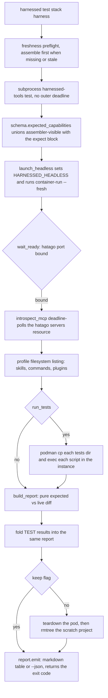

# Capability test: the manifest oracle versus the live instance

`harnessed test <stack> <harness>` answers the one question no other rung of
[the verification ladder](/openwiki/testing/verification-ladder.md) can: **did the build actually
deliver what its manifest declares?** A green pytest run proves nothing about containers; a green
`harnessed build` proves the artifacts were emitted, not that they compose into a working agent. This
test launches the real stack, looks inside it, and diffs what it finds against an expectation derived
from the catalog — so a green report is a statement about the *system*, not about the test's own
assumptions.

Two properties carry the whole design:

- **The oracle is derived, never hardcoded.** `schema.expected_capabilities` reads the stack's
  manifest plus every recipe it resolves; there is no per-stack list of expected names anywhere in
  the test code. A newly declared stack is covered the moment its manifest lands — nothing here
  needs a second edit.
- **One structured result, two audiences.** A single `CapabilityReport` drives both the markdown
  table a human reads and the process exit code CI consumes. There is no second gating path.

Related: [the build pipeline](/openwiki/workflows/build.md) (what produces the artifacts this test
verifies), [container launch](/openwiki/workflows/container-run.md) (the verb the test drives
headless).

## Two entrypoints, one grammar

- **`harnessed test <stack> <harness>`** (`launcher.test_stack`) — the user-facing verb. It validates
  the harness against `HARNESS_CONFIG_DIR`, then performs the freshness preflight: `paths.is_built`
  (does `.mcp.json` exist in the profile) and `staleness.check_profile_fresh` (do the stack/recipe
  sources still match the assembled profile). If the profile is missing or stale it **assembles
  first** via `_build_stack`, so the test always runs against current source rather than a stale
  artifact. It then delegates to the `harnessed-tools test` entrypoint in a **subprocess** (via `uv
  run … python -m harnessed.cli test` when `uv` is available, else `python3 -m`), exporting
  `PYTHONPATH`, `CONTAINER_RUNTIME`, and `HARNESSED_DIR`, and exits with the child's return code.
  The delegation is deliberately **unbounded**: the child bounds its own work
  (`capability.DEFAULT_TEST_TIMEOUT` per test script), and a second deadline outside it would only
  cut off a run that is legitimately still going. The wrapper forwards `--project`, `--keep` and
  `--json`; `--no-tests` and `--harnessed-bin` are direct-CLI-only.
- **`harnessed-tools test <stack> <harness>`** (`cli._run_test`) — the direct entrypoint the above
  and CI call. Flags: `--root`, `--project` (scratch project path, default a temp dir),
  `--harnessed-bin` (`$HARNESSED_DIR/harnessed`, then `PATH`), `--keep`, `--no-tests`, `--json`. A
  `CapabilityError` or `SchemaError` becomes a one-line red error and exit 1; otherwise the return
  value is `report.emit(...)`, which is the report's own exit code.

One trap worth knowing: **`--root` does not scope the probe.** It is accepted (default
`paths.harnessed_home()`) and threaded into `run_capability_test`, but neither that function nor
`launch_headless` ever reads it — the manifest is loaded through `load_stack_with_recipes(None, …)`,
the production resolution *across the catalog roots* (user overlay first), and the launcher
subprocess is located through `--harnessed-bin` / `$HARNESSED_DIR` / `PATH`. Passing `--root` at a
fixture tree does not point the oracle at that tree; the oracle always reads the overlay-resolved
catalog.

A third consumer is mechanical: `harnessed update` prints, per affected stack, the literal line
`harnessed build <stack> <harness> && harnessed test <stack> <harness>` — the capability test is the
verification step of the pin-bump workflow.

## The oracle: a union of the visible and the declared

`schema.expected_capabilities(stack, recipes)` builds a `Capabilities` object
(`mcp_servers`, `skills`, `commands`, `plugins`) by unioning two sources per recipe:

1. **What the assembler can see** — the recipe's `mcp.servers[].name`, and the standalone
   `skills:`/`commands:` dirs it fans into the profile.
2. **What the recipe declares via `expect:`** — a mapping of kind → names, parsed by
   `_parse_expect` into an `Expect`. This is the only channel for capabilities a recipe delivers
   through its Dockerfile or `install.script`, which the assembler cannot infer by parsing the
   manifest.

The union is de-duplicated order-preserving (`dict.fromkeys`), so a recipe that both ships and
declares the same name counts once.

The `time` recipe (`catalog/recipes/time/recipe.yaml`) is the canonical *visible-everything* case:
one stdio MCP server (`uvx --with mcp==1.29.0 mcp-server-time@2026.7.10`) plus one standalone skill
(`skills/time-helper`). It needs no `expect:` block at all — every capability it delivers is
declarative and therefore observable to the assembler. Its comment records why **both** the server
and the SDK are pinned: `mcp 2.0.0` renamed `McpError` to `MCPError`, which `mcp-server-time` still
imports under the old name, so the server died at import and hatago reported `time` as "not
connected" — a defect this exact test is what caught.

`superpowers` is the canonical *declared* case: its fourteen skills are installed by `install.sh`
into `~/.claude/skills`, invisible to the assembler, so `expect:` lists all fourteen and the probe
asserts a complete install. **Each kind is probed in the right place** — skills at
`~/.claude/skills/<name>`, commands at `~/.claude/commands/<name>`, plugins at
`~/.claude/plugins/<name>`, and MCP as *connected through hatago*, not merely named in a config.
That distinction is the point: a server present in `hatago.config.json` but dead at import is a
failure the oracle must see.

One asymmetry inside the MCP kind: a **`direct:` server bypasses the hub by design** — it is emitted
straight into the harness's `.mcp.json` and deliberately left out of `hatago.config.json` — so
`hatago://servers` can never list it, and only the LLM backstop could ever report it connected. The
catalog ships no `direct:` stack today; author one and this oracle's MCP half goes blind for that
server.

The corollary is the authoring rule: **declare what your Dockerfile delivers**. Anything a recipe
does not declare — and the assembler cannot see — is invisible to this test. `rtk` documents the
limit from the other side: it ships no skill/command/plugin surface and there is no `expect:` kind
for "a binary runs", so its capability is verified manually (`rtk --version`) per its PLAN.md.

## The run: launch, wait, look, tear down

*`run_capability_test` end to end. The scratch project dir is created before the launch and removed
only after teardown, because it is the pod's project bind-mount.*

`run_capability_test(root, stack_name, harness, *, project_path, harnessed_bin, keep, run_tests)`:

1. Load the stack and its recipes (`load_stack_with_recipes(None, …)` — the production resolution
   across catalog roots) and derive `expected`.
2. If no `--project` was supplied, `tempfile.mkdtemp` a scratch dir. **The caller owns its
   lifetime**: it is the pod's project bind-mount and must outlive launch → introspect → teardown.
   Deleting it while the pod runs breaks `podman exec` (crun `getcwd` EPERM), so the `rmtree` sits in
   the outermost `finally`, after teardown.
3. `launch_headless` runs
   `harnessed container-run <harness> <project> --stack <name> --fresh` with
   `HARNESSED_HEADLESS=true` in the environment (600 s subprocess bound). A non-zero exit becomes a
   `CapabilityError`. It then **derives** the instance name with `paths.instance_name(stack,
   harness, Path(project).resolve())` — the same pure function of stack + harness + resolved project
   path the launcher hashes — so the oracle never depends on scraping the launcher's stdout. The
   grammar matters: this used to call a bare form that stopped existing when the CLI split into two
   run verbs, and *every* container-path `harnessed test` failed with `No such command '<stack>'`
   because the only callers were the podman-gated layer that was never running.
4. `wait_ready(instance)` — readiness, next section.
5. `introspect(instance, harness, expect_mcp=expected.mcp_servers)` — the live observation.
6. If `run_tests` (default; `--no-tests` opts out), `run_recipe_tests` inside the live instance.
7. `finally`: unless `--keep`, `teardown(instance)`; then (outermost `finally`) the scratch project
   is removed unless it was caller-supplied or `--keep`.
8. `build_report(stack_name, expected, live)` — the pure diff — and the TEST results are *appended
   into the same report*.

### Headless is a launcher mode, not a flag of this module

`HARNESSED_HEADLESS=true` makes `container-run` compose and start the pod **without** the
interactive attach: members stay up for `podman exec`, the re-attach and stale-recreate prompts are
skipped, setup notices never block (no TTY), and `--rm` is a documented no-op.

Two behaviours matter specifically to this test:

- **A hub that never comes up is a hard exit 1.** "Headless callers (CI / capability tests) have no
  terminal to notice a degraded hub" — the launcher refuses to print a green SUCCESS line over a
  dead MCP hub. Inside the launch subprocess the launcher itself waits up to 30 s
  (`_wait_hatago`) and exits 1 if the port never binds, so by the time `launch_headless` returns,
  `wait_ready`'s own 60 s deadline is a *second, independent* gate on the same port — not the first
  line of defence. A stack whose hub is dead fails at step 3 with a `CapabilityError`, before any
  probe has run.
- **No hub is probed when no hub should exist.** If `hub_transport: stdio` or every declared server
  is `direct:`, the launcher sets `HATAGO_TRANSPORT=none` (or stdio) and treats the hub as up
  without probing — probing would wait out the timeout and report a degraded hub over correct
  configuration. `harnessed-start` reads the same variable, so the entrypoint and the launcher
  cannot disagree about whether a hub exists.

## Readiness: two clocks, one gap

Two independent waits cover two different things:

- **`wait_ready` covers the port.** It polls `podman exec … bash -c 'echo > /dev/tcp/127.0.0.1/<port>'`
  until a TCP connect from *inside the pod* to hatago's HTTP port succeeds (60 s deadline, 1 s
  interval). hatago starts asynchronously via the container entrypoint (`catalog/base/harnessed-start`
  background-starts it before `exec sleep infinity`), so a missing binary, a bad config, and a slow
  start all look identical until the port answers.
- **`MCP_CONNECT_TIMEOUT` covers the port-to-children gap.** A bound port does not mean hatago's
  stdio *children* have finished connecting — that gap was measured at **0.3 s on a warm box and is
  unbounded on a cold one**. A single read into it reports a perfectly healthy server as
  `not connected`.

`introspect_mcp(instance, harness, expect, timeout=MCP_CONNECT_TIMEOUT)` therefore turns the read
into a **deadline poll keyed on the declared names** (60 s, 1 s interval). Three details are
load-bearing:

- **The deadline starts *after* the first probe.** `_exec` carries its own subprocess timeout of the
  same order, so a hanging `podman exec` would otherwise consume the whole window before the loop
  is entered even once — zero retries, silently, on exactly the cold runner where the children are
  also slow. Starting the clock late bounds the call at roughly 2× the timeout, and the extra
  budget is only ever paid on a run that is already failing.
- **The deadline bounds when a probe may *start*, not merely when a sleep may end.** The loop breaks
  when the next interval would reach the deadline, so no probe runs past it and no sleep crosses it.
- **A partial answer is kept.** If *any* server was observed, `introspect_mcp` returns it with the
  source label `hatago://servers` even when incomplete — `build_report` marks the absent names
  individually, which says more than discarding a partial answer and asking an LLM.

With **no** `expect` there is nothing to wait for, so the read stays single-shot and a stack that
declares no MCP servers — most of them — pays no latency for this.

## Introspection: machine-readable primary, LLM backstop

Everything the test believes about the live instance comes from a source that is either
machine-readable or, failing that, a constrained LLM prompt. The `harness` argument routes **only
the fallback**; the primary checks are harness-independent.

### MCP — hatago's `hatago://servers` resource

`_mcp_from_hatago` speaks JSON-RPC to hatago's single Streamable-HTTP endpoint
(`paths.hatago_endpoint()`, `http://localhost:<port>/mcp`, honoring the `HATAGO_PORT` override) with
a small curl pipeline run inside the pod: `initialize` (clientInfo `harnessed-capability-test`),
capture the `Mcp-Session-Id` response header, `notifications/initialized`, then
`resources/read hatago://servers`. The response is raw JSON **or** SSE `data:` frames
(`_sse_to_objects` handles both), and each `contents[].text` is itself JSON, walked by
`_collect_server_names`. That walker is deliberately tolerant of hatago schema drift: any dict
carrying a `name` (or `id`) is a server entry, and it counts as connected unless an explicit
`connected` boolean or one of the status strings (`connected`, `ready`, `ok`, `running`, `active`,
`online`) says otherwise.

This is **auth-free** — no harness credential, no model — and it observes the hub's own view of its
children, which is exactly the thing that can be dead while every config file looks correct.

### Skills / commands / plugins — the mounted profile filesystem

`_fileext_from_filesystem` is a plain `ls -1 $CONTAINER_HOME/.claude/<subdir>` inside the running
instance (default `CONTAINER_HOME=/home/harnessed`). Commands may be `<name>.md` files *or*
directories, so the `.md` suffix is stripped to recover the name the manifest uses. Skills and
plugins are directories, so the directory name is the name.

### The backstop

Only when a machine-readable source comes back **empty** does the test ask the harness itself, via
`_llm_cmd`:

| harness | command | isolation flags appended |
|---|---|---|
| claude | `claude -p <prompt> --output-format json` | `--mcp-config ~/.claude/.mcp.json --strict-mcp-config` |
| omp | `omp -p <prompt> --mode json` | `--profile <instance>` |
| opencode | `opencode run <prompt> --format json` | none (image-baked MCP config) |
| antigravity | `agy -p <prompt>` | none |
| codex | `codex exec <prompt>` | none |

The prompt demands "ONLY a JSON array of name strings, no prose"; `_names_from_llm_json` unwraps the
harness's result envelope and regex-extracts the array. Claude's flags are the *same* isolated MCP
config the launcher uses, so the backstop's view matches the real session (hatago only — no host-,
project- or account-synced servers). Skills have an analogous filesystem-empty backstop
(`_skills_from_llm`); **commands and plugins have none** — the filesystem listing is their only
source.

## Recipe-authored tests: the supplement the oracle cannot be

`expect:` is a *presence* oracle. A recipe that bakes a binary, fires a hook, or wants to invoke a
tool and assert on the output needs behavior, not presence. That supplement is a convention, not a
schema field: **any `*.sh` under a resolved recipe's `tests/` directory is a test**, discovered
sorted by `discover_recipe_tests`. Because the recipes are already resolved, discovery inherits the
user-overlay precedence for free.

Two distinct invocation contexts share one set of pure helpers:

- **At install time, per recipe, gating the build/launch.** The container seam
  (`volumes._run_container_recipe_tests`) runs each script right after that recipe's install, in the
  same one-shot container and with the same argv shape as the install (built by replacing the last
  element, so the two cannot drift). The host seam (`hostrun`) runs them through
  `capability.run_recipe_tests_host` with the install's own env (`emit.install_env` is the single
  authority — a second copy could drift silently). Both gate on
  `capability.first_failed_test` and exit the build with the failing script's name and truncated
  detail. Interleaved install-then-test per recipe, not install-all-then-test-all: a test asserts
  what *its own* install produced, and a later recipe must not install onto a stack that already
  failed.
- **At capability-test time, inside the fully composed instance.** `run_recipe_tests` `podman cp`s
  each recipe's `tests/` dir to `/tmp/harnessed-tests/<recipe>` (once per recipe), then execs each
  script with `bash` in the real running pod — mounted profile, PATH, baked binaries, hatago hub —
  with `-w` set to the project bind-mount. The env contract is documented and stable:
  `HARNESSED_STACK`, `HARNESSED_RECIPE`, `HARNESSED_TEST_DIR` (the recipe's own remote subdir),
  `HARNESS`, `CONTAINER_HOME`, `HATAGO_ENDPOINT`, `HATAGO_PORT`. No credentials are injected — the
  primary path stays auth-free. Each script is bounded at `DEFAULT_TEST_TIMEOUT` (120 s); a
  `TimeoutExpired` folds as exit 124 with `detail="timeout"`. A dir that cannot be copied in folds
  as a `podman cp failed` failure rather than vanishing.

Whatever the context, one script run folds through the pure `fold_test_result` into a
`CapabilityResult` of kind `TEST`, named `<recipe>/<script>`, present iff the script exited 0 and
did not time out. **A failing script therefore turns the whole report red through the same
`.ok`/`.exit_code` a missing skill does** — there is no second gating path — and `--no-tests` runs
only the presence oracle.

`run_test_command` is the single executor behind the install-time seams: everything that may differ
between host and container mode lives in `argv`, everything that must not differ (output capture,
the timeout, which exceptions count as a failure, how a failure folds) lives in one place. It is
deliberately **not** routed through `proc._run`, which echoes captured stdout/stderr before
re-raising — right for an install step whose output is meant to stream, wrong for a test whose
output must reach the user only as one truncated line. It decodes with `errors="replace"` because a
recipe script's output is arbitrary bytes and a strict decode would raise `UnicodeDecodeError` — a
`ValueError` caught by neither handler — out of somebody's launch. It never raises: every outcome,
including a failure to spawn at all, becomes a `CapabilityResult`.

## One structured result, two audiences

`CapabilityReport` holds the stack name and one `CapabilityResult` per *expected* capability plus
each TEST result. `build_report` is the pure expected-vs-live diff — one row per expected name,
present iff the live instance exposed it. `report.py` renders it:

- `render_markdown` → a `| capability | kind | status |` table (a `_(none)_` row saying "the
  manifest declares no capabilities" when empty). Status cells: `✓ connected` for MCP,
  `✓ present`/`✗ missing (reason)` otherwise, `✓ passed`/`✗ failed (reason)` for TEST rows.
- `report_json` → `CapabilityReport.to_dict()` (`{stack, ok, results:[{name, kind, present,
  detail}]}`) on **plain stdout, no rich styling**, so `--json` yields a clean document CI can
  consume.
- `emit` returns `report.exit_code` — `0` when `ok` (every expected capability present/connected),
  `1` otherwise. That value is `_run_test`'s return, which is `main`'s return, which is the process
  exit code. One mechanism, two audiences: the user sees how healthy the build is, CI sees
  green/red.

## Teardown is part of the contract

`--fresh` at launch plus removal afterwards is what makes the test **repeatable and stateless**: the
launcher tears down any existing pod before creating, and `teardown(instance)` removes the instance
after the probes. `teardown` is provider-neutral — podman groups members in a pod, so
`pod rm -f <instance>`; docker has no pod, so the single flat container is force-removed directly.
After hatago-consolidation hatago runs in-container, so there is no separate `<instance>-hatago` to
clean. Errors are swallowed: a teardown failure must not mask the report.

`--keep` inverts both cleanups deliberately: the pod stays up **and** the scratch project dir
survives (it is the pod's bind-mount; deleting it under a running pod breaks `podman exec`). That
is the diagnostic path.

## The secret-hygiene invariant (T-02-07)

The report carries **capability names and status only — never config values, tokens, or container
output**. This is an invariant, not a habit, because `--json` feeds this document to a public CI
log, and hatago's children are MCP servers that take credentials from the environment: a crashing
child prints exactly the thing this report must not carry.

- The hatago log is **pointed at, never read**. `_HATAGO_LOG_PATH` (`/tmp/hatago.log`, the redirect
  target in `catalog/base/harnessed-start`) exists only to spell `MCP_MISS_REMEDIATION`: *"re-run
  with `--keep`, then `podman exec <instance> cat /tmp/hatago.log`"*. A missing MCP server's
  `detail` names where to look and never quotes what is there. An earlier version of the module
  copied a 200-line tail of that log into `CapabilityReport`; that was the T-02-07 violation this
  shape exists to prevent, and the cost is real and accepted — a runner-only MCP failure is not
  self-diagnosing from the CI log, which is precisely why the one-step remediation exists.
- Recipe-test failure detail is truncated to **one tail line, capped at 120 characters**
  (`_TEST_DETAIL_MAX`): `exit <n>: <last non-empty output line>`. Never a full transcript.
- `CapabilityResult.detail` is documented as "short status reason", and
  `CapabilityReport.to_dict` carries a comment telling the next reader not to add a field that
  carries container output.

Do not "improve" diagnostics by copying logs into the report; make the `--keep` path better instead.

## The testability boundary

The module is split so that everything decidable without a container needs none:

- **Pure, unit-testable, no podman** — `schema.expected_capabilities` (manifest → expected),
  `build_report` (expected-vs-live diff), `discover_recipe_tests` (convention discovery),
  `fold_test_result` (exit-code folding), and the truncation helper behind the failure detail.
- **Podman-touching, guarded behind the launch** — `launch_headless`, `wait_ready`, `introspect`
  (and its probe helpers), `run_recipe_tests`, `teardown`, and the orchestrating
  `run_capability_test`. These run in the live layer (`HARNESSED_PODMAN=1`), never in the hermetic
  suite — which is exactly why a grammar drift in the launch command once broke every container-path
  `harnessed test` while nothing caught it.

Runtime selection mirrors the bash dispatcher: `CONTAINER_RUNTIME` env, else `podman` if on `PATH`,
else `docker`. The launcher binary resolves from an explicit `--harnessed-bin`, then
`$HARNESSED_DIR/harnessed`, then `PATH`, raising a `CapabilityError` when none is found.

## Not the same "capability": the backend matrix

`capmatrix.py` shares the word and nothing else. It answers a different question — *which recipe
primitives will this execution backend actually honor?* — as a data table (`MATRIX`, one column per
backend, one row per primitive) with conformance tests over it. At launch, `_warn_capability_gaps`
walks `capmatrix.gaps(backend, recipes)` and prints one `[INFO]` line per declaration the backend
leaves inert — today the only DEGRADED cell is `egress:` on the host backend, whose isolation is
`none`. It is a launch-time warning about the backend, not a test-time verdict about a build; the
table exists precisely because a prose version of it (`BACKENDS.md §4`) went stale without anyone
noticing.

## What this oracle does not prove

Anything about the **host** backend (it launches a pod), anything about interactive attach, and
**anything a recipe did not declare and the assembler cannot see** — which is why the authoring rule
("declare what your Dockerfile delivers") and the recipe-test convention exist. It also proves
presence-and-connection, not usefulness: a connected server whose tools are wrong is green here, and
only a recipe-authored `tests/*.sh` can say otherwise. Finally, the MCP probe observes the *hub* —
a `direct:` server is not the hub's child and can only ever come from the backstop.
