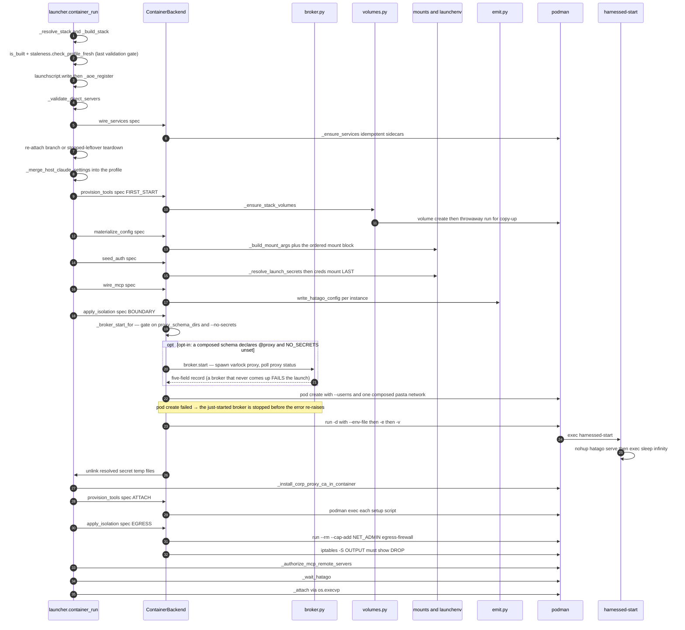

# Container launch: `container-run` end to end

`harnessed container-run <harness> [path]` runs a composed stack in a rootless podman **pod**. The
verb is a **sequencer**: it validates the stack, constructs one `ContainerBackend` (registered under
the name `container`, declaring isolation `container`), and calls that backend's capabilities in the
order podman requires. The sequence ends in `os.execvp`, which hands the terminal to the agent inside
the container — by the time the harness starts, harnessed is gone.

The contract is [`architecture/backends.md`](/openwiki/architecture/backends.md): **six capabilities**,
each one a row of BACKENDS.md §3 — `materialize config` / `provision tools` / `wire MCP` / `seed auth` /
`wire services` / `apply isolation` — with **deliberately no shared driver**, because the two existing
backends do not agree on an order and cannot be made to without changing behaviour. Two of the six
take a `phase` because they have two moments on *both* backends (`FIRST_START`/`ATTACH` for
`provision_tools`, `BOUNDARY`/`EGRESS` for `apply_isolation`). This page walks the container side of
that order. The sibling verb is [`host-run`](/openwiki/workflows/host-run.md) — same grammar, same
stack resolution, inverted capability order. Related: [credentials](/openwiki/concepts/credentials.md),
[the folder-env contract](/openwiki/concepts/env-contract.md), the
[capability test](/openwiki/workflows/capability-test.md), which drives this same verb headlessly,
the [secrets broker](/openwiki/architecture/secrets-broker.md) that BOUNDARY starts, the
[credential proxy model](/openwiki/concepts/credential-proxy.md) whose `@proxy` gate decides whether
one starts at all, the [aoe row and launcher script](/openwiki/integrations/aoe-and-launch-scripts.md)
a launch registers, and [`harnessed build`](/openwiki/workflows/build.md), which produced the profile
this verb launches.

## The sequence



*One interactive create-path launch. `wire_services` runs before the re-attach branch, so every
branch of the sequence passes through it; the broker step sits inside BOUNDARY, after env resolution
(`seed_auth` resolved the env-files), immediately before `pod create` — its outcome decides the pod's
`--network` — and on the no-opt-in majority path it runs nothing at all: not even a varlock
subprocess.*

### The asymmetry with `host-run`

The two paths are **not symmetric**, and the divergence is the design:

| | container (`container_run`) | host (`_launch_host`) |
| --- | --- | --- |
| order | `wire_services` → `provision_tools(FIRST_START)` → `materialize_config` → `seed_auth` → `wire_mcp` → `apply_isolation(BOUNDARY)` → `provision_tools(ATTACH)` → `apply_isolation(EGRESS)` | `wire_services` → `materialize_config` → `seed_auth` → `provision_tools(FIRST_START)` [under the home lock] → `provision_tools(ATTACH)` → `wire_mcp` → `apply_isolation(both)` |
| why that order | provisions **before** materializing, because podman copy-up is what lifts the image's `~/.claude` into the volume the mount set then references | materializes **before** provisioning, because `_materialize_host_home` rmtree's the very dir installs write into |
| where env is assembled | inside `apply_isolation(BOUNDARY)` — the one `podman run` is the only way env crosses | onto `os.environ` — the host has no box, so the process *is* the box |
| isolation | a pod boundary plus a default-DROP firewall | `none` by declaration; both `apply_isolation` phases are called and do nothing |

What **must** hold in both, and does: credentials are delivered **by reference, never replicated**
(mount the live store or forward a token — never a snapshot); the env **winners** are the same
(recipe `env:` underneath, harnessed-owned folder-env and secrets above); and the same
`_merge_host_claude_settings` fold of the host's live preferences is applied to the profile before
the backend sees it. Those three are the point of having two backends rather than two flags. The
secrets broker is container-only **by nature**, not by decision — it exists so a container can hold
placeholders while real values are injected on the wire from the host; a host launch has no boundary
for the broker to sit on and resolves varlock natively (`tests/test_launch_parity` records exactly
this in its container-only ledger).

---

## Stage 0 — stack resolution, minting, and the freshness gates

`container_run` resolves the stack through `launcher._resolve_stack`, shared with `host-run` so the
two grammars cannot drift:

- `--stack/-s` names an authored `stacks/<name>/stack.yaml`. Mutually exclusive with `--recipe`.
- `--recipe/-r` (repeatable, order irrelevant — the set is sorted) composes a stack on the fly:
  `dynstack.derive_name` mints a content-derived name and `dynstack.mint` writes a **real**
  `stack.yaml` under the generated catalog root. Because the name is content-derived, the same
  recipe set in five repos is *one* stack — one image, one pair of volumes. `dynstack.mint` runs
  under a per-name `flock` (`_mint_lock`) so two concurrent launches cannot interleave writes.
- Neither flag runs the `--extends` baseline (`default`) as-is. `--no-extends` with no recipes is
  rejected: it inherits nothing, so there is nothing left to run.

On the `--recipe` form the sequencer calls `_build_stack` **immediately** — a freshly minted stack
has no assembled profile and every later stage hard-errors without one. It is deliberately not
skipped under `--create-aoe-only`, because the command the registered aoe row replays would be dead
on arrival against an unbuilt stack. On failure, a manifest *this invocation* minted is removed;
a pre-existing manifest is left alone (it may be a working stack today's edit merely broke, and no
GC reclaims a stack that never built, because `volume-gc` keys on volumes).

### The gates that can still abort cheaply

After resolution, before any podman write:

0. `_require_supported_harness(harness)` — `schema.HARNESS_CONFIG_DIR` is the accepted set
   (claude, omp, opencode, antigravity, codex).
1. `--no-firewall` sets `os.environ["NO_FIREWALL"] = "true"` — the opt-out from the egress firewall.
2. `--no-secrets` sets `os.environ["NO_SECRETS"] = "true"` — the opt-out from the host secrets
   broker, read through the same env mechanism and truthy for `1`/`true`/`yes`. Parallel to
   `--no-firewall` by design: the launch keeps working, with secrets resolved into the container env
   as they always were.
3. `anchor_path` (`path` or cwd) must exist. Then `_resolve_start_dir` runs **first** (launcher →
   `attachcmd._resolve_start_dir`): the "project" is wherever the agent *starts*, and everything
   downstream — instance identity, persist keys, `container -w` — keys on the resolved `start_dir`.
   `launch main --agent-start-folder sub` and `(cd main/sub && launch main)` are therefore the same
   instance. `_resolve_mount_path` is anchored on `anchor_path`, **never** on `start_dir`, so
   `--agent-start-folder` never shrinks the mount; `--mount-folder` widens it (and must contain the
   project). In a bare-repo + linked-worktree checkout the mount auto-widens to the bare repo's
   directory so sibling worktrees are visible.
4. `paths.find_in_catalog("stacks", stack)` resolves **overlay-first** (user catalog wins).
   `stack_from_overlay` is computed here and is the trust gate for private-key forwarding.
5. `is_built` (profile presence) then `staleness.check_profile_fresh`. `is_built` only checks
   presence, so the freshness guard is what stops a launch from silently running an orphaned or
   outdated image. A `SchemaError` (recipe renamed/removed — unfixable by rebuild) exits 1. A
   `StaleProfileError` (sources merely edited) offers `harnessed build` inline; declining aborts,
   because launching a stale profile is the exact silent-outdated-image failure the guard exists to
   prevent. Skipped outside a tty.
6. `_prune_unlaunchable_omp_blocks(harness)` — omp only. `container_run` **never re-assembles**
   (its profile was assembled back at `harnessed build`), so this is the only point on the container
   path that can notice a delimiter block in the shared `~/.omp/agent` whose stack no longer
   resolves. A block is dropped only when its stack fails the same `staleness.stack_resolves` check
   the launch just applied to itself; a stale-but-resolvable stack keeps its block.
7. Image selection: `_derived_image(stack, harness)` when it exists, else `_agent_image(harness)`.
   Then `_ensure_harness_image` lazy-builds the agent image if missing. There is no separate hatago
   image to check — hatago is baked into `harnessed-base` (hatago-consolidation).
8. `_warn_capability_gaps(ContainerBackend.name, launch_recipes)` names any declaration this
   backend will not honour (`capmatrix.MATRIX`; every container cell is SUPPORTED today, and the
   call is there so a future DEGRADED cell reaches the user). **Before** `_prompt_setup_notices`,
   which can block — a user should not answer a prompt without having seen the gap.
9. `_prompt_setup_notices` — the `[O]k / [T]erminal / [D]ismiss / [Q]uit` prompt over user-facing
   `setup:` notices. `[T]erminal` ORs `--shell` on.
10. `_validate_direct_servers(launch_servers, harness)` — **the rule the container path enforces at
    launch because it never assembles.** `assemble`'s guard against a `direct:` server on a harness
    that cannot honour one runs on the build path and the host path, both of which assemble. An
    image built *before* a recipe gained `direct:` reaches launch with servers the harness will
    never see: `direct` excludes them from `hatago.config.json`, and only claude's MCP config is
    emitted per stack (`schema.HUB_TRANSPORT_EMITTED_HARNESSES == {"claude"}`), so an omp or codex
    stack would come up silently toolless — and, once every server is direct, with
    `HATAGO_TRANSPORT=none` stopping the hub as well. Re-running the check here turns that into a
    clear error.

The backend and its `LaunchSpec` are constructed after all of that. `LaunchSpec` carries only
composition-layer inputs (`stack`, `harness`, `project_path`, `extra`, `no_strict_mcp`,
`ephemeral`); podman instance names, volume names, mount args, member mounts, pending setups, the
resolved env-files and the broker record live on the `ContainerBackend` instance — a spec field only
one backend can honour is a fixed-order driver in disguise.

### Registration: the launcher script, then the aoe row

`launchscript.write` and `_aoe_register` run **after the last validation gate** — `is_built` plus
`staleness.check_profile_fresh` (and the omp block prune), all of which can abort the launch. A row
is a bookmark for "launch this again", so registering ahead of the gates would leave a row behind
for a launch that then died on a renamed recipe — a row that fails identically every time it is
started from the dashboard. (The host path's analogue is assembly, its backend's real validation
gate.) Within that pair the order is fixed too: the script **precedes** the row, because the row's
command *is* that script, and `_aoe_register` exits under `--create-aoe-only` — a row written
afterwards would point at a file that does not exist.

`launchscript.write` never takes over a file harnessed did not write. An existing
`<harness>-container` target must carry the sentinel `# harnessed:launcher v1` in its first two
lines **and** be untracked by git — even a sentinel-bearing tracked file is refused, because
committing a generated launcher is a choice a repo is allowed to make and rewriting it per launch
would dirty a tree nobody asked for. A non-regular file (a FIFO would block the sentinel read
forever) is refused before it is read, and every failure path returns `None`: the launch proceeds
whether or not the shortcut was written.

## `wire_services` — idempotent revival, before the re-attach branch

```python
backend.wire_services(spec)      # _ensure_services(rt, stack, project_path, mount_path)
```

A `services:` entry is a property of the **stack**, not of the backend: a host-native agent still
needs the service its stack declares. `_service_refs(stack)` (in `svcstate.py`) unions three
sources — recipe `mcp.servers[].service:` refs, recipe `services:`, and the stack's own
`services:` — and `_ensure_services` calls `_ensure_service` per name: build the image if missing,
skip a running container whose create-time config hash still matches (`svcstate._svc_drift_reason`,
comparing the `harnessed.svc-config-hash` label against a hash of today's `_svc_run_cmd`), recreate
one that has drifted (prompting interactively, proceeding automatically in headless), and wait for
health. A healthcheck that never passes **aborts the launch**.

The ordering is the load-bearing part. This call sits **before** the re-attach branch, deliberately.
A long-lived agent container outlives its sidecars; when `wire_services` sat on the create path
only, every subsequent launch took the attach branch and never looked at services again — a sidecar
that died stayed dead for the life of the container. Reviving it is exactly what "idempotent"
already promised.

Global services are host-published and reached from the pod via
`host.containers.internal:<port>`; project-scoped ones are git-common-dir keyed (one container per
checkout, shared across worktrees), bind-mount this project's persist dir as `/data` and are reached
through a unix socket inside it, which is why `wire_services` needs the project and mount context.

## Lifecycle: `--fresh`, re-attach, stopped leftovers

- `--fresh` tears the pod down (`_pod_teardown`: broker stop first, then `pod rm -f` on podman,
  `rm -f` on a flat docker) and also wipes the persisted agy keyring (`_keyring_fresh_wipe`) and an
  isolated-auth stack's own login store (`_isolated_auth_fresh_wipe`). Those two survive a normal
  recreate **on purpose** — `--fresh` is the only way back to a logged-out agent.
- `_write_project_tool_env` runs after `wire_services`, on both branches: the project gets a config
  of its own (a 0600 dotenv under `$XDG_STATE_HOME`, git-common-dir keyed), not just the agent this
  launch starts. Nothing is written *into* the repo.
- The re-attach branch (interactive only) calls `_authorize_mcp_remote_servers` **again**. Both
  branches below it `return` straight into `_attach`, so a running instance otherwise skipped the
  consent entirely — and an instance that came up, failed to authorize and is still running is the
  likeliest state an operator re-attaches to. Skipping it made `--reauth` silently do nothing
  whenever the pod happened to be up.
- `_container_stale(rt, inst, harness_image)` — the running container was created from a different
  image id than current `image:latest` — offers a recreate; declining attaches to the older build
  with a pointer to `--fresh`.
- `_stopped_leftover` — a prior non-ephemeral session exited without tearing its pod down (only
  `--rm` cleans up). A same-name `pod create` would fail "name already in use", so the stopped
  instance is removed and recreated. A *running* instance is never torn down here.
- `HARNESSED_HEADLESS=true` disables the re-attach branch entirely and, at the end, makes a dead
  hub a hard `typer.Exit(1)` rather than a green SUCCESS line.

On the create path only, `_merge_host_claude_settings(prof, required, harness)` (claude, omp,
opencode) folds the host's live `~/.claude/settings.json` into the assembled **profile** first.
That is a backend-independent artifact and the last step of assembly rather than a backend
operation, which is why both sequencers do it identically before handing off to their backend. It
drops the host's `statusLine.command` — a host-absolute path that can never resolve inside the
container — then deep-merges host preferences and re-applies harnessed-required grants/hooks so a
host customization cannot disable the MCP hub.

## `provision_tools(FIRST_START)` — the fingerprint-gated volume compose

```python
self.config_volume, self.tools_volume = _ensure_stack_volumes(
    self.rt, spec.stack, spec.harness, self.prof, self.harness_image, self.recipes)
```

`FIRST_START` is the container mirror of the host path's `rebuilt` gate. It uses `harness_image`
(the derived image when one exists, else the plain agent image) **because podman's copy-up is what
lifts that image's `~/.claude` into the volume**. An unchanged stack pays nothing; a changed stack
reinstalls here with **no `podman build` at all** — a one-line recipe edit used to cost a
307-second layer rebuild.

`_ensure_stack_volumes` composes **both** volumes in one call, because copy-up populates them
together:

| volume | mount point | content |
| --- | --- | --- |
| `harnessed-cfg-<harness>-<stack>` | `$CONTAINER_HOME/.claude` | image's baked `~/.claude` + the profile |
| `harnessed-tools-<harness>-<stack>` | `~/.local` | mise installs + shims, `$PNPM_HOME`, `$HARNESSED_BIN_DIR` |
| `harnessed-dl-cache` (shared) | `~/.cache` | one download cache for **every** stack |

Volumes are identified by **label** (`harnessed.role` / `harnessed.stack` / `harnessed.harness`),
never by parsing the name — a stack name may contain the same hyphens the name format uses, so
`harnessed-cfg-claude-a-b` is ambiguous about where the harness ends.

### The volume-composition invariant

> **Copy-up lifts the image's `~/.claude` into the volume; profile content is then layered on top.
> Never mount a profile directory over a config subtree.**

`_ensure_config_volume` runs one throwaway container:

```bash
podman run --rm --userns=keep-id:uid=1000,gid=1000 \
  -v <vol>:/home/harnessed/.claude \
  -v <profile>:/tmp/harnessed-profile:ro \
  [--entrypoint sh] <image> -c '
     set -e;
     if [ -d /tmp/harnessed-profile/.claude ]; then
       cp -a /tmp/harnessed-profile/.claude/. /home/harnessed/.claude/;
     fi;
     <settings step>'
```

Two podman behaviours make this correct, both verified against 6.0.1:

1. **COPY-UP.** Mounting an *empty* named volume over a path the image populated copies the image's
   content into the volume. It happens **exactly once** — thereafter volume content wins and image
   updates are invisible, which is why the fingerprint gate must key on image identity and not only
   the recipe hash.
2. **USERNS.** The pod is created with `paths.USERNS_ARG` and the agent inherits it as a pod member,
   so this populate step **must** use the same mapping. A volume first populated under the default
   userns is unusable by the agent: uid 1000 inside reads the files as owner 999 and every write
   EACCESes.

The `cp -a src/. dst/` **merges** into the copy-up'd tree rather than replacing it — that is the
whole point. This design exists because of a real bug: the previous shape mounted
`<profile>/.claude/<subdir>` over the image's own with `:ro`, which hid every skill and command an
`install.script` had delivered there — **measured at 70 of 75 skills invisible, including all 34
`gsd-*`**. An *empty* profile `commands/` directory shadowed a real one, because
`synclinks._fan_into` creates `skills/`/`commands/`/`rules` unconditionally and the mount gate was
existence, not non-emptiness. One composed tree leaves nothing left to shadow.

Two deliberate refinements:

- **`settings.json` is merged, not copied.** `_merged_settings_text` reads the volume's
  `settings.json` (`_volume_read`), deep-merges the profile over it, and hands the result in via
  `HARNESSED_SETTINGS_JSON` (env, written with `printf %s`, never interpolated into the `-c` string
  — hand-quoting a JSON body has an arbitrary-code-shaped failure mode). Without the merge, copying
  the profile file over the volume dropped every install-written key on every relaunch after the
  first. A failed read is **absent**, not empty; conflating them reintroduces the same regression.
- **The config volume is discarded when the fingerprint moved** (`fresh=not unchanged`).
  Composition is purely additive, so without this a recipe dropped from the stack would leave its
  skills and commands in the volume forever. The **tools** volume is kept either way: `mise use -g`
  is declarative, and discarding it would re-download every pinned tool for no benefit.

The stamp is written only **after** the installs succeed. A failed install must never certify
content that was never finished, or the next launch trusts a stamp for a half-populated volume.
`_run_container_installs` runs `tools:` first, then each `install.script`, in a container per step
(per-recipe env differs; `-e` avoids hand-quoting a generated script) with all three volumes
mounted, and runs each recipe's own `tests/*.sh` right after its install through the shared
`capability.run_test_command` executor.

## `materialize_config` — the one composed config volume plus the mount set

`materialize_config` *asserts* the volumes exist (`assert self.config_volume and self.tools_volume`)
— the ordering is enforced by the caller, and the assertion names it. It then composes one
**ordered** mount block. The order is load-bearing; a known imprecision (tracked as harnessed-0tk.1.1)
is that several credential mounts are composed here rather than in `seed_auth`. They are emitted as
one ordered block today, and this repo's suite runs no `podman run` at all, so regrouping `-v`
arguments would be an unverifiable change to the one path no test exercises. `seed_auth` owns the
part that is already contiguous and deliberately last.

In emission order:

1. `profile/.mcp.json` → `~/.mcp.json` `:ro` (claude only — `--mcp-config` points here).
2. The **composed config volume** at `$CONTAINER_HOME/.claude`, and the **tools volume** at
   `~/.local`. The config volume is mounted for `claude`, `omp` and `opencode` only.
3. opencode persona config (`opencode.json`, `prompts/`), antigravity identity (`.gemini/`), codex
   identity (`.codex/AGENTS.md`) — `:ro`, only when present, so a stack without them leaves the
   image config untouched.
4. Claude history dirs rw from host `$HOME`: `.claude/projects`, `file-history`, `tasks`,
   `session-env`, `todos` — session persistence.
5. `catalog/base/egress-firewall.sh` → `/usr/local/sbin/egress-firewall` `:ro`, so the firewall
   runner has the script.
6. The path-mirroring mount: `{mount_path}:{mount_path}` — the mount root is accessible at its host
   absolute path inside the container, so the agent sees host paths.
7. `_claude_config_seed_mount` — a token-free `~/.claude.json` stub so Claude Code skips first-run
   onboarding (auth comes from the token or the credentials file). Written to a per-instance state
   dir and mounted **rw** so Claude's runtime writes never touch the host file. `isolated_auth`
   drops the identity half: `oauthAccount` carries the host account's email/uuid/organization, and
   copying those into a stack that authenticates as somebody else pairs a stub identifying you with
   credentials belonging to them.
8. `_keyring_state_mount` — antigravity only, rw, so agy's in-pod Google-OAuth token survives
   recreates.
9. `_mcp_auth_store_mount` — rw, so an mcp-remote OAuth consent outlives the pod it happened in.
   No-op for every stack that runs no mcp-remote. The **source depends on whose identity the stack
   runs as**: the host's `~/.mcp-auth` normally, or a per-instance dir beside the isolated-auth
   credentials for an `isolated_auth` stack — handing the latter the host's store would give it the
   host's Atlassian identity, the exact wrong-account failure the flag prevents. The **whole
   directory**, never `mcp-remote-<version>/`: the store is version-namespaced, and mounting one
   version's subdir would leave a stale mount the moment the pin moved. Pairs with the callback
   publish on the pod (below).
10. `_omp_agent_mount` — omp's whole agent dir rw from the host: auth, usage and sessions are one
    store shared by the host and every container. The omp image bakes `~/.omp/{plugins,natives}`,
    **not** `agent/`, so this shadows nothing.
11. `_omp_config_seed_mount` — shadows `config.yml` only when it names the retired local
    claude-hooks-bridge path; the image-installed plugin is the canonical bridge inside the pod.
12. `_omp_mcp_seed_mount` — emitted **immediately after** the dir mount it shadows: a per-instance
    `mcp.json` = the host file's contents plus a `hatago` HTTP entry, mounted `:ro` over
    `~/.omp/agent/mcp.json`. omp has no `--mcp-config` flag, so this nested file mount is how a
    stack's MCP servers reach it without mutating the shared host file. Regenerated every launch.
13. `_ccstatusline_settings_mount` — the host's ccstatusline config `:ro`, so the baked status line
    matches the host layout. Personalization, not a credential, so not gated on
    `forward_git_credentials`.
14. `_corp_proxy_ca_mount_args` — the corporate proxy CA `:ro` at `/run/corp-proxy-ca.crt`, so the
    post-start step can register it with the system trust store.
15. `_persist_mounts` — each recipe's declared `persist:` entries, rw, so their state survives
    `--fresh`. `scope: global` mounts a real host dir **path-preserving** and only after the
    default-deny + allowlist gate clears it; workspace/project scopes mount a harnessed-owned dir at
    `$HOME/<name>`; `location: in_repo` adds no mount (the workspace is already rw) and just
    ensures a `.gitignore` entry. Every host-side target is ownership-guarded
    (`persist.guard_ownership`), because a dir owned by another uid silently EACCESes under
    `paths.USERNS_ARG`.
16. Credential forwarding, gated on the stack's `forward_git_credentials`:
    - **on** — `_credential_forward_args` with `ssh_keys` filtered through `_trusted_ssh_keys`:
      private keys (`ssh_keys:`) are honoured **only from the user's own overlay catalog**; a
      shared repo-catalog stack must not mount your private key. The bundle forwards the SSH
      signing/auth agent, the non-secret GPG surface (`pubring.kbx`, `trustdb.gpg`, configs —
      **never** `private-keys-v1.d/`), YubiKey USB passthrough (Linux only), the git identity
      config, gh's `hosts.yml`/`config.yml` `:ro`, and the non-secret `~/.ssh` surface plus the
      opted-in private keys file-by-file — never a blanket `~/.ssh` mount.
    - **off** — `_ssh_agent_auto_forward_args`: auto-forward the agent socket and the ro git
      config whenever the agent socket is live. Safe as a default because the socket exposes no key
      material and gates every sign/auth behind a host-side 1Password approval or YubiKey touch.
      The secret-bearing surface (gh oauth token, private keys) still requires the opt-in.
17. `_aws_sso_ecs_forward_args` (opt-in, `forward_aws_sso`) — injects
    `AWS_CONTAINER_CREDENTIALS_FULL_URI` + `AWS_CONTAINER_AUTHORIZATION_TOKEN` as env only; no
    aws-sso binary, store or token enters the container. If the host has a bearer token but the ECS
    server is not reachable, the launch **warns and asks** rather than wiring a dead endpoint that
    would fail only when the SDK first called AWS.

## `seed_auth` — auth assembly, and why the creds mount is last

`seed_auth` resolves launch-time secrets and appends the Claude credential mount **last**:

```python
secrets_env_files, secrets_temp_files = _resolve_launch_secrets(spec.project_path)
if self.stk.isolated_auth and spec.harness == "claude":
    self.mount_args += _claude_isolated_auth_mount(...)
    _strip_var_from_env_files(_OAUTH_TOKEN_VAR, secrets_env_files)
else:
    self.mount_args += _claude_creds_seed_mount(
        spec.harness, self.inst,
        _claude_oauth_token_configured(spec.harness, spec.project_path))
```

### Why the fallback mount is appended *after* secrets resolve

`materialize_config` carries a comment that is the invariant: *"the Claude credential fallback mount
is appended AFTER secrets resolve (see seed_auth) — whether it is needed at all depends on a
`CLAUDE_CODE_OAUTH_TOKEN` that may arrive via `--env-file`."* Whether a credential file is mounted at
all is a function of the resolved env-files (`_claude_creds_seed_mount`'s `token_configured` argument
is computed by `_claude_oauth_token_configured`, which itself resolves those same dirs), so it cannot
be decided one step earlier. It is also the reason `seed_auth` runs after every aborting check in
`materialize_config`: an early exit must not strand resolved secrets on disk. A non-claude
`isolated_auth` stack takes this same branch and says so in a warning — the flag is claude-only
today.

`_claude_creds_seed_mount` is the **legacy fallback**. Mounting a host credential file into a
container is an anti-pattern, and it cannot be made correct — host and container refresh their
copies independently, and concurrent refresh-token rotation is undocumented. `CLAUDE_CODE_OAUTH_TOKEN`
supersedes it entirely: when one is configured, **no credential file is mounted at all**. The path
remains so hosts that have not yet run `claude setup-token` keep working; it re-seeds from the host
when the existing copy's access token has passed its `expiresAt` (the original seeded exactly once,
so an aged-out instance was permanently logged out), gated on expiry precisely so a token the
container itself refreshed is never clobbered while it is still valid. `rw`, not `ro` — a ro mount
blocks Claude Code's in-container token refresh.

### `_env_files_value` — last-wins, and empty is a real answer

`mounts._env_files_value(var, env_files)` walks the resolved `--env-file`s **in order** and keeps
the **last** assignment, matching podman. `_resolve_launch_secrets` orders the files global →
project precisely so the project overrides the global. Returning on the *first* hit instead would
let a global token mask a project-level `VAR=` written to disable it — the container would receive
the empty value while every caller believed a token was configured. An **explicit empty string is a
real answer, distinct from `None`**: it means "declared, and turned off". `_claude_oauth_token_configured`
has the same shape for the same reason, and resolves every dir rather than returning on the first
hit so presence agrees with the precedence the values actually follow.

### The withheld host forward

`_claude_oauth_token_args` forwards the host-env token as a bare `-e NAME` so podman reads the value
from its own environment (keeping the secret off `ps`). **The env-file route wins**: podman applies
`-e` left-to-right with last-wins, and `-e` beats `--env-file`, so forwarding the host value
unconditionally would let a stale shell export outrank every declared source — and a per-project
token for a *different* account could then never take effect. So the `-e` is **withheld whenever any
env-file assigns the variable, empty included**: a non-empty assignment makes the forward redundant,
and an empty one is how a source turns the token off — forwarding there would override the very
intent that declared it.

### `isolated_auth` — the wrong-account guard, three times over

An `isolated_auth` stack runs as a **different account**. Neither the host's token nor the host's
credential file may reach it. Three suppression points, all gated on the harness being `claude`
(because omp authenticates from the *same* `CLAUDE_CODE_OAUTH_TOKEN`, so stripping it there would
leave an omp launch with no auth at all):

1. `_claude_isolated_auth_mount` — the stack's **own** per-instance credentials file, seeded `{}` so
   the agent comes up logged out and `/login` writes the client's credentials there. Never
   re-seeded and never expiry-checked: rewriting it would throw their login away. A host file and
   not the config volume, because `_ensure_config_volume` **destroys** the volume whenever the
   profile fingerprint changes — a login stored there would be wiped by the next recipe edit.
2. `_strip_var_from_env_files` — `--env-file` is passed unconditionally, so a token in the
   user-global `.env.schema` would walk straight past both suppressions. Stripping the assignment is
   what makes the isolation hold. Preferred over `-e VAR=` (which does beat `--env-file`) because
   that would depend on the harness reading an empty token as "absent".
3. The `-e` forward in `apply_isolation` is elided on the same condition.

## `wire_mcp` — the per-instance hatago config

Wiring MCP on this backend is wiring hatago: every assembled MCP server is fronted by the hub.
The config is written **per instance** (`prof/.instances/<inst>/hatago.config.json`) with each
stdio child's `cwd` pinned to the **mirrored project path** (bd main-u5d) — the committed profile
config is project-agnostic (built before any project is known; path mirroring makes the container
project path per-launch), so serena/repowise would otherwise resolve the container home instead of
the project root. Per-instance so two projects on the same stack never race on one shared cwd.

`self.member_mounts` is then derived: `_without_userns(self.mount_args)` (a filter on the
`--userns` *flag*, not a literal value — an inline inequality against the bare `keep-id` spelling
silently stopped matching once the mapping was pinned), plus the hatago config `:ro`, plus
`_setup_script_mounts`. Since the hatago-consolidation, hatago runs **in** this container rather
than as a separate pod member, so the hub and the stdio children it spawns share the container's
home and see the project bind-mount. Waiting for the hub is a readiness gate, not wiring — the
sequencer does it after the container starts.

`_setup_script_mounts` places each recipe's `setup.script` — and the recipe dir it came from —
inside the container at `/opt/harnessed/setup/<name>.sh` and `/opt/harnessed/recipes/<name>`. A
mount, not a Dockerfile `COPY`: the script is authorable catalog content, so editing it must not
require an image rebuild.

## `apply_isolation(BOUNDARY)` — the pod boundary is the delivery mechanism

BOUNDARY is also what **delivers** everything the earlier operations composed. On this backend the
single `podman run` is both the isolation boundary and the only way mounts and env cross it, which
is why the env assembly lives here rather than in `materialize_config`. It is also where the host
secrets broker starts — because the pod's network args depend on whether one exists.

### The broker step: after env resolution, before `pod create`

`_broker_start_for` runs inside BOUNDARY, immediately before the pod is created: without a broker
the pod must not be handed a route to the host's loopback it has no use for, so the `--network`
composition cannot be decided earlier. Its gate has exactly two inputs and one of two outcomes:

- **Inputs.** `proxy_schema_dirs(project_path)` — the composed schema dirs (the user-global
  `~/.config/harnessed` and the project, the same dir set `_resolve_launch_secrets` resolves, in the
  same global → project order), each of which must carry a `@proxy` annotation; plus `NO_SECRETS`
  (`--no-secrets`). The annotation check is a text test on purpose: `varlock proxy rules` resolves
  values and can sit on a 1Password unlock prompt, so a launch that opted into nothing must not buy
  one.
- **Outcomes.** Either a broker starts — and it **must** come up, because a failed start is fatal
  (`typer.Exit(1)`; SPEC decision 2): the alternative is a pod wired half-way to a proxy that is not
  there, the silent half-wiring epic #388 exists to remove, and the failure message is a fixed line
  that names `--no-secrets` and prints no resolved value — or the gate runs **nothing at all**. The
  no-opt-in majority (every stack shipped today) reaches no varlock subprocess of any kind; the
  tests assert the *absence of the subprocess*, not merely the absence of a record.

The gate, the spawn/poll/record/stop/reconcile lifecycle, and the five-field state record belong to
the broker itself — see [the secrets broker](/openwiki/architecture/secrets-broker.md) and
[the credential proxy model](/openwiki/concepts/credential-proxy.md). What belongs to *this* page is
the ordering around it, and both sides fail safe:

- **If `pod create` fails, the started broker is stopped before the error re-raises.** The handler
  catches `BaseException` — Ctrl-C included, same reasoning as the EGRESS teardown — because a live
  host process holding real secrets that nothing will ever reap by name is the worst orphan this
  phase can produce: strictly worse than a leaked pod, which `podman ps` can at least see.
- **A runtime that does not use pods never starts one.** The broker door is a pasta option on
  `pod create`; with no pods there is no way to deliver `169.254.1.1` into the container, so the
  backend prints a note instead of producing exactly the half-wired state `--no-secrets` exists to
  avoid, and secrets resolve into the container env as before.

Teardown carries the broker with the pod everywhere else too: `_pod_teardown` stops the instance's
broker **first** and never fatally (`_broker_stop_for` catches `BaseException`, so a Ctrl-C during
`varlock proxy stop` cannot skip the `pod rm`), and `broker.reconcile` reaps any recorded broker
whose pod is gone regardless of how it got there.

### The broker lifecycle, at flow level

`src/harnessed/broker.py` owns the whole start/stop/reap lifecycle behind injected
`spawn`/`status`/`run` seams, so nothing in the launcher shells out to varlock directly. The flow a
launch participates in:

- **Start.** `broker.start` spawns `varlock proxy start` **detached** — the command does not
  daemonize; it holds the terminal and streams a request log until killed — then polls
  `proxy status --format json` for the session whose proxy env names the port harnessed chose. The
  session id is never parsed from `start`'s stdout (it is wrapped in ANSI styling). The schema dirs
  are passed as repeatable `--path` values, both of them, so the broker resolves the same composed
  set the `--env-file` path resolves rather than a subset that silently omits half the user's
  secrets.
- **Record.** Exactly five fields — instance, pod, session, port, cert dir — written atomically, so
  "the state file leaks no secret" is true by construction rather than by redaction, and a
  half-written record reads as absent instead of killing a cleanup command. On a failed start the
  spawned pid is killed and **no** record is written: a record naming a dead session is stale and
  fixable, a live broker with no record is invisible to every cleanup path and holds real secrets
  until reboot.
- **Stop.** `broker.stop` stops only this instance's session — never `--all`, which would kill
  brokers belonging to other instances and to the user's own terminals. A non-zero `proxy stop` is
  *ambiguous*: the broker may be wedged and still holding secrets, or the session may simply have
  died already, and the two need opposite handling. So the code asks `proxy status` which case it is
  rather than guessing — a session still running **keeps its record** (so `harnessed list` keeps
  showing it and names the manual `varlock proxy stop --session …`), a dead one is dropped.
- **Reconcile.** `broker.reconcile` is the backstop for every path teardown never reached — a
  crashed launcher, a hand-run `podman pod rm`, a reboot — stopping every recorded broker whose pod
  no longer exists. A corrupt record is reaped too: it names no session to stop, and leaving it
  would make it permanent.

The broker's port is **not a fixed constant**: a hardcoded port would make a second concurrent
instance fail `proxy start` ("fails to start if the port is in use"), so `pick_port` draws
kernel-reported-free ephemeral candidates and bind-probes them — inherently racy, deliberately not
locked, because varlock failing loudly beats a lock held for the life of the pod. `--port` is still
passed explicitly, because the guest's `HTTPS_PROXY` must name the port before the process exists.

## `pod create`

```text
podman pod create --name <inst> --hostname <bounded> --userns=keep-id:uid=1000,gid=1000
                   [-p 127.0.0.1:<port>:<port> ...]
                   --network <exactly one composed value>
```

The `--network` value is composed by `mounts._mcp_remote_pod_args`; the possible shapes are:

| situation | `--network` value |
| --- | --- |
| broker alone | `pasta:--map-host-loopback,169.254.1.1` |
| broker + OAuth callback publish | `pasta:--map-host-loopback,169.254.1.1,--host-lo-to-ns-lo` |
| callback publish alone | `pasta:--host-lo-to-ns-lo` |
| explicit `HARNESSED_NET` | that value verbatim |
| neither | no `--network` at all |

- **`--hostname` explicitly** (`paths.container_hostname`): without it podman uses the pod *name*,
  which crun rejects past `HOST_NAME_MAX` — a content-derived instance name of 69 characters killed
  every launch of that stack. Truncates the middle, keeping the `harnessed-<harness>-` head and the
  trailing project hash. Set on the **pod**, not the member: pod members share the pod's UTS
  namespace.
- **`--userns=keep-id:uid=1000,gid=1000`** (`paths.USERNS_ARG`). Bare `keep-id` maps the invoking
  host uid to the *same number* inside, while the container process is the image's uid 1000 — so a
  bind-mounted host dir is writable from inside only when the invoking user *happens to be* uid 1000
  (true on many dev boxes, false on a `ubuntu-latest` runner). Pinning the mapping makes the
  container's uid-1000 process **be** the invoking host user whatever their host uid is. This is
  also why the volume-populate step must use the same mapping.
- **`-p 127.0.0.1:<port>:<port>`** publishes the stack's OAuth callback port(s), loopback-bound — an
  unqualified `-p` would publish on every interface, and an OAuth callback listener has no business
  on the LAN. Ports are a **pod-level** property, so this belongs here and not on the member. The
  ports come from **both kinds of OAuth server**: a hub child (mcp-remote) carries its port as a
  positional argument in the recipe's own argv (`_mcp_remote_callback_port`, which parses it exactly
  as upstream does — splicing out each `--header <value>` pair and then reading positional `[1]`),
  and a `direct:` server declares `oauth.callback_port` in the recipe, because the harness itself
  performs that flow. A port below 1024 is skipped (rootless publish of a privileged port fails at
  `pod create`), a taken port is **skipped, not fatal** (two concurrent instances of the same stack
  must not collide), and no pin means no publish: mcp-remote selects its own port, and inventing one
  would forward a port nothing answers.
- **The publish alone is inert.** mcp-remote's callback server binds `127.0.0.1` unconditionally,
  and rootless pasta forwards a published port to the namespace's *public* address by default.
  Measured on real podman: loopback-bound listener with `-p` → unreachable; the same pod with
  `--network pasta:--host-lo-to-ns-lo` → reachable. `_mcp_remote_pod_args` composes the publish and
  the pasta option as **one list** so the launcher cannot wire one and forget the other.
- **One `--network`, composed inside `_mcp_remote_pod_args`.** `podman pod create` accepts a single
  `--network` — two values is a hard launch failure — so the broker door and the callback option
  cannot be emitted separately; they compose inside the one helper that owns the passthrough. With
  a broker and no pinned callback the value is exactly `pasta:--map-host-loopback,169.254.1.1`,
  the pod's private door to the host-side `varlock proxy`. Broker plus callback composes the exact
  #388 Phase 0 spike string `pasta:--map-host-loopback,169.254.1.1,--host-lo-to-ns-lo` — broker
  option FIRST, the order the spike verified with both features live. The door never appears
  without a broker: handing every stack a route to the host's loopback when nothing is listening
  there would silently widen the pod's reach.
- **An explicit `HARNESSED_NET` wins, and suppresses BOTH pasta options — each with its own
  warning.** The operator asked for a network; silently rewriting it would be worse than a callback
  that needs one manual step, so the helper says what was lost rather than fighting them. One note
  covers the callback: the port is published without `--host-lo-to-ns-lo`, and the loopback-bound
  listener may be unreachable on that network. The other covers the broker: the pod gets no pasta
  route to `169.254.1.1`, so proxied requests will time out — and that note names `--no-secrets`
  (or unsetting `HARNESSED_NET`) as the way past it. Both notes can fire together: a stack can want
  the callback AND the broker, and an operator who loses both to one variable deserves to be told
  about both. The callback may be unreachable and the pod has no route to the broker, but neither
  failure is invented by harnessed — both are consequences of the operator's explicit value.

### `podman run -d` and the env precedence

```bash
podman run -d [--pod <inst> | --network=container:<inst> --hostname <bounded>]
  --name <inst>
  --env-file <global> --env-file <project>       # resolved, layered global → project
  -e <recipe env ...>                            # FIRST — catalog-authored, must not clobber
  [-e CLAUDE_CODE_OAUTH_TOKEN]                   # withheld when an env-file declares it,
                                                 # or from an isolated_auth claude stack
  -e <folder-env contract (harnessed_env)>
  -e <setup env (_container_setup_env)>
  -e MISE_TRUSTED_CONFIG_PATHS=<mount_path>
  -e HATAGO_TRANSPORT=<http|stdio|none>
  <member_mounts>
  <harness_image> bash -c 'exec /usr/local/bin/harnessed-start 2>/dev/null || exec sleep infinity'
```

**ORDER IS PRECEDENCE.** Podman applies `-e` left-to-right, so the **last** wins. Recipe `env:` goes
first because it is catalog-authored and must not be able to clobber harnessed-owned values; that
matches host mode, where `_launch_host` applies `_recipe_env` to `os.environ` and *then* overwrites
with `harnessed_env`. Reversing the two silently inverts precedence between modes (caught merging
harnessed-0tk.7 and harnessed-8px.2, each of which was self-consistent alone). Recipe `env:` is
set on the container **a third time** for the same reason it is set at build time: a value templated
on the project (`{project_dir}`, an `in_repo` persist dir) is unknowable at build.

The token forward has a **second withholding condition**: it is elided entirely from an
`isolated_auth` claude stack. Forwarding the HOST's token into a stack that exists to run as someone
else is the exact wrong-account failure that flag prevents — and the harness gate matches
`seed_auth`'s, because omp reads this same variable, so withholding it there would break auth the
flag never claimed to touch.

Everything is set on the **container**, not on one exec, so hooks and later `podman exec` see what
the setup script saw:

- `harnessed_env(...)` — the folder-env contract (`PROJECT_DIR`, `MAIN_REPO_DIR`,
  `HARNESSED_GIT_COMMON_DIR`, `CONTAINER_WORKSPACE_DIR`, `HOST_WORKSPACE_DIR`, `HOST_HOME`,
  `HARNESSED_BIN_DIR`, plus service socket and client vars). `_init_shell_prologue` still exports it
  for the attach shell, but a hook or a `podman exec` never sees that shell.
- `_container_setup_env` — the setup env, resolved **host-side** here because a `setup.config` item
  may **prompt**, and that must happen before the container starts.
- `MISE_TRUSTED_CONFIG_PATHS` — setup scripts run as `podman exec … bash <script>`, neither login
  nor interactive, so mise would otherwise refuse the project's config. The image trusts configs
  via `mise trust -a` in `~/.bashrc` and `/etc/profile.d`, both of which only run for a login or
  interactive shell. Setting it on the container is preferred over `bash -lc`, which would fix the
  trust as a side effect of sourcing profile.d while also reordering `PATH` and pulling in every
  other login-shell behaviour.
- `HATAGO_TRANSPORT` — `http`, `stdio`, or `none`. Passed always, so the entrypoint never has to
  infer the default the schema already decided. `none` when every declared server is direct; the
  emitter, the launcher and `harnessed-start` all read the same value, so all three agree on whether
  a hub exists at all.

`finally`, the resolved temp env-files are unlinked as soon as podman has ingested them — resolved
secret values must not linger on disk. Always runs, success or failure. Every env-file is a
generated mode-0600 temp; the user's own `.env` is copied and normalized, never handed to podman
directly.

The image command falls back from `/usr/local/bin/harnessed-start` to `sleep infinity` on older
images, so the launch degrades gracefully. `harnessed-start` starts hatago in the background (only
when a config was mounted **and** `HATAGO_TRANSPORT=http` — under `stdio` a background hub would
spawn a second copy of every stdio child, and for an OAuth child like mcp-remote that means two
processes contending for one lockfile and one callback port) and then `exec sleep infinity`, which
preserves the `_session_active` invariant: only an interactive attach owns a real pts.

## The attach phase, in order

```text
_install_corp_proxy_ca_in_container(rt, inst)   # local-only, needs no network
backend.provision_tools(spec, ATTACH)           # podman exec each setup script
backend.apply_isolation(spec, EGRESS)            # the firewall
_authorize_mcp_remote_servers(...)
_wait_hatago(...)                                # unless stdio / all-direct
_attach(...)                                     # os.execvp
```

**`provision_tools(ATTACH)` runs before `apply_isolation(EGRESS)`** because a first-run setup is
exactly the step that downloads things (serena's language servers, etc.). It necessarily follows
BOUNDARY, because it is a `podman exec`. `_run_container_setups` runs each pending script
(`_pending_setup_scripts` — deliberately **not** gated on `setup.condition`, because a condition is
a first-run gate written against the state a fresh project lacks, so gating on it makes a script
fresh-project-only; scripts are idempotent and self-gating by contract and run every launch to
converge). `setup.confirm` gates a repo-changing step behind an explicit yes, and **no TTY means
skip, never run** — "nobody objected" is not consent for a commit into someone's repo. A non-zero
setup exit is fatal.

`_install_corp_proxy_ca_in_container` runs first among the post-start steps: it execs as root in the
container, copies the already-mounted `/run/corp-proxy-ca.crt` into
`/usr/local/share/ca-certificates/` and runs `update-ca-certificates`. It is local-only and needs no
network, but sitting before the setups and the firewall keeps every post-start container mutation on
the unconfined side of the boundary.

## `apply_isolation(EGRESS)` — fail-closed twice over

`egress-firewall.sh` installs a **default-DROP** OUTPUT policy in the pod's netns, so "it did not
run" is not a degraded firewall — it is *no* firewall. Recipe-declared `egress:` domains are unioned
across the stack's recipes and passed as positional args, so the allowlist opens them only when a
recipe that needs them is present.

**Fail-closed layer 1 — the script refuses to report success on a failed call.**

```bash
require() {
    if ! "$@"; then
        echo "[firewall] FATAL: $* failed — refusing to report a firewall that is not installed" >&2
        exit 1
    fi
}
```

Every call that must succeed goes through `require`: the flush, the DROP policy, loopback,
ESTABLISHED/RELATED, DNS, and the secrets broker's `169.254.1.1` door (#436). The per-domain
resolution loop is deliberately *not* `require`d — a CDN that will not resolve must not abort the
firewall. The script runs `set -uo pipefail` **without `-e`** precisely so the loop can fail
per-host; that combination plus a closing `exit 0` is exactly how, for most of this project's life,
**43 consecutive "Permission denied" errors still printed `[firewall] Egress active` and exited 0**
(the container had no `CAP_NET_ADMIN`), so the launcher's guard never fired and every container ran
with unrestricted egress. The script finally also verifies its own end state:

```bash
if ! iptables -S OUTPUT 2>/dev/null | grep -qx -- '-P OUTPUT DROP'; then
    echo "[firewall] FATAL: OUTPUT policy is not DROP after applying rules — no firewall is in effect" >&2
    exit 1
fi
```

**Fail-closed layer 2 — the launcher does not take the script's word for it.**

`_apply_firewall` checks the return code, then calls `_firewall_policy_is_drop`, which reads
`iptables -S OUTPUT` back out of the pod's netns and returns True **only for an explicit
`-P OUTPUT DROP`**. Anything unreadable — exec failed, iptables missing, output in an unrecognised
shape — is False: *"cannot prove it is confined" and "is not confined" must reach the same
fail-closed branch.* A guard that trusts the thing it is guarding is not a guard; the launcher's
own verification covers every future cause of the same silence, not just the one that was fixed.

Both failures print the remedy (`NO_FIREWALL=true` to launch without one deliberately) and exit 1.

**The pod is torn down, including on Ctrl-C.** By the EGRESS phase BOUNDARY has already started the
pod, so simply propagating would hand the user their shell back and leave a container running with
**unrestricted** egress — quieter than the old unbounded hang, and no safer. So:

```python
except BaseException:
    _err.print(f"... tearing down {self.inst} — it cannot be left running without the egress "
               "firewall it was launched with.")
    _pod_teardown(self.rt, self.inst, self.pod or self.inst)
    raise
```

`BaseException`, **not** `typer.Exit`: `_bounded` catches only `TimeoutExpired`, so an `OSError`
from `subprocess.run` (podman missing, permission denied) would skip a narrower handler and leave
exactly the unconfined container this exists to prevent. Ctrl-C belongs here too — an interrupted
launch must not strand one. Nothing is swallowed: every path re-raises. `_pod_teardown` stops the
broker first (never fatally), so the host process holding secrets never outlives the boundary.

### Why a throwaway container, not `podman exec`

`_firewall_runner_argv` builds a `podman run --rm --cap-add NET_ADMIN --user root` container joined
to the pod's netns (`--pod` on podman, `--network=container:` on a pod-less runtime). Installing
iptables rules needs `CAP_NET_ADMIN`, and **the agent container must never have it** — the agent is
the untrusted party the firewall exists to confine, so handing its namespace-mates the capability to
flush those rules would hand the confined process the key. Measured on this design: the agent member
keeps `CapEff: 0` and NET_ADMIN stays out of its bounding set, so it cannot install or remove a rule
even if it reached root inside the container. `--user root` because NET_ADMIN in the bounding set is
not enough — the image's default user is unprivileged and iptables carries no file capabilities, so
an effective set of 0 makes every call fail with "Permission denied (you must be root)", which is
exactly how the 43-run silence stayed hidden. The runner shares the pod's netns, so its rules apply
to every member; it exits immediately, and the capability does not outlive the call.

## OAuth consent and hub readiness

`_authorize_mcp_remote_servers` runs **after** the pod is up (the callback publish and the store
mount both come from it) and **before** the harness attaches. mcp-remote only reveals that it needs
a browser *after* hatago has spawned it, on a grandchild's stderr the harness discards; by then the
only visible symptom is `MCP error -32001: Request timed out`. `_mcp_remote_pending_auth` answers
from outside the container by computing the exact token path (`<store>/mcp-remote-<version>/`
`<sha256(server_url)>_tokens.json` — the version read back out of the recipe's own argv so the pin
stays the single source of truth). An **expired** token is deliberately not pending: refresh is a
token-endpoint POST with no browser, so prompting would interrupt a launch about to succeed.
`--reauth` asks for *every* mcp-remote server, not only the unauthorized ones.

The consent itself (`_run_mcp_remote_consent`) runs **in the container** — the pod already publishes
the callback port and mounts the token store — attached to the operator's terminal. mcp-remote does
not exit on success (it becomes the proxy), so **the token file is the completion signal**, and the
completion test is *parseable non-empty JSON*, not existence: the tool persists with a plain
`writeFile` and no atomic rename, so the path exists empty from the moment the file is opened.
Treating existence as success would tear the process down mid-write and leave a corrupt token
permanently. On the http path the entrypoint already started a hub that spawned its own mcp-remote
for this server, so the hub is stopped for the duration (`pkill -f '[h]atago-mcp-hub'` — the
bracket stops the pattern matching the shell running it) and restarted afterwards by the hub command
alone, never `harnessed-start`, which ends in `exec sleep infinity`.

`_wait_hatago` polls the in-container port with a deadline-driven loop (the message names the
timeout, so a per-probe deadline on its own would multiply the real wait). It is **skipped** under
`stdio` (the harness spawns the hub at attach) and when every server is direct — probing for a hub
that was deliberately never started would wait out the full timeout and then report a degraded hub,
turning correct configuration into a red herring, and in headless mode into a hard exit.

Headless (`HARNESSED_HEADLESS=true`) then prints the hub's *whereabouts* — no hub / spawned by the
harness / in-container — and exits. A dead hub is a hard `typer.Exit(1)` there, because CI has no
terminal to notice.

## The attach — `attachcmd` derivation and `execvp`

`launcher._attach` execs into the running instance:

```bash
podman exec -it -e TERM=xterm-256color -w <start_dir> <inst> bash -l -c <shell_cmd>
```

`shell_cmd` is `mise_init && init_prologue && [keyring_init] && tail`, where `tail` is the harness
command derived by `attachcmd.py` — a module that derives and never spawns:

- **claude** — `claude --mcp-config '{mcp_cfg}'{strict}`. `{strict}` is `--strict-mcp-config` by
  default, which makes the stack's `.mcp.json` the *only* MCP source — no host, project or
  account-synced server leaks into an isolated stack. `--no-strict-mcp-config` empties it, so claude
  also reads its own sources (notably the project's own `.mcp.json`).
- **omp** — plain `omp` when the start dir *is* the host home (omp auto-switches out of `~` anyway);
  otherwise `omp --session-dir '{CONTAINER_HOME}/.omp/agent/sessions/{key}'`. omp derives a
  folder's session dir from the cwd *relative to the host `$HOME`*; in the pod `$HOME` is
  `/home/harnessed` while the agent's cwd is the **mirrored host path**, outside the pod's home —
  so omp escapes the key (`--home-u-Prog-x--`) and writes to a folder the host never reads.
  `~/.omp/agent` is bind-mounted (so the store is already shared); only the key diverged, and
  `/resume` in the pod reported "No sessions in current folder". `_omp_attach_cmd` recomputes the
  key against the **host** home and pins it with `--session-dir`. No `--profile`: that would
  isolate auth/sessions/settings into a separate store that ignores the bind-mounted
  `~/.omp/agent`. The dir is fixed at attach time — `cd`-ing elsewhere in the pod does not re-key
  omp's picker.
- **opencode** — `opencode --agent <name>` when the stack shipped `instructions:` (so the baked
  persona and rules-glob load), else plain `opencode`. The `<name>` goes through
  `emit.opencode_agent_name`, the same derivation that keyed the persona in `opencode.json` — all
  three must agree.
- **antigravity** (`agy`) and **codex** (`codex`) — fixed commands.

`extra` (`launch … -- <suffix>`) is appended, shell-quoted since `tail` runs via `bash -l -c`;
skipped under `--shell`, which starts no harness. `keyring_init` is antigravity only: a session
D-Bus and gnome-keyring-daemon started **inline in this shell** so agy inherits
`DBUS_SESSION_BUS_ADDRESS` — a detached daemon would not export its env into the attach shell.
`init_prologue` (`setupenv._init_shell_prologue`) exports the folder-env contract and runs each
recipe's `init.run` in a brace group in the *same* shell (a subshell would discard exports),
fail-fast, so init-derived env reaches the agent process.

Default (no `--rm`): `_acknowledge_warnings()`, then `os.execvp(rt, exec_argv)` — the process is
replaced and the TTY is handed to the container natively; no post-exit hook. The argv is passed as a
**vector**, so nothing is word-split or glob-expanded. Under `--rm` the exec runs as a child and
`finally` tears the pod down (bounded) and removes the attach marker, so the process survives to
reap the pod once the interactive session exits.

## Operational knobs

| knob | effect |
| --- | --- |
| `--fresh` | tear down the existing pod/instance (broker stopped first); also wipe the agy keyring and the isolated-auth login |
| `--rm` | ephemeral — supervise the attach and tear the pod down on session exit; no effect headless |
| `--no-firewall` / `NO_FIREWALL=true` | the opt-out from the egress firewall |
| `--no-secrets` / `NO_SECRETS=true` | the opt-out from the host secrets broker (same env mechanism, truthy for `1`/`true`/`yes`); secrets resolve into the container env as before |
| `--reauth` | re-run the browser consent for every mcp-remote server, even ones with tokens |
| `--shell` | interactive bash in the container instead of the harness (also reachable via the `[T]erminal` setup-notice choice) |
| `--agent-start-folder` | start dir under the project; the project root is still mounted in full |
| `--mount-folder` | widen the mount to a parent (must contain the project); auto-widens in a bare-worktree checkout |
| `--no-strict-mcp-config` | drop `--strict-mcp-config` so claude also reads its own MCP sources |
| `HARNESSED_HEADLESS=true` | no re-attach branch, no interactive prompts, dead hub is fatal |
| `HARNESSED_NET` | explicit pod network; suppresses BOTH pasta options (callback `--host-lo-to-ns-lo` and the broker door `--map-host-loopback,169.254.1.1`), one warning each — the callback may be unreachable and the pod has no route to the broker |
| `HATAGO_PORT` | override the hub port (default 3535); single source in `paths` |
| `--create-aoe-only` | register the aoe row (validating first) and exit without launching |

Two lifecycle verbs sit beside the launch: `harnessed prune` reaps idle detached instances, and
`harnessed rm <stack>` removes every container instance of a stack (stopped or running, all
harnesses) and then forgets the stack's **container-run** aoe rows — and nothing else. `rm` never
touches a host-native session: a host launch owns no container, so there is nothing of it to
remove, and its aoe rows name the `host-run` verb and are left alone. A broker whose pod `rm`
removed is reaped by the next `broker.reconcile` sweep (`harnessed list` runs one before
reporting), not by `rm` itself.

Every podman call in the launch goes through `proc._bounded` with a deadline sized by what the
command does (30 s read-only metadata, 120 s state changes and execs, 10 s readiness probes) — an
unresponsive podman becomes "failed" rather than "hangs". The interactive session and the browser
consent are deliberately unbounded; the teardown beside them is bounded.

## What the tests actually pin down

The pytest suite runs **no real podman** (see `CLAUDE.md`), so the container path's guarantees are
pinned by unit tests over the pure derivations, and by the podman-gated live layer behind
`HARNESSED_PODMAN=1`:

- the mount block's *order* (the omp `mcp.json` shadow immediately after the dir mount it shadows;
  the Claude credential mount last) and the shape of `_build_mount_args`;
- `_env_files_value` last-wins and the empty-vs-`None` distinction, and that
  `_claude_oauth_token_args` withholds the `-e` when an env-file assigns the variable;
- `_strip_var_from_env_files` under `isolated_auth`;
- `emit.hub_is_needed` / `write_hatago_config` / `write_mcp_json` consistency, including the
  stdio/direct/none cases;
- the attach command per harness, including the omp session-dir key and the opencode agent name
  agreement;
- the firewall runner argv (`--cap-add NET_ADMIN`, `--user root`, netns join) and
  `_firewall_policy_is_drop`'s strict line match;
- the volume name/label scheme and the fingerprint's image-id component;
- the broker pins, without any real broker: `tests/test_broker_launch_gate` asserts that **no
  varlock subprocess runs at all** without the opt-in — the capability absent, not merely empty —
  and that a failed broker start fails the launch with exit 1, naming `--no-secrets` and printing no
  resolved value; `tests/test_broker_pod_args` asserts the composed argv across every broker ×
  explicit-network × server combination (at most one `--network`, at most one `pasta:` value, and no
  door without a broker); `tests/test_broker_lifecycle` drives the injected `spawn`/`status` seams,
  so no test resolves a real secret out of a real 1Password.

What no test exercises is the actual `podman run`: the mount-set composition, the copy-up, and the
pod boundary. That is precisely why the harnessed-0tk.1.1 regrouping was refused — an unverifiable
change to the one path no test covers — and why the page's invariants below are stated as things a
reader must not "clean up". The capability test (`capability.launch_headless`) drives
`container-run --fresh` headlessly against a real podman and host-derives the instance name through
`paths.instance_name`, so it never depends on scraping the launcher's stdout.

## Invariants

1. **Never mount a profile directory over a config subtree.** Copy-up lifts the image's
   `~/.claude` into the volume, then profile content layers on top. Shadowing is the bug the
   composed volume replaced — 70 of 75 skills went invisible once.
2. **The volume-populate step must use the same `--userns` as the pod.** A volume written under any
   other mapping is unreadable by the agent.
3. **The fingerprint includes the image id.** Copy-up runs exactly once per volume; after that
   volume content wins and image updates are invisible, so the gate must detect a new image.
4. **The egress firewall fails closed twice over** — the script's `require` and self-verification,
   and the launcher's independent `iptables -S OUTPUT` read-back — and on any failure the pod is
   torn down, `BaseException` included. An unconfined container must not survive a failed launch,
   an interrupted one, or a missing runtime.
5. **The agent container never holds `CAP_NET_ADMIN`.** Only a throwaway, netns-sharing, root user
   container installs or reads the rules.
6. **Credentials are referenced, never replicated.** The live store is mounted or a token is
   forwarded; nothing is baked into an image layer, and resolved secrets are unlinked as soon as
   podman has ingested them.
7. **`-e` order is precedence, and `-e` beats `--env-file`.** Recipe env first, harnessed-owned
   last; the token forward is withheld when an env-file declares the variable, empty included — and
   withheld outright from an `isolated_auth` claude stack.
8. **The broker is a host process holding live secrets, so it is tied to the pod's lifetime.** It
   starts only on opt-in and only where the pod can reach it; it dies with the pod (teardown first,
   the `pod create` abort handler, Ctrl-C included); when a stop fails, the code asks `proxy status`
   whether the session is really gone rather than guessing — a live broker keeps its record so
   `harnessed list` still names it, a dead one is dropped; a broker that outlives its pod is reaped,
   never tolerated; and its state record holds five fields and no secret.
9. **`pod create` takes one `--network`, so the pasta features compose into one value.** The broker
   door and the callback option cannot be split across two flags or two helpers — the composition
   lives inside `_mcp_remote_pod_args`, and no door is emitted without a broker.
10. **The config volume is safe to destroy**; credentials and rw history are bind-mounted over it
    and live on the host. The isolated-auth login store relies on exactly that invariant.
11. **The container path never assembles**, so anything `assemble()` guards must be re-checked here
    — today that is `_validate_direct_servers`.
12. **The two backends are not symmetric, and the three things that are not allowed to differ** are
    credential delivery by reference, the env winners, and the host-preferences fold into the
    profile.
13. **A row or a script is never left behind for a launch that died.** The aoe row registers only
    after the last validation gate, the launcher script is written before the row it names, and the
    script is written only over a file carrying harnessed's own sentinel that git does not track.
