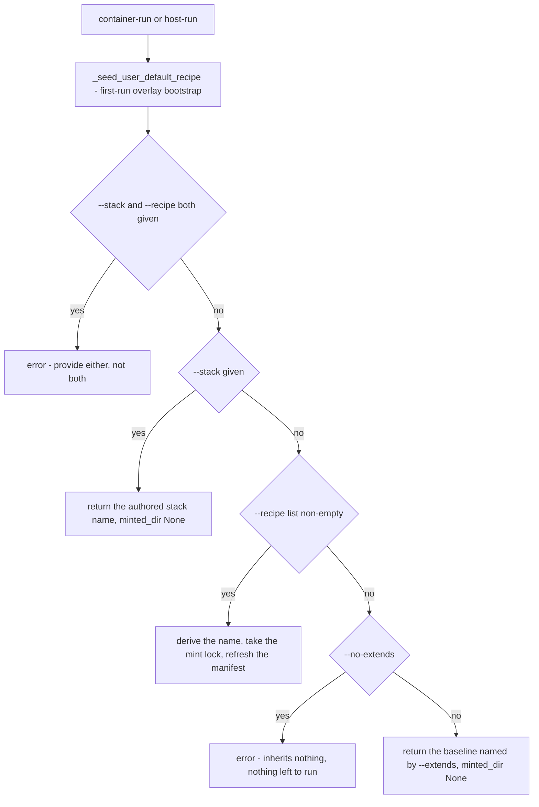
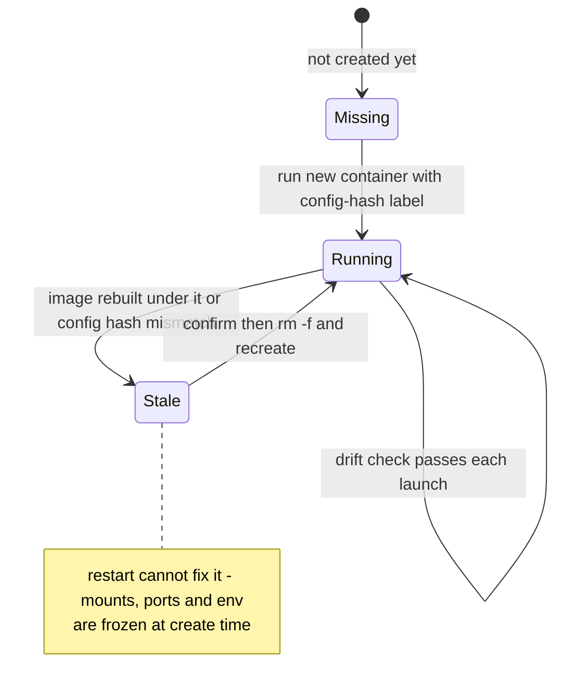

# Dynamic stacks: minting, the derived name, ad-hoc persistence, and service sidecars

`harnessed container-run claude --recipe serena --recipe superpowers` composes a stack without
anyone authoring a `stack.yaml`. The composition has to become a *real* stack anyway — one that
resolves in the catalog like any other — because everything downstream of resolution already keys on
"a stack that resolves in the catalog". This page is about that transformation: the flags, the name
`dynstack` derives from them, the manifest it mints, the lock that serializes the write, the
refusals that keep the machine-made copy from ever silently replacing one you wrote — plus two
behaviors that ride on the same identity: why an ad-hoc launch leaves no launcher script and no aoe
row, and how the services a stack requires are derived, revived, and kept from drifting.

The load-bearing property is stated in the module's first docstring: **the name is derived from the
CONTENT of the recipe set**, so the same set resolves to the same stack in every repo that asks for
it — one image, one pair of volumes, shared. That is what stops ad-hoc composition from multiplying
build artifacts. It relocates nothing: proliferation would otherwise just move from "authored
manifests" to "ad-hoc recipe lists".

Two modules own the whole thing: `src/harnessed/dynstack.py` (name + manifest) and
`launcher._resolve_stack` (the grammar and the lock). `paths.py` supplies the root the manifests land
under.

---

## The grammar: one resolution path for two verbs

Both run verbs resolve their stack through the same helper, `launcher._resolve_stack`, so the two
grammars cannot drift — they differ in BACKEND and never in how a stack is chosen (bd harnessed-s84).



*`launcher._resolve_stack`. The seed runs first because resolution is the step that needs the
shipped baseline to exist: a `--recipe` set mints `extends: default`, and `default` must resolve.*

Four shapes are legal, one is not:

- `--stack <name>` — an authored `stacks/<name>/stack.yaml`. Nothing is minted; the caller's
  `minted_dir` is `None`.
- `--recipe a --recipe b` — compose, derive, mint. `--recipe` is repeatable and **order is
  irrelevant**: the set is sorted before anything is derived.
- neither flag — run the baseline named by `--extends`, exactly as if the user had typed
  `--stack default`.
- `--no-extends` with a recipe list — the list stands alone, no `extends:` key is written.
- `--no-extends` with **no** recipes — rejected. It inherits nothing, so without a list there is
  nothing left to run.

### The `extends` default is asymmetric

`--extends` defaults to `_EXTENDS_DEFAULT = "default"` — but **only on the dynamic path**. Three
consequences, easy to blur together:

1. **A `--recipe` set inherits the baseline by default.** `base = None if no_extends else extends`,
   and the derived name carries the base as its first component: `--recipe serena` (with the
   default base) derives `default.serena`, not `serena`.
2. **An authored `stack.yaml` does not implicitly extend anything.** `--stack foo` returns
   immediately; `--extends` is not consulted and no baseline is folded in. Whatever the manifest's
   own `extends:` key says is the whole of its inheritance.
3. **An empty recipe list is a legitimate launch.** Requiring a throwaway `--recipe` to reach the
   baseline made the common "just start the agent" case the only one with mandatory flags
   (bd harnessed-jhj), so `harnessed container-run claude` runs `default` and mints nothing.

The shipped `catalog/stacks/default/stack.yaml` exists *because of* this default: until it did, the
repo shipped no `default` stack at all, so a fresh install running
`harnessed container-run claude --recipe foo` failed on `extends: 'default' — no such stack`. It is
deliberately minimal — one recipe, no services, no policy fields — because a shipped baseline that
set `permissions:` or turned on credential forwarding would silently apply that policy to every
dynamic stack on every install. To change the baseline, author
`~/.config/harnessed/catalog/stacks/default/stack.yaml`; the overlay wins on the name clash and
replaces the shipped one wholesale.

### `--service` is only honored with `--recipe`

`--service` ("extra service sidecar — rarely needed: a recipe declares the services it requires")
enters stack *identity* only on the mint path. With `--stack`, or on the bare baseline launch,
`_resolve_stack` returns before the service list is read, so the services are dropped rather than
applied. They are not an error; they are simply not part of what those shapes name.

---

## `derive_name`: from flags to one legal string

`dynstack.derive_name(recipes, extends, services)` is a pure function. Four steps:

**1. Canonical form.** `normalize` returns `(extends, tuple(sorted({...})))` — deduped, sorted, with
whitespace-only refs dropped. Sorting is what makes `--recipe a --recipe b` and
`--recipe b --recipe a` the same stack. `_normalize_services` does the same for services.

**2. Sanitization.** `_sanitize` reduces each value (the base, if any, then every ref) to one legal
path component: `ref.strip().lower().replace("/", "-")`, then every run of characters outside
`[a-z0-9-]` folded to `-`, then edge `-`s stripped. So `beads/team` → `beads-team`, `Foo` → `foo`,
`foo bar` → `foo-bar`.

**LOSSY BY DESIGN**, and the docstring says not to try to make it reversible: a path component
genuinely cannot carry case or spaces. The machinery around it does not try to avoid the loss — it
*detects* it and disambiguates.

**3. Reserved components.** A value whose sanitized form lands in `_RESERVED = {"", ".", ".."}`
raises `ValueError: catalog ref {original!r} does not yield a usable stack-name component`. An
all-unsafe ref like `***` sanitizes to the empty string, and `.`/`..` fold their dots to `-` which
the trailing strip then removes — either way `mint` would write into the stacks directory itself or
into its **parent** instead of a stack of its own. `.` and `..` stay listed even though the current
alphabet cannot emit them, because the check must hold whatever the alphabet is: they are the names
that are dangerous, not the route by which they arrive.

An empty recipe list is refused separately: `ValueError: a dynamic stack needs at least one recipe`.

**4. The digest decision.**

```python
readable = _JOIN.join(parts)
lossy = any(clean != original for original, clean in zip(values, parts, strict=True))
if not lossy and not svcs and len(readable) <= NAME_MAX:
    return readable
suffix = "-" + _digest(base, refs, svcs)
return readable[: NAME_MAX - len(suffix)].rstrip(_JOIN + "-") + suffix
```

`NAME_MAX` is 64 — the cap exists because the name becomes a directory, appears in `harnessed list`,
and is interpolated into a podman image tag, so a pathological set must not produce an unwieldy or
illegal name. The truncation strips trailing `.` and `-` because a cut can land mid-component and
leave a separator directly before the suffix's own `-`, which the grammar forbids.

Three things force the digest, and each is a different notion of "the readable join is no longer a
faithful encoding of the input":

- **a ref was sanitized lossily** (`Foo` vs `foo`, `foo bar` vs `foo-bar`, `beads/team` vs a recipe
  literally named `beads-team`) — the check is on *any* difference between original and sanitized,
  not just `/`, because checking only for `/` missed case folding and space folding;
- **the join exceeded `NAME_MAX`**;
- **explicit `services` were selected** — see below.

`_digest` is an 8-hex-character slice (`_HASH_LEN = 8`) of a SHA-256 over the **UNSANITIZED** inputs:
`"\x00".join([base or "", *refs]) + "\x1f" + "\x00".join(svcs)`. Two properties matter:

- computed from unsanitized inputs, so two sets that sanitize to the same readable string still hash
  differently — `beads/team` and `beads-team` derive `beads-team-55bfd6ac` and `beads-team`;
- the `\x1f` between groups keeps `(refs=("a","b"), svcs=())` distinct from `(refs=("a",),
  svcs=("b",))`, which a single flat join would collapse.

---

## The OCI tag grammar — why `.` is the join and nothing else may be

The name is interpolated into a podman tag by `layout._derived_image` on the build path
(`harnessed-<harness>-<stack>:latest`), so it must satisfy the **OCI name-component grammar**:
alphanumerics separated by `.`, `_`, `__` or runs of `-`, with no leading or trailing separator.

That alphabet is **strictly smaller than a filesystem's**, and podman rejects a bad tag at *build*
time — which the suite cannot catch, because it runs no podman. So the constraint has to be held by
construction in the code, and `dynstack.py` states it as an invariant rather than leaving it to be
rediscovered:

> `_JOIN` must be legal in a tag **AND** impossible for `_sanitize` to emit**.** If a sanitized ref
> could contain the separator, `["a<sep>b", "c"]` and `["a", "b<sep>c"]` would both join to
> `a<sep>b<sep>c` with neither flagged lossy — a silent collision onto one manifest, one image and
> one pair of volumes.

`.` and `_` are the only tag-legal separators, so the sanitizer's output alphabet is narrowed to
`[a-z0-9-]` and `.` is reserved for the join. Folding `_` and `.` into `-` also closes a second
hole: a ref like `_foo` or `.foo` would otherwise survive intact and produce a component *starting*
with a separator, which the grammar forbids outright. No catalog recipe name contains `.` or `_`, so
the narrowing costs nothing in readability.

Restoring `_` or `.` to the sanitizer's alphabet reopens both holes at once. The same reasoning, one
layer up, is why volumes are identified by label rather than by parsing their names
(`volumes._VOL_STACK_LABEL`) and why the derived name can never be split back into refs — see
"the name is not parseable", below.

---

## Services are the third identity input

A stack's identity has **three** inputs: the base, the recipe set, and the service set. Services
never appear in the readable join — that would bloat every name for a rarely-used escape hatch — so
**the digest is their only carrier**. Two consequences the source states as obligations on callers:

- `derive_name` appends a digest whenever `svcs` is non-empty, so `--service` selections cannot
  share one name.
- **`services` MUST be passed to both `derive_name` and `mint`.** `_resolve_stack` does exactly
  that, and its comment names the failure: deriving without them would compute a different name than
  `mint()` does, and the preexisting-stack check would inspect the wrong path. More generally,
  omitting them from either call lets two different service selections mint over each other's
  manifest and share one image and volume pair.

The regression guard runs the other way too: an empty service list must *not* put a digest on the
common case — every invocation that does not use the `--service` escape hatch — or every dynamic
name becomes unreadable for no benefit.

---

## `mint`: write (or refresh) the manifest

`dynstack.mint(recipes, extends, services)` returns `(name, stack_dir)`, writing
`$XDG_DATA_HOME/harnessed/generated/stacks/<name>/stack.yaml`:

```yaml
# GENERATED by `harnessed run` — do not edit.
# Regenerated from its recipe set on every launch; hand edits are lost. The name is derived
# from the content, so an identical recipe set in another repo resolves to this same stack.
# A stack manifest rejects unknown fields, so 'generated' is a comment, not a key: what
# marks this stack machine-made is its LOCATION under the generated catalog root.
name: default.serena
extends: default
recipes:
  - serena
services: []
```

Three properties of the file itself:

- **It is a real stack manifest.** `name:` equals the directory (the loader requires it), the recipe
  list is rendered sorted, `extends:` appears only when a base was given (`--no-extends` emits no
  key), and `services:` is written as `[]` when empty.
- **Being machine-made is expressed by location, not by a key.** A stack manifest rejects unknown
  fields unconditionally, so `generated: true` could not be written; the generated root is the
  marker, and it is what `aoe._composed_recipes` and both garbage collectors test.
- **Idempotent and mtime-honest.** Identical inputs rewrite identical bytes, and the file is written
  only when the content differs — so a repeat launch neither perturbs the staleness check (whose
  stamp hashes the `stack.yaml` bytes) nor moves the mtime, which therefore tracks real change.

### Refuse rather than shadow

Before writing, `mint` resolves the derived name through the ordinary catalog search:

```python
existing = paths.find_in_catalog("stacks", name)
generated_root = paths.generated_catalog_root().resolve()
if (existing / "stack.yaml").is_file() and not existing.resolve().is_relative_to(generated_root):
    raise ValueError(
        f"derived name {name!r} collides with an authored stack at {existing} — that stack "
        f"would win resolution and be launched instead. Rename it, or change the recipe set."
    )
```

The generated root is deliberately **last** in `paths.catalog_roots()` precedence. An authored stack
of the same name therefore *wins resolution*, so `find_in_catalog` would hand both build and launch
the authored manifest while the minted one sat ignored — and `run` would silently execute something
the user did not ask for. `mint` refuses instead of shadowing. (Reported on PR #176.)

Note what the check *permits*: a pre-existing manifest **under the generated root** of the same name
is the same stack, and minting over it is the refresh it exists for. Only a resolution that lands
outside the generated root is a collision.

`_resolve_stack` converts the `ValueError` (and any `OSError`) into a one-line error and exit 1.

---

## The mint lock and the preexisting-stack shortcut

Two launches of the same recipe set in different repos can race: both derive the same name, both
check `is_file()`, both write. `launcher._mint_lock(derived)` serializes exactly the
`is_file → mint` sequence, per derived name, with an exclusive `flock` on
`<generated>/stacks/{derived}.lock`.

```python
derived = dynstack.derive_name(list(recipe), base, services=list(service))
with _mint_lock(derived):
    preexisting = (paths.generated_catalog_root() / "stacks" / derived / "stack.yaml").is_file()
    name, stack_dir = dynstack.mint(list(recipe), base, services=list(service))
return name, None if preexisting else stack_dir
```

Three decisions in six lines, each with a reason attached in the source:

- **The lock file is a SIBLING of the stack dir** (`stacks/{derived}.lock` vs `stacks/{derived}/`),
  so it survives an rmtree of the guarded directory — and there are three delete sites that do
  exactly that (below).
- **`derive_name` runs OUTSIDE the lock.** It is pure computation, and its return value **is** the
  lock key — so it cannot be inside. Calling it inside would deadlock on a key that does not exist
  yet. (Source cites issue #287, reviewed and confirmed.)
- **The lock is released before `_resolve_stack` returns and never held across a build.** Holding it
  across `harnessed build` would serialize unrelated work for no benefit.

### `minted_dir` and the cleanup rule

`_resolve_stack` returns `(name, minted_dir)` where `minted_dir` is non-None **only when THIS call
created the manifest**. An authored stack and a dynamic one whose manifest already existed both
yield `None` — neither is ours to delete. The `preexisting` probe is read under the lock, *before*
mint, precisely so the answer is not disturbed by the write that follows it.

The callers turn that into the ownership rule:

- **`container-run`** calls `_build_stack` immediately on the `--recipe` form — a freshly minted
  stack has no assembled profile and everything below hard-errors without one. Unconditional because
  `_build_stack` is fingerprint-gated downstream, so an unchanged set is cheap; and deliberately not
  skipped under `--create-aoe-only`, since the command the registered row replays would be dead on
  arrival against an unbuilt stack. On failure it removes `minted_dir`. Otherwise a stack that never
  built lingers in the catalog, appears in `harnessed list`, and **no GC reclaims it** — `volume-gc`
  keys on volumes, and a stack that never built owns none.
- **`host-run`** has no build to fail, but `_launch_host` assembles in-process and a
  `SchemaError`/`CollisionError` from a bad recipe set lands in the same place: remove `minted_dir`
  and re-raise. Two subtleties it gets right:
  - `typer.Exit(0)` is a **success** that unwinds like a failure (`--create-aoe-only` ends that way,
    having just written an aoe row whose recorded command names this manifest) and must **not**
    clean up — deleting it would manufacture precisely the dead-on-arrival row the flow avoids. Only
    a non-zero `Exit` cleans up.
  - A **pre-existing** manifest is never collateral. It may be a working stack that today's recipe
    edit merely broke.

### No image build on the host path

`host-run` mints exactly like `container-run` but never builds an image: `_launch_host` assembles
in-process on every launch. Minting is shared; only what happens after diverges.

---

## Why a manifest is minted at all

The alternative — pass a recipe list straight to the assembler — is the tempting simplification, and
`dynstack.py`'s module docstring is the standing argument against it:

> A real `stack.yaml` is minted rather than passing a recipe list straight to the assembler because
> profile location, volume labels, staleness checks, `harnessed list`, and BOTH garbage collectors
> are already keyed on "a stack that resolves in the catalog". Minting the file makes all of them
> work unchanged; skipping it would mean teaching five subsystems about a new kind of thing.

| Subsystem | What it keys on | What minting buys it |
| --- | --- | --- |
| Profile location | `paths.profile_dir(stack, harness)` → `profiles/<stack>/<harness>/` | the derived name gets its own profile dir, per harness |
| Volume labels | `volumes._volume_labels` → `harnessed.stack=<name>` on `harnessed-cfg-*` / `harnessed-tools-*` | the volume pair is keyed to the derived name, shared across every repo using that set |
| Staleness | `staleness.compute_stamp` hashes `find_in_catalog("stacks", name)/stack.yaml`; `stack_resolves` re-loads it | the stamped bytes *are* the recipe set, so an edit to a recipe makes the profile stale |
| `harnessed list` | `paths.list_catalog_stacks()` walks the catalog roots including the generated one | generated stacks are listed, with built/not-built, like any other |
| Both garbage collectors | `find_in_catalog("stacks", <name>)/stack.yaml` is missing → orphan | generated stacks are GC-eligible *and* authored-stack-protected through the identical test |

That last row is the one that cuts both ways, and it is why the "five subsystems" count is not a
throwaway: a generated stack is protected from `host-gc`/`volume-gc` for as long as its manifest
resolves, and becomes reclaimable the moment it does not — with no special case anywhere in either
collector. The collectors each probe the manifest directly (`find_in_catalog` never raises; it
returns the highest-precedence candidate path even when nothing exists there, so the `stack.yaml`
has to be `is_file()`-probed), and `volume-gc` reads the stack name off the volume's
`harnessed.stack` label rather than parsing the volume name.

---

## What the derived name reaches downstream

The name is one string, and several subsystems interpolate it. Worth knowing which, because each
adds a constraint the naming machine had to satisfy:

- **Image tag** — `harnessed-<harness>-<stack>:latest` (`layout._derived_image`). Source of the OCI
  grammar constraint above.
- **Volume pair** — `harnessed-cfg-<harness>-<stack>` and `harnessed-tools-<harness>-<stack>`; the
  content-derived name is what makes the same recipe set in five repos *one* image and *one* pair of
  volumes.
- **Instance name and hostname** — `harnessed-<harness>-<stack>-<project_hash>`. A content-derived
  stack name is the one thing that pushes an instance name past Linux's 64-char hostname cap
  (`harnessed-omp-default.beads-team.serena.superpowers-f6eb0941-59258991` is 69 characters, and
  every launch of it died with `sethostname: Invalid argument` before
  `paths.container_hostname` began truncating the middle — keeping the `harnessed-<harness>-` head
  and the whole trailing project hash, which are what tell two prompts apart).
- **aoe rows** — `aoe.command_for` records the **resolved** stack name as `--stack <derived-name>`,
  never the user's original argv. A dynamic stack is minted *before* `command_for` is called, so
  `--stack <derived-name>` replays it exactly and one canonical form serves every verb that reaches
  there — a row records the same shape whether the user typed `--stack` or a `--recipe` set.
- **`ssh_keys` are always dropped for a generated stack.** `mint` never writes an `ssh_keys:` key,
  and a generated stack resolves under the generated root, never the user's overlay — so
  `credmounts._stack_from_overlay` is False and `_trusted_ssh_keys` drops any private-key mounts
  inherited through `extends:` with a warning. The only route in would be inheritance, and the same
  gate closes it. A shared-catalog stack (which a generated one always is, from the trust
  standpoint) can never mount your key.

### The name is not parseable

`aoe._composed_recipes` — which feeds the dashboard title with the stack's *delta over its
baseline* — reads the **raw manifest**, never `load_stack`, and its docstring explains why the name
cannot be used instead: `derive_name` joins on `.` after sanitizing each ref and appends a digest
when the join is lossy or over-long, so the single recipe `beads/team` mints as
`default.beads-team-55bfd6ac`; splitting that on `.` yields `beads-team-55bfd6ac`, which is neither
the recipe nor recoverable. The manifest carries `recipes: [beads/team]` verbatim.

The same function guards on location: only a stack whose directory sits under the generated root is
machine-made, so an authored stack returns `(None, [])` (its `recipes:` key is its whole content,
not a delta — `default` lists eight recipes and reading it would produce a title several times
longer than the name it replaced). A missing, unreadable or malformed manifest costs the delta and
falls back to the stack name, never a failed launch.

The function returns the **baseline alongside** the delta — a change prompted by adversarial review.
The delta alone cannot tell `default.serena` from `isolated.serena`: they share the recipe `serena`
and rendered identically, and once the stack entered the recorded command the two colliding titles
made every launch *drift* — each one renamed the other stack's row aside, and alternating launches
ping-ponged forever. `aoe.title_for` therefore prefixes the join with the baseline — but **only when
it is not `default`**, because restating `default.` on every row is exactly the noise the delta-only
rendering removed, and `default` is the baseline nearly every stack extends. Recipes are joined with
`+`, not `-`, because recipe names contain `-` themselves, so a `-` join has no visible seam.

---

## Ad-hoc launches persist nothing

A launch leaves two surfaces behind: a `<harness>-<stack>-<verb>` launcher script dropped into the
user's repo, and an aoe dashboard row. **For an ad-hoc stack it leaves neither** — they describe a
stack the user was trying out, and a dashboard row for one is the same noise `aoe._SKIP_STACKS`
already suppresses for the `default` baseline. This is pinned by
`tests/test_adhoc_launch_is_not_persisted.py`.

`dynstack.is_adhoc(stack)` recognizes two kinds, by two different signals:

- **A minted stack is known by WHERE it resolves.** The stack dir under the generated root is the
  same rule `mint` writes into every manifest header. Crucially it is *not* the caller's
  `minted_dir`: minting is idempotent, so the second launch of one recipe set mints nothing and
  would persist a script and row just one launch late — the exact regression the location rule
  exists for.
- **A test stack is known by name** — `test` or any `test.*` — because a test stack is authored
  like any other and has no location to read.

Resolution decides, so an authored stack shadowing a generated name is correctly **not** ad-hoc
(the authored one is what launches), and a name that resolves nowhere is not either
(`find_in_catalog` falls back to the highest-precedence root, which is never the generated one).

`launcher._persist_this_launch` turns that into **one answer for both surfaces, not two**. The
row's recorded command IS the script, so writing the row while skipping the script would register a
row that is dead on arrival — precisely the hazard both call sites are ordered to avoid. The same
escape hatch `_SKIP_STACKS` grants applies, for the same reason: `--aoe-group`/`--aoe-title` name
the row and naming one is asking for it, and `--create-aoe-only` is the stronger case — registering
*is* the command the user typed.

```python
if group is not None or title is not None or only:
    return True
return not dynstack.is_adhoc(stack)
```

---

## Service sidecars: identity, revival, and drift

A service is a sidecar shared across the stacks of one project. `svcstate.py` derives everything
about it that can be **computed** — container name, project key, data dir, port, password, client
env, and whether a running container has drifted — from the manifest plus the project path;
starting, stopping and health-checking stay in `launcher.py`. Deriving rather than storing is what
lets a second launch *find* the same service instead of starting a duplicate: the name and port
fall out of the same inputs every time.

### Which services a stack requires

`svcstate._service_refs` unions three sources, in first-seen order, de-duped: (1) recipe `service:`
MCP-server refs (the assembler proxies these by URL), (2) recipe `services:` — sidecars a *recipe*
requires that have no MCP surface — and (3) the stack's own `services:` list. Source (2) is what
lets a bare recipe list describe a working stack: a `dolt sql-server` speaks MySQL, not MCP, so it
can never be an MCP ref, and before it existed only a stack could attach one. All three feed the
launcher's ensure-and-start path, which starts each idempotently at launch.

### Identity and data placement

- **Container name.** `harnessed-svc-<name>`, plus `-{project_key}` for a project-scoped service.
  The project key is hashed from the **git common dir**, so every worktree of one checkout shares
  ONE server container (which is the point: a dolt server holds an exclusive lock on its data dir,
  and the worktrees all resolve to the same in-repo `.beads`).
- **Data dir follows the recipe, not the service.** The service names a persist entry
  (`data.persist`); `_service_data_dir` finds the recipe in the stack that declares it and follows
  that entry's placement — `in_repo` means the checkout-anchored dir mounted path-preserving,
  `host` means the per-scope persist dir with agents seeing `$CONTAINER_HOME/<name>` in a container
  but the real dir on a host launch. A service declaring a persist entry no recipe provides is a
  `SchemaError`.
- **Ports.** `publish: stable` gets a permanent host port from one machine-wide registry
  (`paths.svc_ports_file`), allocated once under an exclusive flock from the 20000–59999 range and
  kept even while our own sidecar holds it — persistence is what lets the project's own
  `mise.local.toml` carry a config that survives a reboot or `--fresh`. `publish: ephemeral` is
  re-read from `podman port` at every launch and deliberately never written down.
- **Password.** For a published service, a `token_urlsafe` secret created once under XDG state —
  never in the service's data dir, because for `in_repo` that dir is the user's repo and a secret
  there is one `git add -A` from the remote. 0600, parent dir 0700.
- **Client env.** `svc_client_env` fills the service's declared templates (`{host}`, `{port}`,
  `{password}`, `{socket}`) per launch; `{host}` is 127.0.0.1 for a host agent and
  `host.containers.internal` for a containerized one. Socket-backed services export
  `HARNESSED_<NAME>_SOCKET` for the attach shell instead.

### Revival and drift



*Sidecar lifecycle as seen at launch (`launcher`'s ensure-and-start, `svcstate._svc_drift_reason`).*

At launch, each required service is built if missing and started if not running. If it IS running,
it is compared against what the current code *would* create: the create-time argv is hashed
(`_svc_config_hash`, SHA-256 over the `podman run` command) and stamped on the container as
`harnessed.svc-config-hash`. A running sidecar is stale when its image was rebuilt under it
(`_container_stale`) or the hash no longer matches — and **a missing label counts as stale**, since
the container predates the stamping and cannot be shown to match. Without this, a sidecar drifts
arbitrarily far from the code that would create it today, which is exactly how five beads-servers
once ran for days without the mount that made backups work, each failing silently.

Recreation must go through the same create path — `harnessed svc recreate` calls it with
`force_recreate` — because `podman restart` reuses the existing container and reports success while
changing nothing. Data (named volume or bind mount) is always preserved. The recreate prompt uses
`_can_prompt`, not a bare isatty: an `-exec` launch has a real TTY and nobody at it, and this
confirm once hung a scripted launch (#450). Headless mode (`HARNESSED_HEADLESS=true`) proceeds
automatically.

A `scope: project` container also carries `harnessed.svc-stack`, the stack that created it — the
data dir is chosen by the stack, so rebuilding needs the exact stack, and nothing else on the
machine records project → stack for a service. For sidecars created before the label existed,
`_svc_stacks_from_instances` falls back to reading stack names out of agent instance container
names, longest-harness-prefix first (stack names contain dashes, so a naive split truncates), with
running instances winning over stopped ones.

**A healthcheck that never passes aborts the launch** — it used to warn and continue, which let an
agent come up attached to a service it could not talk to. There is no `required:` flag: a stack
does not attach a sidecar whose health it is indifferent to.

---

## Invariants an editor must not "simplify"

- **`_JOIN` must be tag-legal AND outside the sanitizer's output alphabet.** Widening the alphabet
  to `_` or `.` reopens the silent join collision (`["a.b","c"]` vs `["a","b.c"]` → one manifest,
  one image, one volume pair, neither flagged lossy) *and* the leading-separator hole.
- **The digest must be computed from the UNSANITIZED inputs**, with a `\x1f` between the refs group
  and the services group. Hashing the sanitized parts reintroduces every fold the digest exists to
  escape; dropping the separator lets a service named `b` collide with a recipe named `b`.
- **Services go to both `derive_name` and `mint`.** Half of the pair computes the wrong name or
  writes to the wrong path.
- **`derive_name` stays outside the lock** — its return value is the lock key. Moving it inside is
  not a fix for anything; it is a deadlock on a key that does not exist yet (#287).
- **The lock file stays a sibling of the stack dir.** Moving it inside makes the three rmtree sites
  delete the lock out from under the code holding it.
- **The authored collision is a refusal, not a shadow.** "Generating anyway and letting precedence
  sort it out" is the exact silent-launch-the-wrong-stack failure the refusal prevents (PR #176).
- **The generated root stays last in `paths.catalog_roots()`, and never becomes the overlay.** Last,
  or a machine-minted stack shadows one you authored; in `~/.config`, and `harnessed list` can no
  longer tell the two apart while a regeneration silently clobbers a hand edit.
- **`mint` writes only when the bytes differ.** Rewriting unconditionally moves the mtime on every
  launch and stops it tracking real change.
- **`typer.Exit(0)` must not trigger mint cleanup** on the host path. It is `--create-aoe-only`
  succeeding, not a launch failing.

---

## Verification stance

The naming machine's riskiest property — OCI tag legality — is exactly the one no automated run can
observe, because the suite runs no podman and a bad tag is rejected only at build time. That is why
the grammar is enforced by construction in `_sanitize`/`_JOIN` and stated as an invariant in the
code rather than checked at launch: the tests can assert the *alphabet* (`[a-z0-9-]`, no leading or
trailing separator, the join char unreachable), the *collision refusals* (`beads/team` vs
`beads-team`, `Foo` vs `foo`, `["a.b","c"]` vs `["a","b.c"]`, service-only differences), the
*idempotence* of `mint`, and the *authored-stack refusal* — but a character legal in a directory
name and illegal in a tag would still pass every one of them and die only in a real
`podman build`. The live contract tests behind `HARNESSED_PODMAN=1` are the only layer that can see
it.

---

## Related

- [Catalog: schema, roots, resolution, and packaging](/openwiki/architecture/catalog-and-schema.md)
  — the three roots, `extends:` merge semantics, and the packaging that ships the catalog.
- [State: what lives where on disk, staleness, and GC](/openwiki/architecture/state.md) — the
  generated catalog root, the stamp, and the collectors that key on catalog resolution.
- [Precedence](/openwiki/concepts/precedence.md) — the overlay-wins/generated-last ordering this
  page's collision refusal depends on, and the policy-free `default` baseline.
- [Container run](/openwiki/workflows/container-run.md) — the sequencer that consumes the minted
  name, and stage 0 in context.
- [Host run](/openwiki/workflows/host-run.md) — the same resolution with no image build.
- [aoe and launch scripts](/openwiki/integrations/aoe-and-launch-scripts.md) — the row that records
  the resolved name, and the delta-over-baseline title.
