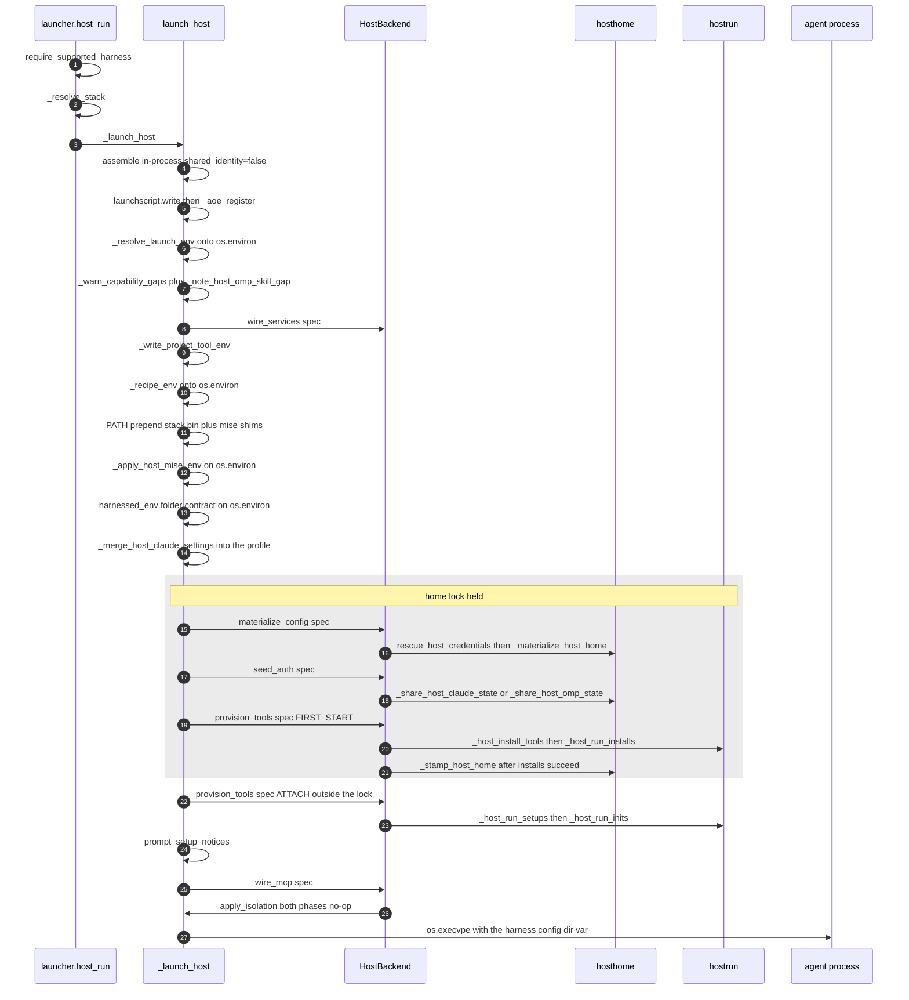

# Host launch: `host-run` end to end

`harnessed host-run <harness> [path]` runs a composed stack with **no podman, no image, and no
container anywhere on the path**. The assembled profile is laid down as a real per-stack directory
tree, the harness is exec'd as a process on the machine with the host's own auth, filesystem and
network, and `harnessed` is gone by the time the agent starts. What this backend isolates is
**configuration** — which skills, rules, commands and hooks are live — and nothing else. That is a
declared boundary (`HostBackend.isolation = ISOLATION_NONE`), not a missing one.

### What `host-run` never gives you

Say it plainly, because it is the safety-relevant asymmetry between the two backends: **no pod, no
network namespace, no egress firewall, and no separate home.** The agent is a plain process running as
your uid, in your real project, against your real `$HOME` and your real credentials, with your
machine's full network reach. Three consequences follow, and each is named elsewhere on this page:

- a recipe's `egress:` allowlist is **not enforced** — the one `DEGRADED` cell in the capability
  matrix, warned once per launch at `[INFO]`;
- an `install.system` step is **skipped and announced**, never sudo'd — harnessed does not mutate
  your system;
- the only thing that is per-stack is configuration. Your session history and credentials are
  deliberately *shared up* to your real harness dirs ([share-back](#share-back-mechanism-1-references-not-copies)),
  because that is the host analog of the container's bind-mounts, not a leak.

If a stack's declarations need a boundary, that stack belongs under
[`container-run`](/openwiki/workflows/container-run.md).

The sibling verb is [`container-run`](/openwiki/workflows/container-run.md): same grammar, same
stack resolution (`launcher._resolve_stack`), inverted capability order. The contract both
implement is [`architecture/backends.md`](/openwiki/architecture/backends.md) — `backend.ExecutionBackend`,
six capabilities, deliberately no shared driver, because the two existing backends do not agree on an
order and cannot be made to. The host implementation is `launcher.HostBackend`, sequenced by
`launcher._launch_host`; the host-side mechanics live in `hosthome.py` (materialize + share-back),
`hostrun.py` (tools/installs/setups/inits/native MCP) and `launchenv.py` (launch-time secrets).
Related: [credentials](/openwiki/concepts/credentials.md),
[invariants](/openwiki/concepts/invariants.md), [harnesses](/openwiki/integrations/harnesses.md).

## The sequence



*One interactive launch. The grey block is the home lock — the only span across which a concurrent
launch of the same `(stack, harness)` must wait.*

---

## The ordering invariant, stated first

> **Installs run AFTER `_materialize_host_home`, because the materialize wipes the home.**

`_launch_host` calls `backend.materialize_config(spec)` and only then
`backend.provision_tools(spec, FIRST_START)`, inside one `with _host_home_lock(...)`. This order is
required, not stylistic, and `_host_run_installs`' docstring forbids moving it:

- **The rebuild is destructive.** When the fingerprint moves, `_materialize_host_home` empties the
  config dir (`_clear_host_home_except_runtime`) before copying the profile back in. An install that
  ran *before* it would have its output deleted milliseconds later — silently, because nothing
  fails. That is exactly the harnessed-8px.1 failure shape, and it is why the ordering is pinned in
  prose at both the sequencer and the callee.
- **Install bakes content; setup configures against it.** `provision_tools(ATTACH)` therefore runs
  `_host_run_setups` *after* `FIRST_START`, and `_host_run_inits` after setups (a setup script may
  install the very binary an `init.run` invokes).
- **`tools:` before `install:`**, mirroring the derived image's layer order and load-bearing: an
  `install.sh` now configures a binary that `tools:` provides (e.g. `serena init -b LSP`).

The fingerprint gate narrows *when* the wipe happens (only on a stack change) but does not relax
the constraint: whenever the home was rebuilt, the install must follow it.

### What makes the every-rebuild re-run affordable

Because a rebuild wipes the home, install output cannot persist *in the home*; and because a
rebuild happens whenever the stack changes, install scripts re-run on every rebuild. `install.cache`
is the declaration that makes that affordable — `paths.install_cache_dir(recipe_name, cache_key)`
keys a content cache under `$XDG_CACHE_HOME/harnessed/install/...` by the recipe's **pinned** ref
(the repo's pin policy rejects floating keys, so the key never moves). The *output* cannot survive
the wipe but the pinned *source* can, so a rebuild costs a copy out of the cache rather than a
re-clone. The cache directory's own existence is the script's hit/miss test; `_host_run_installs`
creates only the **parent**, never the leaf. Bumping the pin yields a new directory, so an upgrade
can never read stale content.

---

## Entry point and in-process assembly

`launcher.host_run` (the Typer command) gates the harness, resolves the stack through the shared
`_resolve_stack`, and calls `_launch_host`. On failure it removes a manifest *this invocation*
minted — except on `typer.Exit(0)`, which is `--create-aoe-only` succeeding and must not clean up a
row whose recorded command names that manifest.

`_launch_host` **assembles in-process on every launch**:

```python
assemble(None, stack, paths.profiles_root().parent, harness, strict=True, shared_identity=False)
```

This is emit-only — no podman invocation, no image build — and it is what keeps `host-run`
container-free end to end. Assembly is sub-second, so a rebuild-per-launch also sidesteps
staleness bookkeeping entirely: there is no `is_built` / `staleness.check_profile_fresh` gate on
this path because assembly *is* the gate. Two consequences worth knowing:

- `shared_identity=False` suppresses the one emit step that writes outside the profile — omp's
  delimiter-marked blocks in the shared `~/.omp/agent`. A host launch reads a per-stack agent dir
  (`PI_CODING_AGENT_DIR`), so leaving the shared write on would deposit blocks into the user's own
  omp precisely to achieve nothing.
- `_prune_unlaunchable_omp_blocks` follows, dropping blocks whose stacks no longer resolve.

`launchscript.write` and `_aoe_register` run **after** assembly (assembly is this backend's real
validation gate, the analogue of the container path's is_built/staleness checks), and the script is
written *before* the row because the row's command *is* that script.

### Which harnesses can run here

`launcher._HOST_HARNESSES` is the record, and the membership rule is mechanical: a harness qualifies
only if it exposes an env var whose value *is* a per-stack config/agent dir — one lever that moves
the harness's whole user-level surface.

| harness | `config_dir_var` | `argv0` | `share_state` |
|---|---|---|---|
| `claude` | `CLAUDE_CONFIG_DIR` | `claude` | `_share_host_claude_state` |
| `omp` | `PI_CODING_AGENT_DIR` | `omp` | `_share_host_omp_state` |

codex, opencode and antigravity are absent because their rows have not been established, not
because host mode is claude-shaped. Adding one is filling in a row. Note the two omp dead ends:
`PI_CONFIG_DIR` is a *name under `$HOME`* (`path.join(os.homedir(), PI_CONFIG_DIR || '.omp')`), so
it cannot address a harnessed home at all; and `--profile` is mutually exclusive with the env var
and **wins**, silently pointing omp at an isolated empty store.

Materialization is deliberately *not* in that record, because the two harnesses lay down different
directory shapes — `_host_launch_plan` branches once, explicitly.

---

## Env delivery: `os.environ` IS the box

A container launch sets env box-wide (`podman run -e`), so every process in the pod agrees. A host
launch has no box, so **the launcher process's `os.environ` is the box**: mutations are made
in-place on `os.environ`, and `env = dict(os.environ)` at the exec is what actually delivers them to
the agent. Every install/setup script spawned from here inherits them too.

The host-only layers land on `os.environ` in a deliberate order — **launch secrets, then recipe env,
then the folder-env contract** — and inside the install/setup sub-environments the **harness
config-dir pinning goes LAST** of all:

1. **Launch-time secrets** — `os.environ.update(_resolve_launch_env(project_path))`. This is the
   host-native twin of the container path's `_resolve_launch_secrets`: the same sources (a varlock
   `.env.schema`, else a plain `.env`, at `~/.config/harnessed/` global-then-project, project wins)
   and the same precedence, returned as a `KEY → value` map instead of a list of `--env-file` paths.
   **Nothing is written to disk on this path** — strictly better than the container path's
   mode-0600 temp file, which exists only because podman needs a file. It returns `{}` when nothing
   is configured or varlock fails; a launch must not hard-fail on secrets it may not need.
2. **Recipe `env:`** — `os.environ.update(_recipe_env(host_recipes, project_path, mode="host"))`,
   applied *after* the launch env so **a recipe declaration still wins**, mirroring container mode
   where `podman run -e` beats `--env-file`.
3. **The folder-env contract** (`setupenv.harnessed_env`), plus the PATH prepend and the mise
   redirect — which **clears as well as sets** (`_apply_host_mise_env` removes an inherited
   `MISE_STATE_DIR` it recognizes as its own former shape). See
   [PATH and the mise redirect](#path-and-the-mise-redirect) below.
4. **`_harness_config_env` LAST**, but only inside the install/setup script environments, where an
   inherited `CLAUDE_CONFIG_DIR`/`PI_CODING_AGENT_DIR` must not survive (bd harnessed-8px.26). See
   [host-only install redirections](#host-only-install-redirections).

The full conflict table — who wins when a recipe, an env-file, a stale shell export and a baked
image ENV all claim the same name — lives on
[precedence](/openwiki/concepts/precedence.md); this page keeps only the host-specific rows.

Two precedence calls in step 1→2 are deliberate (bd harnessed-36l) and both are about making the
schema the declared source of truth:

- launch env before recipe env, so recipe declarations win;
- launch env **over an inherited shell value of the same name** — letting a stale export in the
  invoking shell silently beat the schema is the failure mode hardest to see from inside a session.

`_write_project_tool_env` gives the *project* the same tool env (a 0600 dotenv under
`$XDG_STATE_HOME`, keyed on the git common dir, regenerated every launch), so a plain `bd` in a
terminal and three live agents do not each fall back to auto-start and fight over a sidecar's
exclusive lock. Nothing is written into the repo.

### PATH and the mise redirect

`_launch_host` prepends, in order: the stack bin dir (`_stack_tools_dirs(stack)[1]`), then the
stack's own mise shims dir (`_host_tool_shims_dir` = `<tools>/mise/shims` — **not** the user's
`~/.local/share/mise/shims`), then the inherited `PATH`.

**The shims entry is useless without the env redirect**, and shipping one without the other is the
bug `_apply_host_mise_env` exists to prevent. A mise shim is a symlink to the mise binary, so it
re-resolves the tool by `argv[0]` against `MISE_DATA_DIR` *at run time*: install-time redirection
alone puts the binary somewhere the shim can never find again — `mise ERROR <tool> is not a valid
shim`, because mise fell back to `~/.local/share/mise` where the stack installed nothing.

| variable | value | redirected? |
|---|---|---|
| `MISE_DATA_DIR` | `<xdg_data>/harnessed/tools/<stack>/mise` | **yes** |
| `MISE_CONFIG_DIR` | `<...>/mise/config` | **yes** |
| `MISE_STATE_DIR` | — | **deliberately NOT** |
| `MISE_TRUSTED_CONFIG_PATHS` | carried from the user's own config + inherited env, deduped | re-set from user entries |

**Why `MISE_STATE_DIR` is not redirected.** mise keeps its **trust store** in the state dir
(`trusted-configs`, `tracked-configs`, and nothing else), and trust is a fact about the user and a
config *file* — never about which stack happens to be running. Redirecting it gave every stack an
empty trust store, so every project `mise.toml` the user had already trusted read as untrusted
inside every harnessed session, and each new stack (or a rebuilt tools dir) re-broke one the user
had just repaired. mise reports that as `mise ERROR error parsing config file: <path>` — which
*reads* like a TOML syntax error and is not one; the file is simply not loaded at all, so a project
whose `[env]` carries e.g. `BEADS_DIR` comes up unconfigured for reasons nothing on screen
explains. Neither entry is stack-scoped, so sharing the user's costs no isolation: the stack's own
`config.toml` lives under `MISE_CONFIG_DIR` and is trusted implicitly for being there.

**Auto-trusting is not the fix.** harnessed *naming* a path in `MISE_TRUSTED_CONFIG_PATHS` would
grant trust the user never granted, and a mise config can carry `_.source` — so that is code
execution. The distinction is **inventing versus carrying**: `_apply_host_mise_env` does set the
variable, but from entries read out of the **user's own config** (which the `MISE_CONFIG_DIR`
redirect would otherwise hide from them) plus entries already inherited, deduped. Every entry
traces to the user or to the environment we were handed; harnessed names none of its own.

Three sharp edges are pinned in code and must not be "cleaned up":

- **A stale `MISE_STATE_DIR` a previous release exported is actively removed, not merely unset.**
  Both consumers merge over an inherited environment, and launching one stack from inside another
  stack's host session is routine — a stale value from the outer session would survive the merge.
  Only a value matching harnessed's own former shape
  (`<xdg_data>/harnessed/tools/<stack>/mise/state`) is eligible, matched as "one path segment" for
  the stack (the value belongs to the outer session, whose stack this process cannot name) and
  **resolved on both sides**, so a symlink pointing into a stack's own dir cannot launder that
  stack's `trusted_config_paths` into the next launch as though the user had chosen them —
  `trusted_config_paths` decides which configs mise will *execute* via `_.source`. Empty is never
  ours: an *unset* variable arrives as `""` and `Path("").resolve()` is the CWD, which under a
  process sitting in a stack's own dir made an absent variable match.
- **`MISE_CONFIG_DIR` gets the same predicate** for the same inheritance trap: reading the outer
  stack's config as "the user's" would propagate stack-level trust as a user choice.
- **The user's own `MISE_CONFIG_DIR` is honoured**, and the trusted paths are read *before* the
  redirect lands. Reading late would not over-grant, but it would silently pass over a config dir
  the user explicitly chose for the XDG default — the ordering protects them, and the source names
  the test that pins it (`test_a_user_chosen_config_dir_is_honoured`).

The mise download cache is deliberately **not** redirected either — it is a cache, and sharing the
user's means a host launch and a container build both stop re-downloading. `MISE_NPM_PACKAGE_MANAGER=`
`pnpm` is applied after the `**os.environ` splat so it wins: mise's default `npm:` backend vetoes an
install when any transitive dep lacks publisher-trust evidence, which kills correctly-pinned
packages with no newer release to move to.

### Host-only install redirections

Where catalog-authored content runs host-side — installs, setup scripts, the `setup.condition`
eval — three variables are set that stay **unset in a container** (there the image already baked the
tool via its Dockerfile):

- `UV_TOOL_DIR` → `<stack tools>/uv-tools`, and `UV_TOOL_BIN_DIR` → the stack bin dir;
- `npm_config_prefix` → the bin dir's parent;
- `PATH` with the stack bin dir (`HARNESSED_BIN_DIR`) **first**, so a script that installs a tool
  and then immediately configures it (serena's `uv tool install` + `serena init`) can resolve its
  own just-installed executable.

The point is containment: a tool an install or setup lands goes into the stack's own tree
(`_stack_tools_dirs` — stack-scoped, so two stacks can pin different versions without clobbering
each other) rather than the user's global one.

Alongside those, `_harness_config_env` pins the harness's own config-dir variables, applied **last**
so an inherited value cannot survive into the script:

| harness | variable | points at |
|---|---|---|
| `claude` | `CLAUDE_CONFIG_DIR` | the stack home |
| `omp` | `PI_CODING_AGENT_DIR` | the stack home |
| `omp` | `CLAUDE_CONFIG_DIR` | the **nested** bridge dir (`_host_omp_claude_dir`) |

Pinned rather than unset, deliberately: an upstream installer that honours one of these beats both
`$HARNESSED_CONFIG_DIR` and the `$HOME` shim, because an explicit config-dir env var wins over a
relocated home — and unsetting makes such an installer fall back to `$HOME/.claude`, the user's
*real* config dir, a worse landing spot than the parent stack's. Demonstrated (bd harnessed-8px.26):
gsd-core's `install.sh`, run with an inherited `CLAUDE_CONFIG_DIR`, wrote 69 skills and four
top-level artifacts into an **unrelated** stack's home, ignoring the shim it was given.

---

## The materialize contract

`paths.host_home(stack, harness)` → `$XDG_DATA_HOME/harnessed/home/<stack>/<harness>`. **It is not
keyed by project** — `--host` isolates configuration and the stack *is* the configuration. It used
to carry a `project_hash`, but only to dodge a self-inflicted hazard: when every launch was
destructive, two projects sharing one dir meant a second launch could yank the dir out from under a
running session. The wipe is now gated, so the hazard is gone — along with the per-project
duplication of identical stack content, the orphan sprawl, and re-running every install script on
every launch of every project (bd harnessed-8px.12).

`_materialize_host_home` copies the assembled profile's **content layer** — the `.claude/*` tree
(skills/commands/rules/agents + CLAUDE.md) plus the settings.json floor — exactly what the container
bind-mounts onto `~/.claude`, minus the container-only artifacts (`.mcp.json` hub wiring,
`hatago.config.json`, the derived Dockerfile), because **there is no hub host-side**.

Three properties hold together and must not be split:

1. **The rebuild is wholesale.** When it happens, the dir is emptied first, so it stays a pure
   function of (profile + installs) and a recipe *dropped from* the stack cannot leave files
   behind. `_clear_host_home_except_runtime` is the wipe: every entry is removed — including
   symlinks, never followed into `~/.claude` — except entries spared by name (`keep`) and
   directories identified as live **daemon/runtime state by content**, not by name.
2. **The rebuild is gated on a fingerprint.** `_host_stack_fingerprint` is harnessed's own
   `__version__` **plus** `compute_recipe_hash` over the stack's recipe closure (stack.yaml, every
   file under each recipe dir, and every referenced service dir). The version is in there because a
   host launch has no image build to force a refresh: change what `emit` writes into settings.json
   and the recipe closure is byte-identical, so without the version every existing config dir would
   keep serving the old output forever. When the stamp (`.harnessed-stack`, written *inside* the
   config dir) matches, `_materialize_host_home` returns `False` and the existing home is left
   untouched — the caller prints "Stack unchanged — reusing … (installs skipped)".
3. **The stamp is written last.** `_stamp_host_home` is called by
   `HostBackend.provision_tools(FIRST_START)` *after* every install script has succeeded — never by
   the materializer. Stamping at the end of the copy meant a failed install left a matching stamp
   behind, so the next launch saw "unchanged", skipped both rebuild and installs, and started the
   agent against a permanently half-installed stack, silently (bd harnessed-8px.15). The stamp lives
   inside the config dir deliberately, so a hand-deleted or half-written dir reads as "no
   fingerprint" and rebuilds rather than being trusted.

### Daemon/runtime state is preserved; refetchable cache is not

The wholesale wipe is right for recipe content and wrong for the harness's own runtime state, which
lives in the same directory and belongs to a process that may be running. `_is_daemon_state`
identifies it by **content** — a directory named `daemon`, or holding any of
`daemon.json`/`daemon.log`/`daemon-auth-status.json`/`daemon-auth-cooldown` — because Claude Code's
per-project state dirs are opaque 8-hex keys and matching that shape would be guesswork about a name
a recipe is free to ship. The observed failure (2026-07-21): a rebuild deleted `daemon.json` out
from under a daemon alive 13h53m; ~200ms after losing its state the daemon wrote
`{"status":"auth_required"}`, the credential file was gutted, and the orphaned daemon then held
`control.sock` with nothing valid behind it, so the next launch timed out. One `rmtree`, two bugs.

Deletion is selective rather than move-aside-and-restore, so an interrupted rebuild can never strand
preserved state somewhere the next launch will not look. And the bar for the `keep` list is
deliberately narrow:

> An entry earns a place only by being **live state a running session would lose** — never merely by
> being expensive to rebuild.

omp's sole entry is `terminal-sessions` (a running session's resume pointer, keyed by TTY, not
recognisable by the daemon content probe). `cache/` and `models.db` are deliberately **not** spared:
both are refetchable (document conversions, the model list), so losing them costs a refetch, and the
wholesale wipe is the contract that keeps a dropped recipe from leaving content behind.

### Two files are recomputed every launch, gate or no gate

`settings.json` (claude) and `config.yml` (omp) are functions of the **host's live state**, not of
the recipe closure the fingerprint covers:

- `_launch_host` resolves `_merge_host_claude_settings` **into the profile** first (folding the
  host's `~/.claude/settings.json` in, dropping its `statusLine.command` — a host-absolute path —
  then re-applying harnessed's required grants), because the materializer copies
  `prof/settings.json` into the live config dir verbatim: anything not applied there never reaches
  the agent. Without it a host session ran on the bare assemble-time floor, so a user running
  `auto` silently got `acceptEdits` (bd harnessed-8px.8).
- `_host_launch_plan` then calls `_propagate_host_settings(prof/settings.json, home/settings.json)`
  **on every launch**, even when the gate skipped the rebuild. Without this, changing your host
  `defaultMode` — or harnessed fixing what it emits — never reached the config dir until something
  unrelated changed the stack (that is exactly how the 8px.17 duplicate-hook fix landed in the
  profile and left the live config untouched).
- `_propagate_host_omp_config` is the YAML twin for omp's `config.yml`: omp resolves config at
  exactly one level (`omp config path` == the agent dir), so a per-stack agent dir left alone runs
  on omp's *shipped defaults* — no model roles, no provider order. That is not isolation, it is a
  factory reset.

Both propagations use one merge rule: **the fresh profile/host keys win; only keys the fresh file
does not define at all are carried over.** The carry-over is what keeps an `install:` script's own
writes alive — installs are skipped when the fingerprint matches while settings.json is
re-propagated every launch, so a plain copy deleted the installer's output with nothing left to put
it back (the ccstatusline `statusLine` block survived one launch and vanished on every restart
after). Unparseable/unreadable on either side falls back to the plain copy: a file the user
hand-edited into invalid JSON must not take the whole launch down.

### The home lock

`hosthome._host_home_lock` serializes fingerprint-check + wipe + rebuild + install for one
`(stack, harness)`, via an exclusive `flock` on the **sibling** file `<harness>.lock` — anything
inside the config dir dies in the wipe. With the wipe gated, two launches only contend when both
observe a *changed* fingerprint.

**First-start installs run under the lock; attach-phase setups run outside it — and that split is
not negotiable.** `_launch_host` spans exactly `materialize_config` → `seed_auth` →
`provision_tools(FIRST_START)` inside the `with` block:

- Holding it **across the installs** (and across `seed_auth`) is the whole point: releasing after
  the rebuild would let a second launch see a matching stamp, skip installs, and exec the agent
  while the first launch's install scripts were still writing into the same dir.
- `provision_tools(ATTACH)` runs **outside** it, because a setup script can prompt (`_confirm_setup`,
  `_resolve_setup_config`) and holding an exclusive `flock` across a TTY prompt would hang any
  concurrent launch of the same stack until the user answered — or forever under a headless second
  launch that cannot see the prompt. The installs inside the lock cannot prompt, so the asymmetry is
  safe in the direction it points.

Two siblings sit beside the config dir and must not be confused with it:

- `<harness>.lock` — the lock file, skipped by `host-gc`'s `is_dir()` scan.
- `<harness>.home` — the `$HOME` shim (`paths.host_home_shim`), a stable dir whose `.claude`
  symlinks at the config dir, for upstream installers that only know how to write "globally" into
  `$HOME/.claude`. It is a sibling *because the config dir is wiped on rebuild*, and its **stability**
  is the entire point: recipes used to improvise it with `mktemp -d` plus a trap, so every absolute
  path an installer recorded (gsd-core baked 12 hook paths into settings.json) pointed into a dir
  deleted seconds later (bd harnessed-8px.9). `_host_run_installs` re-links it **each launch**,
  because the home is rebuilt and the symlink must be re-pointed at the new inode even though the
  path string is unchanged.

---

## Share-back: mechanism 1, references not copies

`HostBackend.seed_auth` calls the harness's `share_state` immediately after `materialize_config`,
inside the same home lock. The SOP ([credentials](/openwiki/concepts/credentials.md)) is
**referenced, never replicated**: credentials reach an agent either as a reference to the live store
(mount or symlink) or as a token. Session state — history, todos, transcripts, resumable sessions,
memory — is **deliberately shared up** to the user's real harness dir; that is the host analog of
the container's bind-mounts, not a leak.

### claude

`_share_host_claude_state` wires the stack home back to `_host_claude_source()` — `$CLAUDE_CONFIG_DIR`
if the launcher itself runs under one, else `~/.claude`:

- **symlinked**: the session-state dirs `projects`, `file-history`, `todos`, `tasks`,
  `session-env`, `shell-snapshots` — so transcripts, todos and resumable sessions persist *and*
  show up in your normal claude;
- **symlinked**: `.credentials.json`, so a refresh in either place propagates — one login
  everywhere, no stale copy;
- **copied**: `.claude.json` — the account/onboarding snapshot, so the stack skips onboarding while
  its own writes stay out of your global claude state. The source path is *beside* the config dir
  (`$CLAUDE_CONFIG_DIR/.claude.json` or `$HOME/.claude.json`), never inside it.

**The replace-on-refresh hazard and the rescue.** Claude Code rewrites `.credentials.json` by
*replacement*, so a token refresh converts the symlink into a regular file: the refreshed token
lands in the stack's config dir and the shared copy never sees it. The next launch would then wipe
the config dir and re-link at the now-stale shared copy — a logout roughly every time the token
would have refreshed (bd harnessed-8px.10). `_rescue_host_credentials` therefore runs **before** the
materialize, inside `_host_launch_plan` — precisely because the `rmtree` two lines below is its own
hazard — and:

- scans **every** host home, not just the one being launched, with **explicit glob depths**
  (`*/*/*/.credentials.json` and `*/*/.credentials.json`), never `**` — a config dir contains
  symlinked state dirs pointing back into `~/.claude`, and a recursive walk risks following them out
  of the tree. Scanning all homes is what makes "one login everywhere" true across stacks *and*
  projects: rescuing only the launching home would converge lazily, and whichever project relaunched
  first would restore a stale token and force a login.
- refuses a **gutted** credential (`_credentials_are_usable`: empty `accessToken`/`refreshToken`, or
  `expiresAt` 0 — the state a real logout leaves behind). Freshness alone is not enough, because
  the gutted file is often the *newest* on disk and promoting it overwrites a working shared token
  and logs every other stack out. One stack going empty poisoned all of them (observed 2026-07-21).
- heals a shared copy that is **already gutted** even though it is newer — that is exactly the state
  a previous poisoning leaves behind, and the mtime guard alone would preserve it forever.
- deliberately does **not** reject an expired *access* token: that is the normal, healthy state of a
  credential whose refresh token is still good — the case the whole refresh mechanism exists to
  serve. Only a missing/empty token or a zeroed expiry marks the gutted file.
- never moves a token **backwards**: a shared copy that is usable and at least as fresh wins.

There is no exit hook for any of this because `_launch_host` ends in `os.execvpe` and never
regains control — the rescue must be anticipatory.

**Under a `CLAUDE_CODE_OAUTH_TOKEN` the credential file is dead weight**, so it is neither
maintained nor rescued: `_share_host_claude_state` *removes* a per-stack credential (a copy an
earlier token-free launch left behind would otherwise outlive the switch) and links nothing;
`_rescue_host_credentials` returns immediately. Only the per-stack copy is removed — the shared
`~/.claude` file is the user's own login, outside any stack, and deleting it would log them out of
plain `claude` too. **Empty string is not "configured"**: `export CLAUDE_CODE_OAUTH_TOKEN=` is how a
shell profile turns it off, and reading the bare name as configured would retire a load-bearing
credential with no way back. `os.environ` is sufficient for that check because `_resolve_launch_env`
has already been applied to this process before the credential wiring fires.

### omp

`_materialize_host_omp_home` is deliberately **not** a call to `_materialize_host_home`: the two
harnesses materialize different shapes. omp's agent dir is omp-native files — `APPEND_SYSTEM.md` and
`RULES.md` written **whole** (`emit.render_omp_identity`, from the same inputs the container path
uses: `stack.instructions` plus the fanned `.claude/rules/*.md`). The container path's
delimiter-marked blocks, cross-stack rule pruning and label dedup all exist only because that one
agent dir is shared by every omp stack; under `PI_CODING_AGENT_DIR` this stack owns its dir, so the
whole file *is* its block. Copying the `.claude/*` tree in here would deliver skills and hooks to a
harness that, host-side, has nothing to read them. Same gate, same wholesale rebuild, `keep=`
`_OMP_RUNTIME_KEEP`.

`_share_host_omp_state` wires the agent dir back to `_host_omp_source()`:

- **symlinked**: `agent.db` (auth **and** the usage ledger — sharing it is what makes "one login,
  one usage history" true across stacks), `history.db` (prompt history), `sessions/`, `blobs/`
  (rides with sessions because sessions reference it — share one without the other and a resumed
  session loses its attachments), `memories/` (cross-project agent memory).
- **per-stack**: `config.yml`, `settings.json`, `RULES.md`, `APPEND_SYSTEM.md`, `mcp.json`,
  `managed-skills`, `cache`, `terminal-sessions`, `models.db`.

A symlinked `agent.db` is sound at the file level and **structurally immune** to the claude hazard:
SQLite places its `-wal`/`-shm` beside the symlink **target**, not beside the link, so every stack
drives **one logical database** with one WAL and same-kernel POSIX locking, and SQLite rewrites the
file in place rather than replacing it. No omp rescue exists or is needed — adding one would be pure
downside. **First-run guard**: with no `agent.db` in the real agent dir there is nothing to share,
and linking at a path that does not exist would have omp create its database *through* the dangling
link, writing a stack's login into the user's agent dir sideways. Skipped with a note (`run omp on
the host first`) — a first run, not an error. Directories are created when missing; `agent.db`
deliberately is not.

**The omp inheritance trap.** `_launch_host` exports `PI_CODING_AGENT_DIR` to the agent, so a stack
launched from inside another stack's host omp session inherits the *parent* stack's agent dir. Left
unguarded, the share-back would link the child's shared state at the parent's; those links resolve
transitively right up until the parent's fingerprint changes and its rebuild unlinks them — and the
next omp to open the dangling `agent.db` creates a **real** database at the parent's path: a stack
silently off the shared login, writing its auth into another stack's home. `_is_harnessed_owned`
(resolved-path comparison, so a symlinked home cannot dodge it; unresolvable counts as *not* owned,
which only ever suppresses an override) therefore makes `_host_omp_source` ignore any override
pointing inside `paths.host_homes_root()`. `_host_claude_source` has the same shape and **no** such
guard — pre-existing, and worth its own issue.

### The nested claude-config dir

An omp host launch materializes **two** directories. The second is
`_host_omp_claude_dir(home)` = `<home>/claude-config` — the per-stack `CLAUDE_CONFIG_DIR` an omp
host session runs under, holding the claude content layer (`_materialize_host_home(prof,
claude_dir)`, gated on the same `rebuilt` flag, since the dir is a child of the agent dir and a
rebuild wipes it) and a `settings.json` propagated every launch — the only file there that matters,
because the bridge reads hooks from it and nothing else.

**Why omp needs a `CLAUDE_CONFIG_DIR` at all.** omp reads Claude-shaped **hooks** through the
claude-hooks bridge, and that bridge resolves them from `process.env.CLAUDE_CONFIG_DIR || ~/.claude`.
Leaving the variable unset does **not** mean "the stack's hooks are inert"; it means the bridge falls
back to the user's **real** `~/.claude/settings.json` and fires their **GLOBAL** hooks inside a stack
session while the stack's own never run — the exact inversion of what this backend promises, since
configuration isolation is its whole boundary. So `_launch_host` exports `CLAUDE_CONFIG_DIR` at the
exec, pointed at the nested dir; when the bridge is absent the variable is simply unread and the
export is harmless.

**Why nested, not a sibling.** `paths.host_home` keys a home by `<stack>/<harness>` and `host-gc`
reads every dir at that level as a config dir — a sibling would show up as a **phantom harness**. A
child is one dir to the same eyes, and it rides the agent dir's wholesale rebuild for free. It is
also distinct from `host_home(stack, "claude")` deliberately: that is a *real* claude session's dir,
with claude's own credential and session-state symlinks in it; sharing one would put omp's launches
inside claude's auth wiring for no reason. No claude `seed_auth` runs for omp — omp authenticates out
of `agent.db`, so wiring claude's credential path in would maintain a login nothing on this path
reads.

**The skills gap is named at launch.** `_note_host_omp_skill_gap` states, once per launch when any
recipe carries `skills:`, that omp does not read Claude-shaped skills: the bridge covers command
hooks **only** — no skills, commands or agents path — and omp's own skill surface (`managed-skills`)
is a different format harnessed does not emit. Those skills land in the profile and are read by
nothing on this path, bridge or no bridge. **Hooks are not in the gap** — they are delivered, via
the bridge and the per-stack `CLAUDE_CONFIG_DIR`. The gap is stated outside `capmatrix` because its
key is `(backend, harness)` and the matrix's axis is the backend alone.

---

## `provision_tools`: tools, installs, setups, inits

`HostBackend.provision_tools` splits by phase. `FIRST_START` (under the lock) is skipped entirely
when the fingerprint matched. `ATTACH` (outside the lock) runs `_host_run_setups` then
`_host_run_inits`.

### `_host_install_tools`

The host half of the derived image's merged `RUN mise use -g … && mise install` layer — same specs,
same sorted order, same pins. Without it, `tools:` was honoured in exactly one place
(`emit.write_derived_dockerfile`), so moving a recipe's tool install out of its `install.sh` and
into `tools:` would have deleted that binary from every `launch --host`, silently. Per-recipe
checksums are merged into `$MISE_CONFIG_DIR/mise.lock` **before** the install
(`toollock.write_stack_lock`, over the stack's redirected config dir) — mise enforces the lockfile
and ignores every other spelling. An empty merged body **removes** a stale lock rather than leaving
it to verify a tool set this stack no longer has, and two recipes locking one spec to different
bytes fail closed with both named. mise absent on the host is announced with the tools it could not
deliver — never silent.

### `_host_run_installs`

Per recipe with an `install:` — the host half of `RUN bash install.sh`:

- **`install.system` is skipped and announced, verbatim, with the recipe named.** It declares a
  component only a container build can perform (root / apt-get); harnessed does not sudo and does
  not mutate the user's system. A script-less install (`system:` with no script) makes the warning
  the whole host-side behaviour — the schema guarantees a reason, so it is never a silent skip.
- Env layering, in order: inherited `os.environ` → recipe `env:` → `emit.install_env(...)` — the
  harnessed-owned contract **wins over both**, the same winner as container mode where inline `RUN`
  assignments beat the preceding `ENV` lines (asserted by `test_install_env_precedence` in both
  modes). `install_env` is deliberately a **subset** of the folder-env contract: install runs at
  container build time where there is no project mount, so `PROJECT_DIR`/`MAIN_REPO_DIR` are
  unknowable — exporting them host-side only would hand authors a variable that silently expands to
  empty in a build. It carries `HARNESSED_CONFIG_DIR`, `HARNESSED_INSTALL_CACHE`,
  `HARNESSED_BIN_DIR`, `HARNESSED_HOME_SHIM`, `HARNESSED_RECIPE_DIR` and the `refs:`-derived
  `HARNESSED_REF_*`/`HARNESSED_REPO_*` pairs.
- Then the host-only extras, then `_harness_config_env` **last**.
- **This recipe's tests run before the next recipe installs** — per-recipe interleaving, not
  install-all-then-test-all: a test asserts what its own install produced, and a later recipe must
  not install onto a stack that has already failed. `capability.run_recipe_tests_host` takes the
  env in rather than rebuilding it, so the test sees exactly what the install saw; the timeout
  (`capability.DEFAULT_TEST_TIMEOUT`) is read at **call** time, not bound as a default, so a def-time
  constant could not be varied and the "a hung test does not wedge every launch" guarantee would be
  untestable.

### `_host_run_setups` — every launch, self-gating

`setup.condition` is deliberately **not** consulted when deciding whether to run the script: a
condition is a first-run gate written against the state a fresh project lacks, so gating on it makes
a script fresh-project-only — an existing project whose state is present but *wrong* can never be
corrected. Scripts are idempotent and self-gating by contract, so they run every launch and
converge; `condition` keeps its original job, gating the user-facing notice (and `_confirm_setup`'s
prompt). This **replaced** per-launch daemon management: for beads the script runs
`bd init --shared-server …` and bd itself auto-manages the shared dolt server — harnessed only
supplies the project identity. `_confirm_setup` gates scripts behind a `confirm:` text; no TTY →
skip, never run ("nobody objected" is not consent for a commit into someone's repo).

### `_host_run_inits` — and propagating what init exports

Model A: `init.run` runs on **every** launch and self-gates. It was once wired only into the
container attach shell, which made an `init:` declaration a silent no-op under `host-run`. And the
host half has its own subtlety: there is no attach shell host-side — the agent is exec'd from
`os.environ` — so running init in a subprocess threw every export away with the subprocess.
`init: run: export …` therefore did nothing at all, silently, because an export cannot fail
(observed 2026-07-26 on beads' `bd-shim` PATH line; `pulumi`'s `PULUMI_HOME` had the same no-op).

The fix captures the delta **inside the init shell**, not by diffing against what we passed in:

```bash
env -0 > "$before"
{ <recipe.init.run>; }
__harnessed_rc=$?
env -0 > "$after"
exit $__harnessed_rc
```

run as `bash -lc`, so the exit status survives the second capture and fail-fast still sees it. The
brace group (not a subshell) is the same reason the container prologue uses one. Diffing against
what we passed in would be wrong because `bash -lc` sources the user's profile first, and a
profile-added variable is not something a recipe asked to export into the agent.

`_propagate_init_env` applies the delta to `os.environ`, with `PATH` **merged, never replaced**: the
launcher composed the agent's PATH deliberately (the stack's own tools dir leads it), while the init
shell's PATH also carries whatever the user's profile added — assigning that wholesale would hand
the agent a different toolchain than the one the stack installed. So only the entries init **added**
are taken, in order, and prepended. Shell bookkeeping (`_`, `SHLVL`, `PWD`, `OLDPWD`,
`__harnessed_rc`) is ignored — `PWD` is the init shell's cwd (the project) and would silently
relocate the agent.

---

## `wire_mcp`: native servers, no hub

`hostrun._host_native_mcp` resolves the stack's servers into a native config — **no hatago hub**;
hatago is deferred, returning later as an opt-in curation layer, not a required bus. Resolution
happens *after* PATH is set so the stdio-command presence check sees just-provisioned tools and
anything an install/setup script put in the stack bin dir; a missing command warns with the remedy
named.

- **stdio servers**: `{"command", "args", "env"}` — the harness spawns the server itself, cwd at the
  project so `--project-from-cwd` style flags resolve.
- **url servers**: `{"type", "url", "headers"}` — connected directly; a `url_env` becomes a `${VAR}`
  reference the harness expands at read time, so the value stays off disk.
- **service-backed servers**: not supported host-native yet — warned and skipped.

**The file is always written, even with zero servers** — that is the isolation lever:

- **claude**: `<home>/.mcp.json` plus argv `--mcp-config <path> --strict-mcp-config`. Strict makes
  claude load *only* this file, so the copied `.claude.json`'s global `mcpServers` cannot leak into
  an isolated stack. `--no-strict-mcp-config` opts out: the file is still passed, but claude also
  reads the project's `.mcp.json` and the user config.
- **omp**: `<home>/mcp.json` written **unconditionally** — omp has no `--mcp-config` flag; it reads
  `mcp.json` from its agent dir and nothing else. That dir being per-stack *is* the isolation
  `--strict-mcp-config` buys on the claude path, so a stack with no servers gets an empty set rather
  than inheriting the user's own. `--no-strict-mcp-config` for omp is accepted-and-inert, reported
  at launch — a silent case this codebase names rather than tolerates.

`HostBackend.wire_services` is the other half of "the stack, not the backend, owns its services": it
calls `_ensure_services` with the same sidecars `container-run` ensures, guarded on the stack
actually declaring services, so a host launch of a service-less stack still needs no container
runtime at all. A socket-backed sidecar composes with a host agent for free — the socket is a
filesystem object inside the persist dir the service bind-mounts, so the host process dials exactly
the path the container serves it on. It passes `_resolve_mount_path` (not the project path) so the
create-time config hash — and the `harnessed.svc-config-hash` label — is identical whichever entry
point started the sidecar; otherwise alternating host-run with container-run would flag drift and
recreate the container every single time.

---

## Isolation is `none` by declaration

`HostBackend.isolation = ISOLATION_NONE`, and `apply_isolation` does **nothing in either phase** —
`BOUNDARY` and `EGRESS` are both no-ops. This is the contract honored, not skipped: a host launch is
deliberately the escape hatch with the host's own auth, filesystem and network. The sequencer still
calls both phases so the host path exercises the whole contract rather than quietly implementing
five sixths of it.

The capability matrix records the consequence: `capmatrix.MATRIX["host"]["egress"]` is the one
`DEGRADED` cell in the table — "the declared egress allowlist is NOT enforced on the host backend —
it has no network boundary to apply it to (isolation: none). The agent can reach anything this
machine can. Run this stack in a container to get the allowlist enforced."

`_warn_capability_gaps(HostBackend.name, host_recipes)` names that gap **before anything is
materialized** — while there is still a choice to make (rerun under `container-run`), not after the
agent is already up. The level is `[INFO]`, not `WARNING`, deliberately (#359): the terminal-acknowledge
gate counts the word WARNING and holds for a keypress, so at WARNING level every `host-run` of a
stack whose recipes declare `egress:` cost the user an extra Enter — for a gap they chose by typing
`host-run` and cannot fix on that backend. A per-launch keypress about an unchanging, expected
property is how a real warning gets trained away. The line still says exactly what is inert.

---

## The exec handoff

After `wire_mcp`, the sequencer builds the final environment:

```python
env = dict(os.environ)
env[config_dir_var] = str(home)          # CLAUDE_CONFIG_DIR or PI_CODING_AGENT_DIR
if harness == "omp":
    env["CLAUDE_CONFIG_DIR"] = str(_host_omp_claude_dir(home))
os.chdir(cwd)                             # the project
```

Then either:

- **`os.execvpe(argv[0], argv, env)`** — replaces this process, a clean TTY handoff. No shell is the
  point: argv is passed as a vector, so nothing is word-split or glob-expanded. Immediately before
  it, `_acknowledge_warnings` holds the terminal for a keypress if any WARNING was printed — past
  the exec, Claude Code's fullscreen renderer draws on the alternate screen buffer and anything
  already printed is hidden until the session ends. Skipped when stdin is not a TTY so headless/CI
  launches never block.
- **under `--rm`**: `subprocess.run(argv, env=env)` — supervise (fork, wait). No host daemons to
  tear down, bd owns its shared server. The wait is unbounded because this *is* the agent session:
  its duration is however long the user works, and any deadline kills a live session mid-thought.

Because the process never regains control after the exec, several mechanisms on this path are
deliberately **self-healing rather than hooked to an exit**: the credential rescue runs before the
wipe it survives, and the share-back symlinks are re-pointed on every launch.

---

## Operations: `host-gc`, scrubbing, legacy migration

`_scrub_host_home` removes a config dir **overwriting any real `.credentials.json` first** — null
bytes across the file, `fsync`, then unlink, then `rmtree`. That reduces the window in which a
stranded token is recoverable from disk; on SSDs with wear-leveling firmware the controller may
already have remapped the blocks, so overwrite does not guarantee physical erasure — it is better
than a bare unlink and is the assurance available without raw device access.

`_migrate_legacy_host_homes` handles the pre-8px.12 layout, where per-project config dirs were
nested *inside* what is now the config dir. They must be **scrubbed** rather than swept away by the
rebuild, because any of them that saw a token refresh holds a real `.credentials.json` and a bare
`rmtree` would leave that token recoverable. The match is deliberately narrow — an 8-hex name **and**
something that looks like a config dir (`settings.json` or a `.credentials.json`) — so a recipe that
ever ships an 8-hex-named directory is not silently deleted. It runs *before* the wipe.

`harnessed host-gc` enumerates `root/<stack>/<harness>` and reports age, size and credential status
(symlink vs REAL-FILE vs absent), surfacing nested legacy dirs for users who never relaunch that
stack. `--prune` removes dirs whose **stack no longer resolves in the catalog** — a far better orphan
signal than the old per-project hash, which was a one-way digest nothing could resolve back. The
scan skips the `<harness>.lock` file (not a dir) and the `<harness>.home` shim (name ends with
`.home`) — removing the shim out from under a stack would break installs.

---

## Extension points

- **A new harness** — fill in a `HostHarness` row in `launcher._HOST_HARNESSES`
  (`config_dir_var`, `argv0`, `share_state`) and add a branch in `_host_launch_plan` for the
  directory shape. Add the corresponding rows to `hostrun._HARNESS_CONFIG_DIR_ENV` so
  catalog-authored scripts are pinned to the stack home.
- **A new backend** — implement `backend.ExecutionBackend`'s six capabilities and sequence your own
  launch; fill in a `capmatrix.MATRIX` column deliberately rather than inheriting silence (the
  conformance tests iterate `PRIMITIVES` and fail on an unfilled cell).
- **A new shared-state or keep entry** — the bar is "live state a running session would lose", never
  "expensive to rebuild". Adding a refetchable cache to `_OMP_RUNTIME_KEEP` or to
  `_DAEMON_STATE_MARKERS` reopens the dropped-recipe-lingers failure the wholesale wipe exists to
  prevent.
- **A new env layer** — apply it to `os.environ` in `_launch_host`, and place it against the
  existing precedence deliberately: launch env before recipe env (recipes win), harnessed-owned
  install keys after everything (the contract wins), `_harness_config_env` last of all.

---

## Related

- [Container launch](/openwiki/workflows/container-run.md) — the other backend's sequencer and the
  mirror-image provisioning order (provision-before-materialize, because podman copy-up populates
  the volume the mount set then delivers).
- [Execution backends](/openwiki/architecture/backends.md) — the six-capability contract, why there
  is no shared driver, and the isolation spectrum this backend sits at the `none` end of.
- [Credential handling](/openwiki/concepts/credentials.md) — the referenced-never-replicated SOP
  behind `seed_auth`, the replace-on-refresh hazard, and why sharing session state up is deliberate.
- [Precedence](/openwiki/concepts/precedence.md) — the full conflict table this page's ordering
  facts (launch env vs recipe env, pinned `CLAUDE_CONFIG_DIR`, settings merge direction) come from.
- [The env contracts](/openwiki/concepts/env-contract.md) — the folder-env and install-env
  definitions this path injects into `os.environ`.
- [Invariants](/openwiki/concepts/invariants.md) — the constraint list this page's deviations belong
  to, including `MISE_STATE_DIR` and the pinned-not-unset host harness config vars.
- [Harness integrations](/openwiki/integrations/harnesses.md) — what each harness reads and where
  its per-stack lever is.
